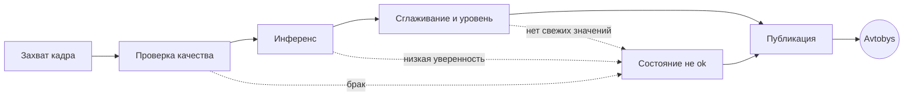
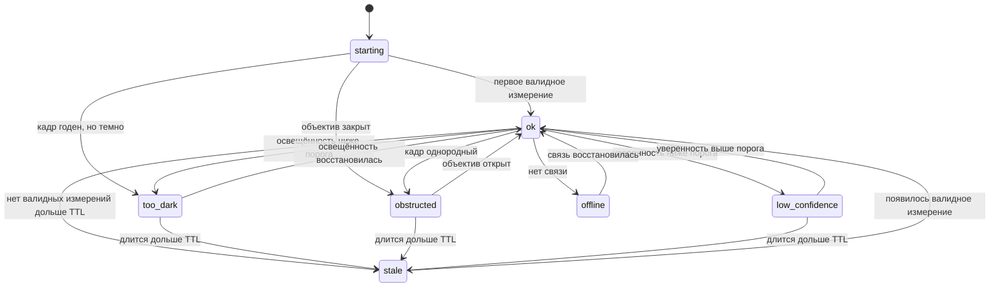

# Конвейер и состояния устройства

Статус: **draft v0.1, не реализовано**
Дата: 2026-09-03
Authority: подчиняется [`../GROUND_TRUTH.md`](../GROUND_TRUTH.md) и
[`../PRODUCT_SPEC.md`](../PRODUCT_SPEC.md)

## 0. Зачем отдельный файл

`PRODUCT_SPEC.md` раздел 6 перечисляет состояния, но не задаёт переходы между
ними. Перечень состояний это не спецификация: вся сложность в том, когда
происходит переход, что его отменяет и что при этом уходит наружу.

Проектируется до железа намеренно. Логика состояний не зависит ни от модели
автобуса, ни от выбранной сети, ни от угла камеры. Её можно написать и
протестировать на записанных файлах раньше, чем появится первое устройство.

## 1. Конвейер

Пять независимых стадий. Разделение важно: отказ одной стадии не должен
выглядеть как отказ другой.

| Стадия | Вход | Выход | Что может сломаться |
|---|---|---|---|
| Захват | камера | кадр + монотонная метка времени | камера не отвечает, шлейф, питание |
| Проверка качества | кадр | годен или причина отказа | темнота, засветка, смаз, закрытый объектив |
| Инференс | годный кадр | счёт + уверенность | модель, память, перегрев, таймаут |
| Сглаживание | ряд счётов | скор, уровень, признак `over_capacity` | нет валидных значений в окне |
| Публикация | сообщение | доставлено или нет | сеть, авторизация, приёмная сторона |

Стадии обязаны быть отдельными процессами под супервизором. Падение инференса
не должно останавливать захват, иначе теряется возможность отличить «модель
умерла» от «камера умерла».

## 2. Состояния

Правило, определяющее всю диаграмму: **наружу уходит либо валидное измерение,
либо явная причина его отсутствия.** Последнее известное значение не
переиспользуется никогда. Это записано в PRODUCT_SPEC 6 и здесь только
разворачивается в переходы.

### 2.1 Таблица переходов

| Из | В | Условие | Задержка подтверждения | Что публикуется |
|---|---|---|---|---|
| starting | ok | получено N валидных измерений | N = размер окна сглаживания | уровень, скор, confidence |
| ok | too_dark | средняя яркость ниже порога | 2 кадра подряд | `too_dark` |
| ok | obstructed | дисперсия кадра ниже порога | 3 кадра подряд | `obstructed` |
| ok | low_confidence | confidence ниже порога | 2 кадра подряд | `low_confidence` |
| ok | stale | нет валидных измерений дольше TTL | немедленно по таймеру | `stale` |
| любое | offline | публикация не проходит | по политике сети | ничего, приёмная сторона решает сама |
| не-ok | ok | условие снято | 2 подтверждающих кадра | уровень, скор, confidence |

Задержки подтверждения нужны, чтобы один плохой кадр не переключал состояние.
Все значения **кандидаты**, подбираются по записям.

### 2.2 Асимметрия подтверждения

Вход в деградированное состояние подтверждается быстрее, чем выход из него.
Причина продуктовая: показать `unknown` лишнюю секунду дёшево, показать
неверный уровень дорого. Та же асимметрия, что в PRODUCT_SPEC 8.2 для ошибок
модели.

## 3. Взаимодействие сглаживания и гистерезиса

Два механизма легко перепутать, они решают разные задачи.

| Механизм | Против чего | Где применяется |
|---|---|---|
| Сглаживание, медиана окна | выбросы счёта, человек прошёл под камерой | на счёте, до вычисления уровня |
| Гистерезис, дельта порога | мигание уровня на границе | на уровне, после вычисления скора |

Порядок обязателен: сначала сглаживание счёта, потом скор, потом уровень с
гистерезисом. Обратный порядок даёт мигающий уровень при стабильном счёте.

Ловушка: при выходе из `stale` окно сглаживания пусто. Публиковать уровень по
одному измерению нельзя, поэтому переход в `ok` требует заполнения окна. Это
и есть строка `starting -> ok` в таблице.

## 4. Бюджет задержки

Из PRODUCT_SPEC 5, целевое значение не более 30 с от измерения до видимости в
приложении. Разложение, все значения **кандидаты**:

| Участок | Кандидатный бюджет | Кто владеет |
|---|---|---|
| захват и проверка качества | 0.1 с | Sanas |
| инференс | 1.0 с | Sanas |
| сглаживание, ожидание окна | до 10 с | Sanas |
| публикация, сеть | 2 с | Sanas и оператор связи |
| приём и отображение в Avtobys | неизвестно | Innoforce |
| **итого известное** | **13.1 с** | |

Больше половины бюджета уходит на ожидание окна сглаживания, а не на модель.
Это стоит помнить, прежде чем оптимизировать сеть ради миллисекунд.

Неизвестный участок принадлежит Innoforce и вынесен в
`business/INNOFORCE_QUESTIONS.md` раздел 3.

## 5. Что можно проверить до появления железа

Полностью тестируется на записанных файлах и синтетике:

- все переходы таблицы 2.1, подачей последовательности кадров;
- отсутствие переиспользования последнего значения в любом не-`ok` состоянии;
- порядок сглаживания и гистерезиса;
- поведение при пустом окне после `stale`;
- сериализация сообщения по схеме PRODUCT_SPEC 7.1;
- поведение при разрыве связи.

Ни один из этих тестов не требует камеры, автобуса и обученной модели: счёт
подставляется заглушкой. Это самый дешёвый способ иметь работающий продукт в
день, когда модель наконец обучится.

## 6. Открыто

- Пороги яркости, дисперсии и уверенности. Подбираются по записям, которых нет.
- Размер окна сглаживания и TTL. Кандидаты в PRODUCT_SPEC 5.
- Политика при разрыве связи: отбрасывать или буферизовать. Рекомендация
  отбрасывать, решение за Innoforce.
- Что считать `offline` со стороны устройства, если приёмная сторона молчит.
- Поведение при выключении зажигания и на конечной остановке. Не обсуждалось.
