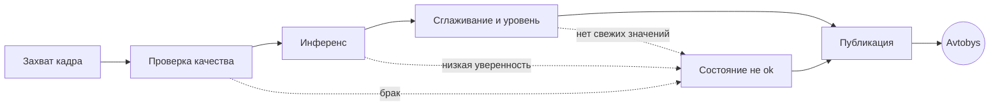
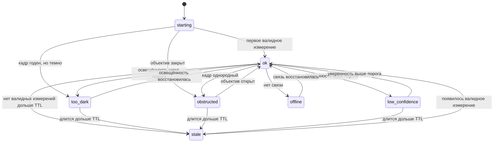

# Sanas: разработка

## Уточнение 12 сентября 2026: сначала штатные камеры

Дияс подтвердил отсутствие собственного оборудования и предложил использовать
изображение штатных салонных камер, которое видел на мониторе водителя.
Первый шаг — идентификация регистратора и разрешённый экспорт/доступ к каналу.
[Протокол теста](../deliverables/progress_2026-09-12/first_video_test.md) и
[паспорт исходных данных](../deliverables/progress_2026-09-12/capture_manifest.csv) готовы.
Подключение, пригодность ракурсов и место вычисления пока открыты.
Дальнейший текст о собственной потолочной камере описывает прежнюю гипотезу;
она остаётся резервным путём, физические проверки ещё не проводились.

Журнал 2026-09-12: на локальном Node.js проверен survey router/collector,
11/11 тестов; конфигурация синтетическая, сети Google в этих тестах нет.
Git-база `a409956665f7be42420e1211edeb1245de8e96c4` плюс незакоммиченные изменения.
Подробные результаты и ограничения — в [отчёте дня](../deliverables/progress_2026-09-12/report.md).

Техническое направление проверяет получение видео салона и строит
uplink-слой для Avtobys. Текущий код — воспроизводимые заготовки на ноутбуке,
а не готовое устройство и не подтверждённая production-архитектура.

## Физический продукт: schematic, CAD и сборка

**Сделано 12 сентября: [инженерный пакет A0](cad/gateway_rev_a/README.md).**
В нём нативные KiCad `.kicad_sch/.kicad_pro`, FreeCAD `.FCStd`, STEP,
STL основания/крышки, размерный SVG и BOM. Стендовый корпус под кандидат
Jetson/P3768: 128 × 118 × 58 мм, 152 мм с монтажными ушками; штатное питание
и разрешённый сетевой вход. ERC — 0 нарушений; проверены геометрия,
пересечения заданных габаритов, повторный импорт STEP и исходные координаты
четырёх креплений NVIDIA. Это проект до физической примерки, не автомобильная
квалификация и не подтверждение сетевого выхода регистратора.

Владелец отдельно подтвердил: агент помогает проектировать физический продукт,
включая электрическую схему, CAD, питание, компоненты и крепления.
Текущая [структурная схема шлюза](cad/gateway_architecture.svg) связывает
штатное видео с обработкой и Avtobys. Это rev 0.1 с открытыми интерфейсами,
а не принципиальная схема с готовой распиновкой.

| Инженерный пакет | Что разрабатываем | Что нужно для фиксации |
|---|---|---|
| Архитектура | Вход видео, захват/декодирование, вычисление, связь, питание | Модель регистратора, доступные выходы; выбор обработки на борту или сервере |
| Электрическая схема | Разъёмы, сигналы, питание, защита и преобразование; номиналы по расчётам и datasheets | Подтверждённые интерфейсы, источник питания и выбранные нагрузки |
| BOM и кабельный план | Точные модели компонентов, количества, совместимость, назначение каждого кабеля | Интерфейсы и результаты расчёта мощности; доступность компонентов проверяется при выборе |
| CAD | Компоновка модулей, корпус, стойки, крепления, доступ к разъёмам, разгрузка кабелей и охлаждение | Механические чертежи выбранных модулей, размеры доступного места и способ крепления |
| Собственная PCB, если нужна | Принципиальная схема, размещение/трассировка, ERC/DRC, производственные файлы | Доказанная необходимость собственной платы и подтверждённая схема |
| Проверка сборки | Посадки, коллизии, питание под нагрузкой, температура, поток видео, сбои и восстановление | Изготовленные/полученные части и физические измерения |

Существующие `camera_test_rig.scad` и `wiring_diagram.svg` относятся к прежнему
варианту собственной камеры с Jetson. Они сохраняются как резерв и не являются
готовым CAD/электрической схемой нового шлюза.

**Среда обновлена после установки владельцем, 12 сентября 2026:** KiCad 10.0.6
и FreeCAD 1.1.3 установлены. Проверены `kicad-cli`, импорт `pcbnew` через Python
KiCad, `freecadcmd`, импорт `FreeCAD` и `Part` через Python FreeCAD (OpenCascade
7.8.1). Команды пока запускать по абсолютным путям: добавление в PATH не требуется.
Пути и область проверки сохранены в [toolchain.json](cad/toolchain.json).
Это проверка доступности инструментов; готовность схемы/корпуса к изготовлению
проверяется отдельно на соответствующем инженерном проекте.

```powershell
& 'C:/Program Files/KiCad/10.0/bin/kicad-cli.exe' version
& 'C:/Program Files/FreeCAD 1.1/bin/python.exe' -c "import FreeCAD, Part; print(FreeCAD.Version())"
```

Ближайшая зависимость физического проекта — спецификация входа регистратора.
От неё зависит, требуется ли захват, какие нужны разъёмы и кабели, сколько
места и мощности занимает модуль. Не заменять её произвольным корпусом.

## Приём первого экспортированного видео

`src/sanas_video/intake.py` принимает локальный экспорт регистратора,
сохраняет технические сведения и SHA-256, извлекает кадры на 10, 30, 50 секундах
с записью их фактических времён и создаёт CSV для ручной разметки и HTML-просмотр.
Нужны Python, FFmpeg и FFprobe в PATH; дополнительные Python-библиотеки не нужны.

Пример из корня проекта после получения разрешённого экспорта
`data/local/cabin_export.mp4` (путь и ID заменить реальными):

```powershell
python development/src/sanas_video/intake.py data/local/cabin_export.mp4 --output development/experiments/artifacts/video-intake/bus01-session01-ch01 --session-id SESSION01 --vehicle-id BUS01 --channel-id CH01 --origin bus
```

Для короткого фрагмента явно задать времена, например `--times 1 3 5`.
Существующая папка результата не перезаписывается; каждый запуск получает
новую папку. Один запуск обрабатывает первый видеопоток одного файла.
Время кадров относительно начала контейнера не заменяет UTC/время регистратора.

В CSV независимо заполнить наблюдаемый счёт и оценки двух разметчиков.
Пустые поля не являются нулевым количеством пассажиров. Инструмент не
предсказывает загруженность и не суммирует пересекающиеся ракурсы.

Проверка: `python -m pytest development/src/tests/test_video_intake.py -q`.
На 12 сентября 2026: **14 passed** с реальным FFmpeg и искусственными роликами.
[Отчёт запуска](../deliverables/progress_2026-09-12/video_intake_check.md),
[демонстрационный просмотр](experiments/artifacts/video-intake/demo-20260912/review.html).

### Разметка кликами и сравнение двух разметчиков

Каждый новый intake также создаёт `annotate.html`. Откройте его рядом с папкой
`frames`, введите отдельный ID разметчика, отметьте людей и подтвердите каждый
кадр. Для точки сохраняются нормированные координаты, зона, поза и видимость.
Полностью невидимых людей не добавлять. Замечания о слепых зонах пишутся отдельно.
Черновик хранится в браузере; для надёжного переноса скачать JSON.
Разметчики работают независимо, до просмотра результатов друг друга.

Для уже существующей папки intake:

```powershell
python development/src/sanas_video/annotations.py build development/experiments/artifacts/video-intake/demo-20260912
```

Сравнение двух скачанных JSON (пути заменить своими):

```powershell
python development/src/sanas_video/annotations.py compare development/experiments/artifacts/video-intake/bus01-session01-ch01 data/local/rater1.json data/local/rater2.json --output development/experiments/artifacts/video-intake/comparison01.json
```

Сравнение проверяет хеш исходника/кадров и ID проекта, учитывает только
подтверждённые обоими кадры, выдаёт расхождения общего счёта и числа отметок
по зонам. Это согласие разметчиков, а не точность модели или совпадение точек.
Различимые по другим признакам люди включены в общий счёт и показаны отдельно.
Ноль требует подтверждения; непроверенный кадр исключается, не заменяется нулём.
Новый JSON результата не перезаписывает существующий файл.

Проверка 2026-09-12: **39 тестов** приёма видео и разметки прошли. Дополнительно
проверен интерфейс в Chrome на 1280px и 390px, скачаны тестовые экспорты двух
разметчиков и выполнена команда сравнения. [Отчёт проверки](../deliverables/progress_2026-09-12/annotation_check.md).

## Что реализовано

### Counting baseline

`src/sanas_baseline/` — минимальный end-to-end baseline:

- данные: публичный DISCO, уже находящийся в `data/external/`; это наружные
  сцены с сильным domain gap относительно салона автобуса;
- split из архива: 1 435 train / 200 validation / 300 test;
- target: сумма density map, то есть число людей на изображении;
- модель: случайно инициализированный ResNet-18 до stride 8 и двухслойная
  density head, без скачивания ImageNet-весов;
- нижняя граница: `ConstantPredictor`, возвращающий среднее train split;
- метрики: MAE, RMSE и `level_accuracy` с порогами, заданными вызывающим кодом.

CPU-запуск из `development/src` в PowerShell:

```powershell
cd C:\Users\User\OneDrive\Desktop\me\Sanash\development\src
C:\Python313\python.exe -m sanas_baseline.prepare --train 16 --val 8 --test 8
C:\Python313\python.exe -m sanas_baseline.train --run-id smoke-20260902
C:\Python313\python.exe -m sanas_baseline.evaluate --checkpoint ..\experiments\artifacts\baseline\smoke-20260902\checkpoint.pt --split test
```

`prepare` читает выбранные элементы напрямую из архива и не распаковывает его
целиком. `--train 0` означает полный split. Подготовленные данные записываются
в `data/interim/disco_baseline/`, результаты — в `development/experiments/artifacts/baseline/<run-id>/`;
обе папки исключены из Git. Нужны `torch`, `torchvision`, `numpy`, `scipy` и
`Pillow`; lockfile пока отсутствует.

Density map хранит людей на пиксель, поэтому при изменении разрешения необходимо
сохранять её сумму. `resize_density_preserving_sum` агрегирует карту по площади
и нормализует итог; обычный resize разрушает count label.

### Uplink

`src/sanas_uplink/` реализует локальный черновик сообщения Avtobys, проверку
JSON Schema и машину состояний из `PIPELINE_STATES.md`.
Код не обращается к камере, модели, сети или файлам. Транспорт MQTT/HTTP/polling,
авторизация, таблица device-to-vehicle и TTL остаются открытыми до ответа
Innoforce. Все пороги состояний — кандидаты, а не измеренные значения.

Проверка из корня проекта:

```powershell
C:\Python313\python.exe -m pytest development\src\tests -q
```

Текущий результат: 456 passed, 2 failed. Оба падения фиксируют открытые
противоречия в `PIPELINE_STATES.md`: задержки входа/выхода из деградированного
состояния не удовлетворяют заявленному порядку, а переход `любое → offline` из
таблицы отсутствует для части состояний в диаграмме. Тесты прямо запрещают
маскировать это без продуктового решения.

## Инженерия: сбор исходных данных перед CAD

Статус на 2026-09-10: **proposed, физически не проверено**.
[`cad/camera_test_rig.scad`](cad/camera_test_rig.scad) — параметрическая
испытательная оснастка; [`cad/wiring_diagram.svg`](cad/wiring_diagram.svg) —
схема подключения. Готового продуктового корпуса и крепления нет. По текущему
сообщению владельца проекта отсутствуют реальные фотографии автобуса,
оборудования и первой сборки. В `cad/` нет экспортов STL/STEP и сборочных
рендеров. Команды OpenSCAD и FreeCAD не обнаружены в PATH; это не проверка
всех установленных программ.

Следующий результат — заполненный протокол ниже с исходными фото.
Неизвестное записывать как `TBD`, не заменять типовыми размерами из SCAD.
Все линейные размеры — в мм. Для каждого замера указывать инструмент,
оценку погрешности и файл фото/эскиза. Фото с рулеткой дополняет замер;
размеры посадок платы и отверстий снимать штангенциркулем.

### Паспорт обмера

- Дата, исполнитель: `TBD`.
- Модель автобуса и идентификатор обследованного экземпляра: `TBD`.
- Идентификатор точки установки, например `P01`: `TBD`.
- Модель/ревизия камеры, объектива и Jetson с платой-носителем: `TBD`.
- Папка исходных фото и кадров: `TBD`.
- База координат на эскизе салона и направление к передней части: `TBD`.

Для нескольких точек установки копировать протокол с новым ID. Имена файлов
связывать с ID точки и кодом строки, например `P01_F03_rail.jpg`.

### Фото и размеры

| Код | Что собрать | Значение / файл | Инструмент, погрешность, примечание |
|---|---|---|---|
| F01 | Фото салона от передней части к задней | TBD | Общий вид |
| F02 | Фото салона от задней части к передней | TBD | Общий вид |
| F03 | Потолок, точка крепления и поручень крупно с рулеткой | TBD | Общий вид + крупный план; отметить точку на обоих |
| F04 | Камера с обеих сторон и сбоку с линейкой | TBD | Видны разъём, объектив, маркировка |
| F05 | Jetson и место под корпус с линейкой | TBD | Видны охлаждение, порты и соседние предметы |
| M01 | Высота от пола до потолка в точке установки | TBD | Указать обе поверхности |
| M02 | Внутренняя ширина и длина обследуемого салона | TBD | Указать границы измерения на эскизе |
| M03 | Диаметр поручня | TBD | Проверить в двух направлениях; отметить покрытие |
| M04 | Зазор от верхней поверхности поручня до потолка | TBD | Измерять в месте будущего хомута |
| M05 | Длина свободного прямого участка поручня | TBD | Учесть изгибы, стойки, существующие крепления |
| M06 | Положение точки установки относительно базы салона | TBD | Продольное, поперечное положение и высота |
| M07 | Плата камеры: ширина × высота × толщина | TBD | Подписать оси на фото лицевой стороны |
| M08 | Каждое отверстие камеры: диаметр и координаты центра | TBD | От одного отмеченного угла платы; не предполагать симметрию |
| M09 | Объектив: диаметр, выступ от платы, положение центра | TBD | Вынос входного зрачка отдельно: TBD до калибровки/чертежа |
| M10 | Выступы компонентов спереди/сзади и габариты CSI-разъёма | TBD | Учесть открытие защёлки и направление выхода шлейфа |
| M11 | Jetson в фактической комплектации: габариты и отверстия | TBD | С радиатором, вентилятором, накопителем; координаты от одной базы |
| M12 | Доступный объём под корпус: ширина × длина × высота | TBD | Отдельно место для штекеров, обслуживания и потока воздуха |
| M13 | Трасса CSI и питания, длина по маршруту, места фиксации | TBD | Фото/эскиз; модель шлейфа и допустимый изгиб пока TBD |
| M14 | Возможное место независимого крепления страховочного троса | TBD | Фото и описание опоры; пригодность ещё не подтверждена |

### Пробные кадры из точки установки

Система углов для этого протокола: `0°` — оптическая ось вертикально вниз;
`30°`, `45°`, `60°` — отклонение от вертикали в одном записанном направлении
вдоль салона. Подпись положения на оснастке не заменяет измерение. Записать
базу уклономера и её связь с оптической осью; если связь неизвестна, фактический
угол оптической оси остаётся `TBD`.

Сохранять исходные кадры с одинаковыми разрешением, ориентацией и настройками
камеры, из одной точки и с максимально неизменной сценой. Для каждого положения
фиксировать высоту объектива над полом; любое смещение точки съёмки записывать.

| Целевой угол от вертикали | Измеренный угол / база измерения | Направление наклона | Высота объектива, мм | Исходный файл | Закрытые зоны / помехи |
|---|---|---|---|---|---|
| 0° | TBD | TBD | TBD | TBD | TBD |
| 30° | TBD | TBD | TBD | TBD | TBD |
| 45° | TBD | TBD | TBD | TBD | TBD |
| 60° | TBD | TBD | TBD | TBD | TBD |

Общие параметры серии: камера/объектив `TBD`, разрешение `TBD`, ориентация
длинной стороны кадра `TBD`, настройки экспозиции `TBD`, освещение `TBD`,
состояние салона `TBD`. Если камера ещё не работает, сначала собрать обмеры;
серию кадров оставить открытой, угол продуктового крепления не фиксировать.

### Переход к инженерному пакету

После обмеров можно проектировать посадки и испытательную сборку. После серии
кадров — выбирать угол и компоновку продуктового варианта. Противоречия между
фото, обмером и чертежом компонента разрешать до фиксации соответствующей посадки.

- [ ] Крепление камеры к измеренному поручню или подтверждённой опоре потолка.
- [ ] Регулируемый узел наклона с фиксацией и проверкой полного хода.
- [ ] Корпус Jetson с вентиляцией, доступом к портам и креплением.
- [ ] Крепление CSI и разгрузка натяжения, проверенные на выбранном шлейфе.
- [ ] Страховочный трос и его независимая точка крепления.
- [ ] Общая сборка с проверкой пересечений, обзора и доступности крепежа.
- [ ] Исходники SCAD и твердотельная CAD-модель для STEP; печатные STL по деталям.
- [ ] Exploded view, размерные чертежи и BOM с количеством, материалом,
      размерами крепежа и статусом каждой позиции.
- [ ] Первая печать, реальные фотографии сборки, проверка посадок и углов,
      запись температуры Jetson под нагрузкой и перечень доработок.

Экспорты проверять повторным открытием: единицы и контрольный размер, геометрия
и соответствие ревизии. Наличие файла не подтверждает пригодность к печати или
монтажу. До физических проверок сборка сохраняет статус `proposed`; рендер
не засчитывается как фотография изготовленного экземпляра.

## Документы направления

- `TECH_DATA_OPTIONS.md` — датасеты, модели, аппаратные
  кандидаты и engineering gates.
- `datasets.md` — provenance, лицензии, хеши и фактический
  локальный инвентарь данных.
- `DATASET_CARD.md` и
  `LABELING_GUIDE.md` — черновики собственного pilot set и
  его разметки.
- `CAMERA_GEOMETRY.md`,
  `HARDWARE_TABLES.md` и `cad/` — геометрия, компоненты и
  макет камеры.
- `LICENSE_DECISION.md` — открытые лицензионные решения.
- `experiments/log.md` — append-only журнал запусков и
  архитектурных решений.

## Что этот код не доказывает

- Нет собственных кадров из автобуса, сравнения моделей на целевом домене или
  согласованной пятиуровневой разметки.
- Нет измерений latency, memory и power на Jetson, TensorRT-export и inference
  service.
- Smoke run на 16 изображениях проверяет проводку pipeline; его метрики нельзя
  выдавать за качество crowd counting.
- ResNet-18 — reference point, а не выбранная production model.
- Старые `scripts/run_door_apc.py`, `build_zip_index.py` и `build_kernels.py`
  относятся к отменённому door/depth-треку и сейчас неработоспособны.

## Consolidated Markdown source archive

The original contents of the removed Markdown files are preserved below. Each collapsible block records its former path, encoding, size, and SHA-256.

| Former path | Bytes | Encoding | SHA-256 |
|---|---:|---|---|
| `development/PIPELINE_STATES.md` | 10429 | UTF-8 | `9faca0d6bfb723b2b69e74ac41d60614c239e3155f3c287314fb8dde685f25fd` |
| `development/CAMERA_GEOMETRY.md` | 11501 | UTF-8 | `f4f8bfcc09379804f1a53d651e0dcc45daae5f17c31267154abf560adbd0a7a5` |
| `development/HARDWARE_TABLES.md` | 19920 | UTF-8 | `2b8ec5670e8f3a9e32b53aaa5a408fe7c9b6cd7bd00f55ea5e56694ba88f6538` |
| `development/DATASET_CARD.md` | 8987 | UTF-8 | `51de36f4ff99342b2e70c4621315ca31793417bcd01d7b7e7cbc896e561f0633` |
| `development/LABELING_GUIDE.md` | 14663 | UTF-8 | `41601b186771a91fa29fb0d3748643cf34adaad3bb8b21d24a747b1b8d843c46` |
| `development/datasets.md` | 23744 | UTF-8 | `f4a3f10e7c7e96f5f1faf1308b6843d840fa9797979ea98586a082279126f73f` |
| `development/TECH_DATA_OPTIONS.md` | 13552 | UTF-8 | `b8f4851eb10bbea159aa4bf8374bdabc138536cf71d3fff6ffe7bd326fc77a9d` |
| `development/LICENSE_DECISION.md` | 11166 | UTF-8 | `3dd29928343850bfcdcae7ec5806ee514ade68cb872be6216fe1ecfa669ca941` |
| `development/cad/wiring_diagram.md` | 9567 | UTF-8 | `9f8b027455c8be364767e5037cfd77de4848c35111c182887792af70d2fc3722` |
| `development/experiments/log.md` | 102921 | UTF-8 | `b3a313e277800740011484bb32d6a604a62614820e014495d1b648ae2baab6e4` |

<details>
<summary><code>development/PIPELINE_STATES.md</code> - original text</summary>

# Конвейер и состояния устройства

Статус: **draft v0.1, не реализовано**
Дата: 2026-09-03
Authority: подчиняется [`../GROUND_TRUTH.md`](../GROUND_TRUTH.md) и
[`../PRODUCT_SPEC.md`](../PRODUCT_SPEC.md)

## 0. Зачем отдельный файл

`PRODUCT_SPEC.md` раздел 6 перечисляет состояния, но не задаёт переходы между
ними. Перечень состояний это не спецификация: вся сложность в том, когда
происходит переход, что его отменяет и что при этом уходит наружу.

Проектируется до железа намеренно. Логика состояний не зависит ни от модели
автобуса, ни от выбранной сети, ни от угла камеры. Её можно написать и
протестировать на записанных файлах раньше, чем появится первое устройство.

## 1. Конвейер

Пять независимых стадий. Разделение важно: отказ одной стадии не должен
выглядеть как отказ другой.



| Стадия | Вход | Выход | Что может сломаться |
|---|---|---|---|
| Захват | камера | кадр + монотонная метка времени | камера не отвечает, шлейф, питание |
| Проверка качества | кадр | годен или причина отказа | темнота, засветка, смаз, закрытый объектив |
| Инференс | годный кадр | счёт + уверенность | модель, память, перегрев, таймаут |
| Сглаживание | ряд счётов | скор, уровень, признак `over_capacity` | нет валидных значений в окне |
| Публикация | сообщение | доставлено или нет | сеть, авторизация, приёмная сторона |

Стадии обязаны быть отдельными процессами под супервизором. Падение инференса
не должно останавливать захват, иначе теряется возможность отличить «модель
умерла» от «камера умерла».

## 2. Состояния



Правило, определяющее всю диаграмму: **наружу уходит либо валидное измерение,
либо явная причина его отсутствия.** Последнее известное значение не
переиспользуется никогда. Это записано в PRODUCT_SPEC 6 и здесь только
разворачивается в переходы.

### 2.1 Таблица переходов

| Из | В | Условие | Задержка подтверждения | Что публикуется |
|---|---|---|---|---|
| starting | ok | получено N валидных измерений | N = размер окна сглаживания | уровень, скор, confidence |
| ok | too_dark | средняя яркость ниже порога | 2 кадра подряд | `too_dark` |
| ok | obstructed | дисперсия кадра ниже порога | 3 кадра подряд | `obstructed` |
| ok | low_confidence | confidence ниже порога | 2 кадра подряд | `low_confidence` |
| ok | stale | нет валидных измерений дольше TTL | немедленно по таймеру | `stale` |
| любое | offline | публикация не проходит | по политике сети | ничего, приёмная сторона решает сама |
| не-ok | ok | условие снято | 2 подтверждающих кадра | уровень, скор, confidence |

Задержки подтверждения нужны, чтобы один плохой кадр не переключал состояние.
Все значения **кандидаты**, подбираются по записям.

### 2.2 Асимметрия подтверждения

Вход в деградированное состояние подтверждается быстрее, чем выход из него.
Причина продуктовая: показать `unknown` лишнюю секунду дёшево, показать
неверный уровень дорого. Та же асимметрия, что в PRODUCT_SPEC 8.2 для ошибок
модели.

## 3. Взаимодействие сглаживания и гистерезиса

Два механизма легко перепутать, они решают разные задачи.

| Механизм | Против чего | Где применяется |
|---|---|---|
| Сглаживание, медиана окна | выбросы счёта, человек прошёл под камерой | на счёте, до вычисления уровня |
| Гистерезис, дельта порога | мигание уровня на границе | на уровне, после вычисления скора |

Порядок обязателен: сначала сглаживание счёта, потом скор, потом уровень с
гистерезисом. Обратный порядок даёт мигающий уровень при стабильном счёте.

Ловушка: при выходе из `stale` окно сглаживания пусто. Публиковать уровень по
одному измерению нельзя, поэтому переход в `ok` требует заполнения окна. Это
и есть строка `starting -> ok` в таблице.

## 4. Бюджет задержки

Из PRODUCT_SPEC 5, целевое значение не более 30 с от измерения до видимости в
приложении. Разложение, все значения **кандидаты**:

| Участок | Кандидатный бюджет | Кто владеет |
|---|---|---|
| захват и проверка качества | 0.1 с | Sanas |
| инференс | 1.0 с | Sanas |
| сглаживание, ожидание окна | до 10 с | Sanas |
| публикация, сеть | 2 с | Sanas и оператор связи |
| приём и отображение в Avtobys | неизвестно | Innoforce |
| **итого известное** | **13.1 с** | |

Больше половины бюджета уходит на ожидание окна сглаживания, а не на модель.
Это стоит помнить, прежде чем оптимизировать сеть ради миллисекунд.

Неизвестный участок принадлежит Innoforce и вынесен в
`business/INNOFORCE_QUESTIONS.md` раздел 3.

## 5. Что можно проверить до появления железа

Полностью тестируется на записанных файлах и синтетике:

- все переходы таблицы 2.1, подачей последовательности кадров;
- отсутствие переиспользования последнего значения в любом не-`ok` состоянии;
- порядок сглаживания и гистерезиса;
- поведение при пустом окне после `stale`;
- сериализация сообщения по схеме PRODUCT_SPEC 7.1;
- поведение при разрыве связи.

Ни один из этих тестов не требует камеры, автобуса и обученной модели: счёт
подставляется заглушкой. Это самый дешёвый способ иметь работающий продукт в
день, когда модель наконец обучится.

## 6. Открыто

- Пороги яркости, дисперсии и уверенности. Подбираются по записям, которых нет.
- Размер окна сглаживания и TTL. Кандидаты в PRODUCT_SPEC 5.
- Политика при разрыве связи: отбрасывать или буферизовать. Рекомендация
  отбрасывать, решение за Innoforce.
- Что считать `offline` со стороны устройства, если приёмная сторона молчит.
- Поведение при выключении зажигания и на конечной остановке. Не обсуждалось.

</details>

<details>
<summary><code>development/CAMERA_GEOMETRY.md</code> - original text</summary>

# Геометрия камеры: что видно из потолка автобуса

Статус: **расчёт на бумаге, не измерение**
Дата: 2026-09-02
Скрипт: [`scripts/camera_geometry.py`](scripts/camera_geometry.py)
Authority: подчиняется [`../GROUND_TRUTH.md`](../GROUND_TRUTH.md)

## 0. Зачем это посчитано сейчас

Ground Truth блокер 2: геометрия камеры. Железа нет, доступа к автобусу нет,
но тригонометрию можно посчитать сегодня и до покупки узнать, не является ли
выбранная схема заведомо нерабочей.

Расчёт **не заменяет** FOV-тест в реальном салоне. Он говорит только, какой
тест надо ставить и какого результата ждать.

## 1. Входные данные и их статус

| Величина | Значение | Статус |
|---|---|---|
| Сенсор IMX219 | 3280 x 2464 px | проверено, product page Waveshare |
| Заявленный FoV | 160° по диагонали | проверено, product page + TECH_DATA_OPTIONS |
| Высота потолка салона | 2.30 м | **предположение** |
| Ширина салона | 2.50 м | **предположение** |
| Длина салона | 11.50 м | **предположение**, 12-метровый одиночный автобус |
| Голова стоящего | 1.70 м | **предположение** |
| Голова сидящего | 1.25 м | **предположение** |
| Ширина головы | 0.20 м | **предположение** |
| Порог детекции | 12 px на голову | **эмпирическое правило**, не измерение |

Все предположения заменяются рулеткой в реальном автобусе. Ни один вывод ниже
не переживёт сильного расхождения по высоте потолка.

## 2. Первая ловушка: 160° это не то, что кажется

160° заявлены **по диагонали** и относятся к fisheye-объективу. Обычная
прямолинейная формула `ширина = 2 * H * tan(FoV / 2)` к нему неприменима.

Модель equidistant fisheye `r = f * theta` даёт из диагональных 160°:

- горизонтальный FoV 127.9°
- вертикальный FoV 96.1°
- угловое разрешение 25.6 px на градус

Разница с наивным расчётом:

| Способ | Покрытие на 1 м высоты, длинная ось |
|---|---|
| Прямолинейная формула для 160° | 11.34 м |
| Equidistant fisheye | 4.09 м |

**Наивный расчёт завышает покрытие в 2.77 раза.** Если BOM или презентация
где-то опирались на первое число, это надо найти и исправить.

Реальный объектив не является точно equidistant. Настоящие цифры даёт
калибровка через OpenCV fisheye каждого физического модуля с сохранением `K`,
`D` и reprojection error.

## 3. Главный результат: головы близко к объективу

Ключ ко всему разделу: камера считает не пол, а головы. Голова стоящего
человека находится в 0.6 м от потолка, не в 2.3 м. Покрытие пропорционально
этому расстоянию, поэтому оно катастрофически меньше, чем покрытие пола.

Камера смотрит строго вниз, длинная ось сенсора вдоль автобуса:

| Плоскость | Расстояние от камеры | Вдоль автобуса | Поперёк |
|---|---|---|---|
| пол | 2.30 м | 9.42 м | 2.50 м, упирается в стены |
| головы сидящих | 1.05 м | 4.30 м | 2.34 м |
| головы стоящих | 0.60 м | 2.46 м | 1.34 м |

Одна потолочная камера, смотрящая вниз, видит **около 2.5 м длины салона на
уровне голов стоящих** при заявленном салоне 11.5 м.

Сколько таких камер нужно на весь салон, нижняя оценка без перекрытия для
сшивки:

| Плоскость | Камер |
|---|---|
| головы сидящих | 6 |
| головы стоящих | 10 |

Это противоречит решению от 2026-08-31 о схеме с одной камерой, если целью
является счёт по всему салону.

## 4. Наклонный вариант

Стандартная схема видеонаблюдения в транспорте: камера в передней части
потолка, наклонена вниз вдоль прохода. Расчёт дальности при камере на 0.6 м
выше плоскости голов стоящих:

| Наклон от вертикали | Ближняя граница | Дальняя граница | Покрывает салон |
|---|---|---|---|
| 0° | -1.23 м | 1.23 м | нет |
| 15° | -0.69 м | 3.08 м | нет |
| 30° | -0.40 м | не ограничена | да |
| 45° | -0.21 м | не ограничена | да |
| 60° | -0.04 м | не ограничена | да |
| 75° | 0.12 м | не ограничена | да |

При наклоне от 30° поле зрения пересекает горизонталь, и геометрия перестаёт
ограничивать дальность. Отрицательная ближняя граница означает, что камера
видит и позади точки собственного крепления.

### Что тогда ограничивает

Не геометрия, а пиксели и перекрытие людьми.

| Вдоль прохода | Наклонная дальность | Пикселей на голову | Годно |
|---|---|---|---|
| 1 м | 1.17 м | 252 | да |
| 4 м | 4.04 м | 73 | да |
| 8 м | 8.02 м | 37 | да |
| 12 м | 12.01 м | 25 | да |
| 15 м | 15.01 м | 20 | да |

По разрешению голова опускается до порога 12 px только на 24.5 м. Для
11.5-метрового салона разрешения хватает с запасом.

**Реальный ограничитель это окклюзия.** На пологом угле пассажиры закрывают
друг друга, и чем полнее автобус, тем хуже. Это ровно тот режим, ради которого
продукт существует: уровни 4 и 5. Посчитать окклюзию на бумаге нельзя, она
зависит от расстановки сидений, роста людей и зимней одежды. Её меряют съёмкой.

## 5. Фундаментальный компромисс

| Схема | Покрытие | Окклюзия | Камер |
|---|---|---|---|
| строго вниз | плохое | лучшая возможная | 6-10 |
| наклон 30-45° | достаточное | умеренная | 1-2 |
| наклон 60-75° | избыточное | тяжёлая на дальнем конце | 1 |

Вертикальный вид почти не имеет окклюзии, потому что головы не перекрываются
сверху, но видит мало. Наклон видит всё, но теряет дальний конец при полном
салоне. Промежуточные углы 30-45° выглядят рабочим компромиссом, и именно их
надо снимать в тесте в первую очередь.

Это меняет смысл слова «потолочная камера» в Ground Truth 3.1. Решение о
потолочном RGB остаётся в силе, но **угол установки не является деталью
монтажа, он определяет, какой target вообще достижим.**

## 6. Что из этого следует для продукта

1. Схема «одна камера, строго вниз, счёт по всему салону» геометрически не
   работает при принятых предположениях. Нужно выбрать одно из трёх:
   наклонная установка, несколько камер, или сужение target до видимой зоны.
2. `PRODUCT_SPEC.md` 9.1 (целевая величина) нельзя закрывать раньше, чем
   выбран угол. Порядок: геометрия, потом target, потом разметка.
3. Порог из TECH_DATA_OPTIONS «не менее 95% точек passenger grid пригодны для
   разметки» остаётся правильным гейтом, и по этому расчёту надирная схема с
   одной камерой его не пройдёт.

## 7. Что проверить в первом же реальном тесте

По убыванию важности:

1. Рулеткой: высота потолка, ширина, длина салона, высота до поручней. Все
   расчёты выше висят на этих числах.
2. Есть ли вообще место под потолком: поручни, люки, вентиляция, освещение.
3. Калибровка объектива через OpenCV fisheye, сохранить `K`, `D`, снимки,
   reprojection error.
4. Одна и та же сцена при наклонах 0°, 30°, 45°, 60° с одной точки.
5. Пустой салон, половина, полный. Окклюзию видно только на полном.
6. Ночь и контровой свет из окон.
7. Разметить passenger grid на полу и посчитать долю видимых точек.

## 8. Ограничения этого расчёта

- Все размеры салона предположены, не измерены.
- Модель объектива идеализирована, реальная дисторсия отличается.
- Окклюзия не моделируется вообще.
- Порог 12 px на голову это правило, а не измеренный порог для конкретной
  модели.
- Не учтены смаз при движении, дрожание, загрязнение объектива и блики.
- Не рассматривались другие объективы. Если наклонная схема не пройдёт, менять
  надо в том числе объектив, а не только угол.

</details>

<details>
<summary><code>development/HARDWARE_TABLES.md</code> - original text</summary>

# Аппаратные таблицы прототипа

Статус: **proposed, ни одна позиция не куплена и ни одно число не измерено**
Дата: 2026-09-03
Authority: подчиняется [`../GROUND_TRUTH.md`](../GROUND_TRUTH.md) раздел 4
Смежные файлы: [`cad/wiring_diagram.md`](cad/wiring_diagram.md),
[`cad/camera_test_rig.scad`](cad/camera_test_rig.scad),
[`TECH_DATA_OPTIONS.md`](TECH_DATA_OPTIONS.md)

## 0. Как читать этот файл

Статусы те же, что в GROUND_TRUTH.md раздел 1: решено, проверено, кандидат,
открыто. Столбец «подтверждено» отвечает на один вопрос: существует ли
первичный источник или измерение. Ответ «нет» встречается чаще, чем «да», и
это правильное состояние проекта на сегодня, а не пробел в документе.

Пустая ячейка цены означает, что проверенной цены нет. Правдоподобная цифра
здесь была бы вреднее пустоты: по ней начнут считать бюджет.

Ни одна таблица ниже не является результатом измерения. Все числа в бюджете
питания это арифметика над сценариями, а не потребление конкретного железа.

## 1. BOM прототипа

Основа: решение 2026-08-31 о четырёх позициях плюс то, без чего цепь не
замыкается физически.

| # | Позиция | Назначение | Статус | Подтверждено | Чем подтверждать | Цена |
|---|---|---|---|---|---|---|
| 1 | Jetson Orin Nano Super Developer Kit | инференс, запись, хранение | решено, не проверено | частично: вход 9-20 V, ambient 0-35 C, отсутствие NVENC по carrier board spec и FAQ | покупка, сборка, стендовый прогон | |
| 2 | Waveshare IMX219-160 | дневная камера | решено как кандидат, не проверено | 8 MP и 160 град по диагонали по странице производителя | драйвер на текущем JetPack, реальные FPS, первый кадр | |
| 3 | NVMe SSD | boot и запись кадров | решено концептуально | нет | спецификация слота кита, даташит накопителя, ресурс записи | |
| 4 | USB-C PD power bank 65 W+ | автономное питание прототипа | решено, не проверено | нет | замер под нагрузкой, поведение при простое | |
| 5 | USB-C PD trigger 12 или 15 V + barrel plug | без него банка не питает кит | открыто, обязателен | нет | даташит модуля, замер напряжения до подключения кита | |
| 6 | Кабель USB-C to USB-C | питание от банки к триггеру | открыто | нет | спецификация кабеля на нужный ток, наличие E-marker | |
| 7 | Шлейф CSI, при необходимости переходной | камера к киту | открыто | нет | сверка числа контактов и шага на камере и на ките | |
| 8 | Испытательная оснастка, печать | фиксированные углы 0/30/45/60 | proposed | нет | печать, обмер, проверка уклономером | |
| 9 | Крепёж: ось и штифт M5, винты M2, крепёж M4 | сборка оснастки | proposed | нет | по фактическим толщинам после печати | |
| 10 | Хомут или стяжка под поручень | крепление без сверления | открыто | нет | обмер поручня в реальном автобусе | |
| 11 | Страховочный трос | чтобы оснастка не упала на пассажира | proposed, обязателен | нет | вес собранной оснастки, разрывная нагрузка троса | |
| 12 | Ваттметр в разрыв DC | бюджет питания на стенде | кандидат | нет | не едет в автобус, нужен только на стенде | |
| 13 | Уклономер или цифровой угломер | измерение фактического угла | proposed, обязателен | нет | без него угол на кадре остаётся заявленным, а не измеренным | |
| 14 | Рулетка 5 м | обмер салона | proposed, обязателен | нет | CAMERA_GEOMETRY.md 7.1 | |
| 15 | Калибровочная мишень, шахматная доска | калибровка fisheye | proposed | нет | OpenCV fisheye, сохранять K, D и reprojection error | |
| 16 | Хост для прошивки NVMe boot | подготовка кита | открыто | нет | рабочая машина под Windows 11, путь не выбран | |

Не входит в BOM намеренно: DC-DC 24 -> 12 V, предохранитель, штатная проводка
автобуса, ИК-подсветка, вторая камера, модем. Причины в
[`cad/wiring_diagram.md`](cad/wiring_diagram.md) раздел 5.

## 2. Бюджет питания

### 2.1 Потребление по узлам

| Узел | Потребление | Статус | Чем измерять |
|---|---|---|---|
| Jetson Orin Nano, модуль | заявленные режимы 7 / 15 / 25 Вт | не подтверждено в репозитории | Jetson Orin Nano Series Datasheet, затем `tegrastats` под нагрузкой |
| Kit целиком от barrel jack | TBD | открыто | ваттметр в разрыв DC, отдельно в простое, при инференсе и при записи |
| Камера IMX219-160 | TBD | открыто | замер разницы с камерой и без неё |
| NVMe SSD при непрерывной записи | TBD | открыто | замер разницы, отдельно пиковый ток при записи |
| Потери в PD trigger и кабеле | TBD | открыто | сравнение мощности на выходе банки и на входе кита |
| **Суммарное среднее** | **TBD** | **открыто** | суточный прогон с логированием, а не пиковая цифра |

Ключевой момент: для автономности важна не пиковая, а **средняя** мощность на
цикле работы. Цикл зависит от частоты инференса и объёма записи, а они не
зафиксированы: PRODUCT_SPEC.md 5 даёт кандидатное значение 1 кадр в 2 с, но не
решение. Пока цикл не определён, среднее потребление посчитать нельзя даже
после покупки железа.

Отдельный риск, который не виден в ваттах: у Orin Nano нет NVENC, поэтому
непрерывный H.264 это программное кодирование, конкурирующее с инференсом за
CPU и питание (TECH_DATA_OPTIONS.md). Режим записи меняет бюджет питания,
а не только диск.

### 2.2 Время работы против ёмкости

Ёмкость power bank в Ground Truth не выбрана, поэтому одного числа
автономности не существует. Ниже сетка, а не ответ.

Арифметика: `часы = ёмкость_Вт·ч * КПД / средняя_мощность_Вт`.
КПД цепи принят **0.85** как ПРЕДПОЛОЖЕНИЕ. Он включает потери
преобразования в банке, в PD trigger и в кабеле. Подтверждается только
замером: подать известную нагрузку и сравнить отданную энергию с паспортной.

Отдельная ловушка: паспортная ёмкость банок часто указана в мА·ч при
напряжении ячейки, а не в Вт·ч. Пересчёт `Вт·ч = мА·ч * 3.6 / 1000` при
3.6 В на ячейку, и брать надо цифру Вт·ч с корпуса, а не маркетинговую мА·ч.

| Ёмкость, Вт·ч | при 10 Вт | при 15 Вт | при 20 Вт | при 25 Вт |
|---:|---:|---:|---:|---:|
| 50 | 4.2 ч | 2.8 ч | 2.1 ч | 1.7 ч |
| 75 | 6.4 ч | 4.2 ч | 3.2 ч | 2.5 ч |
| 100 | 8.5 ч | 5.7 ч | 4.2 ч | 3.4 ч |
| 150 | 12.8 ч | 8.5 ч | 6.4 ч | 5.1 ч |
| 200 | 17.0 ч | 11.3 ч | 8.5 ч | 6.8 ч |
| 250 | 21.2 ч | 14.2 ч | 10.6 ч | 8.5 ч |

Обратная таблица, требуемая ёмкость в Вт·ч при том же КПД:

| Нужно продержаться | при 10 Вт | при 15 Вт | при 20 Вт | при 25 Вт |
|---|---:|---:|---:|---:|
| 4 ч, одна смена наблюдения | 47 | 71 | 94 | 118 |
| 8 ч, рабочий день | 94 | 141 | 188 | 235 |
| 12 ч, выпуск автобуса на линию | 141 | 212 | 282 | 353 |
| 24 ч, суточный прогон на стенде | 282 | 424 | 565 | 706 |

Как этим пользоваться: сначала измерить среднюю мощность на стенде, затем
выбрать столбец, затем строку по требуемому времени. Выбирать банку до
измерения означает выбирать наугад.

Замечание, которое дороже таблицы: часть банок отключает выход, когда
потребление падает ниже порога удержания. Устройство, которое большую часть
времени в простое, может получить обрыв питания посреди записи. Это
проверяется только опытом на конкретной модели банки.

## 3. Тепловой режим

| Величина | Значение | Статус |
|---|---|---|
| Официальный operating ambient carrier board | 0-35 °C | проверено, carrier board specification |
| Температура в салоне автобуса Алматы зимой | не измерена | открыто |
| Температура в салоне автобуса Алматы летом, под потолком, на солнце | не измерена | открыто |
| Температура внутри будущего корпуса устройства | не измерена | открыто |
| Троттлинг под непрерывной нагрузкой | не измерен | открыто |

**Открытый риск.** Диапазон 0-35 °C относится к окружающему воздуху. Зимой в
Алматы температура регулярно ниже нуля, летом воздух бывает выше 30 °C, а
подпотолочный слой в стоящем на солнце автобусе горячее воздуха снаружи. Ни
одно из этих утверждений не измерено в салоне, и ни один из краёв диапазона
не подтверждён как достижимый или недостижимый.

Что это меняет практически:

1. Прототип на Developer Kit не является всепогодным устройством, и не должен
   так подаваться. NVIDIA относит Developer Kit к pre-production hardware.
2. До первой поездки нужен обычный логгер температуры в салоне на несколько
   суток. Это дешевле и быстрее, чем любое решение по корпусу и охлаждению.
3. Холодный старт зимой отдельный вопрос: важно не только не перегреться, но и
   вообще загрузиться после ночи на морозе.
4. Пока этих данных нет, любые заявления о круглогодичной эксплуатации
   безосновательны.

## 4. Разъёмы и кабели

| Соединение | Тип | Длина | Статус | Что проверить |
|---|---|---|---|---|
| power bank -> PD trigger | USB-C to USB-C | TBD | открыто | ток, E-marker, удержание PD-контракта |
| PD trigger -> kit | DC barrel plug -> jack | TBD, короткая | открыто | внутренний и внешний диаметр, полярность, ток |
| ваттметр в разрыв DC | inline | TBD | кандидат | только на стенде |
| камера -> kit | шлейф CSI, FFC | TBD | открыто | число контактов и шаг с обеих сторон, нужен ли переходной шлейф, минимальный радиус изгиба |
| NVMe -> kit | M.2 Key M, внутренний | нет кабеля | открыто | ключ, длина модуля, поколение линии |
| хост -> kit | USB-C, только данные | TBD | открыто | питание в этот порт не подавать |
| оснастка -> поручень | хомут или стяжка | по диаметру поручня | открыто | обмер поручня, разрывная нагрузка |
| оснастка -> конструкция салона | страховочный трос | TBD | proposed | вес собранной оснастки |

Про шлейф CSI отдельно: длина выбирается после того, как известно, где висит
камера и где лежит кит. Слишком длинный шлейф это и помехи, и лишняя петля,
которую негде уложить. Валик в оснастке задаёт минимальный радиус изгиба у
камеры, но не защищает остальной маршрут.

## 5. Чек-лист стендового теста

Проходится **до** выезда в автобус. Каждый пункт имеет ответ да или нет, а
не «вроде работает». Провал любого пункта раздела 5.1-5.4 означает, что в
автобус ехать рано.

### 5.1 Питание

- [ ] Напряжение на барельном штекере измерено мультиметром **до** подключения
      кита, полярность проверена.
- [ ] Кит загружается от power bank через PD trigger, без сетевого адаптера.
- [ ] Измерена мощность в простое, при инференсе и при записи.
- [ ] Банка не отключает выход в простое в течение минимум часа.
- [ ] Кит переживает просадку и восстановление питания без порчи файловой
      системы.

### 5.2 Загрузка и хранение

- [ ] NVMe виден системе, boot настроен, путь прошивки с Windows-хоста решён.
- [ ] Проверено поведение при заполнении диска: запись останавливается
      предсказуемо, а не роняет процесс.
- [ ] Записана версия JetPack, ядра и драйвера камеры.

### 5.3 Камера

- [ ] Получен первый кадр, зафиксированы разрешение и FPS.
- [ ] Проверено, какая сторона кадра длинная, то есть куда смотрит длинная ось
      сенсора. От этого зависит применимость всего расчёта покрытия.
- [ ] Выполнена калибровка OpenCV fisheye, сохранены `K`, `D`, снимки и
      reprojection error.
- [ ] Проверено, что оснастка не попадает в кадр: снять ровный светлый
      потолок и посмотреть углы кадра.

### 5.4 Оснастка

- [ ] Оснастка напечатана и собрана, крепёж подобран по факту.
- [ ] Фактический угол в каждом из четырёх положений измерен уклономером и
      записан. Заявленные 0/30/45/60 не подставляются в протокол без замера.
- [ ] Снятие и установка модуля камеры повторены не менее трёх раз, после
      каждого раза снимается кадр мишени. Смещение оценивается по кадрам, а не
      на глаз.
- [ ] Шлейф уложен, нигде не изогнут круче допустимого радиуса, стяжка снимает
      натяжение с разъёма камеры.
- [ ] Оснастка взвешена, страховочный трос подобран и закреплён.
- [ ] Крепление проверено на трубе подходящего диаметра вне автобуса.

### 5.5 Длительный прогон

- [ ] Суточный прогон без неожиданной перезагрузки.
- [ ] Логи температуры и троттлинга сохранены.
- [ ] Проверено восстановление после отключения камеры и после отключения
      питания.

### 5.6 Что везти в автобус

Список собирается по факту прохождения 5.1-5.5. Обязательно сверх железа:
рулетка, уклономер, калибровочная мишень, бумажный протокол теста из
CAMERA_GEOMETRY.md раздел 7 и запасной крепёж.

## 6. Что в этих таблицах не решено

1. Ёмкость power bank. Решается после измерения средней мощности.
2. Модель и объём NVMe. Решается после выбора режима записи.
3. Версия камеры: обычная, IR или IR-CUT. Ночной режим не выбран.
4. Тепловой режим. Требует логгера в салоне, а не расчёта.
5. Хост для прошивки. Открытый блокер из GROUND_TRUTH.md раздел 4.
6. Цены. Ни одна не проверена, поэтому столбец пуст.

</details>

<details>
<summary><code>development/DATASET_CARD.md</code> - original text</summary>

# Dataset card: Sanas Almaty pilot set

Статус: **шаблон, ни одного кадра не собрано**
Дата создания: 2026-09-02
Authority: подчиняется [`../GROUND_TRUTH.md`](../GROUND_TRUTH.md)
Разметка по: [`LABELING_GUIDE.md`](LABELING_GUIDE.md) версия 0.1

## 0. Как пользоваться этим файлом

Поля, помеченные `TBD`, заполняются по факту, а не заранее. Пустое поле честнее
правдоподобного. Файл обновляется при каждом расширении набора, старые версии
остаются в git.

Отдельно: провенанс **внешних** датасетов живёт в
[`datasets.md`](datasets.md). Этот файл только про собственные данные Sanas.

## 1. Идентификация

| Поле | Значение |
|---|---|
| Название | Sanas Almaty cabin occupancy pilot |
| Версия | TBD |
| Дата сбора | TBD |
| Ответственный | Дияс Тлеукин |
| Расположение | `data/` (gitignored), путь TBD |
| Хеши архивов | TBD |
| Размер | TBD |

## 2. Правовая часть, заполняется до сбора

| Поле | Значение |
|---|---|
| Разрешение на съёмку от оператора | **не получено** |
| Правовое основание обработки | TBD |
| Информирование пассажиров | TBD, способ и текст |
| Срок хранения кадров | TBD |
| Кто имеет доступ | TBD |
| Можно ли публиковать примеры кадров | TBD |
| Процедура удаления по запросу | TBD |

Ни один кадр не снимается, пока строка про разрешение не заполнена. Это
внешний блокер, зафиксированный в Ground Truth 3.1.

## 3. Условия съёмки

| Поле | Значение |
|---|---|
| Город, маршрут | Алматы, маршрут TBD |
| Модель автобуса | TBD |
| Число автобусов | TBD |
| Высота потолка, ширина, длина салона | TBD, замер рулеткой |
| Число сидений | TBD |
| Паспортная вместимость | TBD |
| Площадь пола для стоящих | TBD |
| Камера и объектив | TBD |
| Точка установки, высота, угол | TBD |
| Калибровка `K`, `D`, reprojection error | TBD |
| Разрешение и частота записи | TBD |
| Период сбора | TBD |

Раздел напрямую питает конфигурацию автобуса из PRODUCT_SPEC 2.4. Без него
скор `0..1` не определён.

## 4. Состав набора

| Поле | Значение |
|---|---|
| Всего поездок | TBD |
| Всего кадров записано | TBD |
| Кадров отобрано на разметку | TBD |
| Кадров размечено | TBD |
| Всего меток людей | TBD |
| Кадров с двойной разметкой | TBD |

### Целевое покрытие условий

Набор считается пригодным, только если каждая строка непуста. Датасет из
тысячи кадров дневного полупустого салона не покрывает задачу.

| Условие | Целевая доля | Фактически |
|---|---|---|
| пустой салон, 0-5 человек | TBD | TBD |
| разреженный | TBD | TBD |
| только стоячие | TBD | TBD |
| тесно | TBD | TBD |
| битком | TBD | TBD |
| ночь | TBD | TBD |
| контровой свет, блики | TBD | TBD |
| зимняя одежда | TBD | TBD |
| дети в кадре | TBD | TBD |
| двери открыты | TBD | TBD |

Плотные и ночные условия собираются целенаправленно. Случайная выборка по
времени даст в основном лёгкие кадры, а продукт нужен именно на тяжёлых.

## 5. Отбор кадров

Правила, а не пожелания:

- соседние кадры не берутся оба, они почти идентичны и раздувают набор без
  информации;
- отбор ведётся по переходам загруженности, то есть вокруг остановок;
- внутри поездки кадры берутся стратифицированно по уровням загрузки;
- планируемый диапазон 2000-5000 независимо полезных размеченных кадров,
  зафиксирован в TECH_DATA_OPTIONS 3.2.

| Поле | Значение |
|---|---|
| Правило отбора, фактически применённое | TBD |
| Минимальный интервал между кадрами | TBD |

## 6. Сплиты

**Правило, нарушение которого обесценивает всю оценку:** сплит делается по
целым поездкам, дням и автобусам. Кадры из одной поездки не могут оказаться в
train и test одновременно.

Причина буквальная: кадры одной поездки содержат тех же самых людей в тех же
куртках на тех же сиденьях. Случайный сплит по кадрам даёт метрику, которая
выглядит отличной и не значит ничего.

| Сплит | Поездки | Кадры | Люди | Автобусы |
|---|---|---|---|---|
| train | TBD | TBD | TBD | TBD |
| val | TBD | TBD | TBD | TBD |
| test | TBD | TBD | TBD | TBD |

Тестовый сплит фиксируется один раз и не смотрится при подборе моделей.

## 7. Формат меток

| Поле | Значение |
|---|---|
| Формат файла | TBD |
| Система координат | TBD |
| Версия инструкции разметки | 0.1 |
| Инструмент разметки | TBD |

Поля на человека: точка головы, поза, видимость, зона, признак `child`.
Поля на кадр: флаги качества, ignore-полигоны, комментарий.
Метаданные кадра: автобус, поездка, остановка, UTC и монотонное время,
день/ночь, погода, состояние дверей.

## 8. Согласие разметчиков

| Метрика | Значение |
|---|---|
| Доля кадров с двойной разметкой | TBD |
| MAE между разметчиками | TBD |
| Доля кадров с расхождением 0 | TBD |
| Доля с расхождением 1 | TBD |
| Доля с расхождением 2 и более | TBD |
| Дата измерения | TBD |

Эти числа задают потолок точности модели и измеряются **до** назначения
порогов приёмки в PRODUCT_SPEC 8.2.

## 9. Известные ограничения набора

Заполняется честно по факту. Заготовка того, что почти наверняка попадёт сюда:

- один город, один маршрут, ограниченное число моделей автобуса;
- сезон сбора смещает одежду и освещённость;
- разметчиков мало, вероятно один основной;
- люди, полностью невидимые камере, отсутствуют в ground truth по построению,
  см. LABELING_GUIDE раздел 4;
- набор не покрывает аварийные и нештатные ситуации.

## 10. Чем этот набор не является

Не бенчмарком для сообщества. Не заменой публичным датасетам для
предобучения. Не доказательством работы системы в другом городе, на другой
модели автобуса или при другой геометрии камеры.

Результат на публичных датасетах, в свою очередь, не является точностью Sanas
в автобусе и не может подставляться вместо приёмочных метрик.

</details>

<details>
<summary><code>development/LABELING_GUIDE.md</code> - original text</summary>

# Инструкция разметчику: загруженность салона автобуса

Статус: **draft v0.1, не применялся ни к одному кадру**
Дата: 2026-09-02
Authority: подчиняется [`../GROUND_TRUTH.md`](../GROUND_TRUTH.md) и
[`../PRODUCT_SPEC.md`](../PRODUCT_SPEC.md)

## 0. Для кого это

Для человека, который размечает кадры из салона автобуса. Читается один раз
целиком до первого кадра. Цель инструкции в том, чтобы два разных человека,
разметив один кадр, получили одно и то же число.

Написана до появления первых кадров намеренно. Инструкция, написанная после
того, как данные увидели, подстраивается под них и перестаёт быть проверкой.

Своих кадров пока нет, разрешение на съёмку не получено. Первая же партия
реальных кадров почти наверняка потребует правок этого файла. Правки вносятся
с новой версией и датой, старые версии не переписываются: разметка,
сделанная по версии 0.1, остаётся разметкой по версии 0.1.

## 1. Что размечается

Первичная величина это **число людей**. Уровень и скор `0..1` вычисляются из
неё арифметикой и разметчиком не проставляются (PRODUCT_SPEC 2.2).

На каждом отобранном кадре ставятся:

| Метка | Что это | Обязательна |
|---|---|---|
| точка головы | одна точка на человека, центр видимой части головы | да |
| поза | `seated` / `standing` / `unclear` | да |
| видимость | `full` / `partial` / `inferred` | да |
| зона салона | `front` / `middle` / `rear` / `door` | да |
| ignore-область | полигон, внутри которого не размечают и не штрафуют | по ситуации |
| флаги качества | см. раздел 7 | по ситуации |

Точка, а не рамка. Точка быстрее, устойчивее к окклюзии и совместима с
density-map подходом. Рамки понадобятся, только если позже выберут детектор,
и тогда это будет отдельная задача разметки.

## 2. Кто считается человеком

**Считаем:**

- любого человека в салоне независимо от возраста, включая детей;
- ребёнка на руках у взрослого как отдельного человека;
- водителя, но с обязательной пометкой зоны `front` и позой `seated`, чтобы
  его можно было исключить из счёта на этапе анализа;
- человека, который вошёл и стоит в дверном проёме внутри салона.

**Не считаем:**

- людей снаружи автобуса, видимых через окна или открытую дверь;
- отражения в стекле, зеркале, полированной поверхности;
- изображения людей на рекламе, наклейках, экранах;
- манекены, фигуры на плакатах;
- человека, который на этом кадре находится на ступеньке снаружи и ещё не
  вошёл в салон.

**Отражения это отдельная ловушка.** В автобусе ночью окно работает зеркалом,
и салон отражается почти полностью. Признак отражения: человек находится
геометрически за пределами салона, или его поза зеркальна соседям, или он
частично прозрачен. При сомнении смотреть соседние кадры: отражение движется
согласованно с оригиналом.

## 3. Ребёнок

Ребёнок считается за одного человека, как взрослый. Причина в том, что мы
считаем людей, а не занятое место.

Отдельная пометка `child` ставится, если человек визуально ниже примерно
метра сорока или сидит на руках. Пометка нужна не для счёта, а чтобы потом
проверить, не теряет ли модель детей систематически. Маленькая голова с
верхнего ракурса это ровно тот случай, где модель незаметно недосчитывает.

## 4. Окклюзия и невидимые люди

Три уровня видимости:

- **full**: голова видна целиком или почти целиком.
- **partial**: голова видна частично, но её положение однозначно. Например
  видна макушка за спинкой сиденья, или половина головы за другим человеком.
- **inferred**: самой головы не видно, но присутствие человека однозначно
  следует из кадра. Например видно плечо, руку на поручне и ногу, а голова
  полностью закрыта.

**Правило:** `inferred` ставится, только если ты уверен, что там человек, а не
предполагаешь. Проверка: можешь ли ты назвать конкретный видимый признак
(рука, плечо, нога, сумка на плече). Если не можешь, человека не ставят.

Полностью невидимых людей размечать нельзя ни при каких условиях. Догадка о
том, что «за той спиной наверняка ещё кто-то стоит», это не разметка, а
выдумка, и обучение на ней ломает модель.

Отсюда следует важное для проекта: если камера не видит часть салона, ground
truth по кадру **не равен** числу людей в автобусе. Он равен числу людей,
видимых камере. Это должно быть отражено в определении target
(PRODUCT_SPEC 2.3), а не компенсировано разметчиком.

## 5. Сидящие и стоящие

- `seated`: таз на сиденье. Человек, сидящий на подлокотнике или на
  выступе, размечается как `standing`, потому что для загруженности он
  занимает проход.
- `standing`: стоит, в том числе полусогнувшись, в том числе на ступеньке
  внутри салона.
- `unclear`: определить нельзя. Ставится свободно, лучше `unclear`, чем
  угаданное.

Поза нужна для порогов уровней (PRODUCT_SPEC 3.3), где уровни 1-3 привязаны к
сиденьям, а 4-5 к плотности стоящих. Без позы эти пороги посчитать нельзя.

Пустые сиденья отдельно не размечаются. Число сидений берётся из конфигурации
автобуса, занятые считаются как количество меток `seated`. Исключение: если на
кадре видно, что часть сидений физически недоступна (сложена, занята грузом,
сломана), ставится флаг кадра `seats_blocked` с комментарием.

## 6. Зоны и ignore-области

Зона салона ставится каждому человеку: `front`, `middle`, `rear`, `door`.
Границы зон задаются один раз на модель автобуса и фиксируются картинкой в
`DATASET_CARD.md`, а не решаются разметчиком каждый раз.

**Ignore-область** это полигон, внутри которого разметка не ведётся и модель
не штрафуется ни за пропуск, ни за ложное срабатывание. Ставится на:

- окна и всё, что видно снаружи;
- зеркала и заведомо зеркальные поверхности;
- кабину водителя, если принято решение её исключать;
- области, засвеченные до потери всякой информации;
- области, закрытые приватной маской.

Ignore-области это не способ спрятать трудный участок. Если участок трудный,
но человек там различим, он размечается.

## 7. Флаги качества кадра

Ставятся на весь кадр, не на человека:

| Флаг | Когда |
|---|---|
| `too_dark` | детали салона неразличимы |
| `glare` | сильный контровой свет, засветка из окна |
| `motion_blur` | смаз мешает считать головы |
| `obstructed` | объектив частично закрыт |
| `partial_cabin` | видна не вся заявленная зона покрытия |
| `seats_blocked` | часть сидений недоступна |
| `unusable` | кадр не поддаётся разметке вообще |

Кадры `unusable` остаются в датасете с этим флагом. Их нельзя молча удалять:
доля нечитаемых кадров это характеристика системы, и она нужна для метрики
доступности из PRODUCT_SPEC 8.2.

## 8. Порядок работы над кадром

1. Посмотреть кадр целиком, не размечая. Оценить, годен ли он вообще.
2. Поставить ignore-области.
3. Разметить сидящих, слева направо, спереди назад. Порядок фиксированный,
   чтобы не терять людей.
4. Разметить стоящих тем же порядком.
5. Пересчитать метки и сравнить с собственной оценкой на глаз. Расхождение
   больше двух это повод пройти кадр заново.
6. Проставить флаги качества.
7. Сомнения записать в поле комментария, а не разрешать молча.

## 9. Контроль качества

- **Двойная разметка 10-20% кадров** двумя людьми независимо.
- Метрика согласия: разница в счёте на кадр. Считается MAE и доля кадров с
  расхождением 0, 1, 2 и более.
- Расхождения разбираются вручную и порождают правки этой инструкции. Каждая
  правка получает номер версии.
- **Согласие разметчиков задаёт потолок для модели.** Если два человека
  расходятся на 3 человека, требовать от модели MAE меньше 3 бессмысленно.
  Поэтому измерение согласия делается до того, как назначен порог приёмки, а
  не после.
- Разметчик не должен видеть предсказания модели. Разметка после подсказки
  моделью перестаёт быть независимым ground truth.

## 10. Приватность

- Кадры не покидают согласованный периметр хранения.
- Лица не размечаются, идентификация людей не производится, повторное
  опознание между поездками не производится.
- Если для публикации нужны примеры кадров, лица размываются перед любой
  передачей наружу, включая презентации и статью.
- Разрешение на съёмку получается до первого кадра, а не после.

## 11. Чего эта инструкция ещё не покрывает

Честный список, чтобы он не выглядел закрытым:

- Границы зон салона не заданы, потому что неизвестна модель автобуса.
- Не решено, входит ли водитель в продуктовый счёт.
- Не выбран инструмент разметки и формат хранения меток.
- Не определено, как размечать при наклонной камере дальний конец салона, где
  окклюзия тяжёлая. Это зависит от результата FOV-теста
  ([`CAMERA_GEOMETRY.md`](CAMERA_GEOMETRY.md)).
- Не задана процедура для видео: пока описан только отдельный кадр.
- Зимняя одежда, капюшоны и шапки как отдельный источник ошибок не разобраны,
  потому что нет примеров.

</details>

<details>
<summary><code>development/datasets.md</code> - original text</summary>

# External datasets

> **PROVENANCE, НЕ СПИСОК РАЗРЕШЁННЫХ TRAINING DATA.** Этот файл подтверждает,
> что скачано и измерено. Текущая применимость, domain gap и legal blockers
> определены в [`../GROUND_TRUTH.md`](../GROUND_TRUTH.md). Полный Gorelik
> archive не скачан; локально есть только прежняя APC-выборка и ZIP index.

Provenance record for pretraining data pulled into `data/external/`.
`data/` is gitignored, so the archives themselves are not in git. This file is
the tracked record of what was fetched, from where, under what licence, and
what the files actually contain after verification.

All statistics below were measured from the downloaded artifacts, not copied
from the publications. Where a measured value disagrees with the published
value, both are given.

Download date: 2026-08-09. Fetched with `curl -L -C -`.
Total on disk: 3,471,468,120 bytes (3.47 GB).

Verification scripts used are throwaway and live in the session scratchpad,
not in the repo. They are trivial to re-derive from the numbers below.

---

## 1. RPEE-HEADS

Pedestrian head detection in crowded railway platforms and event entrances.

| Field | Value |
| --- | --- |
| Landing page | https://ped.fz-juelich.de/da/doku.php?id=rpee_heads |
| Dataset DOI | 10.34735/ped.2024.2 |
| Direct file URL | http://ped.fz-juelich.de/data/machine_learning/2024_11_Recognition_In_Field_Studies/data/2024rpee_heads_dataset.zip |
| Paper | IEEE Access, DOI 10.1109/ACCESS.2025.3563311; preprint arXiv:2411.18164 |
| Publisher | IAS-7 Civil Safety Research, Forschungszentrum Jülich |
| Local file | `data/external/2024rpee_heads_dataset.zip` |
| Size | 1,163,119,976 bytes (1.163 GB) |
| MD5 | `2b10f2cdc6cea78b748ea415de33e870` |
| SHA256 | `d8f0ac0ea3998300e77ed24f6068c35e4b38918309b1fe0628c4eef46b3a073c` |
| Measured throughput | 1.91 MB/s, 609 s |

### Licence

**CC BY-SA 4.0**, taken from the "License" section of the DOI landing page,
which reads in full: `Attribution-ShareAlike 4.0 International (CC BY-SA 4.0).`

Two caveats that matter for the product path:

1. **No licence file ships inside the archive.** The zip contains only images
   and label files. There is no LICENSE, README, COPYING or CITATION file. The
   licence exists only on the landing page and in the paper, so the artifact
   itself is unmarked.
2. **The site footer contradicts the page.** The DokuWiki footer says
   "Except where otherwise noted, content on this wiki is licensed under
   CC Attribution 4.0 International" and links to `creativecommons.org/licenses/by/4.0/`.
   The page-level License section is the "otherwise noted" case, so CC BY-SA 4.0
   is the governing term. Anyone skimming the footer would read CC BY 4.0 and be
   wrong. Assume ShareAlike.

ShareAlike is the open legal question for shipping. Whether model weights
trained on this constitute an adaptation of the dataset is unsettled. Fine for
the paper track and internal pretraining; needs a legal read before it goes
into an Avtobys build.

### Verified contents

1,886 JPEG images and 1,886 label files, one label per image.

| Split | Images | Head annotations |
| --- | --- | --- |
| training | 1,346 | 78,606 |
| validation | 246 | 16,022 |
| testing | 294 | 15,285 |
| **Total** | **1,886** | **109,913** |

Image count, annotation total and per-split breakdown all match the published
figures exactly.

**One discrepancy.** The paper and landing page state an average of
approximately 56.2 heads per image. The measured average is **58.28**
(109,913 / 1,886). The published average does not reproduce from the published
totals either, so this is an error in the source, not in our download.

Per-image head count: min 0, max 255, mean 58.28, median 51. Twenty-four images
contain 0 to 5 heads.

Distribution, which is the reason we took this dataset:

| Heads per image | Images | Share |
| --- | --- | --- |
| 0-5 | 24 | 1.3% |
| 6-15 | 60 | 3.2% |
| 16-30 | 198 | 10.5% |
| 31-60 | 975 | 51.7% |
| 61-100 | 471 | 25.0% |
| 101+ | 158 | 8.4% |

85.1% of images carry more than 30 heads. This is genuine crowded-end coverage.

Resolutions are heterogeneous, 12+ distinct sizes. Most common: 981x552 (387),
3840x1944 (346), 4000x2640 (333), 736x552 (192), 4000x3000 (105). Roughly 31%
of images are small (under 1 MP), so resize policy matters.

### Scene families

The dataset is not homogeneous. Classified by filename prefix and confirmed by
viewing samples, it splits into two visually distinct populations:

| Family | Images | Heads | Heads/img | Images with mean luma < 60 |
| --- | --- | --- | --- | --- |
| field_natural | 1,307 (69.3%) | 75,413 | 57.7 | 666 |
| lab_capped | 579 (30.7%) | 34,500 | 59.6 | 0 |

- **field_natural** (prefixes `DMAGB41`, `DMAGB72`, `DMLGB72`, `DMLGP41`,
  `DMPG41`, `DMSA0442`, `DMSA0472`, `DMSA0542`, `DMSA0572`, `DMSAF951`,
  `DMWW71`, `DMWWX2`): real crowds at railway platforms and outdoor event
  entrances, ordinary clothing, elevated oblique cameras.
- **lab_capped** (prefixes `2C100`, `3C080`, `3C121`, `D2`, `EXP`, `entrance`,
  `predict`): controlled corridor and entrance experiments filmed near-nadir
  from a gymnasium ceiling, in which **participants wear brightly coloured or
  numbered caps** (red, fluorescent green, white with printed numbers).

The caps are a serious domain artifact. A detector trained on the full set can
learn "saturated coloured blob = head", which will not transfer to a bus cabin.
Recommend training on `field_natural` only, or at minimum holding
`lab_capped` out of validation so the metric is not flattered by it.

### Low light

666 images (35.3%) have mean luma below 60; 47 (2.5%) below 40; darkest is 19.0.
All 666 fall in the `field_natural` family. Visual check confirms real night
conditions: wet pavement, car headlights, artificial street lighting, crowds
queueing in the dark. This is authentic low-light crowd data, not underexposed
daylight.

### Annotation format

YOLO normalized detection format, one line per head:

```
0 0.448012 0.539855 0.015291 0.021739
```

`class cx cy w h`, all normalized to [0,1]. Single class, id `0`, across all
109,913 boxes.

---

## 2. DISCO (audiovisual crowd counting)

| Field | Value |
| --- | --- |
| Record | https://zenodo.org/records/3828468 |
| Concept DOI | 10.5281/zenodo.3828467 |
| Version DOI | 10.5281/zenodo.3828468 (v1.0) |
| Paper | "Ambient Sound Helps: Audiovisual Crowd Counting in Extreme Conditions", arXiv:2005.07097 |
| Local files | `data/external/disco_images.zip`, `data/external/disco_density_maps.zip` |

| File | Size (bytes) | MD5 | Matches Zenodo MD5 | SHA256 | Throughput |
| --- | --- | --- | --- | --- | --- |
| disco_images.zip | 2,186,215,586 | `ab28329777d05af94eb0992d8de1da89` | yes | `258d31f8af1357401c40bf5d044cc1199e0e83de40d3ab371e0b9d5917ebe99d` | 2.18 MB/s, 1002 s |
| disco_density_maps.zip | 122,132,558 | `0a9633a4e190414f9c6a41aee4e06a38` | yes | `690fbf007b2856c60d32f6b8028586f89c40dc1ad0e14ba263ca4db25ac3cd7c` | 0.62 MB/s, 196 s |

`audio.zip` (1,431,120,033 bytes) was deliberately not downloaded. We use RGB only.

Both MD5s match the checksums published in the Zenodo record metadata, so
integrity is confirmed against the publisher, not just internally.

### Licence

**CC BY 4.0**, from the Zenodo record metadata (`"license": {"id": "cc-by-4.0"}`),
access right `open`. Verified against the versioned record 3828468, not only the
concept DOI.

As with RPEE, **no licence file ships inside either archive**. The licence is
carried in the Zenodo record, which is the authoritative distribution record and
is adequate for due diligence, but the artifacts on disk are unmarked.

CC BY 4.0 permits commercial use with attribution and has no ShareAlike clause.
This is the cleanest licence of anything surveyed for the product path.

### Verified contents

**The archive ships far more images than are annotated.**

| Item | Count |
| --- | --- |
| JPEG images in `images.zip` | 8,116 |
| Density maps in `density_maps.zip` | 1,935 |
| Images with a matching density map | 1,935 |
| Density maps with no image | 0 |
| **Images with no annotation** | **6,181** |

The Zenodo description says "1,935 annotated images". That is accurate about
annotations but understates the image payload by 4.2x. 2,277 image ids carry a
`stage2-` prefix; of the 1,935 annotated, 321 are `stage2-` and 1,614 are plain
numeric.

The 6,181 unannotated images are a bonus, usable for self-supervised or
domain-adaptation pretraining, but they cannot supervise counting.

Density map split: train 1,435 / val 200 / test 300 = 1,935.

Verified statistics over the annotated subset:

- Total instances, summed over all density maps: **170,269.9**, against a
  published 170,270. Matches within float accumulation error.
- Per image: min 0.3, max 708.4, mean **87.99**, median 54.0.
- Published average of 88 per image reproduces exactly.

Images are 1920x1080 (confirmed from density map array shape (1080, 1920)).

### Low light

Measured over the 1,935 annotated images:

| Threshold (mean luma) | Images | Share |
| --- | --- | --- |
| < 30 | 141 | 7.3% |
| < 40 | 273 | 14.1% |
| < 50 | 422 | 21.8% |
| < 60 | 593 | 30.6% |
| < 70 | 697 | 36.0% |

Darkest 13.4, median 92.7, brightest 234.8. Visual check of the darkest samples
confirms genuine night scenes: dense crowds on urban plaza steps under
artificial light, faces and bodies barely separable from background.

This is the reason we took DISCO and it holds up. Roughly 30% of the annotated
set is meaningfully dark, and unlike RPEE the licence has no ShareAlike clause.

### Annotation format

MATLAB v5 `.mat`, one per image, single variable `map`, a float64 array of
shape (1080, 1920) matching the image dimensions. The array is a Gaussian
density map. Per-image count is the sum of the array.

**Point coordinates are not included in this archive.** Only rasterized density
maps. If we need head points rather than counts, they are not here.

---

## 3. PCDS (People Counting DataSet) — NOT DOWNLOADED, blocked on host

Bus-door RGB-D people counting. Phase 1 source for the door-mounted APC, and the
only public dataset we have found with the overhead-at-the-door geometry the
Gorelik rig lacks.

**Nothing has been fetched.** This entry records what was verified remotely on
2026-08-10 and why the download has not happened.

| Field | Value |
| --- | --- |
| Repo | https://github.com/shijieS/people-counting-dataset |
| Project page | https://shijies.github.io/people-counting-dataset/ |
| Paper | Sun, Akhtar, Song, Zhang, Li, Mian, IEEE T-ITS 20(10), Oct 2019; preprint arXiv:1804.04339 (submitted 12 Apr 2018, revised 28 Oct 2018) |
| Sensor | Kinect V1, mounted on the ceiling of front/back bus doors, non-zero pitch angle |
| Scale (README) | 5,464 video pairs, 10,908 videos, ~20,908 people, 30 scenes |
| Scale (paper body) | "4,689 videos"; abstract says "over 4500 videos" |
| Routes | No. 25, No. 301, No. 106 in Xi'An, XiNing and YinChuan, China |
| Collection | "three different bus routes at different times of the day up to 6 different days" |
| Local file | none — not downloaded |
| Size | **not stated anywhere and not measurable remotely** — see below |

### Licence

**CC BY-NC-SA 3.0.** From the repo README, verbatim:

> The datasets provided on this page are published under the Creative Commons
> Attribution-NonCommercial-ShareAlike 3.0 License. This means that you must
> attribute the work in the manner specified by the authors, you may not use
> this work for commercial purposes and if you alter, transform, or build upon
> this work, you may distribute the resulting work only under the same license.

**NonCommercial is a hard blocker for the product, and it is stricter than the
RPEE-HEADS case.** RPEE-HEADS is CC BY-SA 4.0, where only ShareAlike is
unsettled. PCDS adds NonCommercial on top, which is not an open question at all:
a commercial Avtobys deployment is exactly the excluded use.

Permitted: smoke test, method validation, Danyshpan's paper.
Forbidden: training or shipping any model that goes into commercial Avtobys.

Same class of blocker as the P2PNet "academic research only" clause, with the
same consequence: **the shipped model must be retrained from scratch on
licence-clean data, i.e. our own recording.** PCDS can validate that our
line-crossing logic is correct; it cannot supply production weights.

ShareAlike compounds it. If model weights are held to be a derivative, any
release would have to carry CC BY-NC-SA 3.0 too. The authors offer a commercial
route, shijieSun@chd.edu.cn, linked in the README as "contact us" for commercial
usage. That is the only clean path if PCDS-trained weights are ever wanted in
the product.

### Download status — checked 2026-08-10

| Host | Status |
| --- | --- |
| Google Drive | **DEAD.** HTTP 404. The README already says "has been removed for the space limit"; now confirmed rather than just claimed. |
| Baidu Pan | **ALIVE but gated.** https://pan.baidu.com/s/10O2JJrTC3WJJvweW8XGWVA with code 2s31. |
| GitHub releases | none. 0 releases, 0 assets. The repo is 8.6 MB of README and figures. |
| Project page | points at a different, older Baidu link (/s/1eR3fmdO), not the README one. |

The Baidu share resolves and is not flagged as expired: the shorturlinfo API
returns shareid 6773605951, uk 2972546568, expired_type 0. Listing the contents
returns errno -9 (extraction code required) and the verify endpoint returns
errno 105 (anti-automation). The data is there, but enumerating or downloading
it needs a browser session and in practice a Baidu account; free-tier Baidu also
throttles large transfers heavily.

**Consequence: the volume cannot be measured remotely, and no published source
states it** — not the README, not the paper, not the project page.

### Size estimate — ESTIMATE ONLY, not a measurement

Do not treat as fact. Grounded on the authors' own demo clips, whose durations
are real (YouTube metadata, 2026-08-10): depth demos 16, 22, 23, 29 s; colour
demos 17, 31, 41, 45 s. These may be montages, so treat them as a hint at clip
length rather than a mean.

Kinect V1 depth at 640x480, 16-bit, 30 fps is 18.4 MB/s raw, so a 20 s depth
clip is roughly 368 MB raw and 5,464 such clips would be about 2 TB
uncompressed. The archive is therefore certainly compressed, and the real figure
depends entirely on a codec nobody documents. Plausible range **150 GB to
800 GB**; the honest summary is that the uncertainty spans more than a factor of
five.

**Do not start a download on this estimate.** Someone must open the Baidu link
in a browser and read the actual folder size first. If it is in the hundreds of
GB, a full pull is off the table on a residential line and we need a scene-level
subset from the authors or a different plan.

### Sensor caveats that limit transfer to our hardware

**1. Kinect V1 is structured-light IR and degrades in sunlight — and the dataset
does contain sunlit door scenes.** The authors are explicit, from the paper:

> The rationale of dividing the dataset into noisy and clean videos is that
> Kinect V1 camera is sensitive to illumination conditions. For strong
> illumination, there is often noise in the videos [...] The videos in our
> dataset are mainly recorded in either direct sunlight or diffused sunlight,
> resulting in a natural division of corresponding levels of noise.

So N+/N- is literally a sunlight axis: N+ is strong/direct sunlight and noisy,
N- is mild/diffused and clean. That is good news, in that the failure mode is
present and labelled rather than designed out. But it is heavily imbalanced:

| category | condition | people |
| --- | --- | --- |
| N+C+ | strong sunlight, crowded | 2,086 |
| N+C- | strong sunlight, sequential | 1,284 |
| N-C+ | mild sunlight, crowded | 12,074 |
| N-C- | mild sunlight, sequential | 5,464 |

Only **3,370 of 20,908 people (16.1%) are in strong sunlight**. An aggregate
accuracy figure over the whole dataset is dominated by the benign condition and
**will be optimistic for a real Almaty door**. Any result we report must be
stratified N+ against N-, with N+ quoted separately.

**2. Kinect V1 is not the sensor we have been assuming.**

| | Kinect V1 (PCDS) | RealSense D435i (our assumption) |
| --- | --- | --- |
| Depth principle | structured light IR | active IR stereo |
| Depth range | 0.8-4.0 m default; 0.4-3.0 m near mode | ideal 0.3-3 m, max about 10 m |
| Depth resolution | 640x480 / 320x240 / 80x60 | 848x480 as measured in the Gorelik data |
| Depth FOV | 57 deg H x 43 deg V | wider |
| Hardware era | 2010 | current |

Two consequences. Structured light and active stereo fail *differently* in
sunlight: structured light loses its projected pattern outright, active stereo
degrades but can still exploit ambient texture. PCDS N+ noise is therefore not a
direct predictor of D435i behaviour, in either direction. Separately, Kinect V1's
0.8 m near limit is much higher than the D435i's 0.3 m, which matters for a
camera directly above a door that passengers pass close underneath.

The paper does **not** state depth resolution, frame rate or range anywhere. The
figures above are Kinect V1 hardware specifications, not PCDS measurements. An
automated summary claimed the paper says "VGA resolution (640x480) at 30 fps";
that string does not occur in the paper and was discarded.

Also unconfirmed: **the Gorelik cameras are never identified as D435i either.**
848x480 is a characteristic RealSense D400-series depth mode, which is why we
inferred it, but it remains an inference.

**3. The data is from 2016.** Scene names encode the date, e.g.
`25_20160411_front`. The paper body never states the recording year; 2016 comes
from the scene naming and the README. Note that the README misreads its own
example, glossing `20160411` as "04, Nov. 2016" when the format gives 11 April
2016. Ten-year-old Kinect V1 footage of Chinese city buses: the hardware is
obsolete, and Almaty door geometry, crowding and lighting are all unverified
against it.

### Ground truth format (from README, not yet verified against a real file)

Per scene directory, `label.txt`: the first 4 lines are the camera extrinsics as
a 4x3 matrix, then one line per video:

    DepthVideoName, EnteringNumber, ExitingNumber, VideoType

VideoType index: 0 = N-C-, 1 = N-C+, 2 = N+C-, 3 = N+C+.
Scene naming: `BUS_DATETIME_[front|back]`, e.g. `25_20160411_front`.

Take extrinsics from those four lines rather than deriving them.

### RGB is not synchronised with depth

From the README, verbatim, typo included:

> We only focus on the deth video and the color video is an accessory. We cannot
> guarantee the synchronization of color video and depth video.

Our door counter is a depth method, so this is survivable. **Never treat the RGB
channel as frame-aligned with depth**; eyeballing only. It also rules PCDS out as
a source of paired RGB training data for Phase 2.

### Internal inconsistencies to be aware of

- The video count is stated three ways: 5,464 pairs / 10,908 videos (README),
  4,689 videos (paper body), "over 4500" (abstract). And 5,464 x 2 = 10,928, not
  the 10,908 the README claims, so its own arithmetic is off by 20.
- The README per-category table gives N-C- a total of 5,464, numerically
  identical to the video-pair count. The four category totals do sum to 20,908,
  matching the stated headline, so it is probably genuine rather than a copy
  error, but it is worth remembering.

---

## Converting both to our target label

Scope: RPEE-HEADS and DISCO only. PCDS (section 3) is a depth-only
line-crossing dataset with integer entering/exiting counts, not a
crowd-density source, so it does not feed this conversion.

Neither dataset gives an occupancy level. Both give counts. No public dataset
supplies a cabin-capacity denominator, so the 5-level ordinal scale cannot be
derived from either without our own capacity assumption.

Conversion code needed, both small:

1. **RPEE to per-image count.** Read the `.txt` label, count non-empty lines.
   Exact integer. No parsing of coordinates needed for the count target,
   though the boxes are there if we want a detection-based head.
2. **DISCO to per-image count.** Load the `.mat`, take variable `map`, sum,
   round to nearest integer. The sums are floats and are not exactly integral
   (observed min 0.3), so rounding policy needs to be fixed once and recorded.
3. **Common count-to-level mapping.** A single function
   `level = f(count, capacity)` producing the 5 ordinal levels, with `capacity`
   a per-vehicle constant we choose. This is the piece no dataset provides and
   it is a modelling decision, not a data property. It should be defined once
   and reused, and it must be re-opened when real cabin data arrives.
4. **A shared loader** emitting `(image, count)` so the two sources can be
   mixed in one sampler despite different annotation formats.

Nothing here needs to be clever. The risk is not the code, it is silently
picking a capacity denominator and forgetting it was arbitrary.

---

## Viewpoint reality check

Scope: RPEE-HEADS and DISCO only, written before PCDS was adopted. PCDS is
the one source whose viewpoint does match the Phase 1 target, being mounted
on the ceiling of a bus door looking down at a pitch angle.

Honest assessment after viewing samples from every scene family in both
datasets, against the target of a bus cabin camera at 1.5 to 2.5 m looking
down an aisle.

**RPEE field_natural (railway platforms, event entrances).** Cameras are
elevated and oblique, roughly 3 to 6 m up on masts or scaffolds, looking down at
about 40 to 60 degrees, with visible fisheye barrel distortion. People present
as head-and-shoulders from above and behind, with real inter-person occlusion in
queues. This is the closest public geometry we have found to an in-cabin camera,
and closer than any street-level crowd benchmark. It is still not the same
thing: the floor is open, sightlines are long, and heads are smaller in the frame
than they would be in a cabin. My earlier characterisation of these as
"platform-height over open floor" was right about the open floor and wrong to
imply the camera is at head height. It is well above head height and angled down.

**RPEE lab_capped.** Near-nadir from a high ceiling, tiny heads, coloured caps.
Geometrically this is a drone-style top-down view, not a cabin view, and the caps
make it unrepresentative. Low value for us.

**DISCO.** Elevated oblique over urban plazas and steps, but from higher and
further back than RPEE, maybe 8 to 15 m. Head sizes are small, crowds are wide
and deep. Geometrically this is the weakest match of the three families. We are
taking it for the low-light supervision and the clean licence, not the viewpoint.

**What none of it reproduces.** Seat-back and stanchion occlusion, a confined
metal box with walls close to the lens, heads at 40 to 200 px, interior lamp
lighting, and the near-field extreme perspective of a camera 2 m from the
nearest passenger and 10 m from the furthest. These datasets buy crowded-scene
head features and low-light robustness. They do not buy cabin geometry, and no
public dataset does.

</details>

<details>
<summary><code>development/TECH_DATA_OPTIONS.md</code> - original text</summary>

# Sanas: Technical and Dataset Options

Статус: evidence-backed decision brief, финальный стек не выбран
Дата проверки: 2026-08-26
Current research contract: `research/RTCI_RESEARCH_CHARTER.md`

## 1. Bottom line

- Публичного датасета, который одновременно содержит обычный автобусный салон,
  потолочную RGB/fisheye-камеру, реальные dense/crush loads, count ground truth
  и чистую commercial licence, не найдено.
- Лучший transfer dataset по геометрии и движению: **PMOF**, CC BY 4.0,
  потолочная fisheye-камера в движущемся пассажирском транспорте. Но только
  1-4 человека.
- Ближайшая опубликованная dense-bus база: **KAOHSIUNG-BUS**, включая сцены
  свыше 25 пассажиров. Она proprietary и публично не скачивается.
- Следовательно, собственные Almaty data обязательны. Публичные наборы могут
  ускорить pretraining/smoke tests, но не подтвердить Sanas accuracy.
- Начинать нужно с простого detector/count baseline. CSRNet + PFCASA остаётся
  кандидатом для dense occlusion, а не зафиксированным stack.
- Реалистичная цель месяца: один route/bus shadow pilot и измеренные gates, не
  city-wide RTCI launch.

## 2. Dataset landscape

### 2.1 Наиболее релевантные

| Dataset | Статус | View / range / labels | Licence и доступ | Роль |
|---|---|---|---|---|
| PMOF | **Проверено, лучший transfer** | 19,696 вручную размеченных 1920x1920 frames, 31 recording, moving passenger vehicle, ceiling fisheye, 1-4 пассажира; rotated boxes, track IDs, actions | CC BY 4.0; доступ по запросу авторам | Viewpoint, motion, fisheye detector pretraining; не dense validation |
| Gorelik/BeIntelli | **Проверено, слабая crowd coverage** | 4 inward-facing RGB-D cameras + LiDAR, 9,136 synchronized published samples; local audit max 4 occupants; pseudo-labels | Zenodo API record 20559664: data CC BY 4.0; toolkit repo не имеет ясной software licence | Pipeline/domain transfer; не current full local dataset и не crush-load evidence |
| KAOHSIUNG-BUS | **Проверено в paper, недоступно** | Две ceiling cameras в реальных автобусах, day/night/glare; head/density tasks; published test cases >25 passengers | Paper называет базу proprietary; public repository/licence не найдены | Лучший scientific precedent; запросить data-use agreement |

Primary sources:

- PMOF: https://swermuth.github.io/pmof/ and https://arxiv.org/abs/2606.13910
- Gorelik: https://doi.org/10.5281/zenodo.20559664 and
  https://arxiv.org/abs/2606.11739
- KAOHSIUNG-BUS paper: https://pmc.ncbi.nlm.nih.gov/articles/PMC7218726/

### 2.2 Fisheye и dense transfer candidates

| Dataset | Проверенный смысл | Ограничение |
|---|---|---|
| WEPDTOF | 10,544 overhead fisheye frames, до 35 people, rotated boxes/tracks | Official page: non-commercial, form-gated |
| CEPDOF | 25,504 overhead fisheye classroom frames, до 13 people, low-light/IR sequences | Non-commercial, form-gated |
| HABBOF | 5,837 overhead fisheye frames, до 4 people | Non-commercial, низкая релевантность |
| LOAF | 42,942 frames, 45 scenes, dense fisheye, max at least 65, rotated boxes + physical locations | CC BY-NC-SA 4.0 / restrictive website terms; academic comparison only |
| THEODORE | 100,000 synthetic omnidirectional top-view images, boxes + masks | CC BY 4.0; synthetic indoor scenes, не bus validation |
| RPEE-HEADS | Локально: dense elevated views и low light, raw head boxes | CC BY-SA 4.0 и сильный domain gap |
| DISCO | Локально: dense/low-light crowd density maps | CC BY 4.0, outdoor plaza, не fisheye/bus |

Sources:

- WEPDTOF: https://vip.bu.edu/projects/vsns/cossy/datasets/wepdtof/
- CEPDOF: https://vip.bu.edu/projects/vsns/cossy/datasets/cepdof/
- HABBOF: https://vip.bu.edu/projects/vsns/cossy/datasets/habbof/
- LOAF: https://arxiv.org/abs/2307.08252
- THEODORE: https://www.tu-chemnitz.de/etit/dst/forschung/comp_vision/datasets/theodore/index.php.en
- RPEE-HEADS: https://doi.org/10.34735/ped.2024.2
- DISCO: https://zenodo.org/records/3828468

### 2.3 Не использовать как current answer

- PCDS: bus-door RGB-D APC, CC BY-NC-SA 3.0, Baidu-gated, другая задача.
- Berlin-APC: низкоразмерные sensor arrays для boarding/alighting, не
  RGB cabin occupancy.
- TADD bus cabin: anomaly footage без нужных occupancy labels; bus download
  не подтверждён доступным.
- BUS-HAR: staged actions, максимум два человека.
- Roboflow aggregations: не использовать без трассировки origin, consent и
  licence каждого изображения.

## 3. Собственный Almaty dataset

### 3.1 Сначала определить target

Рекомендуемый кандидат для whole-bus RTCI:

- сохранять raw `N_passengers`;
- operational score рассчитывать как `N_passengers / certified_capacity`;
- seat occupancy хранить отдельно;
- passenger-facing levels определять через вместимость и проверенное
  восприятие, а не через равные интервалы model output.

Если FOV не покрывает весь салон, нельзя обучать «total cabin count» по
невидимым людям. Нужно изменить геометрию, добавить камеру или честно сузить
target до visible-zone density.

### 3.2 Collection protocol

- Начать с одного route и одного bus type.
- Для каждой записи хранить vehicle, route/trip/stop, UTC + monotonic time,
  camera/lens, height/angle/calibration, day/night/weather и door state.
- Целенаправленно собирать empty, sparse, dense, night, glare, motion blur,
  seated/standing, children, winter clothing, bags, reflections и obstruction.
- Ground truth: onboard census после остановок + offline annotations.
- На выбранных frames размечать total count, head/person location, visibility,
  occlusion, seated/standing, cabin zone, ignore region и image-quality flags.
- Не размечать все соседние frames. Использовать occupancy transitions и
  stratified independent frames.
- Начальный planning range: 2k-5k independently useful labelled frames;
  double-label 10-20% и adjudicate disagreements.
- Split только по complete trips/days/buses. Adjacent frames не могут попасть
  в разные train/test sets.

### 3.3 Evaluation contract

- count MAE/RMSE и signed bias;
- exact / within-1 / within-2 count accuracy;
- five-level macro-F1, confusion matrix, weighted kappa;
- severe error rate `abs(predicted_level - true_level) >= 2`;
- confidence calibration;
- p95 end-to-end latency, RAM, power и valid-availability rate;
- отдельные срезы day/night, sparse/dense, seated/standing, glare/blur и bus.

Acceptance thresholds остаются TBD и фиксируются до просмотра final test.

## 4. Model comparison, не stack decision

### B0: minimum robust baseline

Single-class person/head detector с COCO initialization, calibrated cabin ROI
и 2-3 s temporal median/EMA. Сначала выдаёт raw count + confidence; пять уровней
являются отдельным calibrated mapping.

Implementation candidate: RTMDet-tiny / MMDetection, потому что OpenMMLab и
MMDeploy имеют Apache-2.0 stack и TensorRT/Jetson deployment path:

- https://github.com/open-mmlab/mmdetection/tree/main/configs/rtmdet
- https://github.com/open-mmlab/mmdeploy

Наличие export path не является измеренной Sanas latency.

### C1: rotation-aware detector

RTMDet-R/MMRotate с rotated person/head boxes. Он согласуется с radial geometry
и PMOF annotations, но exact operators/export на Orin Nano нужно проверить
smoke test до выбора:

- https://github.com/open-mmlab/mmrotate

### C2: density estimator

CSRNet + PFCASA/PFCA сравнивается на том же Almaty split. Paper проверяет
ShanghaiTech, не bus/Jetson. Official implementation/licence и TensorRT path
для выбранного кода пока не подтверждены:

- https://arxiv.org/abs/2605.18349

Hybrid detector+density оправдан только если dense-band error улучшается
настолько, чтобы окупить compute, annotation и debugging complexity.

## 5. Prototype engineering architecture

```text
RGB camera(s)
  -> acquisition + timestamps
  -> image quality / privacy masks
  -> inference
  -> temporal filter + calibration
  -> score, level, confidence, quality/status
  -> local event log
  -> Avtobys adapter

Acquisition
  -> consented evidence sampler
  -> encrypted local NVMe
  -> controlled research export
```

Capture, inference, evidence recording и network publisher должны быть
отдельными supervised processes. Camera stale/covered/black/severely blurred
выдаёт `unknown`, а не последний известный уровень.

### Camera/FOV gate

- 160° у IMX219-160 является diagonal fisheye FoV; нельзя применять обычную
  rectilinear формулу покрытия.
- Измерить салон и passenger grid на seated/standing head heights.
- Снять одинаковые scenes для нескольких mounting positions и для one-vs-two
  camera setup.
- Калибровать каждый физический модуль через OpenCV fisheye model и сохранять
  `K`, `D`, images и reprojection error:
  https://docs.opencv.org/4.x/db/d58/group__calib3d__fisheye.html
- Proposed gate: не менее 95% заранее заданных passenger-grid points пригодны
  для разметки, без critical zone, невидимой всеми камерами.

### Compute/recording risks

- Jetson Orin Nano Developer Kit является pre-production platform.
- Carrier-board operating ambient указан как 0-35 °C. Это не покрывает
  автоматически реальный автобус Алматы.
- У Orin Nano нет NVENC; continuous H.264 software encode конкурирует с
  inference за CPU/power. Предпочтительны sampled stills/event windows; если
  continuous video обязателен, отдельно тестировать hardware-compressed camera
  path.
- USB-C на dev kit предназначен для данных. DC input: 9-20 V через barrel.

Official sources:

- https://developer.nvidia.com/embedded/faq
- https://developer.nvidia.com/downloads/assets/embedded/secure/jetson/orin_nano/docs/jetson_orin_nano_devkit_carrier_board_specification_sp.pdf
- https://docs.nvidia.com/jetson/archives/r38.4/DeveloperGuide/SD/Multimedia/SoftwareEncodeInOrinNano.html

### Data message candidate

```text
schema_version, message_id, bus_id, route_id, trip_id,
frame_time_utc, valid_until_utc, sequence,
occupancy_score_0_1, occupancy_level_1_5, confidence,
quality_flags, status(valid|degraded|unknown),
model_version, calibration_version
```

Transport остаётся open. Обязательны TTL, deduplication, store-and-forward
telemetry и запрет показывать stale messages как current.

## 6. One-month go/no-go plan

### Week 1: specification + bench

- Freeze target/levels/metrics/schema.
- Bring up camera; measure frames, latency, power, thermal and recording load.
- Test power loss, disk full, network loss and camera restart.
- 24-hour bench run.

Proposed Gate 1: zero unexpected reboot, no thermal throttling, recovery works,
storage/power sizing measured. Failure means no bus installation.

### Week 2: stationary bus + FOV

- Permission, exact bus measurements and fisheye calibration.
- One-camera position matrix, day/backlight/evening volunteers.
- Compare dual RGB only if one camera fails coverage.

Gate 2: coverage and reproducible calibration pass. Otherwise change geometry
or declare the bus type unsupported.

### Week 3: moving shadow pilot

- One route/bus, RTCI hidden from passengers.
- Locked software/config.
- Manual ground truth on stratified trips.
- Vibration, network, sun, night, thermal and battery monitoring.

### Week 4: readiness, not automatic intervention

- Analyze sensor accuracy/availability and survey.
- Calculate field-experiment power from observed eligible decisions.
- Freeze/preregister protocol.
- Enable RTCI only if technical, ethics/privacy and causal-design gates pass.

The intervention must use the same locked firmware/model as shadow validation;
visibility switches server-side, not through a new device build.

</details>

<details>
<summary><code>development/LICENSE_DECISION.md</code> - original text</summary>

# Лицензии обучающих данных: разбор и требуемое решение

Статус: **разбор для решения, решение не принято**
Дата: 2026-09-02
Решение принимает: Дияс Тлеукин
Authority: подчиняется [`../GROUND_TRUTH.md`](../GROUND_TRUTH.md)
Фактические данные о лицензиях: [`datasets.md`](datasets.md)

**Это не юридическая консультация.** Разбор нужен, чтобы решение принималось
осознанно и было записано, а не всплыло за неделю до интеграции с Avtobys.

## 1. Почему это блокер, а не формальность

Ground Truth блокер 4. Продукт предполагается коммерческим и встроенным в
приложение оператора городского транспорта. Веса модели, обученной на чужих
данных, наследуют обязательства этих данных в объёме, который до сих пор
спорен. Разобраться дешевле сейчас, когда обучения ещё не было, чем после.

Второй мотив: обучение на данных, которые потом нельзя поставить в продукт,
это не потерянное время само по себе, но это подмена. Метрика, полученная на
запрещённых данных, начинает жить в презентациях как достижение продукта.

## 2. Что фактически на диске

| Датасет | Лицензия | Источник лицензии | Проблема |
|---|---|---|---|
| RPEE-HEADS | CC BY-SA 4.0 | секция License на странице DOI | ShareAlike, плюс противоречие с футером сайта |
| DISCO | CC BY 4.0 | метаданные записи Zenodo | нет, чистая |
| Gorelik/BeIntelli выборка | см. `datasets.md` | — | вне области этого разбора, домен не тот |

Отдельно зафиксировано в `datasets.md`: **ни один из архивов не содержит файла
лицензии внутри**. Лицензия существует только на странице распространения.
Значит наш собственный провенанс-файл и есть единственная запись о том, на
каких условиях данные получены. Его нельзя терять.

## 3. RPEE-HEADS: в чём именно вопрос

CC BY-SA 4.0 требует, чтобы производный материал распространялся на тех же
условиях. Вопрос один:

> Являются ли веса модели, обученной на датасете, производным материалом
> этого датасета?

Устоявшегося ответа нет. Позиции расходятся, судебной практики, на которую
можно опереться в Казахстане, нет. Поэтому вопрос решается не поиском
правильного ответа, а выбором уровня риска.

Три возможных исхода и что каждый означает:

| Исход | Последствие для Sanas |
|---|---|
| Веса не являются производным материалом | Обязательств нет, кроме указания авторства при использовании самого датасета |
| Веса являются производным материалом | Веса надо распространять под CC BY-SA 4.0 |
| Вопрос не решается однозначно | Риск остаётся и всплывает при due diligence инвестора или контракте с оператором |

Важное уточнение, которое часто пугает зря: ShareAlike распространялся бы на
**веса**, а не на весь исходный код Sanas, не на прошивку устройства и не на
приложение Avtobys. Открытие весов и открытие продукта это разные вещи.

Отдельная деталь: на странице датасета футер сайта заявляет CC BY 4.0, а
секция License на самой странице заявляет CC BY-SA 4.0. Управляет секция
страницы, то есть ShareAlike. Но само существование этого противоречия
означает, что даже владельцы данных не подают лицензию однозначно, и это
самостоятельный аргумент в пользу варианта C ниже.

## 4. Варианты

### A. Не использовать RPEE-HEADS для продуктовых весов

Датасет остаётся для исследовательских экспериментов, результаты которых
никогда не попадают в поставку. Продуктовые веса обучаются на DISCO, на
собственных данных Алматы и на других чистых источниках.

За: нулевой риск, решение принимается сегодня.
Против: теряется единственный локальный набор с настоящей плотной толпой и
настоящим ночным светом, 85% кадров с более чем 30 головами.

### B. Использовать и открыть веса под CC BY-SA 4.0

За: данные используются полностью, риск закрывается соблюдением условия.
Против: конкурент берёт веса. Хотя ценность Sanas это не веса, а устройство,
интеграция и собственные данные Алматы, объяснять это инвестору придётся.

### C. Написать авторам датасета и получить письменный ответ

Forschungszentrum Jülich, IAS-7 Civil Safety Research. Спросить прямо: считают
ли они веса модели производным материалом и разрешают ли коммерческое
использование весов. Заодно попросить прояснить противоречие между футером и
секцией License.

За: одно письмо даёт определённость там, где рассуждения её не дают.
Академические группы на такие письма отвечают.
Против: ответ придёт не мгновенно, и он может оказаться неудобным.

### D. Игнорировать и разобраться потом

Не вариант. Это ровно тот класс проблем, который стоит дёшево сейчас и дорого
на этапе контракта.

## 5. Рекомендация

**C как основное действие, A как режим работы до получения ответа.**

То есть: сегодня письмо авторам; до ответа RPEE-HEADS не входит в путь
продуктовых весов и используется только в экспериментах, помеченных как
непоставляемые. Если ответ разрешает коммерческое использование, ограничение
снимается. Если запрещает или ответа нет, остаётся A, и потерю компенсируют
собственные данные Алматы, которые всё равно нужны.

Стоимость этого решения близка к нулю, потому что до появления собственных
кадров серьёзное обучение всё равно не начинается.

## 6. DISCO: чистая, но не бесплатная

CC BY 4.0 разрешает коммерческое использование без ShareAlike. Это самая
чистая лицензия из всего рассмотренного. Но attribution это обязательство, а не
пожелание. Требуется:

- указание авторства и лицензии в документации продукта;
- то же в статье;
- то же в любой публичной поставке весов, обученных с участием DISCO.

Проще всего завести один файл `THIRD_PARTY_DATA.md` и вести его с первого дня,
а не собирать атрибуцию задним числом перед релизом.

## 7. Что нужно от Дияса

| № | Решение | Срок |
|---|---|---|
| 1 | Утвердить рекомендацию из раздела 5 или выбрать другой вариант | до первого обучения |
| 2 | Отправить письмо авторам RPEE-HEADS | одно письмо |
| 3 | Решить, приемлемо ли в принципе открытие весов, вариант B | до появления собственных данных |
| 4 | Завести `THIRD_PARTY_DATA.md` | до первой внешней поставки |

Пункт 3 стоит решить заранее и отдельно, потому что это стратегический вопрос
о продукте, а не про конкретный датасет. Он всплывёт снова с каждым следующим
внешним источником данных.

## 8. Что этот файл не покрывает

- Лицензии кода и предобученных весов моделей, которые будут использоваться.
  Отдельный разбор, делается при выборе архитектуры.
- Правовые требования Казахстана к видеосъёмке в общественном транспорте,
  согласию пассажиров и обработке изображений. Отдельная и более важная тема,
  см. `DATASET_CARD.md` раздел 2.
- Условия договора с Innoforce и оператором, включая права на собранные
  данные. Не обсуждались.

</details>

<details>
<summary><code>development/cad/wiring_diagram.md</code> - original text</summary>

# Схема подключения прототипа

Статус: **proposed, ни один узел не куплен и не собран**
Дата: 2026-09-03
Генератор картинки: [`wiring_diagram.py`](wiring_diagram.py) -> `wiring_diagram.svg`
Authority: подчиняется [`../../GROUND_TRUTH.md`](../../GROUND_TRUTH.md) раздел 4
и [`../TECH_DATA_OPTIONS.md`](../TECH_DATA_OPTIONS.md) раздел Compute/recording risks

## 0. Что это за файл

Схема межблочных соединений четырёх позиций BOM из решения 2026-08-31 плюс
того, чего в BOM нет, но без чего цепь не замыкается. Она описывает, **что с
чем соединено и что в каждом соединении не проверено**. Работоспособность она
не доказывает.

KiCad в рабочем окружении не установлен, и на этом этапе он не нужен: своей
платы нет, есть только готовые модули и кабели между ними. Когда появится
собственная плата, схема переносится в KiCad, а не дорисовывается здесь.

## 1. Цепь

```text
ПИТАНИЕ
  [USB-C PD power bank, 65 W+]
        | USB-C to USB-C, E-marked
        v
  [USB-C PD trigger, 12 V или 15 V]
        | DC, барельный штекер
        v
  [ваттметр в разрыв, только на стенде]
        | DC
        v
  [Jetson Orin Nano Super Dev Kit, DC barrel jack, вход 9-20 V]

ДАННЫЕ
  [Waveshare IMX219-160] --- CSI-2, шлейф FFC ---> [dev kit, CAM0]
  [NVMe SSD]             --- M.2 Key M --------->  [dev kit, слот M.2]
  [хост для прошивки]    --- USB-C, только данные -> [dev kit, USB-C]

НЕ СОЕДИНЯЕТСЯ
  power bank -X-> USB-C dev kit
  бортовая сеть автобуса 24 V -X-> прототип
```

Последние две строки не оформление, а решение. USB-C на dev kit это порт
данных и recovery, питание идёт только в barrel jack, поэтому power bank не
питает кит напрямую. Прототип намеренно отвязан от бортовой электросети
автобуса: DC-DC 24 -> 12 V, предохранитель и штатная проводка вне текущего
BOM (GROUND_TRUTH.md раздел 4).

## 2. Узлы: что подтверждено и что проверять

| Узел | Статус | Подтверждено и чем | Не подтверждено, чем проверять |
|---|---|---|---|
| Jetson Orin Nano Super Dev Kit | решено, не проверено | вход DC barrel 9-20 V, ambient 0-35 C, отсутствие NVENC. Источник: carrier board specification и Jetson FAQ, ссылки в GROUND_TRUTH.md 13 | что кит куплен, собран, загружается и держит нагрузку. Проверять покупкой и стендовым прогоном |
| DC barrel jack | решено, не проверено | что вход барельный и диапазон 9-20 V | внутренний и внешний диаметр штекера, полярность, максимальный ток. Проверять по carrier board specification до заказа штекера |
| USB-C порт dev kit | проверено как ограничение | порт данных и recovery, не вход питания | ничего. Это ограничение, а не опция |
| USB-C PD trigger | открыто, обязателен | ничего. Модуль не выбран | напряжение 12 или 15 V, ток, поведение при просадке, качество пайки штекера. Проверять даташитом выбранного модуля и замером под нагрузкой |
| USB-C PD power bank | решено, не проверено | требование 65 W+ | модель, ёмкость Wh, удержание PD-контракта под переменной нагрузкой, поведение при перезагрузке кита. Проверять замером |
| Кабель USB-C | открыто | ничего | поддержка нужного тока, наличие E-marker. Проверять по спецификации кабеля |
| Waveshare IMX219-160 | кандидат, не проверено | 8 MP, 160 град по диагонали, заявленная дисторсия <14.3%. Источник: страница Waveshare | драйвер на текущем JetPack, реальные разрешение и FPS, качество в салоне, механические размеры платы. Электрическая совместимость не доказывает работу драйвера (GROUND_TRUTH.md 4) |
| Шлейф CSI | открыто | ничего | число контактов и шаг на камере против разъёма кита, длина, нужен ли переходной шлейф, минимальный радиус изгиба. Проверять по carrier board specification и по фактическим разъёмам |
| NVMe SSD | решено концептуально | что слот M.2 есть | ключ, длина модуля, интерфейс и поколение линии, ресурс записи, нагрев под непрерывной записью. Проверять по спецификации кита и по даташиту накопителя |
| Хост для прошивки | открыто | рабочая машина под Windows 11 | как прошивать NVMe boot. Проверять: Linux-машина, виртуалка с пробросом USB или другой путь |
| Ваттметр в разрыв DC | кандидат | ничего | нужен только для бюджета питания на стенде, в автобус не едет |

## 3. Открытые блокеры цепи

1. **PD trigger не выбран.** Без него power bank и кит физически не
   соединяются. Это единственный узел цепи, который одновременно обязателен и
   полностью открыт.
2. **Размер и полярность барельного штекера не сверены.** Ошибка полярности
   это мёртвый кит, а не неудачный тест.
3. **Стык CSI не сверен.** Разъём камеры и разъём кита могут отличаться по
   числу контактов и шагу, тогда нужен переходной шлейф. Заказывать камеру и
   кит без этой проверки означает риск простоя на срок доставки шлейфа.
4. **Хост для прошивки.** Блокер записан в GROUND_TRUTH.md 4 и не закрыт.
5. **Поведение power bank при малом токе.** Часть банок отключает выход, когда
   потребление падает ниже порога. Для устройства, которое большую часть
   времени в простое, это отказ посреди записи. Проверяется только замером.

## 4. Порядок первого включения

Порядок не косметический: он ограничивает цену ошибки.

1. Собрать PD trigger, ваттметр и барельный штекер **без кита**. Измерить
   напряжение на штекере мультиметром и проверить полярность.
2. Подать питание на кит, ничего больше не подключая. Убедиться, что он
   загружается.
3. Добавить NVMe, проверить, что он виден системе.
4. Добавить камеру, снять первый кадр, записать версию драйвера и режим.
5. Только после этого запускать нагрузочные и суточные тесты из чек-листа в
   [`../HARDWARE_TABLES.md`](../HARDWARE_TABLES.md).

## 5. Чего в этой схеме нет

- Бортовая сеть автобуса, DC-DC, предохранитель, штатная проводка. Отвязка от
  бортовой сети это решение 2026-08-31, а не упущение.
- ИК-подсветка. Версия камеры (обычная, IR, IR-CUT) не выбрана
  (GROUND_TRUTH.md 4), поэтому подсветки и её синхронизации в схеме нет.
- Вторая камера. Она возвращается только при провале FOV gate.
- Связь с Avtobys. Транспорт не выбран (PRODUCT_SPEC.md 7.2), поэтому модема
  или Wi-Fi в схеме нет.
- Корпус, ввод кабелей, влагозащита. Проектировать рано.

</details>

<details>
<summary><code>development/experiments/log.md</code> - original text</summary>

# Experiment Log (append-only, do not edit past entries)

<!--
Entry template:

## YYYY-MM-DD HH:MM — <short description>
- commit: <git hash>
- kaggle kernel: <slug>
- config: <model/backbone, epochs, batch size, dataset subset>
- result: <key metric(s)>
- notes: <what changed, what to try next>
-->

## 2026-08-09 — MODEL + DATA DECISION (nothing trained yet)

**STATUS: NOTHING HAS BEEN RUN. This entry records a decision and its
reasoning, not a result. No kernel has been pushed, no GPU quota spent, no
epoch trained. There are no metrics in this entry because there are none.**

- commit: 8db774b760ecd37227b37f29a2495167cc661bda
- kaggle kernels: written but NOT pushed —
  `diypyzsdiyas/sanas-extract-subset` (CPU),
  `diypyzsdiyas/sanas-depth-occupancy` (CPU),
  `diypyzsdiyas/sanas-train-corn-smoke` (GPU, awaiting approval)
- result: none

### Decision

Branch 1 (RGB, trained): frozen **DINOv2 ViT-S/14 + CORN ordinal head**, with
**ConvNeXt-Tiny + the same head** as the edge-deployable comparison, trained on
identical splits.
Branch 2 (depth, not trained): **geometric BEV occupancy from the RealSense
depth stream**, background-subtracted against empty-cabin frames.
Target for the smoke test: **raw count 0-4**. No 0-1 normalisation and no
5-level mapping until real crowding data exists; the switch is a config change
(`TargetConfig`), not a rewrite.

### Candidates considered

| candidate | verified evidence | outcome |
|---|---|---|
| CSRNet-style density regression | 16.26M params; SHA MAE 68.2/MSE 115.0, SHB MAE 10.6/MSE 16.0 (Table 5, arXiv 1802.10062) | Deferred. Right shape for a crowded cabin, but this dataset has no crowding to regress. Reference impl `leeyeehoo/CSRNet-pytorch` has **no licence file at all**, so it would need reimplementation from the paper. |
| P2PNet point-based | SHA MAE 52.74/MSE 85.06, SHB MAE 6.25/MSE 9.9 (Table 2, arXiv 2107.12746). Paper states no FPS or param count. | **REJECTED FOR THE PRODUCT PATH ON LICENCE.** `TencentYoutuResearch/CrowdCounting-P2PNet` LICENSE: *"Use in source and binary forms shall only be for the purpose of academic research."* Sanas ships inside Avtobys (Innoforce), which is not academic research. Best accuracy of any candidate and still unusable. Note this contradicts the "Стек: P2PNet" line in the global CLAUDE.md — the product stack has to change. Fine for the paper track only. |
| DINOv2 ViT-S/14 + CORN | 21M params, ImageNet linear 81.1% (repo README). Licence verbatim: *"DINOv2 code and model weights are released under the Apache License 2.0."* (the FAIR Noncommercial clauses in that repo cover the X-ray/cell variants, not DINOv2.) | **CHOSEN** for run 1. Frozen backbone means only the head trains, so the smoke test is minutes of GPU. |
| ConvNeXt-Tiny + CORN | `facebookresearch/ConvNeXt` MIT; ConvNeXt-V2 LICENSE file is also MIT text; timm Apache-2.0. | **CHOSEN** as the edge comparison. Plain convolutions export to ONNX/TensorRT far more predictably than ViT attention. |
| Ultralytics YOLO | AGPL-3.0 (GitHub API). | Not pursued. AGPL is a poor fit for a shipped product. RT-DETR and mmdetection are Apache-2.0 if detection-and-count is ever wanted. |

CORN loss is implemented from the formulation (arXiv 2111.08851), not vendored,
so the repo does not inherit a third-party licence for a few lines of
arithmetic. Reference impl `coral-pytorch` is MIT if a swap is ever wanted.

### Dataset limitations found (these drive the decision)

Verified by reading the ZIP central directory over HTTP range requests and
decoding samples. The 73.5 GB archive was never downloaded.

1. **Maximum 4 occupants, ever.** Per-frame distribution from
   `person_states.json` (9,975 frames): `{1: 4989, 2: 4418, 3: 546, 4: 22}`,
   26 unique person IDs across the whole recording, max 6 masks in any single
   camera view. `bboxes_3d` has 898 empty-cabin frames. The action vocabulary
   (`mugging`, `vandalism`, `littering`, `smoke`, `drink (alcoholic)`) shows
   this is a staged behavioural/safety recording with actors, not a crowding
   dataset. **Occupancy levels 3-5 of the intended 5-level scale have zero
   training examples.**
2. **Single 32-minute daytime session**, 2026-05-21 09:10:44-09:43:04 UTC,
   11 sub-sequences (10 gaps > 5 s). **Low-light robustness cannot be
   evaluated on this dataset at all.**
3. **Not nuScenes on disk.** Custom ROS-derived layout; nuScenes is an export
   target via the toolkit's `export_nuscenes.py`. Loaders must not assume it.
4. **Ground truth is pseudo-labels.** `segmentations/*.json` carry a `score`
   field and the toolkit ships `scripts/autolabeling/`. Not human annotation.
5. **Depth frames are PNG named `*.jpg`** (magic `89504e47`). Decode by
   content. Handled in `sniff_image_ext`.
6. **Depth intrinsics differ from colour**: depth is 848x480 fx~422
   (640x480 for back_right), colour is 1280x720 fx~920. Using colour
   intrinsics on depth would be wrong by >2x.
7. **Paper/archive count mismatch**: arXiv 2606.11739 says 9,136 synchronised
   samples; the archive has 9,975 `states/` and 10,034 `bboxes_3d`. Unresolved.
8. **Toolkit repo `EvgenyGorelik/multiview_incabin_dataset` has no licence
   file.** Data is CC-BY-4.0 and calibration values are read from the
   archive's own YAML/JSON, but none of their code is copied. Deprojection is
   written from the sensor model.

### Branch 2 rationale (depth instead of lidar)

Checked the paper: lidar is used for ICP calibration, qualitative mesh
validation and as a BEVFusion input — it is **not** their label source, labels
come from cameras. So "repeat their method" does not apply. The deployable
version of the idea is stereo depth, not an OS0-128 in every bus: it is metric,
already in this dataset, and IR stereo works in darkness, which covers the
low-light gap above.

Extrinsics come from the archive itself (`frame_ids.json` maps camera ->
optical frame, `target_transforms.json` gives the URDF chain to `base_link`),
so no unlicensed toolkit code is needed. Verified: front_left_depth resolves to
camera origin `[-1.176, 4.220, 1.953]` in `base_link`, and deprojected points
span a plausible cabin volume. Cabin floor is z~0, confirmed against a
`bboxes_3d` sample whose box spans z -0.055 to 1.782.

**Range caveat, measured on 20 sampled front_left_depth frames (8,140,800
pixels).** The D435i depth module is specified for roughly 0.3-3.0 m and a bus
cabin is longer than that:

| bucket | share of all pixels |
|---|---|
| zero / no return | 13.7% |
| 0.3-3.0 m (spec window) | **41.9%** |
| 3.0-6.0 m | 24.6% |
| 6.0-12.0 m | 10.4% |
| > 12.0 m | 9.4% |
| saturated at 65535 | 1.7% |

Per-frame p95 depth averages 23.2 m, which is physically impossible inside a
bus, so the far field is noise. **Under 42% of the frame is inside the reliable
window.** Provisional read: depth **supplements** RGB in the near field, it
does not replace it for full-cabin occupancy. The kernel prints this check and
says so explicitly when the in-range fraction is under 50%. To be confirmed on
the full subset.

### Planned config (when approved)

- subset: front_left_color stride 10 = 1,289 frames + 1,204 matched depth
  frames + all count annotations = **0.676 GB selected, ~0.741 GB transferred**
  in 2,456 range requests (measured by `--dry-run`). No 73.5 GB copy anywhere.
- split: **by recording sub-sequence, not at random** — frames are ~0.067 s
  apart, so a random split would put near-duplicates on both sides.
- branch 1: 1 epoch, batch 32, AdamW lr 1e-3 on the head only, 224x224.
- branch 2: no training; BEV grid 0.1 m cells, z 0.6-2.0 m, background from
  zero-occupant frames, scored against the same raw counts.
- backend: Kaggle. CPU kernels first (zero GPU quota), one P100 session for
  branch 1. Documented free tier is ~30 GPU-hrs/week
  (kaggle.com/docs/efficient-gpu-usage); **remaining quota unverified — the CLI
  exposes no quota endpoint, Diyas must read it at kaggle.com/settings.**

### Local plumbing checks (NOT experiments, no GPU, no quota)

Ran locally only to prove the code executes. These are not results and must not
be cited as any kind of performance number:
- index build over range requests: 298,694 members parsed, matches the
  independently-parsed central directory.
- extraction: 24 colour + matched depth frames + 32,911 annotation files;
  all 20 sampled depth files correctly renamed `.jpg` -> `.png` by magic-byte
  sniff; CRC32 verified per member.
- branch 2 executed on **23 frames** — far too few to mean anything.
- CORN math unit-checked: loss ~0 at the optimum, 0.693 (ln 2) at chance,
  cumulative probabilities rank-consistent, conditional subsets confirmed via
  gradient masking, sequence split disjoint.

### Notes / next

- Re-open the model choice when real camera data arrives; substitute-data
  results will not transfer, especially for levels 3-5 which are unobserved.
- A parallel search for a dataset with real crowding is running separately.
- Open question for Diyas: `count_view` (persons in this camera view) vs
  `count_cabin` (total occupants from 3D boxes). Default is `count_view`
  because it is what a single camera can actually observe; `count_cabin` is the
  product target but is not recoverable from one view under occlusion. Both
  columns are written to `labels.jsonl`.

## 2026-08-10 — sanas-extract-subset RAN; kernel chaining found broken; kernels made self-contained

- commit: 8db774b760ecd37227b37f29a2495167cc661bda (working tree has uncommitted changes)
- kaggle kernel: `diypyzsdiyas/sanas-extract-subset` — **RAN, succeeded**
- config: front_left_color stride 10, matched front_left depth, full label tail
- result (extraction only, no model): 35,404 files, 0.686 GB on disk, 1,289 frames,
  1,204 depth extensions corrected by magic-byte sniff.
  count_view  {0: 218, 1: 632, 2: 389, 3: 50}
  count_cabin {0: 120, 1: 656, 2: 453, 3: 60}
- **No model has been trained. No GPU has been spent.**

### Finding: `kernel_sources` does not pass data between kernels

A diagnostic run showed `/kaggle/input` containing only:
`notebooks/diypyzsdiyas/sanas-extract-subset` with 5 files and **zero
subdirectories**. `kernel_sources` mounts the source kernel's CODE, not its
output, so there is no `subset/` to read. `kaggle kernels output` does return
`subset/...`, so the data exists, it is just not reachable from a chained
kernel. The chained design in the previous entry was wrong.

Fix, approved by Diyas: every kernel is self-contained and fetches its own
subset by HTTP range request from the HuggingFace mirror. This applies to
`train_corn` too, which had the same broken assumption and would have failed
identically on its first run.

### Anti-drift mechanism

Four self-contained kernels sharing hand-copied logic is how the later
1-camera vs 4-camera comparison would quietly start measuring our own
inconsistency instead of measuring cameras. So `src/sanas/` is now the single
source of truth and `scripts/build_kernels.py` inlines modules into each
kernel between markers. `--check` is the drift detector.

Verified: the vendored block in `depth_occupancy.py` and
`depth_occupancy_multizone.py` is byte-identical (62,590 chars); the two
kernels differ only in `main(default_mode=...)`. Selection is shared via
`src/sanas/selection.py` and carries a regression assertion against the frame
counts the executed run produced (1,289 / 1,204 / 32,911 / 35,404) — all
kernels print CLEAN.

### Preliminary depth finding: the rig cannot see the whole cabin floor

Measured locally on a 30-frame sample (NOT the sanctioned run). Coverage is
the fraction of the region where occupants actually appear — derived from
every 3D box in `bboxes_3d` over the full recording, dilated 0.3 m, 4,110
cells — that receives any depth return:

| max range | 1 cam (front_left) | union of 4 cameras |
|---|---|---|
| 3.0 m (D435i spec) | 6.7% | **28.8%** |
| 4.5 m | 12.7% | 44.7% |
| 6.0 m | 16.1% | 54.9% |
| 10.0 m | 21.5% | 63.3% |

**Four cameras never cover the floor, at any range gate.** Even trusting depth
well beyond spec, a third of the occupied region has no return. The multizone
kernel therefore STOPS at step 1 by default rather than reporting a merged-BEV
number over floor it cannot see, since that would understate occupancy in a
way that looks like a model error rather than a sensing gap.
Caveat: this sample had only ONE empty-cabin frame to build coverage from.
The cameras are static so the footprint is close to fixed, but the sanctioned
run on 1,289 frames should be believed over this.

### Statistics warning for when results arrive

The subset tops out at 3 occupants and only 50 frames contain 3. Correlations
will be fragile. Both depth kernels now report bootstrap 95% intervals beside
every coefficient and print explicit FRAGILE lines listing sparse levels, and
the head-to-head states plainly when the 1-camera and 4-camera intervals
overlap. Do not quote a bare coefficient from this data.

### Not run

`sanas-depth-occupancy` (approved, coordinator will push),
`sanas-depth-occupancy-multizone` (NOT approved), `sanas-train-corn-smoke`
(NOT approved, needs GPU quota check).

## 2026-08-10 — PIVOT to door-mounted 3D APC; multizone CANCELLED; feasibility gate PASSED with caveats

- commit: 8db774b760ecd37227b37f29a2495167cc661bda (working tree dirty)
- kaggle kernel: none pushed. **No GPU spent. Nothing trained.**
- result: feasibility analysis only, run locally on already-extracted annotations
  and a 30-frame depth sample.

### Decision

Architecture moves from cabin-wide multi-camera occupancy to a **door-mounted 3D
Automatic Passenger Counter**: depth deprojection over a door aperture,
boarding/alighting by virtual line crossing, cumulative count with terminus reset.
Same principle as iris GmbH IRMA MATRIX, INIT and Dilax.

**Reason: the MVP defers incident detection (safety) to a later phase.** With no
safety requirement, cabin-wide multi-sensor coverage is over-built for what the
product must do, and the simpler industry-standard design is justified by MVP
priority. Explicitly NOT adding a Kalman filter or sensor fusion at this stage;
the cumulative counter is N_t = N_{t-1} + boardings - alightings.

`notebooks/depth_occupancy_multizone/` is marked **CANCELLED**, inactive, not
deleted. See `notebooks/depth_occupancy_multizone/CANCELLED.md`. It was never
pushed and never ran.

Unchanged and still current: `src/sanas/ziprange.py`, the deprojection and BEV
logic, the extraction path, `count_view`/`count_cabin`, and the CORN head with
DINOv2/ConvNeXt as future RGB backbone candidates.

### Feasibility gate (point 1): does any camera overlook a door?

Doors were located from the data, not assumed: `person_states.json` gives the exact
state strings, and each person's `pose_id` matches a `bbox_center` in `bboxes_3d`
at the same timestamp, so boarding/alighting positions are recoverable in
`base_link`.

**Finding A — no camera is top-down.** Optical axis angle from straight down:

| camera | mount height | axis off vertical | i.e. below horizontal |
|---|---|---|---|
| front_left_depth | 1.95 m | 71 deg | 19 deg |
| front_right_depth | 2.03 m | 74 deg | 16 deg |
| center_left_depth | 1.99 m | 67 deg | 23 deg |
| back_right_depth | 2.04 m | 71 deg | 19 deg |

A real APC looks straight down at the aperture; that is what makes line crossing
robust to occlusion. **This rig has no such view and cannot reproduce true APC
geometry.** Any result here is an oblique across-the-aisle approximation.

**Finding B — exactly one camera reaches the door zone in spec.** Points landing in
a 1.0 x 1.0 m door-zone footprint on the right side (x 0.5-1.5, y 0.05-1.05):

| camera | points/frame within 0.3-3.0 m | actual range |
|---|---|---|
| center_left_depth | **1,746** | 2.05-2.77 m |
| front_left_depth | 0 | 3.62-4.55 m |
| front_right_depth | 0 | 4.00-4.66 m |
| back_right_depth | 0 | 4.91-5.43 m |

So a single-camera door test is possible; a multi-camera one is not.

**Finding C — the labelled crossing positions are outside spec, but the
trajectories are not.** All 24 threshold positions (first frame of an entry
episode, last frame of an exit episode) sit 3.24-5.96 m from center_left, because
at that instant the person is still on the kerb, roughly 1 m outside the right
wall. Zero are usable. However, all **25 of 25** episodes have trajectories that
pass through center_left's usable zone, closest approach 1.22-2.24 m.

**Consequence for the design: the virtual line must be placed INSIDE the cabin, in
the vestibule a couple of metres from center_left, not across the door aperture
itself.** Everyone who boards or alights crosses it, within the reliable window.
This is a real deviation from the APC pattern and needs Diyas's sign-off before
counting code is written.

### Ground truth (point 5) — exact strings, as found

`person_states.json` state vocabulary, verbatim and with frame counts:
`walk` 4905, `sit` 2921, `stand` 2809, `hold on` 1305, `wheelchair` 1257,
`sit down` 828, `stand up` 705, **`exit vehicle` 436**, **`enter vehicle` 377**,
`` (empty) 8.

The paper's phrasing "entering or alighting" corresponds to `enter vehicle` and
`exit vehicle`. These are per-frame states, not events, so they were grouped into
episodes (contiguous runs, 2 s gap): **12 boardings + 13 alightings = 25 episodes**
across the whole 32-minute recording, median episode 29 frames (~2.9 s).

Ready-made ground truth with no manual annotation, but **25 events is the entire
validation set**, involving roughly 9 distinct persons, one of whom (`pose_id 1`)
contributes 8 episodes. Any accuracy figure from this will be extremely coarse;
a single miscount moves it by 4 percentage points.

### Not built yet

Points 2-4 (door-zone coverage kernel, line-crossing tracker, cumulative counter)
are held pending sign-off on the inside-the-cabin line placement from Finding C.
Building them against the aperture, as briefed, would produce nothing measurable.

## 2026-08-10 — two-phase plan recorded; Phase 2 assets marked dormant; weak-label constraints captured (NOTHING BUILT)

- commit: 8db774b760ecd37227b37f29a2495167cc661bda (working tree dirty)
- kaggle kernel: none pushed. No GPU. No counting code written.
- status: **Finding C sign-off still outstanding.** No line-crossing work started.

### Phasing

- **Phase 1** — door-mounted 3D APC: depth deprojection over a door zone, virtual
  line crossing, cumulative count. Depth geometry only, no learned model.
- **Phase 2** — RGB whole-frame cabin classification, DINOv2 or ConvNeXt with the
  CORN head, once camera permission for a real bus lands.

Marked **PHASE 2 ASSET - DORMANT, NOT DEAD** in their module docstrings:
`src/sanas/models.py`, `src/sanas/corn.py`. Same treatment as the cancelled
multizone branch. The banners sit in module docstrings, which
`scripts/build_kernels.py` strips when inlining, so generated kernels are byte
identical and `--check` stays clean.

Also Phase 2, not yet marked pending confirmation: `src/sanas/config.py`,
`src/sanas/data.py`, `notebooks/train_corn/` (that kernel *is* the Phase 2 model).

### Verification of the view-vs-cabin gap

Recomputed locally from the complete label tail (no download; all 10,034
`bboxes_3d` and all 12,890 front_left segmentation JSONs are already on disk).
Reproduces the executed Kaggle run exactly:

    count_view  {0: 218, 1: 632, 2: 389, 3: 50}
    count_cabin {0: 120, 1: 656, 2: 453, 3: 60}

Independent confirmation of `sanas-extract-subset`. Two corrections to how that
gap was characterised:

1. `218 - 120 = 98` is not the count of frames hiding someone. Measured directly,
   **view==0 and cabin>0 is 102 frames (7.9%)**, not 98 (7.6%). The subtraction
   under-reports because 4 frames have view>0 while cabin==0 - pseudo-label
   disagreement, so the zero-sets are not nested.
2. The more relevant number is larger. Counting any disagreement, **view < cabin
   in 181 frames (14.0%)** and view > cabin in 7 (0.5%). The 7.9% only counts
   frames where the camera sees nobody at all; the camera undercounts in 14% of
   frames. A weak-label scheme binding cabin-level counts to one view inherits
   that 14%, not 7.6%.

### Weak-supervision design constraints — RECORDED, DELIBERATELY NOT IMPLEMENTED

Idea (Phase 2, not now): door line-crossing gives a running occupancy N_t, and RGB
frames at the same timestamps inherit it as a noisy label before any manual
annotation. Requirements to keep the option open:

1. **Label schema must state which quantity it holds.** Already satisfied in
   spirit: `labels.jsonl` carries `count_view` and `count_cabin` as separate named
   columns, never a single implicit "count". A door-derived label is a third,
   cabin-level quantity with different provenance and would need its own named
   column plus a provenance marker - not a reuse of `count_cabin`.
2. **Cumulative counters drift, so labels degrade along a run.** Nothing in the
   current schema records time since last reset. It would need a per-segment
   anchor so a future run can down-weight late-segment labels.
3. **Reset anchoring is the only absolute ground truth** and must be recorded
   explicitly, not derived later.

Current `labels.jsonl` row: `timestamp`, `camera`, `image`, `sequence`,
`count_view`, `min_score`, `count_cabin`, `cabin_dt_ns`. Frame binding is by
19-digit nanosecond timestamp throughout, so timestamp-joining a future
door-count series is already possible. `sequence` is a recording-gap segment id
(5 s gaps), NOT a terminus reset - do not conflate them.

**Blocker for exercising any of this on the substitute dataset:** it is a single
32-minute session with no route, terminus or GPS data. There are no resets to
anchor to, so constraints 2 and 3 cannot be tested here at all - only designed
for. Flagging so nobody later mistakes `sequence` for a reset anchor.

No fields added, no counting code, no weak-label table. Design constraints
recorded only.

## 2026-08-10 — Phase 1 source switches to PCDS; download BLOCKED on host; nothing fetched

- commit: 8db774b760ecd37227b37f29a2495167cc661bda (working tree dirty)
- kaggle kernel: none pushed. No GPU. No download. No counting code written.
- result: remote verification only.

### Source change

Phase 1 moves off the Gorelik vestibule-line workaround (cancelled; it was a
patch for sideways-looking cameras and would not have tested real APC geometry)
onto **PCDS**, github.com/shijieS/people-counting-dataset, arXiv:1804.04339.
Camera is ceiling-mounted at bus doors with a pitch angle, which is the geometry
Finding C proved Gorelik lacks. Finding C stands as the reason for the switch.

Gorelik data is retained: it remains the source of `enter vehicle` /
`exit vehicle` cross-check labels and is the Phase 2 asset for cabin RGB.

Full provenance, licence and caveats: `docs/datasets.md` section 3.

### Download links — checked, and this is the blocker

- **Google Drive: dead, HTTP 404.** The README's note is accurate, now confirmed.
- **Baidu Pan: alive but gated.** shorturlinfo returns shareid 6773605951,
  uk 2972546568, expired_type 0, so the share is live. Listing returns errno -9
  (code required); verify returns errno 105 (anti-automation). Needs a browser
  session and in practice a Baidu account.
- GitHub: 0 releases, 0 assets.

**Volume is unknown and unobtainable remotely. It is stated nowhere** — not the
README, not the paper, not the project page. Estimate from the authors' own demo
clip durations (depth 16-29 s, real YouTube metadata) and Kinect V1 raw depth
rate puts it somewhere in **150-800 GB**, an uncertainty of more than 5x. That
is an estimate, not a measurement, and **no download should start on it**.
Someone must open the Baidu link in a browser and read the real folder size.

### Sensor caveats, all three verified

1. **Sunlight: present in the data, and labelled.** N+/N- is literally the
   sunlight axis. Paper: "Kinect V1 camera is sensitive to illumination
   conditions. For strong illumination, there is often noise in the videos [...]
   recorded in either direct sunlight or diffused sunlight". So PCDS does NOT
   avoid the condition. But it is imbalanced: only **3,370 of 20,908 people
   (16.1%)** are in strong sunlight (N+C+ 2,086 and N+C- 1,284, against N-C+
   12,074 and N-C- 5,464). **Aggregate accuracy would be optimistic for an
   Almaty door; results must be stratified N+ vs N-.**
2. **Kinect V1 differs from the D435i we assumed.** Structured-light IR vs
   active IR stereo; 0.8-4.0 m default range (0.4-3.0 m near mode) vs ideal
   0.3-3 m; 640x480/320x240/80x60 vs the 848x480 measured in Gorelik; 57x43 deg
   FOV. The two fail differently in sunlight, so PCDS noise does not predict
   D435i behaviour in either direction. The paper states no resolution, frame
   rate or range at all. Separately, **the Gorelik cameras are never identified
   as D435i either** — that has been an inference from 848x480 throughout.
3. **2016 data.** From scene naming (`25_20160411_front`) and the README, not
   from the paper body. The README misreads its own example as "04, Nov. 2016"
   when the format gives 11 April 2016.

### Licence — hard blocker, recorded in docs/datasets.md

**CC BY-NC-SA 3.0.** NonCommercial excludes commercial Avtobys outright, and is
stricter than RPEE-HEADS (CC BY-SA 4.0, where only ShareAlike is unsettled).
Same class as the P2PNet academic-only clause: **the shipped model must be
retrained on licence-clean data, meaning our own recording.** PCDS validates the
line-crossing logic; it cannot supply production weights. Authors offer a
commercial contact if that is ever needed.

### Also this session

`src/sanas/config.py`, `src/sanas/data.py` and `notebooks/train_corn/` given the
same PHASE 2 DORMANT banner as `models.py` and `corn.py`, so the model and the
kernel that trains it stay consistent. All banners are in module docstrings,
which the generator strips, so `build_kernels.py --check` stays clean. Verified.

### Not done

No counting code. Phase 1 implementation is blocked on two things: the Finding C
decision is now moot for Gorelik but the PCDS equivalent is unresolved, and more
immediately **nobody can build against PCDS until the archive is actually
obtainable.** Next action is a human opening the Baidu share.

## 2026-08-10 — door-APC virtual-line counter RAN locally; full-res vs 8x8 vs 4x4; PCDS still blocked

- commit: 7673883d7094c8fd57ef7ef570e1759937d96ead (working tree dirty; new
  `src/sanas/door_apc.py`, `scripts/run_door_apc.py` in this change set)
- backend: **local CPU only.** No kernel pushed, no GPU, nothing trained.
  Geometric pipeline; an accelerator has no role here.
- config: center_left_depth only; line x=0.20 m in base_link, hysteresis
  ±0.15 m; zone x[-0.6,1.6] y[-0.2,1.3] z[0.2,2.0]; bg = per-pixel median
  over 48 empty-cabin frames; NN tracker gate 0.8 m; ALL DEFAULTS UNTUNED
  (marked in ApcConfig). Multizone sim: 60×60° crop, 8x8 and 4x4 zone
  pooling at p20, same tracker. ~7.7 Hz (every 2nd frame), 3 episodes at
  15 Hz as rate spot check — identical events at both rates.
- data: 2,215 depth frames, 0.427 GB selected / 0.429 GB transferred in
  1,778 range requests + ~7 MB annotations. Hard cap 0.5 GB held. CRC32
  verified; 2,215 `.jpg`→`.png` magic-byte corrections.
- result (n=25 episodes = 12 board + 13 alight; every event = 4 pp):

  | | full 848x480 | 8x8 sim | 4x4 sim |
  |---|---|---|---|
  | detected | 19/25 (CI 57-89%) | **24/25 (CI 80-99%)** | 21/25 (CI 65-94%) |
  | direction | 19/19 | 24/24 | 18/21 |
  | FPs / 63 s negatives | 0 | 0 | 0 |
  | N_t MAE vs door truth | 1.45 | **0.17** | 1.92 |
  | final error | -3 | +1 | +3 |

- notes:
  1. **8x8 beat full resolution under untuned defaults.** Diagnosed, not
     guessed: full-res loses the six line-hover episodes to cluster
     fragmentation + track birth stealing the association at the crossing
     instant; 8x8 pooling regularises the person to one centroid. Left
     unfixed deliberately — tuning against the only 25 events would corrupt
     the validation set.
  2. **4x4 is below the working floor** (3 direction errors, 5 duplicates).
  3. **Vestibule-line ≠ door-event counting, measured:** actors already
     aboard cross the line plane between episodes (wheelchair user ~t+262 s),
     so line-truth MAE (1.53 for 8x8) ≫ door-truth MAE (0.17). A cost of the
     Finding C inside-the-cabin placement that aperture APC does not pay.
  4. Counting-band ablation (coordinator request → node_design.md §3):
     detection flat down to 0.7 m band width, collapses at 0.5 m
     (16/25). ±0.25 m ceiling strip is below the measured working minimum.
  5. Shared failure: back-to-back double exit (pids 190/172, 0.1 s apart)
     merged by every variant — simultaneous crossings remain the hard case.
  6. Frame-rate deviation on the record: the ±5 s full-15 Hz brief costs
     746 MB > 0.5 GB cap; ran at 7.7 Hz with asymmetric evidence-based
     buffers (board [-2,+5] s, alight [-5,+2] s) + 15 Hz spot check.
  7. **Task-brief context correction:** this run executes the Gorelik
     vestibule-line validation that entry "Phase 1 source switches to PCDS"
     had cancelled. Coordinator-approved reversal: PCDS remains unobtainable
     (Baidu-gated, human browser session required, volume unknown) and its
     CC BY-NC-SA 3.0 licence is paper-track only regardless. Zero PCDS bytes
     downloaded. Finding C line placement approved via delegated sign-off.
  8. Episode grouping reproduces the log exactly (25 = 12+13, 377/436 state
     frames); median episode 31 frames vs 29 recorded earlier — grouping
     artefact, headline counts identical.
- artifacts: `paper/results/apc_validation.json` (incl. 1 Hz N_t series +
  per-episode table, feeds figures), `paper/results/apc_validation.md`,
  `docs/trade_study.md` (VDV 457 verified-to-secondary-sources; all numbers
  tagged full-text / abstract / vendor / not-stated).
- next: real ToF hardware (VL53L7CX) at a real door top-down; PCDS if a
  human opens the Baidu share; simultaneous-crossing handling; do NOT quote
  any number here as bus performance — substitute data, oblique geometry.

## 2026-08-10 — code-review fixes + Fig. 1 definition clarifications; metrics verified unchanged

- commit: 7673883d7094c8fd57ef7ef570e1759937d96ead (working tree dirty)
- backend: local CPU. No fetch, no GPU. Re-scored already-local frames only.
- changes (coordinator review, 4 items):
  1. `scripts/run_door_apc.py` process_all: hard SystemExit when any selected
     frame or background frame is missing on disk — `--evaluate` on a partial
     fetch can no longer silently write results.
  2. Spot-check indices now a checked contract: `SPOTCHECK_EPISODES` carries
     expected (pid, kind) and `check_spotcheck()` hard-verifies at startup
     (prints: [6]=pid 1 board, [14]=pid 119 alight, [21]=pid 158 board).
  3. `src/sanas/door_apc.py` gains `self_test()` — 6 deterministic scripted
     tracker checks (clean board, clean alight, hysteresis hover no-count,
     side-0 birth exiting either way no-count, round trip board+alight),
     same no-framework convention as the CORN math verification. PASSED.
  4. Misleading `block_of` fallback comment fixed (bounds covers negative
     chunks too; fallback is defensive/unreachable).
- Fig. 1 mismatches (CADy): all three definitional, nothing recomputed,
  no published number wrong:
  1. `series_1hz.estimate` endpoints are RAW counts; final_error fields are
     errors vs truth at the last processed frame (est 0/-4/+2 minus door
     truth -1 -> +1/-3/+3). Documented.
  2. `series_1hz.truth` is full-session LINE-position truth (92 transitions,
     not chunk-gated/zero-filled); the clean 25-step staircase is the new
     additive `series_1hz.door_truth` field (25 transitions, range -4..+1;
     negative because pre-aboard actors exit after an anchor of 0).
  3. MAEs are over the 2,167 processed frames, never the 1 Hz grid;
     on-grid MAE would score frozen estimates on unobserved intervals.
  A `definitions` block was added to apc_validation.json and mirrored in
  apc_validation.md.
- verification: post-fix `--evaluate` re-run on local data is BYTE-IDENTICAL
  to the published JSON before the definitions addition; after the addition,
  a field-level diff confirms every previously published field identical and
  only `definitions` + 3 `door_truth` arrays added. Ruff format/check clean.

## 2026-08-10 — COORDINATION RECORD: architecture decided, team run complete, paper + hardware + pitch delivered

- commit: 7673883 (working tree dirty; this entry records the coordinated
  session, not a training run)
- backend: local CPU + background agents only. No GPU spent, no kernel
  pushed, nothing published externally.

### Decision (coordinator, under design authority delegated by Diyas)

Sensing architecture for Sanas Phase 1: **door-mounted downward depth APC
per door**, counting line inside the vestibule (Finding C signed off under
delegated authority), with the **single-chip 64-zone ToF (VL53L7CX class)**
as the target production sensor, pending hardware bench validation.
Cabin-wide depth occupancy rejected on measured evidence (10% coverage,
r=0.184, non-monotonic). Salon RGB + CORN ordinal head remains Phase 2,
dormant, untrained. Fusion: cumulative count, terminus reset, ordinal
5-level output to Avtobys.

Basis: this session's ablation (8x8 sim 24/25 detected, direction 24/24,
0 FPs, door-truth MAE 0.17 on n=25 episodes — see the two entries above)
plus the trade study (docs/trade_study.md). All caveats stand: substitute
data, oblique geometry, 25 events, staged actors; no VDV 457 claim.

### Team outputs this session

- Donatello: src/sanas/door_apc.py + scripts/run_door_apc.py (reviewed,
  self-test green, results byte-identical after review fixes),
  paper/results/apc_validation.{json,md}, docs/trade_study.md.
- CADy: docs/hardware/ (system_architecture, wiring, node_design, bom +
  4 SVG figures, FoV corrected to confirmed 60x60), paper/figures/
  fig1-fig3 scripts + renders; fig4-fig7 exported from SVG via Edge
  headless by coordinator (no cairo toolchain on this machine).
- Danyshpan: paper/sanas_apc.tex (IEEEtran draft, compilable; LaTeX not
  installed locally — compile on Overleaf), paper/figures.md,
  paper/related_work_notes.md (coordinator), bibliography with explicit
  TODO markers for unverified metadata.
- Pitch: docs/pitch/ (avtobys_deck, one_pager, elevator_pitch RU+EN,
  akimat_note, demo_script) — all numbers sourced or marked
  [нужна реальная цифра].

### Coordinator corrections on the record

- VL53L7CX FoV: first hardware draft assumed 60 deg diagonal; confirmed
  60x60 square (90 deg diagonal). Head-height strip is ±0.35 m = exactly
  the measured 0.7 m band minimum, zero margin — mounting needs tilt or
  inboard offset. Propagated to node_design.md, figures.md, sanas_apc.tex,
  sensor_placement.svg.
- Fig. 1 truth semantics reconciled via the JSON definitions block;
  door_truth staircase added by Donatello, caption rewritten by Danyshpan.

### Open items for Diyas

1. Buy 2-3 VL53L7CX breakout boards + ESP32-S3 and bench-test the real
   sensor top-down (the single biggest unvalidated step; sim used D435i
   noise, oblique view).
2. PCDS validation needs a human Baidu session (volume unknown, licence
   NC — paper track only).
3. Scite quota resets 2026-09-01 — finish full-text citation verification
   before any submission.
4. GPU smoke run for Phase 2 CORN head: still NOT approved, still blocked.
5. Paper author list / affiliation TODO in sanas_apc.tex.

---

## 2026-08-13 — repo reorganised into three track folders

Not an experiment run. Structural move only: no code logic, no numbers and
no results changed. Recorded here because this log is the place that says
where things live.

Layout now (top level, one folder per role group):

| Was | Is |
|---|---|
| `paper/` | `research/paper/` |
| `docs/trade_study.md` | `research/trade_study.md` |
| `2606.11739v1.pdf` (root) | `research/refs/` (gitignored) |
| `src/`, `scripts/`, `notebooks/`, `experiments/` | `development/` |
| `docs/hardware/` | `development/hardware/` |
| `docs/findings.md`, `docs/datasets.md` | `development/` |
| `docs/pitch/*` | `business/*` |
| `data/`, `outputs/` | unchanged, stay at repo root (3.8 GB, gitignored) |

`docs/` no longer exists.

Path fixes that came with the move:
- `development/scripts/run_door_apc.py` — `../data` became `../../data`,
  results now written to `../../research/paper/results/`.
- `business/demo/make_demo_animation.py` — REPO is `parents[2]`, sources
  `development/src`, reads `research/paper/results/`, writes next to itself.
- Kernels regenerated by `development/scripts/build_kernels.py` so the
  inlined-module banners match the new module path; `--check` is clean.
  Kernel *behaviour* is byte-identical apart from those comment banners.
- Markdown/tex cross-references rewritten to the new repo-root-relative
  paths. Entries above this line keep their original paths on purpose —
  this log is append-only history, not a live index.

Verified after the move: `run_door_apc.py --plan` reproduces the same
selection (2,215 frames, 0.427 GB, episode cross-check CLEAN),
`build_kernels.py --check` up to date, `sanas` imports resolve, ruff
check/format status unchanged from the pre-move baseline (152 pre-existing
lint errors, 4 generated kernels unformatted — same as before).

## 2026-08-25 — documentation reconciled; STATE.md added; one stale number corrected

Not an experiment run. No code logic changed, no kernel touched, no GPU, no
fetch. Recorded here because this log is the place that says where things
live, same as the reorganisation entry above.

### Problem

Three documents each claimed authority and disagreed with each other and
with this log on the two questions that matter most — what the sensor is
and whether a model is involved:

| Document | Said | Actual (this log, 2026-08-10) |
|---|---|---|
| `SANASH_Master_Document.md` §3/§5/§7 (v1.0, 6 Aug) | Jetson Orin Nano Super + P2PNet + Hikvision RGB, ~$3,457 procurement | 64-zone ToF (VL53L7CX class) + ESP32-S3; P2PNet licence-excluded; no trained model in Phase 1 |
| `development/sanas_cv_track_conclusions.md` §8 (10 Aug) | "final decision": Jetson + 2× RealSense D435i | superseded the same day by the ToF decision |
| same, §5 | "4-camera hypothesis, test not run" | test ran; refuted — 28.8% coverage at spec range |

The master document's own 23 Aug note pointed readers at
`sanas_cv_track_conclusions.md` §8 as the current answer — i.e. one stale
document forwarding to another.

### Changes

1. **`STATE.md` added at repo root.** Current-state map: architecture in
   force, measured results with their caveats, what was rejected and on what
   evidence, a document-authority table, and the open items ranked by
   blocking power. Carries no numbers of its own — every figure cites the
   file it came from. States the conflict rule explicitly: this log wins.
2. **Staleness banners** added to `SANASH_Master_Document.md` and
   `development/sanas_cv_track_conclusions.md`, each naming the specific
   sections not to trust and the specific sections still worth reading.
   Neither document was deleted or rewritten — the still-valid parts are
   substantial (research question, novelty argument, 43 sourced references,
   the outreach template; the dataset analysis and the two-phase framing).
3. **`README.md`** gains a "Start here" block pointing at `STATE.md` and
   stating the conflict rule.
4. **`development/findings.md` §5 — stale number corrected.** It read
   "98 frames, 7.6%" for single-camera occlusion. The entry
   "two-phase plan recorded" above had already corrected this by direct
   measurement but findings.md was never updated. Now reads: `view == 0 and
   cabin > 0` is **102 frames (7.9%)**; the operative figure is any
   undercount, `view < cabin`, at **181 frames (14.0%)**; `view > cabin` is
   7 frames (0.5%). The subtraction under-reports because the zero-sets are
   not nested.
5. **Two PDFs moved**, `Methodology.pdf` and
   `Methodology for emp. papers.pdf`, from the repo root into
   `research/coursework/`. `research/coursework/README.md` already listed
   both in its contents table while they sat at root; the files are
   gitignored either way, so history is unaffected.

No source file under `development/src/` or `development/scripts/` was
touched, so no kernel regeneration was needed and no result can have moved.

## 2026-08-25 — ARCHITECTURE PIVOT: door APC + RGB-cabin design abandoned, ceiling device to replace both phases

**STATUS: deletion recorded, not a result. Nothing below was measured today
— this entry documents what was removed and why, per Diyas's explicit
instruction in-session. Reason for the pivot was not stated beyond "будем
создавать свой отдельный девайс для потолка" — not filled in further here
to avoid inventing a justification that wasn't given.**

- commit at time of deletion: a9712795bb516fa604f16f700c124d8832eec6dc

### Decision

Both prior phases are cancelled, not just Phase 1:
- Phase 1 (door-mounted 64-zone ToF APC counter, VL53L7CX class, geometric
  count, no model) — cancelled.
- Phase 2 (RGB cabin classification, DINOv2/ConvNeXt + CORN ordinal head,
  dormant) — cancelled, not merely left dormant.

New direction: a single ceiling-mounted device, replacing both. Sensor
modality, exact placement, and CV method are **open** — not specified yet,
to be decided fresh rather than carried over from the trade study or
backbone literature that supported the door/cabin design.

### What was deleted this session

- `development/src/sanas/*` — all 11 modules (`door_apc.py`, `corn.py`,
  `models.py`, `depth_occupancy.py`, `depth_kernel.py`, `config.py`,
  `data.py`, `labels.py`, `selection.py`, `fetch.py`, `ziprange.py`,
  `__init__.py`)
- `development/hardware/*` — all 4 docs + 4 SVGs (door-node design, wiring,
  BOM, system architecture)
- `development/notebooks/{depth_occupancy,depth_occupancy_multizone,
  extract_subset,train_corn}/` — all 4 kernel scaffolds
- `research/paper/sanas_apc.tex`, `related_work_notes.md`, `figures.md`,
  `figures/` (Fig. 1-7), `results/apc_validation.{json,md}` — the entire
  Phase-1 paper draft
- `research/trade_study.md` — sensor modality trade study (depth vs mmWave/
  CO2/Wi-Fi/thermal), tied to the door/cabin decision
- `research/refs/{tof-apc,density-estimation,backbone-methods,
  alternative-modalities}/` — 49 papers total + `graph.json`,
  `REFGRAPH_REPORT.md`, `graph_view.html` (all untracked, not in git
  history either way)
- `research/download_links.md`, `research/master_bibliography.md`,
  `research/paper/related_work_density_estimation.md`,
  `research/scripts/` (refgraph.py tooling for the deleted corpus)

**Kept, deliberately:** `research/refs/rtci-supporting/` and the RTCI
causal-experiment literature — separate paper track (does real-time
crowding info change boarding decisions), not part of the device design
being replaced. `business/*` (deck, one-pager, demo video/stills) — not
touched, flagged to Diyas as referencing the old door-counter demo, no
deletion instruction given for that track yet. `STATE.md`,
`development/findings.md`, `development/sanas_cv_track_conclusions.md` —
left as historical record of what was measured on the abandoned design;
not rewritten in this entry, will need a pass once the ceiling device's
own architecture exists to describe.

All deletions were via `git rm` (tracked files, recoverable from history)
or plain delete (untracked refs/lit, not recoverable — were gitignored per
`CLAUDE.md`'s "PDFs too large for history" rule). Nothing was committed;
working tree only.

## 2026-08-25 — NEW STACK DECISION: ceiling device, full-frame RGB, single phase (nothing trained yet)

**STATUS: decision only, dictated by Diyas in-session. No kernel run, no
GPU spent, no code written yet for this stack — that's next.**

### Hardware

- **Jetson Orin Nano Super Dev Kit** — onboard compute, TensorRT for
  ViT/attention architectures
- **Waveshare IMX219-160** camera (IR variant IMX219-160IR for night)
- NVMe SSD — storage
- USB-C PD power bank (65W+, 15V via trigger cable) — standalone, not
  wired into bus electrical system

### CV model, MVP

**CSRNet + PFCASA** (Rostamza et al., arXiv:2605.18349, JKU Linz) —
parameter-free attention, effective at low crowd density (<40 people),
matches bus-cabin conditions. This is the paper filed as `rostamza2026` in
the now-deleted `research/refs/density-estimation/` corpus (see the
architecture-pivot entry above) — full text was already read and
synthesized once; the PDF itself needs re-fetching if it's going to be
cited or re-verified.

### Architecture

Single phase only — what was previously called Phase 2. Full-frame RGB
classification of the whole cabin. One shared backbone, separate head.
Output: 5 ordinal density levels (empty -> crush load) + continuous 0-1
score.

Baseline / previous CV stack, not used in MVP: frozen **DINOv2 ViT-S/14 +
CORN ordinal head** + band/strip pooling + conformal prediction;
**ConvNeXt-Tiny + CORN** as the edge-deployable comparison. Both backbones'
source papers (`oquab2023`, `shi2023`) were in the deleted
`backbone-methods/` corpus — same re-fetch note as above applies if this
baseline gets built out.

### Datasets

1. Multi-View In-Cabin Monitoring System (Gorelik, Karrow, Sivrikaya,
   Albayrak / GT-ARC, TU Berlin + Baumann / MAN Truck & Bus SE) — 9,136
   synced RGB+depth samples, 4 cabin cameras + LiDAR, German urban bus,
   nuScenes format. (This is `gorelik2026`, already in `research/refs/`
   pre-pivot — file itself untouched by the deletion pass, wasn't inside
   the four deleted subfolders.)
2. RPEE-HEADS — **field_natural subset only**, `lab_capped` excluded.
   License caution carried over from prior review: CC BY-SA 4.0,
   ShareAlike applies to derived weights — not resolved for a shipped
   product, was previously scoped "paper-track only". Needs a decision
   now that this is the MVP path, not just the paper.
3. DISCO — for pretraining.

### Training backend

Kaggle CLI (`kaggle kernels push/status/output`) — stand-in until a
dedicated GPU server exists. Same backend as before the pivot.

### Software integration

Avtobys (Innoforce) displays the continuous 0-1 score as a green-to-red
gradient.

### Decision: PCDS dropped from the stack

Was scoped for door-zone validation, which is cancelled. Format (RGB-D
directly over a door) doesn't fit full-frame cabin classification. License
was already NC-restricted (paper-track only) and the archive (Baidu) was
already flagged as practically unfetchable (anti-automation, 150-800GB
size estimate, 5x spread). Both the use case and the access path are gone
— removed rather than kept as unused baggage.

### Open, not decided in this entry

- RPEE-HEADS ShareAlike-on-weights question (above)
- `business/*` (deck, one-pager, demo video) still shows the cancelled
  door counter — no instruction yet on whether to update or leave
- `STATE.md` still describes the cancelled two-phase door/cabin
  architecture — needs a full rewrite pass once this stack is confirmed
  stable, not touched in this entry

## 2026-08-25 — business/ pitch materials for the door counter deleted

Diyas instruction: "удаляй все что связано с дверным проходом" (delete
everything related to the doorway). Checked each file in `business/` for
door-counter content before deleting — all five `.md` files were entirely
built around the door sensor pitch (Phase 1 as primary solution, RGB
cabin camera only mentioned as a dotted-line future Phase 2), not mixed
content, so deleted whole rather than editing sections:

- `business/akimat_note.md`, `avtobys_deck.md`, `demo_script.md`,
  `elevator_pitch.md`, `one_pager.md`
- `business/demo/` entire folder — `make_demo_animation.py`,
  `sanas_demo.mp4`, `stills/still_{01_sensor_view,02_boarding,
  03_alighting,04_final_card}.png` — animation was literally the 8x8
  door-sensor readout + boarding/alighting counter, no part of it
  transfers to a ceiling device

**Not touched:** `business/outreach/*` — the researcher contact lists
mention "APC" only in describing *other academics'* published work
(Pronello's field APC comparison, Qian's crowdsourced-fullness-vs-APC
validation), not our own hardware. Different track, left alone.

`business/` now contains only `outreach/`. No pitch deck, one-pager, demo
script, or demo video exists for the ceiling device yet — new versions
need writing once the stack is stable enough to pitch (currently still
open: RPEE-HEADS license question, and this stack itself is one message
old, untested).

## 2026-08-26 — RESEARCH SCOPE DECISION: RTCI behaviour is the core study

**STATUS: research-scope decision only. No field experiment, survey response,
device run or causal result is recorded here.**

Diyas clarified that the central research question is the extent to which
real-time bus occupancy information changes Almaty commuters' boarding
decisions. The ceiling occupancy device is therefore a measurement/enabling
system for RTCI, not the scientific endpoint by itself.

Planned evidence sequence:

1. audit and scale the existing stated-preference survey;
2. build a reproducible RTCI literature review;
3. validate occupancy measurement in silent mode;
4. run a limited Avtobys field experiment comparing boarding now vs waiting.

The initial idea of one baseline week followed by one city-wide information
week is not fixed methodology. It is vulnerable to time confounding and will
be compared against app-level randomized A/B or cluster crossover on a selected
high-frequency route. Current working protocol:
`research/RTCI_RESEARCH_CHARTER.md`.

## 2026-08-26 — PUBLICATION TARGET: Transportation Research Part C

**STATUS: publication strategy decision, not a submission or acceptance.**

Diyas selected *Transportation Research Part C: Emerging Technologies* as the
target journal. This raises the required contribution above a survey or device
benchmark. The working paper must connect:

1. measured occupancy technology and information quality;
2. causal boarding/waiting behaviour in the field;
3. a behaviour-aware choice model;
4. implications for waiting, load distribution and service reliability.

Journal-fit rationale and relevant TR-C precedents were added to
`research/RTCI_RESEARCH_CHARTER.md`. No claim is made that the current project
already meets this threshold.

## 2026-08-31 — HARDWARE DECISION: four-part ceiling prototype BOM

**STATUS: procurement/architecture decision only. Nothing purchased, assembled,
powered or benchmarked. No measurement in this entry.**

- commit: a8b7055192e54acce121bfdef98c2aba972f2045
- branch: `restructure-ground-truth` (dirty working tree)
- result: none

### Decision

Diyas fixed the prototype hardware list as four items:

1. Jetson Orin Nano Super Developer Kit — edge inference compute.
2. Waveshare IMX219-160 — single ceiling RGB camera, CSI, full-cabin view.
3. NVMe SSD — local storage.
4. USB-C PD power bank, 65 W or higher — autonomous power.

Item 4 is a new decision. It supersedes the earlier open question of powering
from the bus 24 V electrical system: the prototype is deliberately decoupled
from vehicle wiring, so no DC-DC converter, fuse or vehicle harness is part of
the current build. This removes an installation-permission dependency and
removes load-dump/crank-transient risk, at the cost of bounded runtime and a
manual recharge cycle.

Item 2 is a single-camera decision. Two-camera coverage is not part of this
BOM and is only reopened if the FOV gate fails.

### Consequences that remain open

- **PD-to-barrel path is unresolved and required.** The dev kit USB-C port is a
  data/recovery port; power enters the DC barrel jack, carrier-board input
  range 9-20 V (NVIDIA carrier board spec). A 65 W power bank therefore cannot
  drive the kit over USB-C alone. The build needs a USB-C PD trigger/decoy
  module fixed at 12 V or 15 V plus a matching barrel plug. Not selected, not
  bench-tested. Until this is chosen the four-item list is not buildable.
- **Runtime is unmeasured.** Power-bank capacity (Wh) is unspecified, so
  continuous operating hours cannot be stated. Draw depends on Super-mode power
  profile, NVMe write load and software H.264 encode (Orin Nano has no NVENC).
- **Flashing host is unresolved.** Diyas runs Windows 11; the kit's NVMe boot
  path requires an NVIDIA-supported Linux flashing host or SD-card bring-up.
- **Camera geometry gate unchanged.** 160 deg is a diagonal fisheye figure. One
  camera covering a whole Almaty bus cabin is an assumption, not a measurement.
- **Thermal envelope unchanged.** Carrier-board operating ambient 0-35 C. No
  enclosure or cooling decision exists.
- Mount, CSI cable length, night/IR path and network transport remain
  undecided and are outside this BOM.

### Ground Truth effect

`GROUND_TRUTH.md` section 4 updated in the same change: power bank moves from
"candidate, configuration undefined" to "decided for prototype, not verified";
bus-electrical-system powering marked out of scope for the prototype; PD
trigger added as an open required part.

## 2026-09-01 — SURVEY DATA LOCATED, REBUILT AND RE-ESTIMATED

**STATUS: measurement. Stated-preference survey only. No field experiment, no
device run, no causal result.**

- commit: a8b7055192e54acce121bfdef98c2aba972f2045
- branch: `restructure-ground-truth` (dirty working tree)
- data version: `research/survey/data/raw/responses.csv`,
  md5 `7f81731ab526613883c21d021de56f00`, 215 responses,
  collected 2026-02-04 to 2026-02-23
- backend: local CPU, statsmodels 0.14.6, pandas 2.3.2, numpy 2.3.2
- artifacts: `research/survey/outputs/model_coefficients.csv`,
  `wtw.csv`, `model_summary.txt`, `descriptives.txt`

### What was found

The stated-preference survey referred to in the 2026-08-26 research-scope entry
exists and has been collected. It was never in this repository. The raw Google
Forms export was located outside the repo at
`OneDrive/Desktop/experience/sanash first work/sana/survey/data/`, in three
byte-identical copies. It has been copied to `research/survey/data/raw/`.

`origin/main` and `restructure-ground-truth` share no common ancestor; the
repository was re-initialised at some point. The survey material was therefore
copied rather than merged.

### Retractions

The following claims, still published on `origin/main` in `survey/README.md`
and `docs/RESEARCH_GUIDE.md`, are false and are retracted:

- "n = 167 respondents" — the collected sample is 215. 167 is the default
  argument of `generate_synthetic_data` in the analysis script on that branch,
  and coincides with the count of respondents in the 14-24 age band.
- "Google Forms, March 2025" — collection ran 2026-02-04 to 2026-02-23.
- Three crowding levels and a 15-minute wait level — the fielded instrument has
  two crowding levels (packed, standing room) and waits of 2, 3, 5, 7, 10 min.
- `survey/instrument/survey_questions_{en,ru,kz}.md` describe a questionnaire
  that was never administered, including a gender question that was not asked.
  They were not copied into `research/survey/`; the instrument is reconstructed
  from the export by `analysis/build_instrument.py`.

`responses_prepared.csv` in the external folder also applied undocumented
recodes: the 14-24 age band relabelled 18-24, non-users of public buses folded
into "1-2/week", a maximum-wait question relabelled as a 1-5 importance scale,
blanks imputed to modal categories, and 43 blank or free-text scenario answers
coded as "board". It was discarded and the analysis dataset rebuilt from raw by
`analysis/rebuild_survey.py`.

### Re-estimation

Prior fit (`model_coefficients_v2.csv`, external folder) reported standard
errors of ~1.9e6 and p ~ 1.0 on the intercept and both crowding dummies. Cause:
the six fielded profiles give a design matrix of rank 4, and the model fitted 6
parameters including two crowding dummies for a two-level attribute. Its
reported WTW of 7.19 min was not identified.

Respecified: binary logit on intercept, wait time, packed indicator and peak
indicator; standard errors clustered by respondent; rank checked before fitting.
1247 of 1290 choice observations from 209 respondents.

| Term | Coefficient | Clustered SE | p |
|---|---|---|---|
| const | 0.9331 | 0.1673 | <0.001 |
| wait_time | -0.1386 | 0.0241 | <0.001 |
| packed | 1.1027 | 0.1515 | <0.001 |
| is_peak | -0.5172 | 0.1111 | <0.001 |

Willingness to wait to avoid packed rather than standing-room conditions:
**7.96 min, 95% bootstrap CI [5.89, 11.09]**, 1000 replications resampling
respondents. Sensitivity excluding the 11 respondents riding less than weekly
or not at all: 7.68 min, CI [5.64, 10.55]. Acceptance criteria for the run were
rank check passing, no standard error above 10, no p near 1 and a finite
bootstrap interval; all were met. A 20-respondent smoke test was run first.

This measures packed versus standing room, not versus a seated trip, because no
scenario offered a seated arriving bus.

### Limitations recorded with the result

77.7% of respondents are in the 14-24 age band and 73.5% are students, so the
estimate describes young frequent riders rather than Almaty commuters in
general. The age band as fielded begins at 14, so minors may be included, which
also contradicts the "age >= 18" inclusion criterion asserted in the retracted
README. Gender was not collected. Stated preference measures intention, not
behaviour.

### Drafts produced

`research/coursework/results_section_draft.md` (course assignment, four-part
results structure) and `research/paper/manuscript/02_survey_results.md`
(manuscript section). Same numbers, separate deliverables, per hard rule 8.

`GROUND_TRUTH.md` section 3.1 updated in the same change: the stated-preference
survey moves from planned to collected and analysed.

---

## 2026-09-02 — SANASH reference base moved into the repository

Commit before this change: `fc43b91a`. Not a model run; a decision that changes
current state, recorded here per hard rule 7.

### What changed

The verified SANASH outreach reference list, 146 papers checked against live
pages during an earlier verification pass, is now tracked at
`research/refs/base/`:

- `references.md`, the source of truth, one row per paper with a stable
  citation key in `surname_year_word` form, the DOI or URL as verified, and a
  status of `CITED`, `LISTED` or `READ`.
- `references.bib`, generated from it, keys matching one to one. Fields a
  journal would require but the verified list does not carry are omitted rather
  than guessed, and those entries carry `note = {UNVERIFIED FIELDS}`.
- `validate.py`, standard library only, exits non-zero when the two files
  disagree, a key is duplicated or malformed, a DOI repeats, an entry has
  neither DOI nor URL without saying so, or a status is not one of the three
  legal values.

First run: 146 references, 146 bib entries, 44 `CITED`, 102 `LISTED`, 0 `READ`,
exit 0. Two entries have neither DOI nor URL and are reported by name:
`drabicki_nodate_bunching` and `larson_1981_urbanops`. Two warnings are for
rows sharing a URL, which is expected: `fujiyama_2021_density` and
`luangboriboon_nodate_density` are the same UCL record, kept as two rows
because both were in the verified source.

`CLAUDE.md` gained an "Outreach and citations" section with four standing
rules, citation discipline, salutation form, no overselling and status
discipline, plus the seven attribution corrections that an earlier round of
emails got wrong. `business/outreach/template.md` replaces
`email_template.md`, which asked for collaboration and used a first-name
salutation; the old file is kept and marked superseded.

`.gitignore` gained narrow exceptions. `research/refs/*` and
`business/outreach/` were fully ignored, so the reference base and the template
would not have been tracked at all. Contact lists carrying personal email
addresses and the reference PDFs stay ignored, verified with
`git check-ignore`.

### Not done

The wave 2 and wave 3 contact lists named in the original task were not on
disk. `contacts/wave2.md`, `contacts/wave3.md` and `contacts/contacted.md` do
not exist, so the duplicate-email check in `validate.py` reports a warning
instead of running. The existing lists in `business/outreach/` were left
untouched and untracked.

The reference content was reproduced from the verified list supplied in the
session, not re-verified. No DOI was re-checked against a live page in this
change, and none was altered.

---

## 2026-09-02 23:43 — Ceiling RGB track: first baseline scaffold, CPU smoke test

First code of the current ceiling RGB direction. Before this entry
`development/src/` held only `.gitkeep` and no model of this architecture had
ever been run (`GROUND_TRUTH.md` section 6). This is a **wiring check**, not a
model result.

- commit: `38d39dccf45e253475ffbe2f17e274ae92acc2f8` (branch
  `restructure-ground-truth`, working tree dirty, scaffold itself uncommitted)
- backend: local CPU, no GPU present. torch 2.13.0+cpu, torchvision 0.29.0+cpu,
  Python 3.13.3, Windows 11. `torch.cuda.is_available()` is False.
- quota/cost: none. No Kaggle kernel, no cloud, no paid backend, no upload.
- run id: `smoke-20260902`
- code: `development/src/sanas_baseline/` (config, prepare, data, model,
  metrics, train, evaluate), documented in `development/src/README.md`

### Data version

DISCO, CC BY 4.0, the copy already on disk:
`data/external/disco_images.zip` 2,186,215,586 bytes and
`data/external/disco_density_maps.zip` 122,132,558 bytes, both with checksums
recorded in `development/datasets.md`. RPEE-HEADS was deliberately not touched:
its CC BY-SA ShareAlike clause is still an open legal blocker
(`GROUND_TRUTH.md` section 10 item 4).

Splits are the ones shipped inside the density archive, train 1,435 / val 200 /
test 300, read from the archive rather than invented. `sanas_baseline.prepare`
pulled 16 / 8 / 8 of them out of the zips by member name, without unpacking the
2.1 GB archive, into `data/interim/disco_baseline/` (gitignored). Subset
manifest `subset_sha256`
`d9a1db9d827be2e15acac68a71825750c9a4bc4d053df2b4b77660c1afe73a35`, selection
seed 2026, so the subset is reproducible from the flags.

### Config

Image 216x384 (the exact 1920x1080 aspect ratio, divisible by the trunk stride),
density target 27x48, ResNet-18 trunk truncated at stride 8 with `weights=None`
so no pretrained checkpoint and no third party weight licence is involved, two
layer density head, Adam, lr 1e-4, batch size 2, 2 epochs, seed 2026, MSE on the
density map, `density_scale` 1.0. Target is the per image person count, the sum
of the DISCO density map, kept as the raw float because the rounding policy is
still open (`development/datasets.md`).

### Result

```
train 16 / val 8 images
train mean count: 104.22
epoch 1: loss 0.1961  val MAE 104.19 vs constant 89.12
epoch 2: loss 0.1928  val MAE 94.24 vs constant 89.12
wall time: 5.6s
```

Held-out check on the 8 extracted test images: model MAE 140.41, RMSE 183.94;
`ConstantPredictor` MAE 109.82, RMSE 152.45.

**The trained model loses to the constant predictor on both val and test.**
That is the expected outcome of 16 images and 2 epochs and it is reported as
is. The numbers measure that the pipeline runs, not that the model counts.
A rerun with the same seed reproduced both epochs exactly.

Artifacts: `outputs/baseline/smoke-20260902/checkpoint.pt` and `results.json`
(gitignored), the latter carrying commit, backend, config and data manifest.

### Notes

The one real implementation decision is the density resize. A DISCO density map
is people per pixel, so the label is its sum. Resizing it like an image divides
that sum by the area ratio: at this geometry a plain area resize turned a count
of 112.0 into 0.070, silently destroying the target.
`data.resize_density_preserving_sum` area-aggregates and then renormalises the
total, verified at 112.0 -> 112.00002.

`metrics.level_accuracy` exists but takes its thresholds as an argument and is
called nowhere with product values, because the five level boundaries and the
meaning of the `0..1` score are still open (`GROUND_TRUTH.md` section 3.2).

This does not select an architecture, does not close any blocker in section 10,
and does not transfer to a bus cabin: DISCO is outdoor crowd from an 8 to 15 m
oblique view and there is still no own in-cabin footage. `GROUND_TRUTH.md`
section 6 stays accurate on substance, with the one correction that the current
direction now has running scaffold code, uncommitted, and one CPU smoke run.

---

## 2026-09-03 — Планировочный заход без железа: спецификация, геометрия, разметка, лицензии, обзор

- commit: 38d39dcc (рабочее дерево грязное, ничего не закоммичено)
- backend: локальный, ничего не запускалось кроме `camera_geometry.py` и
  `validate.py`
- result: семь новых документов и одна правка проверенной базы ссылок

**Это запись решений и расчётов, а не эксперимента.** Ни одна модель не
обучалась в рамках этого захода, кроме отдельно залогированного smoke test
выше.

### Контекст

Железа нет, доступа к автобусу нет, собственных кадров нет. Проверено, что
блокеры 1-4 из `GROUND_TRUTH.md` раздел 10 не требуют ни того, ни другого, и
закрыты настолько, насколько это возможно на бумаге.

### Созданные документы

- `PRODUCT_SPEC.md` v0.1: разбор четырёх вариантов целевой величины с
  рекомендацией, семантика и кандидатные пороги пяти уровней, определение
  скора `0..1`, временное поведение, таксономия `unknown`, черновик схемы
  сообщения для Avtobys, предлагаемые критерии приёмки, восемь открытых
  решений с указанием, кто их принимает.
- `development/CAMERA_GEOMETRY.md` и `development/scripts/camera_geometry.py`.
- `development/LABELING_GUIDE.md` v0.1 и `development/DATASET_CARD.md` шаблон.
- `development/LICENSE_DECISION.md`: разбор ShareAlike у RPEE-HEADS.
- `business/INNOFORCE_QUESTIONS.md` и
  `business/FILMING_PERMISSION_REQUEST.md`, оба черновики, ничего не отправлено.
- `research/LIT_REVIEW_PROTOCOL.md` и
  `research/lit_review/evidence_matrix_template.csv`.

### Расчёт геометрии камеры

Единственный численный результат захода. Модель equidistant fisheye, входные
данные это опубликованные 160° по диагонали и сенсор 3280x2464. Размеры салона
приняты как предположения и не измерены.

```
horizontal FoV        127.9 deg (derived)
vertical FoV           96.1 deg (derived)
angular resolution     25.6 px/deg

Straight-down mount, coverage at each head plane (ceiling 2.30 m assumed):
  floor            drop 2.30 m   9.42 m along bus   2.50 m across
  seated heads     drop 1.05 m   4.30 m along bus   2.34 m across
  standing heads   drop 0.60 m   2.46 m along bus   1.34 m across

Cameras needed for an assumed 11.5 m cabin, lower bound without overlap:
  seated heads    6
  standing heads  10
```

Два вывода:

1. Наивная прямолинейная формула для 160° завышает покрытие в 2.77 раза
   (11.34 м против 4.09 м на метр высоты). Если это число где-то использовалось
   при выборе схемы, его надо найти.
2. Одна камера, смотрящая строго вниз, видит около 2.5 м длины салона на уровне
   голов стоящих. Схема «одна камера, надир, счёт по всему салону»
   геометрически не работает при принятых предположениях. Решение от
   2026-08-31 о единственной камере остаётся в силе как решение о закупке, но
   угол установки перестаёт быть деталью монтажа и становится тем, что
   определяет достижимый target.

Это расчёт, а не измерение. FOV-тест в реальном салоне отменяет любое число
выше.

### Правка проверенной базы ссылок

Найдено при подготовке протокола обзора, каждое подтверждено по записи Crossref
для DOI, не по памяти:

- `kucharski_2023_willingness` -> `drabicki_2023_willingness`. Первый автор
  Drabicki, Kucharski третий. Ключ вёл фамилией адресата outreach.
- `agarwal_2024_valuation` -> `fedujwar_2024_valuation`. Первый автор Fedujwar,
  Agarwal второй.
- `drabicki_nodate_bunching` -> `drabicki_2023_bunching`. Найден DOI
  10.1007/s11116-022-10270-3, *Transportation* 50(3), 1003-1030, онлайн
  2022-03-04, печатный выпуск 2023-06. Запись перестала быть unlinkable.

Обе переименованные работы имели статус `LISTED`, то есть ни одна не была
названа в отправленном письме. Исправлений в адрес получателей не требуется.
Это тот же класс ошибки, что зафиксирован в `CLAUDE.md` для Bayesian Loss и
Jenelius: ведущей ставилась фамилия контакта, а не первого автора.

`python research/refs/base/validate.py` после правки выходит с кодом 0,
146 записей сохранены, число unlinkable снизилось с 2 до 1.

Не исправлено: `fujiyama_2021_density` и `luangboriboon_nodate_density`
указывают на одну запись UCL. Обе строки были в проверенном списке источников,
удаление требует отдельного решения.

### Что этот заход НЕ сделал

- Не закрыл ни одного блокера окончательно. Все семь документов содержат
  открытые пункты, которые требуют решения Дияса, ответа Innoforce или
  измерения.
- Не выбрал целевую величину. Дана рекомендация, решение за Диясом.
- Не зафиксировал пороги пяти уровней. Значения 2 и 4 человека на квадратный
  метр взяты как рабочие круглые числа, а не из проверенного источника.
- Не измерил ничего в реальном автобусе.
- Ничего не отправил наружу. Оба письма черновики.
- Не запускал ни одного поиска по литературе. Все счётчики PRISMA пустые.

---

## 2026-09-03 — Разведочный поиск по литературе, семь работ добавлено в базу

- commit: 38d39dcc (рабочее дерево грязное)
- backend: OpenAlex REST API и Crossref REST API, локально, без ключей
- result: подтверждён кандидатный gap, найден единственный полевой прецедент,
  база ссылок выросла со 146 до 153 записей

### Что запускалось

Три запроса в OpenAlex по `title_and_abstract.search`, точные строки и число
результатов записаны в `research/lit_review/search_log.md`. Это разведка, а не
систематический обзор по протоколу: PRISMA-счётчики остаются пустыми.

### Главный результат

По запросу «crowding information» вместе с полевым экспериментом, рандомизацией
или пилотом OpenAlex возвращает 7 работ. К общественному транспорту относятся
две, и только одна является пилотом с реальными пассажирами:

Zhang, Y., Jenelius, E., & Kottenhoff, K. (2016). Impact of real-time crowding
information: a Stockholm metro pilot study. *Public Transport*, 9(3), 483-499.
DOI 10.1007/s12469-016-0150-y.

Эта работа была известна чартеру только через ссылку TRID и **не имела строки в
проверенной базе ссылок**. Единственный ближайший прецедент всего проекта
отсутствовал в базе.

Второе наблюдение: RTCI-литература почти вся рельсовая. Работ по автобусам мало.

Статус вывода: **кандидат**. Один источник, поиск только по title и abstract,
узкий набор синонимов, сортировка по цитируемости. Это делает gap из чартера
правдоподобнее и не доказывает его.

### Добавлено в базу, каждое проверено по Crossref

`zhang_2016_stockholm`, `drabicki_2020_modelling`, `drabicki_2025_covid`,
`wang_2021_buscrowding`, `peftitsi_2022_distribution`, `prabhakar_2024_skipping`,
`prabhakar_2025_dualprocess`. Все со статусом `LISTED`, ни одна не прочитана.

`validate.py` выходит 0, 153 записи в обоих файлах.

Отмечено в базе, чтобы не повторилась ошибка авторства: Archana Prabhakar из
двух новых записей не является Balaji Prabhakar из `prabhakar_2013_insinc`.

### Открытый доступ

Пять из шести ключевых работ открытого доступа. Практическое следствие:
отсутствие подтверждённого доступа к Scopus и Web of Science не блокирует
чтение найденного. Оно блокирует систематичность поиска, а не доступ.
`wang_2021_buscrowding` закрыта, запросить у авторов.

### Следствие для стратегии

Создан `research/REPLICATION_TARGET.md`: предложение позиционировать Study A как
повторение дизайна Drabicki, а Study C как продолжение стокгольмского пилота в
автобусном контексте. Список из четырёх конкретных работ к прочтению.

**Ни одна работа не прочитана.** Всё в этой записи основано на названии,
авторстве, площадке и метаданных, а не на содержании.

### Не сделано

Совет о повторении чужого дизайна приписывается участнику встречи по имени
Махмуд, запись `Zoom Meeting 2026-09-01 17-34-06.mp4` (6.7 ГБ) не расшифрована,
консультации нет в `research/EXPERT_CONSULTATIONS.md`. Стратегический совет
существует только в пересказе. Расшифровка требует часов CPU и разрешения.

---

## 2026-09-03 — Оснастка, схема питания, аппаратные таблицы, график покрытия

- commit: 38d39dcc (рабочее дерево грязное)
- backend: локально, OpenSCAD и KiCad в окружении отсутствуют
- result: проектная документация под FOV-тест, ни одна деталь не изготовлена

### Что создано

- `development/cad/camera_test_rig.scad` — параметрическая испытательная
  оснастка;
- `development/cad/wiring_diagram.md`, `.py`, `.svg` — схема соединений;
- `development/HARDWARE_TABLES.md` — BOM на 16 позиций, бюджет питания,
  тепловой режим, разъёмы, чек-лист стенда;
- `development/scripts/coverage_vs_tilt.py`, вывод в
  `outputs/camera_geometry/` (gitignored);
- `development/PIPELINE_STATES.md` — конвейер и переходы состояний.

### Почему оснастка, а не крепление

Угол установки не выбран и не может быть выбран без съёмки в салоне. Поэтому
первый физический артефакт это оснастка с дискретной фиксацией 0/30/45/60°,
крепление к поручню без сверления, ось наклона проходит через входной зрачок
объектива, чтобы все четыре угла снимались из одной точки. Высота потолка в
модели не фигурирует: она измеряется рулеткой и пишется в протокол.

### Новый численный результат

`coverage_vs_tilt.py` переиспользует оптику из `camera_geometry.py`, своей
математики не содержит. Проверено независимо по выгруженному CSV:

| Высота потолка | Угол насыщения покрытия | Пикселей на голову на дальнем конце |
|---|---|---|
| 2.10 м | 24.5° | 25.5 |
| 2.30 м | 23.5° | 25.5 |
| 2.50 м | 22.5° | 25.5 |

Покрытие насыщается около 23°, а не 30°, как предполагалось в
`CAMERA_GEOMETRY.md` раздел 5. Пиксели на дальнем конце от угла выше этой
точки **не зависят вообще**, потому что дальний край упирается в
предполагаемую длину салона, а не в оптику.

Следствие: выбор между 30, 45 и 60 градусами определяется **исключительно
окклюзией**. Ни покрытие, ни разрешение его не решают. Поэтому съёмка полного
салона под несколькими углами является не желательной, а единственной
процедурой, способной закрыть этот вопрос.

Оговорка: 11.5 м это предположение о длине салона, а не измерение. Точка
насыщения смещается на 2° при изменении высоты потолка на 20 см.

### Ограничения

- `.scad` не отрендерен, OpenSCAD в окружении нет. Проверен разбором, не сборкой.
- Размеры платы IMX219-160, положение входного зрачка, ширина шлейфа и
  допустимый радиус изгиба это предположения по типовому форм-фактору камеры
  Raspberry Pi, не подтверждённые механическим чертежом Waveshare.
- Диаметр поручня не измерен, заложен диапазон 20-45 мм.
- KiCad отсутствует, SVG сгенерирован собственным скриптом. Это схема
  соединений модулей, не схемотехника.
- Ни одно число в бюджете питания не измерено. Таблица автономности это
  арифметика над сценариями 10/15/20/25 Вт при предполагаемом КПД 0.85.
- Столбец цен в BOM пуст целиком: проверенных цен нет.
- Окклюзия не моделируется нигде.

### Проверить до заказа

Три дешёвые проверки, каждая способна сломать график поставки:

1. число контактов и шаг разъёма CSI на Orin Nano Developer Kit против шлейфа
   камеры;
2. размер и полярность барельного штекера питания;
3. механический чертёж платы Waveshare IMX219-160, от него зависит вся
   посадочная геометрия оснастки.


## 2026-09-03 — Консолидация документации: 83 markdown-файла сведены к 76

**Что сделано.** Ни один документ не удалён по содержанию. Десять файлов
слиты в четыре и один перенесён. Полнота проверена построчно скриптом: каждая
непустая строка каждого исходника присутствует в целевом файле, кроме
переписанных относительных ссылок на `GROUND_TRUTH.md`.

| Куда | Что вобрал | Было |
|---|---|---|
| `ARCHIVE.md` (новый, корень) | `SANASH_Master_Document.md`, `development/findings.md`, `development/sanas_cv_track_conclusions.md`, `research/paper/related_work_notes.md`, `business/outreach/email_template.md` | 5 файлов |
| `research/refs/LITERATURE_DISCOVERY_LOG.md` (новый) | `RESEARCHRABBIT_LOG.md`, `RTCI_EVIDENCE_MAP.md` | 2 файла в корне |
| `research/coursework/HW_lit_review_submission.md` | `LIT_REVIEW_BRAINSTORMING.md` как приложение A | 2 файла |
| `business/outreach/SANASH_consolidated_researcher_list.md` | `SANASH_MIT_IvyLeague_UBC_UK.md` как приложение A | 2 файла |
| `research/refs/academic_writing_conventions.md` (новый) | `deep-research-report (2).md` из корня | 1 файл |

**Проверка перед слиянием списка контактов.** Сводный список утверждает, что
включает раунд MIT/Ivy/UBC/UK. Проверено по именам: из одиннадцати имён того
раунда пять отсутствовали в сводном списке (Vivienne Sze, Baihua Li, John
Preston, Ben Waterson, Daniel Graham). Поэтому раунд перенесён целиком как
приложение, а не выброшен как дубль. Утверждение сводного списка о полноте
было неверным.

**Очистка.** Из `academic_writing_conventions.md` удалено 468 служебных
символов области private use, образующих маркеры цитирования вида
`citeturn9search3`, оставшиеся от выгрузки. Текст не менялся.

**Корень репозитория.** Было девять `.md`, стало шесть: `GROUND_TRUTH.md`,
`CLAUDE.md`, `README.md`, `PRODUCT_SPEC.md`, `STATE.md`, `ARCHIVE.md`.

**Что сознательно НЕ слито и почему.** Шесть файлов слоя планирования
исследования (`RTCI_RESEARCH_CHARTER.md`, `FIELD_EXPERIMENT_PROTOCOL.md`,
`LIT_REVIEW_PROTOCOL.md`, `TRC_PAPER_BLUEPRINT.md`, `PAPER_SPRINT_30D.md`,
`REPLICATION_TARGET.md`, суммарно 122 KB) выглядят дублями, но по сверке
заголовков являются слоями: цель, preregistration, протокол поиска, упаковка
статьи, график. Слияние уничтожило бы разделение authority. Оставлены как есть.
Страницы `research/wiki/` не слиты: их структуру задаёт `WIKI_SCHEMA.md`.

**Реально пересекающиеся места, оставленные до решения Дияса.** Расчёт выборки
описан дважды: charter §8 и protocol §10-11. График месяца описан дважды:
charter §11 и `PAPER_SPRINT_30D.md`, причём второй помечен «предложение, не
решение». Нужно решение, какой источник живой.

**Ссылки.** Обновлены `CLAUDE.md`, `README.md`, `GROUND_TRUTH.md`,
`business/outreach/template.md`. Записи этого лога не переписывались: ссылки
внутри прошлых записей указывают на пути, которые были верны на момент записи.

**Проверка.** `python research/refs/base/validate.py` — exit 0, 153 записи в
`references.md` и `references.bib` совпадают.

**Незакрытое.** Слияние четырёх файлов синтеза учебного курса
(`course_notes.md` 76 KB, `RESEARCH_METHOD_GROUNDING.md` 29 KB,
`coursework/README.md`, плюс перенесённый отчёт про конвенции письма) отложено
до готовности `WRITING_RULES`, который сейчас собирается из первичных
транскриптов и колод. Это самый крупный оставшийся дубль, около 190 KB.


## 2026-09-04 — Правила письма извлечены из курса двумя агентами и приняты в репозиторий

**Задача.** Достать из семи транскриптов лекций и шести колод менторов
конкретные правила письма для статьи RTCI, вместо того чтобы писать прозу по
памяти. Два агента: первый извлекает и делает выводы, второй проверяет цитаты и
атакует логику.

**Что сделано.** Агент 1 прочитал все семь транскриптов и шесть колод
(`Research - intro.pdf` пропущен: текстового слоя нет, `pdftotext` отдаёт два
слова, OCR в окружении не установлен) и выдал 62 правила и 10 выводов, каждое
правило с дословной цитатой, источником и таймкодом. Агент 2 перепроверил
каждую цитату машинно по нормализованному тексту источника и заново вывел все
таймкоды из позиции цитаты в транскрипте.

**Результат аудита.** 118 блоков цитат плюс около пятнадцати встроенных строк.
Ошибок текста 2 из ~133: в R43 молча выброшено «Okay.» без многоточия, в R16
перефразировано предложение из образцовой работы. Ошибок таймкода 5, из них одна
существенная: R18 указывал [09:03]-[09:31], фактическое место [10:16]-[10:34].
Номера слайдов сошлись все. После правок 120/120 блоков и ноль расхождений по
таймкодам.

**Одиннадцать дефектов логики, по убыванию серьёзности.** Первые четыре:

1. R24 и R28 утверждали, что методология survey нигде не описана и что выборка
   нигде не названа convenience. Неверно: `research/survey/README.md` уже
   содержит таблицу сценариев, уровни атрибутов, языки, окно сбора, оценщик,
   счётчики исключений, хеш сырого файла и прямую формулировку «Convenience
   sample. No sampling frame, no quotas, not population-representative». Реально
   не записан только канал рекрутинга.
2. Раздел про прошлые проходы искажал `RESEARCH_METHOD_GROUNDING.md` усечённой
   цитатой, называя «самой серьёзной ошибкой» место, которое сам файл пометил
   как inferred, назвал противоположное чтение правдоподобным и вынес в открытый
   вопрос 8. Переписано с «ошибка» на «вытеснено».
3. Вывод C1 был выстроен против позиции, которой никто не занимает: charter сам
   пишет, что survey-only статья не проходит планку TR-C и что survey является
   разработкой инструмента.
4. R14 подавал как установленный факт расхождение между stated и revealed
   preference по двум литературам, ни одна из которых не прочитана. Это прямое
   нарушение правила 1 из `CLAUDE.md`. Помечено как INFERENCE.

**Три главных вывода после проверки.**

- Запрет на каузальный язык в разделе результатов подтверждён тремя источниками
  независимо: ментор в классе 2026-09-01, слайд 15 `Analysis- slides.pdf` и
  charter §5, который уже требует формулировки «associated with». Правило
  принято. Столкновение с R5, где ментор принял каузальный research question,
  названо явно и оставлено Диясу.
- Предложение про research gap не пишется, пока не прочитаны четыре конкретные
  работы. Подтверждено: три запроса OpenAlex, ни одна работа не прочитана,
  charter сам называет gap кандидатом. Уточнение аудита: четыре чтения
  разблокируют черновик абзаца, но не закрывают само утверждение о gap.
- Заявление о популяции должно сузиться с «Almaty commuters» до реально
  опрошенной группы. Числа сошлись: 77.7% возраст 14-24, 73.5% студенты, 79.1%
  ездят ежедневно, занятых n=44. Уточнение аудита: репозиторий уже сделал эту
  правку в трёх местах, включая `research/survey/README.md`. «Almaty commuters»
  осталось только в строке research question учебного черновика результатов.

**Итог по правилам.** 62 на входе, 62 на выходе: 19 без изменений, 43
отредактированы, ни одно не выброшено. Выводов 10 на входе и 10 на выходе.
Непроверяемое не удалялось, а помечено и перенесено в раздел 13, который вырос с
8 до 11 пунктов. Разногласия менторов не разрешены и оставлены как разногласия.

**Что изменилось в репозитории.**

- Создан `research/coursework/WRITING_RULES.md`, 13.5k слов. Статус: предложено,
  не ратифицировано.
- `research/coursework/RESEARCH_METHOD_GROUNDING.md` заменён им и перенесён в
  раздел 6 `ARCHIVE.md`. Полнота проверена: все 377 непустых строк на месте.
  Причина замены не ошибочность, а полнота: старый файл написан до класса про
  результаты 2026-09-01 и правил раздела результатов не содержал вовсе.
- `course_notes.md` получил баннер «reference conspectus, not the operational
  rules» и остаётся полным конспектом.
- Обновлены `GROUND_TRUTH.md` §8.2, `CLAUDE.md`, `research/coursework/README.md`.
- `.gitignore`: `WRITING_RULES.md` и `HW_lit_review_submission.md` выведены
  из-под исключения `research/coursework/*`, иначе главный результат не попал бы
  в историю. Исключение для удалённого `email_template.md` снято.

**Оговорка о доказательной силе.** Транскрипты сделаны faster-whisper `small`,
int8. ASR коверкает термины: «prison's criteria» вместо PRISMA, «cheese square
test» вместо chi-square, «no AI» вместо «no I». Цитаты дословны по транскрипту,
а не по аудио. Перед вынесением любой цитаты вовне сверять с записью.

**Не проверено.** `Research - intro.pdf` не читается, пять правил опираются
только на текст слайдов, личность выступающего в классе 2026-09-01 выведена по
стилю, названные в классе «225 респондентов» противоречат проверенным 215,
утверждение ментора про требование 600 слов в разделе результатов у журналов Q4
не проверялось.


## 2026-09-04 — Правила письма ратифицированы, два месячных плана слиты в один

**Ратификация.** Дияс принял `research/coursework/WRITING_RULES.md`. Статус
сменён с «предложено» на «ратифицировано, обязательно для всей prose в
репозитории». Записано в `GROUND_TRUTH.md` §8.2. Ратификация не закрывает два
столкновения правил, зафиксированных аудитом: R5 против C1 о том, остаётся ли
research question причинным, и R37 против R42 о том, можно ли в разделе
результатов сказать, что находка относится к вопросу исследования. Оба помечены
на месте и остаются открытыми.

**Первое применение правил.** `research/coursework/results_section_draft.md`
прогнан через набор. Три правки, каждая с пометкой прямо в тексте:

1. R41 и charter §5. Формулировка вопроса «does occupancy information **change**
   the boarding decisions» заменена на «**is associated with** the stated
   choice». Причинный глагол над stated-preference данными запрещён ментором и
   charter независимо друг от друга.
2. R27. «Almaty commuters» заменено на «the young, frequent bus riders surveyed
   in Almaty». Это была последняя строка в репозитории, где заявление о
   популяции превышало выборку; в трёх других местах правка уже была сделана.
3. R37. Из последнего абзаца убрано утверждение, что находка «directly
   relevant». Число осталось, оценка важности уходит в discussion. Здесь же
   зафиксировано столкновение R37 и R42.

Автопроверки по готовому тексту: запрещённые слова R38 ноль совпадений, опасные
глаголы R41 ноль совпадений, длина 726 слов при норме около 600, что
соответствует указанию ментора идти выше нормы.

**Слияние планов.** Существовало два несовместимых плана на месяц: charter §11
готовил полевой эксперимент, `research/PAPER_SPRINT_30D.md` готовил подачу
статьи. Оба претендовали на один и тот же месяц и на одних и тех же людей.
Создан `SEPTEMBER_PLAN.md`, покрывающий оба трека до 30 сентября. Charter §11
получил баннер о замене и сохранён как описание фаз подготовки; charter
остаётся авторитетом по научному дизайну. `PAPER_SPRINT_30D.md` перенесён в
раздел 7 `ARCHIVE.md` целиком.

**Наблюдение, повлиявшее на решение.** Спринт-план был помечен «предложение, не
решение», но фактически исполнялся: его гейт 1 приходился на 03.09, дни 5-6 на
04-05.09 отведены под когнитивный пилот, и 04.09 в 22:21-22:31 в рабочем дереве
появились `research/survey/wave2/instrument_en_v2.md`, `instrument_kk_v2.md`,
`instrument_ru_v2.md` и `build_forms.gs`. Эти файлы созданы не в этой сессии,
происхождение не подтверждено, поэтому они не закоммичены и вынесены в план как
вопрос к Диясу.

**Что план обещает и чего не обещает.** Обещает: поданную stated-preference
статью, uplink-слой, проверенный целиком на ноутбуке, baseline на публичных
данных, закрытие семи блокеров Ground Truth 3.2. Не обещает: работающего
устройства в автобусе, своей видеозаписи из салона, любой цифры точности на
автобусных данных, полевого эксперимента. Причины внешние и графиком не
устраняются: железо не куплено, разрешение на съёмку не запрошено, интеграции с
Avtobys нет.

**Uplink разбит на 57 атомарных шагов** U0-U57, каждый с собственной проверкой,
сгруппированных в шесть блоков: блокер Innoforce, сообщение и схема, машина
состояний, транспорт с заглушками, сквозная проверка без железа, и блок,
который открывается только после ответа Innoforce. Целевой пакет
`development/src/sanas_uplink/`, пока не создан.

**Гейты плана.** 07.09 форма и предрегистрация, 17.09 минимум 350 ответов,
20.09 сквозной прогон uplink, 27.09 полный черновик статьи.

**Открытые решения за Диясом,** с крайними сроками: какие данные идут в статью
(wave 1, wave 2 или обе), нужен ли ethics approval, что такое файлы
`instrument_*_v2`, канал рекрутинга и бюджет, соавторы, отправка вопросов
Innoforce, заказ железа.

</details>
