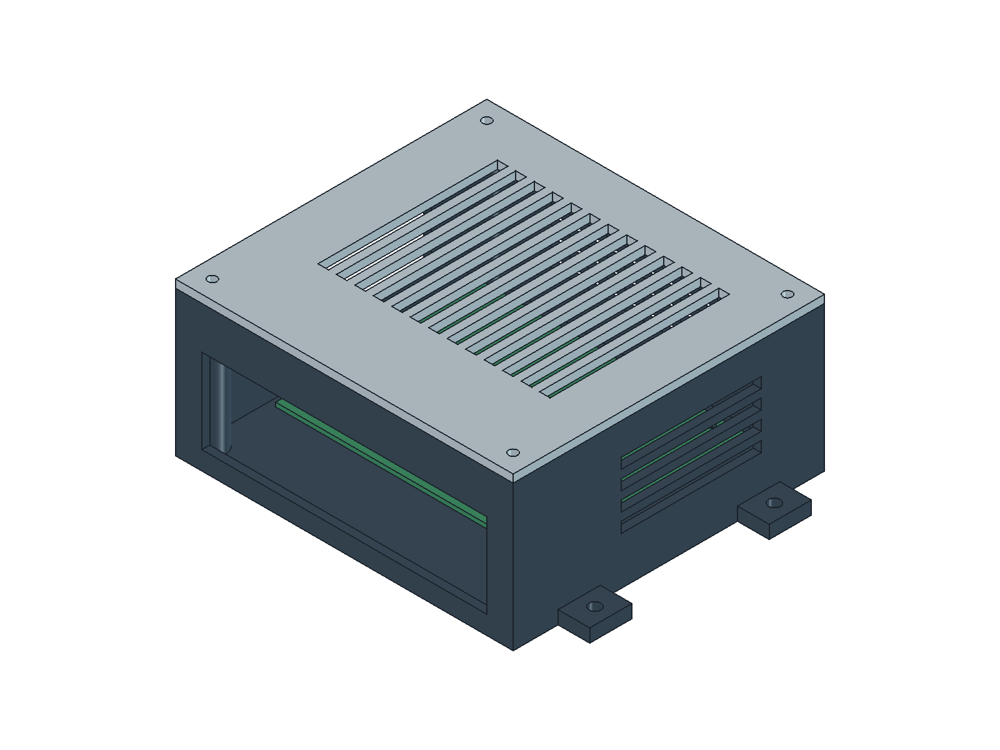

# SANASH — первый инженерный вариант A0

**Результат:** редактируемая схема соединений в KiCad и корпус стендового
шлюза в FreeCAD. Это кандидат под Jetson Orin Nano Super и сетевой видеовход.
Он позволяет перейти к проверке монтажа, кабелей и охлаждения выбранного
вычислителя. Выбор Jetson и наличие доступного сетевого потока ещё не подтверждены
испытанием штатной системы автобуса.

## Открыть проект

- [KiCad project](sanash_gateway.kicad_pro) и [схема](sanash_gateway.kicad_sch).
- [FreeCAD: корпус и компоновка](sanash_enclosure.FCStd).
- [Размерный чертёж](drawings/mechanical_dimensions.svg).
- [Сборка STEP](sanash_enclosure.step); отдельные [основание](sanash_base.step) и [крышка](sanash_lid.step).
- [STL основания](sanash_base.stl), [STL крышки](sanash_lid.stl). Крышка уже перенесена к Z=0 для слайсера.
- [BOM и крепёж](bom.csv), [параметры и происхождение размеров](design_parameters.json).



## Что спроектировано

**Схема:** штатный адаптер NVIDIA подключается к J16; разрешённая видеосеть —
готовым Ethernet-кабелем к J15. A1 и A2 на схеме обозначают два интерфейса
одного комплекта Jetson. Для питания показаны отдельные контакты центра и
оболочки. Сетевая линия обозначает кабель целиком; условный `PORT` не является
номером электрического вывода. Схема предназначена для сборки модулей,
а не для изготовления новой платы. Проводники Ethernet, встроенные трансформаторы
и цепи регистратора не переопределяются. Собственная PCB пока не требуется.

Базовый стенд использует microSD и проводную сеть. Модем, аналоговый захват,
собственная камера и питание от бортсети в этот вариант не включены. Если
регистратор даст только аналоговый или иной видеовыход, входной модуль, BOM
и компоновка потребуют следующей ревизии.

**Корпус:** тело 128 × 118 × 58 мм с крышкой; ширина с монтажными ушками 152 мм.
Стенка, дно и крышка 3 мм. Четыре стойки Ø5 × 8 мм с проходом Ø2,8 для M2.5;
межосевые расстояния 86 × 58 мм. Четыре крышечных винта M3, открытые сверху
шестигранные карманы под гайки; боковые вентиляционные щели и 13 щелей крышки.
Общий фронтальный проём 108 × 32 мм даёт доступ к разъёмам.

Монтаж предполагает **снятие штатного пластикового основания Jetson**,
сохранение штатного радиатора и вентилятора и использование выбранных отверстий
P3768. Точный порядок снятия и пригодность крепежа нужно проверить на комплекте.
Под платой остаётся 3,7 мм сверх максимального нижнего габарита 4,3 мм;
над консервативным верхним габаритом — 6,57 мм. Верхний габарит специально
взят с запасом: полная высота комплекта с допуском отложена ещё и над платой.
Это геометрический резерв, не расчёт охлаждения.

В FreeCAD есть нативное дерево операций: примитивы, вычитания, объединения,
отверстия и таблица размеров. Размеры примитивов можно менять в свойствах.
Таблица управляет основной оболочкой; координаты всех отверстий и вентиляции
не привязаны автоматически к изменению габарита. Для согласованного изменения
компоновки редактировать параметры/генератор и повторить проверки.
Скрытая группа `ReferenceGeometry` содержит упрощённые габариты, а не детальную
модель компонентов NVIDIA. Нижние зоны Ø6 мм вокруг креплений — проектное
допущение; отсутствие деталей в этих зонах требует проверки.

## Подтверждённые исходные данные

[Спецификация NVIDIA SP-11324-001 v1.3](https://developer.nvidia.com/downloads/assets/embedded/secure/jetson/orin_nano/docs/jetson_orin_nano_devkit_carrier_board_specification_sp.pdf),
декабрь 2024: рис. 4-1 и 4-2 — плата 100 ±0,13 × 79 ±0,13 мм,
толщина 1,57 ±0,16 мм; полный комплект 103 ±0,20 × 90,50 ±0,20 × 34,77 ±1,09 мм.
Раздел 3.8 — J16, штекер Ø5,5/2,5 мм, длина 9,5 мм, плюс в центре.
Тот же раздел указывает 3,5 А для разъёма; отдельные 4,2 А из таблицы 5-2
не приняты здесь за допустимый ток разъёма. Используется комплектный адаптер.

[Исходники платы NVIDIA P3768 A04](https://developer.nvidia.com/downloads/assets/embedded/secure/jetson/orin_nano/docs/jetson_orin_nano_devkit_carrier_board_reference_design_files_a04_20230320.zip/)
дают реальные координаты отверстий `MEC5/NTH_275P`:
(0,0), (86,0), (0,58), (86,58). Начало контура платы в исходниках (-4,-17).
Преобразование координат и исходные строки сохранены в
[source_provenance.json](references/source_provenance.json), вместе с SHA-256.
Большой исходный ZIP и ASCII-layout остаются локальными справочниками,
исключёнными из Git. Скопированные документы сохраняют авторство NVIDIA.

[Hardware Layout NVIDIA](https://docs.nvidia.com/jetson/orin-nano-devkit/user-guide/hardware_layout.html)
подтверждает Ethernet и назначение USB-C: данные, без питания комплекта через USB-C.

## Проверка этого пакета

- KiCad 10.0.6: ERC — **0 ошибок, 0 предупреждений**. Независимо проверены
  две цепи питания и условное соединение готового Ethernet-кабеля в XML netlist.
- FreeCAD 1.1.3 / OpenCascade: основание и крышка — по одному валидному
  твёрдому телу; проверены пять пар на пересечение с платой и заданными габаритами.
- STEP повторно импортирован: два валидных тела. Оба STL замкнуты.
- Четыре координаты креплений сверены программно с исходным layout NVIDIA.
- Экспортированные схема, размерный чертёж и два нативных вида FreeCAD
  просмотрены визуально.

[Проверки механики](mechanical_validation.json), [ERC](erc.json),
[проверка пакета](package_validation.json).
ERC не проверяет пригодность источника видео или электрическую безопасность
готовых модулей; проверка габаритов не доказывает посадку реальных разъёмов.

## Следующая инженерная проверка

1. Сверить маркировку реального Jetson/P3768 с A04 и положение выбранных
   отверстий. Проверить снятие штатного основания и зоны под стойки/шайбы.
2. Изготовить примерку основания. Проверить стойки, M2.5-крепёж, гайки и
   реальный доступ к DC/RJ45, включая защёлку и изгиб кабеля. Текущий проём
   даёт доступ; отдельная разгрузка натяжения кабелей ещё не разработана.
3. После примерки — крышка и тест температуры с исходным потоком и нагрузкой.
   PETG в BOM — кандидат для контролируемого стенда; материал, допуски печати
   и охлаждение пока не квалифицированы. Длинные перемычки проёмов могут
   потребовать поддержки в слайсере.
4. Для автобуса отдельно разработать и испытать питание от фактической бортсети,
   крепление, удержание кабелей и защиту корпуса. Эту A0 не считать готовой к
   установке на маршрут. Модель регистратора определяет окончательный видеовход.

Прогресс для Research: пакет фиксирует воспроизводимую **предлагаемую конструкцию**.
В статье его можно описывать как design/methods; физическая работа, качество
подсчёта и социальный эффект пока не получены и не добавляются в Results.

## Воспроизвести

Из корня репозитория:

```powershell
& C:/Python313/python.exe development/cad/gateway_rev_a/build_schematic.py
& 'C:/Program Files/KiCad/10.0/bin/kicad-cli.exe' sch erc --format json --exit-code-violations -o development/cad/gateway_rev_a/erc.json development/cad/gateway_rev_a/sanash_gateway.kicad_sch
& 'C:/Program Files/KiCad/10.0/bin/kicad-cli.exe' sch export netlist --format kicadxml -o development/cad/gateway_rev_a/interconnect.net.xml development/cad/gateway_rev_a/sanash_gateway.kicad_sch
& 'C:/Program Files/KiCad/10.0/bin/kicad-cli.exe' sch export svg -o development/cad/gateway_rev_a/drawings/ development/cad/gateway_rev_a/sanash_gateway.kicad_sch
& 'C:/Program Files/FreeCAD 1.1/bin/python.exe' development/cad/gateway_rev_a/build_enclosure.py
& C:/Python313/python.exe development/cad/gateway_rev_a/build_drawing.py
```

После генерации открыть FCStd или запустить `render_freecad.FCMacro` в FreeCAD
для сохранения видов и видимости конечных деталей. Макрос использует абсолютный
путь этого workspace. `verify_package.py` проверяет netlist, BOM, координаты
исходного NVIDIA-layout и наличие отчёта рендера.
