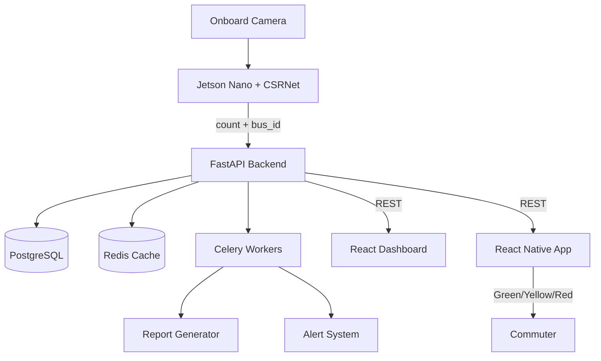

# Sanash System Architecture

## Overview

Sanash is a real-time bus occupancy information system for Almaty, Kazakhstan. Onboard cameras feed a computer vision pipeline running on edge hardware (Jetson Nano). Occupancy counts are transmitted to a cloud backend, cached for low latency, and displayed to commuters via a React Native mobile app as simple Green / Yellow / Red indicators.

---

## System Diagram



---

## Component Descriptions

### 1. Onboard Camera
- USB or CSI camera mounted inside the bus (rear-facing, fish-eye lens)
- Captures frames at 30 FPS; inference triggered every 30 seconds
- Resolution: 1280×720

### 2. Jetson Nano (Edge Inference)
- **Hardware:** NVIDIA Jetson Nano 4GB (4-core ARM Cortex-A57, 128-core Maxwell GPU)
- **Model:** CSRNet converted to TensorRT FP16 format
- **Inference latency:** ~15ms per frame
- **Output:** Integer passenger count + bus_id, POSTed to FastAPI backend
- **Fallback:** If network is down, buffers counts locally (SQLite) and syncs on reconnect

### 3. FastAPI Backend
- **Framework:** FastAPI (Python 3.11) with async/await
- **Endpoints:** See [API_REFERENCE.md](API_REFERENCE.md)
- **Auth:** JWT tokens (HS256, 30-min expiry)
- **Rate limiting:** 100 req/min per IP on public endpoints
- **WebSocket:** `/ws/live` for real-time dashboard updates

### 4. PostgreSQL Database
- Stores: detection records, bus routes, user accounts, analytics aggregates, alert history
- Time-series data partitioned by date for query performance
- Connection pooling via SQLAlchemy + asyncpg

### 5. Redis Cache
- Caches latest bus counts with 60-second TTL
- Session token storage
- Celery message broker and result backend
- Pub/Sub for WebSocket fan-out

### 6. Celery Workers
- **detection_tasks.py** — Processes bulk video uploads asynchronously
- **report_tasks.py** — Generates daily/weekly PDF reports
- **maintenance_tasks.py** — Nightly data cleanup, index optimization

### 7. React Dashboard (Admin/Operator)
- Built with React 18 + TypeScript + Vite
- Features: live bus map, occupancy time-series charts, alert management
- Connects to WebSocket for sub-second updates
- Auth-protected (operator/admin roles only)

### 8. React Native App (Commuter)
- Built with Expo / React Native
- Shows Green/Yellow/Red per bus on nearby routes
- Location-based nearest-bus lookup
- Offline-capable: caches last-known status

---

## Data Flow

```
Camera frame → [Jetson] CSRNet inference → passenger count
                                         → POST /api/v1/buses/{id}/count
                                         → [FastAPI] validate + store in PostgreSQL
                                         → update Redis cache (TTL 60s)
                                         → if count > 0.9 capacity: trigger alert via Celery
                                         → [WebSocket] push to Dashboard
Commuter opens app → GET /api/v1/mobile/nearby → reads from Redis cache → returns Green/Yellow/Red
```

---

## Deployment Topology

### Development (single machine)
```
localhost:8000   FastAPI
localhost:5173   React Dashboard
localhost:5432   PostgreSQL
localhost:6379   Redis
```

### Production (cloud + edge)
```
Edge (bus):    Jetson Nano → 4G/LTE → Internet
Cloud:         Ubuntu VM (4 vCPU, 8 GB RAM)
               - Nginx (reverse proxy, SSL termination)
               - Gunicorn + Uvicorn workers
               - Celery worker processes
               - PostgreSQL (managed, e.g., Supabase)
               - Redis (managed, e.g., Redis Cloud)
```

---

## Security Considerations

1. **HTTPS only** — Nginx enforces TLS 1.2+ for all external traffic
2. **JWT authentication** — Stateless tokens; edge devices use long-lived API keys
3. **API rate limiting** — Prevents abuse of public endpoints
4. **Input validation** — Pydantic schemas on all API inputs
5. **Secrets management** — All credentials in `.env` (never committed to git)
6. **Camera data** — Raw frames are processed on-device; only integer counts leave the bus

---

## Technology Stack Summary

| Layer | Technology |
|-------|-----------|
| Edge inference | Python + TensorRT + CSRNet |
| Backend API | FastAPI + SQLAlchemy + Pydantic |
| Task queue | Celery + Redis |
| Database | PostgreSQL 14 |
| Cache | Redis 7 |
| Frontend | React 18 + TypeScript + Vite |
| Mobile | React Native + Expo |
| CI/CD | GitHub Actions |
| Container | Docker + Nginx |
