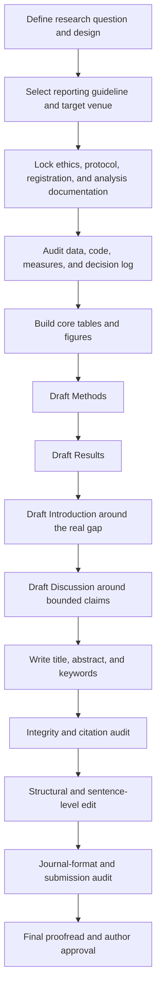

# Sanas: исследование

Основной научный вопрос: насколько показ real-time crowding information в
Avtobys причинно меняет выбор пассажира Алматы между посадкой в первый автобус
и ожиданием следующего. План состоит из stated-preference survey, затем
ограниченного field experiment; RGB-девайс является измерительным слоем.

Главные документы: `RTCI_RESEARCH_CHARTER.md`,
`FIELD_EXPERIMENT_PROTOCOL.md` и
`TRC_PAPER_BLUEPRINT.md`. Целевой журнал —
*Transportation Research Part C: Emerging Technologies*.

## Структура исследовательской статьи

Статья строится из шести основных разделов:

1. Abstract
2. Introduction
3. Methodology
4. Results
5. Discussion
6. Conclusion

Внутри этой структуры должны быть объединены две главные содержательные части:

### Engineering part

Engineering part должна показать, как создать полное устройство Sanas:
аппаратную конфигурацию, размещение и геометрию камеры, сбор и разметку данных,
модель оценки загруженности, edge-processing, состояния системы, передачу
результата в Avtobys и процедуру технической валидации. В Results должны быть
представлены фактические результаты устройства, когда они будут получены.

### RTCI part

RTCI part посвящена главным образом дизайну и результатам survey. После
получения результатов устройства эта часть должна сопоставить survey evidence
с результатами, измеренными устройством, и обсудить, насколько заявленные
предпочтения пассажиров согласуются с наблюдаемой загруженностью и возможным
использованием real-time crowding information.

Engineering и RTCI являются двумя частями одной статьи, а не двумя отдельными
статьями. Их методы описываются в общем разделе Methodology, результаты — в
общем разделе Results, а связь, ограничения и значение для транспортной системы
обсуждаются вместе в Discussion.

## Survey: wave 1

Статус: **данные проверены, модель оценена; причинного вывода нет**.

| Параметр | Значение |
|---|---|
| Респонденты | 215 |
| Сбор | 4–23 февраля 2026 |
| Инструмент | Google Forms, казахский/английский, 13 вопросов |
| Выборка | convenience sample без sampling frame, квот и репрезентативности |
| Персональные данные | отсутствуют; timestamp и закрытые ответы |
| Raw file | `survey/data/raw/responses.csv`, md5 `7f81731ab526613883c21d021de56f00` |

Шесть вопросов — бинарные сценарии board/wait. Прибывший автобус имеет один из
двух уровней: `packed` или `standing room`; ожидание следующего автобуса с
сидячими местами составляет 2, 3, 5, 7 либо 10 минут.

| Сценарий | Прибывший автобус | Ожидание | Время |
|---|---|---:|---|
| 1 | packed | 2 мин | ср 08:00, peak |
| 2 | packed | 5 мин | ср 08:00, peak |
| 3 | packed | 10 мин | ср 14:00, off-peak |
| 4 | standing room | 5 мин | ср 08:00, peak |
| 5 | standing room | 3 мин | ср 14:00, off-peak |
| 6 | packed | 7 мин | ср 18:00, peak |

Binary logit использует исход `1 = ждать`, clustered SE по респонденту и 1 247
из 1 290 возможных наблюдений от 209 человек.

| Term | Coefficient | Clustered SE | p |
|---|---:|---:|---:|
| const | 0.9331 | 0.1673 | <0.001 |
| wait_time | -0.1386 | 0.0241 | <0.001 |
| packed | 1.1027 | 0.1515 | <0.001 |
| is_peak | -0.5172 | 0.1111 | <0.001 |

Willingness to wait ради ухода от packed к standing room: **7.96 мин,
95% bootstrap CI [5.89, 11.09]**. После исключения 11 человек, которые ездят
реже раза в неделю или не ездят, — 7.68 мин, CI [5.64, 10.55]. Это не оценка
относительно seated trip: прибывающий автобус с сидячими местами не предлагался.

Ограничения: 77.7% выборки имеют возраст 14–24, 73.5% — студенты; возможны
несовершеннолетние; gender не спрашивался; 43 ответа на сценарии исключены как
пустые или свободный текст. Намерение в анкете не заменяет наблюдаемое полевое
поведение.

Воспроизведение из `research/survey/`:

```powershell
python analysis/build_instrument.py
python analysis/rebuild_survey.py
python analysis/fit_survey.py --smoke
python analysis/fit_survey.py
python analysis/descriptives.py
```

Нужны `pandas`, `numpy` и `statsmodels`. В несвязанной истории `origin/main`
остались опровергнутые значения n=167, март 2025, три уровня crowding,
15-минутное ожидание и вопрос о gender. Их нельзя цитировать.

## Survey: wave 2 и form-router

Проверка 2026-09-12: локальные исправления и 11 regression checks выполнены,
12 публичных страниц форм отвечают HTTP 200 с содержимым формы. Это не проверка
реального сохранения ответа. Изменённый router после назначения показывает
ссылку «Перейти к опросу»; переход требует клика из-за ограничений Apps Script.
Сборщик сохраняет предыдущие ответы при ошибке чтения любого источника,
выбирает связанную с формой вкладку и сохраняет дополнительные вкладки.
Правки находятся только в локальных файлах. [Отчёт и порядок проверки Google](../deliverables/progress_2026-09-12/report.md).

Локальная команда: `node research/survey/wave2/verify_local.cjs` из корня проекта.

Дизайн и три языка находятся в [`survey/wave2/`](survey/wave2/). Отдельный
Google Apps Script в [`../sanas_form_router/`](../sanas_form_router/) даёт
участнику одну публичную ссылку: после выбора RU, KK или EN он случайно
получает ссылку на одну из четырёх форм языка (Block 1/2 × Order A/B).

Развёртывание router:

1. Открыть [script.new](https://script.new) в аккаунте владельца исследования.
2. Заменить содержимое `Code.gs` файлом `sanas_form_router/Code.gs`.
3. Создать HTML-файл `Index` и вставить `sanas_form_router/Index.html`.
4. Выбрать **Deploy → New deployment → Web app**.
5. Установить **Execute as: Me**, **Who has access: Anyone**.
6. Авторизовать приложение и публиковать только полученный `/exec` URL.

Назначение независимо для каждого клика. Таблицы ответов форм остаются
раздельными, поэтому условие восстанавливается по форме назначения.

## Литература и статья

- `refs/base/references.md` — проверенная база
  библиографических записей; `references.bib` генерируется, `validate.py`
  проверяет структуру. Наличие записи не означает, что работа прочитана.
- `LIT_REVIEW_PROTOCOL.md` и `lit_review/` — протокол,
  evidence matrix и поисковый лог.
- `REPLICATION_TARGET.md` — стратегия относительно
  найденных RTCI-пилотов.
- [`paper/manuscript/`](paper/manuscript/) — рабочие разделы рукописи.
- `wiki/index.md` — тематический индекс доказательств и
  консультаций.

`refs/cv-hardware-corpus/` содержит 44 PDF из батча 56 файлов: crowd counting,
APC comparators, edge deployment и VDV 457. Это триаж для выбора модели и
железа, не корпус проверенных цитат. Классификация всех принятых, отклонённых и
дублирующихся файлов находится в `refs/REFGRAPH_REPORT.md`.

`refs/rtci-supporting/` содержит три вспомогательных full-text PDF:
`drabicki2023_rtbm.pdf`, `pi2018_perception.pdf` и
`zhangkennedy2023_chi.pdf`. Основной тематический каталог RTCI исторически
ведётся во внешнем Obsidian vault (`01_Projects/Sanash/paper/literature.md`);
наличие локального PDF не заменяет проверку конкретной цитаты.

## Учебные материалы Terra

Начинать с `coursework/WRITING_RULES.md`: это
ратифицированные правила prose для статьи. Полный контекст уроков находится в
`coursework/course_notes.md`.

На диске в `coursework/` также лежат шесть PDF-колод, семь записей занятий,
примеры `.docx` и семь timestamped transcript-файлов. Большие исходники
исключены из Git; отслеживаются конспекты, правила, черновики и транскрипты.
Автоматические расшифровки сделаны faster-whisper `small`, int8, с VAD и могут
искажать имена и термины; значимые цитаты нужно сверять с аудио.

Известные пробелы курса:

- `Methodology for emp. papers.pdf` обрывается на пятом из шести компонентов;
  ethics/consent и запись соответствующего урока отсутствуют;
- правила использования AI противоречат друг другу, хотя все источники
  запрещают сдавать сгенерированный текст как собственный;
- требования к свежести источников расходятся между «не раньше 2020» и
  «последние 10 лет»;
- дедлайны находятся в Google Classroom и не записаны в локальных материалах.

Курс помогает структуре и reporting, но не заменяет методологию причинного
field experiment и не является product spec.

## Consolidated Markdown source archive

The original contents of the removed Markdown files are preserved below. Each collapsible block records its former path, encoding, size, and SHA-256.

| Former path | Bytes | Encoding | SHA-256 |
|---|---:|---|---|
| `research/RTCI_RESEARCH_CHARTER.md` | 27495 | UTF-8 | `d103fd9fe123c6066ce31645bb19a8bb912bc91a2f4980825062583b47d69846` |
| `research/FIELD_EXPERIMENT_PROTOCOL.md` | 12271 | UTF-8 | `df2bc25508e0a88019bb992dca2dab3ff4d3fe7bb786aee0b9e7629e5cf6501f` |
| `research/TRC_PAPER_BLUEPRINT.md` | 5898 | UTF-8 | `21a6bd0dbf137f57492498621be45ee9f97c7858c0e81936711420316f322d56` |
| `research/LIT_REVIEW_PROTOCOL.md` | 61241 | UTF-8 | `7ad40ff7b574ef5d36d572bfe933643cf958627a916cb927b5a7db1f4c53dc2f` |
| `research/REPLICATION_TARGET.md` | 9550 | UTF-8 | `d47f21ac9c510b50ffd1ac6ca8f6cd2cc2e333e0fa47e4e9c55f96d1eab0018f` |
| `data/litsearch/screen.md` | 68314 | UTF-8 | `78afa80d0afb46eece982c7ad5cad18a0d1a362323b600a7b4ab07b98acbe634` |
| `research/coursework/course_notes.md` | 76074 | UTF-8 | `284bcc3f9ab27a13f105fac570c8332f4fecec368e77e06a00d1b5b80d8ce416` |
| `research/coursework/HW_lit_review_submission.md` | 50974 | UTF-8 | `2d3fc7b896a658ebe47f68f2cbf817e14824c141ecfc52db6e7907c2f1a4a663` |
| `research/coursework/results_section_draft.md` | 5601 | UTF-8 | `62052c93f3baa44f60c7cd3dc7c5b69ceac98e066466babb1a1dd3a83100cf48` |
| `research/coursework/WRITING_RULES.md` | 89620 | UTF-8 | `c7204c91a12d56accd77a22a68f2d3e93ccf3ff2de085f7fe0e8f552f7cb5be1` |
| `research/EXPERT_CONSULTATIONS.md` | 12609 | UTF-8 | `63a885b85fd538d338fad1336fc5af59c8ba78552f93d36c369bdd63db6a4048` |
| `research/lit_review/search_log.md` | 4766 | UTF-8 | `6850ea2c58be90d87374b2eb0ddf6aa7b5f12c188548d21264009a119af914f7` |
| `research/paper/manuscript/01_introduction.md` | 5028 | UTF-8 | `8d1f1f97a8b65316dc32ea9f16760d94564cf389e74aea6b67fe1d2aa9cf3b3b` |
| `research/paper/manuscript/02_survey_results.md` | 5131 | UTF-8 | `362e6326b2685ead0ff606d5b235723ba5ee2d870715e19f10f5424239cf535b` |
| `research/paper/manuscript/references.md` | 4799 | UTF-8 | `9c3a7d922185ead265fa5dced56f17281a3145fa4331acb911ad2deb9a7b4001` |
| `research/refs/academic_writing_conventions.md` | 75143 | UTF-8 | `916533083767f8d97f90d8f9b88c7ab2c63c1376027d5435f9a1289d7d0211bd` |
| `research/refs/base/references.md` | 45918 | UTF-8 | `d38d3a7ddff4179f216ef1cedb7401cd69fbdec589898003604c1d5146d4893a` |
| `research/refs/LITERATURE_DISCOVERY_LOG.md` | 21672 | UTF-8 | `a41458e607664003ac41a5ff0fb041c2a68621716bdd9f18234b7656791e1d4f` |
| `research/refs/REFGRAPH_REPORT.md` | 15762 | UTF-8 | `8500e9c486ff40224c1fd66b22fa5a2bed338b77d1af3082a441ee0e86c3537e` |
| `research/survey/instrument/fielded_instrument.md` | 9029 | UTF-8 | `94d2faa3751f7e7f93368af0acde064eb5abf0b38ddb603e66d23609d4bf311f` |
| `research/survey/wave2/DESIGN_NOTE.md` | 8149 | UTF-8 | `aa21d2159c43f4c4cb2662c24ea7427f85925c1d8aab9104e591ac0a88198743` |
| `research/survey/wave2/email_to_reviewer.md` | 3909 | UTF-8 | `e86d15e6107ca8333d0851fc0acf904d5ec1698495410af50f3c8336d84aea82` |
| `research/survey/wave2/GOOGLE_FORMS_BUILD_PROMPT.md` | 55547 | UTF-8 | `e909f2cb13ba5e22a410ef0cf07c7d7ad040298daffa6d4a72829268d6d67bda` |
| `research/survey/wave2/instrument_en.md` | 6140 | UTF-8 | `4d49f39e3bee177b97842e382e182b0eccb5ee6f0971407f41bc7b3442f67ac8` |
| `research/survey/wave2/instrument_en_v2.md` | 8992 | UTF-8 | `ecc7fedaca01e2d29e674f5c2bce9045e5c28968ea2f2e5a393ce05191e62891` |
| `research/survey/wave2/instrument_kk.md` | 10444 | UTF-8 | `cdc594fcd05e4384b291ae1d5242cee60028d03350b25ce7d297d4341ceb3f63` |
| `research/survey/wave2/instrument_kk_v2.md` | 14479 | UTF-8 | `62cc2d7bf1cd9b9e6ff9633eeeef916a435676445807bd3550f5a2eb6cea9414` |
| `research/survey/wave2/instrument_ru.md` | 10592 | UTF-8 | `a2a6b7325e426f09742ec3726f8ea29dbc29b0d2f0b3f4043a084d0e6874eb00` |
| `research/survey/wave2/instrument_ru_v2.md` | 16233 | UTF-8 | `6eaa971d44bf0bc2a0cce2dcf31e76d7adf56062002bdc7157d16f579e99f820` |
| `research/wiki/concepts/apc-validation-and-standards.md` | 3126 | UTF-8 | `c96c4990830c609abed943250f7966fbe6bbfbe79a352109607c26dfe1ddc4ee` |
| `research/wiki/concepts/crowding-elasticity.md` | 2703 | UTF-8 | `0d19070abeb1f1b8a26d3a44cc034bb854f7d77947a6e238001a36b60bfa4221` |
| `research/wiki/concepts/crowding-valuation-and-rtci-evidence.md` | 7275 | UTF-8 | `bf5d7f531ea430868010c1fb77c320b6be36af8495df988034af4885a4d9f7d3` |
| `research/wiki/concepts/edge-inference-constraints.md` | 2809 | UTF-8 | `4d0dbeff3a868feb65ee966e6430adb0a835d3e1ff07e83bd0e25b7916f1869c` |
| `research/wiki/concepts/occupancy-sensing-methods.md` | 3558 | UTF-8 | `728b1f2a786908e95ea874088833cd2c2e581862aed1bfe1253df31885265ca7` |
| `research/wiki/concepts/willingness-to-wait.md` | 2926 | UTF-8 | `d61d21935bd8d944dd52e4799ecedcd7696b76258f8ae27d0ff01d38fd7efe6b` |
| `research/wiki/index.md` | 2772 | UTF-8 | `f8f6f446c854ed83a9fdd4153ea0bc45bdb4f9a35ab83d9727a96149d0bb2b0d` |
| `research/wiki/log.md` | 4115 | UTF-8 | `b0678d3ac80aa48743396d5b47bca3ed987ca8dcfd014ffba7bf0552a2f001a7` |
| `research/wiki/sources/2026-08-26-kapatsila-consultation.md` | 4043 | UTF-8 | `056e80d4c6996484df7e5886bab7d2929fff29839c86a026f7512b6d11fdbab6` |
| `research/wiki/sources/cv-hardware-corpus-2026-08-26.md` | 9841 | UTF-8 | `5ef08ce0c3488a92519ef8c837f2c5dbfdc15ccc68190a817697fd61ad9a456d` |
| `research/wiki/sources/litsearch-run-2026-08-26.md` | 3742 | UTF-8 | `6e76c2527157fc4e149235fcf89a366bf136694d13fb35f7d6aa7a1e5afa123c` |
| `research/wiki/WIKI_SCHEMA.md` | 5051 | UTF-8 | `c80288a9dff8a9de6e1fbfda82a9319d0e45a78e57eb3674ddae249a44a3f372` |

<details>
<summary><code>research/RTCI_RESEARCH_CHARTER.md</code> - original text</summary>

# Sanas RTCI Research Charter

Статус: рабочая основа для обсуждения, не preregistration
Дата: 2026-08-26
Владелец решения: Дияс Тлеукин

## 1. Научная цель

Sanas исследует не компьютерное зрение само по себе. CV-устройство является
измерительным слоем для причинного вопроса: меняет ли достоверная информация о
загруженности автобуса реальное решение пассажира о посадке.

### Основной research question

Короткая формулировка по требованию курса (12 слов):

> **How does real-time crowding information affect boarding decisions among
> Almaty bus commuters?**

Она используется как readable RQ. Для design, preregistration и анализа нужна
следующая operational causal formulation:

> **To what extent does displaying real-time onboard crowding information in
> the Avtobys app causally affect the probability that Almaty commuters board
> the first arriving bus rather than wait for a subsequent service?**

Для field study population нужно сузить:

> Among Avtobys users waiting at selected stops on a high-frequency Almaty bus
> route, what is the causal effect of displaying real-time crowding information
> on the probability of boarding the first arriving bus rather than waiting for
> the next service?

Вторая формулировка сильнее: в ней определены population, intervention,
comparison и observable outcome. Результат такого пилота нельзя автоматически
обобщать на всех жителей Алматы.

Курс рекомендует 10-15 слов, но это учебное правило ясности, не универсальное
требование TR-C. Нельзя сокращать RQ ценой удаления treatment, population,
comparison или outcome из operational protocol.

### Target journal

**Решено 2026-08-26:** целевой журнал — *Transportation Research Part C:
Emerging Technologies* (TR-C), а не *Transportation Engineering*.

TR-C рассматривает development, application и implications emerging
technologies in transportation systems, причём интерес журнала направлен не на
изолированную технологию, а на её конечный транспортный эффект:
https://www.sciencedirect.com/journal/transportation-research-part-c-emerging-technologies/about/insights

Следовательно, submission thesis должна быть шире исходного survey:

> An edge-generated, app-delivered RTCI intervention is causally evaluated at
> the boarding-decision level and embedded in a behaviour-aware model to
> quantify its effects on passenger waiting, vehicle load distribution and bus
> service reliability.

Working title:

> **From sensing to boarding: Causal effects of app-based real-time crowding
> information on bus passenger choices and service performance**

### Part C publication threshold

Для journal fit нужны четыре связанные части:

1. **Technology:** воспроизводимый sensing/information pipeline с измеренными
   accuracy, latency, freshness и failure states.
2. **Causal behaviour:** field randomization или сильный quasi-experiment,
   observation of actual boarding, а не только stated intention.
3. **Behavioural model:** boarding/waiting model, учитывающий crowding contrast,
   headway, urgency, adoption и information accuracy.
4. **Transport implications:** влияние на waiting burden, load variance,
   denied boarding, dwell/headway reliability и counterfactual rollout.

Survey-only, CV-benchmark-only или one-week before/after paper не соответствует
целевой планке. Survey остаётся instrument-development и prior/calibration
stage. Field estimates желательно встроить в dynamic route simulation или
другой validated counterfactual model, чтобы показать переносимый системный
результат, а не только локальный процент пассажиров.

Прямые precedents в TR-C подтверждают fit, но одновременно задают novelty bar:

- personalized predictive RTCI from automated data sources:
  https://doi.org/10.1016/j.trc.2020.102647
- predictive decision-support platform with endogenous passenger response:
  https://doi.org/10.1016/j.trc.2021.103139
- information and public-transport capacity interactions:
  https://doi.org/10.1016/j.trc.2016.05.007

Sanas не должен повторять эти работы. Его кандидатный новый вклад: causal
app-level field evidence for bus boarding, связанное с реально измеренной
occupancy и проверкой closed-loop operational consequences в Алматы.

### Candidate research gap

Существующая литература показывает stated willingness to wait, smart-card
revealed preferences, simulation и отдельные RTCI pilots. Кандидатный gap:

> Direct causal field evidence on how app-displayed bus crowding information
> changes individual boarding decisions is limited, especially in bus systems
> and Central Asian cities.

Это пока **кандидатный**, а не доказанный gap. Его нужно подтвердить
воспроизводимым literature review и citation chaining.

## 2. Что именно является вкладом

Главный вклад не должен формулироваться как «мы добавили crowding information»:
такая информация и WTW уже изучались.

Потенциальный оригинальный вклад состоит из четырёх частей:

1. **Geographical contribution:** первые локальные causal estimates для
   автобусных пассажиров Алматы/Центральной Азии, если обзор подтвердит
   отсутствие аналогов.
2. **Methodological contribution:** переход от stated-preference WTW к
   randomized или квазирандомизированному revealed boarding behaviour в
   мобильном приложении.
3. **Measurement contribution:** связка независимо валидированного onboard
   occupancy sensor с timestamped exposure в Avtobys и фактом посадки.
4. **Operational contribution:** оценка не только индивидуальной WTW, но и
   изменения load variance, bunching, denied boarding и waiting burden.

Ни один пункт нельзя заявлять как выполненный до получения данных.

## 3. Теоретическая основа

### Что уже существует

- Drabicki et al. формализуют **willingness to wait (WTW)** как выбор между
  более загруженным первым отправлением и ожиданием менее загруженного.
  Их stated-preference experiment относится к bus/tram и использует discrete
  choice models: https://doi.org/10.1016/j.rtbm.2023.100963
- Drabicki, Kucharski and Cats переносят WTW в dynamic public-transport
  simulation для bus bunching:
  https://doi.org/10.1007/s11116-022-10270-3
- Bansal, Hörcher and Graham оценивают crowding disutility и динамические
  правила выбора по smart-card и vehicle-location данным. Это важная
  revealed-preference основа, но не авторство WTW construct:
  https://doi.org/10.1111/rssa.12804
- Kim, Lee and Oh анализировали выбор первого или второго автобуса по недельным
  interview data в Seoul:
  https://www.worldtransitresearch.info/research/8/
- Revealed active boarding delay также оценивался по smart-card и timetable
  данным в metro systems:
  https://doi.org/10.1016/j.tra.2023.103747
- Stockholm pilot является важным field precedent для RTCI, но относится к
  platform/car distribution, а не напрямую к выбору первого автобуса:
  https://trid.trb.org/View/1483178

### Концептуальная модель

Для пассажира `i`, ожидающего departure `j`, решение можно представить как:

`BoardNow = f(current crowding, expected next crowding, headway, travel-time
urgency, trip purpose, weather, trust, information exposure, personal traits)`.

RTCI treatment должен менять информацию, а не фактическое предложение. Поэтому
нужно отдельно измерять:

- реальную загруженность первого и следующего автобуса;
- что именно показало приложение;
- freshness/ошибку информации;
- увидел ли пользователь карточку;
- факт посадки или ожидания;
- фактическое дополнительное ожидание.

## 4. Outcomes и hypotheses

### Primary outcome

`Y = 1`, если пассажир сел в первый доступный автобус; `Y = 0`, если сознательно
пропустил его и остался ждать.

Primary estimand:

> Intention-to-treat difference in the probability of boarding the first
> available bus between users assigned RTCI and users assigned ETA-only
> information, conditional on a valid boarding opportunity.

### Secondary outcomes

- фактические дополнительные минуты ожидания;
- число пропущенных отправлений;
- load difference между последовательными автобусами;
- variance загрузки внутри маршрута;
- dwell time и headway irregularity;
- denied boarding;
- perceived usefulness, trust и accuracy perception;
- app adoption/exposure rate;
- heterogeneity по trip urgency, expected ride duration, crowding difference,
  headway, возрасту и mobility constraints.

### Hypotheses

- **H1:** RTCI уменьшает вероятность посадки в первый автобус, когда он сильно
  загружен, а следующий ожидается менее загруженным.
- **H2:** эффект возрастает с разницей загруженности между первым и следующим
  автобусом.
- **H3:** эффект уменьшается при большем headway и высокой срочности поездки.
- **H4:** RTCI уменьшает load variance между последовательными автобусами, но
  может увеличить индивидуальное waiting time.
- **H5:** ошибка или устаревание RTCI снижает доверие и treatment compliance.

H2-H5 должны считаться secondary/exploratory, если power analysis не позволяет
полноценно тестировать их отдельно.

## 5. Трёхэтапная методология

### Method classification and course grounding

Работа является quantitative empirical multi-study research:

1. stated-preference survey для instrument development и behavioural priors;
2. measurement-validation study для occupancy technology;
3. randomized или квазирандомизированный field experiment;
4. behaviour-aware transport model/counterfactual analysis.

Она также содержит structured literature review, но не является
literature-review-only paper.

`research/coursework/RESEARCH_METHOD_GROUNDING.md` подтверждает применимые
требования курса: association не равна causation, methodology должна позволять
повторение, sampling/instrument нужно описывать явно, systematic и content
limitations разделяются. Курс подробно раскрывает survey и review, но не даёт
достаточной causal field-experiment methodology. Поэтому survey template нельзя
копировать как весь methods section будущей статьи.

Если field identification не является randomized/credible quasi-experimental,
в результатах разрешена только формулировка `associated with`, а не `caused`.
Численные thresholds, sample size и ethics process остаются открыты.

### Study A: stated-preference survey

Существующий survey нужно не просто «масштабировать», а сначала провести audit.
Его файла в текущем репозитории не найдено.

Рекомендуемый дизайн:

- factorial choice tasks: crowdedness first bus, crowdedness next bus,
  additional wait, trip urgency/purpose, expected ride duration;
- выбор `board now` / `wait`;
- 6-10 randomized scenarios на респондента, а не один общий вопрос;
- понятные пассажиру crowding icons, предварительно cognitive-tested;
- demographics, обычный маршрут, frequency of Avtobys use, mobility limits,
  safety/comfort attitude и trust in information;
- небольшой open-ended вопрос о причине решения.

Анализ: mixed logit или latent-class logit с respondent-level clustered
uncertainty. Обычный процент ответивших «да» недостаточен из-за повторных
choice tasks и heterogeneity.

Study A даёт stated WTW и параметры для power analysis, но не отвечает на
causal field question из-за hypothetical bias.

### Study B: measurement validation

До показа RTCI устройство работает в silent mode. Для каждого автобуса:

1. Sensor estimate и passenger-facing level записываются с timestamp.
2. Независимый manual ground truth собирается по заранее написанному labeling
   protocol.
3. Проверяются accuracy, calibration, missingness, latency и data freshness.
4. Устанавливается go/no-go threshold до просмотра field-treatment effect.

Пять уровней должны определяться через operational capacity/comfort semantics,
а не через произвольные интервалы model score. Для causal experiment особенно
опасна differential measurement error: treatment нельзя показывать неточно и
затем интерпретировать недоверие как отсутствие behavioural effect.

### Study C: field experiment

#### Предпочтительный вариант: app-level randomized A/B

- Один высокочастотный pilot route и заранее выбранные stops/time windows.
- Eligible Avtobys users рандомизируются в стабильные группы.
- Control видит ETA и обычную информацию.
- Treatment видит то же плюс RTCI для ближайших отправлений.
- Assignment, card impression, occupancy snapshot и boarding outcome имеют
  совместимые pseudonymous IDs/timestamps.
- Primary analysis: intention-to-treat; per-protocol exposure analysis только
  secondary.

Это позволяет сравнивать людей в одно время, в одной погоде и при одном
service state.

#### Если individual A/B технически невозможен

Использовать cluster-randomized crossover по stop x time block или route-day:

- несколько чередований control/treatment, например сбалансированный ABBA;
- одинаковое покрытие weekday/weekend и peak/off-peak;
- assignment публикуется заранее;
- standard errors cluster по единице randomization;
- treatment status нельзя выбирать после наблюдения crowding.

Простой дизайн «неделя до / неделя после» остаётся fallback quasi-experiment.
Он уязвим для weather, weekday composition, service changes, seasonality,
marketing, novelty и bus bunching. Если другого варианта нет, нужны matched
control route, несколько pre/post periods и difference-in-differences с
parallel-trends diagnostics.

## 6. Как наблюдать посадку

Это главный operational blocker. Возможные источники в порядке силы:

1. **Pseudonymous app-to-ticket linkage:** app exposure связывается с реальной
   validation/boarding transaction с privacy review.
2. **Opt-in smartphone inference:** geofenced waiting session + движение вместе
   с конкретным bus GPS после departure; требует отдельной validation и consent.
3. **In-app immediate confirmation:** «Сели в этот автобус / решили ждать»;
   проще, но self-report и non-response bias.
4. **Aggregate APC boarding counts:** хорошо для route-level load effects, но
   не доказывает individual effect среди пользователей, увидевших RTCI.

До выбора наблюдаемого outcome нельзя делать power analysis или обещать causal
field study.

## 7. Масштаб пилота

Оповещать весь город для первого исследования не требуется. Нужны:

- один маршрут с коротким headway, заметной вариацией загрузки и несколькими
  последовательными оборудованными автобусами;
- ограниченный список stops/time windows;
- app banner только для eligible audience;
- прозрачное описание pilot, privacy и возможной погрешности;
- coordination с Innoforce и оператором маршрута.

Для meaningful `wait for next bus` intervention недостаточно одного
оборудованного автобуса. Нужно знать или честно прогнозировать загрузку как
минимум первого и следующего отправления. Следовательно, потребуется несколько
последовательных оборудованных машин либо другой валидный источник occupancy.

## 8. Power и analysis plan

До расчёта sample size нужны:

- baseline probability of boarding first bus;
- ожидаемый minimum detectable effect;
- treatment exposure/adoption rate;
- число eligible decisions в день;
- intracluster correlation для cluster design;
- доля ситуаций, где первый автобус crowded, а следующий реально лучше.

Модель primary outcome: logistic regression с pre-specified treatment effect и
design-consistent standard errors. Добавление crowding/headway covariates
повышает precision, но не должно заменять рандомизацию.

Обязательно заранее зафиксировать:

- eligibility и valid boarding opportunity;
- handling missed sensor data;
- exclusion rules;
- primary estimand/model;
- multiple-testing policy;
- stopping rule;
- subgroup analyses;
- privacy/consent;
- preregistration до просмотра treatment outcomes.

## 9. Literature review plan

ResearchRabbit полезен для citation discovery и визуальной карты, но не
заменяет воспроизводимый database search.

### Review question

> What is known about the effect of real-time public-transport crowding
> information on passengers' boarding, waiting, route, departure-time and
> within-vehicle distribution decisions?

### Sources

- Scopus / Web of Science;
- TRID;
- Google Scholar for citation chaining;
- Transport Research International Documentation;
- IEEE Xplore для sensing/information systems;
- publisher/full-text repositories for verification.

### Search concept blocks

1. `real-time crowding information OR occupancy information OR passenger load
   information`
2. `bus OR public transport OR transit OR metro OR tram OR rail`
3. `boarding decision OR willingness to wait OR departure choice OR route
   choice OR passenger behaviour`

Все фактически использованные строки, базы, даты и result counts записываются.

### Inclusion

- peer-reviewed empirical, experimental, behavioural modelling or validated
  simulation studies;
- RTCI/occupancy information является intervention/input;
- измеряется passenger decision или operational consequence;
- urban public transport;
- English плюс доступные Russian/Kazakh studies при проверяемом full text.

### Evidence matrix

Для каждой статьи: location, mode, sample, design, stated/revealed preference,
information channel, crowding scale, outcome, identification strategy, model,
effect, limitation, verification status, DOI/full text.

Синтезировать по design и decision type, а не «один абзац на автора».
ResearchRabbit collection должна начинаться с verified seed papers выше, затем
backward/forward citation chaining. PRISMA flow отражает только реально
выполненный поиск.

## 10. Три разных dataset, которые нельзя путать

### A. Behavioural research dataset

Unit: passenger x boarding opportunity. Минимальные поля:

- assignment, exposure, timestamp, route/stop/vehicle;
- first/next ETA and actual headway;
- shown and measured crowding for first/next bus;
- boarded first / waited / left;
- waiting duration;
- trip urgency/purpose when consent permits;
- weather/service disruption;
- sensor freshness/error flags.

Такого Almaty dataset в интернете не будет: это основной новый эмпирический
результат исследования.

### B. Sensor-training dataset

Frames/clips from the actual camera geometry + independently labelled cabin
occupancy/capacity level. Публичные crowd datasets могут дать pretraining, но
не заменить Almaty pilot data.

### C. Operational dataset

Vehicle GPS/AVL, schedule/ETA, stop events, headways, ticket validations/APC,
vehicle capacity and disruptions. Его доступность нужно согласовать с
Innoforce/operator; он важнее очередного интернет-датасета для causal design.

## 11. Реалистичный план на ближайший месяц

> **Заменено 2026-09-04.** Действующий график работ на сентябрь находится в
> [`../SEPTEMBER_PLAN.md`](../SEPTEMBER_PLAN.md). Этот раздел сохранён как
> описание четырёх фаз подготовки полевого эксперимента; его недельные сроки
> больше не действуют. Charter остаётся авторитетом по научному дизайну.


### Week 1: freeze the study

- получить и проверить существующий survey;
- подтвердить research question и primary outcome;
- провести structured literature search;
- meeting с Innoforce по A/B, exposure logs, boarding outcome и route data;
- выбрать pilot route по заранее заданным критериям.

### Week 2: pilot instruments

- cognitive interviews по crowding icons и survey wording;
- survey pilot;
- camera/FOV bench test;
- draft labeling guide и data schema;
- privacy/consent review.

### Week 3: silent measurement

- несколько сенсоров на последовательных автобусах или честный reduced bench;
- manual ground-truth validation;
- survey launch;
- app RTCI prototype без влияния на реальных пассажиров.

### Week 4: go/no-go package

- survey cleaning и preliminary choice model;
- sensor accuracy/latency report;
- power calculation по реальному eligible-decision rate;
- preregistered field protocol;
- письменное go/no-go решение для live A/B.

Полноценный causal field result за один месяц маловероятен, если сейчас нет
app logging, boarding linkage и валидированного сенсора. Реалистичный результат
месяца: готовый, этически и технически исполнимый field experiment плюс
предварительные survey/sensor данные.

## 12. Решения, которые нужны от Дияса и Innoforce

1. Один route pilot или city-wide rollout: для исследования рекомендован route
   pilot.
2. Может ли Avtobys делать randomized feature exposure?
3. Можно ли наблюдать boarding outcome без нарушения privacy?
4. Есть ли доступ к vehicle IDs, GPS/ETA, route capacity и ticket/APC events?
5. Сколько последовательных автобусов можно оборудовать?
6. Какой minimum effect practically matters Innoforce/operator?
7. Кто даёт разрешение на съёмку, consent и обработку данных?
8. Где находится текущая версия survey и на каких языках она работает?

</details>

<details>
<summary><code>research/FIELD_EXPERIMENT_PROTOCOL.md</code> - original text</summary>

# Sanas RTCI Field Experiment Protocol

Статус: preregistration draft, не утверждён
Версия: 0.1, 2026-08-26
Target journal: Transportation Research Part C: Emerging Technologies
Research charter: `research/RTCI_RESEARCH_CHARTER.md`

## 1. Study objective

Оценить причинный эффект показа real-time bus crowding information в Avtobys
на решение пассажира сесть в первый доступный автобус или ждать следующий.

Короткий RQ:

> How does real-time crowding information affect boarding decisions among
> Almaty bus commuters?

## 2. Primary design

Предпочтительный дизайн: randomized controlled field experiment на одном
высокочастотном маршруте Алматы.

| Элемент | Определение |
|---|---|
| Population | Eligible пользователи Avtobys на выбранных stops/time windows pilot route |
| Unit of randomization | Стабильный pseudonymous app user |
| Unit of analysis | User × valid boarding opportunity |
| Treatment | Обычный интерфейс + RTCI ближайшего и следующего автобуса |
| Control | Тот же интерфейс и ETA, но без RTCI |
| Primary outcome | Boarded first available bus: yes/no |
| Primary estimand | Intention-to-treat average treatment effect на probability boarding first bus |
| Study horizon | Определяется power analysis, не фиксируется как одна неделя |

Stable user assignment предпочтительнее randomization каждого открытия:
уменьшается contamination и пользователь не получает противоречивый интерфейс.

## 3. Fallback design

Если Innoforce не может делать user-level A/B, используется
cluster-randomized crossover по `stop × direction × time block` или
`route-day`.

- Последовательность control/treatment задаётся до начала, например ABBA.
- Каждый cluster получает оба режима.
- Weekday/weekend, peak/off-peak и direction балансируются.
- Standard errors cluster по единице randomization.
- Treatment нельзя включать в ответ на наблюдаемую перегрузку: это разрушит
  causal identification.

Before/after одной неделей допускается только как exploratory
quasi-experiment с matched control route и difference-in-differences.

## 4. Eligibility

### User eligibility

- пользователь открыл Avtobys в pilot geofence/time window;
- выбран pilot route или stop;
- device/app version поддерживает experiment logging;
- consent/legal basis утверждены;
- pseudonymous experiment ID создан без передачи исследователям identity.

### Valid boarding opportunity

Наблюдение включается, когда:

- пользователь находился на stop до прибытия первого автобуса;
- первый автобус реально обслуживал нужный route/direction;
- boarding был физически возможен;
- occupancy message прошёл freshness/quality gate;
- известен outcome `board first`, `wait`, `left/unknown`;
- следующий service был определён в протоколе.

Случаи denied boarding не исключаются автоматически: они отдельный outcome и
не являются voluntary willingness to wait.

## 5. Intervention

Treatment card показывает для первого и следующего service:

- ETA;
- crowding level с одинаковой шкалой;
- timestamp/freshness или понятный статус;
- `unknown`, если измерение невалидно.

Нельзя одновременно менять цветовую шкалу, ETA algorithm, notifications,
pricing или incentives: treatment должен отличаться только RTCI.

Точный UI проходит cognitive testing до field launch. Скриншоты и version hash
сохраняются как experiment artifact.

## 6. Outcomes

### Primary

`board_first = 1`, если eligible пользователь сел в первый доступный автобус;
`0`, если добровольно остался ждать следующий.

Denied boarding, уход со stop и неизвестный outcome кодируются отдельно.

### Secondary behavioural

- additional waiting seconds;
- number of skipped services;
- boarded second/later bus;
- route/departure switch;
- RTCI card opened/visible;
- reported trust/usefulness, если micro-survey утверждён.

### Secondary operational

- passenger load difference между последовательными автобусами;
- route-level load variance;
- dwell time;
- actual headway variance;
- denied boarding;
- excess waiting burden;
- RTCI availability, latency и stale rate.

## 7. Data linkage

Минимальная цепочка:

```text
experiment_assignment
  -> app_exposure
  -> occupancy_message shown
  -> vehicle_arrival / boarding opportunity
  -> boarding outcome
  -> downstream operational state
```

Общий ключ строится из pseudonymous user ID, stop/route/direction и time
window. Raw identity, phone number и raw video не входят в research dataset.

## 8. Event schemas

### Assignment event

```text
experiment_id
pseudonymous_user_id
assignment: control | treatment
assignment_time_utc
randomization_unit
randomization_version
```

### Exposure event

```text
experiment_id
pseudonymous_user_id
session_id
stop_id
route_id
direction_id
event_time_utc
screen_opened
rtci_card_rendered
assignment
ui_version
```

### Occupancy information shown

```text
message_id
vehicle_id
trip_id
prediction_for_time_utc
generated_time_utc
valid_until_utc
occupancy_score_0_1
occupancy_level_1_5
confidence
status: valid | degraded | unknown
model_version
calibration_version
```

### Boarding opportunity

```text
opportunity_id
pseudonymous_user_id
stop_id
route_id
direction_id
first_vehicle_id
next_vehicle_id
first_arrival_utc
next_eta_shown_s
first_crowding_shown
next_crowding_shown
first_crowding_measured
next_crowding_measured
service_disruption_flag
weather_join_key
```

### Outcome

```text
opportunity_id
outcome: boarded_first | waited | denied | left | unknown
boarded_vehicle_id
outcome_time_utc
outcome_source: ticket | phone_inference | self_report | aggregate
outcome_confidence
```

## 9. Randomization and masking

- Randomization seed, algorithm и allocation ratio фиксируются до запуска.
- Allocation выполняется server-side.
- Исследователи не меняют assignment вручную.
- Data analyst получает masked treatment labels до freeze cleaning rules,
  если operationally возможно.
- Sensor firmware/model/config одинаковы в treatment и control.
- RTCI visibility переключается только feature flag.

## 10. Sample size

Число участников пока **TBD**. Оно рассчитывается после survey/shadow data.

Необходимые входы:

- baseline boarding probability `p0`;
- minimum practically important effect `delta`;
- eligible opportunities per user;
- treatment exposure rate;
- outcome-observation rate;
- expected attrition;
- intracluster correlation для cluster fallback;
- доля informative states: первый crowded, следующий менее crowded.

Power calculation должен соответствовать unit of randomization и primary
analysis. Количество survey responses не заменяет количество field boarding
opportunities.

## 11. Primary analysis

Primary analysis: intention-to-treat.

Базовая модель:

```text
logit(P(board_first)) = alpha + beta * assigned_RTCI + pre-specified strata
```

`beta` является primary treatment effect. Covariates используются для
precision, не для создания идентификации:

- observed first/next crowding;
- actual headway;
- peak/off-peak;
- stop/direction strata;
- weather/service disruption;
- pre-treatment user travel frequency, если legal/available.

Repeated opportunities одного user требуют user-clustered uncertainty. При
cluster randomization uncertainty соответствует cluster assignment.

## 12. Secondary models

- mixed logit для repeated boarding choices;
- interaction `treatment × crowding contrast`;
- interaction `treatment × headway`;
- heterogeneous effects по trip urgency и ride duration, только если эти
  variables наблюдаются до outcome;
- per-protocol exposure effect как secondary, с явной оговоркой selection;
- operational time-series/model для load variance и headway effects;
- dynamic route simulation calibrated только после field estimates.

Все subgroup analyses либо pre-specified, либо labelled exploratory.

## 13. Missing data

Заранее различать:

- missing RTCI due sensor/network failure;
- `unknown` shown correctly;
- exposure not rendered;
- boarding outcome unknown;
- app closed before arrival;
- trip disruption.

Нельзя удалять failure cases, если failure является частью реальной treatment
delivery. Primary ITT сохраняет assignment. Дополнительный complete-case или
valid-information analysis маркируется sensitivity analysis.

## 14. Information accuracy

Для каждого показанного level сохраняются measured truth и error, если ground
truth доступен. Анализ отдельно оценивает:

- assignment effect;
- actual exposure effect;
- effect of correct vs incorrect RTCI;
- trust decay после ошибок;
- stale information.

Accuracy interaction не должна определяться постфактум без preregistration.

## 15. Go/no-go before treatment

Treatment не включается, пока не выполнены:

1. ethics/privacy/operator approval;
2. accepted FOV coverage;
3. frozen five-level semantics;
4. frozen sensor accuracy/availability thresholds;
5. stable UTC/time linkage;
6. boarding outcome validation;
7. successful dry-run randomization;
8. rollback and `unknown` state;
9. pre-analysis plan and stopping rule;
10. no critical safety/thermal/power issue.

## 16. Ethics and privacy

До запуска определить:

- legal controller/processor roles;
- consent or other lawful basis;
- passenger notice;
- handling of minors;
- raw-video retention;
- encryption/access audit;
- pseudonymization and deletion schedule;
- protocol for withdrawal, если применим;
- independent ethics/legal approval.

Research app получает только occupancy/status. Face recognition запрещён.

## 17. Threats to validity

- non-compliance: treatment assigned, но card не просмотрен;
- contamination между пользователями;
- inaccurate/stale occupancy;
- outcome misclassification;
- selection into Avtobys use;
- Hawthorne/novelty effect;
- route-specific generalizability;
- bus bunching creates endogenous crowding/headway;
- denied boarding mistaken for voluntary wait;
- concurrent marketing/service changes.

## 18. Preregistration checklist

Перед data unblinding заполнить TBD:

- route/stops/windows;
- treatment UI;
- assignment algorithm;
- primary outcome source;
- sample size and stopping rule;
- exclusion rules;
- technical acceptance thresholds;
- primary model;
- covariates/strata;
- missing-data strategy;
- secondary/subgroup hierarchy;
- ethics approval reference;
- repository and immutable analysis version.

</details>

<details>
<summary><code>research/TRC_PAPER_BLUEPRINT.md</code> - original text</summary>

# Transportation Research Part C Paper Blueprint

Статус: evidence plan, не manuscript
Дата: 2026-08-26

## Working title

> From sensing to boarding: Causal effects of app-based real-time crowding
> information on bus passenger choices and service performance

## One-sentence thesis

An edge-generated RTCI intervention is causally evaluated at the individual
boarding-decision level and embedded in a behaviour-aware transport model to
measure consequences for waiting, load distribution and service reliability.

## Required contribution package

| Contribution | Minimum evidence |
|---|---|
| Technology | Independently validated occupancy measurement, latency, freshness, availability and failure states |
| Behaviour | Randomized or credible quasi-experimental effect on actual boarding |
| Model | Interpretable boarding/waiting response to crowding contrast and headway |
| System | Counterfactual impact on waiting, vehicle loads and reliability |
| Context | Almaty/Central Asia contribution supported by literature, not assumed |

## Paper structure

### 1. Introduction

- transport crowding problem;
- opportunity and risk of RTCI;
- limits of stated preferences/simulation-only evidence;
- candidate causal/app/bus/geographic gap;
- purpose and four contributions.

No claim of «first» until ResearchRabbit + database screening is complete.

### 2. Related work

Organize by synthesis themes:

1. crowding disutility and perception;
2. willingness to wait and boarding choice;
3. RTCI prediction/information quality;
4. field and behavioural experiments;
5. operational/load-distribution models;
6. sensing as an enabling measurement layer.

End with a comparison table showing design, real/stated behaviour, bus/rail,
information channel, causal identification and system outcome.

### 3. Sanas RTCI system

- occupancy definition and five-level semantics;
- sensor/camera geometry;
- inference and temporal calibration;
- confidence/unknown state;
- latency/freshness;
- Avtobys message/UI;
- privacy and failure handling.

Model architecture details appear only insofar as they affect information
quality and reproducibility.

### 4. Measurement validation

- collection and manual ground truth;
- trip/day/bus split;
- accuracy and calibration metrics;
- day/night/dense/occlusion performance;
- latency/availability;
- pre-specified intervention gate.

### 5. Behavioural instrument and survey

- factorial choice attributes;
- sampling;
- cognitive pilot;
- mixed-logit/latent-class model;
- how results informed intervention and power;
- hypothetical-bias limitation.

Survey is not presented as causal field evidence.

### 6. Field experiment

- population, route and eligibility;
- randomization/fallback design;
- treatment/control UI;
- exposure and outcome measurement;
- primary estimand;
- power/stopping;
- ethics/privacy;
- missing data and attrition.

### 7. Behavioural results

- CONSORT-style flow adapted to app experiment;
- balance and treatment delivery;
- primary ITT effect with uncertainty;
- waiting-time effect;
- pre-specified interactions;
- information error/trust;
- robustness/sensitivity.

### 8. Transport-system model

- route dynamics and calibration;
- field-estimated boarding response;
- counterfactual adoption/accuracy/headway scenarios;
- load distribution;
- waiting burden;
- denied boarding;
- dwell/headway reliability;
- failure or adverse-effect scenarios.

### 9. Discussion

- causal interpretation boundary;
- why results differ/agree with prior RTCI work;
- technical accuracy versus behavioural trust;
- operator and app design implications;
- external validity beyond route/Almaty;
- privacy and equity;
- limitations separated into measurement, identification, content and scale.

### 10. Conclusion

Answer RQ with effect and uncertainty, not general promises. Separate observed
pilot result from simulated rollout.

## Planned tables

1. Related-work evidence/design comparison.
2. Dataset and sample characteristics.
3. Sensor performance by operating condition.
4. Treatment/control balance and delivery.
5. Primary/secondary causal estimates.
6. Counterfactual system outcomes.

## Planned figures

1. Closed-loop system: occupancy -> information -> behaviour -> future load.
2. Experimental timeline and randomization.
3. Treatment/control Avtobys UI.
4. Sensor calibration/confusion by crowding level.
5. Treatment effect by crowding contrast/headway.
6. Observed and counterfactual load/headway distributions.

No figure is built before its verified data source exists.

## Artifacts required for reproducibility

- preregistration timestamp/version;
- survey instrument and scenario generator;
- randomization code/seed handling;
- UI screenshots/version;
- sensor calibration/model hashes;
- de-identified analysis dataset/data dictionary;
- cleaning and analysis code;
- simulation code/config;
- environment/dependency lock;
- ethics/privacy statement;
- limitations and data-access statement.

## Desk-rejection risks

- survey-only contribution;
- technology benchmark without transport implication;
- before/after causal overclaim;
- no observed boarding outcome;
- inaccurate or stale RTCI not modelled;
- one bus carrying information only about itself while choice concerns next bus;
- novelty based only on Almaty geography;
- model complexity without comparison;
- operational simulation not calibrated to field behaviour;
- no generalizable method beyond one route;
- hidden privacy or data-access limitations.

## Evidence gates before writing prose

1. Literature gap verified.
2. Survey and field RQ aligned.
3. Target/levels frozen.
4. Sensor gate passed.
5. Boarding outcome validated.
6. Field design preregistered.
7. Primary analysis frozen.
8. Field data collected and quality audited.
9. Simulation calibrated/validated.
10. Only then draft Results, Discussion and final claims.

</details>

<details>
<summary><code>research/LIT_REVIEW_PROTOCOL.md</code> - original text</summary>

# Sanas RTCI systematic literature review protocol

Статус: **исполняемый протокол, не отчёт о выполненном обзоре**
Дата составления: 2026-09-02
Владелец: Danyshpan (письмо и цитаты), решение о scope за Диясом
Авторитет по дизайну исследования: `research/RTCI_RESEARCH_CHARTER.md` §9
Авторитет по текущему состоянию: `GROUND_TRUTH.md`

Этот файл разворачивает набросок из §9 чартера в процедуру, которую можно
выполнить и потом повторить. Он ничего не утверждает о результатах поиска.
**Ни одно поле со счётчиком в этом файле не заполнено, потому что описанный
здесь поиск ещё не проводился.** Все `___` заполняет тот, кто запустит поиск,
в том же изменении, в котором он записывает лог запуска.

Единственный зафиксированный поисковый прогон в репозитории на дату
составления - пилот OpenAlex от 2026-08-26
(`research/wiki/sources/litsearch-run-2026-08-26.md`). Он был smoke-тестом с
лимитом 25 записей на запрос и **не является** обзором по этому протоколу.
Его записи можно переиспользовать как входные кандидаты, но он не закрывает
ни один шаг ниже.

---

## 1. Review question

### 1.1 Question as stated in the charter

Дословно из `research/RTCI_RESEARCH_CHARTER.md` §9:

> What is known about the effect of real-time public-transport crowding
> information on passengers' boarding, waiting, route, departure-time and
> within-vehicle distribution decisions?

This wording is the authority for eligibility decisions. If a screening
decision cannot be justified against this sentence, the criterion is wrong and
must be revised in this file before screening continues.

### 1.2 Structured decomposition

The review question is not a clinical intervention question, so a strict PICO
does not apply without adaptation. It is decomposed here as PICOS, with the
context element carried explicitly because a geographic gap is one of the
candidate contributions of the paper.

| Element | Content | Role in screening |
|---|---|---|
| **P** Population | Passengers of urban and suburban public transport who face a boarding, waiting, routing or departure-time decision. Includes real riders, survey respondents answering as riders, laboratory participants and simulated agents whose behavioural parameters are documented. | Criterion I1 |
| **I** Intervention / exposure | Provision to the passenger of information describing the current or predicted crowding, occupancy or load of a specific vehicle, car or platform. Provision may be real (display, app, push) or hypothetical (described inside a stated-preference task) or assumed (input to a simulation). | Criterion I2 |
| **C** Comparison | Absence of that information, a different information format, a different crowding level shown, or a different information accuracy or freshness. Studies with no internal comparison are eligible only into the context tier, see §5.4. | Criterion I3 |
| **O** Outcome | A passenger decision (board the first arriving vehicle, skip and wait, waiting time, route, itinerary, departure time, car or platform choice, mode) or an operational consequence attributable to those decisions (load distribution, load variance, bunching, headway irregularity, dwell time, denied boarding, ridership). Perception, trust and usability outcomes are eligible and tagged separately. | Criterion I4 |
| **S** Study design | Field experiment, natural or quasi-experiment, deployment with observation, stated-preference or discrete-choice experiment, revealed-preference observational study, laboratory experiment, simulation with documented behavioural calibration, or systematic review of the above. | Criterion I5 |
| **Context** | Urban or suburban public transport. Geography, income level and network type are recorded, never used to exclude. | Recorded in the matrix, not a filter |

### 1.3 Sub-questions

Каждый sub-question отвечает за один блок related work в
`research/TRC_PAPER_BLUEPRINT.md` §2. Обзор считается выполненным, только когда
на каждый есть либо ответ, либо явно записанное отсутствие свидетельств.

- **SQ1.** Where has crowding information actually been shown to real
  passengers, and what was observed?
- **SQ2.** What do passengers state they would do, and how large is the stated
  willingness to wait?
- **SQ3.** What do models and simulations predict, and where do their
  behavioural parameters come from?
- **SQ4.** What is observed about crowding response when no information is
  provided?
- **SQ5.** How is crowding measured, scaled and displayed, and is the display
  legible to the passenger at the decision moment?
- **SQ6.** What identification strategies have been used for field studies of
  transport information, and what effect sizes did they detect?
- **SQ7.** Which geographies, populations and time periods are covered, and
  which are not?

SQ7 exists because the candidate contribution in the charter is partly
geographic. A geographic gap claim requires a documented absence, that is a
recorded search string, a recorded date and a recorded hit count, not the
absence of a memory.

---

## 2. Databases and access

Доступ - это то, что фактически подтверждено на машине Дияса, а не то, что
существует в мире. Пока колонка «доступ» не заполнена по факту, coverage
обзора не определён, и это ограничение переносится в §11.

| Source | Purpose in this review | Access confirmed | Evidence for the access status |
|---|---|---|---|
| Scopus | Primary indexed search, controlled Boolean syntax, forward citation counts | **Not confirmed** | Пилот 2026-08-26 записал: не использован, нужен институциональный доступ |
| Web of Science | Second indexed search for coverage overlap and forward chaining | **Not confirmed** | То же |
| TRID (Transport Research International Documentation) | Transport-specific coverage, reports and conference material missed by Scopus and WoS | **Not confirmed** | Пилот отнёс TRID к недоступным. Отдельные записи TRID открывались по прямой ссылке из чартера, поэтому статус нужно перепроверить и записать до запуска |
| IEEE Xplore | Sensing, displays and information-systems literature feeding the measurement layer and SQ5 | **Not confirmed** | Нет записанной проверки |
| Google Scholar | Citation chaining, grey literature spot checks, retrieval of full texts | **Not confirmed as a systematic source** | Открывается в браузере, но не даёт воспроизводимые счётчики и не имеет полевого синтаксиса |
| OpenAlex | Confirmed working programmatic source, used for the keyword pass and both chaining directions | **Confirmed 2026-08-26** | Прогон в `research/wiki/sources/litsearch-run-2026-08-26.md` |
| Crossref | Metadata verification of a single DOI, first-author and year checks | **Confirmed** | Использован 2026-08-26 и 2026-09-02 |
| Semantic Scholar | Alternative chaining source | **Blocked without an API key** | Пилот получил HTTP 429 |
| Publisher sites and repositories | Full-text retrieval and verification of every extracted finding | Per record | Записывается в матрице в поле `full_text_location` |

**Правило.** Обзор запускается на том, что подтверждено. Если Scopus и Web of
Science остаются недоступными, обзор всё равно выполним на OpenAlex плюс TRID
плюс IEEE Xplore плюс chaining, но тогда в статье он описывается именно так, а
не как «Scopus and Web of Science search». Подмена подтверждённого доступа
предполагаемым - это фальсификация методологии.

**Открытый вопрос для Дияса.** Даёт ли его институт доступ к Scopus, Web of
Science или IEEE Xplore, и через какой прокси. До ответа поля «доступ» выше
остаются `Not confirmed`.

---

## 3. Search strings

### 3.1 Concept blocks

Чартер §9 задаёт три блока. Здесь первый блок разбит на два, потому что
«real-time crowding information» как одна фраза теряет работы, где
информационный и загруженностный компоненты разнесены по тексту abstract.
Это сознательное отклонение от чартера, записанное в §13.

**Block 1, crowding / occupancy state**

crowding, crowdedness, crowded, crowd level, occupancy, occupancy level,
occupancy rate, load, passenger load, load factor, vehicle load, loading,
in-vehicle congestion, congestion, fullness, bus fullness, seat availability,
seat occupancy, standing density, passenger density, passengers per square
metre, capacity utilisation, capacity utilization, denied boarding, overcrowding

**Block 2, real-time information provision**

real-time, real time, realtime, live, current, dynamic, predictive, predicted,
forecast, forecasting, advance, up-to-date, online, on-line
combined with:
information, information provision, information system, passenger information,
traveller information, traveler information, advanced traveller information,
display, public display, signage, countdown display, app, mobile app, mobile
application, smartphone application, in-app, push notification, feedback,
decision support, journey planner

**Block 3, mode**

bus, buses, transit, public transport, public transportation, public transit,
mass transit, urban transport, metro, subway, underground, tram, streetcar,
light rail, rail, railway, urban rail, commuter rail, suburban rail, bus rapid
transit, BRT

**Block 4, decision and outcome**

boarding, board, boarding decision, alighting, willingness to wait, wait,
waiting, waiting time, wait time, departure time choice, departure-time,
route choice, itinerary choice, path choice, mode choice, travel behaviour,
travel behavior, passenger behaviour, passenger behavior, choice behaviour,
discrete choice, stated preference, revealed preference, skip, skipping,
let pass, car choice, vehicle choice, platform choice, platform placement,
passenger distribution, load balancing, demand shift, peak spreading,
self-regulation, denied boarding

### 3.2 Set logic

Одинаковая логика во всех базах, чтобы наборы были сопоставимы:

- `S1` = Block 1
- `S2` = Block 2
- `S3` = Block 3
- `S4` = Block 4
- `S5` = `S1 AND S2 AND S3` - **high-recall set**, основной набор для скрининга
- `S6` = `S5 AND S4` - **high-precision set**, используется для приоритизации
  порядка чтения, а не для сокращения `S5`
- `S7` = `S1 AND S3 AND S4 NOT S2` - **context set**, крауд-реакция без
  информационного вмешательства, попадает во второй tier по §5.4

Скринится `S5` целиком. `S6` и `S7` существуют для отчётности и для порядка
работы. Если `S5` в базе даёт объём, который один человек физически не
прочитает по title/abstract, объём **не режется молча**: применяется
предзаписанный фильтр (например, год от 2005), фильтр записывается в лог
запуска, и в §11 появляется соответствующее ограничение.

Год по умолчанию не ограничивается. Тип документа по умолчанию не
ограничивается. Любой применённый фильтр записывается.

### 3.3 Scopus

Синтаксис: `TITLE-ABS-KEY`, `W/n` для близости, `*` для усечения, кавычки для
loose phrase. Строки готовы к вставке в Advanced Search как есть.

```
S1:
TITLE-ABS-KEY ( crowd* OR crowdedness OR occupancy OR "occupancy level" OR "occupancy rate" OR "passenger load" OR "load factor" OR "vehicle load" OR "in-vehicle congestion" OR congestion OR fullness OR "seat availability" OR "seat occupancy" OR "standing density" OR "passenger density" OR "capacity utili?ation" OR "denied boarding" OR overcrowd* )
```

```
S2:
TITLE-ABS-KEY ( ( "real-time" OR "real time" OR realtime OR live OR current OR dynamic OR predict* OR forecast* OR "up-to-date" OR online OR "on-line" ) W/3 ( information OR display* OR signage OR app OR "mobile application" OR "smartphone application" OR "push notification" OR feedback OR "decision support" OR "journey planner" ) )
```

```
S3:
TITLE-ABS-KEY ( bus OR buses OR transit OR "public transport*" OR "mass transit" OR "urban transport" OR metro OR subway OR underground OR tram OR streetcar OR "light rail" OR rail OR railway OR "commuter rail" OR "bus rapid transit" OR BRT )
```

```
S4:
TITLE-ABS-KEY ( boarding OR board OR alight* OR "willingness to wait" OR "waiting time" OR "wait time" OR "departure time choice" OR "departure-time" OR "route choice" OR "itinerary choice" OR "path choice" OR "mode choice" OR "travel behavio*r" OR "passenger behavio*r" OR "choice behavio*r" OR "discrete choice" OR "stated preference" OR "revealed preference" OR skip* OR "car choice" OR "vehicle choice" OR "platform choice" OR "platform placement" OR "passenger distribution" OR "load balancing" OR "peak spreading" OR "denied boarding" )
```

```
S5:
( S1 ) AND ( S2 ) AND ( S3 )
S6:
( S5 ) AND ( S4 )
S7:
( S1 ) AND ( S3 ) AND ( S4 ) AND NOT ( S2 )
```

Комментарий по одному оператору: `capacity utili?ation` использует `?` как
подстановку одного символа в Scopus. Если база отвергнет запись, заменить на
`( "capacity utilisation" OR "capacity utilization" )` и зафиксировать замену
в логе.

### 3.4 Web of Science

Синтаксис: `TS=` (topic: title, abstract, author keywords, Keywords Plus),
`NEAR/n`, `*` для усечения, `$` для одного символа.

```
S1:
TS=( crowd* OR crowdedness OR occupancy OR "occupancy level" OR "occupancy rate" OR "passenger load" OR "load factor" OR "vehicle load" OR "in-vehicle congestion" OR congestion OR fullness OR "seat availability" OR "seat occupancy" OR "standing density" OR "passenger density" OR "capacity utili*ation" OR "denied boarding" OR overcrowd* )
```

```
S2:
TS=( ( "real-time" OR "real time" OR realtime OR live OR current OR dynamic OR predict* OR forecast* OR "up-to-date" OR online ) NEAR/3 ( information OR display* OR signage OR app OR "mobile application" OR "smartphone application" OR "push notification" OR feedback OR "decision support" OR "journey planner" ) )
```

```
S3:
TS=( bus OR buses OR transit OR "public transport*" OR "mass transit" OR "urban transport" OR metro OR subway OR underground OR tram OR streetcar OR "light rail" OR rail OR railway OR "commuter rail" OR "bus rapid transit" OR BRT )
```

```
S4:
TS=( boarding OR board OR alight* OR "willingness to wait" OR "waiting time" OR "wait time" OR "departure time choice" OR "route choice" OR "itinerary choice" OR "path choice" OR "mode choice" OR "travel behavio*r" OR "passenger behavio*r" OR "choice behavio*r" OR "discrete choice" OR "stated preference" OR "revealed preference" OR skip* OR "car choice" OR "vehicle choice" OR "platform choice" OR "platform placement" OR "passenger distribution" OR "load balancing" OR "peak spreading" OR "denied boarding" )
```

```
S5: #1 AND #2 AND #3
S6: #5 AND #4
S7: #1 AND #3 AND #4 NOT #2
```

Номера наборов в WoS присваиваются сессией, поэтому в лог записывается и
номер набора, и строка, которую он представляет.

### 3.5 TRID

TRID не имеет эквивалента `TITLE-ABS-KEY` в простом поле поиска, и поведение
его полей нужно проверить на первом запуске, а не предполагать. Порядок:

1. Открыть Advanced Search, выбрать поле, которое покрывает title и abstract.
2. Вставить строку ниже.
3. Записать в лог, какое именно поле выбрано в интерфейсе, потому что от него
   зависит воспроизводимость.

```
TRID-1 (high recall):
(crowding OR crowdedness OR occupancy OR "passenger load" OR "load factor" OR fullness OR "seat availability" OR overcrowding OR "denied boarding") AND ("real-time information" OR "real time information" OR "passenger information" OR "traveler information" OR "traveller information" OR display OR "mobile app" OR "smartphone app" OR "predictive information") AND (bus OR transit OR "public transport" OR metro OR subway OR tram OR "light rail" OR rail)
```

```
TRID-2 (decision-focused):
TRID-1 AND (boarding OR "willingness to wait" OR "waiting time" OR "route choice" OR "departure time" OR "travel behavior" OR "passenger behavior")
```

```
TRID-3 (deployment and pilot reports, grey literature pass):
("crowding information" OR "occupancy information" OR "crowding display") AND (pilot OR demonstration OR deployment OR evaluation OR experiment)
```

TRID-3 существует потому, что развёрнутые пилоты часто публикуются отчётами, а
не статьями, и именно этот слой теряют Scopus и WoS.

### 3.6 IEEE Xplore

Синтаксис Command Search: поля в кавычках через двоеточие, `NEAR/n`, `*` с
минимум тремя символами до подстановки.

```
IEEE-1:
(("Abstract":crowd* OR "Abstract":occupancy OR "Abstract":"passenger load" OR "Abstract":"load factor" OR "Abstract":fullness OR "Abstract":"seat availability" OR "Abstract":overcrowd*) AND ("Abstract":"real-time" OR "Abstract":"real time" OR "Abstract":predictive OR "Abstract":live OR "Abstract":dynamic) AND ("Abstract":information OR "Abstract":display OR "Abstract":app OR "Abstract":signage OR "Abstract":"decision support") AND ("Abstract":bus OR "Abstract":transit OR "Abstract":"public transport" OR "Abstract":metro OR "Abstract":subway OR "Abstract":tram OR "Abstract":rail))
```

```
IEEE-2 (decision-focused):
IEEE-1 AND ("Abstract":boarding OR "Abstract":"willingness to wait" OR "Abstract":"waiting time" OR "Abstract":"route choice" OR "Abstract":"passenger behavior" OR "Abstract":"travel behavior")
```

```
IEEE-3 (measurement layer, feeds the sensing annex, not the core set):
(("Abstract":occupancy OR "Abstract":"crowd counting" OR "Abstract":"passenger counting" OR "Abstract":"crowd density") AND ("Abstract":bus OR "Abstract":transit OR "Abstract":"public transport" OR "Abstract":train OR "Abstract":tram) AND ("Abstract":camera OR "Abstract":vision OR "Abstract":sensor OR "Abstract":"edge device" OR "Abstract":"deep learning"))
```

IEEE-3 не входит в основной обзор. Он собирает измерительный слой, который в
статье описывается отдельно и не смешивается с поведенческим свидетельством.

### 3.7 Google Scholar

Google Scholar не является систематическим источником в этом обзоре. Его роль:
forward chaining через «Cited by», поиск полных текстов и точечная проверка
серой литературы. Причины: нет полевого синтаксиса, лимит длины запроса около
256 символов, и счётчики результатов являются оценками, а не точными числами.

```
GS-1:
"crowding information" OR "occupancy information" bus OR transit boarding OR "willingness to wait"
```

```
GS-2:
"real-time crowding" transit passenger boarding decision
```

```
GS-3 (geographic absence check, повторяется для каждой страны):
crowding information transit passengers Kazakhstan
crowding information transit passengers Almaty
crowding information transit passengers Uzbekistan
crowding information transit passengers Kyrgyzstan
```

Правила для Google Scholar:
- Записывать оценку числа результатов, но помечать её как оценку и **не
  использовать** как `records identified` в PRISMA-блоке идентификации из баз.
- Экранировать фиксированное число страниц выдачи, по умолчанию первые пять
  страниц (100 записей) на строку, число записывается в лог.
- Результаты GS-3 попадают в отчёт как documented absence: строка, дата, число
  просмотренных записей, число релевантных. Пустой результат - это результат, и
  он должен быть записан так же аккуратно, как непустой.

### 3.8 OpenAlex

Единственный источник с подтверждённым программным доступом. Синтаксис фильтра
`title_and_abstract.search` поддерживает `AND`, `OR`, `NOT` и фразы в кавычках,
но точное поведение нужно проверить на первом запуске по текущей документации
API и зафиксировать проверку в логе.

```
OA-1:
filter=title_and_abstract.search:("crowding information" OR "occupancy information" OR "crowding level" OR "passenger load information") AND (bus OR transit OR "public transport" OR metro OR tram OR rail)
```

```
OA-2:
filter=title_and_abstract.search:("real-time information" OR "passenger information" OR "traveller information") AND (crowding OR occupancy OR "load factor") AND (boarding OR "willingness to wait" OR "route choice" OR "waiting time")
```

Для OpenAlex дополнительно записывается `per_page`, курсор, общее
`meta.count` и число фактически извлечённых записей. Пилот 2026-08-26 извлекал
25 из тысяч, и именно поэтому он не является обзором.

---

## 4. What is logged for every search run

Лог живёт в `research/lit_review/search_log.md`. Его создаёт тот, кто запускает
поиск, в момент запуска, а не после. Одна строка на один набор в одной базе.
Ни одна цифра в этом файле не проставляется задним числом по памяти.

| Field | Type | Rule |
|---|---|---|
| `run_id` | string | `YYYY-MM-DD-<db>-<set>`, уникален |
| `database` | enum | Scopus, WoS, TRID, IEEE, GS, OpenAlex, other |
| `interface` | string | Web UI, API, конкретный прокси или его отсутствие |
| `date_run` | date | Дата запуска, ISO |
| `query_string` | verbatim | Точная строка, скопированная из поля поиска, без переписывания |
| `set_id` | string | Внутренний номер набора в базе (WoS #5, Scopus S5 и так далее) |
| `filters_applied` | verbatim | Год, тип документа, язык, предметная область. Если фильтров нет, пишется `none` |
| `results_count` | integer | Точное число, показанное базой. Для Google Scholar помечается `estimate` |
| `records_exported` | integer | Сколько записей фактически выгружено |
| `export_file` | path | Путь к файлу выгрузки |
| `run_by` | string | Имя человека. Если часть работы выполнил агент, пишется имя человека плюс `assisted by <agent>` |
| `notes` | free text | Отклонения синтаксиса, ошибки базы, отказ поля, всё нештатное |

Правило воспроизводимости: другой человек, имея только `database`,
`query_string`, `filters_applied` и `date_run`, должен получить набор, который
отличается только за счёт пополнения базы после этой даты.

---

## 5. Eligibility criteria

Каждый критерий сформулирован как проверяемый вопрос с ответом да или нет.
Если два человека не могут ответить одинаково, критерий переписывается, а не
интерпретируется на месте.

### 5.1 Inclusion

Запись включается, только если ответ «да» на **все** критерии I1-I6.

- **I1 Population.** Does the record concern human passengers of urban or
  suburban public transport, or agents that explicitly represent such
  passengers?
  *Test:* the abstract names passengers, riders, travellers or commuters, or
  simulated agents standing for them, as the unit whose behaviour is studied.
  *No if:* the unit is a vehicle, a network, an operator or a pedestrian crowd
  with no transport decision.

- **I2 Exposure.** Does the record involve information about the crowding,
  occupancy or load of a specific vehicle, car, platform or departure being
  made available to those passengers?
  *Test:* the information exists in one of four forms, all eligible, and the
  form is recorded: (a) deployed to real passengers, (b) described inside a
  stated-preference or laboratory task, (c) supplied as an input to a model or
  simulation, (d) manipulated in format or accuracy across conditions.
  *No if:* crowding appears only as a system state that no passenger is told
  about. Such records go to the context tier, §5.4, not to the core set.

- **I3 Comparison.** Does the record contain a comparison that could reveal an
  effect of the information?
  *Test:* at least one of: information present versus absent, differing
  crowding levels shown, differing formats, differing accuracy or freshness,
  before versus after deployment, or a modelled penetration rate that varies.
  *No if:* a single condition is described with nothing to compare it against.

- **I4 Outcome.** Does the record report at least one passenger decision
  outcome, one operational consequence of such decisions, or one perception or
  usability outcome directly tied to the information?
  *Test:* the outcome can be named in one phrase and entered in the
  `outcome_type` column of the evidence matrix.
  *No if:* the only reported outcome is sensing accuracy, forecasting error or
  system performance with no behavioural or operational claim.

- **I5 Design and reporting.** Does the record report a method in enough detail
  that its design and its result can both be entered in the evidence matrix?
  *Test:* a reader can name the design category and state what was found,
  including direction, from the retrieved text.
  *No if:* the design cannot be classified, or the result is asserted without a
  method.

- **I6 Availability and language.** Is the full text retrievable by the team and
  written in English, Russian or Kazakh?
  *Test:* a full text or an author manuscript is in hand, or is obtainable
  within two documented retrieval attempts.
  *No if:* neither holds. Record it as excluded for non-retrieval, never as
  excluded on content, and never summarise its findings.

### 5.2 Exclusion

Запись исключается, если верен **любой** критерий E1-E7. Каждый код
исключения записывается на полнотекстовой стадии.

- **E1 No passenger decision.** Sensing, counting, forecasting or benchmarking
  work with no behavioural or operational outcome. Such records may still be
  relevant to the measurement layer and go to the sensing annex, §5.5.
- **E2 Out-of-scope mode or context.** Air travel, intercity or long-distance
  rail, private car traffic information, freight, and pedestrian crowd
  management with no public-transport decision. Urban and suburban commuter
  rail is in scope; intercity rail is not.
- **E3 Crowding as risk only.** Studies where crowding is treated exclusively
  as an infection or safety exposure with no travel decision outcome.
- **E4 Not a study.** Editorials, news items, marketing material, standards
  without evidence, extended abstracts without a methods section, and slide
  decks.
- **E5 Superseded duplicate.** A preprint, working paper or conference version
  superseded by a later peer-reviewed version. The published version is kept,
  the superseded record is logged with a pointer, and the pair counts once.
- **E6 Not retrievable.** Full text not obtained after two documented attempts,
  including one request to the corresponding author where an address exists.
- **E7 Language.** Full text is not in English, Russian or Kazakh.

### 5.3 Deliberate non-criteria

Эти признаки **не** являются основанием для исключения и только записываются:
geography, income level of the country, journal ranking, year, sample size,
statistical significance of the result, and whether the finding agrees with the
project's hypotheses. Исключение по значимости результата - это встроенный
publication bias, и он запрещён этим протоколом.

### 5.4 Two tiers

- **Core set.** Passes I1-I6. Answers SQ1, SQ2, SQ3, SQ5, SQ6.
- **Context set.** Passes I1, I3, I4, I5, I6 but fails I2 because no
  information was provided: crowding valuation, revealed crowding response,
  denied boarding, dwell and bunching studies. Answers SQ4 and supplies the
  magnitudes the paper needs to interpret its own effect.
  Чтобы context set не разросся бесконечно, он комплектуется по правилу:
  систематические обзоры по crowding valuation плюс работы, найденные chaining
  от core set, плюс `S7`. Правило записывается в отчёте.

### 5.5 Sensing annex

Records failing I4 but describing occupancy measurement in vehicles or stations
are kept in a separate annex list. They support the technology section of the
paper and never enter the behavioural synthesis or the PRISMA counts of the
core review. Смешивать их с поведенческими работами нельзя: это разные
доказательства для разных утверждений.

---

## 6. Screening procedure

### 6.1 Stages

1. **Deduplication.** Merge by DOI first, then by normalised title plus first
   author plus year. Дубликаты считаются и записываются.
2. **Title and abstract screening.** Each record receives one code: `include`,
   `exclude:<code>`, or `unclear`. `unclear` always goes to full text. Правило
   существует, чтобы у одного исследователя не было соблазна решать пограничные
   случаи по настроению.
3. **Full-text screening.** Each record receives `include:core`,
   `include:context`, `include:annex` or `exclude:<code>` with a one-sentence
   written reason.
4. **Extraction.** Included records are entered in the evidence matrix, §8.

### 6.2 Calibration before screening starts

Before the first record is screened for real, screen a pilot of 30 records
drawn at random from the pooled search results, then revise any criterion that
proved ambiguous, and record the revision in §13. Screening that begins without
calibration is not reproducible, because the criteria change silently as the
screener learns the literature.

### 6.3 Disagreement resolution, two or more screeners

- Screen independently, then compare.
- Disagreements are resolved by discussion against the wording of §5, not by
  seniority.
- If discussion fails, a third person decides, and the case is recorded.
- Report percent agreement and Cohen's kappa for the title and abstract stage.

### 6.4 Single-screener mode

Это ожидаемый режим для этого проекта, и он должен быть описан честно, а не
замаскирован.

- **S1.** Screen everything once with the codes in §6.1.
- **S2.** After at least seven days, blindly re-screen a random 20% sample of
  the title and abstract stage. Compute percent agreement and Cohen's kappa
  against the first pass and report both. Если agreement ниже 0.80, критерии
  переписываются и **весь** набор скринится заново.
- **S3.** Every `exclude` at the full-text stage carries a written reason. Every
  `include` carries the criterion that was hardest to satisfy.
- **S4.** One external check on a 10% sample by a second person, when one is
  available. An LLM pass may be used as a **screening aid** and must be logged
  as such in the `run_by` field. Ассистирующая модель не является вторым
  ревьюером и не заменяет S2.
- **S5.** State in the paper's methods that screening was performed by one
  researcher with a delayed re-screen, and carry it into limitations, §11.

---

## 7. PRISMA flow

Шаблон. **Все числа заполняются только по факту выполненного поиска.** Пустой
шаблон в репозитории - это нормально, шаблон с придуманными числами - нет.

```
IDENTIFICATION
  Records identified from databases
    Scopus                                        n = ___
    Web of Science                                n = ___
    TRID                                          n = ___
    IEEE Xplore                                   n = ___
    OpenAlex                                      n = ___
    Total from databases                          n = ___
  Records identified from other sources
    Backward citation chaining                    n = ___
    Forward citation chaining                     n = ___
    Verified reference base seeds (see §10)       n = ___
    Google Scholar and grey literature            n = ___
    Total from other sources                      n = ___

  Records removed before screening
    Duplicates                                    n = ___
    Records marked ineligible by automation       n = ___
    Records removed for other reasons             n = ___

SCREENING
  Records screened on title and abstract          n = ___
  Records excluded at title and abstract          n = ___
    by code E1 / E2 / E3 / E4 / E5 / E6 / E7      n = ___ each

  Reports sought for retrieval                    n = ___
  Reports not retrieved (E6)                      n = ___

  Reports assessed for eligibility (full text)    n = ___
  Reports excluded at full text                   n = ___
    by code E1 / E2 / E3 / E4 / E5 / E6 / E7      n = ___ each

INCLUDED
  Studies included in the core set                n = ___
  Studies included in the context set             n = ___
  Records placed in the sensing annex             n = ___
  Studies entering the evidence matrix            n = ___
```

Правила:
- Числа в блоке идентификации берутся из `results_count` в логе §4, а не из
  памяти и не из оценок Google Scholar.
- Сумма исключений по кодам обязана сходиться с общим числом исключений на
  соответствующей стадии. Если не сходится, ошибка в логе, а не в арифметике
  отчёта.
- Sensing annex не входит в `Studies included in the core set`.
- Diagram рисует CADy по этим числам после того, как они получены. Фигура не
  строится раньше данных.

---

## 8. Evidence matrix

Схема столбцов из чартера §9 сохранена целиком и дополнена полями, без которых
запись нельзя ни найти, ни проверить, ни привязать к теме статьи. Файл заголовков:
`research/lit_review/evidence_matrix_template.csv`. Он содержит только заголовки
и ни одной строки данных.

| Column | Type | Allowed values | Charter §9 |
|---|---|---|---|
| `record_id` | string | `LR-001`, sequential | added |
| `citation_key` | string | Key from `research/refs/base/references.md`, or empty if the record is not in the base | added |
| `in_reference_base` | enum | `yes`, `no` | added |
| `first_author` | string | Family name of the **first** author, verified against the publisher record or Crossref | added |
| `year` | integer | Publication year of the version actually used | added |
| `title` | string | Verbatim | added |
| `venue` | string | Journal, conference or report series | added |
| `doi_or_url` | string | DOI preferred, resolvable URL otherwise | charter: DOI/full text |
| `source_of_record` | enum | `scopus`, `wos`, `trid`, `ieee`, `openalex`, `gscholar`, `backward_chain`, `forward_chain`, `refbase_seed`, `expert_suggestion` | added |
| `tier` | enum | `core`, `context`, `annex` | added |
| `location_city` | string | City or region, `multiple`, or `not applicable` for pure modelling | charter: location |
| `location_country` | string | Country, or `multiple` | charter: location |
| `mode` | enum | `bus`, `brt`, `tram`, `metro`, `urban rail`, `commuter rail`, `multimodal`, `not specified` | charter: mode |
| `setting` | enum | `field`, `laboratory`, `online survey`, `intercept survey`, `simulation`, `secondary data`, `review` | added |
| `sample_unit` | enum | `passenger`, `choice observation`, `trip`, `vehicle run`, `stop-hour`, `agent`, `study` | charter: sample |
| `sample_size` | integer or string | Number, with the unit named in `sample_unit`; `not reported` allowed and must be used when true | charter: sample |
| `study_period` | string | Data collection dates, `YYYY-MM` to `YYYY-MM`, or `not reported` | added |
| `design` | enum | `randomized field experiment`, `cluster randomized`, `crossover randomized`, `natural experiment`, `difference-in-differences`, `regression discontinuity`, `matched quasi-experiment`, `uncontrolled before-after`, `deployment with observation`, `stated preference DCE`, `stated preference non-DCE survey`, `revealed preference observational`, `laboratory experiment`, `agent-based simulation`, `analytical or assignment model`, `systematic review`, `qualitative or stakeholder study`, `other` | charter: design |
| `preference_type` | enum | `stated`, `revealed`, `both`, `simulated`, `not applicable` | charter: stated/revealed |
| `information_provided` | enum | `deployed to real passengers`, `described in survey task`, `model input`, `format or accuracy manipulated`, `none` | added |
| `information_channel` | enum | `platform display`, `in-vehicle display`, `mobile app`, `web`, `push or SMS`, `printed`, `staff announcement`, `hypothetical description`, `none`, `not reported` | charter: information channel |
| `crowding_construct` | enum | `passengers per square metre`, `load factor percent of capacity`, `passenger count`, `seat availability ordinal`, `ordinal crowding levels`, `subjective rating`, `denied boarding binary`, `other`, `not applicable` | charter: crowding scale |
| `crowding_scale_levels` | integer or string | Number of displayed or elicited levels, `continuous`, or `not applicable` | charter: crowding scale |
| `outcome_type` | enum | `board first vehicle`, `skip and wait`, `waiting time`, `route choice`, `itinerary choice`, `departure time choice`, `car or platform choice`, `mode choice`, `ridership`, `load distribution`, `load variance`, `bunching or headway`, `dwell time`, `denied boarding`, `perception or attitude`, `usability`, `other` | charter: outcome |
| `outcome_definition` | free text | How the outcome was actually measured, in one sentence | added |
| `identification_strategy` | enum | `individual randomization`, `cluster randomization`, `instrumental variable`, `difference-in-differences`, `synthetic control`, `regression discontinuity`, `matching`, `panel fixed effects`, `covariate adjustment only`, `none`, `not applicable` | charter: identification strategy |
| `model` | string | Estimator or model family, for example `mixed logit`, `latent class logit`, `binary logit with clustered SE`, `agent-based`, `descriptive` | charter: model |
| `effect_direction` | enum | `increases boarding`, `decreases boarding`, `shifts distribution`, `no detectable effect`, `mixed`, `not applicable` | charter: effect |
| `effect_size` | free text | The number as reported, with its unit. Verbatim, never converted silently | charter: effect |
| `uncertainty` | free text | CI, standard error, p value or the explicit statement that none was reported | added |
| `limitation` | free text | The limitation as stated by the authors, plus any additional limitation identified during extraction, marked as such | charter: limitation |
| `gap_type` | enum | `geographic`, `population`, `methodological`, `theoretical`, `time`, `contradictory findings`, `none` | added, from the course notes |
| `theme` | enum | `T1 deployed and observed`, `T2 stated preference`, `T3 simulation`, `T4 revealed without treatment`, `T5 perception and display`, `T6 field information experiments`, `T7 context and geography`, `T8 sensing layer` | added, maps to `TRC_PAPER_BLUEPRINT.md` §2 |
| `verification_status` | enum | `full text`, `publisher abstract`, `reconstructed abstract`, `metadata only`, `not retrievable` | charter: verification status |
| `full_text_location` | path or URL | Where the copy actually is | charter: DOI/full text |
| `screened_by` | string | Person, plus `assisted by <agent>` where true | added |
| `screening_date` | date | ISO | added |
| `notes` | free text | Discrepancies, retraction notices, version conflicts | added |

Правила заполнения:

1. `effect_size` копируется как напечатано у авторов. Пересчёт в другую единицу
   допустим отдельной колонкой в анализе, но не вместо оригинала.
2. `verification_status` = `metadata only` запрещает использовать любую строку
   из `effect_size`, `effect_direction` и `limitation` этой записи в прозе
   статьи. Такие строки остаются в матрице как известные пробелы.
3. `gap_type` использует шесть типов из курсовых заметок
   (`03_Learning/Research Writing/finding-research-gaps.md`) и заполняется по
   секциям Limitations и Future research исходной работы, а не по впечатлению.
4. `theme` определяет, в какой абзац related work попадёт запись. Синтез
   организуется по темам, а не по авторам.
5. Каждая ячейка со значением `not reported` означает «проверено, автор не
   сообщил», а не «не проверял». Если не проверял, ячейка остаётся пустой.

---

## 9. Citation chaining procedure

### 9.1 Seeds

Seeds - записи из §10, прошедшие тот же screening. Работа не становится seed
только потому, что она есть в reference base.

### 9.2 Backward chaining

1. Для каждого core seed прочитать список литературы полностью.
2. Отобрать записи, чьи title или контекст цитирования удовлетворяют I1-I4 на
   уровне заголовка.
3. Внести их в общий пул со `source_of_record = backward_chain` и прогнать
   через обычный screening.
4. Depth: **2 hops** от core seeds, **1 hop** от context seeds.

### 9.3 Forward chaining

1. Получить цитирующие работы для каждого seed в OpenAlex, и в Scopus и Web of
   Science, если доступ подтверждён, и в Google Scholar как дополнение.
2. Записать для каждого seed число цитирующих работ на дату запуска.
3. Если цитирующих работ у одного seed больше 200, применяется предзаписанное
   правило `min-seeds >= 2`: рассматриваются только работы, цитирующие минимум
   два seed. Порог и число отфильтрованных записей записываются. Это правило
   уже применялось в пилоте 2026-08-26 и оставлено ради сопоставимости.
4. Depth: **2 hops** от core seeds, **1 hop** от context seeds.

### 9.4 Stopping rule

Chaining останавливается, когда выполнено любое из условий, и то, какое именно,
записывается:

- **R1 Saturation.** A full hop yields fewer than 5% new records that pass
  title and abstract screening, relative to the number of core-set records
  already included.
- **R2 Closure.** Every record produced by the hop has already been screened.
- **R3 Depth cap.** The depth limits in §9.2 and §9.3 are reached.
- **R4 Resource cap.** A pre-declared budget of screening effort is exhausted.
  Использование R4 обязательно переносится в §11 как ограничение полноты, с
  указанием, на каком hop остановились.

### 9.5 Recording

Для каждого hop записывается: seed key, направление, база, дата, число
найденных, число новых после дедупликации, число прошедших скрининг,
сработавшее правило остановки.

---

## 10. Relation to the verified reference base

### 10.1 What the base is and is not

`research/refs/base/references.md` содержит 146 записей, проверенных по живым
страницам как библиографические записи. По собственному заявлению файла,
содержание работ за пределами названия, площадки и авторства не проверялось.
Следовательно:

- База даёт **проверенные точки входа**, а не готовый related work.
- Членство в базе **не** является включением в обзор. Каждый seed проходит §5 и
  §6 наравне с любой другой записью.
- База собиралась для outreach, то есть отбиралась в том числе по
  досягаемости авторов. Это селекционное смещение, и оно записано в §11.

### 10.2 Seed papers

Ниже перечислены **только** те citation keys, которые действительно являются
строками в `references.md` и относятся к review question.

**Core seeds, tier 1. Информация о загруженности показывается пассажиру.**
Раздел 1 базы, полностью.

- `pan_2025_itinerary`
- `drabicki_2023_willingness`
- `drabicki_2023_bunching`
- `kapatsila_2025_crowding`
- `zhangkennedy_2023_visualizations`
- `preston_2019_occupancy`
- `koutsopoulos_2021_predictive`
- `stoltz_2026_coaches`
- `kaparias_2015_countdown`
- `gentile_2005_routechoice`
- `jenelius_2020_personalized`

**Design seeds, tier 1. Полевые исследования информации в транспорте, дающие
шаблон идентификации для SQ6.**

- `brakewood_2014_tampa`
- `watkins_2011_wheresmybus`
- `hsu_2021_waiting`
- `nassir_2018_bayesian`
- `prabhakar_2013_insinc`
- `allcott_2014_shortrun`

**Context seeds, tier 2. Реакция на загруженность и её цена без
информационного вмешательства, SQ4.**

- `fedujwar_2024_valuation`
- `hurtubia_2017_discomfort`
- `raveau_2014_routechoice`
- `shao_2022_timevalue`
- `monchambert_2017_whocares`
- `kim_2021_metrocrowding`
- `lijesen_2025_occupancy`
- `seriani_2022_laboratory`
- `pi_2018_fullness`
- `ma_2019_deniedboarding`
- `ma_2024_realtimedenied`

**Display and legibility seeds, tier 2. Виден ли и понятен ли сигнал в момент
решения, SQ5.**

- `kay_2016_whenish`
- `hullman_2015_hops`
- `muller_2009_displayblindness`
- `willett_2017_embedded`
- `langheinrich_2012_engagement`

**Operational-consequence seeds, tier 2. Связь индивидуального решения с
показателями маршрута, SQ3 и системная часть статьи.**

- `daganzo_2009_headway`
- `gkiotsalitis_2021_atstop`
- `schmocker_2015_reliability`
- `ingvardson_2018_arrival`
- `currie_2013_streetcar`
- `fujiyama_2021_density`
- `saidi_2025_capacity`

**Geographic and context seeds, tier 2. SQ7.**

- `sgibnev_2016_marshrutkas`
- `tymbayeva_2025_almaty`
- `rekhviashvili_2020_informality`
- `muleev_2020_marshrutkas`

**Methodological seed для причинного вывода в транспорте.**

- `graham_2025_causal`

**Sensing annex entry points, §5.5. В поведенческий синтез не входят.**

- `kuchar_2023_review`
- `ghaderi_2024_onbus`
- `caballerogil_2025_tram`
- `bell_2023_socialdistance`
- `handte_2014_density`
- `fiorista_2025_cctv`
- `munizaga_2014_validating`

Итого seeds для chaining: 11 core, 6 design, 27 context, 1 methodological,
7 annex. Это число seeds, а не число включённых работ. Число включённых работ
неизвестно до выполнения §6.

### 10.3 Known problems in the base that this review must resolve

Проверено по Crossref 2026-09-02 при подготовке протокола. Первые три пункта
**уже исправлены** в тот же день, `validate.py` после правки выходит с кодом 0.
Записаны здесь, потому что это ровно тот класс ошибки, который проекту уже
дорого обошёлся, и он должен остаться видимым.

1. `kucharski_2023_willingness` вёл ведущей фамилией Kucharski, тогда как
   первый автор это **Arkadiusz Drabicki** (Drabicki, Cats, Kucharski, Fonzone,
   Szarata, *Research in Transportation Business & Management*, vol. 47, art.
   100963, 2023). Ключ отражал адресата outreach, а не авторство. Переименован
   в `drabicki_2023_willingness`, авторы выписаны полностью.
2. `agarwal_2024_valuation` вёл фамилией Agarwal, тогда как первый автор это
   **Rupam Fedujwar** (Fedujwar and Agarwal, *Public Transport*, vol. 16, no. 3,
   pp. 743-773, 2024). Переименован в `fedujwar_2024_valuation`.
3. `drabicki_nodate_bunching` не имел ни DOI, ни URL и помечался `validate.py`
   как unlinkable. Запись разрешена: Drabicki, Kucharski, Cats,
   *Transportation*, vol. 50, no. 3, pp. 1003-1030, DOI
   `10.1007/s11116-022-10270-3`, онлайн 2022-03-04, печатный выпуск 2023-06.
   Переименован в `drabicki_2023_bunching`.
4. `fujiyama_2021_density` и `luangboriboon_nodate_density` указывают на одну и
   ту же запись UCL. **Не исправлено**, обе строки были в проверенном списке
   источников. При extraction это одна работа, не две, и в PRISMA она
   считается один раз.

Ни одна из трёх исправленных работ не была названа в отправленном письме
(статус `LISTED`), поэтому исправлений в адрес получателей не требуется. Если
бы стояло `CITED`, требовалось бы.

### 10.4 Works the review question needs and the base does not contain

По состоянию на 2026-09-02 в `references.md` **нет строк** для нескольких
работ, на которые опирается чартер §3 и §9 и черновик рукописи, в том числе
для платформенного пилота RTCI в Стокгольме, на который чартер ссылается через
TRID. Эти работы здесь не цитируются и их результаты не пересказываются,
потому что правило проекта это запрещает.

Действие: тот, кто запускает поиск, находит их в базах по §3, проверяет по
живой странице и добавляет строкой в `references.md` с DOI и ключом **до**
того, как хоть одно утверждение из них попадёт в прозу. До этого момента они
существуют в матрице как записи с `in_reference_base = no`.

---

## 11. Limitations

Формулируются сейчас, а не после того, как результат окажется неудобным.
Разделены на систематические (свойство метода) и содержательные (свойство
доступного материала), как требует `research/coursework/RESEARCH_METHOD_GROUNDING.md`.

### 11.1 Systematic

1. **Single researcher.** Screening and extraction are performed by one person.
   The delayed re-screen of a 20% sample in §6.4 bounds but does not remove
   the risk of inconsistent application of criteria. Reported agreement values
   must appear in the paper, whatever they are.
2. **Database access.** Coverage is bounded by which databases were actually
   available, see §2. If Scopus and Web of Science remain unconfirmed, the
   review is a TRID, IEEE Xplore, OpenAlex and citation-chaining review, and
   must be described that way.
3. **Language.** English, Russian and Kazakh only. Chinese, Japanese, Korean,
   French, German, Spanish and Portuguese literature on transit crowding
   information is therefore under-represented, and the absence of a finding in
   this review is not evidence of its absence in the field.
4. **Grey literature.** Deployment pilots are frequently reported as operator
   or agency documents rather than as articles. TRID-3 in §3.5 is a partial
   remedy. Reports that are not indexed anywhere and not published online
   cannot be found by this protocol at all.
5. **Publication bias.** Deployments that produced no detectable effect are
   less likely to be written up than deployments that produced one. The review
   cannot correct for this: with heterogeneous constructs and outcomes there is
   no defensible funnel plot. The consequence is stated directly in the paper:
   the field-effect estimates available in the literature are plausibly biased
   upward, and the Sanas field experiment should be powered for a small effect
   rather than for the published magnitudes.
6. **Seed selection bias.** The reference base was assembled for cold-email
   outreach and therefore favours authors who were reachable and groups that
   were being contacted. Chaining from those seeds propagates that bias.
   Mitigation: the database searches in §3 are run independently of the seeds,
   and the proportion of finally included records that came from seeds rather
   than from database search is reported.
7. **No meta-analysis.** Effect sizes in this field are measured on
   incompatible constructs (percentage points of car choice, minutes of
   willingness to wait, probability of skipping a departure, percent ridership
   change). Synthesis is narrative and matrix-based by design, not by omission.

### 11.2 Content

8. **Construct heterogeneity of crowding.** Passengers per square metre, load
   factor, ordinal seat-availability scales and subjective ratings are not
   interchangeable. The matrix records the construct for every record, and the
   synthesis compares only within construct.
9. **Time.** Crowding tolerance and information behaviour plausibly shifted
   around 2020. The matrix records `study_period` for every record so that
   pre-2020 and post-2020 evidence can be separated rather than pooled.
10. **Verification depth.** Records at `metadata only` and `reconstructed
    abstract` cannot support any stated finding, per §8 rule 2. The count of
    such records is reported, because it bounds how much of the review rests
    on read text.

---

## 12. How the review output enters the manuscript

- Themes `T1` to `T7` in the matrix map one to one onto the related-work
  synthesis themes of `research/TRC_PAPER_BLUEPRINT.md` §2. Каждая тема
  становится абзацем или подразделом, организованным по идее, а не по автору.
- The comparison table required by the blueprint is generated from the matrix
  columns `design`, `preference_type`, `mode`, `information_channel`,
  `identification_strategy` and `outcome_type`.
- Gap types from `gap_type` support the Research Gap element of the four-part
  introduction. A gap claim in the introduction must be traceable to at least
  three matrix rows or to a documented absence with a recorded search string,
  date and hit count.
- References are numbered IEEE style by order of first appearance in the
  manuscript, consistent with `research/paper/manuscript/references.md`.
- The PRISMA diagram and any figure summarising the matrix are specified by
  Danyshpan and produced by CADy after the numbers exist.
- No claim of novelty or of being first is written before §6 and §9 are
  complete and the stopping rule that fired is recorded.

---

## 13. Deviations and change log

Любое отклонение от этого файла во время выполнения записывается здесь до того,
как оно будет применено, с датой и причиной. Обзор, чей протокол переписан
задним числом под полученный результат, не является систематическим.

| Date | Section | Deviation | Reason | Recorded by |
|---|---|---|---|---|
| 2026-09-02 | §3.1 | Charter concept block 1 split into Block 1 (crowding state) and Block 2 (real-time information) | Phrase-level block loses records where the two components are separated in the abstract | Danyshpan, at protocol design time |
| ___ | ___ | ___ | ___ | ___ |

</details>

<details>
<summary><code>research/REPLICATION_TARGET.md</code> - original text</summary>

# Что именно воспроизводить

Статус: **предложение, основанное на разведочном поиске, ни одна работа не прочитана**
Дата: 2026-09-03
Основание: [`lit_review/search_log.md`](lit_review/search_log.md)
Authority: подчиняется [`../GROUND_TRUTH.md`](../GROUND_TRUTH.md)

## 0. Откуда взялся вопрос

Внешний совет, записанный со слов Дияса: стоит рассмотреть повторение того, что
кто-то уже сделал, вместо изобретения дизайна с нуля. Совет разумный и
проверяемый: сначала надо выяснить, что именно уже сделано.

**Предупреждение об источнике.** Совет приписывается участнику встречи по имени
Махмуд, запись `Zoom Meeting 2026-09-01 17-34-06.mp4`, 6.7 ГБ, **не
расшифрована**. В `research/EXPERT_CONSULTATIONS.md` этой консультации нет. То
есть формулировка совета взята из пересказа, а не из транскрипта. До
расшифровки её нельзя цитировать как позицию эксперта.

## 1. Что показал поиск

Три запроса в OpenAlex, детали и ограничения в логе поиска.

По запросу «crowding information» вместе с полевым экспериментом,
рандомизацией или пилотом OpenAlex возвращает **7 работ, из которых к
общественному транспорту относятся две, и только одна является настоящим
пилотом с реальными пассажирами**:

> Zhang, Y., Jenelius, E., & Kottenhoff, K. (2016). Impact of real-time
> crowding information: a Stockholm metro pilot study. *Public Transport*,
> 9(3), 483-499. DOI 10.1007/s12469-016-0150-y

Всё остальное в выдаче это симуляции, декларированные предпочтения, либо другая
предметная область.

Отдельно: работа была известна чартеру только через ссылку TRID, и **строки в
проверенной базе ссылок у неё не было**. Добавлена 2026-09-03.

Второй результат поиска: RTCI-литература почти вся про рельсовый транспорт.
Работ по автобусам мало, `wang_2021_buscrowding` одна из немногих, и она
закрытого доступа.

Это делает кандидатный gap из чартера правдоподобнее, но **не доказывает его**.
Один источник, поиск по title и abstract, узкий набор синонимов.

## 2. Три уровня повторения

Слово «воспроизвести» надо разложить, иначе оно ничего не значит.

| Уровень | Что повторяется | Что даёт |
|---|---|---|
| Копия дизайна | тот же инструмент, та же процедура, другой город | сопоставимость, слабая новизна |
| Концептуальное повторение | тот же вопрос, дизайн адаптирован под контекст | новизна за счёт географии и режима |
| Расширение | дизайн повторён и добавлено то, чего в оригинале не было | новизна методологическая |

Для SANASH третий уровень достижим и уже частично заложен: у оригиналов не было
собственного измерительного слоя, у SANASH он планируется.

## 3. Предлагаемая конструкция

**Study A, декларированные предпочтения.** Повторить дизайн Drabicki и соавторов
по willingness to wait, адаптировав под автобус и Алматы. Основания:
`drabicki_2023_willingness` задаёт инструмент, а `drabicki_2025_covid` показывает,
что та же команда сама переиспользовала свой дизайн в изменившемся контексте.
То есть повторение этого инструмента является принятой в этой литературе
практикой, а не заимствованием.

Волна 2 анкеты уже устроена похожим образом, но сходство пока предполагается, а
не проверено: ни одна из работ не прочитана.

**Study C, поле.** Опираться на `zhang_2016_stockholm` как на единственный
прецедент показа RTCI реальным пассажирам. Отличия SANASH, которые и составляют
вклад:

1. автобус вместо метро, то есть выбор «этот или следующий», а не распределение
   по вагонам;
2. Центральная Азия вместо Северной Европы;
3. рандомизация на уровне пользователя приложения, если Innoforce это позволит;
4. собственный валидированный измерительный слой вместо внешней оценки
   загрузки.

Ни один из четырёх пунктов нельзя заявлять как отличие, пока стокгольмская
работа не прочитана. Возможно, часть из них там уже есть.

## 4. Что делать дальше, по порядку

Задача теперь ограниченная и выполнимая: не «прочитать литературу», а прочитать
**четыре конкретные работы** и выписать из них дизайн.

| № | Работа | Доступ | Что из неё извлечь |
|---|---|---|---|
| 1 | `zhang_2016_stockholm` | открытый, PDF Springer | как показывали RTCI, что измеряли, как определяли исход, размер выборки, как решали вопрос наблюдения поведения |
| 2 | `drabicki_2023_willingness` | открытый | атрибуты, уровни, число задач, модель, полученная WTW |
| 3 | `drabicki_2025_covid` | открытый | что именно они изменили при повторении и как обосновали сопоставимость |
| 4 | `prabhakar_2024_skipping` | открытый, SSRN | ближайшая по формулировке работа про приложение |

Пятая, `wang_2021_buscrowding`, закрытого доступа, но это одна из немногих работ
про автобусы. Запросить у авторов.

По каждой заполняется строка матрицы доказательств
(`lit_review/evidence_matrix_template.csv`) и ставится статус `READ` в
`refs/base/references.md`. **Статус `READ` ставит только Дияс**, по правилу из
`CLAUDE.md`.

## 5. Что этот файл не утверждает

- Не утверждает, что полевой эксперимент по RTCI существует ровно один. Утверждает,
  что по одному запросу в одном источнике нашёлся один.
- Не описывает дизайн стокгольмского пилота. Работа не прочитана.
- Не утверждает, что волна 2 совпадает с дизайном Drabicki. Совпадение
  предполагается по названию и не проверено.
- Не отменяет систематический обзор по протоколу. Разведка не заменяет его и не
  даёт чисел для PRISMA.
- Не является решением. Решение о том, позиционировать ли работу как
  повторение, принимает Дияс.

## 6. Открытый вопрос, который стоит закрыть первым

Расшифровать `Zoom Meeting 2026-09-01 17-34-06.mp4` и записать консультацию в
`research/EXPERT_CONSULTATIONS.md` по формату этого файла. Сейчас совет,
определяющий стратегию работы, существует только в пересказе. Прецедент есть:
запись от 2026-08-26 расшифрована локально через faster-whisper на CPU. Файл
6.7 ГБ, расшифровка займёт часы машинного времени, поэтому запускается только с
разрешения Дияса.

</details>

<details>
<summary><code>data/litsearch/screen.md</code> - original text</summary>

# Screening sheet

Сгенерировано `screen.py`. Ничего не отброшено автоматически, кроме точных дубликатов и фильтра по году.

## Counts

| Стадия | N |
|---|---:|
| Извлечено записей | 69 |
| Дубликатов удалено | 4 |
| Отфильтровано по году | 0 |
| Уникальных к скринингу | 65 |
| Уже в локальном корпусе | 8 |
| Новых кандидатов | 57 |

## Новые кандидаты

| # | Год | Работа | Цит. | Seeds | Найдено через |
|---:|---:|---|---:|---:|---|
| 1 | 2014 | Eric Kroes, Marco Kouwenhoven, Laurence Debrincat. Value of Crowding on Public Transport in île-de-France, France. Transportation Research Record Journal of the Transportation Research Board https://doi.org/10.3141/2417-05 | 74 | 3 | citation-chaining |
| 2 | 2013 | Alejandro Tirachini, David A. Hensher, John M. Rose. Crowding in public transport systems: Effects on users, operation and implications for the estimation of demand. Transportation Research Part A Policy and Practice https://doi.org/10.1016/j.tra.2013.06.005 | 384 | 2 | citation-chaining |
| 3 | 2010 | Mark Wardman, Gerard Whelan. Twenty Years of Rail Crowding Valuation Studies: Evidence and Lessons from British Experience. Transport Reviews https://doi.org/10.1080/01441647.2010.519127 | 290 | 2 | citation-chaining |
| 4 | 2016 | Dániel Hörcher, Daniel J. Graham, R. J. Anderson. Crowding cost estimation with large scale smart card and vehicle location data. Transportation Research Part B Methodological https://doi.org/10.1016/j.trb.2016.10.015 | 190 | 2 | citation-chaining |
| 5 | 2018 | Menno Yap, Oded Cats, Bart van Arem. Crowding valuation in urban tram and bus transportation based on smart card data. Transportmetrica A Transport Science https://doi.org/10.1080/23249935.2018.1537319 | 163 | 2 | citation-chaining |
| 6 | 2017 | Alejandro Tirachini, Ricardo Hurtubia, Thijs Dekker. Estimation of crowding discomfort in public transport: Results from Santiago de Chile. Transportation Research Part A Policy and Practice https://doi.org/10.1016/j.tra.2017.06.008 | 155 | 2 | citation-chaining |
| 7 | 2016 | Alejandro Tirachini, Lijun Sun, Alexander Erath. Valuation of sitting and standing in metro trains using revealed preferences. Transport Policy https://doi.org/10.1016/j.tranpol.2015.12.004 | 105 | 2 | citation-chaining |
| 8 | 2016 | Agostino Nuzzolo, Umberto Crisalli, Antonio Comi. A mesoscopic transit assignment model including real-time predictive information on crowding. Journal of Intelligent Transportation Systems https://doi.org/10.1080/15472450.2016.1164047 | 61 | 2 | citation-chaining |
| 9 | 2015 | Marco Batarce, Juan Carlos Muñoz, Juan de Dios Ortúzar. Use of Mixed Stated and Revealed Preference Data for Crowding Valuation on Public Transport in Santiago, Chile. Transportation Research Record Journal of the Transportation Research Board https://doi.org/10.3141/2535-08 | 56 | 2 | citation-chaining |
| 10 | 2018 | Alexandra Gavriilidou, Oded Cats. Reconciling transfer synchronization and service regularity: real-time control strategies using passenger data. Transportmetrica A Transport Science https://doi.org/10.1080/23249935.2018.1458757 | 49 | 2 | citation-chaining |
| 11 | 2017 | John Preston, James A. Pritchard, Ben Waterson. Train Overcrowding. Transportation Research Record Journal of the Transportation Research Board https://doi.org/10.3141/2649-01 | 46 | 2 | citation-chaining |
| 12 | 2023 | Abubakr Ziedan, Candace Brakewood, Kari Watkins. Will transit recover? A retrospective study of nationwide ridership in the United States during the COVID-19 pandemic. Journal of Public Transportation https://doi.org/10.1016/j.jpubtr.2023.100046 | 41 | 2 | citation-chaining |
| 13 | 2019 | Prateek Bansal, Ricardo Hurtubia, Alejandro Tirachini. Flexible estimates of heterogeneity in crowding valuation in the New York City subway. Journal of Choice Modelling https://doi.org/10.1016/j.jocm.2019.04.004 | 39 | 2 | citation-chaining |
| 14 | 2024 | Mustafa Rezazada, Neema Nassir, Egemen Tanin. Bus bunching: a comprehensive review from demand, supply, and decision-making perspectives. Transport Reviews https://doi.org/10.1080/01441647.2024.2313969 | 19 | 2 | citation-chaining |
| 15 | 2018 | Lina Kattan, Yuan Bai. LRT passengers’ responses to advanced passenger information system (APIS) in case of information inconsistency and train crowding. Canadian Journal of Civil Engineering https://doi.org/10.1139/cjce-2017-0559 | 12 | 2 | citation-chaining |
| 16 | 2023 | Federico Gallo, Nicola Sacco, Francesco Corman. Network-Wide Public Transport Occupancy Prediction Framework With Multiple Line Interactions. IEEE Open Journal of Intelligent Transportation Systems https://doi.org/10.1109/ojits.2023.3331447 | 7 | 2 | citation-chaining |
| 17 | 2025 | Bogdan Kapatsila, Francisco J. Bahamonde-Birke, Dea van Lierop. The effect of crowding level information provision on the revealed route choice of transit riders. Transportation https://doi.org/10.1007/s11116-025-10585-x | 4 | 2 | citation-chaining |
| 18 | 2025 | Mohamed Amine Souassi, Zainab Hnaka. Highlighting Real-Time Information Impact on Passenger Perception of Bus Service Quality and Satisfaction. Lecture notes in networks and systems https://doi.org/10.1007/978-3-031-90921-4_97 |  | 2 | citation-chaining |
| 19 | 2020 | Alejandro Tirachini, Oded Cats. COVID-19 and Public Transportation: Current Assessment, Prospects, and Research Needs. Journal of Public Transportation https://doi.org/10.5038/2375-0901.22.1.1 | 800 |  | real-time crowding information passenger boarding decision |
| 20 | 2016 | James Anderson, Nidhi Kalra, Karlyn Stanley. Autonomous Vehicle Technology: A Guide for Policymakers. RAND Corporation eBooks https://doi.org/10.7249/rr443-2 | 652 |  | willingness to wait crowded bus next departure |
| 21 | 2016 | Rudolph Triebel, Kai O. Arras, Rachid Alami. SPENCER: A Socially Aware Service Robot for Passenger Guidance and Help in Busy Airports. Springer tracts in advanced robotics https://doi.org/10.1007/978-3-319-27702-8_40 | 264 |  | real-time crowding information passenger boarding decision |
| 22 | 2015 | Lijun Sun, Yang Lu, Jian Gang Jin. An integrated Bayesian approach for passenger flow assignment in metro networks. Transportation Research Part C Emerging Technologies https://doi.org/10.1016/j.trc.2015.01.001 | 151 |  | real-time crowding information passenger boarding decision |
| 23 | 2016 | Sean Curtis, Andrew Best, Dinesh Manocha. Menge: A Modular Framework for Simulating Crowd Movement. Collective Dynamics https://doi.org/10.17815/cd.2016.1 | 136 |  | real-time crowding information passenger boarding decision |
| 24 | 2020 | Subeh Chowdhury, Bert van Wee. Examining women's perception of safety during waiting times at public transport terminals. Transport Policy https://doi.org/10.1016/j.tranpol.2020.05.009 | 132 |  | willingness to wait crowded bus next departure |
| 25 | 2016 | Oded Cats, Jens West, Jonas Eliasson. A dynamic stochastic model for evaluating congestion and crowding effects in transit systems. Transportation Research Part B Methodological https://doi.org/10.1016/j.trb.2016.04.001 | 125 |  | real-time crowding information passenger boarding decision ; |
| 26 | 2016 | Guido Gentile, Klaus Noekel. Modelling Public Transport Passenger Flows in the Era of Intelligent Transport Systems. Springer tracts on transportation and traffic https://doi.org/10.1007/978-3-319-25082-3 | 111 |  | real-time crowding information passenger boarding decision ; |
| 27 | 2020 | Caspar A. S. Pouw, Federico Toschi, Frank van Schadewijk. Monitoring physical distancing for crowd management: Real-time trajectory and group analysis. PLoS ONE https://doi.org/10.1371/journal.pone.0240963 | 109 |  | real-time crowding information passenger boarding decision |
| 28 | 2014 | Jens Parbo, Otto Anker Nielsen, Carlo Giacomo Prato. User perspectives in public transport timetable optimisation. Transportation Research Part C Emerging Technologies https://doi.org/10.1016/j.trc.2014.09.005 | 92 |  | willingness to wait crowded bus next departure |
| 29 | 2021 | Tao Liu, Oded Cats, Konstantinos Gkiotsalitis. A review of public transport transfer coordination at the tactical planning phase. Transportation Research Part C Emerging Technologies https://doi.org/10.1016/j.trc.2021.103450 | 89 |  | willingness to wait crowded bus next departure |
| 30 | 2019 | Maria Börjesson, Isak Rubensson. Satisfaction with crowding and other attributes in public transport. Transport Policy https://doi.org/10.1016/j.tranpol.2019.05.010 | 87 |  | real-time crowding information passenger boarding decision |
| 31 | 2020 | Michele Nitti, Francesco Pinna, Lucia Pintor. iABACUS: A Wi-Fi-Based Automatic Bus Passenger Counting System. Energies https://doi.org/10.3390/en13061446 | 79 |  | willingness to wait crowded bus next departure |
| 32 | 2018 | Yan Han, Wanying Li, Shanshan Wei. Research on Passenger’s Travel Mode Choice Behavior Waiting at Bus Station Based on SEM-Logit Integration Model. Sustainability https://doi.org/10.3390/su10061996 | 78 |  | willingness to wait crowded bus next departure |
| 33 | 2016 | Luís Moreira-Matias, Oded Cats, João Gama. An online learning approach to eliminate Bus Bunching in real-time. Applied Soft Computing https://doi.org/10.1016/j.asoc.2016.06.031 | 74 |  | real-time crowding information passenger boarding decision |
| 34 | 2014 | Oded Cats, Zafeira Gkioulou. Modeling the impacts of public transport reliability and travel information on passengers’ waiting-time uncertainty. EURO Journal on Transportation and Logistics https://doi.org/10.1007/s13676-014-0070-4 | 67 |  | real-time crowding information passenger boarding decision |
| 35 | 2015 | Achille Fonzone, Jan‐Dirk Schmöcker, Ronghui Liu. A model of bus bunching under reliability-based passenger arrival patterns. Transportation Research Part C Emerging Technologies https://doi.org/10.1016/j.trc.2015.05.020 | 66 |  | real-time crowding information passenger boarding decision |
| 36 | 2020 | Nuannuan Leng, Francesco Corman. The role of information availability to passengers in public transport disruptions: An agent-based simulation approach. Transportation Research Part A Policy and Practice https://doi.org/10.1016/j.tra.2020.01.007 | 62 |  | real-time crowding information passenger boarding decision |
| 37 | 2016 | Zhiyuan Liu, Shuaian Wang, Weijie Chen. Willingness to board: A novel concept for modeling queuing up passengers. Transportation Research Part B Methodological https://doi.org/10.1016/j.trb.2016.04.005 | 51 |  | willingness to wait crowded bus next departure |
| 38 | 2022 | Xiaojie Luan, Francesco Corman. Passenger-oriented traffic control for rail networks: An optimization model considering crowding effects on passenger choices and train operations. Transportation Research Part B Methodological https://doi.org/10.1016/j.trb.2022.02.008 | 48 |  | real-time crowding information passenger boarding decision |
| 39 | 2022 | Claudio Roncoli, Ektoras Chandakas, Ioannis Kaparias. Estimating on-board passenger comfort in public transport vehicles using incomplete automatic passenger counting data. Transportation Research Part C Emerging Technologies https://doi.org/10.1016/j.trc.2022.103963 | 48 |  | real-time crowding information passenger boarding decision |
| 40 | 2022 | Mohammad Sadrani, Alejandro Tirachini, Constantinos Antoniou. Optimization of service frequency and vehicle size for automated bus systems with crowding externalities and travel time stochasticity. Transportation Research Part C Emerging Technologies https://doi.org/10.1016/j.trc.2022.103793 | 43 |  | real-time crowding information passenger boarding decision |
| 41 | 2021 | Menno Yap, Oded Cats. Taking the path less travelled: Valuation of denied boarding in crowded public transport systems. Transportation Research Part A Policy and Practice https://doi.org/10.1016/j.tra.2021.02.007 | 36 |  | willingness to wait crowded bus next departure |
| 42 | 2018 | Camelia Delcea, Liviu‐Adrian Cotfas, Mostafa Salari. Investigating the Random Seat Boarding Method without Seat Assignments with Common Boarding Practices Using an Agent-Based Modeling. Sustainability https://doi.org/10.3390/su10124623 | 33 |  | real-time crowding information passenger boarding decision |
| 43 | 2023 | Bing Zeng, Wei Wu, Changxi Ma. Electric Bus Scheduling and Charging Infrastructure Planning Considering Bus Replacement Strategies at Charging Stations. IEEE Access https://doi.org/10.1109/access.2023.3330369 | 24 |  | willingness to wait crowded bus next departure |
| 44 | 2022 | Muhammad Fadhlullah Abu Bakar, Shuhairy Norhisham, Herda Yati Binti Katman. Service Quality of Bus Performance in Asia: A Systematic Literature Review and Conceptual Framework. Sustainability https://doi.org/10.3390/su14137998 | 24 |  | willingness to wait crowded bus next departure |
| 45 | 2017 | David Corsar, Peter Edwards, John D. Nelson. Linking open data and the crowd for real-time passenger information. Journal of Web Semantics https://doi.org/10.1016/j.websem.2017.02.002 | 23 |  | real-time crowding information passenger boarding decision |
| 46 | 2023 | Zhijia Tan, Shuai Shao, Xiaofeng Zhang. Sustainable urban mobility: Flexible bus service network design in the post-pandemic era. Sustainable Cities and Society https://doi.org/10.1016/j.scs.2023.104702 | 22 |  | willingness to wait crowded bus next departure |
| 47 | 2015 | Marco Batarce, Juan Carlos Muñoz, Juan de Dios Ortúzar. Evaluation of Passenger Comfort in Bus Rapid Transit Systems.  https://doi.org/10.18235/0009244 | 18 |  | willingness to wait crowded bus next departure |
| 48 | 2017 | Hongwei Wang, Zhong‐Ren Peng, Qing-Chang Lu. ASSESSING EFFECTS OF BUS SERVICE QUALITY ON PASSENGERS’ TAXI-HIRING BEHAVIOR. Transport https://doi.org/10.3846/16484142.2016.1275786 | 18 |  | willingness to wait crowded bus next departure |
| 49 | 2022 | Nigel G Harris, Flavia de Simone, Ben Condry. A Comprehensive Analysis of Passenger Alighting and Boarding Rates. Urban Rail Transit https://doi.org/10.1007/s40864-021-00161-8 | 15 |  | real-time crowding information passenger boarding decision |
| 50 | 2023 | Jyotsna Singh, Gonçalo Homem de Almeida Correia, Bert van Wee. Change in departure time for a train trip to avoid crowding during the COVID-19 pandemic: A latent class study in the Netherlands. Transportation Research Part A Policy and Practice https://doi.org/10.1016/j.tra.2023.103628 | 15 |  | willingness to wait crowded bus next departure |
| 51 | 2019 | Maja Lagerqvist. To crash on the bus (or sit on needles and pins)? – buses and subways in teenage everyday geographies. Fennia https://doi.org/10.11143/fennia.83665 | 14 |  | willingness to wait crowded bus next departure |
| 52 | 2022 | Yingying Lin, Nan Zhang, Hongzhao Dong. Capability of Intermittent Bus Lane Utilization for Regular Vehicles. Journal of Advanced Transportation https://doi.org/10.1155/2022/4799497 | 11 |  | willingness to wait crowded bus next departure |
| 53 | 2022 | Rabia Soomro, Irfan Ahmed Memon, Agha Faisal Habib Pathan. Factors That Influence Travelers’ Willingness to Adopt Bus Rapid Transit (Green Line) Service in Karachi. Sustainability https://doi.org/10.3390/su141610184 | 10 |  | willingness to wait crowded bus next departure |
| 54 | 2019 | Fan Wu, Xiaowei Hu, Shi An. Exploring Passengers’ Travel Behaviors Based on Elaboration Likelihood Model under the Impact of Intelligent Bus Information. Journal of Advanced Transportation https://doi.org/10.1155/2019/9095279 | 10 |  | willingness to wait crowded bus next departure |
| 55 | 2018 | Fabien Leurent, Xiaoyan Xie. On Individual Repositioning Distance along Platform during Train Waiting. Journal of Advanced Transportation https://doi.org/10.1155/2018/4264528 | 10 |  | willingness to wait crowded bus next departure |
| 56 | 2024 | Ying Yang, Junchi Cheng, Yang Liu. An overview of solutions to the bus bunching problem in urban bus systems. Frontiers of Engineering Management https://doi.org/10.1007/s42524-024-0297-1 | 8 |  | willingness to wait crowded bus next departure |
| 57 | 2023 | Kerem S. Tuncel, Haris N. Koutsopoulos, Zhenliang Ma. Data-Driven Real-Time Denied Boarding Prediction in Urban Railway Systems. Transportation Research Record Journal of the Transportation Research Board https://doi.org/10.1177/03611981231184237 | 5 |  | real-time crowding information passenger boarding decision |

## Уже известные локально

- Impact of real-time crowding information: a Stockholm metro pilot study (2016) — doi match in inventory
- Predictive decision support platform and its application in crowding prediction and passenger information gene (2021) — doi match in inventory
- Mitigating bus bunching with real-time crowding information (2022) — doi match in inventory
- Modeling the effect of real-time crowding information (RTCI) on passenger distribution in trains (2022) — doi match in inventory
- Should I stay or should I board? Willingness to wait with real-time crowding information in urban public trans (2023) — doi match in inventory
- Sensing Technologies for Crowd Management, Adaptation, and Information Dissemination in Public Transportation  (2022) — title contained in local corpus entry
- Passenger Choice Models for Analysis of Impacts of Real-Time Bus Information on Crowdedness (2009) — doi match in inventory
- Has the COVID-19 pandemic affected travellers’ willingness to wait with real-time crowding information? (2024) — doi match in inventory

## Abstracts новых кандидатов

### 1. Value of Crowding on Public Transport in île-de-France, France

This paper describes the results of a research project that aimed to establish passenger values of crowding on public transport services in the Paris region. Qualitative research, stated preference (SP) experiments, and passenger counts and surveys were conducted to obtain such values. A simple method was developed to quantify the passenger benefits of specific public transport projects aiming to reduce crowding on existing lines. This method was applied in a case study to the regional rail (RER) RER Line E extension project. With regard to the value of crowding, the research indicated that the perceived disutility of crowding could be more accurately described as a constant disutility per trip than as a travel time multiplier. However, for ease of application often the multiplier formulation was preferred. When the value of crowding was expressed as a travel time multiplier, values were obtained ranging from 1.0 when all passengers could be seated to 1.7 for standing bus passengers when the vehicles reached their maximum capacity. Also for seated passengers, multipliers well above 1.0 were observed for (highly) congested vehicles (maximum value = 1.5 for bus passengers). These val

### 2. Crowding in public transport systems: Effects on users, operation and implications for the estimation of demand

нет abstract в OpenAlex

### 3. Twenty Years of Rail Crowding Valuation Studies: Evidence and Lessons from British Experience

This paper reviews evidence from British experience of the valuation of rail crowding obtained over 20 years from 17 studies. It summarizes these studies, places some useful empirical evidence in the public domain and draws lessons from this considerable body of evidence and experience. Crowding valuations, both for standing and seated in crowding conditions, are summarized in terms of time multipliers, which are inherently more transferable than monetary equivalents. A meta‐analysis of 208 valuations is reported, finding the valuations to vary with load factor and journey purpose. The seating multiplier averages 1.19 and the standing multiplier averages 2.32. The latter is in line with widely used multipliers applied to walking and waiting time. The most recent evidence is based around the number of standing passengers per square metre, thereby providing a more accurate measure of the discomfort of standing since, unlike load factor, it allows for the layout of the carriage and ease with which crowding can be accommodated. As far as methodology is concerned, the paper covers issues such as presenting crowding in ‘stated preference’ exercises and the realism of the crowding levels

### 4. Crowding cost estimation with large scale smart card and vehicle location data

нет abstract в OpenAlex

### 5. Crowding valuation in urban tram and bus transportation based on smart card data

Crowding in public transport can be of major influence on passengers’ travel experience and therefore affect route and mode choice. In this study, crowding valuation for urban tram and bus travelling is determined fully based on revealed preference data. Urban tram and bus crowding valuation is estimated in a European context based on a Dutch case study network. Based on the estimated discrete choice model, we conclude that crowding plays a significant role in passengers’ route choice in public transport. The average crowding multiplier of in-vehicle time equals 1.16 when all seats are occupied. For frequent travellers, this value is equal to 1.31. Our study results suggest that infrequent travellers do not incorporate expected crowding in their route choice. The insights gained from our study can support the decision-making process of policy-makers, by quantifying the benefits of measures aiming to reduce crowding levels for example in a cost–benefit analysis framework.

### 6. Estimation of crowding discomfort in public transport: Results from Santiago de Chile

нет abstract в OpenAlex

### 7. Valuation of sitting and standing in metro trains using revealed preferences

нет abstract в OpenAlex

### 8. A mesoscopic transit assignment model including real-time predictive information on crowding

This article presents a mesoscopic transit assignment model suitable for real-time prediction of on-board passenger numbers in transit networks with real-time individual predictive information on travel time components and also including on-board crowding. The path choice modeling framework is based on the reproduction of a travel strategy using random utility models that simulate both choices of departure time at origin and first access stop, and en-route choices of vehicle to board at stops. Such choices are based on attributes anticipated through a learning mechanism, which considers previous experiences and provides real-time predictive information. Within-day dynamic network loading considers vehicle capacity constraints, which allows the explicit modeling of fail-to-board events. Finally, results of an application on a real-size test network show the ability of the model to capture effects of providing individual predicted information on vehicle crowding.

### 9. Use of Mixed Stated and Revealed Preference Data for Crowding Valuation on Public Transport in Santiago, Chile

The valuation of comfort on public transport is presented with mixed stated preference and revealed preference data. In this case, comfort is measured mainly as the level of crowding in the vehicles (bus or train) with the use of in-vehicle passenger density (in number of passengers per square meter). The data used to value comfort include a stated preference survey in which crowding levels are presented as illustrations and revealed preference data on route choice on the subway network of Santiago, Chile. The survey data are used to estimate discrete choice models and obtain a subjective valuation of passenger density through the parameters of the utility function. Disutility for traveling in crowding conditions is assumed to be proportional to the travel time; therefore, the longer the trip, the higher the utility loss. Results indicate that passenger density has a significant effect on the utility of public transportation modes. In fact, marginal disutility of travel time in a crowded vehicle (6 passengers/m 2 ) is twice the marginal disutility in a vehicle with a low level of crowding (1 passenger/m 2 ).

### 10. Reconciling transfer synchronization and service regularity: real-time control strategies using passenger data

Real-time holding control strategies are implemented, among other reasons, in order to protect transfers. In the context of high-frequency services, there is a need to reconcile between striving for single-line regularity and synchronizing inter-line arrivals. Their operationalization depends on the predictions regarding passenger flows across the network. We examine the influence of real-time passenger data on the performance of transfer synchronization control. To this end, we develop two real-time transfer synchronization controllers which make use of different passenger data sources. The controllers differ in their assumptions concerning capacity constraints as well as on-board crowding conditions. The results show that each transferring passenger saves on average 2–10 min thanks to the proposed strategy, while on-board passengers experience a delay of 1–2 min each in most cases. The highest time saving per transferring passenger is obtained when the demand level is low and the controller opts for synchronizing more frequently.Highlights Rule-based holding controller selects transfer synchronization or line regularityThe impact of different passenger data on controller performa

### 11. Train Overcrowding

Crowded trains are a feature of many railway networks and adversely affect both train passengers and rail operators. For passengers, the lack of space or inability to get a seat can lead to a lack of physical comfort, reduced productivity, and increased stress. Crowded trains can also lead to problems boarding and alighting that increase dwell times and make it harder for operators to provide a reliable service. Reducing levels of crowding is therefore desirable, but achieving this goal by increasing capacity is not always practical, and other measures must be considered. Some passengers have shown willingness to change their behavior to avoid crowding—for example, by waiting for a later train—and measures to encourage such behavioral changes more widely could be beneficial overall. Better information provision could be one such measure, and so a stated preference survey was undertaken on a commuter and airport service to investigate this issue further. It was found that the provision of information about crowding levels and seating availability on alternative trains would encourage some passengers to wait for a less-crowded train. Although the willingness of passengers to wait for

### 12. Will transit recover? A retrospective study of nationwide ridership in the United States during the COVID-19 pandemic

Although the COVID-19 pandemic highly impacted transit ridership as people reduced or stopped travel, these changes occurred at different rates in different regions across the United States. This study explores the impacts of COVID-19 on ridership and recovery trends for all federally funded transit agencies in the United States from January 2020 to June 2022. The findings of this analysis show that overall transit ridership hit a 100-year low in 2020. Changepoint analysis revealed that June 2021 marked the beginning of the recovery for transit ridership in the United States. However, even by June 2022, rail and bus ridership were only about two-thirds of the pre-pandemic levels in most metropolitan statistical areas (MSAs). Only in a handful of MSAs like Tampa and Tucson did rail ridership reach or exceed 2019 ridership. This retrospective study concludes with a discussion of some longer-term changes likely to continue to impact ridership, such as increased telecommuting and operator shortages, as well as some opportunities, such as free fares and increased availability of bus lanes. The findings of this study can help inform agencies about their performance compared to their peer

### 13. Flexible estimates of heterogeneity in crowding valuation in the New York City subway

нет abstract в OpenAlex

### 14. Bus bunching: a comprehensive review from demand, supply, and decision-making perspectives

Public transport service reliability is crucial for all stakeholders, including users, operators, and society. Bus bunching, where two or more buses on the same route travel closely together, significantly undermines service reliability. This paper reviews bus bunching, its causes and consequences, and control strategies from demand, supply, and decision-making perspectives. It identifies gaps in the literature, emphasising the need for realistic evaluations of control methods and real-world applications. The paper reveals that most bunching solutions prioritise operators over public transport users, and the trade-offs posed by these methods require further examinations. Hybrid methods combining holding with other measures have outperformed standalone holding methods but need real-world testing. User-centric approaches, such as encouraging and incentivising passengers to choose less crowded vehicles or wait, have demonstrated some potential in alleviating service bunching. However, their effectiveness in real-world applications present important research directions. In summary, the practical classification and framework presented in this review can assist policymakers in making inf

### 15. LRT passengers’ responses to advanced passenger information system (APIS) in case of information inconsistency and train crowding

This research explores and attempts to understand transit riders’ behavioural responses towards real-time transit information for two specific situations: the presence of inconsistent information on transit service recovery and the effects of crowded trains during rush hours. A survey was designed and conducted to collect light rail transit (LRT) riders’ behavioural responses in Calgary, Alberta. Multinomial logit models were developed and calibrated to explore the effects of the described scenarios on riders’ responses. The results led to the conclusion that socioeconomic attributes, experience with advanced passenger information system (APIS) system, familiarity with public transit in general and Calgary’s LRT system in particular, and the characteristics of origin LRT stations had strong influences on travellers’ behavioural responses. It was also determined that travellers’ actions vary significantly depending on the purpose of the trip, time of the trip, and weather conditions.

### 16. Network-Wide Public Transport Occupancy Prediction Framework With Multiple Line Interactions

This paper addresses the problem of predicting the occupancy of urban public transport vehicles with a network-wide framework where the effects of the interactions between multiple lines are jointly considered. In particular, we propose and compare several occupancy predictors, each of them differing in the amount of information used and in the prediction model adopted. We consider two prediction models: a behavioral model that assumes an explicit relation between some observed variables and the occupancy, and a machine learning model based on the LightGBM algorithm. We evaluate the proposed network-wide prediction framework on two real-world case studies related to the public transport network of the Swiss city of Zurich. The results show that predicting the occupancy for a target line while simultaneously considering the other lines in the network allows significant improvements in the accuracy of the predictions, especially in the corridors served by different interacting lines. The described methodology could be used by public transport agencies to improve the accuracy of the crowding information provided to passengers and to increase the attractiveness of public transport syst

### 17. The effect of crowding level information provision on the revealed route choice of transit riders

нет abstract в OpenAlex

### 18. Highlighting Real-Time Information Impact on Passenger Perception of Bus Service Quality and Satisfaction

нет abstract в OpenAlex

### 19. COVID-19 and Public Transportation: Current Assessment, Prospects, and Research Needs

The COVID-19 pandemic poses a great challenge for contemporary public transportation worldwide, resulting from an unprecedented decline in demand and revenue. In this paper, we synthesize the state-of-the-art, up to early June 2020, on key developments regarding public transportation and the COVID-19 pandemic, including the different responses adopted by governments and public transportation agencies around the world, and the research needs pertaining to critical issues that minimize contagion risk in public transportation in the so-called post-lockdown phase. While attempts at adherence to physical distancing (which challenges the very concept of mass public transportation) are looming in several countries, the latest research shows that for closed environments such as public transportation vehicles, the proper use of face masks has significantly reduced the probability of contagion. The economic and social effects of the COVID-19 outbreak in public transportation extend beyond service performance and health risks to financial viability, social equity, and sustainable mobility. There is a risk that if the public transportation sector is perceived as poorly transitioning to post-pa

### 20. Autonomous Vehicle Technology: A Guide for Policymakers

Self-driving vehicles offer the promise of significant benefits to society, but raise several policy challenges, including the need to update insurance liability regulations and privacy concerns such as who will control the data generated by this technology.

### 21. SPENCER: A Socially Aware Service Robot for Passenger Guidance and Help in Busy Airports

нет abstract в OpenAlex

### 22. An integrated Bayesian approach for passenger flow assignment in metro networks

нет abstract в OpenAlex

### 23. Menge: A Modular Framework for Simulating Crowd Movement

We present Menge, a cross-platform, extensible, modular framework for simulating pedestrian movement in a crowd. Menge's architecture is inspired by an implicit decomposition of the problem of simulating crowds into component subproblems. These subproblems can typically be solved in many ways; different combinations of subproblem solutions yield crowd simulators with likewise varying properties. Menge creates abstractions for those subproblems and provides a plug-in architecture so that a novel simulator can be dynamically configured by connecting built-in and bespoke implementations of solutions to the various subproblems. Use of this type of framework could facilitate crowd simulation research, evaluation, and applications by reducing the cost of entering the domain, facilitating collaboration, and making comparisons between algorithms simpler. We show how the Menge framework is compatible with many prior models and algorithms used in crowd simulation and illustrate its flexibility via a varied set of scenarios and applications.

### 24. Examining women's perception of safety during waiting times at public transport terminals

нет abstract в OpenAlex

### 25. A dynamic stochastic model for evaluating congestion and crowding effects in transit systems

нет abstract в OpenAlex

### 26. Modelling Public Transport Passenger Flows in the Era of Intelligent Transport Systems

нет abstract в OpenAlex

### 27. Monitoring physical distancing for crowd management: Real-time trajectory and group analysis

Physical distancing, as a measure to contain the spreading of Covid-19, is defining a "new normal". Unless belonging to a family, pedestrians in shared spaces are asked to observe a minimal (country-dependent) pairwise distance. Coherently, managers of public spaces may be tasked with the enforcement or monitoring of this constraint. As privacy-respectful real-time tracking of pedestrian dynamics in public spaces is a growing reality, it is natural to leverage on these tools to analyze the adherence to physical distancing and compare the effectiveness of crowd management measurements. Typical questions are: "in which conditions non-family members infringed social distancing?", "Are there repeated offenders?", and "How are new crowd management measures performing?". Notably, dealing with large crowds, e.g. in train stations, gets rapidly computationally challenging. In this work we have a two-fold aim: first, we propose an efficient and scalable analysis framework to process, offline or in real-time, pedestrian tracking data via a sparse graph. The framework tackles efficiently all the questions mentioned above, representing pedestrian-pedestrian interactions via vector-weighted gra

### 28. User perspectives in public transport timetable optimisation

нет abstract в OpenAlex

### 29. A review of public transport transfer coordination at the tactical planning phase

While transferring between public transport services has a negative impact on the level-of-service, it is an inevitable feature of public transport networks. Transfer coordination can help reduce passenger transfer waiting times and improve service connectivity. In this paper, we systematically review the literature on transfer coordination design in public transport systems. First, four solution approaches for solving the transfer coordination design problem (TCDP) are identified and reviewed in detail, namely heuristic rule-based, analytical modelling, mathematical programming, and simulation. We then identify and review three extensions of the TCDP, i.e., considering first or last train transfer optimization, integrating vehicle scheduling, and incorporating passenger demand assignment. Finally, following the synthesis of the literature, some promising future research directions are outlined. This paper provides comprehensive insights on how to better design coordinated transfers to provide a seamless travel experience and improve the service connectivity of public transport networks.

### 30. Satisfaction with crowding and other attributes in public transport

We analyse customer satisfaction surveys conducted among public transport passengers over 15 years in Stockholm. We analyze satisfaction and importance of many attributes and their temporal trends, focusing on attributes that stand out from the rest in some way, which is primarily crowding. Crowding is the attribute with the lowest satisfaction and the only attribute for which satisfaction declines over time. However, in spite of the low satisfaction, crowding is still less important for the total satisfaction than the cognitive attributes reliability and frequency (the most important attributes). Only when crowding levels reach high levels, like that of the most crowded bus services in central Stockholm, does crowding become as important as the cognitive attributes. Also the attribute reliability stands out – it is the most important attribute. For the attributes reliability and crowding, data allow us to compare satisfaction and importance with performance. We find that that satisfaction and importance are influenced by the performance level for both attributes.

### 31. iABACUS: A Wi-Fi-Based Automatic Bus Passenger Counting System

Since the early stages of the Internet-of-Things (IoT), one of the application scenarios that have been affected the most by this new paradigm is mobility. Smart Cities have greatly benefited from the awareness of some people’s habits to develop efficient mobility services. In particular, knowing how people use public transportation services and move throughout urban infrastructure is crucial in several areas, among which the most prominent are tourism and transportation. Indeed, especially for Public Transportation Companies (PTCs), long- and short-term planning of the transit network requires having a thorough knowledge of the flows of passengers in and out vehicles. Thanks to the ubiquitous presence of Internet connections, this knowledge can be easily enabled by sensors deployed on board of public transport vehicles. In this paper, a Wi-Fi-based Automatic Bus pAssenger CoUnting System, named iABACUS, is presented. The objective of iABACUS is to observe and analyze urban mobility by tracking passengers throughout their journey on public transportation vehicles, without the need for them to take any action. Test results proves that iABACUS efficiently detects the number of device

### 32. Research on Passenger’s Travel Mode Choice Behavior Waiting at Bus Station Based on SEM-Logit Integration Model

To improve the mode share of public transport and reduce the transition to private transport of passengers waiting at bus station, the mechanism of passengers’ decision-making procedure and influence factors of the travel mode choice were analyzed. Some latent variables such as safety, comfort, convenience, flexibility and economy were selected to reflect the satisfaction degree of passengers on the service level of public transport. Taking Jinan City as an example, the questionnaire of passengers’ travel choice behavior at bus station was designed and carried out. Based on the structure equation model (SEM), the relationship between the satisfaction degree and some latent variables such as safety and comfort was discussed. The SEM method analysis shows that, of the influence level of the latent variables to the service level of public transport, flexibility is the most significant variable affecting passenger’s satisfaction degree followed by safety, convenience, comfort and economy. Travel mode choice model of passengers waiting at bus station was established with an integration approach of SEM and nested logit (NL) model. The SEM-NL integration model results reveal that gender,

### 33. An online learning approach to eliminate Bus Bunching in real-time

нет abstract в OpenAlex

### 34. Modeling the impacts of public transport reliability and travel information on passengers’ waiting-time uncertainty

Public transport systems are subject to uncertainties related to traffic dynamic, operations, and passenger demand. Passenger waiting time is thus a random variable subject to day-to-day variations and the interaction between vehicle and passenger stochastic arrival processes. While the provision of real-time information could potentially reduce travel uncertainty, its impacts depend on the underlying service reliability, the performance of the prognosis scheme, and its perceived credibility. This paper presents a modeling framework for analyzing passengers’ learning process and adaptation with respect to waiting-time uncertainty and travel information. The model consists of a within-day network loading procedure and a day-to-day learning process, which are implemented in an agent-based simulation model. Each loop of within-day dynamics assigns travelers to paths by simulating the progress of individual travelers and vehicles as well as the generation and dissemination of travel information. The day-to-day learning model updates the accumulated memory of each traveler and updates consequently the credibility attributed to each information source based on the experienced waiting tim

### 35. A model of bus bunching under reliability-based passenger arrival patterns

нет abstract в OpenAlex

### 36. The role of information availability to passengers in public transport disruptions: An agent-based simulation approach

In public transport disruptions, a key relation between the services of operating company and passengers’ satisfaction is the disseminated information. This paper proposes rigorous mathematical descriptions to describe the effects of information availability to passengers, including the user equilibrium and non-equilibrium solutions. The information availability in disruption is summarised in a “who-when-where-what” four-dimensional framework. Based on different information, passengers’ behaviours are assumed and simulated to evaluate the benefits of information availability in public transport disruption. An agent-based micro-simulation model (MATSim) is applied for the city of Zürich, Switzerland, for the benefit of activity-based simulation in a multi-modal network. We use an existing day-to-day replanning method, and extend the study with a within-day replanning approach in MATSim, to study agents’ route choices responding to public transport disruption in one single iteration . The disruption is assumed as a rail track blockage between Zürich HB and Zürich Oerlikon via both Zürich Wipkingen and Zürich Hardbrücke. One benchmark of agents’ behaviours without disruption and other

### 37. Willingness to board: A novel concept for modeling queuing up passengers

нет abstract в OpenAlex

### 38. Passenger-oriented traffic control for rail networks: An optimization model considering crowding effects on passenger choices and train oper

In public transport, e.g., railways, crowding is of major influence on passenger satisfaction and also on system performance. We study the passenger-oriented traffic control problem by means of integrated optimization, particularly considering the crowding effects on passenger route choices and on train traffic. The goal is to find the system optimum solution by adapting train schedules and rerouting passengers. A mixed-integer nonlinear programming (MINLP) model is proposed, identifying the train orders and departure and arrival times, as well as finding the best route for passengers, with the objective of minimizing passenger disutility and train delay. In the model, we allow free splits of the passengers in a group onto different routes and reasonable passenger transfers between trains. We value train crowding by using time multiplier, which is defined as a piecewise constant function of the train crowding ratio (also called load factor), indicating that passengers perceive a longer travel time on a more crowded train. Moreover, we assume variations of the minimum train dwell time, caused by the alighting and boarding passengers. The nonlinear terms in the MINLP model are linear

### 39. Estimating on-board passenger comfort in public transport vehicles using incomplete automatic passenger counting data

The prevention of crowding inside buses, trams and trains is an important component of on-board passenger comfort and is central to the provision of good public transport services. In light of the COVID-19 pandemic and the associated significant reduction in public transport patronage and, more importantly, in passenger confidence, the avoidance of crowds by passengers and operators alike becomes even more critical. This is where the provision of information on on-board comfort becomes a necessity. The present study, therefore, proposes a new Kalman filter based estimation scheme for on-board comfort levels, employing historical and current (same-day) non-exhaustive Automatic Passenger Counting data, as well as Automatic Vehicle Locating measurements. The accuracy and reliability of the estimation is, then, evaluated through application to the tramway network of the French city of Nantes. The results suggest that the proposed method is able to deliver good estimation accuracy, both in terms of absolute passenger numbers, but also, more crucially, in terms of on-board comfort Levels of Service.

### 40. Optimization of service frequency and vehicle size for automated bus systems with crowding externalities and travel time stochasticity

Public transport is considered as one of the most suitable candidates to benefit from autonomous driving technologies. In this research, we develop a mathematical modeling framework to optimize service frequency and vehicle size for automated bus systems, while accounting for both user and operator costs. We explicitly consider travel time stochasticity, time-dependent passenger flows, vehicle capacity limitations (extra waiting time due to denied boarding), and in-vehicle discomfort externalities for both sitting and standing passengers at a microscopic level. We attempt to provide a thorough assessment of the service and cost implications of the deployment of automated buses. Hence, a broad range of experiments are simulated by combining different deployment cases: (i) vehicle technology (human-driven or automated vehicles), (ii) travel time assumptions (deterministic or stochastic travel times), and (iii) crowding externalities (considering or ignoring in-vehicle crowding costs). The model applicability is assessed on two real-world bus corridors in Regensburg (Germany) and Santiago (Chile). Results show that, with crowding externalities, optimal vehicle size is increased at a s

### 41. Taking the path less travelled: Valuation of denied boarding in crowded public transport systems

Many public transport networks worldwide experience high crowding levels. Overcrowding can result in passengers not able to board the first arriving vehicle. We infer how waiting time induced by being denied boarding in crowded public transport systems is valued by passengers, based on observed passenger route choice behaviour. For this purpose, we estimate a revealed preference route choice model based on passenger and vehicle movement data. As denied boarding typically occurs only at specific locations and within strict time bands, whilst its occurrence is notoriously uncertain, we propose additional constraints to generate an appropriate choice set for which observed route choices can be used to estimate denied boarding perceptions. We found that the additional waiting time caused by denied boarding is valued 68% more negatively compared to the initial waiting time. On average, one minute of initial and denied boarding wait time are perceived as 1.62 and 2.72 min on-board an uncrowded vehicle, respectively. Not incorporating this more negative denied boarding wait time valuation can result in an underestimation of the passenger and societal impact of overcrowding in public trans

### 42. Investigating the Random Seat Boarding Method without Seat Assignments with Common Boarding Practices Using an Agent-Based Modeling

Research related to creating new and improved airplane boarding methods has seen continuous advancement, in recent years, while most of the airline companies have remained committed to the traditional boarding methods. Among the most-used boarding methods, around the world, are back-to-front and random boarding with and without assigned seats. While the other boarding methods used in practice possess strict rules for passengers’ behavior, random without assigned seats is dependent on the passengers own way of choosing the “best” seats. The aim of this paper is to meticulously model the passengers’ behavior, especially, in random boarding without assigned seats and to test its efficiency in terms of boarding time and interferences, in comparison with the other commonly-adopted methods (random boarding with assigned seats, window-middle-aisle (WilMA), back-to-front, reverse pyramid, etc.). One of the main challenges in our endeavor was the identification of the real human passengers’ way of reasoning, when selecting their seats, and creating a model in which the agents possess preferences and make decisions, as close to those decisions made by the human passengers, as possible. We mo

### 43. Electric Bus Scheduling and Charging Infrastructure Planning Considering Bus Replacement Strategies at Charging Stations

Existing studies on electric bus (EB) scheduling mainly focus on the arrangement of bus charging at the bus terminals, which can result in high scheduling costs and insufficient utilization of chargers and bus batteries. This paper proposes a bus replacement strategy during the operation of EB, i.e., during the operation, a bus with insufficient battery can be driven to a charging station, and will then be replaced at the station. Its passengers will be transferred to another fully charged “standby bus” at the charging station. The “standby bus” will execute the rest of the bus trip, and the replaced bus becomes a “standby bus” after it is fully charged. In this context, we consider the electric bus scheduling and charging infrastructure planning (charger location and quantity) problem, given level of service constraints, battery power limitation, charging capacity limitation. The proposed model is a nonlinear integer programming model. We then linearize the proposed model and obtain an equivalent mixed integer linear programming (MILP) model, which can be efficiently solved by commercial solvers (e.g., CPLEX). The case study results show that bus replacement can improve the operat

### 44. Service Quality of Bus Performance in Asia: A Systematic Literature Review and Conceptual Framework

Bus services have played a significant role in public transportation, especially in urban areas throughout the years. Since bus services compete greatly with other types of public transportation, such as e-hailing services and private vehicles, they have recently attracted scholars to conduct many relevant studies. However, research in assessing public transport networks in urban areas by researchers by using systematic literature review is lacking. There are definitive gaps between quality standards set by the transportation regulatory authority and what bus operators can provide based on their obligations. Therefore, the present study had concentrated on the service quality of bus services in Asia by using the systematic literature review of articles. This study was based on previous studies, specifically on service quality of performance. Several previous studies were selected by using the Preferred Reporting Items for Systematic Reviews and Meta-Analyses (PRIMSA) approach. SCOPUS and Science Direct were chosen as the main journal database. Through this approach, 41 articles were selected for further analysis. This study was focused on three primary themes: study approach, stake

### 45. Linking open data and the crowd for real-time passenger information

нет abstract в OpenAlex

### 46. Sustainable urban mobility: Flexible bus service network design in the post-pandemic era

нет abstract в OpenAlex

### 47. Evaluation of Passenger Comfort in Bus Rapid Transit Systems

Passenger crowding is one of the main problems in Bus Rapid Transit (BRT) systems. This document presents an analysis and valuation of passenger crowding in two Latin American BRT systems. First, there is a literature review on methods for valuation of crowding in public transportation. Second, there is a summary with the main characteristics of the mass transport systems of Bogota (Transmilenio) and Santiago de Chile (Transantiago). Third, the report shows the survey design for the stated preference scenarios, describes the collected information and presents the model estimation and key results. Finally the report discusses and analyzes policies for improving comfort level in the BRT systems.

### 48. ASSESSING EFFECTS OF BUS SERVICE QUALITY ON PASSENGERS’ TAXI-HIRING BEHAVIOR

Due to low quality of bus service in a congested road network, some bus-waiting travelers would take taxis instead in order to save time or get to their destinations on time. However, the correlation between bus service quality and passengers’ taxi-hiring behavior is essentially unknown. This paper aims to assess the effects of bus service quality on taxi-hiring behavior based on historical data from the Global Position Systems (GPS) equipped buses and taxis in the city of Shenzhen, China. The taxi-hiring behavior is captured by analyzing the taxi-data, such as the origins of passenger pick-up, destinations of passengers drop-off, and taxi paths from the taxi movement data. The quality of bus service is assessed based on the bus location information. Parametric, semiparametric and nonparametric models are developed to explore the effects of bus service quality on taxi-hiring behavior. The results indicate that bus speed, headway and stoppage time are the core factors affecting passengers’ taxi-hiring behavior. Availability of metro, time of the day and bus route directions are the secondary important factors. This study shows that when buses run with relatively low and stable speed

### 49. A Comprehensive Analysis of Passenger Alighting and Boarding Rates

Abstract The understanding and management of station stops continues to be a key issue in the operation of urban railways. This paper reports a statistical meta-analysis of passenger alighting and boarding rates from an expansion of a real-life worldwide data set which includes 34 different variables reflecting characteristics of passenger flow, rolling stock design, infrastructure and management actions. This has enabled the authors to identify, test hypotheses about, and quantify the impact of, previously-untested variables. A stepwise regression method using the R statistical package was proposed and developed into a more tractable model with fewer variables. This process eliminated those variables shown to provide no statistical explanation (including the presence of platform edge doors). Of the remaining 18 hypothesised variables, all provided some form of statistical explanation at the 90% level (or more) in one model or another. The results will help railways and transport authorities around the world manage station stops, through timetabling and appropriate investment.

### 50. Change in departure time for a train trip to avoid crowding during the COVID-19 pandemic: A latent class study in the Netherlands

After the outbreak of COVID-19 pandemic, crowding has been highlighted as a risk factor for contracting acute respiratory infections (ARIs) such as COVID-19, which has affected the demand for public transport. Although several countries, including the Netherlands, have implemented differential fare systems for peak and off-peak travel to reduce crowding during the rush hours, the problem of overcrowding on trains has remained prevalent and is expected to cause more disutility than even before the pandemic. A stated choice experiment in the Netherlands is conducted to understand the extent to which people can be motivated to change their departure time to avoid crowded trains during rush hours by offering them real-time information on on-board crowding levels and a discount on the train fare. To gain further insights into how travelers respond to crowding and capture unobserved heterogeneity in the data, latent class models have been estimated. Unlike the previous studies, the respondents were segregated into two groups before the start of the choice experiment based on their indicated preference to schedule a delay earlier or later than their desired departure. To study the change

### 51. To crash on the bus (or sit on needles and pins)? – buses and subways in teenage everyday geographies

When young people travel, they are often very dependent on public transport or parents. This study uses interviews with 16–19 years old teenagers in Stockholm to investigate their everyday experiences of public transit. The paper explores the experiences of buses and subways, here conceptualized as mobile places, to understand how they shape teenagers’ daily life. Understanding teenagers’ experiences of public transportation is part of understanding their everyday life, struggles, and possibilities to be mobile and participate in society. It is also a step towards ensuring that they find public transportation inclusive, safe, and worth traveling with today and in the future. Conceptually, the analysis focuses on how these mobile places are experienced as providing weights or reliefs to the everyday and if, how and when they may be places of interaction or retreat, addressing two needs in teenagers’ personal being and development. The study shows how various experiences of traveling with buses and subways shape how the teenagers feel, and how they make strategic choices in relation to this. A quite manifold, varying, and complex picture of public transportation arises, with stories

### 52. Capability of Intermittent Bus Lane Utilization for Regular Vehicles

Intermittent bus lanes (IBLs) can improve road capacity by allowing other regular vehicles to drive in the idle space of a dedicated bus lane. However, excessive vehicles in the IBL will cause additional bus delays. To avoid such problems, this study proposes a method to determine the capability of IBL permitted for regular vehicles first, and then use it as the total amount restriction of lane-borrowing vehicles to implement a bus lane control strategy that will improve road capacity and avoid additional bus delays. A model for calculating the capability of IBL is also provided. Vehicles between two buses are designated as potentially lane-borrowing vehicles that could follow the buses to leave the road section. The evolution process of these vehicles in the unit is analyzed using kinematic wave theory to obtain the formed traffic queue length. Using the rear bus trajectory to set the length limit on the traffic queue, the estimated total amount of lane-borrowing vehicles is corrected to establish the final capability of the IBL. The applicability of the method was evaluated from three perspectives: bus departure interval, road traffic saturation, and near-side bus stop. The simul

### 53. Factors That Influence Travelers’ Willingness to Adopt Bus Rapid Transit (Green Line) Service in Karachi

Bus rapid transit (BRT) system is a sustainable mode choice alternative and traffic management method for traffic congestion problems in urban areas. As an extent of total demand management, BRT has broadly been implemented in many countries. BRT has proven to be progressive in alleviating traffic congestion and the difficulty of finding parking spaces in city centers. Currently, people driving their automobiles to work cause traffic congestion along Karachi’s main corridors. People cannot be persuaded to use public transit until their travel patterns are understood. Therefore, the disparity between public and private transportation must be addressed. This research aimed to develop a model to shift car travelers toward Karachi’s Green Line BRT and investigate the factors that influence car travelers’ decisions. A questionnaire-based survey was carried out on single-occupant vehicle (SOV) users in the Green Line corridor of Karachi. This study investigated the elements that influence SOV users’ willingness to adopt the BRT system and studied the possible ways of attracting car drivers to BRT. Data were examined using descriptive-analytic techniques such as the contingency table appr

### 54. Exploring Passengers’ Travel Behaviors Based on Elaboration Likelihood Model under the Impact of Intelligent Bus Information

The ubiquitous intelligent transportation infrastructure in metropolitan cities has enabled bus passengers to access comprehensive (even real-time) bus information. However, the impact of different types of information on passenger behavior is still insufficiently understood. Combining with the theory of information processing path, this study partially fills this gap by adopting an elaboration likelihood model (ELM) suitable for explaining how the various types of intelligent bus information influence passengers’ choice behavior. Six types of intelligent bus information (information of bus lines, estimated travel time, estimated time of arrival, congestion inside bus, road congestion, and bus fare) are used as six independent variables, and passengers’ departure time, travel routes, and travel modes as dependent variables. Valid questionnaire assessments were collected from 285 participants at 4 bus stops equipped with intelligent bus system in Harbin, providing quantitative data to verify each hypothesis. The results show that six types of intelligent bus information to different degrees (significant influence, slight influence, and no significant influence) affect three types of

### 55. On Individual Repositioning Distance along Platform during Train Waiting

Out of waiting times spent in rail stations on boarding platforms, some part can be reinvested by the trip-makers to optimize their positions of boarding and save on travel time for the rest of their trips. This paper provides a stochastic model, in which user’s journey is decomposed into phases of, successively, walking in the access station, platform positioning, waiting for boarding, train riding, and walking in the egress station. Walking speed and target position are modeled as individual factors, and in-station distances as random variables. Service timetable is exogenous. This makes egress times and exit instants random variables that are characterized by distribution and mass probability functions under closed-forms, for both single and distributed walking speeds. Specific statistical distributions are shown to ease computation. The resulting PDF formulae make likelihood functions of the model parameters. Maximum likelihood estimation is proposed and applied to a case study of commuter rail line in Paris: journeys between stations Vincennes and La Défense along line A of the Regional Express Railways. Based on data from Automated Fare Collection and Automatic Vehicle Locati

### 56. An overview of solutions to the bus bunching problem in urban bus systems

Abstract Bus bunching has been a persistent issue in urban bus system since it first appeared, and it remains a challenge not fully resolved. This phenomenon may reduce the operational efficiency of the urban bus system, which is detrimental to the operation of fast-paced public transport in cities. Fortunately, extensive research has been undertaken in the long development and optimization of the urban bus system, and many solutions have emerged so far. The purpose of this paper is to summarize the existing solutions and serve as a guide for subsequent research in this area. Upon careful examination of current findings, it is found that, based on the different optimization objects, existing solutions to the bus bunching problem can be divided into five directions, i.e., operational strategy improvement, traffic control improvement, driver driving rules improvement, passenger habit improvement, and others. While numerous solutions to bus bunching are available, there remains a gap in research exploring the integrated application of methods from diverse directions. Furthermore, with the development of autonomous driving, it is expected that the use of modular autonomous vehicles cou

### 57. Data-Driven Real-Time Denied Boarding Prediction in Urban Railway Systems

Providing real-time crowding information in urban railways would enable informed travel decisions and encourage cooperative behavior of passengers, as well as improve operating efficiency and safety. However, the problem of real-time crowding prediction is not trivial because of the unavailability of ground-truth crowding data, particularly for the direct impact of crowding on passengers (e.g., denied boarding on platforms). This paper proposes a data-driven method for real-time denied boarding prediction in urban railway systems using automated fare collection (AFC) and automated vehicle location (AVL) data. It predicts the denied boarding probability distribution or its derived metrics as a function of explanatory variables, including demand, operations, and incident-related factors. The method is validated through a case study covering 18 months on Hong Kong Mass Transit Railways. The results highlight the model’s accurate and robust performance in predicting denied boarding on platforms using purely AFC and AVL data (e.g., an average of 6%–7% error) under both recurrent and non-recurrent situations, in which transfer demand-related factors contribute most to the prediction. The


</details>

<details>
<summary><code>research/coursework/course_notes.md</code> - original text</summary>

# Terra research course — full notes

> **Reference conspectus, not the operational rules.** The rules to follow when
> writing are in [`WRITING_RULES.md`](WRITING_RULES.md). This file is the full
> lesson-by-lesson record and stays as the source that file was checked
> against. It predates the 2026-09-01 results-section class and contains no
> results-section rules.

Compiled 2026-08-20 from every lesson recording and presentation in
`research/coursework/`. Source material:

| Source | Type | Length |
|---|---|---|
| `Foundations class- group 3.pdf` | slides, 20 pp | Lesson 1 deck |
| `1st lesson- part 1.mp4` | recording | 34:56 |
| `1st lesson- part 2.mp4` | recording | 19:00 |
| `Research - intro.pdf` | slides, 20 pp | Sources, Zotero, bibliography tag |
| `2nd class-Reading.pdf` | slides, 19 pp | Reading academic literature |
| `Lit. review.pdf` | slides, 15 pp | Literature review drafting |
| `Methodology.pdf` | slides, 17 pp | Methodology, lit-review papers |
| `Methodology for emp. papers.pdf` | slides, 15 pp | Methodology, empirical papers |
| `video1168216779.mp4` | recording | 26:16 |
| `video1768002125.mp4` | recording | 24:56 |
| `video1433589796.mp4` | recording | 53:55 |
| `video1101430871.mp4` | recording | 46:02 |
| `Mohlaroy--RAS.docx` | student paper | worked example, scoping review |

Transcription: faster-whisper `small`, int8 CPU, English detected at p=0.99.
Slide text extracted with PyMuPDF; image-only decks read page by page.

Quotes below are from the recordings; slide content is marked as such. Where
the tutor said something that contradicts or extends a slide, the recording
is treated as authoritative and the difference is noted.

---

## 0. The course in one page

The deliverable is a publishable research paper. Two routes:

- **Literature review paper** — analyzes existing research, no data collection
- **Empirical paper** — collects and analyzes original data (survey, interview,
  experiment, observation)

Both require a literature review. Only the empirical route adds a data-collection
methodology, results, and analysis of your own numbers. The pipeline is the same
either way:

```
Question -> Introduction -> Literature Review -> Methodology
  -> Results -> Analysis (discussion) -> Conclusion -> Publication (optional)
```

Methodology is the section that differs most between the two routes, and the
course teaches it as two separate lessons for exactly that reason.

---

## 1. Foundations: what research is, and what it is not

### 1.1 Definition

Academic research is a systematic process of generating new knowledge, answering
questions, or investigating problems using evidence and critical thinking. It
should not be biased or shaped by your own mood and experiences.

Key characteristics: **systematic, evidence-based, objective, transparent,
reproducible.**

On reproducibility, the tutor narrowed the scope compared to the slide:

> "By reproducible, we mean specifically those who are conducting empirical
> papers. If someone [read] or studied, they should be able to find the same
> exact results that you had got by using your same methodology."

### 1.2 What research is NOT

| NOT research | Research |
|---|---|
| Copying information | Analyzing information |
| Using random websites | Using credible evidence |
| Repeating opinions | Building arguments |
| ChatGPT summaries only | Independent investigation |
| "I think…" | "Evidence suggests…" |

Points the tutor expanded on beyond the slide:

- **Paraphrase, never copy.** "If Dr. A has said we found that there is a 10%
  increase in the production of steel, you can't copy that word for word."
- **No Wikipedia, no sketchy sites.**
- **AI policy is tutor-dependent and this tutor is strict.** "All the tutors
  have different opinions on using AI. I am very anti AI… as it stands, you
  shouldn't be really using AI at any point with independent investigation.
  Everything should be in your own words." Note this conflicts with the
  Methodology deck (§8.11), which explicitly walks through using ChatGPT to
  study methodology structure. If in doubt, ask your own mentor.
- **No personal pronouns.** "No I, no you, no we, no us — you should be using
  things like *evidence suggests*. You should be speaking in the third person."

On bias, the distinction the tutor drew is worth keeping, because it is the one
students get wrong:

> "There is a difference between a biased paper and sharing your own opinions
> and arguments. You can share your own arguments without being biased… don't
> try to bring your own political ideas. Don't be overly negative, overly
> positive."

And research is not just fact-collection — each paper has a position:

> "Every paper has its own opinion. It's not just about the facts that they use.
> What you'll be doing is understanding what their arguments are, what is their
> voice, what is the main message."

---

## 2. The research question

### 2.1 Topic vs research question

A **topic** is a broad subject area: climate change, social media, artificial
intelligence, education inequality. A **research question** is the single
specific question you investigate for the whole paper.

### 2.2 The formula

```
How/Why does [factor] affect [outcome] among [group/context]?
```

Slide examples:

1. How does sleep deprivation affect academic performance among high school students?
2. Why do young voters trust social media news sources?
3. How does AI-assisted learning influence student productivity?

Worked transformation from the deck:

- Weak: *"How does social media affect people?"* — too broad, impossible to
  answer. The tutor's gloss: "Social media affects people in 10000000+ different
  ways… you cannot realistically study the impact of social media on every
  single person."
- Strong: *"How does TikTok political content influence political polarization
  among teenagers in the U.S.?"* — specific platform, specific effect, specific
  population.

### 2.3 Required characteristics

| Characteristic | Meaning |
|---|---|
| Focused | Not too broad |
| Clear | Easy to understand |
| Researchable | Evidence can be collected |
| Specific | Clearly defined variables/groups |
| Significant | Actually matters |

Length: **10–15 words.** The tutor flagged the common failure directly: "We have
had students in the past who have presented us with research questions which are
like three sentences long. That is just not okay."

### 2.4 Weak vs strong, side by side

| Weak question | Why weak |
|---|---|
| Is social media bad? | Opinion-based |
| What is climate change? | Too descriptive |
| Why is education important? | Too broad |

| Strong question | Why strong |
|---|---|
| How does Instagram usage affect self-esteem among teenagers? | Focused + measurable |
| How do urban heatwaves impact public health in Tashkent? | Specific context |
| How does AI use influence student writing habits? | Clear variables |

### 2.5 Red flags

A question is dangerous if it is:

1. too broad
2. impossible to measure
3. purely opinion-based
4. emotionally loaded
5. requires inaccessible data

The slide's example of loaded wording: *"Why is capitalism evil?"* — "It has
really biased wording and is not academically neutral."

On (5), the constraint is practical: "We don't have access to NASA labs. You have
to be able to access your evidence through the internet."

### 2.6 Scope control

The deck's framing: "Some of you are trying to research EVERYTHING. I had one
student ask me if that is a good RQ: *The effects of technology on society*.
Impossible to execute."

Narrow along these axes:

| Narrow by | Example |
|---|---|
| Time | 2020–2025 |
| Place | Uzbekistan |
| Population | Teenagers |
| Platform | TikTok |
| Variable | Political polarization |

Realism warning from the slide: "Do not try to solve climate change or interview
Putin and Trump. You are high school students so choose your RQ wisely."

### 2.7 Novelty and the research gap

A **research gap** is missing research in a field — either because it has not
been done in a specific country, or because it has not been examined enough.
Shape your paper around that gap.

Confirmed in the Q&A. A student asked whether the target is an un-researched
combination of variables:

> "Yes, perfectly spot on… you want to be identifying something that is very
> interesting, something that people will want to read, but also something that
> has a research gap in it."

The tutor also gave the defensive reason to read first — avoiding a collision
with existing work: "Before you even finalize a research question… look at all
the publications that have already been produced regarding your topic."

---

## 3. Literature review paper vs empirical paper

| Literature Review | Empirical Paper |
|---|---|
| Uses existing studies | Collects original data |
| No participants | Participants required |
| Sources are journal articles | Sources are survey/interview responses |
| Synthesizes previous findings | Produces new findings |
| Methodology is short | Methodology is detailed |
| No ethics approval usually needed | Consent and ethics matter |

Three points from the Q&A that the slides do not carry:

1. **Every paper needs a literature review**, empirical included. A student
   confirmed this and the tutor agreed: "All the papers, no matter what you're
   studying, will have a literature review in which you have to analyze existing
   research."
2. **Do not mix the two routes.** "Typically no, we recommend that you use one or
   the other… if you happen to have a very unique case where you can combine
   elements, definitely talk to the mentors first."
3. **Empirical takes longer**, but neither is more important. "With an empirical
   paper it will take you a bit longer because you are conducting your own study…
   regardless of which one you choose, they are both equally important."

The tutor's own paper was a literature review on the Universal Declaration of
Human Rights, comparing four scenarios and assessing the UDHR's successes and
limitations. Previous-cohort empirical papers: effects of reading on dementia;
effects of confidence training on young teenagers.

Two further Q&A points on choosing between them:

- **Empirical papers are not tied to your own country.** "Students find it
  easier to do that… however you shouldn't be limited to that. If you find a way
  to conduct research in the US or research in Australia, go ahead."
- **Some topics cannot be empirical.** "For humanities topics it's not always
  right to do an empirical paper. We have had people who have looked at US
  history or political science topics, and for them it didn't make sense —
  you can't really create an empirical paper on history." Professors do tend to
  prefer empirical work, but fit to topic wins.

---

## 4. Finding sources

### 4.1 Where to search

| Database | Coverage | Notes |
|---|---|---|
| Google Scholar | Everything, all subjects | Broadest and easiest; includes low-quality material, so filter hard |
| JSTOR | Humanities and social sciences | Journals and academic articles only, no newspapers or web articles |
| PubMed | Medicine, biology, chemistry | Free |
| ScienceDirect | All sciences and maths | |
| ERIC | Education research | Free |
| Scopus / Web of Science | Large multidisciplinary indexes | Usually behind institutional paywalls |
| IEEE Xplore | Engineering and computer science | |
| DOAJ | Directory of Open Access Journals | Entirely free full text |

Plain Google is a fallback, with a caveat: "In comparison to Google Scholar,
regular Google will not filter out false, uncredible papers. It will just give
you everything." A heuristic passed on from another mentor: prefer `.org`
domains, which tend to come from respectable organizations.

The methodology deck adds two things you must state alongside the database
names: **why you chose them** ("ERIC was selected because the research question
concerns classroom learning outcomes") and **any access limits you hit** (if you
could only use freely accessible full text, say so).

### 4.2 Search strategy

Operators, from the deck:

- **AND** narrows — requires both terms
- **OR** widens — catches synonyms
- **Quotation marks** lock an exact phrase
- **Asterisk** catches variants: `educat*` finds education, educational, educator

Example of a full search string, which the deck notes almost no student paper
includes:

```
("artificial intelligence" OR "machine learning") AND (education OR "student
learning") AND ("academic performance" OR outcomes)
```

Building the keyword list properly (Methodology deck):

1. Break the research question into concepts — usually three: topic, population, outcome
2. For each concept list every synonym the literature might use. AI might appear
   as "artificial intelligence", "machine learning", "generative AI", "large
   language models", or "ChatGPT"
3. Join synonyms within a concept using OR; join concepts using AND
4. Mine papers you already have — check their keyword lists and titles
5. Check for controlled vocabulary — PubMed uses MeSH terms, ERIC uses
   descriptors. These catch papers that phrase things differently from you

**Calibration signal:** a good search returns roughly **100 to 800 records**.
Twelve results means your terms are too narrow; nine thousand means too broad.

### 4.3 Date filtering

Sources should be **2020 or later**. The tutor's tolerance: "My rule is that you
can have one or two sources that might be out of date, but one or two max."

The rationale is that newer sources reflect current trends, and it matters more
for fast-moving topics like technology or AI.

### 4.4 Credible vs reliable

The tutor drew a distinction the slides do not:

> "Credible basically means it comes from a verified source — an academic
> professor, a university that's highly respectable. But reliable is something
> else. Reliable means that what they're saying is correct. A professor from
> Harvard can publish something, that can be a credible source, but they might
> not be reliable because what they're saying isn't necessarily correct."

### 4.5 The CRAAP method

| Criterion | Question to ask |
|---|---|
| **C**urrency | Is the information recent enough? |
| **R**elevance | Does it actually relate to your topic? |
| **A**uthority | Who wrote or published it? |
| **A**ccuracy | Is the evidence trustworthy and supported? |
| **P**urpose | Why was this source created? |

Detail per criterion:

- **Currency.** An AI article from 2012 is probably outdated; from 2025, more
  useful. Some topics change quickly, so newer sources matter more.
- **Relevance.** Topic: social media and political polarization. Weak source:
  general history of television. Strong source: study on TikTok algorithms and
  political opinions.
- **Authority.** Strong: university professor, researcher, academic journal,
  government institution, WHO, UN. Weak: anonymous blog writer, random social
  media account, Reddit, Wikipedia.
- **Accuracy.** Look for citations, statistics, data, references, peer review.
  Warning signs: no evidence, emotional language, unsupported claims. "Studies
  show…" is good if sources are provided; "Everyone knows…" is weak academic
  evidence.
- **Purpose.** Possible purposes: educate, inform, persuade, advertise,
  entertain. A research paper is usually informative; a company advertisement
  may be biased. Every source has a perspective or goal.

### 4.6 Peer review, author, content — the three signals

From the intro deck, as good / bad pairs:

| Signal | Good | Bad |
|---|---|---|
| Peer review | Published in a respected peer-reviewed journal | Appears on a blog or corporate website; bold claims not backed by evidence |
| Author | Employed by a respected university, or appears frequently in mainstream media | No online record |
| Content | Well-written and ordered, cites literature, conclusions emerge logically | Not written to excellent standards; claims outlandish, grandiose, or illogical |

### 4.7 The scholarly search, end to end

The intro deck models the whole loop with a worked example about climate
negotiations:

1. **Interest piqued by a media article** — found a reputable news source, and
   curiosity sparked a question: "how is it that small states and non-state
   actors come to have a powerful role in climate negotiations?"
2. **Google Scholar** — search key terms, review open-sourced academic literature
3. **Standard Google Search** — use technical terms found in those articles,
   then check out one of the academics cited to review their other research

Basic keyword search, step by step:

1. Develop a keyword list in your notes — from your assigned articles (look at
   the abstract) and from your research question
2. Type one or two keywords into Google Scholar. "Usually, a long list of
   references will pop up. Remain calm!"
3. Filter: only peer-reviewed articles, set a recent date range
4. Sift results for high-profile journals (e.g. IEEE), well-known authors or
   universities, and skim the abstract for relevance
5. Download and skim it
6. Use that article to play bibliography tag

### 4.8 Bibliography tag

The deck's method for expanding from one good paper to a reading list.

**Step 1 — pick an article from your assigned reading and skim it again.**
Read actively: highlight and take notes on

- sources cited a lot in one article or across many articles — these are the
  foundational articles in your field
- more niche sources that offer information related to your research question
- footnotes next to sentences that intrigue you

**Step 2 — go to that paper's bibliography.** Look up some of the sources listed
in your notes. Notice: have you mostly noted review articles or empirical
articles? Are your selected articles clustering around a specific topic? Then
decide what to learn about first — a niche source zooms in on your topic
quickly, a review article gives better grounding in the field first.

**Step 3 — open Google Scholar.** Paste the article title and author, find it,
skim the abstract for actual relevance. If useful: download it (or email the
course head for help), add it to your Zotero library with the connector, and
write a sentence in your Zotero notes about why it might be useful. Then decide
whether to return to your first article for another source, or play bibliography
tag again from this article's own sources.

### 4.9 Tools

- **Zotero** — reference manager to collect, organise, cite and share sources.
  Install from zotero.org; the Browser Connector adds sources while you browse
  Google Scholar. The Safari connector ships with the app and needs Safari 15 on
  macOS 11 Big Sur or later; enable it under Safari → Preferences → Extensions.
- **LaTeX** — for writing. Two shortcuts the deck recommends rather than
  learning the syntax: tablesgenerator.com for tables, mathcha.io/editor for
  flow charts and formulas.
- **Grammarly** — run the paper through before submitting.
- A good PDF annotation tool (Zotero covers this).

### 4.10 Annotated bibliography

An annotated bibliography is a list of research sources where each citation is
followed by a short explanation called an annotation.

Each annotation contains three parts:

| Part | Purpose |
|---|---|
| Summary | What is the source about? |
| Evaluation | Is the source credible and useful? |
| Relevance | How does it help your research topic? |

This is where the CRAAP method gets used in writing: "You'll be asked to produce
an annotated bibliography in which you have to use the CRAAP method to talk about
the sources that you've used."

---

## 5. Reading academic literature

### 5.1 Why papers feel hard

They use technical vocabulary, assume background knowledge, contain dense
information, and prioritize precision over simplicity. Confusion during the
first read is normal.

### 5.2 The biggest beginner mistake

Reading papers like novels. Research papers are **not** meant to be read
linearly from start to finish in detail. Good researchers skim first, look for
main ideas, and return to important sections later.

### 5.3 The SMART reading order

Read in this order, not the printed order:

1. Title
2. Abstract
3. Introduction
4. Conclusion
5. Headings / subheadings
6. Figures / tables
7. Methods and Results — **last**

This gives you the big picture before the details.

### 5.4 The abstract

A short summary of the entire paper — a 2000-word essay compressed to 200 words.
It covers what the study is about, how the research was conducted, and what the
researchers discovered.

Researchers read the abstract first to decide whether the paper is worth reading
fully. It saves enormous time.

**Four parts of an abstract:**

1. Research question — what problem is being studied?
2. Method — how was the research conducted?
3. Findings — what did the researchers discover?
4. Conclusion — why do the results matter?

Worked example from the deck, broken down:

> "This study examines whether social media usage influences political
> polarization among teenagers. Researchers surveyed 1,200 high school students
> across the United States. The findings showed that students frequently exposed
> to political content online demonstrated stronger partisan opinions. The study
> suggests social media algorithms may contribute to political polarization
> among adolescents."

| Part | Text | What it tells you |
|---|---|---|
| Research question | Does social media influence political polarization among teenagers? | The main problem being investigated |
| Method | Surveyed 1,200 high school students | Exactly how data was collected |
| Findings | Students exposed to more political content showed stronger partisan opinions | The main result |
| Conclusion | Social media algorithms may contribute to polarization | Why the findings matter |

### 5.5 Finding the research question and the contributions

The **research question** is the central problem the study tries to answer. It
is usually found in the abstract, the introduction, or at the very end of the
literature review.

**Contribution = what the paper adds to knowledge.** Look for and annotate:

- new evidence
- new theory
- new method
- new perspective
- new dataset

"It is very easy to understand the paper by jumping to those points directly."

### 5.6 Active reading

- Read the abstract of each paper first, then skim introduction and conclusion
  to confirm it is useful
- Highlight keywords and ideas that may matter to your research
- Write questions in your notes or the margins
- Email your professor with questions, or look up answers online
- Write short summaries (1–3 sentences) of each article in your notes

---

## 6. The literature review

### 6.1 What it is

A literature review is an **analysis of existing research** connected to your
topic and research question. It is not a book report, and it is not a list of
summaries. It is your **map of the field**.

A strong review does five jobs:

1. **Shows what researchers already know** — the established, agreed-upon findings
2. **Identifies disagreements** — where credible studies contradict each other
3. **Identifies trends** — the direction the field is moving over time
4. **Identifies gaps** — the questions no one has answered yet
5. **Justifies your own research** — showing exactly where your study fits in

**Minimum length: 600 words.** "Fewer than that usually means you summarized
instead of analyzed."

### 6.2 The conversation metaphor

The deck's framing, which is the single most useful idea in it. Picture five
researchers in a room debating AI in education:

| Researcher | Position |
|---|---|
| A | "AI improves learning" — better outcomes and engagement |
| B | "AI improves productivity" — students finish tasks faster |
| C | "AI can reduce critical thinking" — warns about over-reliance |
| D | "Effects depend on age" — what helps adults may not help children |
| E | "More research is needed" — the evidence is not settled |

> "Your job? Explain the whole conversation, not just one voice. Show how these
> views connect, where they clash, and what the room collectively believes. That
> weaving-together is the review."

The tutor said the same thing in the recording, and added where you sit in it:

> "With any topic there is always a conversation going on in the background
> between other researchers… your role is to look at those opinions and say, I
> agree with this aspect, I disagree with this aspect, and my opinion is X, Y, Z
> because of my research gap."

### 6.3 Structure

```
Theme 1      -> First idea in the field, backed by several studies
Theme 2      -> A related or contrasting idea
Theme 3      -> A third strand of the conversation
Research Gap -> The unanswered question your study targets
Conclusion   -> Pull the threads together and point forward
```

**Organize by idea, never by author.** The deck is emphatic:

> "Do not open paragraphs with a name. Those who do not have experience write
> 'Smith (2021) says… Johnson (2022) says… Lee (2023) says…' and that is a list,
> not a review. Lead with the idea. Then bring in the researchers as support."

### 6.4 Summary vs synthesis

Called "the single most important habit in a literature review."

**Summary** — what did ONE source say?

> "Smith (2022) found that AI improves student productivity."

One voice, in isolation. Useful, but this alone is not a review.

**Synthesis** — what do MULTIPLE sources tell us together?

> "Several studies suggest AI improves productivity and learning efficiency,
> although researchers disagree on its long-term effects on critical thinking
> (Smith et al., 2022)."

Many voices going into one insight, including where they agree and disagree.
This is the real goal.

### 6.5 The four-part paragraph

Every theme paragraph follows the same shape. Learn it once, reuse it everywhere.

1. **Topic sentence** — state the main idea of the paragraph in your own words
2. **Evidence** — bring in the studies that support that idea
3. **Analysis** — explain the patterns, agreements, and disagreements
4. **Transition** — into the next theme

Worked example from the deck:

> "Research suggests AI improves student productivity. Smith (2022) found
> AI-assisted tools cut task-completion time by 20 percent, and Johnson (2023)
> reported greater efficiency among high-school students on AI platforms.
> Together these findings show AI may lift academic productivity. Questions
> remain, though, about its long-term effect on learning outcomes."

A second worked example, on the theme *benefits of AI in education*:

> "Researchers broadly agree that AI improves accessibility and learning
> efficiency. Smith (2021) found gains in student productivity, while Johnson
> (2022) reported more personalized learning experiences. Similarly, Lee (2023)
> observed that AI tools helped students complete tasks more efficiently,
> reinforcing the earlier findings."

Why it works: idea first, the paragraph opens with the claim rather than a name;
three sources clustered supporting one point together; connective words
("while", "similarly", "reinforcing") link them; one clear theme, nothing drifts.

### 6.6 Comparing and contrasting

"Synthesis really comes alive when sources disagree. Your job is not to pick a
winner but to map the disagreement clearly so the reader sees the whole debate."

Four moves:

- **Point of agreement.** "Most studies agree that AI boosts short-term productivity…"
- **Point of tension.** "…but they diverge sharply on its effect over a full school year."
- **Grouping.** Cluster sources that share a finding, then contrast that cluster with another
- **Naming the reason.** Explain *why* they differ — different age groups, subjects, or measures

Worked example:

> "While Smith (2022) and Lee (2023) report clear productivity gains, both
> studied university students. Chen (2024), working with primary-school children,
> found no such effect. The disagreement may therefore reflect age rather than a
> true conflict in the evidence."

Signal phrases to keep on hand: *in contrast, however, similarly, building on
this, by comparison, on the other hand.*

### 6.7 Citation rules

Citing avoids plagiarism, gives credit, and lets readers trace your evidence.

Cite every time you:

- use a direct quote
- paraphrase someone's idea
- refer to a specific study
- use statistics or data

You do **not** cite common knowledge — facts a general reader already accepts and
could find in countless places.

| Example | Citation? |
|---|---|
| "Water freezes at 0°C." | No — common knowledge |
| "A 2024 study found AI use increased student productivity." | Yes — a specific finding from a specific study |

Rule of thumb: if you had to look it up in a specific source, cite it. If
everyone already knows it, you usually don't.

### 6.8 Common mistakes

Most weak reviews fail in the same few ways:

| Mistake | What it looks like | Fix |
|---|---|---|
| The "he said, she said" list | One source per sentence, no connection between them | Cluster and link |
| Pure summary | Retelling each study without analyzing it | Add a "so what" after the evidence |
| No clear themes | Sources dumped in random order | Group by idea, not by author |
| Dropped quotes | A quotation sitting alone with no lead-in or explanation | Introduce it and unpack it |
| Missing citations | Paraphrasing an idea but forgetting the source | Cite anything not common knowledge |
| Recency blind spots | Leaning only on old studies | Check whether newer work has moved the conversation |

---

## 7. Methodology — what it is

### 7.1 Definition

Quoting the San José State University Writing Center, via the deck: the
methodology section describes **how your research was conducted**, so readers can
check whether your approach is accurate and dependable. A good methodology
increases trust in your findings.

You are answering four things:

1. What evidence will be used
2. Where that evidence comes from
3. How it was collected
4. How it was analyzed

### 7.2 Why it matters

Without a methodology, findings cannot be verified, the research cannot be
replicated, and the conclusions are not trustworthy. "It becomes an essay you
wrote for your friends, not a work for academia."

**The test to keep in mind:** could a stranger, reading only your methodology,
repeat your study and expect similar results? If no, it isn't finished.

This is also the section reviewers attack first. "A weak methodology sinks a
paper faster than a weak conclusion, because if the method is flawed, the results
mean nothing regardless of how interesting they sound."

### 7.3 Where the two paths divide

Two students both study AI in education. Student A reads 30 scholarly articles
and writes about what the field already knows. Student B surveys 200 students
and reports what they said. Not the same methodology — A is doing a literature
review, B is doing empirical research.

"Your method is not a style choice. It follows from what you're asking."

A lit review methodology is short. An empirical one is detailed, because someone
has to be able to repeat what you did.

---

## 8. Methodology for literature review papers

### 8.1 The core idea

> "In a literature review, you didn't collect people. You collected papers. So
> your methodology describes how you collected papers, with exactly the same
> rigor an empirical researcher uses to describe recruiting participants."

**The test:** if a reader cannot repeat your search and land on roughly the same
set of articles, your methodology has failed. That is the whole standard.

### 8.2 The five components

1. **Research design** — what type of review was this?
2. **Databases** — where were the sources found?
3. **Search strategy** — how were sources located?
4. **Eligibility criteria** — which sources were included or excluded, and why?
5. **Analysis strategy** — how were the selected studies analyzed?

Many papers add a sixth, the **screening process**, showing how many records went
in and how many survived. "It is the easiest way to look way more professional."

### 8.3 Component 1 — name your review type

Most students write "this study employed a literature review methodology." That
is vague. Name the exact type, because each carries different expectations.

| Type | What it demands |
|---|---|
| **Narrative review** | Broad, flexible, no formal protocol. Most accessible to you |
| **Systematic review** | Strict protocol, exhaustive search, formal risk-of-bias assessment. Very demanding |
| **Scoping review** | Maps the breadth of a field — what exists and where the gaps are — without pooling results statistically. **Often the best fit for a strong student paper** |
| **Meta-analysis** | Statistically combines numerical results across studies. Requires comparable data and statistics skill |
| **Integrative review** | Combines different study types, qualitative and quantitative together |

Example sentence:

> "This study employed a scoping review methodology to map existing research on
> the impact of artificial intelligence on educational outcomes."

Why it matters defensively: "Naming the type protects you. Nobody can demand
meta-analysis rigor from a paper that clearly announced itself as a narrative
review."

### 8.4 Component 2 — databases

Name them specifically and say why you chose them, plus any access limits you
hit. See §4.1 for the list.

### 8.5 Component 3 — search strategy

"The most skipped part of the methodology, and the fastest way to separate your
paper from the pile."

Report:

- your keywords
- **the actual search string using Boolean operators** — almost no student paper
  includes this
- the time period and why
- language limits
- publication types
- **the date you ran the search** — "Fields move, so a search has a shelf life"

See §4.2 for operators and the keyword-building procedure.

### 8.6 Component 4 — eligibility criteria

Eligibility criteria are the rules deciding whether a paper enters your review.
**Write them BEFORE you start screening, never after.** "Deciding as you go is
how bias creeps in, because you will unconsciously keep papers that agree with
you."

Always two paired lists:

- **Inclusion criteria** — what a study must have. Inclusion defines the target
- **Exclusion criteria** — what disqualifies it. Exclusion removes the specific
  problems you actually ran into

They are not merely opposites.

Build across these dimensions only:

- Topic relevance, tied to your specific question and not just the general area
- Population — for example secondary students rather than university students
- Study type — empirical only, or reviews included
- Publication window
- Language
- Peer review status
- Full text availability

**A worked criteria set:**

> **Included:** peer-reviewed empirical studies published 2020 to 2025, examining
> AI tools in K-12 or secondary education, reporting learning or performance
> outcomes, published in English, with accessible full text.
>
> **Excluded:** studies unrelated to education, studies on university or adult
> learners only, duplicates across databases, opinion pieces and editorials,
> non-scholarly publications, and studies where the full text could not be
> accessed.

Presentation tip from the deck: put these in a small two-column table in your
paper — "it instantly reads like a real methods section."

**Four rules for criteria that actually work:**

1. **Make them testable.** A criterion should be answerable yes or no from the
   abstract alone. "High quality studies" is not testable. "Peer-reviewed
   empirical studies" is.
2. **Tie every criterion to your research question.** If you cannot explain why a
   rule exists, delete it. Arbitrary rules look like you were fishing.
3. **Justify the tight ones.** If you excluded everything before 2020, say why in
   one sentence. Unexplained restrictions look like hiding inconvenient evidence.
4. **Apply them consistently.** If you excluded one study for using university
   students, you cannot keep another with the same problem because you liked its
   findings.

### 8.7 Screening in two passes

Screening is two decisions, not one, and knowing this saves enormous time.

**Pass 1 — title and abstract.** Fast. You are only asking: could this possibly
meet my criteria? When unsure, keep it. "Being generous here is cheap; being
generous later is expensive."

**Pass 2 — full text.** Slow. Read properly and apply every criterion strictly.
Most exclusions happen here, and this is where you discover things the abstract
hid, like a sample that turns out to be university students.

Practical habits:

- **Log a reason for every full-text exclusion.** You will need those reasons for
  the write-up
- **Remove duplicates first.** The same article in Google Scholar and ERIC is one
  record, not two — forgetting this inflates your numbers dishonestly
- **Track everything in a spreadsheet from day one.** Rebuilding it later from
  memory is miserable and inaccurate

### 8.8 Reporting your numbers

Three sentences, "the easiest professional upgrade available to you." Report the
funnel: total records returned, records after duplicate removal, titles and
abstracts screened, full texts assessed, studies finally included.

> "The initial search returned 340 records. After removing 45 duplicates, 295
> titles and abstracts were screened, of which 58 underwent full-text review. A
> final set of 22 studies met all eligibility criteria and was included in the
> review."

Going further: draw a **PRISMA flow diagram**, a box-and-arrow chart of that
funnel. It is the standard in systematic and scoping reviews and makes a student
paper look genuinely publishable. Search "PRISMA flow diagram template" and adapt
one.

### 8.9 Component 5 — analysis strategy

How did you make sense of the papers once you had them? Name your approach:

| Approach | What it does |
|---|---|
| **Thematic synthesis** | Grouping findings into recurring themes. Most common at your level |
| **Narrative synthesis** | Describing patterns in prose without statistical pooling |
| **Chronological analysis** | Tracing how the field changed over time |
| **Comparative analysis** | Contrasting findings across populations, regions, or methods |

Also say what you extracted from each paper — typically author, year, country,
study design, sample, method, and main findings. If you kept an extraction table,
say so.

> "Following source selection, the articles were analyzed thematically to
> identify recurring findings, major debates, and research gaps within the field."

### 8.9a A limitations subsection — not on the slides, but expected

The Methodology deck lists five components and never mentions limitations. In the
lecture, though, the tutor singled out the worked example's limitations
subsection as the best thing about it:

> "What was not on the slides, but I think it's very good that this person has
> included, is limitations… It's such a great way to show that you're being
> critical of yourself and that you're being analytical. You've got this great
> process of finding your sources and analyzing them, but you can still recognize
> that there might be some limitations to your work."

Two kinds of limitation, which a student asked about directly:

1. **Systematic** — arising from your process. English-only search, so
   perspectives from non-English-speaking countries were missed; no
   pre-registered protocol; evidence overlap between two included reviews
2. **Content** — arising from what the papers actually said

The English-only limitation is common enough that the tutor said "you might feel
like you can also use the same limitation."

### 8.10 Word budget

Target **600 to 700 words**:

| Component | Words |
|---|---|
| Research design and rationale | 90–100 |
| Databases and why you chose them | 90–100 |
| Search strategy, keywords, string, filters | 150–180 |
| Eligibility criteria, inclusion and exclusion | 150–180 |
| Screening process and numbers | 90–100 |
| Analysis strategy and data extraction | 100–120 |

Search strategy and eligibility criteria together are nearly half the section.
"That is correct, because they are what make your review replicable, and they are
exactly the two components students under-write."

Going slightly over or under is fine — treat it as a guide, not a hard limit.

### 8.10a Q&A from the methodology lecture

**How many papers should I read to write a good methodology?**

> "It really depends on your paper. I'd say 20 to 30 tends to be a good amount,
> 20 being the minimum. I know we have asked you to look at 15 papers. If you can
> find five more than that, fine. If you can only find 15, that's fine as well —
> but you'll have to explain very specifically why these 15 papers were so
> relevant and why you had to exclude other papers."

**Should I use references inside the methodology?**

> "Yes. You should always use referencing when possible and when necessary… You
> won't get penalized."

**What if I am writing an empirical paper but also analyzed articles?**

Split the methodology into two sections: the first covering how you found your
sources (as above), the second covering your actual data collection.

**The recurring demand: answer "why".**

> "I cannot stress this enough, you have to answer the why. You have to be able
> to explain to someone why you have chosen the decisions that you have."

This applies to the review type, the databases, the date window, and every
eligibility criterion.

### 8.11 Using AI on this section

The Methodology deck's stated position, which **conflicts with the lesson-1
tutor's blanket anti-AI stance** (§1.2) — resolve with your own mentor:

1. Read a guide on literature review methods first, so you understand the options
2. Send your draft (introduction and lit review) to ChatGPT and ask it to analyze
   what type of review you appear to have conducted
3. Ask it to show you the standard structure of a methodology for that review
   type, with an example
4. Study how it organizes and sequences the components

Then **write yours yourself, in your own words**, following that structure.

The hard limit: "Your methodology must describe the search you actually ran. Keep
a running log while you search, with database, exact search string, date, and
number of hits. Then writing becomes description instead of invention, and you
can answer any professor who asks you about your methods."

---

## 9. Methodology for empirical papers

### 9.1 The full landscape of empirical methods

"Empirical research is bigger than surveys. You almost certainly won't use most
of these, but you should know they exist, because you'll read papers that used
them."

| Method | What it is |
|---|---|
| **Experimental** | Change one thing on purpose, keep everything else constant, measure the effect. RCTs in medicine are the gold-standard version |
| **Laboratory / wet-lab** | Cell cultures, chemical assays, animal models, tissue samples. Requires lab access, supervision, often ethics board approval |
| **Computational / simulation** | Common in CS and physics. Build or test a model, run it on data, report performance. **Training a machine-learning model on a public dataset counts** |
| **Observational** | Watch and record without intervening. Classroom observation, clinical cohort studies, field biology |
| **Secondary data analysis** | Take a large existing dataset (government statistics, public health records, an open Kaggle dataset) and analyze it in a new way. "Genuinely accessible to you, and worth remembering" |
| **Case studies** | Deep examination of one person, school, company, or event |
| **Content analysis** | Systematically code text, media, or images (e.g. analyzing 200 news headlines for framing) |

### 9.2 Why surveys are the default route

1. No lab, no equipment, no budget — Google Forms is free
2. You control the timeline — a survey can go out and close in two weeks
3. You can reach your own population easily — your school, peers, community
4. The analysis is manageable — percentages, averages, simple comparisons suffice
5. The write-up is well established — there is a standard structure

**The tradeoff to be honest about:** surveys tell you what people *report* about
themselves, not what they actually do. Self-reported data can be biased by
memory, honesty, and question phrasing. Good papers acknowledge this in their
limitations.

### 9.3 Interviews, and mixed methods

Surveys give breadth; interviews give depth. "A survey asks 200 people one
shallow question each. An interview asks 8 people twenty deep questions each."

Use interviews when you want to understand **why** people think something, not
just how many think it — the qualitative counterpart to the quantitative survey.

Practical cost: interviews take much longer per participant, need recording and
transcription, and are harder to analyze because you work with paragraphs instead
of numbers. But **6 to 10 good interviews is a legitimate study**.

**Mixed-methods design** — survey 150 people for the pattern, then interview 8 of
them to explain the pattern. "Genuinely impressive at your level and not much
harder."

### 9.4 The six components of a survey methodology

1. **Research design** — what type of study was this?
2. **Population** — who is the study about?
3. **Sample** — who actually participated?
4. **Instrument** — what did you ask, and why?
5. **Data collection** — when, where, and how?
6. **Ethical considerations** — how did you protect participants?

"Miss one and we will notice surely."

### 9.5 Component 1 — research design

The methodology always opens by naming the type of study.

> "This study employed a quantitative, survey-based research design to
> investigate how artificial intelligence influences study habits among
> high-school students."

Three things this sentence must make clear: what type of evidence was collected
(numerical, textual, or both); why that method was chosen over alternatives; how
it addresses your research question.

Vocabulary: **quantitative** means numbers and measurable patterns.
**Qualitative** means words, meaning, and experience. **Mixed-methods** combines
both. A Likert-scale survey is quantitative. An interview is qualitative. A
survey with open-ended questions attached is mixed.

### 9.6 Component 2 — population

The population is the entire group you want to understand and generalize to.
Examples: high-school students in Uzbekistan; FLEX program participants in
Central Asia; teachers at international schools in Tashkent.

Researchers almost never survey an entire population. The population simply
defines who the study is about, and therefore who your conclusions apply to.

> "The target population consisted of high-school students between the ages of
> 15 and 18."

**Be honest about scope.** If you only surveyed your own school, your population
is not "students worldwide." Narrowing this correctly makes your paper stronger,
not weaker.

### 9.7 Component 3 — sample

The sample is who actually completed your survey. Population: 10,000 students.
Sample: 120 students.

Report all of: number of participants; age range; gender distribution if relevant
to your question; schools or institutions involved; location; how you recruited
them.

> "A convenience sample of 120 students from three secondary schools participated
> in the study."

Sampling terms:

| Term | Meaning |
|---|---|
| **Convenience sample** | Whoever was reachable. What most of you will use — acceptable as long as you say so |
| **Random sample** | Everyone in the population had an equal chance of selection. Stronger but harder to achieve |
| **Stratified sampling** | Deliberately including proportions of subgroups, e.g. equal numbers from each grade |

**Size guidance:** aim for at least **100 responses** for a quantitative survey if
you can. Below about **30**, your percentages get unstable and a couple of
responses can swing your entire finding.

### 9.8 Component 4 — the instrument

"This is the longest part of your methodology, and the part students most often
rush."

You must always explain:

1. What was measured
2. How many questions the survey contained
3. What question types you used
4. Why those specific questions were chosen

> "The survey contained 18 items across three sections: demographic questions,
> AI usage frequency questions, and perception questions measured on a five-point
> Likert scale, followed by two open-ended items."

Do not just say "we made a survey" — describe its architecture. If you adapted
questions from a published study, say which one and cite it: **borrowing a
validated instrument is a strength worth advertising.**

### 9.9 Component 5 — types of survey questions

"The most interesting part, and where most papers are won or lost."

| Type | Good for | Example |
|---|---|---|
| **Multiple choice** | Facts and categories | "Which AI tool do you use most often? A) ChatGPT B) Claude C) Gemini D) I don't use AI tools" |
| **Likert scale** | Attitudes and opinions; gives numbers you can average | "AI improves my learning." 1 = Strongly disagree, 5 = Strongly agree |
| **Ranking** | Priorities | "Rank these study methods from most to least useful" |
| **Frequency** | Behavior | "How often do you use AI for homework? Daily, a few times a week, a few times a month, never" |
| **Open-ended** | Reasons and surprises | "Describe one advantage of AI for learning" |

On open-ended questions, the deck's example of a real answer you might get: *"Oh
it's a great way to cheat during homework assignments."* That is exactly the kind
of honest response open-ended questions exist to capture, and often the most
quotable material in your results.

**Balance:** mostly closed questions for analyzable data, with two or three
open-ended ones for depth. "All open-ended is a nightmare to analyze. All closed
is bloodless."

### 9.10 Component 6 — ethical considerations

The `Methodology for emp. papers.pdf` text layer ends at Component 5 (page 15 of
15), so the deck's own treatment of ethics is not in the file. What the course
does state elsewhere: consent and ethics matter for empirical papers and not
usually for literature reviews (§3). Confirm the required treatment with your
mentor before submitting.

---

## 10. Structure — the blueprint

This section comes from the recordings rather than a deck.

### 10.1 Why outline before writing

The tutor's analogy: you would not build a five-storey apartment block by "just
putting bricks together and see what happens." Architects spend weeks on a
blueprint before construction. Workers do not invent decisions while building —
they follow the blueprint.

The failure mode being prevented:

> "Many students open a blank document and immediately start typing. Perhaps they
> begin with the first article they read. Then they remember another article and
> write about that. Then they suddenly think of another idea and insert another
> paragraph somewhere in the middle. By the time they reach page six, they no
> longer know where the paper is going."

In research writing your blueprint is your **outline**. It tells you what
sections you will have, the purpose of each, what evidence belongs where, and it
keeps the paper focused.

> "Before writing your first paragraph, always ask yourself: do I know the
> structure of my paper? If the answer is no, don't start writing yet."

Also worth internalising, on expectations:

> "Professional researchers plan. They outline, they organize, they rewrite.
> Sometimes they completely rewrite an introduction three or four times before
> they are satisfied. And that's perfectly normal. Research writing is much
> closer to solving a puzzle than writing a diary."

### 10.2 A paper tells the story of an investigation

Research papers have structure the way novels do — but instead of fictional
characters, they tell the story of an investigation: begin with a problem,
explain why it matters, review previous knowledge, explain what was done, present
evidence, explain what the evidence means.

The detective framing for the empirical structure:

| Section | Detective analogy | Question it answers |
|---|---|---|
| Introduction | Introduces the mystery | Why are we studying this? |
| Literature review | What previous detectives already discovered | What do we know already? |
| Methodology | How you investigated the case | How was the study conducted? |
| Results | Reveals the evidence | What did we find? |
| Discussion | Interprets that evidence | What does it mean? |
| Conclusion | What we learned from the investigation | So what? |

### 10.3 Literature review paper structure

```
Introduction -> Theme 1 -> Theme 2 -> Theme 3 -> Research gaps -> Conclusion
```

The puzzle framing:

> "Imagine you've been given 100 puzzle pieces from 20 different boxes. Your job
> isn't to describe each individual piece. Your job is to organize them into a
> meaningful picture."

Organize by **theme, not author**, "because readers care about ideas, not
chronology." Done right, "your review feels like an argument instead of a
bibliography."

**Each major section is a miniature essay** with five components:

1. A clear heading
2. A mini-thesis explaining what that section argues
3. An introductory paragraph
4. The body paragraphs
5. A concluding paragraph that connects to the next section

And each paragraph has its own internal structure: topic sentence stating the
main idea immediately, body developing it with evidence from the literature, and
an ending that links naturally to the next idea.

### 10.4 Empirical paper structure

```
Introduction -> Literature Review -> Methodology -> Results
  -> Discussion -> Conclusion
```

### 10.5 Building the outline

If you are reviewing AI and education, sections might be: academic benefits;
ethical concerns; student perceptions; future challenges. Within each theme,
compare — which studies agree, which disagree, why findings differ, what patterns
emerge across the literature. "Those comparisons demonstrate critical thinking,
which is one of the main goals of a literature review."

A practical diagnostic:

> "An outline also helps you identify weak areas before you begin writing. If one
> section contains 10 studies while another contains only one, you may need to
> search for additional literature or reconsider your organization."

---

## 11. The introduction

### 11.1 The four-part structure

```
Broad topic -> Specific problem -> Research gap -> Purpose statement
```

Use it as a checklist before moving on to the literature review:

1. Have I introduced the topic?
2. Have I explained why it matters?
3. Have I clearly described the problem?
4. Have I justified the research gap?
5. Have I told readers exactly what my paper will do?

"If you can answer yes to all five questions, your introduction is probably
complete."

The tutor also recommends using it as a planning device: "Before writing full
paragraphs, you can simply make notes under each heading. Later, those notes
become your introduction. That's often much easier than starting at a blank page."

### 11.2 Part 1 — the background

Establishes the broad topic. "We're not discussing our own study yet. We're
simply helping the reader understand the broader context."

For a paper on AI and education, the background might explain that AI tools are
becoming increasingly common in schools and universities, changing how students
learn, write, and solve problems.

Include recent trends or important statistics where they establish significance,
but "avoid overwhelming readers with numbers. Use only the information that helps
them understand why the topic deserves attention."

**Broad but not vague.** The common failure is empty generalities: *"Education
has always been important"*, *"Technology is changing the world."* True, but they
tell readers nothing specific about your topic. If your paper is about online
learning, discuss the growth of online education. If it is about climate change,
discuss recent environmental challenges.

> "Think of yourself as guiding someone along a path. At the beginning of the
> path, they know very little about your topic. By the end of the section, they
> should understand enough to appreciate why your research matters."

Every sentence in the background should move the reader closer to your research
question.

### 11.3 Part 2 — the problem

The problem explains why the topic requires further investigation. "Research
exists because there are questions that haven't been fully answered."

Problems take several forms:

- Researchers disagree with each other
- Existing findings are inconsistent
- Technology has changed since earlier studies were conducted
- Society faces a new challenge previous research never considered

Worked example: researchers generally agree AI is becoming more common in
education, but they disagree about whether it improves critical thinking or
encourages dependence on technology. That disagreement is the problem your paper
investigates.

**Do not just say "more research is needed."** Explain specifically what remains
uncertain. "By clearly identifying the problem, you create a reason for readers
to continue. They begin to see that your study isn't just interesting, it also
addresses an important unanswered question."

### 11.4 Part 3 — the research gap

Called "one of the most important parts of the introduction," and the most
commonly misunderstood.

> "Many students think a research gap means nobody has ever studied the topic
> before. Instead, a research gap means that something important has not been
> fully explored. Researchers may have studied the general topic, but perhaps
> they haven't studied a particular population, country, method, or question."

Worked example — you are interested in AI and education, and there are already
thousands of papers. Ask instead:

- Has this been studied among high school students? *(population gap)*
- Has it been studied in Uzbekistan or Central Asia? *(geographical gap)*
- Has anyone examined long-term rather than short-term effects? *(temporal gap)*
- Has anyone compared different AI tools? *(comparative gap)*

Gaps can also come from a different age group, culture, research method,
theoretical perspective, or changes in technology over time.

**A gap must be supported with evidence.** "You cannot simply write *there is
little research on X*. You need to demonstrate that by referring to the
literature you've reviewed."

Sentence starters that signal a gap:

- "Although previous studies have examined…"
- "Limited research has investigated…"
- "Existing research merely focuses on…"
- "Comparatively little attention has been given to…"

**Do not overclaim.** "Nobody has studied artificial intelligence" is obviously
false and will not survive contact with a reader. And the stance matters: "Your
goal is not to criticize previous researchers. Their work provides the foundation
of your own. You are simply identifying the next logical question."

**How to find your gap:** "When you're searching the literature, always ask
yourself: what do these studies have in common? Often the answer reveals the gap.
If every paper studies university students, perhaps nobody has examined younger
learners. If every study uses surveys, perhaps qualitative interviews are
missing."

### 11.5 Part 4 — the purpose statement

The clearest sentence in the entire paper. There should be no ambiguity.

Examples, and note that the verb signals the paper type:

> "This paper examines how AI-assisted writing tools influence academic
> productivity among high school students." *(empirical)*

> "This literature review analyzes existing research…" *(literature review)*

Include the **topic**, the **population**, and the **context**.

Too broad: *"This paper discusses education."* What aspect? Which students? Which
country? Which issue?

Strong: *"This paper examines the relationship between AI-assisted writing tools
and academic productivity among grade 11 students in Tashkent."*

Avoid dramatic language — "this revolutionary study completely changes our
understanding." "Academic writing values precision much more than exaggeration.
Simple direct language is usually the strongest."

The test: if someone read **only** your purpose statement, would they understand
what your paper is about?

### 11.6 A worked introduction

The lecture walked through a full example on Uzbek educational institutions.
The movement to copy:

1. Opens **broadly** — education and economic growth
2. **Narrows** toward smaller educational institutions
3. Identifies the **problem** — these institutions have received relatively
   little scholarly attention despite their potential importance in Uzbekistan
4. States the **gap** — limited evidence about how investment in these
   institutions affects broader economic outcomes
5. Ends with a clear **purpose statement**

> "Notice how smoothly each paragraph builds on the previous one… When you're
> writing your own introduction, don't worry about making it sound complicated.
> Instead, focus on making it logical."

---

## 12. Using sources: quoting, paraphrasing, citing

### 12.1 Quote vs paraphrase

Academic writing is built on evidence. "Very few research papers contain only the
author's own ideas."

- **Quoting** uses the author's exact words inside quotation marks. Reserve it
  for wording that is especially memorable, precise, or important.
- **Paraphrasing** expresses the same idea in your own words and sentence
  structure while keeping the original meaning. This demonstrates that you
  understood the research rather than simply copying it.

**Paraphrase far more often than you quote.** "Your paper should sound like your
own academic voice, supported by evidence from the literature."

### 12.2 What a real paraphrase is

The misconception: paraphrasing means swapping a few words for synonyms. It does
not. "A true paraphrase reorganizes the sentence while preserving the author's
idea."

Worked example. Original:

> "Frequent social media use is associated with increased anxiety among
> adolescents."

**Weak paraphrase** — replaces *frequent* with *regular* and *associated* with
*linked*. Still too close to the original wording.

**Strong paraphrase** — changes both sentence structure and vocabulary:

> "Research suggests that adolescents who spend considerable amounts of time on
> social media tend to report higher levels of anxiety."

**The memory test:** "After reading the source, can I close the article and
explain the idea from memory? If you can, you're much more likely to produce a
genuine paraphrase rather than accidental copying."

Good paraphrasing also helps the paper flow, "because it allows you to connect
multiple papers into a single discussion instead of presenting isolated
quotations."

**Paraphrasing still requires a citation.** The idea belongs to the original
author even though the wording is yours.

### 12.3 IEEE referencing

Used in engineering, computer science, IT, and related disciplines.

- Unlike APA or MLA, IEEE does **not** put the author's name in the in-text
  citation. It uses numbers in square brackets
- The first source you cite becomes `[1]`, the second `[2]`, and so on
- If you refer to that first source again later, it stays `[1]` — **the numbering
  never changes**
- The reference list is ordered by **first appearance in the paper**, not
  alphabetically

"This system keeps the text clean and concise, especially in technical writing,
where many references may appear within a single paragraph."

Whatever style you use, the key principle is **consistency**. "One of the easiest
ways to lose marks on a research paper is through inconsistent citations. Always
check that every in-text citation appears in the reference list, and that every
reference listed has been cited somewhere in the paper."

---

## 13. Worked example: a finished student paper

`Mohlaroy--RAS.docx` is a complete scoping review that applies everything above.
Worth reading as the target standard.

This is not an incidental inclusion. A second mentor interrupted the literature
review lecture specifically to walk through this paper on screen, calling it
"the greatest and the best example of a literature paper for STEM majors." It
was written by a mentee working with a PhD from Bath University and published in
the Central Asian Medical Journal.

**Title.** *Factors Influencing Acceptance of AI-Assisted Robotic Surgery: Review
of Patient and Surgeon Perspectives*

**Structure.** Abstract → Introduction → Literature Review (2.1–2.4) →
Methodology (3.1–3.7) → Results (4.1–4.6, with two tables) → Discussion →
Conclusion → References (22 sources, IEEE numbered).

### 13.1 How it does the things the course teaches

| Course rule | How the paper does it |
|---|---|
| Name the review type (§8.3) | "A scoping review approach has been applied… carried out according to PRISMA-ScR criteria [15]" |
| Name databases specifically (§8.4) | Google Scholar, PubMed, JSTOR, ScienceDirect |
| Report the actual keywords (§8.5) | Lists all seven search phrases and states Boolean AND/OR were used to combine concept groups |
| Three concept groups (§4.2) | Technology ("robotic-assisted surgery"), population ("patient", "surgeon", "general public"), human factors ("trust", "perception", "acceptance", "adoption", "barriers") |
| Date window with justification (§8.6) | 2022–2026, "to ensure the relevancy of findings within the current framework of AI implementation in surgical procedures" — and explicitly exempts background citations from that window |
| Paired inclusion/exclusion lists (§8.6) | Four numbered inclusion criteria, four numbered exclusion criteria |
| Two-pass screening (§8.7) | Stage 1 titles/abstracts, stage 2 full text, both by two independent reviewers, discrepancies resolved by structured discussion |
| Data extraction dimensions (§8.9) | Five named dimensions fixed before screening: knowledge/awareness, trust/confidence, prior experience/satisfaction, expectations, willingness to pay |
| Name the analysis strategy (§8.9) | Narrative synthesis, with reasoning: "Due to the heterogeneity of selected studies in terms of designs, populations, and outcome measures" |
| Themed lit review, not author list (§6.3) | 2.1 promise and resistance, 2.2 patient perspectives, 2.3 surgeon perspectives, 2.4 lack of literature |
| Gap supported by evidence (§11.4) | "[8], the latest scoping review on the matter, [found] only 16 articles… however, none of those was related to the use of robotic surgical systems" |
| IEEE numbering (§12.3) | Numeric brackets throughout, reference list ordered by first appearance |

### 13.2 Two moves worth stealing

**Report absence as a finding.** Two of the five extraction dimensions were
barely covered by the included sources. Rather than quietly dropping them:

> "Two dimensions, prior experience/satisfaction and willingness to pay, were
> resolved only partially or not at all across the included sources. This is
> reported as a finding in its own right rather than omitted from the final
> review."

**Limitations that are specific, not ritual.** §3.7 names five concrete
weaknesses: only four databases and three included studies; English-only search;
no pre-registered protocol; no quality assessment of included studies; and
evidence overlap between the two included scoping reviews assessed at
reference-list level only. Compare this with the generic "this study had a small
sample size" that most student papers stop at.

### 13.3 The interesting finding, as a model of synthesis

The paper's headline result is a genuine synthesis rather than a summary — it
holds three sources against each other and reports a counter-intuitive pattern:

> As exposure to AI increased, preference for full autonomy **decreased** rather
> than rising. Surgeon interest in automated surgery dropped from a mean of 3.75
> (2021) to 3.35 (2024) on a 1–6 scale, while AI course awareness rose from 14.5%
> to 44.6%. On the patient side, comfort fell from 75.8% support for AI-assisted
> planning to 17.7% for fully autonomous intervention.

That is §6.4's "many voices going into one insight" done properly.

### 13.4 The paragraph the mentor dissected on screen

Section 2.1 of the paper was read out line by line as the model of how a theme
paragraph should work. The mentor's running commentary, condensed:

1. **Opens with an idea, not a name.** "Usually, the case for artificial
   intelligence in robotic surgery is very compelling." — "She opens the
   paragraph with an idea. She does not do it with name dropping. She gives that
   topic sentence… You never start with name dropping."
2. **Claim, with a numbered citation.** `[9]` claims AI contribution across
   pre-operative, intra-operative, and post-operative periods will yield superior
   results.
3. **Counter-argument in the same paragraph.** `[10]` argued surgical culture was
   not yet ready for AI — "in the same exact paragraph she gives a counter
   argument."
4. **A third source taking a side.** `[8]` still sees that issue as open.
5. **A fourth source shifting the lens.** `[7]` sees human acceptance, not
   technology, as the main challenge — "the fact that the culture doesn't accept
   does not mean that technology is not ready; it's solely the problem of the
   people."

The point being made: "In a single paragraph it's not a must to have all
agreements. You literally have nine, ten, eight and seven saying totally
different things… so there is a very complicated conversation going in that
paragraph. This is something I want to see in your papers."

**And the demand for real evidence.** The mentor singled out this sentence:

> "In a scoping review of 31 independent studies, [12] report that between
> 60-100% of the population failed to understand how RAS functions and tended to
> overestimate the robot's ability to operate autonomously while underestimating
> the influence of the surgeon."

> "She gives real evidence. This is what I'm craving to see in your papers.
> Whether it's in data, whether it's in maps, whether it's in graphs — doesn't
> matter. Give me real data. Support your arguments."

---

## 14. Finding a topic when you are stuck

A technique from the literature review lecture that is not on any slide, and is
the most practical tip in the course:

> "Read a couple of papers, specifically the discussion part. In that discussion
> part there is a limitation section. Some of the limitations of the paper could
> give you a rough idea on what you could work on. Usually when I'm struggling
> with finding a research topic that I'm actually interested in, I go through the
> discussion section of the articles, go through the limitations, and see what
> kind of limits this project had that I could potentially get as an idea for my
> own project."

Related, on how the research gap does work in the paper:

> "By mentioning research gaps you're telling them: you're going to be the one
> who's going to address all those gaps. That gives an importance to your paper,
> on why others should be reading it."

On working with professors, in answer to a student asking whether focusing on
Central Asia would limit their options: location should not affect it, but a
Central Asian professor "might be useful in terms of finding the right people to
connect with" and knowing where local data lives. The general advice was cold
emailing and getting several people to review a draft.

---

## 15. Assignments

Collected from the decks, in course order.

**Lesson 1 (Foundations).**

1. Choose a research topic you are genuinely interested in
2. Create a research question using the formula. Narrow enough, scope controlled,
   **10–15 words**
3. Find **15 academic/scholarly sources** via Google Scholar, JSTOR, or another
   academic database. Published within the last 10 years, related to your topic
4. Apply the **CRAAP method to every single paper** to prove credibility
5. Create a **mini annotated bibliography** with, per source: a short summary, an
   evaluation of credibility, and an explanation of usefulness to your topic

No word limit on the annotations — "total freedom… of course you want to keep it
as short and snappy as possible." And read the sources before writing the
bibliography.

**Lesson 2 (Reading academic literature).**

- Part 1, on the abstract only: identify the research question, method, findings,
  and contribution
- Part 2, active reading notes on the article itself: 5 important points, 2
  questions or confusions, 1 strength, 1 weakness
- Submit the link to the article you chose

**Blueprint lesson.** Create a simple outline, then draft your introduction using
the four-part structure.

**Literature review lesson.** Draft a literature review for your paper, **600
words minimum**, following the structures from this and previous classes.

**Methodology lesson.** Write your methodology, **600–700 words**, per the budget
in §8.10.

---

## 16. Contradictions and open questions

Flagged rather than silently resolved.

1. **AI policy.** The lesson-1 tutor is categorically against AI use ("you
   shouldn't be really using AI at any point"), notes that another mentor
   ("Matthew"/"Max") is more permissive, and the Methodology deck actively
   instructs students to run drafts through ChatGPT to study methodology
   structure (§8.11). The one point all sources agree on: **never let AI write
   the text you submit.** Confirm the boundary with your own mentor.
2. **Ethics component for empirical papers.** Listed as component 6 of 6 but the
   deck's text layer ends at component 5 (§9.10).
3. **Source recency.** Lesson 1 says nothing later than 2020 with a tolerance of
   one or two exceptions; the Foundations homework says "within the last 10
   years." The stricter rule is presumably intended.
4. **Deadlines** were not stated in any recording — "you will probably get the
   deadline today… once the homework is posted." Check Google Classroom.

---

</details>

<details>
<summary><code>research/coursework/HW_lit_review_submission.md</code> - original text</summary>

# Literature Review Brainstorming

Research Writing, Assignment 3 (Literature review brainstorming)
2026-08-31

**Research question.** How does real-time crowding information (RTCI) affect
boarding decisions among Almaty bus commuters?

Stated operationally, for design and analysis: among app users waiting at
selected stops on a high-frequency Almaty bus route, what is the causal effect
of displaying real-time crowding information on the probability of boarding the
first arriving bus rather than waiting for the next service? The literature
below is reviewed against that outcome, which is why studies measuring which
car or which route a rider chooses are treated as adjacent evidence rather than
direct evidence.

Sixteen studies are reviewed. They are drawn from a larger reference base
assembled for this topic; the sixteen included here are those whose findings
could be established from the full text or from the publisher's abstract.
Three further papers were located but could not be opened or confirmed: Wang
et al. (2021), the only non-Western RTCI study found; Fedujwar & Agarwal
(2024), a systematic review of forty crowding-valuation studies; and Leprévost
et al. (2026), the most recent on-topic paper. They are noted where they bear
on a claim, but no finding is attributed to them.

---

## Part 1 — Literature review matrix

| # | Study | Most important finding | Theme | Gap it leaves open |
|---|---|---|---|---|
| [1] | Zhang, Jenelius & Kottenhoff (2017), Stockholm metro | Displayed per-car crowding shifted boarding: −4.3 pp on the most crowded car, +4.1 pp on the next one, with about 25% of passengers noticing the information | Deployed and observed | Which car to board, not whether to board; six days, one platform, crowding data produced by hand, pre-pandemic |
| [2] | Drabicki, Cats, Kucharski, Fonzone & Szarata (2023), Kraków | 45–75% say they would skip a severely overcrowded departure and 12–30% a moderately crowded one, accepting waits of 2–12 minutes | Stated preference | Hypothetical choices; the authors call for revealed-preference validation |
| [3] | Drabicki, Cats & Kucharski (2025), Kraków repeat | After COVID, willingness to wait is driven by expecting a seat in the next departure rather than by avoiding the crowded first one | Stated preference | Still stated; no observed post-2020 behaviour |
| [4] | Kapatsila, van Lierop, Bahamonde-Birke & Grisé (2025), Vancouver | Non-monetary incentives shift riders toward a less crowded route; riders aged 20–34 respond most, full-time workers least | Stated preference | Incentives rather than information alone; stated choice during COVID |
| [5] | Lee, Kwak & Han (2024), Seoul | 971 rail riders separate into four types with sharply different willingness to wait, which rises as headway shortens | Stated preference | Rail rather than bus; stated; full text not obtained |
| [6] | Drabicki, Kucharski & Cats (2023), Warsaw corridor | Simulated RTCI produces a 30–70% probability of intentionally skipping an overcrowded bus and cuts denial of boarding by about 40% | Simulation | The skip probability is an input taken from [2], not an observation |
| [7] | Peftitsi, Jenelius & Cats (2022), Stockholm | Predictive per-car RTCI evens out passenger distribution inside trains, with gains rising with demand up to a limit | Simulation | Simulation, and car choice again rather than boarding |
| [8] | Kapatsila, Bahamonde-Birke, van Lierop & Grisé (2025), Vancouver | In navigation-app logs crowding lowers a route's selection probability, with a time multiplier up to 2.23 for crowded rapid transit | Revealed, no treatment | Route planning inside an app, not the decision at a stop; no information-off control group |
| [9] | Yap & Cats (2021), Washington DC | Wait caused by denied boarding is valued 68% more negatively than ordinary initial wait | Revealed, no treatment | Not boarding is involuntary here, and no information was provided |
| [10] | Bansal, Hörcher & Graham (2022), Hong Kong | The average rider makes a compensatory choice on only 25.5% of occasions, while time valuation rises 47% under extreme crowding | Revealed, no treatment | Establishes inertia, but with no information intervention |
| [11] | Pi, Qian, Steinfeld & Huang (2018), Pittsburgh | Rider fullness ratings map only loosely onto measured occupancy (means 0.32, 0.52, 0.76) and shift with time of day, neighbourhood income and bus size | Perception and display | Correlational by the authors' own statement; no treatment, no boarding outcome |
| [12] | Zhang-Kennedy et al. (2023), Canada | The crowding level that deters riders fell from about 4 to about 2 passengers/m² after COVID, and the authors recommend three display levels rather than five | Perception and display | Preference and usability, not what riders then do |
| [13] | Kovačević et al. (2026), Novi Sad | Riders standing at the back of a bus report higher occupancy than those at the front; the paper states that crowding research in Southeastern Europe is limited | Perception and display | Perception only; one day, two lines, no information provided |
| [14] | Brakewood, Barbeau & Watkins (2014), Tampa | In a randomized control-group experiment on an arrival app, usual wait time fell 1.79 min in the treatment group against 0.21 min in the control (p = 0.009) | Real-time information generally | Arrival information, not crowding; the wait-time outcome is self-reported |
| [15] | Brakewood, Macfarlane & Watkins (2015), New York City | A city-wide rollout of arrival information raised ridership by a median 1.7%, concentrated on the largest routes | Real-time information generally | Aggregate ridership, not any individual boarding decision |
| [16] | Hlophe, Afolayan & Daramola (2024), Cape Town | Real-time information for Global South transit has received limited attention, and the Stockholm pilot [1] is the only behavioural precedent the authors find | Context and geography | Qualitative and stakeholder-facing; no crowding measure, no rider behaviour |

---

## Part 2 — Patterns

**Pattern 1. Effect size tracks the method used, not the city studied.**
Stated-preference work reports that 45–75% of riders would skip a severely
overcrowded departure [2], and the simulation calibrated on those statements
carries the same 30–70% skip probability through to a 40% reduction in denial
of boarding [6]. The one deployment that observed real passengers moved the
share boarding the most crowded car by 4.3 percentage points, and only about a
quarter of passengers noticed the information at all [1]. The distance between
these two families of estimate is an order of magnitude, and it does not close
when the setting changes: Kraków, Warsaw and Stockholm are comparable European
networks. Method, not context, is what separates the numbers.

**Pattern 2. The outcome that defines the question has almost never been the
outcome measured.** The literature measures which car of a train to board [1],
[7], which route to select in an app [8], and how aggregate ridership responds
[15]. The one study that measures an actual failure to board treats it as
involuntary denial of boarding, with no information provided to anyone [9].
Across all sixteen studies, the voluntary choice between boarding a crowded
vehicle now and waiting for the next one appears only where it is stated
hypothetically [2]–[5] or assumed inside a model [6], [7].

**Pattern 3. The evidence is concentrated in a small set of high-income
networks.** Western Europe and North America supply [1], [2], [3], [4], [6],
[7], [8], [9], [11], [12], [14] and [15]; East Asia supplies [5] and [10]. Two
papers state the imbalance from inside their own regions: crowding research in
Southeastern Europe is described as limited relative to Western Europe, North
America and Asia [13], and real-time information for Global South transit is
described as having received limited attention [16]. Country-filtered database
queries run for this review returned no study of crowding, crowding valuation
or crowding information for Kazakhstan, Uzbekistan or Kyrgyzstan. Since the one
non-Western RTCI study located could not be opened, the defensible claim is
that relevant work outside these regions is scarce and difficult to retrieve,
not that none exists.

**Pattern 4. "Crowding" is not one variable.** It appears as passengers per
square metre [12], as a ratio of passengers to vehicle capacity [11], as an
ordinal scale of seat availability derived from focus groups [2], as denial of
boarding [9], and as a subjective rider rating [11], [13]. These definitions do
not convert into one another. The clearest evidence is [11]: the same rider
rating corresponds to occupancy ratios spread widely around means of 0.32, 0.52
and 0.76, and the mapping shifts with time of day, neighbourhood income and
vehicle size. Comparing effect sizes across these studies therefore compares
different constructs, and a threshold taken from one system does not transfer
to another unedited.

**Pattern 5. The pre-2020 and post-2020 literatures do not describe the same
riders.** The crowding level that deters riders fell from roughly 4 to roughly
2 passengers/m² [12], and the mechanism behind willingness to wait moved from
avoiding a crowded first vehicle to expecting a seat in the second one [3]. The
only field deployment [1] ran in May 2015, and the simulation most often cited
in this field [6] is calibrated on 2019 survey data. The parameters quoted most
frequently were therefore estimated on a rider population that no longer
behaves the same way.

**Pattern 6. Where real-time information has actually been deployed, measured
effects are small.** A randomized experiment on arrival information moved
self-reported usual wait time by 1.79 minutes and changed neither trip
frequency nor transfers [14]; a city-scale rollout produced a median 1.7%
ridership increase [15]; the crowding pilot moved car choice by about four
percentage points [1]. Revealed-choice work supplies a candidate mechanism: the
average rider applies a compensatory decision rule on only a quarter of choice
occasions [10]. Together these suggest that a study of this question should be
designed for a small average effect rather than for the magnitudes reported by
stated preference and simulation.

---

## Part 3 — One disagreement

**The disagreement.** Drabicki, Kucharski & Cats [6] report that real-time
crowding information induces a 30–70% probability of intentionally skipping an
overcrowded bus, reducing denial of boarding by about 40%. Zhang, Jenelius &
Kottenhoff [1] report that deployed crowding information moved the share of
passengers boarding the most crowded car by 4.3 percentage points, that only
about 25% of passengers noticed it, and that the effect across all trains was
not statistically significant. Both concern European urban transit and both
concern how riders respond to displayed crowding, yet their magnitudes differ
by roughly an order of magnitude.

**Where the two studies differ.**

*Method.* [6] is an agent-based simulation; [1] is a six-day field deployment
with video observation of real passengers. This is the largest single
difference, and it is not incidental: the skip probability in [6] is a
calibrated input taken from the same research group's stated-preference survey
[2], so [6] cannot independently confirm or contradict [1] on this point. Its
authors say as much, writing that real-world application is what would allow
the details of RTCI use to be calibrated and validated.

*Measurement.* [6] measures whether a rider skips a vehicle. [1] measures which
car of an arriving train a rider walks toward. A rider who dislikes crowding
can act on the outcome in [1] at almost no cost in time, and on the outcome in
[6] only by waiting a full headway. These are different decisions at different
prices, so part of the smaller measured number is a property of what was
measured rather than of how riders behave.

*Population and country.* [6] models a Warsaw bus corridor using parameters
from Kraków respondents, 75% of whom were under 40, a sample that oversampled
young riders relative to the city's own travel survey [2]. [1] observed
whoever happened to be on a Stockholm metro platform during the afternoon peak.
Because willingness to wait rises sharply with age in [2], and because riders
separate into distinct types with different willingness to wait in [5], these
two behavioural populations are not interchangeable.

*Sample and exposure.* [6] can apply information to any share of a simulated
population and reports that benefits emerge from about 25% penetration. In [1],
about 25% of real passengers noticed the information at all, placing the
observed deployment at the very bottom of the range in which the simulation
expects any effect.

*Measurement quality.* [6] assumes automatically generated per-vehicle crowding
information. In [1] the crowding data was produced manually by staff at the
upstream station, which bounds how accurate and how timely the displayed
information could have been.

*Time period.* [1] ran in May 2015 and [6] is calibrated on 2019 data, both
before the shift in crowding tolerance documented in [12] and [3].

**Interpretation.** This is not yet a resolved empirical conflict, because no
study has measured the behaviour that [6] predicts. It is informative anyway:
the largest numbers in this field come from a model whose behavioural parameter
was supplied by a survey, and on the single occasion when real passengers were
observed responding to displayed crowding, the response was small and only
partly significant. A second, smaller disagreement in the same set points the
same way. [12] recommends collapsing crowding to three displayed levels,
because riders stop discriminating meaningfully above about two passengers per
square metre, while [2] elicits behaviour on a four-level scale. The field does
not agree on how many levels of crowding a rider can actually act on.

---

## Part 4 — The gap

Across this literature the direction of the effect is settled while its size in
the field is not, because the decision the question asks about has not been
observed. Stated-preference studies establish that riders say they would skip a
crowded departure, and how long they say they would wait [2]–[5]. Simulations
carry those statements forward into network-level benefits [6], [7].
Revealed-choice studies establish that crowding lowers the attractiveness of a
route or a vehicle, but in systems where no crowding information was provided,
and therefore with no treatment to which an effect could be attributed
[8]–[11]. The single deployment that did provide the information measured which
car of a train riders boarded, over six days, with data generated by hand,
before the pandemic [1]. Among the studies retrieved for this review, none
measures the voluntary choice to board the first arriving vehicle rather than
wait for the next one under a contrast between information provided and
information withheld, and the figures most often quoted for that choice are
simulated rather than observed. The gap is sharpened geographically:
country-filtered searches returned no study of crowding or crowding information
for Kazakhstan, while crowding information is now being displayed to riders in
Almaty through a live transit application.

In the terms used in this course, the gap is primarily **methodological**,
sharpened by a **geographic** absence.

---

## Part 5 — Themes

**Theme 1. Crowding information deployed and observed.** [1]. One study, and
the only one retrieved here in which real passengers were observed responding
to displayed crowding. This is why the literature has a gap rather than a
debate.

**Theme 2. What riders say they would do.** [2], [3], [4], [5].
Stated-preference studies of willingness to wait, including a post-pandemic
repeat of the same instrument [3] and an incentive variant [4].

**Theme 3. What models predict from those statements.** [6], [7]. Simulation
studies whose behavioural parameters are drawn from Theme 2, which is why they
cannot serve as independent evidence for it.

**Theme 4. Observed crowding behaviour without an information treatment.** [8],
[9], [10]. Revealed preference from application logs, fare-card and
vehicle-location data. Establishes that riders dislike crowding and that most
riders are inertial.

**Theme 5. How crowding is perceived and displayed.** [11], [12], [13].
Perception against measured occupancy, display format, number of levels, and
position inside the vehicle. This theme determines whether a treatment is
legible to the rider at all.

**Theme 6. Real-time information in general, as a design template.** [14],
[15]. A randomized experiment and a natural experiment showing how a field
study of transit information can be identified, and how small its effects are.

**Theme 7. Context and geography.** [13], [16]. Two independent statements,
from Southeastern Europe and from South Africa, that the evidence base is
concentrated elsewhere.

---

## Part 6 — Four synthesis findings

1. Studies consistently find that crowding reduces the attractiveness of a
   transit option, but the size of the reported effect depends far more on the
   method than on the setting: stated-preference and simulation work reports
   that 30–75% of riders would skip a crowded departure [2], [6], while the one
   deployed field study moved observed boarding by about four percentage
   points, with only a quarter of passengers noticing the information [1].

2. Revealed-preference evidence establishes that riders act on crowding without
   being told about it, discounting crowded routes and valuing denied-boarding
   wait 68% more negatively than ordinary wait [8], [9], although the same body
   of work shows that most riders are inertial, applying a compensatory decision
   rule on only about a quarter of occasions [10], which suggests that any
   information effect should be expected to be small.

3. Willingness to wait rises with crowding severity in every study that
   measures it, with the crowding coefficient roughly tripling between moderate
   and severe crowding [2], although the response is not uniform across riders:
   it rises sharply with age [2], separates riders into distinct latent types
   [5], and after the pandemic appears to be driven by the expectation of a seat
   in the next departure rather than by avoidance of the crowded first one [3].

4. Perceived crowding and measured occupancy are correlated but not
   interchangeable, since the same rider rating spans a wide range of occupancy
   ratios and shifts systematically with time of day, income context and vehicle
   size [11], and riders discriminate little between levels above roughly two
   passengers per square metre [12], [13], which means that studies defining
   crowding as a percentage of capacity and studies defining it as a rider
   rating are not measuring the same variable.

---

## References

[1] Y. Zhang, E. Jenelius, and K. Kottenhoff, "Impact of real-time crowding information: a Stockholm metro pilot study," *Public Transport*, vol. 9, no. 3, pp. 483–499, 2017, doi: 10.1007/s12469-016-0150-y.

[2] A. Drabicki, O. Cats, R. Kucharski, A. Fonzone, and A. Szarata, "Should I stay or should I board? Willingness to wait with real-time crowding information in urban public transport," *Research in Transportation Business & Management*, vol. 47, art. 100963, 2023, doi: 10.1016/j.rtbm.2023.100963.

[3] A. Drabicki, O. Cats, and R. Kucharski, "Has the COVID-19 pandemic affected travellers' willingness to wait with real-time crowding information?," *Travel Behaviour and Society*, vol. 38, art. 100895, 2025, doi: 10.1016/j.tbs.2024.100895.

[4] B. Kapatsila, D. van Lierop, F. J. Bahamonde-Birke, and E. Grisé, "The effect of incentives on the actions transit riders make in response to crowding," *Travel Behaviour and Society*, vol. 40, art. 101018, 2025, doi: 10.1016/j.tbs.2025.101018.

[5] H.-S. Lee, H.-C. Kwak, and E.-S. Han, "Modeling urban railway passengers' willingness to wait based on latent class analysis," *Transportation Research Record*, vol. 2678, no. 9, pp. 230–240, 2024, doi: 10.1177/03611981231225641.

[6] A. Drabicki, R. Kucharski, and O. Cats, "Mitigating bus bunching with real-time crowding information," *Transportation*, vol. 50, no. 3, pp. 1003–1030, 2023, doi: 10.1007/s11116-022-10270-3.

[7] S. Peftitsi, E. Jenelius, and O. Cats, "Modeling the effect of real-time crowding information (RTCI) on passenger distribution in trains," *Transportation Research Part A: Policy and Practice*, vol. 166, pp. 354–368, 2022, doi: 10.1016/j.tra.2022.10.011.

[8] B. Kapatsila, F. J. Bahamonde-Birke, D. van Lierop, and E. Grisé, "The effect of crowding level information provision on the revealed route choice of transit riders," *Transportation*, advance online publication, 2025, doi: 10.1007/s11116-025-10585-x.

[9] M. Yap and O. Cats, "Taking the path less travelled: Valuation of denied boarding in crowded public transport systems," *Transportation Research Part A: Policy and Practice*, vol. 147, pp. 1–13, 2021, doi: 10.1016/j.tra.2021.02.007.

[10] P. Bansal, D. Hörcher, and D. J. Graham, "A dynamic choice model to estimate the user cost of crowding with large-scale transit data," *Journal of the Royal Statistical Society Series A*, 2022, doi: 10.1111/rssa.12804.

[11] Z. Pi, X. Qian, A. Steinfeld, and D. Huang, "Understanding human perception of bus fullness," *Transportation Research Record*, vol. 2672, no. 8, pp. 475–484, 2018, doi: 10.1177/0361198118781398.

[12] L. Zhang-Kennedy et al., "Passenger perceptions, information preferences, and usability of crowding visualizations on public displays in transit stations and vehicles," in *Proc. CHI '23*, 2023, pp. 1–15, doi: 10.1145/3544548.3581241.

[13] T. Kovačević, P. Pitka, J. Ivetić, J. Dedeić, M. Miličić, and M. Majstorović, "Passenger perception of vehicle occupancy in public transport and factors that shape crowding estimations," *Scientific Reports*, vol. 16, no. 1, art. 13437, 2026, doi: 10.1038/s41598-026-43541-5.

[14] C. Brakewood, S. J. Barbeau, and K. Watkins, "An experiment evaluating the impacts of real-time transit information on bus riders in Tampa, Florida," *Transportation Research Part A: Policy and Practice*, vol. 69, pp. 409–422, 2014, doi: 10.1016/j.tra.2014.09.003.

[15] C. Brakewood, G. S. Macfarlane, and K. Watkins, "The impact of real-time information on bus ridership in New York City," *Transportation Research Part C: Emerging Technologies*, vol. 53, pp. 59–75, 2015, doi: 10.1016/j.trc.2015.01.021.

[16] A. Hlophe, A. Afolayan, and O. Daramola, "Integrated real-time information system for public commuting: Perspectives of stakeholders in South Africa," *International Journal of Transport Development and Integration*, vol. 8, no. 1, pp. 31–48, 2024, doi: 10.18280/ijtdi.080104.


---

<!-- was: research/coursework/LIT_REVIEW_BRAINSTORMING.md -->

**Приложение A. Черновик.** Рабочая версия этого же задания, написанная до сдачи. Сохранена как след рассуждения, не как сданный текст.

## Literature review brainstorming

Course: Terra research writing (Mahmud Khamraev). Assignment posted 2026-08-28,
100 points. Drafted 2026-08-31.

Research question, per `research/RTCI_RESEARCH_CHARTER.md` §1, which is the
authority for the RTCI research design: how does real-time crowding information
(RTCI) affect boarding decisions among Almaty bus commuters? Operational
formulation used for design and analysis: among app users waiting at selected
stops on a high-frequency Almaty bus route, what is the causal effect of
displaying real-time crowding information on the probability of boarding the
first arriving bus rather than waiting for the next service?

The question phrasing in the vault `literature.md` is an older working
paraphrase and is not the authority.

Source base: `01_Projects/Sanash/paper/literature.md` in the Obsidian vault
(~50 sources, nine themes, per-source verification status). The 16 studies
tabulated here are the subset whose findings were actually established from a
full text or a publisher abstract. Entries marked metadata-only in that file
are deliberately excluded from the matrix, because their findings are not
established.

Two parts of the assignment text were truncated when it was copied
(Part 3 "answer the following questions" lists no questions; Part 4 and Part 6
break off mid-sentence). Part 3 is answered against the six factors the
assignment does name: population, country/context, method, sample,
measurement, time period. Part 4 is written as a gap paragraph in the format
of HW1. Part 6 is written as four synthesis statements.

Verification key: **F** full text read, **A** publisher abstract read,
**A\*** abstract reconstructed through a search index, not read at the
publisher.

---

### Part 1 — Literature review matrix

| # | Study | Most important finding | Theme | Gap it leaves open | Ver. |
|---|---|---|---|---|---|
| [1] | Zhang, Jenelius & Kottenhoff (2017), Stockholm metro | Per-car crowding shown on a platform display moved boarding: the share boarding the most crowded car fell 4.3 pp and the second car rose 4.1 pp on trains crowded on arrival; about 25% of passengers noticed and found it useful | 1. Deployed and observed | Measures which car to board, never whether to board; six days, one platform, crowding data generated manually by staff, pre-pandemic; overall effect across all trains not significant | F |
| [2] | Drabicki, Cats, Kucharski, Fonzone & Szarata (2023), Kraków | Stated willingness to wait is 12–30% at moderate crowding and 45–75% at severe overcrowding; acceptable waits 2–4 min (moderate) to 6–12 min (severe); the crowding coefficient is 3.5 times larger for severe than for moderate crowding | 2. Stated preference | Hypothetical choices; the authors themselves warn that stated crowding valuations are prone to overestimation and call for revealed-preference validation | F |
| [3] | Drabicki, Cats & Kucharski (2025), Kraków repeat | After COVID, willingness to wait is driven by the expectation of a seat in the second departure, where before it was driven by avoiding an overcrowded first one | 2. Stated preference | Still stated; establishes that pre-2020 parameters should not be reused, without supplying observed post-2020 ones | A\* |
| [4] | Kapatsila, van Lierop, Bahamonde-Birke & Grisé (2025), Vancouver | Non-monetary incentives (raffle, game points) shift riders toward a less crowded route; ages 20–34 respond most, full-time workers least | 2. Stated preference | Incentives, not information alone; stated choice collected during COVID | F |
| [5] | Lee, Kwak & Han (2024), Seoul | Latent class analysis of 971 rail riders finds four rider types with sharply different willingness to wait, and willingness to wait rises as scheduled headway shrinks | 2. Stated preference | Rail, not bus; the comparison with [2] reportedly replicates only in part, and the full text was not obtained | A |
| [6] | Drabicki, Kucharski & Cats (2023), Warsaw corridor | Agent-based simulation calibrated on the authors' own survey: RTCI induces a 30–70% probability of intentionally skipping an overcrowded bus, cutting denial of boarding and severe overcrowding by about 40%, with benefits from roughly 25% information penetration | 3. Simulation | The skip probability is an input taken from [2], not an observation; the authors write that real-world application is what would let the behaviour be calibrated and validated | F |
| [7] | Peftitsi, Jenelius & Cats (2022), Stockholm | Simulated car-specific predictive RTCI shifts boarding and evens out the distribution inside trains, with gains rising with demand up to a point beyond which switching cars stops helping | 3. Simulation | Simulation, and again car choice rather than the boarding decision | A |
| [8] | Kapatsila, Bahamonde-Birke, van Lierop & Grisé (2025), Vancouver | Revealed route choice from navigation-app logs: crowding lowers the probability a route is chosen, with a time multiplier up to 2.23 for crowded rapid transit, and crowded regular-bus trips perceived as almost six minutes longer | 4. Revealed, no treatment | Route planning inside an app, not the decision at a stop; observational, with no information-off control group | A |
| [9] | Yap & Cats (2021), Washington DC | Additional wait caused by denied boarding is valued 68% more negatively than initial wait; one minute of initial and of denied-boarding wait are perceived as 1.62 and 2.72 minutes on board an uncrowded vehicle | 4. Revealed, no treatment | Not boarding here is involuntary, and no information was provided to anyone | F |
| [10] | Bansal, Hörcher & Graham (2022), Hong Kong | The average rider follows the compensatory decision rule on only 25.5% of route-choice occasions, while travel-time valuation rises 47% under extreme crowding | 4. Revealed, no treatment | Establishes rider inertia as a prior, but with no information intervention to respond to | A\* |
| [11] | Pi, Qian, Steinfeld & Huang (2018), Pittsburgh | 42,238 crowdsourced fullness ratings matched to automatic passenger counts: mean occupancy ratios of 0.315, 0.517 and 0.758 for "many seats", "few seats" and "full", with large and growing variance; peak-hour riders and riders in higher-income tracts tolerate more crowding for the same rating; small buses are called "full" at about 90% of capacity against 60–70% for large buses | 5. Perception and display | Correlational by the authors' own statement; no information treatment and no boarding outcome | F |
| [12] | Zhang-Kennedy et al. (2023), Canada | Survey (n=303) plus a three-station field deployment (n=44): the crowding level that deters riders fell from about 4 to about 2 passengers/m² after COVID; the simple fullness scale was easiest to understand, but 64% of field participants preferred a seat-map view for actually avoiding crowds; the authors recommend collapsing crowding to three levels, not five | 5. Perception and display | Measures preference and usability, not what riders then do | F |
| [13] | Kovačević et al. (2026), Novi Sad | On-board survey of 1,318 passengers: riders standing at the back of the vehicle perceive higher occupancy than those at the front; the paper states that research on transit crowding in Southeastern Europe is limited relative to Western Europe, North America and Asia | 5. Perception and display | Perception only, one day, two lines, no information provided | A |
| [14] | Brakewood, Barbeau & Watkins (2014), Tampa | Randomized before-after control-group experiment on a real-time arrival app: usual wait time changed by −1.79 min in the treatment group against −0.21 min in the control (t = 2.66, p = 0.009), with no significant effect on trips or transfers | 6. Real-time information generally | Arrival information, not crowding; the wait-time outcome is self-reported, and contamination forced the exclusion of 24 controls and 27 treated riders | F |
| [15] | Brakewood, Macfarlane & Watkins (2015), New York City | Borough-by-borough rollout of real-time arrival information raised ridership by about 118 rides per route per weekday, a median increase of 1.7%, concentrated in the largest quartile of routes | 6. Real-time information generally | Aggregate ridership, not any individual boarding decision; arrival information, not crowding | F |
| [16] | Hlophe, Afolayan & Daramola (2024), Cape Town | A stakeholder study of real-time information for Global South commuting states that the topic has received limited attention in the literature, and identifies the Stockholm pilot [1] as essentially the only prior behavioural evidence available to it | 7. Context and geography | Qualitative and stakeholder-facing; no crowding measure and no rider behaviour | A |

Present in the source base but deliberately not tabulated, because the finding
could not be established: Wang et al. (2021), the only non-Western RTCI study
located, whose case-study city could not be confirmed; Fedujwar & Agarwal
(2024), a systematic review of 40 crowding-valuation studies, paywalled;
Leprévost et al. (2026), the most recent on-topic paper, design unconfirmed.
The first two matter for Part 2 and are treated there as limits on my own
claims rather than as evidence.

---

### Part 2 — Patterns

**Pattern 1. Effect size tracks the method used, not the city studied.**
Stated-preference work reports that 45–75% of riders would skip a severely
overcrowded departure [2], and the simulation calibrated on those statements
carries the same 30–70% skip probability through to a 40% reduction in denial
of boarding [6]. The one deployment that observed real passengers moved the
share boarding the most crowded car by 4.3 percentage points, and only about a
quarter of passengers noticed the information at all [1]. The distance between
the two families of estimate is an order of magnitude, and it does not close
when the setting changes: Kraków, Warsaw and Stockholm are comparable European
networks. Method, not context, is what separates the numbers.

**Pattern 2. The outcome that defines the question has almost never been the
outcome measured.** The literature measures which car of a train to board [1],
[7], which route to select in an app [8], and how aggregate ridership responds
[15]. The one study that measures an actual failure to board treats it as
involuntary denial of boarding, with no information provided [9]. Across all
sixteen studies, the voluntary choice between boarding a crowded vehicle now
and waiting for the next one is measured only where it is stated
hypothetically [2]–[5] or assumed inside a model [6], [7].

**Pattern 3. The evidence is concentrated in a small set of high-income
networks.** Western Europe and North America supply [1], [2], [3], [4], [6],
[7], [8], [9], [11], [12], [14] and [15]; East Asia supplies [5] and [10].
Two papers in the set state the imbalance from inside their own regions:
Southeastern Europe is described as under-researched relative to Western
Europe, North America and Asia [13], and real-time information for Global
South transit is described as having received limited attention [16].
Filtered author-country queries run for this project returned no study of
crowding, crowding valuation or crowding information for Kazakhstan,
Uzbekistan or Kyrgyzstan. The one non-Western RTCI study located, Wang et al.
(2021), could not be opened, so the strongest defensible statement is that
relevant work outside these regions is scarce and hard to retrieve, not that
none exists.

**Pattern 4. "Crowding" is not one variable.** It appears as passengers per
square metre [12], as a ratio of passengers to vehicle capacity [11], as an
ordinal scale of seat availability derived from focus groups [2], as denial of
boarding [9], and as a subjective rider rating [11], [13]. These do not
convert into one another. The clearest evidence is [11]: the same rider rating
corresponds to occupancy ratios spread widely around means of 0.32, 0.52 and
0.76, and the mapping shifts with time of day, neighbourhood income and
vehicle size. Comparing effect sizes across these studies therefore compares
different constructs, and a threshold taken from one of them does not transfer
to another system unedited.

**Pattern 5. The pre-2020 and post-2020 literatures do not describe the same
riders.** The crowding level that deters riders fell from roughly 4 to roughly
2 passengers/m² [12], and the mechanism behind willingness to wait moved from
avoiding a crowded first vehicle to expecting a seat in the second one [3].
The only field deployment [1] ran in May 2015, and the simulation that
dominates citation of this field [6] is calibrated on 2019 survey data. The
consequence is that the parameters most often quoted in this literature were
estimated on a rider population that no longer behaves the same way.

**Pattern 6. Where real-time information has actually been deployed, measured
effects are small.** A randomized experiment on arrival information moved
self-reported usual wait time by 1.79 minutes and changed neither trip
frequency nor transfers [14]; a city-scale rollout produced a median 1.7%
ridership increase [15]; the crowding pilot moved car choice by about four
percentage points [1]. Revealed-choice work supplies a candidate mechanism:
the average rider applies a compensatory decision rule on only a quarter of
choice occasions [10]. Together these suggest that a field experiment on this
question should be designed and powered for a small average effect rather than
for the magnitudes reported by stated preference and simulation.

---

### Part 3 — One disagreement

**The disagreement.** Drabicki, Kucharski & Cats [6] report that real-time
crowding information induces a 30–70% probability of intentionally skipping an
overcrowded bus, reducing denial of boarding by about 40%. Zhang, Jenelius &
Kottenhoff [1] report that deployed crowding information moved the share of
passengers boarding the most crowded car by 4.3 percentage points, that only
about 25% of passengers noticed it, and that the effect across all trains was
not statistically significant. Both concern European urban transit and both
concern how riders respond to displayed crowding, and their magnitudes differ
by roughly an order of magnitude.

**Where the two studies differ.**

- *Method.* [6] is an agent-based simulation; [1] is a six-day field
  deployment with video observation. This is the largest single difference,
  and it is not incidental: the skip probability in [6] is a calibrated input
  taken from the same group's stated-preference survey [2], so [6] cannot
  independently confirm or contradict [1] on this point. Its authors say as
  much, writing that real-world application is what would allow the details of
  RTCI utilization to be calibrated and validated.
- *Measurement.* [6] measures whether a rider skips a vehicle. [1] measures
  which car of an arriving train a rider walks toward. A rider who dislikes
  crowding can act on [1]'s outcome at almost no time cost, and on [6]'s
  outcome only by waiting a full headway. These are different decisions at
  different prices, so the smaller measured number is partly a property of
  what was measured.
- *Population and country.* [6] models a Warsaw bus corridor with parameters
  from Kraków respondents who were 75% under 40 and oversampled young riders
  relative to the city's travel survey [2]. [1] observed whoever was on a
  Stockholm metro platform in the afternoon peak. Since willingness to wait
  rises sharply with age in [2], and riders separate into distinct types in
  [5], the two behavioural populations are not interchangeable.
- *Sample and exposure.* [6] can apply information to any share of a simulated
  population, and reports that benefits appear from about 25% penetration. In
  [1], roughly 25% of real passengers noticed the information at all, which
  places the observed deployment at the very bottom of the range where the
  simulation expects any effect.
- *Information quality.* [6] assumes generated per-vehicle crowding
  information. In [1] the crowding data was produced manually by staff at the
  upstream station rather than sensed, which bounds how accurate and timely
  the displayed information could have been.
- *Time period.* [1] ran in May 2015 and [6] is calibrated on 2019 data, both
  before the tolerance shift documented in [12] and [3].

**What I take from it.** The honest reading is that this is not yet a resolved
empirical conflict, because no study has measured the behaviour that [6]
predicts. The disagreement is informative anyway: the largest numbers in this
field come from a model whose behavioural parameter was supplied by a survey,
and the only occasion on which anyone watched real passengers respond to
displayed crowding, the response was small and partly not significant. A
second, smaller disagreement in the same set points the same way. [12]
recommends collapsing crowding to three displayed levels, because riders stop
discriminating meaningfully above about two passengers per square metre, while
[2] elicits behaviour on a four-level scale. The field does not agree on how
many levels of crowding a rider can act on.

---

### Part 4 — The gap

Across this literature the direction of the effect is settled and its size in
the field is not, because the decision the question asks about has not been
observed. Stated-preference studies establish that riders say they would skip a
crowded departure, and how long they would wait [2]–[5]. Simulations carry
those statements forward to network-level benefits [6], [7]. Revealed-choice
studies establish that crowding lowers the attractiveness of a route or a
vehicle, but in systems where no crowding information was provided, and
therefore with no treatment to attribute an effect to [8]–[11]. The single
deployment that did provide the information measured which car of a train
riders boarded, over six days, with manually generated data, before the
pandemic [1]. The result is that the voluntary choice to board the first
arriving vehicle rather than wait for the next one has never been measured
under an information-on versus information-off contrast, and the estimates most
often quoted for it are simulated rather than observed. Almaty sharpens the
same gap geographically: filtered author-country searches returned no study of
crowding or crowding information for Kazakhstan, while crowding information is
now being deployed to riders there through a live transit application.

Gap type, in the course's terms: primarily **methodological**, sharpened by a
**geographic** absence.

---

### Part 5 — Themes

**Theme 1. Crowding information deployed and observed.** [1]. One study. The
entire empirical base of the research question, and the reason this review has
a gap rather than a debate.

**Theme 2. What riders say they would do.** [2], [3], [4], [5]. Stated
preference and willingness to wait, including the post-pandemic repeat [3] and
the incentive variant [4].

**Theme 3. What models predict from those statements.** [6], [7]. Simulation
studies whose behavioural parameters come from Theme 2, which is why they
cannot serve as independent evidence for it.

**Theme 4. Observed crowding behaviour without an information treatment.**
[8], [9], [10]. Revealed preference from application logs, fare-card and
vehicle-location data. Establishes that riders dislike crowding, and that most
riders are inertial.

**Theme 5. How crowding is perceived and displayed.** [11], [12], [13].
Perception against measured occupancy, display format, level count, and where
in the vehicle the rider is standing. The theme that determines whether a
treatment is legible to the rider at all.

**Theme 6. Real-time information in general, as a design template.** [14],
[15]. The randomized experiment and the natural experiment that show how a
field study of transit information can be identified, and how small its
effects are.

**Theme 7. Context and geography.** [13], [16]. Two independent statements,
from Southeastern Europe and from South Africa, that the evidence base is
concentrated elsewhere.

---

### Part 6 — Four synthesis findings

1. Studies consistently find that crowding reduces the attractiveness of a
   transit option, but the size of the reported effect depends far more on the
   method than on the setting: stated-preference and simulation work reports
   that 30–75% of riders would skip a crowded departure [2], [6], while the one
   deployed field study moved observed boarding by about four percentage
   points, with a quarter of passengers noticing the information [1].

2. Revealed-preference evidence establishes that riders act on crowding without
   being told about it, discounting crowded routes and valuing denied-boarding
   wait 68% more negatively than ordinary wait [8], [9], although the same body
   of work shows that most riders are inertial, applying a compensatory decision
   rule on only about a quarter of occasions [10], which suggests that any
   information effect should be expected to be small.

3. Willingness to wait rises with crowding severity in every study that
   measures it, with the crowding coefficient roughly tripling between moderate
   and severe crowding [2], although it is not uniform across riders: it rises
   sharply with age [2], separates riders into distinct latent types [5], and
   after the pandemic appears to be driven by the expectation of a seat in the
   next departure rather than by avoidance of the crowded first one [3].

4. Perceived crowding and measured occupancy are correlated but not
   interchangeable, with the same rider rating spanning a wide range of
   occupancy ratios and shifting systematically with time of day, income
   context and vehicle size [11], and riders discriminating little between
   levels above roughly two passengers per square metre [12], [13], which means
   that studies defining crowding as a percentage of capacity and studies
   defining it as a rider rating are not measuring the same variable.

---

### Verification status

Read from the full text: [1], [2], [4], [6], [9], [11], [12], [14], [15]. The
figures for [14] and [15] were read from the authors' pre-publication project
report rather than from the typeset articles, and should be confirmed against
the journal versions before they enter a manuscript.

Read from the publisher abstract: [5], [7], [8], [13], [16]. The geographic
statement attributed to [13] was extracted by a tool rather than read at the
publisher, and needs to be re-read before it is quoted.

Reconstructed abstract, not read at the publisher: [3], [10]. Their findings
are reported here as summaries and should not be quoted.

Nothing in this document went through Scite, which was out of monthly quota
until 2026-09-01. Year ambiguities to resolve before the paper itself is
submitted: [1] is registered online-first in December 2016 against a 2017
issue, and [3] carries a 2024 DOI against a 2025 issue.

---

### References (IEEE)

[1] Y. Zhang, E. Jenelius, and K. Kottenhoff, "Impact of real-time crowding information: a Stockholm metro pilot study," *Public Transport*, vol. 9, no. 3, pp. 483–499, 2017, doi: 10.1007/s12469-016-0150-y.

[2] A. Drabicki, O. Cats, R. Kucharski, A. Fonzone, and A. Szarata, "Should I stay or should I board? Willingness to wait with real-time crowding information in urban public transport," *Research in Transportation Business & Management*, vol. 47, art. 100963, 2023, doi: 10.1016/j.rtbm.2023.100963.

[3] A. Drabicki, O. Cats, and R. Kucharski, "Has the COVID-19 pandemic affected travellers' willingness to wait with real-time crowding information?," *Travel Behaviour and Society*, vol. 38, art. 100895, 2025, doi: 10.1016/j.tbs.2024.100895.

[4] B. Kapatsila, D. van Lierop, F. J. Bahamonde-Birke, and E. Grisé, "The effect of incentives on the actions transit riders make in response to crowding," *Travel Behaviour and Society*, vol. 40, art. 101018, 2025, doi: 10.1016/j.tbs.2025.101018.

[5] H.-S. Lee, H.-C. Kwak, and E.-S. Han, "Modeling urban railway passengers' willingness to wait based on latent class analysis," *Transportation Research Record*, vol. 2678, no. 9, pp. 230–240, 2024, doi: 10.1177/03611981231225641.

[6] A. Drabicki, R. Kucharski, and O. Cats, "Mitigating bus bunching with real-time crowding information," *Transportation*, vol. 50, no. 3, pp. 1003–1030, 2023, doi: 10.1007/s11116-022-10270-3.

[7] S. Peftitsi, E. Jenelius, and O. Cats, "Modeling the effect of real-time crowding information (RTCI) on passenger distribution in trains," *Transportation Research Part A: Policy and Practice*, vol. 166, pp. 354–368, 2022, doi: 10.1016/j.tra.2022.10.011.

[8] B. Kapatsila, F. J. Bahamonde-Birke, D. van Lierop, and E. Grisé, "The effect of crowding level information provision on the revealed route choice of transit riders," *Transportation*, advance online publication, 2025, doi: 10.1007/s11116-025-10585-x.

[9] M. Yap and O. Cats, "Taking the path less travelled: Valuation of denied boarding in crowded public transport systems," *Transportation Research Part A: Policy and Practice*, vol. 147, pp. 1–13, 2021, doi: 10.1016/j.tra.2021.02.007.

[10] P. Bansal, D. Hörcher, and D. J. Graham, "A dynamic choice model to estimate the user cost of crowding with large-scale transit data," *Journal of the Royal Statistical Society Series A*, 2022, doi: 10.1111/rssa.12804.

[11] Z. Pi, X. Qian, A. Steinfeld, and D. Huang, "Understanding human perception of bus fullness," *Transportation Research Record*, vol. 2672, no. 8, pp. 475–484, 2018, doi: 10.1177/0361198118781398.

[12] L. Zhang-Kennedy et al., "Passenger perceptions, information preferences, and usability of crowding visualizations on public displays in transit stations and vehicles," in *Proc. CHI '23*, 2023, pp. 1–15, doi: 10.1145/3544548.3581241.

[13] T. Kovačević, P. Pitka, J. Ivetić, J. Dedeić, M. Miličić, and M. Majstorović, "Passenger perception of vehicle occupancy in public transport and factors that shape crowding estimations," *Scientific Reports*, vol. 16, no. 1, art. 13437, 2026, doi: 10.1038/s41598-026-43541-5.

[14] C. Brakewood, S. J. Barbeau, and K. Watkins, "An experiment evaluating the impacts of real-time transit information on bus riders in Tampa, Florida," *Transportation Research Part A: Policy and Practice*, vol. 69, pp. 409–422, 2014, doi: 10.1016/j.tra.2014.09.003.

[15] C. Brakewood, G. S. Macfarlane, and K. Watkins, "The impact of real-time information on bus ridership in New York City," *Transportation Research Part C: Emerging Technologies*, vol. 53, pp. 59–75, 2015, doi: 10.1016/j.trc.2015.01.021.

[16] A. Hlophe, A. Afolayan, and O. Daramola, "Integrated real-time information system for public commuting: Perspectives of stakeholders in South Africa," *International Journal of Transport Development and Integration*, vol. 8, no. 1, pp. 31–48, 2024, doi: 10.18280/ijtdi.080104.

</details>

<details>
<summary><code>research/coursework/results_section_draft.md</code> - original text</summary>

# Results (coursework draft)

Draft v1, 2026-09-01. Written for the research-writing course assignment
following the four-part results structure. All numbers come from
`research/survey/outputs/`; the analysis is reproducible from
`research/survey/analysis/`.

Research question: to what extent is the displayed crowding level of an
arriving bus associated with the stated choice to wait for the next bus among
the young, frequent bus riders surveyed in Almaty?

> Revised 2026-09-04 under `WRITING_RULES.md`. R41 and charter §5 forbid the
> causal verb "change" over stated-preference data, so the question is stated as
> an association. R27 restricts the population to who was actually sampled, so
> "Almaty commuters" is replaced by the sampled group described in §5.1. Both
> changes enforce rules the repository already held; neither is a new research
> decision. The wording of the question in
> `research/RTCI_RESEARCH_CHARTER.md` §1 is unchanged and still causal, which is
> the open R5 against C1 collision.

---

## 5.1 Who answered the survey

The survey was completed by 215 respondents between 4 and 23 February 2026
through a bilingual Kazakh and English online form. The sample is young and
student-dominated. In the age question, 167 respondents (77.7%) selected the
14-24 band, 22 (10.2%) were 55 or older, 7 (3.3%) were 35-44, 5 (2.3%) were
45-54 and 3 (1.4%) were 25-34; 4 respondents (1.9%) declined to answer and 7
(3.3%) left the question blank. By occupation, 158 respondents (73.5%) were
students, 35 (16.3%) were employed full-time, 9 (4.2%) were employed part-time
and 1 (0.5%) was unemployed or retired. Gender was not asked.

Respondents were frequent riders. A total of 170 (79.1%) reported using public
buses daily or almost daily, 21 (9.8%) three to four times a week, 13 (6.0%)
one to two times a week, 5 (2.3%) less than once a week and 6 (2.8%) reported
not using public buses at all. Work or study was named as a trip purpose by
199 respondents (92.6%). Crowding was a routine experience for this sample:
102 respondents (47.4%) reported encountering overcrowded buses on every trip
or almost every trip in the previous month, and a further 71 (33.0%) on most
of their trips.

## 5.2 What the basic numbers show

Each respondent saw six scenarios in which a bus had arrived at a stated
crowding level and the next bus, with seats available, was a stated number of
minutes away. Table 1 reports the share choosing to wait in each scenario.

| Scenario | Arriving bus | Wait | Time of day | n | Chose to wait |
|---|---|---|---|---|---|
| 1 | packed | 2 min | 08:00 peak | 209 | 77.5% |
| 2 | packed | 5 min | 08:00 peak | 209 | 68.9% |
| 3 | packed | 10 min | 14:00 off-peak | 205 | 65.4% |
| 4 | standing room | 5 min | 08:00 peak | 208 | 42.8% |
| 5 | standing room | 3 min | 14:00 off-peak | 208 | 63.0% |
| 6 | packed | 7 min | 18:00 peak | 208 | 64.4% |

Of 1290 possible scenario answers, 1247 were usable; 36 were left blank and 7
were free-text replies that stated neither option.

Asked directly for the longest wait they would accept in order to avoid a very
crowded bus, 67 respondents (31.2%) named 6-10 minutes, 66 (30.7%) named 3-5
minutes, 32 (14.9%) named 1-2 minutes, 22 (10.2%) named more than 10 minutes
and 22 (10.2%) said they would board whichever bus arrived first. Asked how
often they would consult a mobile application showing live crowding levels,
136 respondents (63.3%) answered every time they wait for a bus, 31 (14.4%)
most of the time, 22 (10.2%) sometimes, 17 (7.9%) rarely and 3 (1.4%) never.

## 5.3 How the groups compare

Scenarios 2 and 4 differ only in the crowding of the arriving bus: both place
the respondent at a peak-hour stop with the next bus five minutes away. Across
all respondents, 68.9% chose to wait when the arriving bus was packed against
42.8% when it offered standing room, a difference of 26.1 percentage points.

That difference is not evenly distributed. Among students, 69.6% waited in the
packed scenario against 36.3% in the standing-room scenario, a gap of 33.3
percentage points (n = 158 and 157). Among respondents in full-time or
part-time employment, the corresponding shares were 65.9% and 59.1%, a gap of
6.8 percentage points (n = 44). A similar pattern appears by trip frequency:
daily riders showed a gap of 31.5 percentage points (72.4% against 40.8%,
n = 170 and 169), while those riding three to four times a week or less showed
a gap of 2.6 percentage points (53.8% against 51.3%, n = 39).

## 5.4 What moves together

Stated tolerance for waiting and scenario behaviour move together. Across the
four scenarios featuring a packed bus, respondents who said they would not
wait at all chose to wait in 26.4% of cases, those naming 1-2 minutes in
54.7%, those naming 3-5 minutes in 67.0%, those naming 6-10 minutes in 87.6%
and those naming more than 10 minutes in 82.6%.

The respondents who ride most often were also the respondents whose choices
differed most between the two crowding levels, by 31.5 percentage points
against 2.6 percentage points.

> Revised 2026-09-04. The removed opening clause said the finding was "directly
> relevant". R37 bans stating that a finding is important or interesting inside
> the results section; R42 requires every results sentence to tie back to the
> research question. The two rules collide here and the audit left the collision
> open. The safer reading was taken: the number is kept, the claim about its
> relevance moves to the discussion.

</details>

<details>
<summary><code>research/coursework/WRITING_RULES.md</code> - original text</summary>

# Writing rules for the SANASH / RTCI paper, extracted from the Terra research course

Compiled 2026-09-03 by one agent from the primary sources, audited 2026-09-04
by a second agent that re-checked every quote and attacked every conclusion.
Landed in the repository 2026-09-04.

Status: **ratified by Diyas on 2026-09-04. Binding on all paper prose in this
repository.** It is subordinate to `GROUND_TRUTH.md` and to
`research/RTCI_RESEARCH_CHARTER.md`. Where a rule here conflicts with either,
they win and the conflict is fixed in the same change.

Ratification does not settle the two unresolved collisions the audit recorded.
R5 against C1 on whether the research question stays causal, and R37 against
R42 on whether a results paragraph may state that a finding is relevant to the
research question, both remain open and are marked in place.

It supersedes `research/coursework/RESEARCH_METHOD_GROUNDING.md`, which covered
the same material and is now section 6 of `ARCHIVE.md`. That supersession is
recorded in `GROUND_TRUTH.md` section 8.2 and in
`development/experiments/log.md`, per `CLAUDE.md` hard rule 7. It does not
supersede `research/coursework/course_notes.md`, which stays as the full
lesson-by-lesson conspectus and remains the only record of the material this
file does not turn into a rule. Section 11 records what each prior pass got
right, missed and got wrong.

## 0. How to read this file

**Sources actually read.** All six earlier transcripts in
`research/coursework/transcripts/`, the 2026-09-01 results-section class
transcript, and six of the seven slide decks extracted with `pdftotext -layout`:
`Lit. review.pdf`, `Methodology.pdf`, `Methodology for emp. papers.pdf`,
`Foundations class- group 3.pdf`, `2nd class-Reading.pdf`, and
`Analysis- slides.pdf` (in `materials/course_media/presentations`). Repo context read: `GROUND_TRUTH.md`,
`research/RTCI_RESEARCH_CHARTER.md`, `research/REPLICATION_TARGET.md`,
`research/README.md` (section "Survey: wave 1"), `research/survey/wave2/DESIGN_NOTE.md`,
`research/lit_review/search_log.md`,
`research/coursework/results_section_draft.md`.

No rule in this file derives from `2nd class-Reading.pdf`. It was read and
contributed nothing the other decks do not already carry.

**Audit record, 2026-09-04.** Every blockquote in this file was re-checked
against its cited source by string match on a whitespace- and
punctuation-normalised copy of the transcript or extracted deck text, and every
transcript timestamp was re-derived from the position of the quoted text.
Failures found and fixed are listed in §14. Quotes that survived unchanged carry
no marking.

**Could not verify.** `research/coursework/Research - intro.pdf` has no usable
text layer. `pdftotext` returns two words, "Research" and "Project"; the rest of
the twenty pages are images and no OCR tool is installed in this environment.
Nothing in it can be quoted. Everything this file says about that deck is
second-hand from `course_notes.md` §§4.6-4.9 and is labelled as such.

**Quote fidelity.** Every quote below is verbatim from a machine transcript
produced by faster-whisper `small`, int8, per `research/README.md`. The ASR mangles names
and some technical terms, so several quotes contain visible errors ("prison's
criteria" for PRISMA, "cheese square test" for chi-square, "Alma decommuners"
for Almaty commuters, "no AI" for "no I" in R58). They are not silently
repaired. Where a quote is broken enough that the meaning depends on repair, the
rule says so rather than guessing. Slide quotes are verbatim from the extracted
text layer and are cited by slide number as printed in the deck.

**Mentor identification.** The transcripts do not label speakers. Where a mentor
is identified the evidence is given. Where identification fails, the rule cites
the recording rather than a person.

- **Mentor A** delivers `lesson1_part1`, `lesson1_part2` and `video1101430871`.
  Evidence: in `lesson1_part1` [25:29] she describes her own paper as being on
  "the Declaration of Human Rights"; in `video1101430871` [11:26] she says "my
  question was on the Declaration of Human Rights in the 21st century". Both
  recordings also name a colleague, "Matthew", but only `lesson1_part2` [00:08]
  attributes an AI-permissive position to him; the `video1101430871` mention at
  [13:30] is about search result counts. The `lesson1_part1` mention is rendered
  "Mathemodes" by the ASR and is not about AI.
- **Mentor B** delivers `video1768002125` and `video1168216779` (one session,
  split by a break). Evidence: `video1768002125` closes at [24:23] announcing a
  five-minute break, and `video1168216779` opens at [00:07] with "you're free to
  take a five minute break".
- **Mentor C** delivers `video1433589796` up to about [36:50].
- **Mentor D** interrupts `video1433589796` at [36:50] to dissect
  `Mohlaroy--RAS.docx` on screen. Evidence: at [37:04] the new speaker says "I
  was not supposed to teach today", and at [37:17] addresses the previous
  speaker by name.
- The **2026-09-01 results-section class** speaker is plausibly Mentor D (same
  demand for "real evidence", same direct address to a student, same verbal
  tics), but this is **INFERENCE** from style, not from any named
  self-identification. Rules below cite the recording, not the person.

---

## 1. Research question

### R1. The paper needs one research question, and every part of the paper is measured against it

> "Every single result you report, it must trace back I cannot trust it enough,
> it must trace back to your research question."
> (`2026-09-01_results-section-class.txt` [00:02:01])

> "Your RQ is your filter. Remember that"
> (`Analysis- slides.pdf`, slide 8, Step 1)

**Why it matters, in the mentor's logic.** The RQ is the only thing that makes a
number a finding rather than a fact. Without it there is no principle for
deciding what goes in and what goes out, so the paper becomes a data dump.

**For SANASH.** The charter (`RTCI_RESEARCH_CHARTER.md` §1) carries three
different RQ formulations: a 12-word readable one, an operational causal one,
and a narrowed field-study one. That is defensible for a research programme and
dangerous for a single paper. Pick one RQ per paper and put it in the
introduction, the methodology, the results and the discussion in the same words.
The results draft already states its RQ at the top; make that the only one in
the document. Which RQ it should be is not settled here: see C1 and the conflict
recorded there against R5.

### R2. The RQ is 10-15 words, and length failure is a named failure mode

> "Your research question should be no longer than, you know, 10 to 15 words."
> (`lesson1_part2.txt` [12:03])

> "We have had students in the past who have presented us with research
> questions which are for like three sentences long. That is just not okay."
> (`lesson1_part1.txt` [16:03])

The homework brief prints the same figure: "RQ should be 10-15 words"
(`Foundations class- group 3.pdf`, Part 2).

**Why it matters.** A question you cannot say in one breath is a question you
have not narrowed.

**For SANASH.** The charter already handles this correctly and explicitly: it
keeps the 12-word readable RQ for the course and the longer operational
formulation for the protocol, and says so. Do not let the long form leak into
the paper's title or abstract. The charter is right that 10-15 words is a course
rule, not a TR-C requirement.

### R3. The RQ must name a specific factor, a specific outcome and a specific group

> "it's specific. It has a specific platform that's mentioned to TikTok. It
> looks at a specific impact, which is the political polarization. And it looks
> at a specific group of people within a specific country."
> (`lesson1_part1.txt` [13:44])

A table of narrowing axes (time, place, population, platform, variable) is
recorded in `course_notes.md` §2.6 and attributed there to "the deck". It is
**not in the extracted text layer** of `Foundations class- group 3.pdf`, so it
either sits on an image slide or comes from a recording. Treat it as
second-hand, not as a quotable deck statement.

**For SANASH.** The RQ as used in class satisfies the spoken rule: factor is
real-time occupancy information, outcome is the boarding decision, group is
Almaty commuters. The weak link is the group. `GROUND_TRUTH.md` §3.1 records the
sample as 77.7% aged 14-24 and 73.5% students. "Almaty commuters" is therefore
the aspiration, not the population studied. See C3.

### R4. A bad RQ is one that is too broad, unmeasurable, opinion-based, emotionally loaded, or requires data you cannot get

> "a bad question typically has things that are, you know, too broad, you can't
> measure it, you know, it's purely opinion based, it's too emotional, and it
> requires inaccessible data"
> (`lesson1_part1.txt` [18:05])

**For SANASH.** The relevant red flag is the last one. The causal RQ requires
observing real boarding behaviour in Almaty, which requires Innoforce
cooperation, app randomisation and boarding linkage, none of which exist
(`RTCI_RESEARCH_CHARTER.md` §6, §12). By the mentor's own test the causal RQ is
currently not researchable with data you can access. It becomes researchable
only after Innoforce answers. The charter records this itself: §6 says no power
analysis and no promise of a causal field study is permitted until the observed
outcome is chosen. State it plainly rather than writing around it.

### R5. The course-taught RQ example in the Analysis deck is a student's own RQ, not a generic teaching example

> "Now, let's look back at, I think it's the ask question, right? To what extent
> does live boss occupancy information change boarding decisions of Alma
> decommuners, right?"
> (`2026-09-01_results-section-class.txt` [00:04:04])

> "It's yours." (same, [00:04:11])

> "I stole it from you, but I think it's okay." (same, [00:04:13])

The Analysis deck carries the same RQ in printed form: "To what extent does
real-time bus occupancy information change boarding decisions of Almaty
commuters?" (`Analysis- slides.pdf`, slide 8).

**Caveat.** The recording does not name the student being addressed. That the
addressee is Diyas is **INFERENCE** from the RQ's content and from the exchange
at [00:07:47] onward, where the same student is asked how many people were
interviewed and answers "225". No mentor says the name on tape.

**Why it matters.** It settles a question the previous pass left open, and it
means the analysis lecture and the results lecture are worked examples built on
this project's own RQ. The numbers on those slides (72%, 49%, 23 percentage
points, and the 214 respondents used in the class worked example) are
illustrative and invented, but the structure is tailored.

**For SANASH.** Two consequences. First, `RESEARCH_METHOD_GROUNDING.md`'s note
that the RQ "must not be treated as" connected to Sanas is now contradicted by
the transcript and should not be carried forward. That file flagged its own
claim as inferred and raised the alternative as its open question 8, so this is
a correction to an acknowledged uncertainty, not the exposure of an error. See
§11.2. Second, a mentor is on record having seen and accepted this RQ, which
raises the cost of changing it. C1 proposes changing it; that tension is named
there and is not resolved in this file.

---

## 2. Structure and planning

### R6. Outline before writing. If you cannot state the structure, do not start

> "So before writing your first paragraph, always ask yourself, do I know the
> structure of my paper? If the answer is no, don't start writing yet."
> (`video1768002125.txt` [04:53])

> "By the time they reach page six, they no longer know where the paper is
> going." (same, [03:48])

**For SANASH.** The repo has a blueprint (`research/TRC_PAPER_BLUEPRINT.md`) and
a sprint plan (`research/PAPER_SPRINT_30D.md`) but the drafted sections
(`research/coursework/results_section_draft.md`,
`research/paper/manuscript/01_introduction.md`) were written before the RQ was
frozen. Freeze the RQ, then write the outline, then write prose, in that order.

### R7. The empirical paper structure is fixed: introduction, literature review, methodology, results, discussion, conclusion

> "The introduction explains the problem. The literature review shows what
> previous researchers already know. The methodology explains exactly what you
> did. The results present your evidence. The discussion explains what those
> results mean." (`video1768002125.txt` [11:45])

The spoken list stops at discussion. The conclusion is supplied by the process
diagram in `Foundations class- group 3.pdf`: "Results > Analysis(discussion) >
Conclusion > Publication".

**For SANASH.** The results draft is numbered 5.1-5.4, implying results is
section 5. Keep that numbering consistent across all drafted sections so they
can be assembled without renumbering.

### R8. Every paper needs a literature review, empirical or not

> "So all the papers, no matter what you're studying, will have a literature
> review in which you have to analyze existing research"
> (`lesson1_part1.txt` [23:10])

**For SANASH.** Non-negotiable, and currently the weakest part of the project.
See §3.

### R9. Do not mix the literature-review paper and the empirical paper routes without asking

> "typically no, we recommend that you use one or the other. However, there may
> be instances in which you can kind of combine elements, but that is very rare."
> (`lesson1_part1.txt` [22:09])

**For SANASH.** The RTCI paper is unambiguously empirical. The charter §5 calls
it "quantitative empirical multi-study research", which is the right call. The
coursework literature-review homework
(`research/coursework/HW_lit_review_submission.md`) is a separate deliverable
and must not be spliced into the paper as if it were the paper's literature
review without re-doing it under the paper's own RQ.

---

## 3. Literature review

### R10. A literature review is a map of the field, not a list of summaries

> "It's an analysis of existing research connected to your topic and research
> question. It's not a book report or it's not a list of summaries of existing
> research. It's more of a map of your field."
> (`video1433589796.txt` [00:20])

> "That's simply a list of summaries." (`video1768002125.txt` [07:09])

**For SANASH.** `research/refs/base/references.md` holds 153 verified
bibliographic rows and, per `GROUND_TRUTH.md` §9, **none of the seven newest are
read** and their status is `LISTED`. The same section records that the content
of the works beyond title, venue and authorship was never checked for any row. A
bibliography is not a map. Nothing in that file can enter a literature review
until someone reads the paper.

### R11. Organise by theme, never by author. Never open a paragraph with a name

> "do not open paragraphs with names"
> (`video1433589796.txt` [08:09])

> "Do not open paragraphs with a name. Those who do not have experience - write
> 'Smith (2021) says... Johnson (2022) says... Lee (2023) says...' and that is a
> list, not a review. Lead with the idea."
> (`Lit. review.pdf`, slide 4)

> "Because readers care about ideas, not chronology."
> (`video1768002125.txt` [08:01])

Mentor D reinforced it against a real published paper:

> "if you go with authors it's going to be like such a messy thing you can never
> organize anything by authors it should be always by themes"
> (`video1433589796.txt` [38:14])

**For SANASH.** Candidate themes from what is already in the repo: stated
willingness to wait for a less crowded vehicle; revealed crowding response from
smart-card and AVL data; real-time crowding information delivered to real
passengers; simulation of information feedback on bunching and load
distribution; automated onboard occupancy sensing. Drabicki, Bansal/Hörcher/
Graham, Zhang/Jenelius/Kottenhoff and the CV literature then sit inside themes
rather than each getting a paragraph. These themes are a proposal built from
reference-base titles, not from read papers. **INFERENCE.**

### R12. Synthesise, do not summarise. Three or more sources per point

> "again don't summarize you should synthesize the information"
> (`video1433589796.txt` [12:24])

> "Summary --- What did ONE source say? ... One voice, in isolation. Useful, but
> this alone is not a review. Synthesis --- What do MULTIPLE sources tell us
> together?" (`Lit. review.pdf`, slide 8)

> "there should be at least three sources that support one point together"
> (`video1433589796.txt` [11:36])

**For SANASH.** This sets a hard floor on reading. Five themes at three sources
each is fifteen papers read properly, before any of the comparison work in R14.

### R13. Each theme paragraph is topic sentence, evidence, analysis, transition

> "1.Topic sentence. State the main idea of the paragraph in your own words
> 2.Evidence. Bring in the studies that support that idea 3.Analysis. Explain
> the patterns, agreements, and disagreements 4.Transition. Smooooothly.... into
> the next theme." (`Lit. review.pdf`, slide 9)

> "your topic or your paragraph will still be weak because analysis is an
> important part" (`video1433589796.txt` [17:48])

### R14. Map disagreements rather than picking a winner, and name the reason for the disagreement

> "Synthesis really comes alive when sources disagree. Your job is not to pick a
> winner but to map the disagreement clearly so the reader sees the whole
> debate!!" (`Lit. review.pdf`, slide 12)

The deck's worked move is to attribute the divergence to a design difference:
"The disagreement may therefore reflect age rather than a true conflict in the
evidence." (same slide)

**For SANASH.** The obvious axis is stated preference against revealed
preference. The claim that stated-preference studies find substantial
willingness to wait while revealed-preference smart-card work finds smaller
behavioural responses is a plausible framing, and if it holds it is a method
difference rather than a contradiction in the evidence, which is exactly the
move the deck teaches. It is **not supported by any read paper in this repo**
and cannot enter the text until the sources are read. **INFERENCE.**

### R15. Add a "so what" after every piece of evidence

> "the pure summary retelling each study without analyzing it is bad after you
> introduce the source you should always try to ask a question such as so what"
> (`video1433589796.txt` [25:10])

### R16. Give real evidence, not adjectives

> "so she gives real evidence okay this is what i'm craving to see in your
> guys's paper okay i want to see that i want to see real evidence whether it's
> in data whether it's in maps whether it's in uh graphs doesn't matter give me
> real data support your arguments"
> (`video1433589796.txt` [42:52])

**For SANASH.** In the model paper Mentor D was praising, the evidence sentence
read "in a scoping review of 30 31 independent studies 12 that author reported
between 60 to 100 percent of the population failed to understand how ras
functions" (`video1433589796.txt` [42:32], ASR mangled). The SANASH equivalent
is a number from a cited paper, for example a reported willingness-to-wait
value, not "crowding is known to be unpleasant".

### R17. Lean on recent work; the recency rule is 2020 or later with one or two exceptions

> "What we do recommend is that you don't pick any sources that are any late in
> 2020. We say 2020 and forwards." (`lesson1_part2.txt` [03:58])

> "My rule is that you can have one or two sources that might be out of date,
> but one or two max, try not to go over that." (same, [04:15])

**Recorded disagreement.** The Foundations homework brief says "published within
the last 10 years" (Part 3), which is a looser rule than the lecture's 2020
cutoff. Both are in the course material; they are not the same rule.

**For SANASH.** This rule conflicts with the paper's own needs. The single
closest field precedent found so far, `zhang_2016_stockholm`, is from 2016
(`REPLICATION_TARGET.md` §1), and the crowding-cost literature the argument
rests on is older still. The right move is not to hide the old sources but to
justify them under R34: an explicitly justified date window beats an unexplained
one.

### R18. Find the gap by asking what the studies have in common

> "always ask yourself, what do these studies have in common? Often the answer
> reveals the gap. If every paper studies university students, perhaps nobody
> has examined younger learners. If every study uses surveys, perhaps
> qualitative interviews are missing"
> (`video1168216779.txt` [10:16] to [10:34])

A related tip, from the literature-review lecture and not on any slide:

> "read a couple of uh papers specifically the discussion part in that
> discussion part there is like a limitation section"
> (`video1433589796.txt` [47:31])

**For SANASH.** Applied honestly, this produces the charter's candidate gap:
almost everything is rail, almost everything is stated preference or simulation,
almost nothing is Central Asia, almost nothing observes an actual boarding. The
charter labels that gap candidate rather than proven, and C2 explains why it
cannot yet be written as a sentence.
---

## 4. Introduction and the research gap

### R19. The introduction has four parts in order: background, problem, research gap, purpose statement

> "background, problem, research gap, purpose statement"
> (`video1768002125.txt` [19:01])

The five-question checklist:

> "have I introduced the topic? Have I explained why it matters? Have I clearly
> described the problem? Have I justified the research gap? Have I told readers
> exactly what my paper will do?" (`video1168216779.txt` [17:15] to [17:23])

### R20. Broad is fine, vague is not

> "such as educational as always been important or technologies changing the
> world. Although these statements are true, they don't tell readers anything
> specific about your topic." (`video1768002125.txt` [22:01])

**For SANASH.** "Public transport is important for cities" is exactly the banned
sentence. The background should open on something specific and checkable, for
example bus crowding as a routine condition in Almaty, and move directly toward
information provision.

### R21. A research gap is under-explored, not unstudied, and it must be supported with evidence

> "They think a research gap means nobody has ever studied the topic before.
> That's almost number two." (`video1168216779.txt` [07:11]; the ASR has mangled
> what was almost certainly "that's almost never true")

> "Notice that a research gap must be supported with evidence. You cannot simply
> write, there's little research blank. You need to demonstrate that by
> referring to the literature you've reviewed." (same, [08:03])

> "One mistake students make often is claiming a gap that isn't really a gap."
> (same, [09:48])

**For SANASH.** This is the sharpest rule in the course for this project. The
charter's gap sentence, "Direct causal field evidence on how app-displayed bus
crowding information changes individual boarding decisions is limited,
especially in bus systems and Central Asian cities", rests on three OpenAlex
queries and no read papers. The charter itself labels it a candidate rather than
a proven gap, and `REPLICATION_TARGET.md` §1 states that the search makes the
charter's candidate gap more plausible but does not prove it. As
written the gap claim is the failure mode the mentor names. It cannot go into
the paper until the named papers are read and the gap is stated as "X studied
rail, Y studied stated preference, Z did not observe boarding".

### R22. Do not say "more research is needed"

> "avoid simply saying that more research is needed. Explain specifically what
> remains uncertain" (`video1768002125.txt` [23:48])

### R23. The purpose statement is the clearest sentence in the paper, with topic, population and context, and no dramatic language

> "Avoid dramatic language like dis-revolutionary study completely changes our
> understanding. Academic writing values precision much more than exaggeration.
> Simple direct language is usually the strongest."
> (`video1168216779.txt` [13:02])

The test: "imagine that someone reads only your purpose statement. Would they
understand what your paper is about?" (same, [12:17])

**For SANASH.** The charter's TR-C submission thesis ("An edge-generated,
app-delivered RTCI intervention is causally evaluated at the boarding-decision
level and embedded in a behaviour-aware model...") describes the eventual
journal paper, not the one being drafted now. The charter says so itself:
survey-only work "does not meet the target bar" and remains
instrument-development. Whatever purpose statement goes into the current draft
must describe what the current paper actually does. If that paper is the
stated-preference study, the purpose statement says so.

---

## 5. Methodology

### R24. The whole standard is repeatability by a stranger

> "if anyone ever wants to repeat your study, they can. If a reader can't look at
> your study and say, Oh, I can repeat that, then your methodology isn't clear
> enough." (`video1101430871.txt` [01:32])

> "The test to keep in mind - could a stranger, reading only your methodology,
> repeat your study and expect similar results? If no, it isn't finished."
> (`Methodology for emp. papers.pdf`, slide 6)

> "A weak methodology sinks a paper faster than a weak conclusion, because if
> the method is flawed, the results mean nothing regardless of how interesting
> they sound." (same slide)

**For SANASH.** The survey is reproducible in the repo (`research/survey/` holds
the raw export, rebuilt dataset and fitted model), which is more than most
student papers have. `research/README.md` already carries much of the
methodology in prose: the six scenarios and their attribute levels, the two
languages, the fielding window, the convenience sampling statement, the raw file
hash, the estimator and the exclusion of the 43 blank or free-text answers. What
is missing is narrower than a whole methodology section: the recruitment
channel, the ethics and consent treatment (R26), and the rationale for each
design choice (R25). Adapt the existing prose rather than writing it again.

### R25. Answer "why" for every methodological choice

> "I cannot stress this enough, you have to answer the why you have to be able
> to explain to someone why you have chosen decisions that you have"
> (`video1101430871.txt` [38:53])

> "The really specific thing, the main thing in your methodology is answering
> the why people want to understand why you did the things that you did."
> (same, [07:05])

**For SANASH.** Why six scenarios and not one. Why 2, 3, 5, 7 and 10 minutes as
the wait levels. Why packed against standing room rather than a five-level
scale, given the product uses five levels. Why bilingual Kazakh and English and
not Russian. That last one is currently unexplained and a reader in Almaty will
notice immediately.

### R26. The empirical methodology has six components, and ethics is one of them

> "1. Research design. What type of study was this? 2. Population. Who is the
> study about? 3. Sample. Who actually participated? 4. Instrument. What did you
> ask, and why? 5. Data collection. When, where, and how? 6. Ethical
> considerations. How did you protect participants?"
> (`Methodology for emp. papers.pdf`, slide 10)

> "Every complete survey methodology section includes all six. Miss one and we
> will notice surely!" (same slide)

**Gap in the course, worse than previously recorded.** The deck's text ends on
page 15 of 15 with a slide headed "Component 5: Types of survey questions".
Question types are not component 5 of the six-component list; component 5 is
data collection. So the deck covers components 1 to 4 in order and then a fifth
slide on a different topic. **Neither data collection nor ethics is taught**, and
no recording covers either. The course states the six-component requirement and
teaches four of them.

**For SANASH.** This is a live problem, not a formality. `GROUND_TRUTH.md` §3.1
records that the age band starts at 14, "что означает возможное участие
несовершеннолетних", and `research/README.md` repeats it. A survey that
may have enrolled minors needs a written consent and data-handling statement,
and the course cannot supply the template. This must be sourced elsewhere before
submission. The charter already carries it as an open decision (§5, "ethics
process остаются открыты"; §12, item 7).

### R27. Population and sample are different things, and the population is only who your conclusions apply to

> "Be honest about scope. If you only surveyed your own school, your population
> is not 'students worldwide.' Narrowing this correctly makes your paper
> stronger, not weaker." (`Methodology for emp. papers.pdf`, slide 12)

### R28. Report the sample fully: n, age range, recruitment, location

> "Report all of these please: Number of participants, Age range, Gender
> distribution, if relevant to your question, Schools or institutions involved,
> Location, How you recruited them"
> (`Methodology for emp. papers.pdf`, slide 13)

> "a convenience sample is whoever was reachable, which is what most of you will
> use, and it's acceptable as long as you say so" (same slide)

> "aim for at least 100 responses for a quantitative survey if you can"
> (same slide)

**For SANASH.** n = 215 clears the 100 threshold. `research/README.md`
already calls the sample a convenience sample with no sampling frame, no quotas
and no population representativeness, so the "say so" condition is met in the
repo and only needs carrying into the paper. The **specific recruitment channel**
is the item that is not recorded anywhere. `research/survey/wave2/DESIGN_NOTE.md`
says wave 1 was student-heavy "because of how it was distributed" without naming
the distribution route, and that has to be established from Diyas before this
component can be written. Gender was not asked, which by this slide is
acceptable if the absence is stated, and the results draft does state it.

### R29. Describe the instrument's architecture, and cite any borrowed instrument as a strength

> "Do not just say 'we made a survey.' Describe its architecture. If you adapted
> questions from a published study, say which one and cite it, because borrowing
> a validated instrument is a strength worth advertising."
> (`Methodology for emp. papers.pdf`, slide 14)

**For SANASH.** `REPLICATION_TARGET.md` §3 proposes adapting Drabicki et al.'s
willingness-to-wait design and notes that the same team reused their own design
in a changed context, which would make reuse an accepted practice in this
literature rather than borrowing. If wave 1 or wave 2 in fact follows that
design, this rule converts a possible weakness into a stated strength. The
catch: the same file says the resemblance is "предполагается, а не проверено",
and `research/survey/wave2/DESIGN_NOTE.md` does not cite Drabicki anywhere. You
cannot advertise an adaptation of a paper nobody has read.

### R30. Surveys measure what people report, not what they do, and this belongs in limitations

> "The tradeoff to be honest about surveys tells you what people report about
> themselves, not what they actually do. Self-reported data can be biased by
> memory, honesty, and how you phrased the question. Good papers acknowledge
> this in their limitations!!!" (`Methodology for emp. papers.pdf`, slide 8)

**For SANASH.** This is the most load-bearing sentence in the course for this
paper. Six hypothetical scenarios measure stated intention. The RQ asks what
information *changes*. The distance between those two is the paper's central
honesty problem and must be named in the text, not buried in a limitations list.
`GROUND_TRUTH.md` §3.1 and `research/README.md` both already make the
distinction; the coursework results draft does not.

### R31. Training a model on a public dataset counts as empirical research

> "Computational and simulation studies. Common in computer science and physics.
> You build or test a model, run it on data, and report performance. Training a
> machine-learning model on a public dataset counts."
> (`Methodology for emp. papers.pdf`, slide 7)

**For SANASH.** Useful, but it does not rescue the CV track for this paper.
`GROUND_TRUTH.md` §6 records one CPU smoke test on 16/8/8 images in which the
trained model lost to a constant predictor (test MAE 140.41 against 109.82).
That is a pipeline check, not a result, and reporting it as a result would
violate R37 and `CLAUDE.md` hard rule 3.

### R32. If a paper both reviews literature and collects data, split the methodology in two

> "you might have to split into two sections. So your first section will be kind
> of like the same here in which you talk about how you found your sources and
> whatever. And then your second section of your methodology may be discussing
> the actual like data collection" (`video1101430871.txt` [44:54])

**For SANASH.** This is the correct shape: a short review-method subsection
covering the databases, search strings and dates actually run, then the survey
methodology proper. `research/lit_review/search_log.md` holds raw material for
the first subsection, but it opens by saying it is **not** a protocol review,
only exploratory runs made to test one claim. It cannot supply PRISMA numbers.
The protocol review under `research/LIT_REVIEW_PROTOCOL.md` has not been run.

### R33. Report the search string, the databases, the date the search was run, and the funnel numbers

> "Also report the time period and why, language limits, publication types, and
> the date you ran the search. Fields move, so a search has a shelf life."
> (`Methodology.pdf`, slide 8)

> "The initial search returned 340 records. After removing 45 duplicates, 295
> titles and abstracts were screened, of which 58 underwent full-text review. A
> final set of 22 studies met all eligibility criteria and was included in the
> review." (`Methodology.pdf`, slide 14, worked example)

**Recorded disagreement.** On how many records a good search should return, the
deck and Mentor A differ, and Mentor A says so out loud:

> "For example, Matthew, he said 100 to 800 is fine. I think if anything, 100 to
> 400 might be fine." (`video1101430871.txt` [13:30])

`Methodology.pdf` slide 9 carries the 100 to 800 figure. Do not report this as a
single course rule.

### R34. Write eligibility criteria before screening, make them testable, tie each to the RQ, justify the tight ones, apply them consistently

> "you have to do this before because otherwise you may find that bias kind of
> creeps into your writing" (`video1101430871.txt` [14:11])

> "make them testable. A criteria should always answer a yes or no"
> (same, [18:30])

> "If you can't explain why a rule exists, delete it" (same, [19:08])

> "Apply them consistently. If you excluded one study for using university
> students, you cannot keep another one with the same problem just because you
> liked its findings." (`Methodology.pdf`, slide 12)

**For SANASH.** `research/LIT_REVIEW_PROTOCOL.md` exists but is an uncommitted
draft (`GROUND_TRUTH.md` §9). Whatever it says has to be frozen before screening
starts, or the criteria are post-hoc by definition.

### R35. Screen in two passes and log a reason for every full-text exclusion

> "Pass 1, title and abstract. Fast. ... Being generous here is cheap; being
> generous later is expensive. Pass 2, full text. Slow."
> (`Methodology.pdf`, slide 13)

> "Remove duplicates first. The same article appearing in Google Scholar and
> ERIC is one record, not two, and forgetting this inflates your numbers
> dishonestly." (same slide)

> "track everything from day one, have a spreadsheet"
> (`video1101430871.txt` [24:03])

**For SANASH.** `research/lit_review/evidence_matrix_template.csv` is the right
artifact. It is currently a header row and nothing else.

### R36. Limitations are expected even though they are not on the methodology slides, and they must be specific

Mentor A on the model paper:

> "what was not on the slides, but I think it's very good that this person has
> included its limitations" (`video1101430871.txt` [40:16])

> "there was no pre-registration protocol that was done before conducting the
> scope, which was a limitation to their work" (same, [40:45])

She distinguished two kinds when a student asked (same, [42:32] to [43:20]):
limitations arising from your process, and limitations arising from what the
included sources actually said.

**Second-hand.** The claim that the model paper placed its limitations inside
the methodology section as §3.7 comes from `course_notes.md` §13.
`Mohlaroy--RAS.docx` was not opened for this pass and the recording does not
give a section number.

**For SANASH.** Candidate specific limitations, all of them already established
facts in this repo and most of them already written down in
`research/README.md` under "Survey: wave 1": young student-dominated
convenience sample; stated intention rather than observed boarding; two
languages excluding Russian; scenarios use two crowding levels while the product
uses five; no preregistration for the survey wave; and the crowding levels were
described in words rather than shown as the icons the app would use. The last
two are not yet in the repo list.
---

## 6. Results

### R37. Report only what you found. No causes, no interpretation, no opinion, not even a statement that the finding is interesting

> "your only job here is to report what you found, and you don't need to report
> what it means, what why it matters, and what you think caused it."
> (`2026-09-01_results-section-class.txt` [00:00:35])

> "you cannot be telling any single cause in the result section. You just report
> data. That's all." (same, [00:01:13])

> "in the result section, I want no personal opinion, no statement, nothing, not
> even telling me why it's important, not even telling me why it's interesting,
> none of that. Just raw data and description of that data in academic
> language." (same, [00:01:37])

**Within-mentor tension, recorded not flattened.** Later in the same class the
same speaker relaxes this:

> "you can say more likely, or you can even do some associations, you can talk
> about the cause, but just be careful there and do not state it with a bold
> dot." (same, [00:38:57])

The two statements are not consistent. Neither is picked here. The reading that
satisfies both, and the one this file follows for practical purposes, is: no
causal claim, and any associative statement stays in the hedged forms listed in
R41. That reading is **INFERENCE**; the mentor never reconciles the two out
loud.

**For SANASH.** The existing `results_section_draft.md` complies. It reports
percentages and gaps and never says why. Keep it that way.

### R38. Ban the words "this shows", "this suggests", "this means", "this proves" from results

> "if you catch yourself writing something like this shows, this suggests, this
> means, this proves, just please stop at this point."
> (`2026-09-01_results-section-class.txt` [00:39:14])

**For SANASH.** Run this as a literal grep over any results draft before
submission.

### R39. Results have four parts in order: who answered, the basic numbers, how groups compare, what moves together

The class structure (`2026-09-01_results-section-class.txt` [00:06:02],
[00:06:09], [00:07:00], [00:10:24], [00:20:54], [00:32:20]) matches the Analysis
deck's Step 5:

> "WHAT IS HAPPENING? ... WHO IS DIFFERENT? ... WHAT MOVES TOGETHER?"
> (`Analysis- slides.pdf`, slide 12)

> "before any findings, you tell the reader, who are you even talking about? And
> you keep this really, really short"
> (`2026-09-01_results-section-class.txt` [00:12:41])

**For SANASH.** `results_section_draft.md` already uses this exact four-part
skeleton as 5.1 to 5.4. That is the strongest thing about the draft.

### R40. Order by importance to the RQ, never by the order of survey questions

> "you do not order it the way that your survey questions appeared. It doesn't
> work like this. Please do not be doing that mechanical writing. Nobody cares
> that question four came before question seven."
> (`2026-09-01_results-section-class.txt` [00:43:06])

> "you start with whatever findings most directly and clearly answer your
> research question." (same, [00:43:39])

> "if my reader only read the first paragraph of my results, to understand the
> core answer to my question. If I ask myself this, if the answer is no, then I
> don't even know what I'm doing" (same, [00:43:53] to [00:44:04])

**Tension in the same lecture.** R39 puts demographics first; R40 says the first
paragraph should carry the core answer. Both cannot be literally true. The
resolution the lecture models on the worked transport paper is that R39 governs
the section skeleton and R40 governs the order of findings *within* each part.
Marked **INFERENCE**; the mentor never reconciles the two out loud.

**For SANASH.** The draft puts demographics first, which follows R39. It is
worth adding one sentence at the head of the results that states the headline
number, so the first paragraph does answer the RQ.

### R41. Association is not causation. Use the safe language list

> "there's safe language like x was associated with y x was more more common
> among y respondents who did x or more likely to report why you can say that
> it's okay. I just want you to keep that likely word."
> (`2026-09-01_results-section-class.txt` [00:36:40])

> "there's more dangerous language x caused y x led respondents to y x made
> people do y your survey cannot prove any causation right it truly can't"
> (same, [00:37:09])

> "Safe language you guys can use 'X was associated with Y.' Dangerous language.
> Very! 'X caused Y.'" (`Analysis- slides.pdf`, slide 15, Step 8)

**Why it matters, in the mentor's logic.** He backs it with a consequence story:
a PhD student whose paper was revoked by the journal and whose degree was
revoked (`2026-09-01_results-section-class.txt` [00:35:34] to [00:35:51]). The
point is that overclaiming is not a style error.

**For SANASH.** The charter carries the same rule independently: §5 states that
unless field identification is randomized or credibly quasi-experimental, only
"associated with" is permitted in results. See C1.

### R42. Every results sentence does two jobs: state a finding with a number, and tie it to the RQ

> "every single results sentence has exactly two jobs ... job one is to stay
> defining with the actual number attached to it"
> (`2026-09-01_results-section-class.txt` [00:40:31]; "stay defining" is the ASR
> rendering of "state a finding")

> "Job number two is to remind the reader why you're ever, why you're even
> telling them this by tying it to your research question." (same, [00:41:05])

> "mathematician, right?" (same, [00:40:59])

> "You cannot prove anything without numbers." (same, [00:41:03])

### R43. Percentage points and percent change are different calculations

> "This is simple sub subtraction between two percentages. It's not a percent
> decrease." (`2026-09-01_results-section-class.txt` [00:19:01])

> "four percentage points and a percent change. There are two different
> calculations entirely. ... And mixing them up, trust me, is the fastest way to
> make the reader understand that you don't know anything on this world about
> what you're writing" (same, [00:20:29] to [00:20:43])

**For SANASH.** The draft is already correct on this: "a difference of 26.1
percentage points", "a gap of 33.3 percentage points". Do not let a later editor
convert these into percentages.

### R44. Report the biggest and most relevant numbers, not every number

> "report the biggest numbers, report the most relevant numbers, and the ones
> that actually do give some, let's say, sort of help to researching your
> research question" (`2026-09-01_results-section-class.txt` [00:25:38])

> "Do we need to analyze all of these? NO. Of course no Ask just one question
> Does this help answer my RQ?" (`Analysis- slides.pdf`, slide 8, Step 1)

### R45. Anything that does not move you toward the RQ goes in an appendix, not the results

> "If finding does not move you closer to answering that, you should leave it out
> of results. Okay, it might be something good, it might be something
> interesting. You might put it in appendix."
> (`2026-09-01_results-section-class.txt` [00:04:15])

**For SANASH.** The trip-purpose and crowding-exposure items in the survey look
like context rather than findings and probably belong in the sample description
or an appendix. Marked **INFERENCE**: no mentor saw these items.

### R46. Cross-tabulate. Two variables together is analysis; two variables apart is not

> "Please do not look at Bus frequency and Willingness to change boarding
> separately... Put them together!!!"
> (`Analysis- slides.pdf`, slide 14, Step 7)

**Note.** `RESEARCH_METHOD_GROUNDING.md` lists Steps 1-6 and 8-12 and omits
Step 7 entirely. This is the rule that pass missed.

**For SANASH.** The draft's §5.3 does exactly this, crossing occupation and trip
frequency against the scenario choice. A cross-tabulation table would present it
better than prose.

### R47. Clean the data before analysing it, and report what you removed

> "Before analyzing you need to clean. Check these Missing responses ...
> Duplicate responses ... Impossible responses ... Inconsistent responses ...
> Unusable responses" (`Analysis- slides.pdf`, slide 10, Step 3)

**For SANASH.** The draft reports "Of 1290 possible scenario answers, 1247 were
usable; 36 were left blank and 7 were free-text replies that stated neither
option." That is the rule executed correctly and it is worth keeping verbatim.

### R48. A null or contradictory result is a result

> "Your hypothesis being wrong is not a failed study. It is not!!!"
> (`Analysis- slides.pdf`, slide 16, Step 9)

> "Interesting research very very often lives in contradictions...
> High preference + low behavior"
> (same, slide 17, Step 10)

**For SANASH.** The deck's own worked example on slide 16 is the SANASH case:
"People strongly prefer less crowded buses but only a small percentage would
actually wait for the next bus." The same slide names the exact distinction this
paper has to make: "You found a difference between: what people prefer and what
they say they would actually do."

### R49. Do not graph everything. Every figure needs a job

> "A graph is not automatically useful. Sometimes you do not even need it at all"
> (`Analysis- slides.pdf`, slide 18, Step 11)

> "Before making a graph - chill down and ask yourself What should the reader
> notice? If you don't know... well don't make the graph!" (same)

> "Every single figure needs a job. ... Your graph/table should help the reader
> see A difference ... A trend ... A distribution ... A relationship ... An
> important pattern" (same, slide 19, Step 12)

**For SANASH.** The draft has no figure. One figure has an obvious job: a
grouped bar chart of scenario 2 against scenario 4 by occupation and by trip
frequency, which is the comparison the RQ turns on. An age histogram would have
no job.

### R50. Report qualitative answers by grouping them into themes and explaining the grouping

> "how you report quality data is you report it by writing themes. Okay. You
> just group those response into themes."
> (`2026-09-01_results-section-class.txt` [00:50:43])

> "in quality analysis, you do analysis by words. in quantity analysis, you do
> analysis by numbers." (same, [00:51:20])

> "Just keep them together, keep them apart." (same, [00:51:36]; the ASR is
> broken, and the reading that quantitative and qualitative results go in
> separate subsections is **INFERENCE** from the surrounding sentences)

**For SANASH.** Seven free-text scenario replies were recorded. Too few for
themes, and the draft correctly reports them as a count rather than analysing
them.

### R51. Results should be around 600 words

> "if the word limit is at least 600 words that's something you should be having
> for your result section"
> (`2026-09-01_results-section-class.txt` [00:00:11])

He justifies it with a claim about journals ("even the lowest q1. I'm sorry q4
or tire journals, they require you to have 600 words in your results section",
same [00:00:17] to [00:00:24]) which is unverified and is not a TR-C requirement
that could be found. Treat 600 as a course floor, not a journal rule. Note
separately that `Lit. review.pdf` slide 2 sets a 600-word minimum for the
literature review; the two floors are unrelated.

**For SANASH.** The current draft is 796 words and clears it.

---

## 7. Discussion

The course spends far less time here than on results. Everything below is what
the mentors actually said, which is not much.

### R52. The discussion is where meaning, cause and implications go, and only there

> "Then you have discussion section, right? It comes later after the result
> section. You can talk about anything you want. You can discuss why they
> replied that way. If you can, of course, back up with real argument"
> (`2026-09-01_results-section-class.txt` [00:01:23])

> "The discussion answers why do those findings matter?"
> (`video1768002125.txt` [12:51])

> "you're able to identify, you know, important trends and patterns and key
> findings. And this is when you explain them, you have to say why they
> significant, why they not significant" (`lesson1_part1.txt` [09:57])

**For SANASH.** The sentences the mentor struck out of the results are the
discussion's material: why frequent riders respond more, why students differ
from employed respondents, what a 26-point gap implies for an operator. His own
suggestion, offered mid-class, is a discussion-level hypothesis:

> "I do think that people that are more busy they would not opt into waiting
> because they work somewhere in like big companies"
> (`2026-09-01_results-section-class.txt` [00:23:04])

That is an interpretation of the student/employed gap the survey already found.
Whether wave 2 can test it is constrained by
`research/survey/wave2/DESIGN_NOTE.md`, which says the employed subgroup at the
planned quota supports the packed contrast but not the standing contrast, so
heterogeneity should be tested as an interaction rather than by splitting the
sample.

### R53. Even in the discussion, back the claim

> "If you can, of course, back up with real argument, you can always state
> anything you wish because the paper is creative."
> (`2026-09-01_results-section-class.txt` [00:01:31])

The permission is real but conditional. The condition is the argument.

---

## 8. Citations and referencing

### R54. Cite every quote, every paraphrase, every specific study, every statistic. Do not cite common knowledge

> "Cite every single time you... use a direct quote paraphrase someone's idea
> refer to a specific study use statistics or data"
> (`Lit. review.pdf`, slide 10)

> "No citation needed here --- 'Water freezes at 0 C.' (common knowledge)
> Citation needed 100% 'A 2024 study found AI use increased student
> productivity.'" (same slide)

> "every um like fact like um statements should be cited"
> (`video1433589796.txt` [33:11])

Mentor C's reason for it:

> "research is about something that is well analyzed that has supporting points
> that um every single statement that is on it is something credible"
> (`video1433589796.txt` [34:11])

**For SANASH.** This aligns with `CLAUDE.md` Rule 1, which is stricter: no paper
may be cited unless it is a row in `research/refs/base/references.md`, and no
finding may be stated unless it is recorded there or the paper was read this
session. The project rule wins where they differ.

### R55. Paraphrase far more than you quote, and a paraphrase is not synonym substitution

> "One misconception is that paraphrasing means changing a few words with
> synonyms. It doesn't." (`video1168216779.txt` [19:19])

> "A true paraphrase reorganizes the sentence while preserving the author's
> idea." (same, [19:23])

The memory test: "After reading the source, can I close the article and explain
the idea from memory?" (same, [20:46])

**For SANASH.** The memory test is dangerous here in isolation. `CLAUDE.md`
records that fourteen of sixty outreach citations written from memory were
wrong. The safe version of the test is: read the paper, paraphrase from memory,
then check the paraphrase against the paper before it is used.

### R56. IEEE numbering, by order of first appearance, never renumbered, never alphabetical

> "it uses numbers in closed and square brackets. ... If you refer to this first
> source again later in the paper, it remains one. The numbering never changes."
> (`video1168216779.txt` [21:36])

> "the reference list is organized according to the order in which sources first
> appear in the paper, not alphabetically." (same, [22:01])

> "at terra we use IEE citation style" (`video1433589796.txt` [20:01])

**For SANASH.** The course requires IEEE. The repo's `references.bib` is BibTeX
with `surname_year_word` keys. The coursework submission and any journal
submission will need different bibliography styles generated from the same
source file. Plan for that rather than maintaining two lists. The claim that
`Transportation Research Part C` uses a numbered style with its own formatting
is general knowledge about the journal, not something a mentor said, and was not
checked against the journal's guide for authors. **UNVERIFIED.**

### R57. Consistency between in-text citations and the reference list

> "One of the easiest ways to lose marks on the research paper is through
> inconsistent citations. Always check that every intact citation appears in the
> reference list and that every reference listed has been cited somewhere in the
> paper." (`video1168216779.txt` [22:14])

**For SANASH.** `research/refs/base/validate.py` already enforces the
`references.md` to `references.bib` direction. It does not check the paper
against the bibliography. That check is manual and belongs in the pre-submission
list.

---

## 9. Prose and style

### R58. No personal pronouns. Third person only

> "Do not in any way use personal pronouns. So no AI, no you, no we, no us, you
> should be using things like evidence suggests. You should be speaking in the
> third person because that is no academic and formal language."
> (`lesson1_part1.txt` [06:21])

"no AI" is the ASR rendering of "no I": the list is I, you, we, us. Do not read
this sentence as an AI-policy statement. "that is no academic" is also mangled.

**Conflict with the target journal, marked INFERENCE.** No mentor said anything
about journal conventions. That `Transportation Research Part C` papers
routinely use "we" is general knowledge, not checked here. The rule as stated is
a coursework rule. The reading followed in this file is that the coursework
submission follows it and any journal submission follows the journal, and that
the two drafts must not diverge in anything but pronouns.

### R59. Argument without bias, and the two are not the same thing

> "There is a difference between a biased paper and sharing your own opinions
> and arguments. You can share your own arguments without being biased."
> (`lesson1_part1.txt` [02:37])

> "don't try to bring your own political ideas. Don't be overly negative, overly
> positive." (same, [03:01])

### R60. Precision over exaggeration

See R23. The rule applies to the whole document, not only the purpose statement.

**For SANASH.** `CLAUDE.md` Rule 3 already forbids overselling in outreach ("An
email must not promise a Transportation Research Part C submission, a launch
across 25 cities, or any working device"). The same discipline applies to the
paper. The device does not exist yet (`GROUND_TRUTH.md` §6) and the paper must
not imply otherwise.

### R61. Evidence, not assertion

> "You cannot just write for the sake of writing. You have to be able to prove
> your thoughts and your arguments with evidence"
> (`lesson1_part1.txt` [02:13])

### R62. Write the paper in passes; a bad first draft is expected

> "The professional researchers plan. They outline, they organize, they rewrite.
> Sometimes they completely rewrite in introduction three or four times before
> they are satisfied. And that's perfectly normal."
> (`video1768002125.txt` [00:09])

---

## 10. Where the mentors disagree

Recorded rather than resolved.

**10.1 AI.** Mentor A in lesson 1: "All the tutors have different opinions on
using AI. I am very anti AI. I don't really like using in any capacity."
(`lesson1_part1.txt` [05:40]). In part 2 she attributes the opposite position to
a colleague: "Matthew has a very different stance on the use of AI compared to
me. He is much more pro AI than I am. I personally, I disagree with him."
(`lesson1_part2.txt` [00:04]).

But the same Mentor A, in the methodology lecture, walks the class through using
ChatGPT on the methodology section: "Once again, all the mentors have different
opinions on AI and a bit like if you I don't mind using AI, if you use it
correctly" (`video1101430871.txt` [29:09]; the ASR is garbled here and the
sentence cannot be reconstructed with confidence, but the four steps she then
describes are unambiguous, and `Methodology.pdf` slide 16 prints them). Her
boundary: "don't copy what it gives you words" (same, [30:06]).

**All sources agree on one thing:** "Do not use AI to write your work."
(`lesson1_part2.txt` [00:27]).

**Correction to the prior pass.** `course_notes.md` §16.1 frames this as the
deck contradicting the lesson-1 tutor. The transcript shows the lesson-1 tutor
delivering the pro-AI-for-structure guidance herself. The contradiction is
within one mentor, not between a mentor and a deck.

**10.2 Search result count.** 100 to 800 records (`Methodology.pdf` slide 9, and
attributed in the lecture to Matthew) against 100 to 400 (Mentor A,
`video1101430871.txt` [13:30]). She names the disagreement explicitly.

**10.3 Source recency.** "no later than 2020" (`lesson1_part2.txt` [03:58])
against "published within the last 10 years" (`Foundations class- group 3.pdf`,
homework Part 3).

**10.4 How many papers.** 15 (`Foundations class- group 3.pdf`, Part 3) against
"20 to 30 tends to be a good amount. 20 being kind of like the minimum"
(`video1101430871.txt` [43:42]). Mentor A reconciles these herself: 15 is
acceptable "but you'll have to explain very specifically why these 15 papers
were so relevant" (same, [43:58]).

**10.5 Causal language in results.** Within the 2026-09-01 class, "you cannot be
telling any single cause in the result section" [00:01:13] against "you can even
do some associations, you can talk about the cause, but just be careful"
[00:38:57]. Same speaker, same lecture.
---

## 11. What the prior passes got right, missed, and got wrong

### 11.1 `course_notes.md` (2026-08-20, ~11.8k words)

**Right.** It is accurate and quote-faithful across the six earlier recordings
and the six decks. Its §16 correctly flags the AI contradiction, the ethics
truncation, the recency conflict and the missing deadlines. Its §13 dissection
of `Mohlaroy--RAS.docx` as the model paper was not re-derived here and is taken
on trust. Its §2 RQ framework, §6 literature-review rules, §8 five-component
methodology and §11 introduction structure are correct and this file does not
improve on them, only re-cites them.

**Missed.** It predates the 2026-09-01 results-section class by twelve days and
therefore contains **no results-section rules at all**: nothing on the four-part
results structure, the two jobs of a results sentence, the banned interpretation
verbs, percentage points against percent change, or ordering by RQ importance.
Those are §6 of this file. It also never saw `Analysis- slides.pdf`, so it has
no data-cleaning, cross-tabulation or figure rules.

**Wrong.** §16.1 attributes the pro-AI position to "the Methodology deck" and
the anti-AI position to "the lesson-1 tutor", implying two people. They are one
person. §4.2 reports the 100 to 800 calibration as the course rule and does not
record that Mentor A disagrees with it on the record. §9.10 says the deck's
treatment of ethics is missing but does not notice that the deck's slide 15,
headed "Component 5", covers question types rather than data collection, so two
components are untaught rather than one (R26).

**Attribution to check.** §2.6 gives a narrowing-axes table attributed to "the
deck". No such table is in the extracted text of `Foundations class- group 3.pdf`
(R3).

### 11.2 `RESEARCH_METHOD_GROUNDING.md` (2026-08-26, 29 KB)

**Right.** Its source-inventory table with per-source limitations is the correct
form for this kind of document and this file has copied the habit. It correctly
identifies the association-versus-causation rule as load-bearing for RTCI, and
its "Open questions for Diyas" list is still live: questions 3, 4, 6, 9 and 10
are unanswered as of today. Question 10, on ethics and consent for a survey
involving possible minors, is the same hole this file records at R26.

**Missed.** It reconstructed `Analysis- slides.pdf` from 60-second video frames
and lost **Step 7, cross-tabulation** entirely (this file's R46). It also could
not see slides 1 to 7. The deck is now readable at the materials/course_media/presentations, so that
limitation is closed.

**Superseded, not wrong.** Its note on the Almaty bus RQ says the RQ "is a
generic teaching example constructed by the deck's author for illustration" and
"must not be treated as such". The 2026-09-01 transcript contradicts that: the
mentor says "It's yours... I stole it from you" ([00:04:11], [00:04:13]). But
the prior file did not assert this flatly. It ends the same paragraph with "It
is plausible this specific worked example was custom-built for this student's
course submission (unclear from slide content alone...) - flagged as inferred,
not confirmed", its evidence table marks the row "inferred - no corroboration
found either way", and its open question 8 asks the question directly. Reading
the first half of that paragraph without the second half misrepresents the file.
The correct description is that a flagged inference has now been resolved
against, not that a claim was wrong.

Second, it states that the course "does not give sufficient causal
field-experiment methodology". True and important. It then treats the
survey-methodology template as adaptable. The 2026-09-01 class shows the survey
template is the right one *for the survey study*, which is a more useful
conclusion than adaptation. Note that the charter says the same thing at §5:
"survey template нельзя копировать как весь methods section будущей статьи".

### 11.3 Бывший `research/coursework/README.md`

**Right.** The deleted file's provenance note on transcription quality, and the explicit
warning to "verify against the audio before quoting anything consequential", are
both correct and have been honoured here by marking mangled quotes. Its "Known
gaps" list is accurate as far as it goes.

**Missed.** Its file table does not list the 2026-09-01 class or
`Analysis- slides.pdf`, and it says the transcripts directory holds "all six
recordings" when there are now seven. Its gap 1 repeats the count error in
`course_notes.md` §9.10 (R26). The corrected summary now lives in
`research/README.md`.

### 11.4 `results_section_draft.md`

**Right.** It follows R39's four-part skeleton exactly. It reports numbers with
every finding (R42). It labels differences as percentage points, not percentages
(R43). It contains none of the banned verbs (R38). It reports the usable-response
funnel (R47). It states that gender was not asked rather than silently omitting
it (R28). It ends by tying the comparison back to the RQ (R42, job two).

**Missed or weak.**

1. It never states that the six scenarios were hypothetical. It says respondents
   "saw six scenarios", which does not settle it. A reader of §5.2 alone could
   take "77.5% chose to wait" as observed behaviour. R30 and R48 both require
   this to be explicit, and `research/README.md` already words it
   correctly ("Stated preference measures intention, not behaviour").
2. Its stated RQ is causal ("does live bus occupancy information change the
   boarding decisions of Almaty commuters?") while its data is stated intention.
   By R1 and the mentor's FLEX anecdote ([00:02:22] to [00:03:34]), where a
   student's results did not match the scope of her RQ, this is the defect he
   warned about.
3. No figure (R49). The scenario 2 against scenario 4 comparison by subgroup has
   an obvious job.
4. §5.4 "What moves together" opens by relating stated tolerance for waiting to
   scenario choices. Both measure the same underlying construct, so that
   association is close to tautological and will not survive the "so what" test
   (R15). Its second paragraph is stronger but repeats the frequency comparison
   already given in §5.3. A relationship carrying new information, for example
   crowding exposure or trip purpose against scenario choice, would serve the
   part better. Marked **INFERENCE**: no mentor commented on this draft.
5. The number stated aloud in class was 225 respondents
   (`2026-09-01_results-section-class.txt` [00:07:52]); the verified figure in
   `GROUND_TRUTH.md`, `research/README.md` and in the draft is 215.
   Separately, the 214 that appears at [00:12:58] and [00:17:42] is the mentor's
   own invented worked example, not a claim about this survey. Only the 225 is
   unexplained. It is worth being sure the mentors have the right number before
   they read the paper.

---

## 12. Conclusions for us

Ranked by how much they change what we write. Each carries its reasoning chain
so it can be checked, and each says whether it is a mentor's position or an
extrapolation.

**Scope note that applies to all ten.** There are two deliverables, not one: the
Terra coursework submission, and the eventual `Transportation Research Part C`
paper the charter targets. The course rules bind the first absolutely. They bind
the second only where they coincide with journal practice. Conclusions below say
which deliverable they are about.

### C1. No sentence written today may assert a causal effect of RTCI on boarding, and the current draft is a stated-preference paper

**Reasoning.** (a) The mentors forbid causal language on survey data: "your
survey cannot prove any causation right it truly can't"
(`2026-09-01_results-section-class.txt` [00:37:14]), reinforced by
`Analysis- slides.pdf` slide 15 and by `Methodology for emp. papers.pdf` slide 8
on self-report. (b) `GROUND_TRUTH.md` §3.1 records that the only collected data
is a stated-preference survey and explicitly labels the 7.96-minute
willingness-to-wait estimate "stated intention, а не causal effect и не
поведение в поле". (c) The field experiment is blocked on Innoforce decisions
that have not been made (`RTCI_RESEARCH_CHARTER.md` §6, §12). (d) Therefore no
sentence in the current paper can assert a causal effect of RTCI on boarding.

**What this is not.** It is not a discovery about the charter. The charter
already states that a survey-only paper "does not meet the target bar" and that
the survey "remains instrument-development and prior/calibration stage" (§1,
Part C publication threshold), and §5 already restricts results to "associated
with" unless identification is randomized or credibly quasi-experimental. The
draft version of this conclusion read as though the charter were pointing the
project at an unwritable paper. It is not. The TR-C thesis describes study 3 and
4 of a four-study programme, and writing toward it is a plan, not an error.

**What changes.** For the coursework submission: the RQ, purpose statement and
limitations must describe a stated-preference study, and the results section
must stay in R41's hedged language. For the journal paper: nothing yet.

**Conflict with R5, named not resolved.** R5 records that a mentor saw the causal
RQ, printed it on a slide, and said "It's yours". Reframing the RQ as a
stated-preference question changes an RQ the mentors have accepted. That is a
cost, not a blocker, and it should be paid openly by telling the mentor why, not
by quietly editing the header of the results draft. Which RQ wins is Diyas's
decision, not this file's.

**Status.** The language rule is the mentors' and the charter's. The
recommendation to reframe the coursework RQ is this file's, and it collides with
R5.

### C2. The research gap sentence cannot be written from the current evidence, and reading four named papers is the floor rather than the finish

**Reasoning.** (a) "a research gap must be supported with evidence. You cannot
simply write, there's little research blank" (`video1168216779.txt` [08:03]).
(b) The charter's gap sentence rests on three OpenAlex queries, and the charter
itself calls the gap candidate rather than proven. (c) `REPLICATION_TARGET.md`
§1 says the exploratory search makes the gap more plausible but does not prove
it, and §5 says the file does not describe the Stockholm pilot's design because
the paper has not been read. (d) `CLAUDE.md` Rule 1 forbids stating a finding
from an unread paper. (e) Therefore the gap paragraph is currently unwritable.

**What changes.** Reading `zhang_2016_stockholm`, `drabicki_2023_willingness`,
`drabicki_2025_covid` and `prabhakar_2024_skipping` is not background work, it
is the blocking task for the introduction. Each read fills one row of
`evidence_matrix_template.csv` and one clause of the gap sentence.

**Correction to the draft version of this conclusion.** Four reads are a
necessary condition, not a sufficient one. `research/lit_review/search_log.md`
says it is not a protocol review and gives no PRISMA numbers;
`REPLICATION_TARGET.md` §5 says exploratory discovery does not replace the
systematic review; and R12 plus C5 set a much higher reading floor for the
literature review the gap sentence has to sit inside. Four reads unblock a
first draft of the gap paragraph. They do not close the gap claim.

**Status.** Mentor's rule, applied to facts already recorded in the repo.

### C3. The population claim must shrink to what was actually sampled

**Reasoning.** (a) "Be honest about scope. If you only surveyed your own school,
your population is not 'students worldwide.' Narrowing this correctly makes your
paper stronger, not weaker." (`Methodology for emp. papers.pdf`, slide 12).
(b) The sample is 77.7% aged 14-24 and 73.5% students (`GROUND_TRUTH.md` §3.1),
and 79.1% ride daily or almost daily (`results_section_draft.md` §5.1).
(c) "Almaty bus commuters" therefore misdescribes the population by the deck's
own test.

**Already done in the repo, not yet in the paper.** `research/README.md`
states under Known limitations that "the sample describes young frequent riders,
not Almaty commuters generally"; `GROUND_TRUTH.md` §3.1 records the same as an
open item; `research/survey/wave2/DESIGN_NOTE.md` builds the wave 2 recruitment
quota around it. The only place "Almaty commuters" still stands unqualified is
the RQ line at the head of `results_section_draft.md`, and the mentor's slide.
This conclusion is therefore a text fix, not a new finding.

**What changes.** The population statement in the paper becomes something like
"young, predominantly student, frequent bus users in Almaty".

**Downgraded clause.** The draft version added that this "makes the
student/employed gap in §5.3 a limitation rather than a finding, since the
employed subgroup is n = 44". That does not follow from the deck's scope rule,
which is about who conclusions generalise to, not about subgroup precision. The
better-grounded version of the same worry is in
`research/survey/wave2/DESIGN_NOTE.md`: at the planned wave 2 size the employed
subgroup supports the packed contrast but not the standing contrast, so
heterogeneity should be tested as an interaction in the pooled model rather than
by splitting the sample. Whether the wave 1 split at n = 44 should be reported
as a finding, a limitation, or an interaction is an open analysis decision.
**INFERENCE.**

**Status.** Mentor's rule applied to verified repo facts, with one clause
downgraded.

### C4. Ethics and consent must be written from outside the course, and the possible-minors issue is the reason

**Reasoning.** (a) Ethics is component 6 of 6 and "Miss one and we will notice
surely" (`Methodology for emp. papers.pdf`, slide 10). (b) The deck's text ends
at a slide headed "Component 5" that covers question types, so both data
collection and ethics go untaught, and no recording covers either. (c) The
survey's age band starts at 14, so minors may have participated
(`GROUND_TRUTH.md` §3.1, `research/README.md`). (d) Therefore the paper
has a required section with no course template and a real substantive problem
inside it.

**What changes.** Source a consent and data-handling template from the target
journal's requirements or an institutional policy, not from the course. Decide
and record how minors' responses were handled. Wave 2 already screens at age 18
(`research/survey/wave2/DESIGN_NOTE.md`), which fixes the future but not the
collected data. This must also be settled before any field study touches real
passengers.

**Already open in the repo.** The charter carries it as an unresolved item at §5
("ethics process остаются открыты") and §12 item 7 ("Кто даёт разрешение на
съёмку, consent и обработку данных?"), and
`RESEARCH_METHOD_GROUNDING.md` raises it as open question 10. This conclusion
adds urgency and a source, not the problem.

**Status.** Requirement and gap documented. The urgency is this file's reading.

### C5. The literature review is blocked on reading roughly twenty papers, and the current reference base cannot substitute

**Reasoning.** (a) Synthesis needs at least three sources per point
(`video1433589796.txt` [11:36]) across three or more themes (`Lit. review.pdf`
slide 4). (b) Mentor A's own figure is "20 to 30 ... 20 being kind of like the
minimum" (`video1101430871.txt` [43:42]), against the homework brief's 15
(`Foundations class- group 3.pdf`, Part 3); see §10.4. (c) The repo has 153
verified bibliographic rows and, per `GROUND_TRUTH.md` §9, the newest seven are
all `LISTED` with none read, and no row's content beyond title, venue and
authorship was ever checked. (d) A row in `references.md` proves a paper exists;
it does not supply a finding.

**What changes.** Budget the reading explicitly. Fifteen to twenty full reads is
the real cost of the literature review, and it is the largest single unbudgeted
task in the paper.

**Status.** Mentor's numbers applied to repo facts.

### C6. The results section is close to correct and needs four specific fixes, not a rewrite

**Reasoning.** Set out in §11.4. The draft satisfies R38, R39, R42, R43 and R47.
The fixes are: say the scenarios were hypothetical; open with the headline
number; add one figure with a job; give §5.4 a relationship that carries
information the reader does not already have from §5.3.

**What changes.** Four edits, not a new draft. This is the cheapest high-value
work available.

**Status.** Fixes 1 and 2 follow directly from mentor rules. Fixes 3 and 4 are
this file's judgement, marked INFERENCE in §11.4.

### C7. "Real-time" is currently the wrong word and the paper should not use it until the product decision is made

**Reasoning.** (a) `GROUND_TRUTH.md` §3.1, open item raised 2026-09-03: showing
the last measured value is "recent crowding information, а не real-time", and
whether to show a measurement or a prediction is undecided. (b) The purpose
statement must be unambiguous and free of overstatement
(`video1168216779.txt` [12:17], [13:02]). (c) The RQ as printed on the mentor's
slide says "real-time". (d) Therefore the paper either defines the term
operationally (measurement age in seconds at the moment of display) or uses a
weaker word.

**What changes.** One definition sentence in the methodology, or a change of
term throughout. Cheap now, expensive after review.

**Note.** This applies to the field study's terminology. It does not touch the
stated-preference survey, whose scenarios described crowding in words and never
told respondents how fresh the information was.

**Status.** The product ambiguity is in `GROUND_TRUTH.md`. The conclusion that
it propagates into the paper's terminology is this file's. **INFERENCE.**

### C8. Agent-drafted prose is a structure aid, not submittable text

**Reasoning.** (a) Every source in the course agrees on one line: "Do not use AI
to write your work" (`lesson1_part2.txt` [00:27]); Mentor A's boundary in the
permissive case is "don't copy what it gives you words"
(`video1101430871.txt` [30:06]). (b) The drafts in this repo, including
`results_section_draft.md`, are agent-produced. (c) Therefore they function as
outlines and fact-checked scaffolding, and the submitted text has to be Diyas's
rewriting of them.

**What changes.** Nothing about how the drafts are produced. Everything about
the last step before submission.

**Status.** Mentors' unanimous position, applied to a fact about this repo.

### C9. The two audiences need one source and two renderings, not two drafts

**Reasoning.** (a) The course requires no personal pronouns (R58), IEEE
numbering (R56), 600-word results (R51) and a 10-15 word RQ (R2). (b) The claim
that TR-C requires none of these and permits "we" is general knowledge about the
journal, not something a mentor said and not checked against the journal's guide
for authors. (c) The charter already recognises the RQ-length case and handles
it by keeping two formulations. (d) The risk is that the coursework version and
the journal version drift apart in substance while nominally differing only in
style.

**What changes.** Keep one set of facts, numbers and citations. Let the surface
conventions differ. Never let a number differ.

**Status.** The course rules are quoted. Point (b) is **UNVERIFIED** and should
be checked against the journal's guide for authors before it is relied on.

### C10. Nothing about the CV device can be reported as a result in this paper

**Reasoning.** (a) `GROUND_TRUTH.md` §6: the ceiling RGB system is not
implemented, no own camera frames exist, and the one smoke test produced a model
that lost to a constant predictor. (b) The mentors demand real evidence
(`video1433589796.txt` [42:52]) and forbid causal or interpretive overreach.
(c) `CLAUDE.md` Hard rule 3 forbids fabricating metrics or implementation
status. (d) Therefore the measurement layer appears in this paper only as design
and motivation, never as validated performance.

**What changes.** The charter's "measurement contribution" is a future claim.
Any sentence implying a working sensor must be cut.

**Status.** Repo facts plus project rules. Not an extrapolation.

---

## 13. Things that could not be verified

1. **`Research - intro.pdf` is unreadable.** No text layer beyond the title, no
   OCR available. Its content (Zotero, bibliography tag, credible against
   reliable, the peer-review/author/content signals) reaches this file only
   through `course_notes.md` §§4.6-4.9, which claims to have read it "page by
   page". Nothing is quoted from it and no rule above depends on it alone.
2. **`video1311882563.mp4` has no transcript.** The Analysis deck's text is now
   fully readable, but the presenter's spoken commentary on those slides remains
   inaccessible. Rules R44, R46, R47, R48 and R49 rest on slide text only.
3. **Speaker identity in the 2026-09-01 class** is inferred from style. The
   speaker never names himself, and never names the student whose RQ is on the
   slide (R5).
4. **Mentor names** are unreliable throughout: the ASR produces "Mathemodes",
   "Mahmoud", "Matthew", "Max", "Adran", "Ajahn", "Ia john", "Camilla",
   "Gulshand", "Grushano". They have not been resolved and no rule depends on a
   name.
5. **The garbled AI sentence** at `video1101430871.txt` [29:09] cannot be
   reconstructed with confidence. The four steps that follow it, and
   `Methodology.pdf` slide 16, carry the substance.
6. **The 225 against 215 respondent count** discrepancy (§11.4, item 5) is
   unresolved.
7. **The mentor's claim that Q4 journals require 600-word results sections**
   ([00:00:17]) is unverified and should not be repeated.
8. **`Mohlaroy--RAS.docx`** was not opened this pass. Everything about it here
   comes from `course_notes.md` §13 and from Mentor D's live commentary in
   `video1433589796.txt`. The §3.7 section number in R36 is second-hand.
9. **The narrowing-axes table** (time, place, population, platform, variable) in
   R3 is not in the extracted text of any deck. Source unconfirmed.
10. **`Transportation Research Part C` conventions** (pronouns, citation style,
    RQ length, results length) are asserted from general knowledge in R56, R58
    and C9 and were not checked against the journal's guide for authors.
11. **The stated-preference against revealed-preference divergence** used as the
    worked example in R14 is not supported by any paper read in this repo.

---

## 14. Changelog for the 2026-09-04 audit

**Quote verification.** 118 blockquote blocks were checked segment by segment
against normalised source text, plus roughly fifteen inline quoted strings
checked by hand. Two failed on text and were corrected. Five transcript
timestamps were flagged; one was a substantive error, three were within one
transcript segment of the quoted text's true start and were corrected silently,
one was a parsing artefact.

**Corrected**

- R18: timestamp range changed from [09:03]-[09:31] to [10:16]-[10:34]. The
  quoted passage is real and verbatim; the cited range pointed at a different
  passage 73 seconds earlier, and [09:31] is not a segment boundary in the file.
- R43: the second quote silently dropped an intervening "Okay." from the
  transcript. Replaced with an ellipsis and the timestamp range extended.
- R42: "be a mathematician, right?" was cited at [00:40:54]; the actual segment
  is [00:40:59], and "You cannot prove anything without numbers" is [00:41:03],
  not part of the same segment. Split into two citations.
- R8, R15, R34: timestamps moved back one segment to where the quoted text
  actually begins ([23:10], [25:10], [19:08]).
- R16: the model paper's evidence sentence was quoted as "between 60-100% of the
  population failed to understand how RAS functions". The transcript reads
  "between 60 to 100 percent ... how ras functions". Replaced with the source
  wording and cited.
- R5: "It's yours" cited at [00:04:04]; it is at [00:04:11]. Split into three
  citations.
- R21, C2: `REPLICATION_TARGET.md` §5 was cited for the "does not prove" phrase.
  That phrase is in §1. §5 is cited only for what it does say.
- R51: word count of the results draft corrected from "roughly 700" to 796.

**Downgraded**

- §0 mentor identification: "Both recordings also refer to a more AI-permissive
  colleague named Matthew" was too strong. Only `lesson1_part2` attributes an AI
  position to him; the `video1101430871` mention is about search counts and the
  `lesson1_part1` mention is a mangled name in an unrelated sentence.
- R3: the narrowing-axes table is not in the Foundations deck's text layer.
  Restated as second-hand from `course_notes.md` §2.6.
- R7: the quoted sentence does not mention a conclusion. The Foundations process
  diagram is now cited for that element.
- R11, R14: the candidate themes and the stated-versus-revealed-preference
  divergence are built from titles, not read papers. Marked INFERENCE, since
  `CLAUDE.md` Rule 1 forbids stating a finding from an unread paper.
- R36: the "§3.7" section number for the model paper's limitations is
  second-hand from `course_notes.md` §13 and is now labelled as such.
- R37, R40, R45, R50: inferences that were being carried with the force of a
  mentor's statement are now marked INFERENCE. R37's reconciliation of the two
  contradictory instructions is one of these; §10.5 keeps the disagreement
  unresolved, as it should.
- R56, R58, C9: every claim about `Transportation Research Part C` conventions
  is now marked unverified and listed in §13.
- §11.2: the criticism of `RESEARCH_METHOD_GROUNDING.md` was based on half a
  paragraph. The file flagged its own claim as inferred, named the alternative
  as plausible, and raised it as open question 8. Recast from "wrong" to
  "superseded".
- §11.4 item 4: the claim that §5.4 is tautological applies to its first
  paragraph only. The second paragraph is redundant with §5.3 rather than
  tautological.
- C1: the framing that the charter's TR-C thesis "describes a paper that cannot
  be submitted" implied the charter was in error. The charter says the same
  thing itself, twice. Recast around the language rule, which is what the
  evidence supports, and the collision with R5 is now named.
- C2: "cannot be written until four specific papers are read" implied that four
  reads finish the job. They are the floor.
- C3: the clause turning the student/employed gap into a limitation on account
  of n = 44 does not follow from the cited slide. Replaced with the better
  grounded concern from `research/survey/wave2/DESIGN_NOTE.md` and marked
  INFERENCE.

**Corrected against the repository**

- R24: the claim that the survey methodology "exists as data and none of it
  exists as methodology text" is false. `research/README.md` already
  carries the scenarios, attribute levels, languages, window, sampling statement,
  estimator and exclusion counts in prose.
- R28: the claim that the sample is not called a convenience sample anywhere is
  false; `research/README.md` says so explicitly. Narrowed to the
  recruitment channel, which genuinely is unrecorded.
- R26 and C4: the course gap is larger than recorded. The deck's final slide is
  headed "Component 5" but covers question types, so data collection is untaught
  as well as ethics. Added the charter's own open items on ethics.
- R32: `research/lit_review/search_log.md` states that it is not a protocol
  review and yields no PRISMA numbers. Qualified.
- R35: `evidence_matrix_template.csv` confirmed as a single header row.
- R6: paths added for `TRC_PAPER_BLUEPRINT.md`, `PAPER_SPRINT_30D.md` and the
  introduction draft, all of which resolve under `research/`.
- Header: the claim to supersede three repository files was removed. A scratchpad
  file cannot supersede a repository file, and `CLAUDE.md` hard rule 7 requires a
  supersession to be written into `GROUND_TRUTH.md` in the same change.

**Added**

- R58 now flags "no AI" as the ASR rendering of "no I". Left unflagged, the
  quote reads as an AI-policy instruction, which is the opposite of what it is
  and is a live confusion in a document that also records an AI disagreement.
- R51 notes the separate 600-word floor for the literature review on
  `Lit. review.pdf` slide 2, so the two are not conflated.
- §11.4 item 5 now separates the mentor's invented 214 from the student's spoken
  225.
- §12 opens with a scope note distinguishing the coursework submission from the
  journal paper. Several conclusions in the draft moved between the two without
  saying so.
- §13 gained four items: the narrowing-axes source, the TR-C conventions, the
  R14 divergence claim, and the unnamed student in R5.

**Kept unchanged**

R9, R12, R13, R19, R20, R22, R25, R27, R33, R38, R39, R46, R49, R53, R57, R59,
R60, R61, R62, C8, C10 and §10 in full.

**Counts.** 62 rules in, 62 out: 19 untouched, 43 edited, none cut. 10
conclusions in, 10 out: 2 untouched, 8 edited, none cut. The mentor
disagreements in §10 and the within-mentor tensions in R37 and R40 are recorded
and not resolved.

</details>

<details>
<summary><code>research/EXPERT_CONSULTATIONS.md</code> - original text</summary>

# Sanas: консультации с внешними экспертами

Статус: append-only записи консультаций, не решения проекта
Назначение: внешние мнения и их следствия для RTCI-трека

Запись эксперта является **внешним свидетельством**, а не статусом
`Решено`. Пока Дияс явно не принял совет, он остаётся `Кандидат` или
`Открыто` по терминологии `GROUND_TRUTH.md`. Изменение чартера,
блюпринта или Ground Truth оформляется отдельным решением со ссылкой на
запись отсюда.

---

## 2026-08-26. Bogdan Kapatsila (транспортные исследования, публикации по Vancouver)

Собеседник: Bogdan Kapatsila (he/him), в Zoom подписан как Professor
Kapatsila. Имя и местоимения взяты из подписи участника на записи, не из
внешнего источника. Аффилиация и список публикаций в записи не назывались и
**не проверены**.

Формат: Zoom, локальная запись.
Источник: `data/consultations/2026-08-26-transport-expert-transcript.txt`
(gitignored, локально). Транскрипция faster-whisper medium, CPU, локально.

**Ограничение записи:** файл содержит только 8 минут 52 секунды разговора,
несмотря на название `Zoom Meeting 40-Minutes`. Начало встречи не записано.
Всё ниже относится только к записанному хвосту.

Эксперт сам ограничил свою экспертизу: crowding не является его прямой
темой, он ссылается на Dr. Bansal как на человека с более нюансированным
пониманием, поскольку тот работает с существенно более загруженными
системами. Прямая формулировка: "not the universal truth".

### 1. Consideration set пассажира мал

Пассажир не сравнивает десятки отправлений. Смотрит верх списка: самые
быстрые и с наименьшим ожиданием, дальше корректирует выбор.

Следствие для Study A: choice tasks строить вокруг двух-трёх ближайших
отправлений, а не полного набора альтернатив. Текущая формулировка
`board now / wait` этому не противоречит, но набор атрибутов и
инструкция респонденту должны явно ограничивать consideration set.

Статус: **кандидат на изменение survey design**.

### 2. Направление эффекта подтверждено чужой работой

После контроля travel time crowding information вносит вклад в выбор:
чем выше загруженность, тем ниже вероятность посадки в транспортное
средство. Это его собственный опубликованный результат.

Следствие: направление H1 в `RTCI_RESEARCH_CHARTER.md` согласуется с
внешним свидетельством и может использоваться как prior для power
analysis. Конкретную ссылку и величину эффекта в записи он не назвал,
их нужно получить отдельно.

Статус: **открыто** — нужна точная цитата и effect size, прежде чем
использовать в power calculation.

### 3. Elasticity вместо тяжёлой behavioural model

Основной совет. Crowding трактуется как congestion на транзите: механика
отличается, экономика та же. В практике управления road congestion
сообщество сошлось на том, что эластичностей достаточно. Сложные модели
дают выигрыш порядка 3-5% точности: публикуемо, но для практики и
бизнес-кейса несоразмерно затратам. Рекомендация: заимствовать готовые
фреймворки travel demand management из congestion-литературы, не
изобретать заново.

Прямой конфликт с текущим текстом чартера. `RTCI_RESEARCH_CHARTER.md`
п.2 заявляет behaviour-aware model одним из четырёх вкладов, а
`TRC_PAPER_BLUEPRINT.md` требует её для journal fit. Совет эксперта
обесценивает модельную новизну как таковую.

Возможное разрешение, требующее решения Дияса: эластичности занимают
практический и системный слой, а научная новизна переносится на causal
field evidence и measurement linkage. Модель тогда нужна не ради
точности, а ради counterfactual rollout, которого эластичности сами по
себе не дают.

Статус: **открыто, требует решения**. Ни чартер, ни блюпринт пока не
изменены.

### 4. Частота рекалибровки

Эластичности калибруются за несколько дней с обязательным разделением
weekday/weekend и времени суток. Ежедневный пересчёт не нужен.
Рекалибровка требуется только при крупных сдвигах: network redesign,
серьёзные disruptions, экзогенные шоки уровня COVID, перевод на
удалённую работу или онлайн-обучение. Между шоками вклад crowding
остаётся более или менее стабильным.

Следствие: постоянное дообучение поведенческой части не требуется.
Требование к CV-части это не ослабляет.

Статус: **кандидат**.

### 5. Ограничение по вычислениям формулируется со стороны backend

Его формулировка: вопрос в том, что и когда возможно посчитать и в каком
масштабе, не перегружая систему, которая отдаёт информацию обратно.

Следствие: открытый пункт `GROUND_TRUTH.md` 3.2 (5) про частоту
обновления и допустимую задержку ограничен не только edge-устройством,
но и пропускной способностью Avtobys. Добавляется вопрос к Innoforce.

Статус: **открыто**, дополняет п.12 чартера.

### 6. Crowding пиковый и локальный, риск для power

Его город: одна перегруженная линия примерно 15 минут утром, студенческий
поток в университет на 30 000 студентов; остальное время нормально.
Vancouver: несколько загруженных линий, но не тотально.

Следствие: eligible boarding opportunities, где первый автобус
действительно загружен, а следующий действительно свободнее, могут быть
редки. Это прямо бьёт по sample size и по выбору pilot route в п.7-8
чартера. Критерий выбора маршрута должен включать не среднюю
загруженность, а частоту таких контрастных пар отправлений.

Статус: **кандидат на изменение критериев выбора маршрута**.

### 7. Мотивация со стороны агентства

Причина, по которой Vancouver финансировал его работу: они упёрлись в
capacity и не могли быстро добавить вагоны LRT или частоту на самых
загруженных автобусах. Новая линия и новые автобусы строятся годами.
Тарифы и информационные стимулы меняются гораздо быстрее, поскольку не
требуют бетона и найма.

Следствие: готовый framing для introduction TR-C. RTCI как быстрый
demand-management рычаг при capacity constraint, а не как замена
инвестициям.

Статус: **кандидат для intro**, требует подтверждаемой ссылки на его
работы по Vancouver, прежде чем попадёт в текст статьи.

### 8. Ссылка на площадку публикации

В чат встречи в 18:04 он прислал https://findingspress.org. Подробности
разбираются ниже в разделе площадок.

### Дальнейшие шаги, вытекающие из записи

1. Получить точные ссылки на его собственные Vancouver-публикации и
   effect size для crowding. **Частично закрыто 2026-08-26:** citation
   chaining через OpenAlex нашёл Kapatsila, Bahamonde-Birke, van Lierop,
   Grisé, "The effect of crowding level information provision on the
   revealed route choice of transit riders", Transportation, 2025,
   DOI 10.1007/s11116-025-10585-x. Проверены только метаданные, abstract
   недоступен в OpenAlex и Crossref, effect size по-прежнему неизвестен.
   Нужен полный текст. Прогон: `research/wiki/sources/litsearch-run-2026-08-26.md`.
2. Запросить консультацию Bansal по crowding в сильно загруженных
   системах.
3. Принять решение по п.3: остаётся ли behaviour-aware model заявленным
   вкладом, и в какой форме.
4. Добавить вопрос про backend-ограничение частоты обновления в список
   вопросов к Innoforce.
5. Переопределить критерий выбора pilot route через частоту контрастных
   пар отправлений.

---

## Кандидатные площадки публикации

### Findings (findingspress.org)

Ссылку прислал Bogdan Kapatsila в чат Zoom 2026-08-26, 18:04. Дияс
подтвердил, что публикация там доступна.

Формат: короткие отчёты с быстрым рецензированием. Точные лимиты объёма,
число экзибитов и политика в отношении preprint и последующей полной
статьи **не проверены**, ссылку нужно прочитать до планирования.

Отношение к текущей цели: не заменяет *Transportation Research Part C*.
Полный пакет из `TRC_PAPER_BLUEPRINT.md` в короткий формат не помещается.
Возможное использование: один ранний самостоятельный результат, например
stated-preference WTW из Study A или accuracy/latency report из Study B,
при условии, что политика журнала допускает последующую полную статью.

Статус: **кандидат, не проверено**.

</details>

<details>
<summary><code>research/lit_review/search_log.md</code> - original text</summary>

# Лог поисковых запусков

Append-only. Каждый запуск записывается в момент выполнения, а не задним
числом. Протокол: [`../LIT_REVIEW_PROTOCOL.md`](../LIT_REVIEW_PROTOCOL.md).

Это **не** систематический обзор по протоколу. Ниже разведочные запуски,
сделанные, чтобы проверить одно утверждение: существует ли уже работа, которую
SANASH мог бы воспроизвести. Полный обзор с PRISMA-счётчиками проводится
отдельно и по протоколу.

---

## Запуск 1, 2026-09-03, OpenAlex

Инструмент: OpenAlex REST API, `filter=title_and_abstract.search`, сортировка
по цитируемости. Доступ подтверждён, ключ не требуется.
Исполнитель: Claude Code, по запросу Дияса.

### 1.1

```
("crowding information" OR "occupancy information") AND (boarding OR "willingness to wait")
```

Результатов: **26**. Просмотрены все 25 первых.

Релевантных, ранее отсутствовавших в `refs/base/references.md`: 7.

### 1.2

```
("crowding information") AND ("field experiment" OR randomized OR randomised OR pilot OR "natural experiment")
```

Результатов: **7**. Из них к общественному транспорту относятся 2:
`zhang_2016_stockholm` (реальный пилот с пассажирами) и работа Drabicki 2018 из
репозитория TU Delft (симуляция).

Это главный численный результат разведки. По этой формулировке в OpenAlex
существует **одна** работа, где RTCI показали реальным пассажирам и измерили
последствия. Остальное симуляция, декларированные предпочтения или другая
предметная область (ритейл, библиотеки, туризм).

### 1.3

```
("real-time information") AND (bus) AND ("randomized controlled" OR "field experiment" OR "randomised controlled")
```

Результатов: **2**. Ни одна не про информацию о загруженности.

### Ограничения запуска 1

- Один источник. OpenAlex не покрывает то, что покрывают Scopus и Web of
  Science, и его индексация abstract неполна.
- Поиск по title и abstract. Работа, где рандомизация описана только в methods,
  не найдётся.
- Синонимы взяты узко. `passenger load information`, `occupancy display`,
  `real-time occupancy` в этот запуск не входили.
- Сортировка по цитируемости смещает выдачу к старым работам.

Поэтому вывод «полевой эксперимент по RTCI существует один» является
**сигналом, а не установленным фактом**. Он подтверждает, что gap правдоподобен,
и не заменяет систематический обзор.

## Запуск 2, 2026-09-03, Crossref

Инструмент: Crossref REST API, запрос по конкретным DOI.
Назначение: проверка авторства, года, тома и страниц перед внесением в базу.
Проверено 10 DOI. Три из них выявили ошибки в существующих записях базы,
исправленные в тот же день, см. `references.md`, раздел Known gaps.

## Проверка открытого доступа, 2026-09-03, OpenAlex

| Работа | OA | Статус |
|---|---|---|
| `zhang_2016_stockholm` | да | hybrid, PDF на Springer |
| `drabicki_2023_willingness` | да | hybrid |
| `drabicki_2025_covid` | да | hybrid |
| `drabicki_2020_modelling` | да | bronze, PDF на T&F |
| `prabhakar_2024_skipping` | да | green, SSRN |
| `wang_2021_buscrowding` | **нет** | closed |

Практическое следствие: отсутствие институционального доступа к Scopus и Web of
Science **не блокирует чтение** ключевых работ. Пять из шести доступны
бесплатно. Блокируется систематичность поиска, а не доступ к найденному.

</details>

<details>
<summary><code>research/paper/manuscript/01_introduction.md</code> - original text</summary>

# 1. Introduction

Draft v1, 2026-08-31. IEEE numbering. Reference list and per-source
verification status: `references.md` in this folder.

Structure follows the four-part formula (Background, Problem, Research Gap,
Purpose Statement) from the research-writing course notes.

---

Crowding is one of the principal sources of disutility in urban public
transport. Revealed-preference work merging automated fare collection with
vehicle location data in the Washington metro finds that the additional wait
imposed by denied boarding is valued 68% more negatively than initial wait,
and that one minute of initial and of denied-boarding wait are perceived as
1.62 and 2.72 minutes aboard an uncrowded vehicle [1]. Smartphone ticketing
and journey-planning applications now make it technically feasible to show a
rider how full an approaching vehicle is before the decision to board is
made.

Whether that display changes behaviour remains largely untested, because the
behavioural evidence base is dominated by stated preference and simulation.
An in-situ survey at eight inner-city stops in Kraków reports acceptable
waiting times of 2 to 4 minutes under moderate crowding and 6 to 12 minutes
under severe overcrowding [2]. An agent-based model of a Warsaw bus corridor,
calibrated on that survey, induces a 30 to 70% probability of intentionally
skipping an overcrowded bus and reduces denial of boarding by approximately
40% [3]; that skipping probability is a model input rather than a measured
outcome, and the authors call for real-world calibration. Against these
figures stands a single published field deployment: six afternoon-peak days
on one Stockholm metro platform, where per-car crowding information moved
4.3 percentage points of boarding away from the most crowded car at
p = 0.062, with roughly a quarter of passengers reporting that they noticed
the information at all [4].

Two gaps follow. Methodologically, no study has observed the decision that
real-time crowding information is intended to influence. The Stockholm pilot
measured which car riders entered rather than whether they boarded, and its
crowding estimates were generated manually by station staff rather than
sensed [4]; application-log evidence from Metro Vancouver measures route
selection during trip planning and contains no information-off control group
[5]. Geographically, the evidence is narrow. Filtered author-country queries
return no study of crowding, crowding valuation or crowding information for
Kazakhstan, Uzbekistan or Kyrgyzstan; a recent Serbian occupancy-perception
survey describes even Southeastern Europe as underexplored relative to
Western Europe, North America and Asia [6]; and a South African stakeholder
study finds that real-time information for Global South transit has received
limited attention in the literature [7].

<!-- DECISION REQUIRED. The purpose statement below is written for the
     stated-preference study. If the field measurement is included, use
     variant B. Do not ship both. -->

**Purpose statement, variant A (stated preference only).** This paper reports
a stated-preference choice experiment measuring how displayed crowding levels
shift the decision of Almaty bus riders between boarding the first arriving
vehicle and waiting for the next, and estimates the resulting willingness to
wait in minutes per crowding level.

**Purpose statement, variant B (stated preference plus field measurement).**
This paper reports a two-part empirical study of Almaty bus riders: a
stated-preference choice experiment estimating willingness to wait per
displayed crowding level, and a field measurement of the boarding decision
observed at the stop, providing the first paired stated and observed evidence
on the board-or-wait response to real-time crowding information outside
Western Europe, North America and East Asia.

---

## Notes for revision

1. Word count of the four parts excluding purpose statement: approximately
   340. Adding either purpose statement brings the section to roughly 385-410,
   above the 300-350 target in the course notes. Trim the Kraków or Warsaw
   sentence if the target is binding for the journal.
2. Reference [5] (Kapatsila et al. 2025, revealed route choice) is
   abstract-verified only. Volume, pages and sample size are unconfirmed.
   Confirm before submission.
3. Reference [6] is paraphrased from a full-text passage extracted by a tool
   rather than read directly. Re-read at PMC before submission.
4. The claim of geographic absence rests on filtered OpenAlex author-country
   queries recorded in the vault literature base. The Methods or an appendix
   must state the query strings, date and hit counts, otherwise the claim is
   unverifiable by a reviewer.
5. Fedujwar and Agarwal (2024), a systematic review of 40 crowding-valuation
   studies, is still unobtained. Its study-characteristics table would let the
   geographic gap be stated with a count instead of an absence argument. This
   is the single highest-value outstanding document.

</details>

<details>
<summary><code>research/paper/manuscript/02_survey_results.md</code> - original text</summary>

# Survey results: stated boarding response to displayed crowding

Draft v1, 2026-09-01. Section number provisional; the manuscript currently
holds `01_introduction.md` only. No citations appear in this section by
design, as it reports measurements rather than prior work. Numbers are
reproducible from `research/survey/analysis/` and are archived in
`research/survey/outputs/`.

---

## Instrument and sample

A stated-choice instrument was administered online in Kazakh and English
between 4 and 23 February 2026 and returned 215 responses. Each respondent
faced six binary scenarios. In every scenario a bus has arrived at a stated
crowding level and the next bus, which has seats available, arrives after a
stated wait; the respondent chooses to board or to wait. The arriving bus took
two crowding levels, packed and standing room. Wait levels were 2, 3, 5, 7 and
10 minutes, and scenarios were set at 08:00, 14:00 or 18:00 to represent
morning peak, off-peak and evening peak conditions.

The six profiles are: packed at 2 minutes in peak; packed at 5 minutes in
peak; packed at 10 minutes off-peak; standing room at 5 minutes in peak;
standing room at 3 minutes off-peak; and packed at 7 minutes in peak. Scenarios
two and four are identical except for crowding, which makes their contrast a
single-attribute comparison.

The sample is a convenience sample without a sampling frame or quotas. It is
dominated by young frequent riders: 167 respondents (77.7%) fall in the 14-24
age band, 158 (73.5%) are students, and 170 (79.1%) report riding daily or
almost daily. Work or study is a trip purpose for 199 respondents (92.6%).
Gender was not collected. These characteristics bound the population to which
the estimates apply.

## Estimation

The outcome is binary, coded one for waiting and zero for boarding. Of 1290
possible scenario responses, 1247 from 209 respondents were usable; 36 blank
answers and 7 free-text answers that stated neither alternative were excluded
from estimation rather than imputed to either alternative.

The six fielded profiles yield a design matrix of rank four, which limits the
specification to four identifiable parameters. A binary logit was fitted on an
intercept, wait time in minutes, an indicator for the packed level and an
indicator for peak conditions. Standard errors are clustered by respondent
because each individual contributes up to six correlated observations.

| Term | Coefficient | Clustered SE | z | p |
|---|---|---|---|---|
| Intercept | 0.9331 | 0.1673 | 5.58 | < 0.001 |
| Wait time (min) | -0.1386 | 0.0241 | -5.76 | < 0.001 |
| Packed | 1.1027 | 0.1515 | 7.28 | < 0.001 |
| Peak | -0.5172 | 0.1111 | -4.66 | < 0.001 |

Willingness to wait is the ratio of the crowding coefficient to the absolute
value of the wait-time coefficient. Respondents accept **7.96 additional
minutes** of waiting to travel on a standing-room bus rather than a packed
one, with a 95% confidence interval of [5.89, 11.09] obtained from 1000
bootstrap replications resampling respondents. Excluding the 11 respondents
who reported riding less than weekly or not at all leaves the estimate
essentially unchanged at 7.68 minutes, interval [5.64, 10.55].

Because no scenario offered a seated arriving bus, this quantity is the value
of avoiding packed conditions relative to standing room, not relative to a
seat. It is therefore not directly comparable to crowding multipliers
estimated against a seated baseline.

## Descriptive and subgroup patterns

The share choosing to wait falls monotonically with wait time within the
packed condition, from 77.5% at 2 minutes to 68.9% at 5 minutes and 64.4% at
7 minutes. Holding wait time and time of day fixed at five minutes and morning
peak, 68.9% wait when the arriving bus is packed against 42.8% when it offers
standing room, a difference of 26.1 percentage points.

This difference varies across subgroups. Students show a gap of 33.3
percentage points and daily riders 31.5 percentage points, while respondents
in employment show 6.8 percentage points and respondents riding three to four
times a week or less show 2.6 percentage points. The employment and
low-frequency cells contain 44 and 39 respondents respectively, so these
contrasts are reported as descriptive and are not the basis of any estimate.

Stated and revealed-in-scenario tolerance are internally consistent. Across
the four packed scenarios, the share choosing to wait rises from 26.4% among
respondents who said they would not wait at all, through 54.7%, 67.0% and
87.6% for those naming 1-2, 3-5 and 6-10 minutes respectively.

## Interpretation boundary

These results describe stated intentions under hypothetical conditions. They
establish that displayed crowding is associated with a large shift in stated
boarding choice within this sample, and they provide the effect magnitude
needed to size the planned field experiment. They do not identify a causal
effect of displaying occupancy in a deployed application, and no causal
language is used here. The causal estimand remains the object of the field
experiment described in `research/FIELD_EXPERIMENT_PROTOCOL.md`.

</details>

<details>
<summary><code>research/paper/manuscript/references.md</code> - original text</summary>

# References

IEEE style, numbered by order of first appearance in the manuscript.
Numbering currently reflects `01_introduction.md` only and will be renumbered
once later sections are drafted.

Verification key, carried over from the vault literature base:
`[full text]` read from the full text; `[abstract]` publisher abstract read
directly; `[abstract*]` abstract reconstructed or via a search index;
`[metadata]` Crossref-confirmed bibliography only.

Nothing here has passed Scite. The monthly quota resets 2026-09-01, so every
entry should be re-checked from that date, and retractions or corrections
checked before submission.

---

[1] M. Yap and O. Cats, "Taking the path less travelled: Valuation of denied
boarding in crowded public transport systems," *Transportation Research Part
A: Policy and Practice*, vol. 147, pp. 1-13, 2021, doi:
10.1016/j.tra.2021.02.007. `[full text]` Open access, CC-BY.
Note: a widely repeated "23.3 million journeys" figure could not be located in
the full text. Do not use it.

[2] A. Drabicki, O. Cats, R. Kucharski, A. Fonzone, and A. Szarata, "Should I
stay or should I board? Willingness to wait with real-time crowding
information in urban public transport," *Research in Transportation Business
& Management*, vol. 47, art. 100963, 2023, doi: 10.1016/j.rtbm.2023.100963.
`[full text]` CC-BY. 377 valid face-to-face questionnaires, 8 stops, Kraków,
March-April 2019.

[3] A. Drabicki, R. Kucharski, and O. Cats, "Mitigating bus bunching with
real-time crowding information," *Transportation*, vol. 50, no. 3,
pp. 1003-1030, 2023, doi: 10.1007/s11116-022-10270-3. `[full text]` Open
access. Agent-based simulation, BusMezzo, Warsaw corridor.

[4] Y. Zhang, E. Jenelius, and K. Kottenhoff, "Impact of real-time crowding
information: a Stockholm metro pilot study," *Public Transport*, vol. 9,
no. 3, pp. 483-499, 2017, doi: 10.1007/s12469-016-0150-y. `[full text]` Open
access.
Year is ambiguous: Crossref registers 2016-12-08 online-first against a 2017
issue. Cited as 2017 throughout; keep consistent.
Effects are significant at p = 0.062 (car 1) and p = 0.031 (car 2); the
overall effect across all trains is not significant. Do not describe the
result as significant without the qualifier.

[5] B. Kapatsila, F. J. Bahamonde-Birke, D. van Lierop, and E. Grise, "The
effect of crowding level information provision on the revealed route choice
of transit riders," *Transportation*, advance online publication, 2025, doi:
10.1007/s11116-025-10585-x. `[abstract]` Volume, pages and sample size
unconfirmed. Confirm before submission.

[6] T. Kovacevic, P. Pitka, J. Ivetic, J. Dedeic, M. Milicic, and M.
Majstorovic, "Passenger perception of vehicle occupancy in public transport
and factors that shape crowding estimations," *Scientific Reports*, vol. 16,
no. 1, art. 13437, 2026, doi: 10.1038/s41598-026-43541-5. `[abstract]` Open
access, PMC13111717. The passage supporting the Southeastern Europe claim was
extracted by a tool rather than read directly. Re-read at PMC before
submission.

[7] A. Hlophe, A. Afolayan, and O. Daramola, "Integrated real-time
information system for public commuting: Perspectives of stakeholders in
South Africa," *International Journal of Transport Development and
Integration*, vol. 8, no. 1, pp. 31-48, 2024, doi: 10.18280/ijtdi.080104.
`[abstract]` Open access.

---

## Cited in the Introduction without a numbered reference

The geographic-absence claim rests on filtered OpenAlex author-country
queries, not on a publication. Recorded in the vault literature base under
"Documented absences": crowding/KZ 79 hits 0 relevant; crowding/UZ 66 hits 0
relevant; crowding/KG 12 hits 0 relevant; "real-time information" passengers
/KZ 1 hit 0 relevant; passenger occupancy bus/KZ 1 hit 0 relevant.

These strings, the query date and the hit counts must appear in the Methods
or an appendix. Without them the claim cannot be checked by a reviewer.

## Priority acquisitions

1. R. Fedujwar and A. Agarwal, "A systematic review on crowding valuation in
   public transport," *Public Transport*, vol. 16, no. 3, pp. 743-773, 2024,
   doi: 10.1007/s12469-024-00363-w. `[paywalled]` Its study-characteristics
   table would convert the geographic gap from an absence argument into a
   count. Highest-value outstanding document.
2. F. Leprevost et al., "Impact of real-time crowding information on
   mass-transit passengers' platform placement choices," *Transportation
   Research Part A*, vol. 211, art. 105081, 2026. `[metadata]` Most recent
   on-topic paper; design unconfirmed.
3. P. Wang et al., "Providing real-time bus crowding information for
   passengers," *Transportation Research Part A*, vol. 148, pp. 316-329,
   2021. `[metadata]` The only non-Western RTCI study located; case-study
   city unconfirmed.

</details>

<details>
<summary><code>research/refs/academic_writing_conventions.md</code> - original text</summary>

<!-- was: deep-research-report (2).md, repo root -->

> **Внешний источник, не наши правила.** Это выгрузка отчёта deep research от
> 31 августа 2026 про конвенции академического письма. Она не проходила
> проверку по первичным источникам и не является authority для Sanash.
> Операционные правила письма для нашей статьи живут в
> `research/coursework/`. При расхождении верны они.
>
> Перенесено из корня репозитория 2026-09-03. Из текста удалены 468 служебных
> маркеров цитирования вида `citeturn9search3`, оставшихся от выгрузки. Больше
> ничего не менялось.

# Academic Research Writing: Strict Rules and Essential Skills

**Practical, cross-disciplinary guide — researched and updated 31 August 2026**

> **Scope.** This guide separates genuine non-negotiable research-integrity requirements from conventions that depend on discipline, citation system, funder, institution, or journal. Where no discipline or journal is specified, the governing principle is: **scholarly accuracy first, transparency second, house style third**.

## Executive summary

High-quality academic writing is not defined by sounding impersonal, difficult, or “academic.” Its core function is to make a chain of reasoning inspectable: readers should be able to identify the research question, understand what was done, distinguish evidence from interpretation, trace claims to sources, judge uncertainty, and—where the design permits—reproduce or audit the work. Current APA guidance permits both active and passive voice and permits first-person pronouns for describing the authors’ own actions; blanket rules such as “never write *I/we*” or “always use the passive voice” are therefore style myths, not universal academic requirements.

The strictest rules are integrity rules. Do not fabricate, falsify, plagiarize, conceal material methodological decisions, misrepresent exploratory analyses as prespecified, cite sources that do not support the associated claim, manipulate citations, conceal relevant conflicts of interest, or list authors who do not satisfy the applicable authorship policy. ICMJE explicitly makes authors responsible for reference accuracy and evidentiary support, recommends original research sources where possible, requires transparent disclosure of relationships and funding in its domain, and defines four cumulative authorship criteria. COPE treats artificial citation inflation as citation manipulation.

For empirical manuscripts, IMRaD—Introduction, Methods, Results, Discussion—remains the dominant scientific architecture because it maps the research problem, procedures, findings, and interpretation. It is not universal: meta-analyses, qualitative work, case reports, humanities scholarship, theoretical papers, and other genres may require different structures. ICMJE explicitly recognizes alternative formats, while APA’s Journal Article Reporting Standards cover quantitative, qualitative, and mixed-methods research.

Methodological reporting should be detailed enough to let a knowledgeable reader judge the analysis and, where applicable, reproduce it. At minimum, report the design, sample or source population, inclusion and exclusion logic, procedures, measures, preprocessing, analysis methods, uncertainty, software and versions, and the distinction between prespecified and exploratory analyses. ICMJE advises reporting uncertainty rather than relying only on *p* values; current APA quantitative reporting standards similarly emphasize sample-size rationale, effect sizes, exact *p* values where applicable, and confidence intervals.

Open-science practices require scope-sensitive language. Preregistration is a timestamped, read-only record of a study plan created before data collection or analysis; it is a strong transparency mechanism but is not universally mandatory. Clinical-trial registration can be mandatory under journal or regulatory policies. Data sharing is also policy-dependent: NIH-funded work within the NIH Data Management and Sharing Policy must comply with an approved plan, while privacy, consent, legal, proprietary, or technical constraints can limit sharing.

The most reliable practical workflow is to write from evidence outward rather than from prose inward: lock the research question and reporting guideline; document ethics, protocol, and analysis decisions; build tables and figures and the Methods/Results; draft the Introduction and Discussion around those results; write the abstract and title late; then run separate integrity, structural, sentence-level, reference, and formatting audits. Editing and proofreading should be separate passes because they solve different problems.

**Priority key used throughout this guide**

| Priority | Meaning |
|---|---|
| **Critical** | Integrity, ethics, validity, or traceability issue; failure can invalidate the manuscript or block publication. |
| **High** | Material effect on interpretability, reproducibility, reviewer confidence, or scholarly precision. |
| **Standard** | Important presentation or efficiency convention; exact implementation may depend on house style. |

**Non-negotiable formal rules at a glance**

- Write claims at the strength the evidence permits; never convert association, uncertainty, or a null result into stronger language than the design supports.
- Make agency visible: identify who performed research decisions or analyses; do not use passive voice merely to sound objective.
- Keep person and tense logically consistent; first person is acceptable when the governing style permits it and it improves accountability.
- Define constructs, populations, time frames, thresholds, units, denominators, and comparisons precisely enough that readers do not have to infer them.
- Separate observations and results from explanations, mechanisms, recommendations, and speculation.
- Hedge proportionally: neither “prove” uncertain findings nor bury well-supported conclusions under unnecessary qualifiers.
- Use neutral, specific, respectful, non-stigmatizing language and report identity or demographic variables with methodological relevance and context.
- Prefer clear, direct syntax over prestige vocabulary, inflated nominalizations, or unnecessary jargon.
- Maintain one meaning per technical term; define nonstandard abbreviations at first use and use them consistently.
- Treat clarity as an accuracy requirement: if a sentence permits a materially wrong interpretation, it requires revision.

## Formal rules for scholarly prose

The safest cross-disciplinary principle is **controlled explicitness**: say exactly who did what, under what conditions, with what evidence, and with what degree of certainty. APA describes its style and grammar guidance as supporting clear, concise, inclusive scholarly communication, and its bias-free language guidance instructs writers to avoid prejudicial or demeaning language.

| Rule or skill | Rationale | Concrete implementation | Incorrect → better | Priority |
|---|---|---|---|---|
| **Professional, evidence-led tone** | Hype and emotional evaluation obscure the evidentiary basis of a claim. Scholarly tone should be clear and straightforward rather than ornate.  | Remove promotional adjectives; replace evaluation with observable evidence; reserve emphasis for effect magnitude, novelty actually demonstrated, or practical importance. | “This **groundbreaking** study clearly proves…” → “The study provides evidence that…” | **High** |
| **Prefer active voice when agency matters** | Active constructions often make responsibility and action clearer; APA permits both voices and favors active voice when it improves directness.  | Put the relevant actor before the verb: “We excluded…,” “Participants completed…,” “The algorithm classified….” Use passive voice when the actor is unknown, irrelevant, or the procedure/result deserves focus. | “It was decided that three cases would be excluded.” → “We excluded three cases according to the preregistered criterion.” | **High** |
| **Use first person when it increases accountability** | APA permits “I” for a sole author and “we” for coauthors when describing their work; forced third person can make agency less clear.  | Use first person for research decisions, analytic actions, and argument moves where the style permits. Do not use “we” vaguely to mean humanity at large. | “The authors of the present study coded the transcripts…” → “We coded the transcripts…” | **Standard** |
| **Choose tense by rhetorical function and keep it stable** | Tense tells readers whether a statement concerns established knowledge, completed procedures, observed results, or current interpretation. APA instructs writers to use verb tense consistently.  | Common pattern: present for established claims/current interpretation; past for completed procedures and observed findings; present perfect or past for previous literature depending on context. Follow field conventions. | “Participants complete the survey and scores increase…” → “Participants completed the survey; mean scores increased…” | **High** |
| **Be numerically and operationally precise** | Readers need quantities, definitions, and denominators to evaluate a statement. ICMJE advises reporting absolute numbers as well as percentages and specifying procedures sufficiently for reproduction.  | State denominator, unit, time window, operational definition, threshold, comparison, and uncertainty whenever they matter. | “Most participants improved.” → “Thirty-seven of 52 participants (71%) improved by at least 5 points at week 8.” | **Critical/High** |
| **Optimize clarity before elegance** | Writing-center guidance treats organization, transitions, paragraph logic, and sentence clarity as distinct from surface correctness.  | Put familiar context before new information; keep the subject close to its verb; replace stacked nominalizations with verbs; split sentences carrying several independent claims. | “The implementation of an evaluation of…” → “We evaluated…” | **High** |
| **Separate observation from interpretation** | Results and interpretation answer different questions. ICMJE advises reporting findings logically and reserving mechanisms, implications, limitations, and contextualization for Discussion.  | Label what the data show, what you infer, and what remains uncertain. Do not insert an untested mechanism into a descriptive result sentence. | “Scores fell because the intervention reduced anxiety.” → “Scores fell after the intervention. One possible explanation is reduced anxiety.” | **Critical** |
| **Hedge in proportion to evidence** | Overclaiming is inaccurate; excessive hedging can also obscure the actual conclusion. ICMJE advises avoiding unqualified conclusions not adequately supported by data.  | Match verbs to design: use *caused* only when causal identification warrants it; otherwise consider *was associated with*, *is consistent with*, *suggests*, or *may*. Quantify uncertainty where possible. | “X proves Y.” → “X was associated with Y (adjusted estimate…, 95% CI…).” | **Critical** |
| **Avoid biased, stigmatizing, or irrelevant labeling** | Bias-free language improves accuracy and respect. APA asks writers to strive for bias-free language; ICMJE advises neutral, precise, respectful descriptions and contextualized reporting of demographic variables.  | Use participants’ or communities’ preferred terminology where known; distinguish sex from gender when relevant; report categories only when justified; explain how categories were determined. | “The elderly failed to comply.” → “Participants aged 75 years or older had lower protocol adherence.” | **Critical/High** |
| **Avoid anthropomorphism and vague agents** | Statements such as “the study believes” obscure who interpreted evidence. APA cautions against attributing human actions to inanimate entities.  | Make the appropriate agent explicit: “The authors argue…,” “The results indicate…,” “The model estimates….” | “The paper thinks…” → “The authors argue…” | **Standard** |

A useful test for every claim is the **reader-audit test**: *Can a skeptical reader identify the actor, action, evidence, scope, comparison, time frame, and uncertainty without guessing?* If not, revise.

Several sentence repairs are especially high-yield:

| Problem | Weak wording | Stronger wording |
|---|---|---|
| Empty certainty | “Obviously, the intervention works.” | “The intervention group had a higher mean outcome than the control group; the estimated difference was…” |
| Causal overreach | “Screen time causes depression.” | “Higher screen time was associated with higher depression scores in this observational sample.” |
| Vague quantifier | “Many respondents disagreed.” | “64 of 103 respondents (62%) disagreed.” |
| Hidden decision | “Outliers were removed.” | “We removed observations exceeding the preregistered ±3 SD criterion (n = 4).” |
| Pseudo-objectivity | “It was believed that…” | “We hypothesized that…” |
| Unsupported novelty | “This is the first study ever to…” | “We found no earlier study addressing X in the databases and date range searched; we therefore describe this as, to our knowledge, an early study of X.” |

**Objectivity does not mean pretending that researchers made no decisions.** A sentence such as “three cases were excluded” can be less objective than “we excluded three cases using criterion X” because the latter exposes the decision and makes it auditable. APA’s acceptance of first person and active voice is consistent with this accountability-based view of scholarly style.

**Hedging should track evidence, not habit.** Useful gradations include *demonstrates* when a result directly establishes the stated proposition within the relevant inferential scope; *supports* when evidence favors a proposition; *suggests* when inference is plausible but less secure; *is consistent with* when several explanations remain possible; and *may* when indicating possibility. These are not interchangeable decorations. ICMJE’s requirement to avoid unsupported, unqualified conclusions makes calibration substantive rather than cosmetic.

## Structure and argument architecture

Structure is not decorative formatting; it is the visible map of the research logic. ICMJE describes IMRaD as a reflection of the scientific discovery process and explicitly recognizes that other article types may use different formats. Reporting guidelines such as CONSORT, STROBE, PRISMA, and STARD are intended to improve completeness of reporting; the EQUATOR Network indexes many design-specific guidelines and stresses that reporting guidelines describe what should be reported rather than dictating study design.

| Element or skill | Rationale | Concrete implementation | Short example | Priority |
|---|---|---|---|---|
| **Title** | A title should give a distilled, retrievable description of the work; some reporting guidelines and journals require the design in the title.  | Name the main phenomenon, intervention/exposure, population/context when useful, and study design when informative or required. Remove hype and unexplained abbreviations. | Weak: “A Novel Investigation of Learning.” Better: “Retrieval Practice and Delayed Recall in Undergraduate Students: A Randomized Study.” | **High** |
| **Abstract** | Abstracts may be the only substantive portion visible in databases; they must faithfully match the manuscript. ICMJE requires structured abstracts for original research, systematic reviews, and meta-analyses in its domain and warns against overinterpretation.  | State context, objective, design/methods, sample, main quantitative or thematic findings, uncertainty where relevant, principal conclusion, and key limitation if format permits. Write it late and cross-check every number. | Do not write “effective” if the reported estimate is uncertain or does not justify that conclusion. | **Critical/High** |
| **Keywords** | Keywords support retrieval, but their number and format are journal/database specific. | Follow the target journal exactly. Prefer recognized indexing terms plus precise topic terms; avoid redundant variants that add no retrieval value. | “machine learning; clinical prediction; calibration; external validation” rather than four near-synonyms. | **Standard** |
| **Introduction** | Readers need the problem, what is known, the unresolved gap, and the exact question—not a miniature textbook. ICMJE advises context, significance, and a specific objective or hypothesis with directly pertinent references.  | Use a narrowing sequence: problem → relevant evidence → unresolved gap → objective/question/hypothesis. Make the final paragraph auditable against Methods and Discussion. | “We therefore tested whether…” | **High** |
| **Methods** | Methods are the audit trail for what was actually done. ICMJE’s guiding principle is sufficient clarity about how and why the study was conducted, with enough detail for reproduction when possible.  | Report design, setting/time, participants/data source, eligibility, measures/materials, procedures, ethics, preprocessing, analysis, software/versions, deviations, and prespecified versus exploratory decisions. | “Analyses used R version X and package Y version Z…” | **Critical** |
| **Results** | Results must correspond to the planned questions and should not hide unfavorable or null outcomes. ICMJE advises reporting all primary and secondary outcomes identified in Methods and not duplicating every table value in prose.  | Follow Methods/outcome order unless a clearer logic is justified. Lead with primary findings. Give estimates, denominators, uncertainty, and relevant diagnostics. | “The adjusted mean difference was 2.1 points (95% CI 0.4 to 3.8).” | **Critical** |
| **Discussion** | The Discussion converts results into bounded claims. ICMJE recommends main findings, context in the totality of evidence, limitations, implications, and conclusions tied to study goals.  | Sequence: answer → comparison with prior evidence → mechanisms/interpretation → strengths and limitations → implications → calibrated conclusion. Label new hypotheses as hypotheses. | “These results suggest…, but the single-site sample limits generalizability.” | **Critical/High** |
| **Headings** | Descriptive headings improve navigation and comprehension; APA recommends concise, descriptive headings.  | Use a consistent hierarchy and parallel grammatical form. A heading should predict the section’s content. Avoid excessive one-paragraph subdivisions. | “Sensitivity analyses” is more informative than “Additional information.” | **Standard** |
| **Paragraphing** | Coherent paragraphs allow readers to follow one argumentative step at a time. Writing-center guidance emphasizes unity, development, logical sequence, and transitions.  | Build most analytical paragraphs as **claim/topic → evidence → interpretation → link or qualification**. Split when the controlling idea changes. | One paragraph should not simultaneously introduce a theory, report a result, rebut a critic, and explain a limitation. | **High** |
| **Transitions** | Good transitions expose logical relationships instead of merely joining sentences cosmetically.  | State the relationship: contrast, consequence, extension, concession, mechanism, sequence, or return to the research question. | Weak: “Additionally…” Better: “In contrast to the primary analysis…” | **Standard/High** |

**When IMRaD is not the right default.** Humanities articles commonly organize around a thesis and successive interpretive claims; theoretical or conceptual papers may proceed by problem, framework, derivation, objections, and implications; qualitative reports may organize findings by themes or cases; systematic reviews use review-specific methods and reporting standards; case reports have their own conventions. The strict rule is not “use IMRaD everywhere” but **use the structure that makes the evidentiary logic explicit and follow the reporting standard appropriate to the design**. ICMJE explicitly recognizes non-IMRaD formats, and APA JARS provides separate standards for quantitative, qualitative, and mixed-methods research.

A strong paragraph generally performs one main argumentative function. The practical pattern is:

> **Topic/claim → evidence → interpretation → qualification or connection**

That pattern should not become a rigid template. A methodological paragraph may instead move from procedure to rationale; a literature paragraph may synthesize several sources before stating the inference. The controlling principle is that readers should know why every sentence is in that paragraph and how the paragraph advances the section.

**Recommended writing process**



A practical implication of this workflow is that the abstract should be written late, rather than used as a speculative promise about results the completed manuscript does not actually report. ICMJE specifically warns that abstracts and main text can diverge and calls for consistency between them.

For empirical work, the four IMRaD sections can be treated as four different questions:

| Section | Primary question | What does **not** belong here by default? |
|---|---|---|
| **Introduction** | Why was this study necessary, and what exactly was asked? | Your study’s results or a long general literature encyclopedia |
| **Methods** | Exactly what was done, and why? | Results discovered after the procedures were chosen, unless clearly identified as deviations |
| **Results** | What was found? | Untested explanations, advocacy, or lengthy comparison with previous literature |
| **Discussion** | What do the findings mean within their uncertainty and context? | A verbatim repetition of tables and Results prose |

This division follows ICMJE’s distinction between study context, methodological detail, results, and interpretation.

## Citation, referencing, and source ethics

A citation system has two jobs: **attribution** and **retrievability**. Attribution shows whose idea, evidence, or wording is being used; retrievability lets readers locate the source and, ideally, the exact passage or data object. Punctuation differs by style, but the integrity requirement is invariant: the cited source must genuinely support the associated claim. ICMJE explicitly places responsibility for this verification on authors.

**Comparison of major citation styles**

| Style | Current core authority as of Aug. 2026 | In-text system | End matter | Ordering | DOI / URL handling | Common context, not a mandate |
|---|---|---|---|---|---|---|
| **APA** | *Publication Manual of the American Psychological Association*, 7th ed., the official APA Style source.  | Author–date; page or paragraph locator for direct quotation and when useful for a precise paraphrase. APA pairs in-text citations with reference entries.  | **References** | Alphabetical by author, with style-specific ordering rules. | Include a DOI when a work has one; APA formats DOIs/URLs as links and treats DOI or URL as the final reference element.  | Social and behavioral sciences; many interdisciplinary venues. |
| **MLA** | *MLA Handbook*, 9th ed., the official MLA handbook.  | Author or shortest identifying element + location marker such as page, line, or time when relevant; no year by default.  | **Works Cited** | Alphabetical, following MLA’s core-elements/container model.  | For online works, MLA’s stated preference is DOI, then permalink, then URL.  | Literature, languages, cultural studies, many humanities courses. |
| **Chicago** | *The Chicago Manual of Style*, 18th ed., the current online edition.  | Two systems: **Notes–Bibliography** uses numbered footnotes/endnotes; **Author–Date** uses parenthetical author + year.  | **Bibliography** or **Reference List** | Usually alphabetical in bibliography/reference list; notes occur in text order. | For online journal articles, Chicago’s examples use a URL, preferably DOI-based.  | Notes–Bibliography is common in humanities; Author–Date in sciences/social sciences. |
| **Vancouver / ICMJE–NLM family** | ICMJE Recommendations + NLM *Citing Medicine* / NLM sample references. ICMJE directs authors to NLM formatting resources.  | Numeric citations in order of first mention; ICMJE specifies Arabic numerals in parentheses.  | Numbered **References** | Citation order, not alphabetical. | DOI inclusion and punctuation follow the target journal/NLM implementation; verify the journal’s current instructions. | Medicine and biomedical journals; “Vancouver” is a family of related numeric implementations. |

**House style overrides generic style.** A journal may use an APA-like author–date system but modify punctuation, author truncation, article-number handling, data citations, or reference limits. Chicago itself tells authors to use the system required by their publisher or field; ICMJE likewise tells authors to consult the target journal.

**DOI handling.** When a DOI is available and the selected style calls for it, use the canonical persistent form rather than a session-specific database URL. Crossref’s current display guidance uses the full resolver form below.

```text
https://doi.org/10.xxxx/xxxxx
```

Do not invent a DOI, reconstruct one from memory, or substitute a search-results URL when a stable identifier is available. The exact rules for access dates, ordinary URLs, database names, and retrieval statements vary by citation style and source type; the target style guide therefore controls those details.

**In-text citation versus reference list.** The in-text citation should let readers map a claim to the correct full bibliographic entry; the reference entry should provide enough information to identify and retrieve the work according to the selected style. MLA explicitly describes in-text references as pointers to Works Cited entries, Chicago Author–Date maps parenthetical references to a reference list, and ICMJE/NLM use numeric references tied to the numbered list.

The final manuscript should therefore undergo a **bidirectional check**:

1. Start with every in-text citation and confirm that the correct reference entry exists.
2. Start with every bibliography/reference-list entry and confirm that it is actually cited, except for styles or document types that legitimately permit uncited bibliography items.
3. Verify author names, year, title, journal/book information, page/article number, DOI or stable identifier, and publication status.
4. Confirm that the source supports the exact claim for which it is cited.
5. Check whether the source has been corrected or retracted when that matters.

ICMJE explicitly requires bibliographic accuracy, support for associated claims, and checking retractions.

| Citation-ethics rule | Rationale | Implementation | Correct vs incorrect | Priority |
|---|---|---|---|---|
| **Every citation must support the nearby claim** | Citation presence is not evidence unless the source actually entails or documents the statement. ICMJE makes authors responsible for verifying that references support associated claims.  | Reopen every load-bearing source during final editing; check the exact passage, population, design, direction, magnitude, and limitations. | Incorrect: cite a correlational paper after “X causes Y.” Correct: write “X was associated with Y” unless causal evidence supports more. | **Critical** |
| **Prefer original research for original empirical claims** | Reviews are valuable syntheses but can compress or mischaracterize primary studies; ICMJE recommends direct references to original research whenever possible.  | Use a review to map the field, then inspect and cite the primary paper for a specific experiment or result. | “Study A found…” should normally cite Study A, not only Review B. | **High** |
| **Do not cite a source you have not inspected as though you did** | Secondary citation can transmit errors and hides the evidentiary chain. MLA advises consulting the original source whenever possible and signaling indirect use when it cannot be consulted.  | Obtain the original. If impossible, use the style’s indirect-source convention and make the limitation visible. | Incorrect: list an unseen 1950 source as personally consulted. Correct: cite it transparently through the source actually read. | **Critical** |
| **Paraphrase ideas, not merely vocabulary** | APA and MLA both treat uncredited use of another author’s ideas or distinctive wording as plagiarism; APA also warns against patchwriting.  | Read until understood; close the source; write the idea from your own conceptual structure; compare against the original for accidental copying; cite. | Incorrect: synonym-swap while preserving source syntax. Correct: reconstruct the claim and logic in your own sentence, then cite. | **Critical** |
| **Quote exactly and for a reason** | Direct quotation preserves another author’s exact wording and therefore requires unmistakable attribution and a locator under the relevant style. MLA’s in-text guidance requires location markers when relevant.  | Use quotation marks or block format as required; reproduce wording exactly; supply page/line/time/section locator when available; interpret the quotation. | Incorrect: lightly alter a quotation without marking changes. Correct: quote exactly or paraphrase fully. | **Critical** |
| **Avoid both undercitation and citation clutter** | APA warns against undercitation, which can create plagiarism risk, and unnecessary overcitation.  | Cite where source-dependent material begins; repeat when a long passage would otherwise make source boundaries ambiguous. | One citation after a page of mixed-source claims is too vague; a citation after every clause from one clearly signaled source may be excessive. | **High** |
| **Never manipulate citations for metrics or favor** | COPE treats citation practices intended to inflate citation metrics artificially as citation manipulation.  | Include references for intellectual or evidentiary relevance, not merely to inflate a journal, author, or institution. Document questionable reviewer requests. | Incorrect: add ten irrelevant citations to appease a reviewer. Correct: add only genuinely relevant work. | **Critical** |
| **Check retractions and bibliographic accuracy** | ICMJE requires reference accuracy and advises checking that cited papers have not been retracted except where the retraction is itself relevant.  | Before submission, resolve every DOI/title/author/year, run retraction checks, and verify quotations and locators against originals. | A reference-manager entry is a draft record, not proof that metadata are correct. | **Critical** |
| **Treat AI output as assistance, not authority** | Current ICMJE guidance says AI-generated material should not be used as a primary source, AI cannot be an author, and humans remain responsible for accuracy, integrity, originality, and plagiarism checks.  | Trace substantive factual claims to original scholarly sources; disclose AI use where required; independently verify every generated citation. | Incorrect: cite a chatbot for a scientific fact. Correct: cite the underlying study, dataset, standard, or official source. | **Critical** |

A safe paraphrasing procedure is:

> **Understand → hide the source → reconstruct the idea → compare against the original → cite**

A safe quotation procedure is:

> **Copy exactly → mark as a quotation immediately → record the locator → explain why the wording matters → verify against the original during the final audit**

APA explicitly defines paraphrasing as expressing another source’s ideas in one’s own words while crediting that source, and MLA treats paraphrasing another person’s ideas without proper credit as plagiarism.

**Paraphrase example**

Incorrect patchwriting:

> Original idea: Researchers found that social support reduced the relationship between occupational stress and burnout.
> Weak “paraphrase”: Researchers discovered that social support decreased the relationship between work stress and burnout.

The structure and conceptual wording have barely changed.

Better:

> Employees reporting stronger social support showed a weaker association between work-related stress and burnout (Author, Year).

The idea has been reconstructed rather than cosmetically synonymized, and attribution remains.

**Quotation rule.** Direct quotation is strongest when the wording itself is evidence—for example, when interpreting a historical text, defining a contested concept, or analyzing policy language. For ordinary factual synthesis, paraphrase is normally more efficient because it lets the writer integrate evidence into the manuscript’s own argument while still citing the source. Exact formatting, quotation length thresholds, and block-quotation conventions remain style-specific.

## Methodological transparency and research ethics

Methodological prose is not merely descriptive; it is part of the evidence. A reader should be able to distinguish what was planned from what was decided after seeing the data, determine how observations entered the analysis, understand how uncertainty was quantified, and identify what materials are available for verification. ICMJE’s current recommendations require sufficient methodological and statistical detail for evaluation and verification in its domain.

| Methodological rule or skill | Rationale | Concrete implementation | Brief example | Priority |
|---|---|---|---|---|
| **Report enough detail for reproducibility and auditability** | ICMJE says Methods should be sufficiently detailed for others with access to the data to reproduce results.  | State design, setting/dates, sampling/data source, eligibility, instruments/materials, procedures, preprocessing, exclusions, coding, models/tests, assumptions/diagnostics, missing-data treatment, software and versions. | “We winsorized values above…” is reproducible only if the threshold and timing are stated. | **Critical** |
| **Distinguish prespecified from exploratory analyses** | Readers need to know which tests were planned before outcomes were known. ICMJE explicitly requires this distinction for statistical analyses.  | Label primary, secondary, and exploratory outcomes/analyses; link to protocol/preregistration where applicable; list and justify deviations. | “This subgroup analysis was exploratory and not preregistered.” | **Critical** |
| **Preregister when it meaningfully protects confirmatory inference** | OSF defines preregistration as a timestamped, read-only study plan posted before data collection or analysis, creating a transparent record of intentions.  | Register hypotheses, outcomes, exclusions, sample-size rule, models, transformations, and stopping logic before the relevant data are observed. Report deviations transparently. | Do not rewrite a post hoc hypothesis as though it had been the original confirmatory hypothesis. | **High / Critical where required** |
| **Register clinical trials when the applicable policy requires it** | ICMJE policy requires prospective registration of interventional clinical studies for journals following its policy.  | Determine applicability before enrollment; use an accepted public registry; keep outcomes and amendments current; report the registration identifier. | Clinical-trial registration is not interchangeable with generic OSF preregistration. | **Critical where applicable** |
| **Report the sample-size rationale before interpreting results** | APA reporting standards call for sample-size, power, or precision information; CONSORT 2025 expects the assumptions underlying randomized-trial sample-size calculations.  | For power-based designs, report target effect, variance/rate assumptions, α, target power, allocation, attrition adjustment, and formula/software where relevant. For other designs, report the appropriate rationale rather than forcing a power calculation where it does not fit. | “Target n = 240 provided 90% power to detect…” followed by assumptions. | **Critical/High** |
| **Report effects and uncertainty, not only thresholds** | ICMJE warns that *p* values alone do not convey effect magnitude or precision. APA quantitative standards emphasize exact *p* values, effect sizes, and confidence intervals where appropriate.  | Give the estimate, unit/scale, interval estimate, *n*, model/test, and exact *p* where applicable. Distinguish statistical from practical or clinical importance. | Weak: “The effect was significant (*p* < .05).” Better: “Mean difference = 4.2 points, 95% CI 1.1 to 7.3, *p* = .008.” | **Critical** |
| **Report denominators, missingness, exclusions, and attrition** | Percentages and model outputs are difficult to interpret without knowing which observations contributed. ICMJE asks for absolute numbers with percentages and complete outcome reporting.  | Track sample flow from eligible → enrolled/included → analyzed; explain exclusions and missing-data handling; report analysis-specific *n* where it changes. | “47/61 (77%) responded” rather than only “77% responded.” | **Critical** |
| **Use a design-specific reporting guideline** | EQUATOR indexes CONSORT, STROBE, PRISMA, SRQR, CARE, STARD, ARRIVE, CHEERS, and many other guidelines; reporting guidelines improve completeness but do not substitute for sound design.  | Identify the design early, obtain the current checklist and explanation document, map each item to the manuscript, and submit the checklist if required. | RCT → CONSORT 2025; systematic review → PRISMA 2020; observational study → STROBE. | **High / Critical where required** |
| **Provide a data, code, and materials availability statement** | Data sharing can enable validation and reuse; NIH’s policy, for work within its scope, requires a DMS plan and compliance while recognizing legitimate restrictions.  | State what is available, where, persistent identifier, license/access conditions, documentation, and ethical/legal restrictions. Include code and environment information when needed to reproduce results. | “De-identified data and analysis code are available in Repository X under PID Y; raw audio cannot be shared because consent did not permit it.” | **High / Critical where required** |

**Minimum reproducibility inventory**

For a typical quantitative empirical manuscript, an informed reader should be able to recover or reconstruct:

- research design and setting;
- dates or temporal boundaries;
- target and source population;
- recruitment or sampling mechanism;
- eligibility and exclusion criteria;
- final analytic sample and flow from initial observations;
- operationalization of every primary construct;
- instruments, equipment, materials, or datasets;
- interventions/exposures and comparators where relevant;
- randomization, allocation concealment, and blinding where relevant;
- preprocessing and data-cleaning rules;
- treatment of outliers, exclusions, and missing data;
- primary and secondary outcomes;
- statistical models/tests and model specifications;
- assumptions, diagnostics, transformations, and multiplicity procedures where relevant;
- software, packages, and versions;
- which analyses were prespecified and which were exploratory;
- deviations from protocol/preregistration;
- data, code, and materials availability.

This inventory operationalizes ICMJE’s reproducibility and statistical-detail principles; design-specific checklists may require substantially more.

**Sample size and power.** A power calculation is not a ritual paragraph inserted after data collection. When a study was prospectively sized by power, report the assumptions that generated the target sample. For randomized trials, current CONSORT guidance expects enough information to reconstruct the calculation, including the primary outcome and assumptions such as the targeted difference, variability where applicable, type-I error, power, allocation, and adjustments such as attrition where relevant. APA reporting standards likewise ask authors to explain sample size, power, or precision.

For other designs, the right justification may instead be precision, expected information yield, saturation-related reasoning in qualitative work, a population census, a fixed archival dataset, feasibility constraints, or another discipline-specific rationale. The essential rule is to **state the real rationale rather than retrofitting an inappropriate power analysis**.

**Statistical reporting.** “Statistically significant” is not a substitute for reporting what happened. ICMJE recommends quantifying findings with indicators of uncertainty such as confidence intervals, avoiding reliance on *p* values alone, specifying software and versions, and distinguishing prespecified from exploratory analyses.

A stronger result sentence therefore looks like:

> “The intervention group scored 4.2 points higher than the control group at week 8 (adjusted mean difference 4.2, 95% CI 1.1 to 7.3, *p* = .008).”

rather than:

> “The intervention was statistically significant.”

The former gives direction, magnitude, scale, uncertainty, and test evidence. The latter gives only a threshold classification.

**Do not confuse nonsignificance with equivalence.** A wide interval around an estimate may be compatible with both meaningful benefit and meaningful harm even when *p* > .05. The manuscript should interpret the estimate and uncertainty in relation to the research question rather than treat a threshold decision as proof that “there is no effect.” ICMJE’s recommendation not to rely solely on *p* values follows this logic.

**Data availability is not equivalent to “open everything.”** Privacy, informed-consent terms, data-sovereignty rules, security, contracts, proprietary rights, and law can restrict sharing. The correct response is not silent non-sharing but a precise availability statement explaining what can be shared, what cannot, why, and under what access procedure. NIH explicitly recognizes limitations on sharing and requires safeguarding privacy and confidentiality in work covered by its policy.

**Ethical reporting rules**

| Rule or skill | Rationale | Concrete implementation | Brief example | Priority |
|---|---|---|---|---|
| **Ethics review / IRB / REC** | Human-participant research may require independent ethics review. ICMJE instructs authors in its scope to seek independent review, and the current WMA Declaration of Helsinki is the 2024 version.  | Obtain approval or a documented exemption/waiver **before** conducting activities for which it is required. Report committee name, approval identifier, and waiver information according to policy. | “The University X REC approved the study (2026-014); written consent was obtained.” | **Critical** |
| **Informed consent and privacy** | The 2024 Helsinki Declaration states that participation by capable persons in medical research must be voluntary and based on adequate information.  | Report how consent was obtained or why a waiver applied; remove unnecessary identifiers; obtain publication consent for identifiable material when required. | Do not assume research-participation consent automatically authorizes publication of identifiable images. | **Critical** |
| **Conflicts of interest and funding** | Readers need to judge whether secondary interests or sponsor roles could affect the work. ICMJE requires disclosure of relationships/activities that might bias or appear to bias the work and recommends transparent funding and sponsor-role statements.  | Collect disclosures from all authors; name direct funders; state involvement in design, data, analysis, writing, and publication decisions—or explicitly state no role. | “The funder had no role in study design, analysis, manuscript preparation, or submission decision.” | **Critical** |
| **Authorship** | Authorship confers credit and accountability. ICMJE requires all four of its criteria: substantial contribution; drafting or critical intellectual revision; final approval; accountability.  | Agree authorship early and revisit it; document contributions; require each listed author to approve the final version and accept accountability under the applicable policy. | Funding acquisition alone does not satisfy ICMJE authorship criteria. | **Critical** |
| **Acknowledgments and contributor roles** | Contributors who do not meet authorship criteria should not be promoted to authors, but genuine contributions should be credited. ICMJE recommends acknowledgment; CRediT provides 14 standardized contributor roles but explicitly does not determine authorship.  | Use acknowledgments for non-author contributions; use CRediT if the venue supports it; obtain permission to name acknowledged individuals when required. | “Methodology: A.B.; Data curation: C.D.; Writing—review & editing: …” | **High/Critical** |
| **AI-assisted work** | Current ICMJE guidance states that AI cannot be an author and humans remain responsible for submitted material. It recommends reporting writing assistance in acknowledgments and research, analysis, or figure-generation uses in Methods.  | Check the target journal’s AI policy; disclose tool, purpose, version and, where relevant, prompts/procedure; verify output; protect confidential data; retain human responsibility. | “AI-assisted language editing was used; all substantive content and references were verified by the authors.” | **Critical/High** |
| **No simultaneous duplicate submission or concealed overlap** | ICMJE publication-ethics guidance prohibits simultaneous submission of the same manuscript to multiple journals and requires transparency about overlapping work in its domain.  | Submit to one journal at a time unless an explicit policy allows otherwise; disclose preprints, conference versions, related manuscripts, reused datasets, and overlapping text/data as required. | Do not split one study into minimally different papers merely to multiply publications. | **Critical** |

Under ICMJE’s authorship framework, **all four authorship conditions are cumulative**, not a menu from which one or two may be chosen: substantial contribution to conception/design or acquisition/analysis/interpretation; drafting or critical intellectual revision; final approval; and accountability for the work’s integrity. People who contribute but do not meet all four should generally be acknowledged rather than made authors under this framework.

CRediT solves a different problem. Its 14-role taxonomy can document contributions such as conceptualization, data curation, methodology, software, visualization, supervision, and writing, but its official guidance explicitly says that it does **not** determine authorship. Thus a manuscript can use both: an authorship criterion to decide who belongs on the byline and CRediT to describe what contributors actually did.

These medical and biomedical authorities are particularly detailed, but they are not substitutes for local law or a nonmedical discipline’s ethics code. For human, animal, sensitive-data, community-based, or otherwise ethically regulated research, check the governing institution, funder, jurisdiction, and journal **before data collection**, not merely when writing the paper. The universal writing principle is to report the applicable approval, consent, safeguards, and limitations truthfully and specifically.

## Formatting, visual presentation, and submission

Exact margins, fonts, line spacing, reference punctuation, maximum figure counts, and file formats are **not universal academic rules**. They are submission-system and journal rules. The non-negotiable skill is therefore requirements control: create a target-journal specification sheet and verify the manuscript against it immediately before submission. ICMJE repeatedly directs authors to individual journal instructions for details such as reference presentation, units, figures, and tables.

| Element | Rationale | Implementation | Example or test | Priority |
|---|---|---|---|---|
| **Tables** | Tables should communicate precise values efficiently without forcing readers back to prose. ICMJE recommends consecutive numbering, self-explanatory titles, concise headings, explanatory footnotes, and identification of variability measures.  | One purpose per table; define *n*, units, abbreviations, statistics, and missing-value conventions; cite every table in text; do not duplicate the same dataset in a figure. | Reader test: can the table be interpreted correctly when viewed alone? | **High** |
| **Figures** | Figures must remain legible and interpretable after publication processing. ICMJE advises clear, consistent labels, self-explanatory design, numbered order, and detailed legends.  | Use meaningful axis labels and units; explain symbols, error bars, and model curves in the legend; preserve resolution; avoid decorative 3-D effects; obtain required permissions. | Legend: “Points show adjusted means; bars show 95% CIs; n = ….” | **High** |
| **Captions / legends** | Captions contain contextual information necessary to interpret a display correctly.  | State what is shown, population/condition if not obvious, units, statistic, uncertainty/error-bar definition, abbreviations, and source/permission when relevant. | Avoid “Figure 2. Results.” | **High** |
| **Units** | Unit inconsistency creates ambiguity. ICMJE uses metric units and instructs authors to follow journal-specific SI/local-unit requirements.  | Use one system consistently; place units in column/axis headings rather than repeating them in each cell; verify conversions. | “Concentration (mg/L)” in header. | **High** |
| **Abbreviations** | Excess abbreviations increase cognitive load. ICMJE advises standard abbreviations and definition at first mention; APA similarly recommends defining most abbreviations on first use.  | Abbreviate recurring terms only; define at first use in abstract and main text as required; keep a consistency list; avoid unexplained abbreviations in titles. | “structural equation modeling (SEM)” then “SEM.” | **Standard/High** |
| **Supplementary material** | Supplements should extend transparency, not hide information necessary to understand the primary report. ICMJE states that electronic supplementary material should be submitted with the manuscript for peer review.  | Move long instruments, robustness checks, codebooks, protocols, extra tables, and derivations to supplements only when the main paper remains interpretable. Cross-reference every item. | “See Supplementary Table S3 for the full sensitivity analysis.” | **High** |
| **Permissions and source acknowledgment** | Reused tables or figures may be subject to copyright or license conditions. ICMJE requires acknowledgment and permission for previously published figures except where an exception applies.  | Check the license; obtain permission where required; retain documentation; label adaptations and sources accurately. | “Adapted from…” with the applicable attribution. | **Critical** |
| **Submission package** | A scientifically sound manuscript can still be returned if required files or statements are absent. ICMJE notes journal-specific requirements, and EQUATOR notes that many journals require completed reporting checklists.  | Prepare manuscript, title page, anonymized version if required, cover letter, figures, supplements, reporting checklist, ethics statements, disclosures, data statement, author contributions, and metadata. | Run the checklist below on the final generated files. | **Critical/High** |

**Sample table layout**

```markdown
**Table 1. Baseline characteristics of the analytic sample**

| Variable | Group A (n = 118) | Group B (n = 121) |
|---|---:|---:|
| Age, years, mean (SD) | 34.8 (9.6) | 35.2 (10.1) |
| Outcome score, mean (SD) | 18.4 (4.2) | 18.1 (4.5) |
| Completed follow-up, n/N (%) | 109/118 (92.4) | 108/121 (89.3) |

*Note.* SD = standard deviation. Percentages use the group-specific denominator.
Missing values: age, n = 2; baseline outcome, n = 1.
```

A good table title identifies the content rather than interpreting it. A good note explains conventions that are necessary to interpret values. Avoid putting a conclusion such as “Treatment A is superior” in a neutral descriptive table title unless that wording itself is required by the article genre.

**Sample figure and legend layout**

```text
Figure 1. Mean outcome score by study condition and assessment time

       [PLOT AREA]
Outcome ↑
score   |
        |
        +--------------------------→ Time
          Baseline   Week 4   Week 8

Note. Points represent model-adjusted means; error bars represent 95% confidence
intervals. Group A n = 118; Group B n = 121. The model adjusted for the
prespecified baseline covariates listed in Methods.
```

The legend should answer questions such as “What does each point or line represent?”, “What do the error bars mean?”, “What are the units?”, and “What population or analysis is shown?” ICMJE specifically recommends self-explanatory figures and legends that explain symbols and details.

**Manuscript submission checklist**

| Area | Submission test | Pass criterion |
|---|---|---|
| **Journal fit** | Article type, scope, length, and submission route checked | All match current author instructions |
| **Reporting guideline** | Correct guideline identified | Current checklist completed and page/line locations supplied if requested |
| **Title** | Accurate, searchable, non-hyped | Design included where required; no unsupported claim |
| **Abstract** | Cross-checked against final text and tables | Every number and conclusion matches; required structure and word limit met |
| **Keywords** | Journal/indexing rules checked | Correct number and format; useful retrieval terms |
| **Methods** | Reproduction/audit test completed | Design, sample, measures, procedures, analysis, software, and deviations reported |
| **Sample size** | Rationale reported | Assumptions or another appropriate justification stated |
| **Statistics** | Estimate-and-uncertainty audit complete | Effect estimates, intervals, denominators, missingness, and tests/models reported as appropriate |
| **Registration / preregistration** | Applicability checked | Identifier and deviations reported where applicable |
| **Ethics / consent** | Approval and consent status verified | Committee, identifier or waiver, consent, and privacy statements included where required |
| **Data / code / materials** | Availability decision documented | Repository/PID/access conditions or justified restriction stated |
| **Authorship** | Every author re-confirms eligibility | Final order/contributions agreed; every author approves the manuscript |
| **Acknowledgments** | Non-author contributions reviewed | Contributors credited correctly; permissions obtained where required |
| **Conflicts / funding** | All author disclosures collected | Funding, sponsor role, and relevant relationships stated |
| **AI disclosure** | Tool use reviewed against journal policy | Required disclosures made; output independently checked |
| **Citations** | Claim-to-source audit complete | Sources support claims; quotations/locators verified; retractions checked |
| **Reference list** | Bidirectional cross-check complete | Every cited retrievable work appears correctly; no accidental orphan entries; metadata and DOIs checked |
| **Tables / figures** | Stand-alone interpretation test | Numbered and cited; units, abbreviations, uncertainty, legends, permissions correct |
| **Supplements** | All cross-references opened | Files complete, labeled consistently, submitted for review where required |
| **Language** | Structural editing and proofreading completed separately | No unresolved tracked changes, placeholders, undefined abbreviations, or inconsistent terminology |
| **Files / metadata** | Submission-system fields compared with manuscript | Author names, affiliations, ORCIDs where used, title, abstract, funding, and files agree |
| **Duplicate / overlap check** | Related outputs disclosed | No prohibited simultaneous duplicate submission; overlap/preprints disclosed as required |
| **Final approval** | Final generated files circulated | Every author approves the exact submitted version |

A useful submission habit is to treat the journal instructions as a **specification**, not reading material. Build a one-page requirements sheet covering article type, word counts, abstract format, citation style, title-page requirements, blinding, reporting guideline, figure formats, supplementary files, data policy, ethics wording, authorship/contributor statements, AI policy, and cover-letter requirements. ICMJE explicitly notes that individual journals vary on multiple manuscript and reference requirements.

## Editing workflow, practical checks, and authoritative sources

Editing is a research skill because unclear language can change meaning. UNC’s Writing Center distinguishes **editing**—content, organization, evidence, transitions, paragraph structure, and sentence structure—from **proofreading**, which targets surface errors. Treating them as separate passes prevents authors from polishing sentences that later need to be deleted or reorganized.

| Skill | Why it matters | Implementation | Example | Priority |
|---|---|---|---|---|
| **Reverse outlining** | Reveals whether the manuscript’s actual argument matches its intended structure. UNC recommends reverse outlining as a way to check organization.  | Write a 5–12-word label beside each paragraph stating its function. Reorder, merge, or delete paragraphs whose roles are duplicated or unclear. | If three consecutive paragraphs all mean “gap in literature,” compress them. | **High** |
| **Sentence-level agency editing** | Readers understand research decisions more readily when actor and action are explicit. | Underline the grammatical subject and main verb of every difficult sentence; replace abstract noun stacks with concrete agents and verbs. | “An evaluation of the implementation was undertaken” → “We evaluated the implementation.” | **High** |
| **Old-to-new information flow** | Purdue guidance recommends moving from familiar information toward new information to improve sentence clarity and cohesion.  | Begin with information already active in the reader’s mind; place the new or important element later; use it as the next sentence’s context when logical. | “This discrepancy may reflect sampling. **Sampling differences** were largest…” | **Standard/High** |
| **Concision** | Wordiness can conceal logical relationships. UNC and Purdue recommend cutting empty phrases and choosing specific words.  | Delete throat-clearing, doubled modifiers, redundant metadiscourse, and nominalizations while preserving necessary qualifications. | “It is important to note that…” → usually delete and state the point directly. | **High** |
| **Academic vocabulary control** | Precision matters more than rarity. Academic Phrasebank illustrates recurring rhetorical functions, including calibrated hedging, but phrases should serve reasoning rather than imitate prestige language.  | Build a field-specific term list; use one term per construct unless a distinction is intended; verify collocations; avoid thesaurus inflation. | Prefer “used” to “utilized” unless *utilize* adds a real technical distinction. | **Standard** |
| **Readability metrics as diagnostics only** | AHRQ warns that readability formulas do not measure comprehension and omit many factors affecting understanding.  | Use sentence-length or grade-level metrics only to flag passages for review. Never optimize to a numerical score at the expense of technical accuracy. | A high grade-level score may reflect necessary terminology rather than bad prose. | **Standard** |
| **Terminology and abbreviation consistency** | Inconsistent labels can imply conceptual differences that do not exist. | Maintain a manuscript style sheet covering construct names, capitalization, hyphenation, abbreviations, units, decimal places, and statistical notation. | Do not alternate among “participants,” “subjects,” and “users” for one sample without reason. | **High** |
| **Proofreading** | Surface errors can alter numbers, signs, units, references, and therefore substantive meaning. UNC recommends focused proofreading after editing.  | Proof in separate passes: prose; numbers/tables; citations; headings/cross-references; formatting. Change viewing medium or read aloud where useful. | Specifically check minus signs, decimals, CI bounds, table totals, and reference years. | **High** |

**Recommended revision sequence**

1. **Integrity pass:** claims versus evidence; prespecified versus exploratory work; ethics; authorship; conflicts; overlap.
2. **Argument pass:** question, contribution, structure, section functions, limitations.
3. **Method/reporting pass:** reporting-guideline checklist, reproducibility, sample-size rationale, statistics, data availability.
4. **Paragraph pass:** one controlling idea, evidence, interpretation, transition.
5. **Sentence pass:** agency, tense, precision, hedging, concision, bias-free language.
6. **Citation/display pass:** source support, retractions, metadata, tables, figures, units, supplements.
7. **Proof pass:** spelling, grammar, punctuation, numbering, cross-references, and submission metadata.

This deliberately moves from high-cost conceptual problems to lower-cost surface problems. UNC’s distinction between editing and proofreading supports separating global revision from final error checking.

**Sentence-level editing protocol**

Take each difficult sentence and ask, in order:

**Who or what is the grammatical subject?** If the real actor is hidden inside phrases such as “the implementation of,” “the assessment of,” or “a decision was made,” restore the actor where appropriate.

**What is the main verb?** Prefer a strong research verb over a nominalized construction when meaning is unchanged: “we analyzed” rather than “we conducted an analysis of.”

**How many claims does the sentence contain?** A long sentence is not inherently bad, but several claims with different evidence or qualifications often deserve separate sentences.

**Where does the qualifier attach?** Words such as *only*, *approximately*, *primarily*, *potentially*, and *statistically* should sit next to the exact element they modify.

**Can a pronoun be misread?** Replace ambiguous *this*, *it*, *they*, or *which* with a noun phrase when two antecedents are plausible.

**Is terminology stable?** Changing from “self-efficacy” to “confidence” can silently change the construct. Use synonyms for stylistic variety only when the concepts really are synonymous in context.

**Does the sentence imply more than the evidence?** Replace causal, universal, or certainty language where the design or interval estimate cannot sustain it.

**Common mistakes and repairs**

| Common mistake | Why it fails | Repair | Priority |
|---|---|---|---|
| “Academic” means passive voice everywhere | Hides agency and can create awkward prose; it is not an APA rule.  | Use active voice for author decisions and participant actions; passive selectively. | **High** |
| “Academic” means never writing *I/we* | Not a universal rule; APA permits first person for the authors’ own actions.  | Use first person when it improves accountability and the venue permits it. | **Standard** |
| Writing the Discussion as a second Results section | Repeats data instead of interpreting them. ICMJE advises against detailed repetition of Results in Discussion.  | Summarize the answer, compare it with evidence, explain limitations and implications. | **High** |
| Reporting only *p* < .05 | Hides magnitude and precision.  | Report effect estimate, uncertainty interval, exact *p* where applicable, and practical meaning. | **Critical** |
| Treating nonsignificance as proof of “no effect” | A threshold decision alone does not establish equivalence. | Report the estimate and uncertainty; use an equivalence or noninferiority design when that is the actual research question. | **Critical** |
| Causal language for a design that identifies association only | Overstates what the design can establish. | Use “associated with,” “predicted,” or other design-appropriate language; justify causal identification explicitly when claimed. | **Critical** |
| Hiding analytic flexibility | Prevents readers from separating confirmation from exploration.  | Label exploratory analyses and deviations; link to protocol/preregistration. | **Critical** |
| Citation by proximity | A citation at paragraph end may appear to support claims it does not. | Put citations immediately after the claim or group of claims they genuinely support; signal source boundaries. | **High** |
| Synonym-swapping a source sentence | Can remain patchwriting or plagiarism.  | Reconstruct the idea from understanding, compare against the original, then cite. | **Critical** |
| Trusting reference-manager metadata blindly | Imported records can contain errors; ICMJE places accuracy responsibility on authors.  | Verify against the original publisher/index and check retractions. | **Critical** |
| Duplicating the same numbers in prose, table, and figure | Adds length without information. ICMJE advises against unnecessary duplication.  | Use the display for detail and prose for the central pattern or result. | **Standard/High** |
| Undefined abbreviations | Forces readers to decode terms and can create ambiguity.  | Define first use and remove abbreviations used only a few times. | **Standard** |
| Treating readability scores as quality scores | Readability formulas do not measure comprehension.  | Use metrics only to locate passages requiring human review. | **Standard** |
| Polishing before fixing structure | Wastes effort on sentences that may later be deleted.  | Revise content and organization first; proofread last. | **High** |
| Letting AI generate unverified references | AI output can be incorrect, and current ICMJE guidance assigns responsibility to human authors.  | Verify every citation against an authoritative bibliographic or original source. | **Critical** |

**Correct versus incorrect phrasing quick reference**

| Function | Avoid | Prefer |
|---|---|---|
| Research action | “It was decided to exclude…” | “We excluded…” |
| Hypothesis | “It is believed by the researchers that…” | “We hypothesized that…” |
| Association | “X caused Y” in an observational design | “X was associated with Y” |
| Uncertainty | “The treatment definitely improves…” | “The estimate suggests an improvement…, although the CI…” |
| Null result | “There was no effect.” | “The estimate was X (95% CI …), which was compatible with…” |
| Numeric precision | “Nearly everyone completed follow-up.” | “217/231 participants (93.9%) completed follow-up.” |
| Method transparency | “Bad data were removed.” | “We excluded four observations meeting criterion X.” |
| Interpretation | “The results prove the theory.” | “The results are consistent with the theory, although explanation Z remains plausible.” |
| Literature synthesis | “Smith says…, Jones says…, Lee says…” | “Across three studies, estimates were directionally similar, although…” |
| Limitation | “The study has some limitations.” | “The single-site convenience sample limits inference to…” |
| Novelty | “No one has ever studied…” | “We identified no previous study of X within the databases and search dates specified.” |
| Vocabulary | “The utilization of the methodology facilitated…” | “Using this method allowed…” |
| Bias-free description | “The disabled” | Use the terminology preferred in the relevant community/context, e.g. “disabled people” or “people with disabilities,” according to applicable guidance and preferences. |
| Table reference | “The table below proves…” | “Table 2 summarizes the estimated group differences.” |
| Statistical importance | “A highly significant effect” | Give the effect magnitude, uncertainty, and substantive interpretation. |

**Highest-priority action items**

For a manuscript that already has a complete draft, the recommended order is:

- **Critical:** verify research ethics and consent, registration requirements, authorship, conflicts, funding, overlap, and every claim-to-source relationship.
- **Critical:** audit Methods and Results against the protocol, analysis log, data, and applicable reporting guideline; label deviations and exploratory analyses.
- **Critical:** replace threshold-only statistical statements with estimates, denominators, uncertainty, and design-appropriate interpretations.
- **High:** make title, abstract, objective, Methods outcomes, Results, and Discussion conclusions mutually consistent.
- **High:** perform a structural edit before sentence polishing; then edit every paragraph for one controlling function and every difficult sentence for clear agency.
- **High:** verify data/code/materials availability statements, tables, figures, units, abbreviations, and supplements.
- **High:** conduct a complete reference audit, including DOI/metadata verification and retraction checks.
- **Standard:** apply the exact citation punctuation, spelling, capitalization, heading, and formatting rules of the target venue after substantive content is stable.

**Authoritative source hierarchy**

For strict decisions, use sources in this order:

> **Target journal’s current author instructions and policies → applicable law, institutional, and funder requirements → design-specific reporting guideline → official citation/style manual → reputable university writing-center guidance**

This prevents a generic writing preference from overriding a venue-specific, methodological, legal, or ethical requirement. ICMJE explicitly advises consulting the target journal, while EQUATOR stresses selecting the appropriate reporting guideline.

The most useful authoritative sources for a cross-disciplinary research-writing toolkit are:

- **APA Style / American Psychological Association:** *Publication Manual of the American Psychological Association*, 7th edition; APA Style grammar, bias-free language, citation, reference, and Journal Article Reporting Standards resources. The 7th edition remains the official APA source as of 31 August 2026.
- **Modern Language Association:** *MLA Handbook*, 9th edition, plus the MLA Style Center for authorized guidance on in-text citations, Works Cited, paraphrasing, and plagiarism.
- **University of Chicago Press:** *The Chicago Manual of Style*, 18th edition, especially the official Notes–Bibliography and Author–Date citation guides.
- **National Library of Medicine:** *Citing Medicine*, 2nd edition and NLM sample references for biomedical/Vancouver-family reference formatting.
- **ICMJE:** *Recommendations for the Conduct, Reporting, Editing, and Publication of Scholarly Work in Medical Journals*, updated January 2026, for detailed guidance on manuscript sections, statistical reporting, authorship, conflicts, participant protection, trial registration, references, and AI.
- **COPE:** publication-ethics guidance, particularly authorship/contributorship, misconduct, peer review, conflicts, and citation manipulation.
- **EQUATOR Network:** the reporting-guideline database and current checklists; examples include CONSORT 2025 for randomized trials, PRISMA 2020 for systematic reviews, STROBE for observational studies, SRQR for qualitative research, CARE for case reports, STARD for diagnostic studies, and ARRIVE for animal research.
- **World Medical Association:** the 2024 Declaration of Helsinki, the current official version for ethical principles governing medical research involving human participants.
- **NIH:** Data Management and Sharing Policy resources when NIH funding or policy scope applies; the policy emphasizes planning, approved data-management/sharing plans, validation, reuse, privacy, and legitimate restrictions.
- **CRediT / NISO:** Contributor Role Taxonomy for transparent contribution statements; use it to describe roles, not to decide who qualifies as an author.
- **University writing centers:** UNC Writing Center for revising, editing, and proofreading; Purdue OWL for paragraph coherence, transitions, concision, and sentence information flow; University of Manchester Academic Phrasebank for rhetorical functions and calibrated academic phrasing.

The governing principle is simple but demanding: a publishable academic manuscript should let an informed reader answer five questions without guesswork:

**What exactly is being claimed? What evidence supports it? How was that evidence produced and analyzed? What uncertainty and limitations remain? Can the source, decision, or result be independently traced?**

Formal academic style exists to serve those five questions—not the other way around.

</details>

<details>
<summary><code>research/refs/base/references.md</code> - original text</summary>

# SANASH — reference list

Every paper that has been cited in an outreach email or that sits behind a name
on the contact lists. Built 28 Aug 2026.

**Status column, read it honestly:**
- `CITED` — named in an email that was sent. You are on the hook for this one.
- `LISTED` — behind a name on a contact list, not yet named in any email.
- `READ` — nothing is marked READ yet. Mark them yourself as you go.

Nothing here is from memory. Every DOI or URL was checked against a live page
during verification. What was **not** checked is the content of most papers
beyond title, venue and authorship — so a `CITED` row means "this paper exists
and this person wrote it", not "the claim in the email reflects what the paper
found".

The `Key` column is the citation key used in `references.bib`. Format
`surname_year_word`, unique across the whole file. `nodate` means the source
entry carries no year; that is recorded, not guessed.

---

## 1. Crowding information shown to passengers

The core literature. If SANASH has a related-work section, it starts here.

| Key | Citation | DOI / URL | Status |
|---|---|---|---|
| pan_2025_itinerary | Pan, L., Waygood, O., & Patterson, Z. (2025). Bus user itinerary choice: Can crowding information help shift riders? *Case Studies on Transport Policy*, 19, 101375. | [10.1016/j.cstp.2025.101375](https://doi.org/10.1016/j.cstp.2025.101375) | CITED (Waygood) |
| drabicki_2023_willingness | Drabicki, A., Cats, O., Kucharski, R., Fonzone, A., & Szarata, A. (2023). Should I stay or should I board? Willingness to wait with real-time crowding information in urban public transport. *Research in Transportation Business & Management*, 47, 100963. | [10.1016/j.rtbm.2023.100963](https://doi.org/10.1016/j.rtbm.2023.100963) | LISTED — outreach contact is Kucharski, who is **third author**, not first |
| drabicki_2023_bunching | Drabicki, A., Kucharski, R., & Cats, O. (2023). Mitigating bus bunching with real-time crowding information. *Transportation*, 50(3), 1003-1030. | [10.1007/s11116-022-10270-3](https://doi.org/10.1007/s11116-022-10270-3) | LISTED — flagged by verification as the single closest paper to SANASH's question |
| kapatsila_2025_crowding | Kapatsila, B., Grisé, E., & van Lierop, D. (2025). The effect of crowding level information provision on the revealed route choice of transit riders. *Transportation*. | [10.1007/s11116-025-10585-x](https://link.springer.com/article/10.1007/s11116-025-10585-x) | LISTED |
| zhangkennedy_2023_visualizations | Zhang-Kennedy, L., Mäkelä, V., et al. (2023). Passenger Perceptions, Information Preferences, and Usability of Crowding Visualizations on Public Displays in Transit Stations and Vehicles. *CHI*. | [10.1145/3544548.3581241](https://doi.org/10.1145/3544548.3581241) | LISTED |
| preston_2019_occupancy | Preston, J., et al. (2019). Investigating the effect of train occupancy information. | [eprints.soton.ac.uk/455237](https://eprints.soton.ac.uk/455237/) | LISTED |
| koutsopoulos_2021_predictive | Koutsopoulos, H. N., et al. (2021). Predictive decision support platform and its application in crowding prediction and passenger information generation. *Transportation Research Part C*. | [S0968090X21001571](https://www.sciencedirect.com/science/article/abs/pii/S0968090X21001571) | LISTED |
| stoltz_2026_coaches | Stoltz, G., et al. (2026). Improved Real-Time Crowding Information Through the Modeling of Passenger Movements in Trains with Communicating Coaches. | [10.1007/s42421-025-00142-4](https://link.springer.com/article/10.1007/s42421-025-00142-4) | LISTED |
| kaparias_2015_countdown | Kaparias, I., et al. (2015). Effects of Countdown Displays in Public Transport Route Choice Under Severe Overcrowding. *Networks and Spatial Economics*. | [10.1007/s11067-013-9207-5](https://link.springer.com/article/10.1007/s11067-013-9207-5) | LISTED |
| gentile_2005_routechoice | Gentile, G., et al. (2005). Route Choice on Transit Networks with Online Information at Stops. *Transportation Science*. | [10.1287/trsc.1040.0109](https://doi.org/10.1287/trsc.1040.0109) | LISTED |
| jenelius_2020_personalized | Jenelius, E. (2020). Personalized predictive public transport crowding information. *Transportation Research Part C*, 117. | [trid.trb.org/View/1717207](https://trid.trb.org/View/1717207) | LISTED — **do not attribute to Antoniou**, a verification pass caught this |
| drabicki_2020_modelling | Drabicki, A., Kucharski, R., Cats, O., & Szarata, A. (2020). Modelling the effects of real-time crowding information in urban public transport systems. *Transportmetrica A: Transport Science*, 17(4), 675-713. | [10.1080/23249935.2020.1809547](https://doi.org/10.1080/23249935.2020.1809547) | LISTED — added 2026-09-03 from an OpenAlex run, verified against Crossref |
| drabicki_2025_covid | Drabicki, A., Cats, O., & Kucharski, R. (2025). Has the COVID-19 pandemic affected travellers' willingness to wait with real-time crowding information? *Travel Behaviour and Society*, 38, 100895. | [10.1016/j.tbs.2024.100895](https://doi.org/10.1016/j.tbs.2024.100895) | LISTED — added 2026-09-03. **Template for a replication**: the same team re-ran their own WTW design in a changed context |
| wang_2021_buscrowding | Wang, P., Chen, X., Zheng, Y., Cheng, L., Wang, Y., & Lei, D. (2021). Providing real-time bus crowding information for passengers: A novel policy to promote high-frequency transit performance. *Transportation Research Part A*, 148, 316-329. | [10.1016/j.tra.2021.04.007](https://doi.org/10.1016/j.tra.2021.04.007) | LISTED — added 2026-09-03. One of the few RTCI papers on **buses** rather than rail |
| peftitsi_2022_distribution | Peftitsi, S., Jenelius, E., & Cats, O. (2022). Modeling the effect of real-time crowding information (RTCI) on passenger distribution in trains. *Transportation Research Part A*, 166, 354-368. | [10.1016/j.tra.2022.10.011](https://doi.org/10.1016/j.tra.2022.10.011) | LISTED — added 2026-09-03 |
| prabhakar_2024_skipping | Prabhakar, A., Grison, E., Morgagni, S., Nollenburg, M., & Gyselinck, V. (2024). Skipping the Crowds: Cognitive Impact of Real-Time On-Board Crowding Information in Mass Transit Smartphone Mobility Apps. *SSRN preprint*. | [10.2139/ssrn.4914658](https://doi.org/10.2139/ssrn.4914658) | LISTED — added 2026-09-03. Archana Prabhakar, **not** the Balaji Prabhakar of `prabhakar_2013_insinc` |
| prabhakar_2025_dualprocess | Prabhakar, A., Grison, E., Morgagni, S., Nollenburg, M., & Gyselinck, V. (2025). Passenger decision-making in mass transit systems: Insights from dual-process theories. *Applied Cognitive Psychology*, 39(5). | [10.1002/acp.70112](https://doi.org/10.1002/acp.70112) | LISTED — added 2026-09-03 |

## 2. Crowding cost, discomfort and valuation

| Key | Citation | DOI / URL | Status |
|---|---|---|---|
| fedujwar_2024_valuation | Fedujwar, R., & Agarwal, A. (2024). A systematic review on crowding valuation in public transport. *Public Transport*, 16(3). | [10.1007/s12469-024-00363-w](https://link.springer.com/article/10.1007/s12469-024-00363-w) | LISTED — outreach contact is Agarwal, who is **second author**, not first |
| hurtubia_2017_discomfort | Hurtubia, R., Dekker, T., et al. (2017). Estimation of crowding discomfort in public transport: Results from Santiago de Chile. *Transportation Research Part A*. | [10.1016/j.tra.2017.06.008](https://doi.org/10.1016/j.tra.2017.06.008) | LISTED |
| raveau_2014_routechoice | Raveau, S., et al. (2014). A behavioural comparison of route choice on metro networks: Time, transfers, crowding, topology and socio-demographics. | [worldtransitresearch.info/research/5268](https://www.worldtransitresearch.info/research/5268/) | LISTED |
| shao_2022_timevalue | Shao, M., et al. (2022). Influence of in-vehicle crowding on passenger travel time value: Insights from bus transit in Shanghai. | [trid.trb.org/view/1880651](https://trid.trb.org/view/1880651) | LISTED — one of the few crowding-cost studies on buses |
| monchambert_2017_whocares | Monchambert, G., et al. (2017). Crowding in public transport: Who cares and why? | [worldtransitresearch.info/research/6449](https://www.worldtransitresearch.info/research/6449/) | LISTED |
| kim_2021_metrocrowding | Kim, D.-K., et al. (2021). Valuation of Metro Crowding Considering Heterogeneity of Route Choice Behaviors. | [worldtransitresearch.info/research/8446](https://www.worldtransitresearch.info/research/8446/) | LISTED |
| lijesen_2025_occupancy | Lijesen, M. (2025). Valuation of stochastic occupancy levels and public transport policy options during the COVID pandemic. | [S0739885924001094](https://www.sciencedirect.com/science/article/pii/S0739885924001094) | LISTED |
| barbieridacunha_2020_accessibility | Barbieri da Cunha, C., et al. (2020). Estimating the influence of crowding and travel time variability on accessibility to jobs using smart card big data. *Journal of Transport Geography*. | [S0966692319300092](https://www.sciencedirect.com/science/article/abs/pii/S0966692319300092) | LISTED |
| sadeghi_nodate_virtualcrowd | Sadeghi, S., et al. Affective experience in a virtual crowd regulates perceived travel time. *Virtual Reality*. | [10.1007/s10055-022-00713-8](https://link.springer.com/article/10.1007/s10055-022-00713-8) | CITED (Sadeghi) — **call scheduled** |
| seriani_2022_laboratory | Seriani, S., et al. (2022). Analyzing the Effect of Crowds on Passenger Behavior Inside Urban Trains through Laboratory Experiments. *Sustainability*. | [10.3390/su142214882](https://doi.org/10.3390/su142214882) | LISTED |

## 3. Bunching, dwell time, headway stability

| Key | Citation | DOI / URL | Status |
|---|---|---|---|
| daganzo_2009_headway | Daganzo, C. F. (2009). A headway-based approach to eliminate bus bunching. *Transportation Research Part B*, 43(10), 913–921. | [S0191261509000484](https://www.sciencedirect.com/science/article/abs/pii/S0191261509000484) | CITED (Daganzo) |
| daganzo_2011_cooperation | Daganzo, C. F., & Pilachowski, J. (2011). Reducing bunching with bus-to-bus cooperation. *Transportation Research Part B*, 45(1). | [escholarship.org/uc/item/0551g0zw](https://escholarship.org/uc/item/0551g0zw) | LISTED |
| gkiotsalitis_2021_atstop | Gkiotsalitis, K., et al. (2021). At-stop control measures in public transport: Literature review and research agenda. *Transportation Research Part E*, 145. | [ideas.repec.org](https://ideas.repec.org/a/eee/transe/v145y2021ics136655452030819x.html) | LISTED |
| liu_2024_corridor | Liu, R., et al. (2024). Modelling bus bunching along a common line corridor considering passenger arrival time and transfer choice. *Transportation Research Part E*. | [S1366554523003666](https://www.sciencedirect.com/science/article/pii/S1366554523003666) | LISTED |
| schmocker_2015_reliability | Schmöcker, J.-D., et al. (2015). A model of bus bunching under reliability-based passenger arrival patterns. | [eprints.whiterose.ac.uk/85338](https://eprints.whiterose.ac.uk/85338/) | LISTED |
| delgado_2012_holding | Delgado, F., et al. (2012). How much can holding and/or limiting boarding improve transit performance? | [worldtransitresearch.info/research/4586](https://www.worldtransitresearch.info/research/4586/) | LISTED |
| giesen_2009_realtime | Giesen, R., et al. (2009). Real-Time Control of Buses in a Transit Corridor Based on Vehicle Holding and Boarding Limits. | [10.3141/2090-07](https://journals.sagepub.com/doi/abs/10.3141/2090-07) | LISTED |
| tirachini_2013_dwell | Tirachini, A. (2013). Bus dwell time: the effect of different fare collection systems, bus floor level and age of passengers. | [worldtransitresearch.info/research/4089](https://www.worldtransitresearch.info/research/4089/) | LISTED |
| currie_2013_streetcar | Currie, G., et al. (2013). Impact of Crowding on Streetcar Dwell Time. | [10.3141/2353-10](http://dx.doi.org/10.3141/2353-10) | LISTED |
| fujiyama_2021_density | Fujiyama, T., et al. (2021). The influence of the density inside a train carriage on passenger boarding rate. | [discovery.ucl.ac.uk/10114155](https://discovery.ucl.ac.uk/id/eprint/10114155/) | LISTED |
| furth_2006_reliability | Furth, P. G., et al. (2006). Service Reliability and Hidden Waiting Time: Insights from AVL Data. | [10.1177/0361198106195500110](https://journals.sagepub.com/doi/10.1177/0361198106195500110) | LISTED |
| ampountolas_2021_bunching | Ampountolas, K., et al. (2021). Mitigating Bunching With Bus-Following Models and Bus-to-Bus Cooperation. *IEEE TITS*. | [ieeexplore 9000908](https://ieeexplore.ieee.org/document/9000908/) | LISTED |
| hickman_2001_holding | Hickman, M. (2001). An Analytic Stochastic Model for the Transit Vehicle Holding Problem. *Transportation Science*, 35(3). | [10.1287/trsc.35.3.215.10150](https://pubsonline.informs.org/doi/abs/10.1287/trsc.35.3.215.10150) | LISTED |
| gu_2015_queueing | Gu, W., et al. (2015). Models of Bus Queueing at Curbside Stops. *Transportation Science*. | [10.1287/trsc.2014.0537](https://pubsonline.informs.org/doi/10.1287/trsc.2014.0537) | LISTED |
| laval_2015_dispatching | Laval, J. A., et al. (2015). A real-time bus dispatching policy to minimize passenger wait on a high frequency route. *Transportation Research Part B*. | [S0191261515001149](https://www.sciencedirect.com/science/article/abs/pii/S0191261515001149) | LISTED |
| ingvardson_2018_arrival | Ingvardson, J. B., et al. (2018). Passenger arrival and waiting time distributions dependent on train service frequency and station characteristics. *Transportation Research Part C*. | [10.1016/j.trc.2018.03.006](https://doi.org/10.1016/j.trc.2018.03.006) | LISTED |
| daamen_2008_boarding | Daamen, W., Lee, Y.-C., & Wiggenraad, P. (2008). Boarding and Alighting Experiments. *Transportation Research Record*, 2042. | [10.3141/2042-08](https://journals.sagepub.com/doi/10.3141/2042-08) | CITED (Daamen) |
| hoogendoorn_2007_comfort | Hoogendoorn, S., Daamen, W., et al. (2007). Assessing Passenger Comfort and Capacity Bottlenecks in Dutch Train Stations. *TRR* 2002. | [10.3141/2002-14](https://journals.sagepub.com/doi/10.3141/2002-14) | LISTED |
| duives_2015_crowdedness | Duives, D., Daamen, W., & Hoogendoorn, S. (2015). Quantification of the level of crowdedness for pedestrian movements. *Physica A*, 427. | [ideas.repec.org](https://ideas.repec.org/a/eee/phsmap/v427y2015icp162-180.html) | CITED (Hoogendoorn) |

## 4. Field experiments and real-time information with real passengers

| Key | Citation | DOI / URL | Status |
|---|---|---|---|
| brakewood_2014_tampa | Brakewood, C., et al. (2014). An experiment evaluating the impacts of real-time transit information on bus riders in Tampa, Florida. | [worldtransitresearch.info/research/5432](https://www.worldtransitresearch.info/research/5432/) | LISTED |
| watkins_2011_wheresmybus | Watkins, K. E., et al. (2011). Where Is My Bus? Impact of mobile real-time information on the perceived and actual wait time of transit riders. *TR Part A*. | [S0965856411001030](https://www.sciencedirect.com/science/article/abs/pii/S0965856411001030) | LISTED |
| herrera_2010_mobilecentury | Herrera, J. C., Work, D., Bayen, A., et al. (2010). Evaluation of traffic data obtained via GPS-enabled mobile phones: The Mobile Century field experiment. *TR Part C*, 18(4). | [bayen.berkeley.edu PDF](https://bayen.berkeley.edu/sites/default/files/tr_c09_v2.pdf) | CITED (Bayen) — note: the field experiment is **Mobile Century**; Mobile Millennium is the later deployment |
| gravert_2021_nudges | Gravert, C., et al. (2021). When nudges aren't enough: Norms, incentives and habit formation in public transport usage. *JEBO*. | [S0167268121003000](https://www.sciencedirect.com/science/article/abs/pii/S0167268121003000) | LISTED |
| silva_2021_farefree | Silva, H. E., et al. (2021). The impact of fare-free public transport on travel behavior: evidence from a randomized controlled trial. | [S016604622030301X](https://www.sciencedirect.com/science/article/abs/pii/S016604622030301X) | LISTED |
| munoz_2019_reliability | Muñoz, J. C., et al. (2019). The underlying effect of public transport reliability on users' satisfaction. *TR Part A*. | [S0965856419301454](https://www.sciencedirect.com/science/article/abs/pii/S0965856419301454) | LISTED |
| sozaparra_2019_headway | Soza-Parra, J., et al. (2019). Lessons and Evaluation of a Headway Control Experiment in Washington, D.C. *TRR*. | [10.1177/0361198119845369](https://journals.sagepub.com/doi/10.1177/0361198119845369) | LISTED |
| fan_2016_waiting | Fan, Y., et al. (2016). Waiting time perceptions at transit stops and stations: Effects of basic amenities, gender, and security. *TR Part A*. | [S0965856416303494](https://www.sciencedirect.com/science/article/abs/pii/S0965856416303494) | LISTED |
| nassir_2018_bayesian | Nassir, N., et al. (2018). Bayesian Inference of Passenger Boarding Strategies at Express Stops with Real-Time Bus Arrival Information. | [mobility.mit.edu](https://mobility.mit.edu/biblio/nassir-bayesian-inference-passenger-boarding-strategies-express-stops-real-time-2) | LISTED |
| elgeneidy_2011_runningtime | El-Geneidy, A., et al. (2011). Understanding the impacts of a combination of service improvement strategies on bus running time and passenger's perception. *TR Part A*. | [S0965856411001820](https://www.sciencedirect.com/science/article/abs/pii/S0965856411001820) | LISTED |
| hsu_2021_waiting | Hsu, Y.-T., et al. (2021). Analysis of waiting time perception of bus passengers provided with mobile service. *TR Part A*, 145. | [ideas.repec.org](https://ideas.repec.org/a/eee/transa/v145y2021icp319-336.html) | LISTED |
| prabhakar_2013_insinc | Prabhakar, B., et al. (2013). INSINC: A Platform for Managing Peak Demand in Public Transit. | [stanford.edu PDF](https://web.stanford.edu/~balaji/papers/13INSINC.pdf) | LISTED |
| allcott_2014_shortrun | Allcott, H., & Rogers, T. (2014). The Short-Run and Long-Run Effects of Behavioral Interventions. *AER*. NBER w18492. | [nber.org/papers/w18492](https://www.nber.org/papers/w18492) | CITED (Allcott) — **the email first stated this backwards and was corrected**; the finding is that response persists |
| simaiakis_2014_pushback | Simaiakis, I., Balakrishnan, H., et al. (2014). Demonstration of Reduced Airport Congestion Through Pushback Rate Control. *TR Part A*, 66. | [dspace.mit.edu](https://dspace.mit.edu/bitstream/handle/1721.1/96873/Balakrishnan_A%20decision.pdf) | CITED (Balakrishnan) |
| zhang_2016_stockholm | Zhang, Y., Jenelius, E., & Kottenhoff, K. (2016). Impact of real-time crowding information: a Stockholm metro pilot study. *Public Transport*, 9(3), 483-499. | [10.1007/s12469-016-0150-y](https://doi.org/10.1007/s12469-016-0150-y) | LISTED — added 2026-09-03. **The closest field precedent SANASH has**: RTCI shown to real passengers, measured behaviour. The charter referred to it only through a TRID link and it had no row here |

## 5. Choice modelling and behaviour

| Key | Citation | DOI / URL | Status |
|---|---|---|---|
| benakiva_2002_iclv | Ben-Akiva, M., Walker, J., et al. (2002). Integration of Choice and Latent Variable Models. | [joanwalker.com PDF](http://www.joanwalker.com/uploads/3/6/9/5/3695513/benakivawalkeretal_iclv_chapter_2002.pdf) | CITED (Ben-Akiva) |
| benakiva_2002_hybrid | Ben-Akiva, M., et al. (2002). Hybrid Choice Models: Progress and Challenges. *Marketing Letters*, 13(3). | [10.1023/A:1020254301302](https://link.springer.com/article/10.1023/A:1020254301302) | LISTED |
| ye_nodate_daytoday | Ye, H., Xiao, F., & Yang, H. Day-to-day dynamics with advanced traveler information. | [hb-ye.github.io PDF](https://hb-ye.github.io/files/2021YXY_AAM.pdf) | CITED (Hai Yang) |
| graham_2025_causal | Graham, D. J. (2025). Causal inference for transport research. *TR Part A*, 192. | [ideas.repec.org](https://ideas.repec.org/a/eee/transa/v192y2025ics0965856424003720.html) | CITED (Graham) — his methods are DiD and synthetic control, **not** staggered adoption |
| larson_1981_urbanops | Larson, R., & Odoni, A. (1981). *Urban Operations Research*. Prentice-Hall. | — | CITED (Odoni) |
| jadbabaie_2012_nonbayesian | Jadbabaie, A., Molavi, P., Sandroni, A., & Tahbaz-Salehi, A. (2012). Non-Bayesian Social Learning. *GEB*, 76(1). | [S0899825612000851](https://www.sciencedirect.com/science/article/abs/pii/S0899825612000851) | CITED (Jadbabaie) — **not** information cascades; that is a different literature |
| molavi_2018_theory | Molavi, P., Tahbaz-Salehi, A., & Jadbabaie, A. (2018). A Theory of Non-Bayesian Social Learning. *Econometrica*, 86(2). | [10.3982/ECTA14613](https://onlinelibrary.wiley.com/doi/abs/10.3982/ECTA14613) | LISTED |
| irawan_2022_students | Irawan, M. Z., et al. (2022). Why Do Students Choose Buses over Private Motorcycles and Motorcycle-Based Ride-Sourcing? *Sustainability*. | [10.3390/su14094959](https://doi.org/10.3390/su14094959) | LISTED |

## 6. Crowd counting and computer vision

| Key | Citation | DOI / URL | Status |
|---|---|---|---|
| li_2018_csrnet | Li, Y., Zhang, X., & Chen, D. (2018). CSRNet: Dilated Convolutional Neural Networks for Understanding the Highly Congested Scenes. *CVPR*. | [CVPR PDF](https://openaccess.thecvf.com/content_cvpr_2018/papers/Li_CSRNet_Dilated_Convolutional_CVPR_2018_paper.pdf) | LISTED — **the model SANASH is built on** |
| ma_2019_bayesianloss | Ma, Z., Wei, X., Hong, X., & Gong, Y. (2019). Bayesian Loss for Crowd Count Estimation with Point Supervision. *ICCV* oral. | [openaccess.thecvf.com](https://openaccess.thecvf.com/content_ICCV_2019/html/Ma_Bayesian_Loss_for_Crowd_Count_Estimation_With_Point_Supervision_ICCV_2019_paper.html) | CITED (Hong) — Hong is **third author**, not the originator |
| sindagi_2020_jhucrowd | Sindagi, V., Yasarla, R., & Patel, V. M. (2020). JHU-CROWD++: Large-Scale Crowd Counting Dataset and A Benchmark Method. *TPAMI*. | [arXiv 2004.03597](https://arxiv.org/abs/2004.03597) | CITED (Patel) |
| chan_2008_privacy | Chan, A. B., et al. (2008). Privacy Preserving Crowd Monitoring: Counting People Without People Models or Tracking. *CVPR*. | [semanticscholar](https://www.semanticscholar.org/paper/295895e5bd013c33ef0a62b89d41397e3238d8fa) | LISTED — originated density-map counting **for privacy reasons** |
| wang_2021_nwpu | Wang, Q., et al. (2021). NWPU-Crowd: A Large-Scale Benchmark for Crowd Counting and Localization. | [arXiv 2001.03360](https://arxiv.org/abs/2001.03360) | LISTED |
| xie_2026_attention | Xie, Z., et al. (2026). Multi-level Attention Network for Accurate Crowd Counting in Challenging Rail Transit Environment. | [10.1007/s11633-025-1581-1](https://link.springer.com/article/10.1007/s11633-025-1581-1) | LISTED |
| geyer_2000_panoramic | Geyer, C., & Daniilidis, K. (2000). A Unifying Theory for Central Panoramic Systems and Practical Implications. *ECCV*. | [10.1007/3-540-45053-x_29](https://link.springer.com/chapter/10.1007/3-540-45053-x_29) | CITED (Daniilidis) — note this is 2000; his current work is event cameras |
| krishna_2016_visualrelationship | Krishna, R., et al. (2016). Visual Relationship Detection with Language Priors. *ECCV*. Visual Genome. | [homes.cs.washington.edu](https://homes.cs.washington.edu/~ranjay/personal/resume.pdf) | CITED (Krishna) |

## 7. Occupancy sensing in vehicles and stations

| Key | Citation | DOI / URL | Status |
|---|---|---|---|
| handte_2014_density | Handte, M., et al. (2014). Crowd Density Estimation for Public Transport Vehicles. | [CEUR PDF](https://ceur-ws.org/Vol-1133/paper-51.pdf) | LISTED |
| caballerogil_2025_tram | Caballero-Gil, C., Caballero-Gil, P., et al. (2025). Real-Time Passenger Flow Analysis in Tram Stations Using YOLO-Based CV and Edge AI on Jetson Nano. *Computers*. | [mdpi.com/2073-431X/14/11/476](https://www.mdpi.com/2073-431X/14/11/476) | LISTED — closest hardware match to SANASH |
| bell_2023_socialdistance | Bell, D., James, P., et al. (2023). Social Distance Approximation on Public Transport Using Stereo Depth Camera and Passenger Pose Estimation. *Sensors*. | [mdpi.com/1424-8220/23/24/9665](https://www.mdpi.com/1424-8220/23/24/9665) | LISTED — camera physically mounted inside a working bus |
| fiorista_2025_cctv | Fiorista, R., Abdelhalim, A., et al. (2025). Closed-Circuit Television Data as an Emergent Data Source for Urban Rail Platform Crowding Estimation. | [arXiv 2508.03749](https://arxiv.org/abs/2508.03749) | CITED (Fiorista, Abdelhalim) — **call in mid-October** |
| abdelhalim_2024_traveltime | Abdelhalim, A., & Zhao, J. (2024). Computer Vision for Transit Travel Time Prediction. *Public Transport*. | [mobility.mit.edu](https://mobility.mit.edu/biblio/abdelhalim-computer-vision-transit-travel-time-prediction-end-end-framework-using/) | LISTED — explicitly exploratory, **not** a deployment |
| kuchar_2023_review | Kuchár, P., et al. (2023). Passenger Occupancy Estimation in Vehicles: A Review of Current Methods and Research Challenges. *Sustainability*. | [mdpi.com/2071-1050/15/2/1332](https://www.mdpi.com/2071-1050/15/2/1332) | LISTED — the survey to read first |
| pirnik_2021_thermal | Pirník, R., et al. (2021). Noninvasive Passenger Detection Comparison Using Thermal Imager and IP Cameras. *Sustainability*. | [mdpi.com/2071-1050/13/22/12928](https://www.mdpi.com/2071-1050/13/22/12928) | LISTED |
| thoai_2026_edge | Thoai, N., et al. (2026). Performance Evaluation of Deep Learning Models for Counting Bus Passengers on Low-Energy Edge Devices. | [10.1007/978-981-92-2888-1_5](https://link.springer.com/chapter/10.1007/978-981-92-2888-1_5) | LISTED |
| liu_2024_railstation | Liu, X., et al. (2024). Artificial Intelligence Aided Crowd Analytics in Rail Transit Station. *TRR*. | [10.1177/03611981231175156](https://journals.sagepub.com/doi/abs/10.1177/03611981231175156) | LISTED |
| guo_2025_wifi | Guo, Q., et al. (2025). Vehicle Occupancy Estimation in Automated Guideway Transit via Deep Learning with Wi-Fi Probe Requests. | [arXiv 2501.16644](https://arxiv.org/abs/2501.16644) | LISTED |
| duives_2020_datafusion | Duives, D., et al. (2020). Enhancing Crowd Monitoring System Functionality Through Data Fusion. | [research.tudelft.nl](https://research.tudelft.nl/en/publications/enhancing-crowd-monitoring-system-functionality-through-data-fusi/) | LISTED |
| ghaderi_2024_onbus | Ghaderi, H., Jayaraman, P. P., & Dia, H. (2024). Video-based automatic people counting for public transport: On-bus versus off-bus deployment. | [SSRN 4750771](https://papers.ssrn.com/sol3/papers.cfm?abstract_id=4750771) | LISTED — **arguably the closest published work to SANASH overall**; no reachable email found |
| galkin_2021_monitoring | Galkin, A., et al. (2021). Monitoring the Congestion of Urban Public Transport Systems. *Acta Logistica*. | [actalogistica.eu PDF](https://actalogistica.eu/issues/2021/III_2021_08_Galkin_Schlosser_Capayova_Kopytkov_Samchuk_Hodakova.pdf) | LISTED — ~1,000 manual stop-side crowding observations |

## 8. Operator data, APC, smart card, validation without ground truth

| Key | Citation | DOI / URL | Status |
|---|---|---|---|
| munizaga_2014_validating | Munizaga, M., et al. (2014). Validating Travel Behavior Estimated from Smartcard Data. *TR Part C*. | [S0968090X14000801](https://www.sciencedirect.com/science/article/abs/pii/S0968090X14000801) | LISTED — **the no-ground-truth problem, solved at city scale** |
| pi_2018_fullness | Pi, X., Qian, S., Steinfeld, A., & Huang, X. (2018). Understanding Human Perception of Bus Fullness: An Empirical Study of Crowdsourced Fullness Ratings and Automatic Passenger Count Data. *TRR*. | [10.1177/0361198118781398](https://journals.sagepub.com/doi/abs/10.1177/0361198118781398) | CITED (Qian) — **crowdsourced bus fullness validated against APC**, directly on topic |
| chen_2024_conditional | Chen, X., Cheng, Z., Schmidt, A. F., & Sun, L. (2024). Conditional forecasting of bus travel time and passenger occupancy with Bayesian Markov regime-switching vector autoregression. *TR Part B*. | [S0191261524002716](https://www.sciencedirect.com/science/article/pii/S0191261524002716) | CITED (Sun) |
| chen_2024_odmatrices | Chen, X., Cheng, Z., & Sun, L. (2024). Bayesian inference of time-varying origin-destination matrices from boarding and alighting counts. | [arXiv 2403.04742](https://arxiv.org/html/2403.04742v2) | LISTED |
| sun_2014_boarding | Sun, L., Tirachini, A., et al. (2014). Models of bus boarding and alighting dynamics. *TR Part A*. | [worldtransitresearch.info/research/5406](https://www.worldtransitresearch.info/research/5406/) | LISTED |
| trepanier_2007_destination | Trépanier, M., et al. (2007). Individual Trip Destination Estimation in a Transit Smart Card Automated Fare Collection System. *JITS*. | [10.1080/15472450601122256](https://www.tandfonline.com/doi/full/10.1080/15472450601122256) | LISTED |
| morency_2009_smartcard | Morency, C., et al. (2009). Calculation of Transit Performance Measures Using Smartcard Data. *JPT*. | [digitalcommons.usf.edu](https://digitalcommons.usf.edu/jpt/vol12/iss1/5/) | LISTED |
| bhaskar_2015_dbscan | Bhaskar, A., et al. (2015). A Modified Density-Based Scanning Algorithm with Noise for Spatial Travel Pattern Analysis from Smart Card AFC Data. *TR Part C*. | [S0968090X15001229](https://www.sciencedirect.com/science/article/abs/pii/S0968090X15001229) | LISTED |
| rodrigues_2020_quantile | Rodrigues, F., et al. (2020). Beyond Expectation: Deep Joint Mean and Quantile Regression for Spatiotemporal Problems. *IEEE TNNLS*. | [arXiv 1808.08798](https://arxiv.org/abs/1808.08798) | LISTED |
| ma_2019_deniedboarding | Ma, Z., et al. (2019). Estimation of Denied Boarding in Urban Rail Systems. *TRR*. | [10.1177/0361198119857034](https://doi.org/10.1177/0361198119857034) | LISTED |
| ma_2024_realtimedenied | Ma, Z., et al. (2024). Data-Driven Real-Time Denied Boarding Prediction in Urban Railway Systems. *TRR*. | [10.1177/03611981231184237](https://doi.org/10.1177/03611981231184237) | LISTED |

## 9. Displays, legibility and uncertainty

| Key | Citation | DOI / URL | Status |
|---|---|---|---|
| kay_2016_whenish | Kay, M., Kola, T., Hullman, J., & Munson, S. (2016). When (ish) is My Bus? User-Centered Visualizations of Uncertainty in Everyday, Mobile Predictive Systems. *CHI*. | [northwestern.edu PDF](https://users.eecs.northwestern.edu/~jhullman/busUncertaintyVis.pdf) | LISTED — **the closest analogue to your decision moment** |
| hullman_2015_hops | Hullman, J., et al. (2015). Hypothetical Outcome Plots Outperform Error Bars and Violin Plots. *PLOS ONE*. | [journal.pone.0142444](https://journals.plos.org/plosone/article?id=10.1371/journal.pone.0142444) | LISTED |
| muller_2009_displayblindness | Müller, J., et al. (2009). Display Blindness: The Effect of Expectations on Attention Towards Digital Signage. *Pervasive*. | [10.1007/978-3-642-01516-8_1](https://link.springer.com/chapter/10.1007/978-3-642-01516-8_1) | LISTED — **the prior threat to the whole causal chain** |
| willett_2017_embedded | Willett, W., et al. (2017). Embedded Data Representations. *IEEE TVCG*. | [ilab.ucalgary.ca](https://ilab.ucalgary.ca/publications/tvcg-2017-willett/) | LISTED |
| langheinrich_2012_engagement | Langheinrich, M., et al. (2012). Using Public Displays to Stimulate Passive Engagement, Active Engagement, and Discovery in Public Spaces. | [10.1145/2421076.2421086](https://dl.acm.org/doi/10.1145/2421076.2421086) | LISTED |

## 10. Privacy, ethics and governance of sensing

| Key | Citation | DOI / URL | Status |
|---|---|---|---|
| galic_2021_identifiability | Galič, M. (2021). Data Protection Law Beyond Identifiability? Atmospheric Profiles, Nudging and the Stratumseind Living Lab. *CLSR*. | [S0267364920300911](https://www.sciencedirect.com/science/article/pii/S0267364920300911) | LISTED — **legally the same shape as SANASH** |
| fussey_2021_facialrecognition | Fussey, P., & Murray, D. (2021). 'Assisted' Facial Recognition and the Reinvention of Suspicion and Discretion in Digital Policing. *BJC*, 61(2). | [academic.oup.com](https://academic.oup.com/bjc/article/61/2/325/5921789) | LISTED |
| urquhart_2022_policingfaces | Urquhart, L., et al. (2022). Policing Faces: The Present and Future of Intelligent Facial Surveillance. *ICTL*. | [tandfonline](https://www.tandfonline.com/doi/full/10.1080/13600834.2021.1994220) | LISTED |
| webster_2023_governance | Webster, C. W. R. (2023). Policy Review: The Evolving Governance of Surveillance Cameras in the UK. *Information Polity*. | [10.3233/IP-239012](https://journals.sagepub.com/doi/full/10.3233/IP-239012) | LISTED |
| hoyle_2015_lifelogs | Hoyle, R., Templeman, R., Kapadia, A., et al. (2015). Sensitive Lifelogs: A Privacy Analysis of Photos from Wearable Cameras. *CHI*. | [semanticscholar](https://www.semanticscholar.org/paper/87660054e271de3a284cdb654d989a0197bd6051) | LISTED |
| yeung_2019_icu | Yeung, S., et al. (2019). A computer vision system for deep learning-based detection of patient mobilization activities in the ICU. *npj Digital Medicine*. | [nature.com/s41746-019-0087-z](https://www.nature.com/articles/s41746-019-0087-z) | CITED (Yeung-Levy) — depth sensing chosen to preserve privacy |

## 11. Transit in post-Soviet, middle-income and data-scarce cities

| Key | Citation | DOI / URL | Status |
|---|---|---|---|
| sgibnev_2016_marshrutkas | Sgibnev, W., & Vozyanov, A. (2016). Assemblages of mobility: the marshrutkas of Central Asia. *Central Asian Survey*. | [10.1080/02634937.2016.1145381](https://doi.org/10.1080/02634937.2016.1145381) | LISTED — **covers Almaty** |
| rekhviashvili_2020_informality | Rekhviashvili, L., & Sgibnev, W. (2020). Theorising informality and social embeddedness for the study of informal transport. *JTG*. | [10.1016/j.jtrangeo.2019.01.006](https://doi.org/10.1016/j.jtrangeo.2019.01.006) | LISTED |
| muleev_2020_marshrutkas | Muleev, E. (2020). Why do Marshrutkas Exist in One City and Not in Others? *Economic Sociology*. | [ecsoc.hse.ru](https://ecsoc.hse.ru/2020-21-2/352980661.html) | LISTED |
| tymbayeva_2025_almaty | Tymbayeva, Z., et al. (2025). Assessment of the Quality of Transport Services Using the Example of the Almaty Metro. | [10.1007/978-3-031-81799-1_14](https://doi.org/10.1007/978-3-031-81799-1_14) | LISTED — **Almaty, by an Almaty author** |
| babalik_2015_istanbul | Babalık, E. (2015). Bus Rapid Transit System in Istanbul: A Success Story or Flawed Planning Decision? *Transport Reviews*. | [10.1080/01441647.2015.1059381](https://doi.org/10.1080/01441647.2015.1059381) | LISTED |
| tuvikene_2019_tallinn | Tuvikene, T., et al. (2019). Towards an urban political geography of transport: fare-free public transport in Tallinn. | [10.1177/2399654418821107](https://doi.org/10.1177/2399654418821107) | LISTED |
| guzman_2018_bogota | Guzman, L. A., et al. (2018). Accessibility Changes: Analysis of the Integrated Public Transport System of Bogotá. *Sustainability*. | [mdpi.com/2071-1050/10/11/3958](https://www.mdpi.com/2071-1050/10/11/3958) | LISTED |
| behrens_2020_capetown | Behrens, R., et al. (2020). Towards evening paratransit services to complement scheduled public transport in Cape Town. *TR Part A*. | [10.1016/j.tra.2019.11.015](https://doi.org/10.1016/j.tra.2019.11.015) | LISTED |
| nnene_2023_simulation | Nnene, O., et al. (2023). A simulation-based optimization approach for designing transit networks. *Public Transport*. | [10.1007/s12469-022-00312-5](https://doi.org/10.1007/s12469-022-00312-5) | LISTED |
| williams_2015_matatu | Williams, S., Wagacha, P. W., Klopp, J., et al. (2015). The digital matatu project: Using cell phones to create an open source data for Nairobi's semi-formal bus system. *JTG*. | [10.1016/j.jtrangeo.2015.10.005](https://doi.org/10.1016/j.jtrangeo.2015.10.005) | LISTED |
| agyemang_2015_accra | Agyemang, E. (2015). The bus rapid transit system in the Greater Accra Metropolitan Area, Ghana. | [10.1080/00291951.2014.992808](https://doi.org/10.1080/00291951.2014.992808) | LISTED |
| chalermpong_2019_paratransit | Chalermpong, S., et al. (2019). Paratransit as a connective mode for mass transit systems in Asian developing cities. *Transport Policy*. | [10.1016/j.tranpol.2019.01.002](https://doi.org/10.1016/j.tranpol.2019.01.002) | LISTED |
| verma_2014_bangalore | Verma, A., et al. (2014). Travel time modeling for bus transport system in Bangalore city. | [10.1179/1942787514y.0000000032](https://doi.org/10.1179/1942787514y.0000000032) | LISTED |
| saidi_2025_capacity | Saidi, S., et al. (2025). Optimal vehicle capacity and dispatching policy considering crowding in public bus transit services. | [10.1080/23249935.2023.2258996](https://doi.org/10.1080/23249935.2023.2258996) | LISTED |

## 12. Cited in wave-1 emails, EPFL VITA and HKU groups

These were named in emails already sent. Listed so nothing is orphaned.

| Key | Citation | DOI / URL | Status |
|---|---|---|---|
| saadatnejad_2024_socialtransmotion | Saadatnejad, S.*, Gao, Y.*, Messaoud, K., & Alahi, A. (2024). Social-Transmotion: Promptable Human Trajectory Prediction. *ICLR*. (*equal contribution) | [arXiv 2312.16168](https://arxiv.org/html/2312.16168v3) | LISTED |
| gao_2024_multitransmotion | Gao, Y., et al. (2024). Multi-Transmotion: Pre-trained Model for Human Motion Prediction. *CoRL*. | [epfl.ch/labs/vita](https://www.epfl.ch/labs/vita/research/prediction/multi-transmotion/) | CITED (Gao) |
| luan_2025_monotransmotion | Luan, P.-C., Gao, Y., Demonsant, E., & Alahi, A. (2025). MonoTransmotion: Unified Human Localization and Trajectory Prediction with Monocular Vision. | [arXiv 2503.03535](https://arxiv.org/abs/2503.03535) | CITED (Luan) |
| rahimi_2026_mad | Rahimi, A.*, Gerard, V.*, et al. (2026). MAD: Motion Appearance Decoupling for Efficient Driving World Models. *CVPR*. | [vita-epfl.github.io/MAD-World-Model](https://vita-epfl.github.io/MAD-World-Model/) | CITED (Gerard) |
| rahimi_nodate_simtoreal | Rahimi, A.*, Luan, P.-C.*, Liu, Y.*, Rajič, F., & Alahi, A. Sim-to-Real Causal Transfer: A Metric Learning Approach to Causally-Aware Interaction Representations. | [arXiv 2312.04540](https://arxiv.org/abs/2312.04540) | CITED (Rahimi) |
| hassan_2025_gem | Hassan, M., et al. (2025). GEM: A Generalizable Ego-Vision Multimodal World Model. *CVPR*. | [arXiv 2412.11198](https://arxiv.org/abs/2412.11198) | CITED (Hassan) — the paper is about controllability and depth, not physical plausibility |
| haghighi_2024_headsup | Haghighi, Y., et al. (2024). HEADS-UP: Head-Mounted Egocentric Dataset for Trajectory Prediction in Blind Assistance Systems. | [arXiv 2409.20324](https://arxiv.org/abs/2409.20324) | CITED (Haghighi) |
| hosseininejad_2025_motionmap | Hosseininejad, R., Shukla, M., Saadatnejad, S., Salzmann, M., & Alahi, A. (2025). MotionMap: Representing Multimodality in Human Pose Forecasting. *CVPR*. | [arXiv 2412.18883](https://arxiv.org/abs/2412.18883) | CITED (Hosseininejad) |
| shukla_2024_tictac | Shukla, M., Salzmann, M., & Alahi, A. (2024). TIC-TAC: A Framework For Improved Covariance Estimation In Deep Heteroscedastic Regression. *ICML*. | [PMLR v235](https://proceedings.mlr.press/v235/shukla24a.html) | CITED (Shukla) |
| shukla_2025_covariance | Shukla, M., et al. (2025). Towards Self-Supervised Covariance Estimation in Deep Heteroscedastic Regression. *ICLR*. | [arXiv 2502.10587](https://arxiv.org/abs/2502.10587) | LISTED |
| abdelfattah_2024_sjepa | Abdelfattah, M. O. A., et al. (2024). S-JEPA: A Joint Embedding Predictive Architecture for Self-Supervised Skeletal Action Recognition. *ECCV*. | [sjepa.github.io](https://sjepa.github.io/) | CITED (Abdelfattah) |
| borhani_nodate_posedriver | Borhani, Y., Mordan, T., Wang, Hosseininejad, Khoramdel, & Alahi. PoseDriver: multi-category keypoint detection for driving scenes. | [arXiv 2603.23215](https://arxiv.org/html/2603.23215) | CITED (Borhani) |
| vandelft_2025_code | van Delft, B., Martorella, & Alahi (2025). CODE: Confident Ordinary Differential Editing. *AAAI*. | [dblp](https://dblp.org/pid/241/7189.html) | CITED (van Delft) |
| feng_2024_unitraj | Feng, L., et al. (2024). UniTraj: A Unified Framework for Scalable Vehicle Trajectory Prediction. *ECCV*. | [arXiv 2403.15098](https://arxiv.org/abs/2403.15098) | CITED (Feng) |
| feng_2025_tarot | Feng, L., et al. (2025). TAROT: Targeted Data Selection via Optimal Transport. *ICML*. | [alan-lanfeng.github.io](https://alan-lanfeng.github.io/) | LISTED — the data-selection paper, distinct from UniTraj |
| ding_2024_ridership | Ding, F., Liang, Y., Wang, Y., Tang, Y., Zhou, Y., & Zhao, Z. (2024). A graph deep learning model for station ridership prediction in expanding metro networks. *UrbanAI*. | [10.1145/3681780.3697247](https://dl.acm.org/doi/10.1145/3681780.3697247) | CITED (Ding) |
| zhao_2025_electricbus | Zhao, L., Shen, S., & Zhao, Z. (2025). Large-scale electric bus network transition planning via deep reinforcement learning. *TR Part D*, 146. | [zhanzhaowf.github.io](https://zhanzhaowf.github.io/publications/) | CITED (Zhao) |
| li_2025_fusion | Li, T., Zhao, Z., & Liu, X. (2025). Adaptive fusion of decomposed traffic components: A heterogenized spatio-temporal attention for traffic forecasting. *IEEE ITSC*. | [zhanzhaowf.github.io](https://zhanzhaowf.github.io/publications/) | CITED (Li) |
| wang_2025_jit | Wang, X., Zhao, Z., Zhao, L., & Wu, L. (2025). Just-in-time deliveries: Managing uncertain target arrival times with adaptive routing. *IEEE ITSC*. | [zhanzhaowf.github.io](https://zhanzhaowf.github.io/publications/) | CITED (Wang) |
| miller_2015_tasha | Miller, E. J., et al. (2015). TASHA activity-based travel demand model. | [S0965856415001366](https://www.sciencedirect.com/science/article/abs/pii/S0965856415001366) | CITED (Miller) |
| abdulhai_2023_emarlin | Abdulhai, B., et al. (2023). eMARLIN: decentralised multi-agent RL for traffic signal control. *TRR*. | [10.1177/03611981231184250](https://journals.sagepub.com/doi/10.1177/03611981231184250) | CITED (Abdulhai) |
| shaheen_2020_mod | Shaheen, S., & Cohen, A. (2020). Mobility on Demand (MOD) and Mobility as a Service (MaaS). | [tsrc.berkeley.edu](https://tsrc.berkeley.edu/publications/chapter-3-mobility-demand-mod-and-mobility-service-maas-early-understanding-shared) | CITED (Shaheen) |
| wu_2017_flow | Wu, C., et al. (2017). Flow: A Modular Learning Framework for Mixed Autonomy Traffic. | [arXiv 1710.05465](https://arxiv.org/abs/1710.05465) | CITED (Wu) |
| jaillet_2014_matching | Jaillet, P., & Lu, X. (2014). Online Stochastic Matching: New Algorithms with Better Bounds. *Math of OR*. | [mit.edu PDF](https://web.mit.edu/jaillet/www/general/matching_pj_xl-final-mor-6-13.pdf) | CITED (Jaillet) |
| barnhart_2003_airline | Barnhart, C., & Cohn, A. (2003). Airline Schedule Planning: Accomplishments and Opportunities. *M&SOM*. | [10.1287/msom.1030.0018](https://pubsonline.informs.org/doi/10.1287/msom.1030.0018) | CITED (Barnhart) |
| tyler_nodate_boarding | Tyler, N. The Art of Boarding and Alighting. | [researchgate](https://www.researchgate.net/profile/Nick-Tyler/publication/289700419_The_Art_of_Boarding_and_Alighting) | CITED (Tyler) |
| luangboriboon_nodate_density | Luangboriboon, N., Seriani, S., & Fujiyama, T. Influence of the Density Inside a Train Carriage on Passenger Boarding Rate. | [discovery.ucl.ac.uk](https://discovery.ucl.ac.uk/id/eprint/10114155/) | LISTED — UCL group, **not authored by Tyler personally** |

---

## What to do with this

1. **Read the ten you have already cited.** Those are the ones where a call could
   expose that you have not. In priority order: Pan/Waygood/Patterson (call likely),
   Sadeghi (call scheduled), Fiorista/Abdelhalim (call in October), Pi/Qian,
   Chen/Sun, Allcott/Rogers, Duives/Daamen/Hoogendoorn, Ma/Wei/Hong, Sindagi/Patel,
   Ye/Xiao/Yang.
2. **Read the four that define your method**, whether or not you emailed anyone:
   CSRNet (your model), Kuchár survey (the alternatives), Munizaga (validation
   without ground truth), Kucharski (your research question, already answered by
   someone else).
3. **Mark READ as you go.** A reference list where you cannot say which ones you
   have read is not much better than no list.

## Known gaps

- Page numbers and volume numbers are missing on perhaps a third of entries.
  Fine for tracking, not fine for a journal submission. Those entries carry
  `note = {UNVERIFIED FIELDS}` in `references.bib`.
- Two entries have no DOI: Larson & Odoni (1981 book) and Tyler's boarding
  chapter. Larson & Odoni has no URL either and is the entry `validate.py`
  reports as unlinkable. The Drabicki bunching paper was resolved on
  2026-09-02 to 10.1007/s11116-022-10270-3 and is no longer unlinkable.
- **Author-order corrections made 2026-09-02**, each verified against the
  Crossref record for the DOI, not from memory. Two rows led with the surname
  of the outreach contact rather than the first author, which is the same
  failure class as the Bayesian Loss and Jenelius corrections in `CLAUDE.md`:
  - `kucharski_2023_willingness` became `drabicki_2023_willingness`. First
    author is Drabicki; Kucharski is third.
  - `agarwal_2024_valuation` became `fedujwar_2024_valuation`. First author is
    Fedujwar; Agarwal is second.
  - `drabicki_nodate_bunching` became `drabicki_2023_bunching` once the DOI was
    found.
  Neither paper had been named in a sent email, so no outreach correction is
  owed. Had they been `CITED`, they would have been.
- `fujiyama_2021_density` and `luangboriboon_nodate_density` point at the same
  UCL record. Both rows were in the verified source list and neither was removed.

</details>

<details>
<summary><code>research/refs/LITERATURE_DISCOVERY_LOG.md</code> - original text</summary>

# Литературный discovery log

Собран 2026-09-03 из `RESEARCHRABBIT_LOG.md` и `RTCI_EVIDENCE_MAP.md`, которые
лежали в корне репозитория. Содержание перенесено целиком.

Это лог разведки и карта того, что было найдено, а не источник истины по
цитатам. Источник истины: [`base/references.md`](base/references.md).

Важная оговорка. Сессия ResearchRabbit исполнялась без доступа к
`GROUND_TRUTH.md` и к charter, что признано в самом логе (раздел «Важная
оговорка о контексте выполнения»). Суждения о релевантности в разделе 1
принимались по abstract и общему знанию области, а не по проектному контексту.
Проверять перед использованием.


---

<!-- was: RESEARCHRABBIT_LOG.md -->

**Раздел 1.** Журнал сессии ResearchRabbit, 26 августа 2026.

## ResearchRabbit — журнал работы (Sanas RTCI literature)

**Дата и время работы:** 26 августа 2026, разбито на две сессии в течение дня (UTC+X по клиенту).
**Аккаунт:** авторизован в браузере пользователя, отображается как "Sanash" в интерфейсе. Название аккаунта/e-mail не записывается.
**Точная дата последней синхронизации коллекций:** 26 августа 2026, в рамках текущей сессии (все добавления делались напрямую в веб-интерфейсе ResearchRabbit, синхронизация мгновенная).

### Важная оговорка о контексте выполнения

Эта работа выполнялась в чат-среде Claude.ai с доступом к расширению Chrome (реальный браузер пользователя, реальный авторизованный аккаунт ResearchRabbit). У исполнителя НЕ было доступа к файловой системе репозитория проекта (`GROUND_TRUTH.md`, `research/RTCI_RESEARCH_CHARTER.md`, `.claude/agents/danyshpan.md`, `business/outreach/sanash_rtci_tracker.csv`, Obsidian-файл `literature.md` и т.д.) — эти пути существуют на компьютере пользователя вне зоны доступа chat-агента. Соответственно, пункт 1 задания ("изучи контекст") выполнен НЕ был. Все решения о релевантности принимались на основе текста задания, abstract'ов в ResearchRabbit и общего знания предметной области, а не на основе GROUND_TRUTH или charter-документов проекта.

### Созданные коллекции (8 из 8)

Все следующие коллекции созданы впервые (до этой сессии в аккаунте не было ни одной коллекции):

1. Sanas RTCI — Core Verified
2. Sanas RTCI — Discovery Inbox
3. Sanas RTCI — Boarding and Willingness to Wait
4. Sanas RTCI — Crowding Valuation and Perception
5. Sanas RTCI — Field Experiments and Causal Evidence
6. Sanas RTCI — Prediction, Sensing and Information Quality
7. Sanas RTCI — Operations, Load Balancing and Bus Bunching
8. Sanas RTCI — Methods and Choice Models

### Количество papers до и после

- До начала работы: 0 papers, 0 коллекций.
- После работы: 24 записи в "All Articles" (12 уникальных seed papers, каждый сохранён в Core Verified + минимум одну тематическую коллекцию, что создаёт вторую строку на статью в некоторых представлениях интерфейса) + 1 запись в Discovery Inbox (Leprévost, 2026).
- Core Verified: 12 статей.
- Discovery Inbox: 1 статья.

### Seed papers — добавлены (12 из 13)

| # | Автор, год | Найден по | Коллекции |
|---|---|---|---|
| 1 | Drabicki et al., 2023 (Willingness to wait) | DOI 10.1016/j.rtbm.2023.100963 | Core Verified |
| 2 | Drabicki, Kucharski, Cats, 2022 (Bus bunching) | DOI 10.1007/s11116-022-10270-3 | Core Verified, Operations/Bus Bunching |
| 3 | Bansal, Hörcher, Graham, 2022 | DOI 10.1111/rssa.12804 | Core Verified, Crowding Valuation |
| 4 | Jenelius, 2020 | DOI 10.1016/j.trc.2020.102647 | Core Verified, Prediction/Sensing |
| 5 | Noursalehi, Koutsopoulos, Zhao, 2021 | DOI 10.1016/j.trc.2021.103139 | Core Verified, Prediction/Sensing |
| 6 | Bouman et al., 2016 | DOI 10.1016/j.trc.2016.05.007 | Core Verified, Boarding/WTW |
| 7 | Peftitsi, Jenelius, Cats, 2022 | DOI 10.1016/j.tra.2022.10.011 | Core Verified, Prediction/Sensing |
| 8 | Chen et al., 2023 ("I can board, but I'd rather wait") | DOI 10.1016/j.tra.2023.103747 | Core Verified, Boarding/WTW |
| 9 | Drabicki et al., 2025 (COVID + RTCI willingness to wait) | DOI 10.1016/j.tbs.2024.100895 | Core Verified, Boarding/WTW |
| 10 | Kim, Lee, Oh, 2009 (Seoul bus choice model) | Точное название | Core Verified, Boarding/WTW |
| 11 | Zhang, Jenelius, Kottenhoff, 2017 (Stockholm metro pilot) | Точное название | Core Verified, Field Experiments |
| 12 | Pan et al., 2022 ("Would You Wait?") | Точное название | Core Verified, Boarding/WTW |

### Seed papers — НЕ найдены (1 из 13)

**#13: "Sensing Technologies for Crowd Management, Adaptation, and Information Dissemination in Public Transportation Systems", arXiv:2009.12619**

Причина: не найден в базе ResearchRabbit ни по полному названию (поиск вернул нерелевантные результаты про crowd sensing/smart cities без точного совпадения), ни по arXiv ID в трёх форматах (`arXiv:2009.12619`, `2009.12619`, `10.48550/arXiv.2009.12619`) — все три запроса вернули "Nothing found". Вероятно, ResearchRabbit не индексирует этот конкретный препринт напрямую. Рекомендация: искать вручную на arxiv.org и добавить через "import" функцию ResearchRabbit, если она поддерживает прямые arXiv-ссылки, либо добавить вручную по PDF.

### Citation hops — выполнено ЧАСТИЧНО (2 из 12 seed papers)

Из-за ограничений по времени/ресурсам в рамках этой сессии, citation hops (references / cited-by / similar) были сделаны только для 2 из 12 добавленных seed papers:

1. **Drabicki et al., 2023** — просмотрен "Cited By" (34 работы, первые ~20 просмотрены). Найдена одна погранично релевантная работа: Leprévost et al., 2026, "Impact of real-time crowding information on mass-transit passengers' platform placement choices" (Transportation Research Part A) — добавлена в Discovery Inbox как пограничная (тема про размещение на платформе, не прямое решение board/wait). References (54) и Similar не просмотрены.

2. **Bansal, Hörcher, Graham, 2022** — просмотрен "Cited By" (21 работа, первые ~20 просмотрены). Явных релевантных работ по RTCI/board-wait не найдено; ближайшая по теме — Lin, 2025, "Monitoring public transport crowding exposure: Stockholm before, during, and after the COVID-19 pandemic" (Journal of Public Transportation), но это про мониторинг воздействия скученности, не про эффект информации на поведение — решено не добавлять без дополнительной проверки abstract (metadata only, no abstract). References и Similar не просмотрены.

**Не выполнены citation hops для:** Bouman 2016, Peftitsi 2022, Chen 2023, Noursalehi 2021, Jenelius 2020, Drabicki/Kucharski/Cats 2022, Drabicki 2025, Kim 2009, Zhang/Jenelius/Kottenhoff 2017, Pan 2022 — все 10 остались без исследования references/cited-by/similar.

**Это значит, что требование задания "минимум два citation hops на каждый seed paper" НЕ выполнено полностью.** Покрытие citation-graph — примерно 17% seed papers (2 из 12 найденных).

### Проблемы интерфейса или доступа

- Поле поиска в ResearchRabbit периодически не очищалось между последовательными запросами при быстром вводе через автоматизацию — приходилось повторять запрос второй раз или использовать Ctrl+A перед вводом.
- При навигации между поиском и результатами иногда терялся фокус, что приводило к промежуточным скриншотам с состоянием загрузки ("Updating search...") длительностью 3-5 секунд.
- Ни разу не потребовалась повторная авторизация — сессия оставалась стабильной на протяжении всей работы.

### Potential novelty threats (предварительно, без full-text проверки)

1. **Leprévost et al., 2026** (platform placement choices + RTCI) — на первый взгляд близко к теме проекта, но касается позиционирования на платформе, а не решения "войти сейчас vs подождать" на автобусе. Требует full-text проверки, чтобы понять, пересекается ли методология с нашим candidate gap.
2. Ни одна из просмотренных работ не заявляет о полевом эксперименте с реальными посадочными решениями пассажиров автобуса в приложении с отображением загруженности в реальном времени, тем более в Центральной Азии — прямых угроз новизне gap statement пока не обнаружено, но покрытие citation-graph слишком неполное (17%), чтобы делать окончательный вывод.

### Что требует full-text verification

Все 12 добавленных seed papers имеют статус "Verified abstract" в лучшем случае (там, где abstract присутствует в ResearchRabbit) или "Metadata only" (Drabicki 2023, Bouman 2016 неполные — abstract отсутствовал в интерфейсе на момент добавления). Ни одна статья не была открыта в оригинальном PDF/HTML для верификации полного текста в рамках этой сессии. Все записи в инвентарном CSV помечены соответствующим уровнем verification.

### Ограничения этого обзора (обязательная оговорка)

Этот обзор через ResearchRabbit — НЕ систематический поиск. Он не заменяет:
- воспроизводимый поиск по Scopus/Web of Science/TRID с PRISMA-логом (требуется отдельно для публикации в Part C);
- database search с чётко документированной строкой запроса;
- скрининг по PRISMA-протоколу с учётом критериев включения/исключения на уровне полного текста.

Использование слова "систематический" по отношению к этому обзору было бы некорректным до выполнения вышеуказанных шагов.


---

<!-- was: RTCI_EVIDENCE_MAP.md -->

**Раздел 2.** Карта evidence по темам.

## RTCI Evidence Map — Sanas project

Собрано на основе 12 seed papers, добавленных в ResearchRabbit 26 августа 2026, плюс 1 работа из частичного citation hop (Leprévost 2026). Покрытие citation-graph неполное (см. раздел 1 этого файла) — эта карта отражает только то, что было найдено, а не исчерпывающий обзор темы.

### WTW and boarding choice

- **Drabicki et al., 2023** (10.1016/j.rtbm.2023.100963) — Verified abstract отсутствует в системе (metadata only). Central seed paper по формулировке "should I stay or should I board".
- **Chen et al., 2023** (10.1016/j.tra.2023.103747) — Metadata only. Revealed-preference smart-card evidence: пассажиры метро активно ждут следующего поезда ради места, даже при наличии стоячих мест.
- **Bouman et al., 2016** (10.1016/j.trc.2016.05.007) — Metadata only. Теоретико-игровая (minority game) рамка для решений о посадке под влиянием информации о вместимости.
- **Kim, Lee, Oh, 2009** (10.3141/2112-15) — Verified abstract. Сеул, binary logit модель выбора автобуса на основе occupancy information; ближайший bus-specific прецедент.
- **Pan et al., 2022** (10.1177/03611981221076843) — Verified abstract. Incentive-based willingness to wait для автобусов (goal-framing theory), не RTCI напрямую, но методологически смежно.
- **Drabicki et al., 2025** (10.1016/j.tbs.2024.100895) — Metadata only. COVID + RTCI willingness to wait.

### Crowding valuation

- **Bansal, Hörcher, Graham, 2022** (10.1111/rssa.12804) — Verified abstract. Dynamic choice model на revealed-preference smart-card данных; valuation of crowding увеличивается на 47% при экстремальной перегрузке. Это работа ментора проекта (Prateek Bansal).

### RTCI field experiments

- **Zhang, Jenelius, Kottenhoff, 2017** (10.1007/s12469-016-0150-y) — Verified abstract. **Единственный найденный реальный полевой пилот RTCI** — Стокгольмское метро, 6-дневный тестовый период, per-car информация. Ближайший компаратор к амбициям Sanas по полевому эксперименту, но: метро (не автобус), Швеция (не Центральная Азия).
- **Drabicki, Kucharski, Cats, 2022** (10.1007/s11116-022-10270-3) — Verified abstract. Симуляция на кейс-стади Варшавы (не реальный полевой эксперимент, а simulation + stated-preference модель).

### Revealed-preference evidence

- **Chen et al., 2023** — смарт-карты метро, boarding delay choice.
- **Kim, Lee, Oh, 2009** — Сеул, автобусы, но методология survey-based (не чисто revealed).
- **Bansal, Hörcher, Graham, 2022** — крупномасштабные smart-card + AVL данные азиатского метро.

Прямых revealed-preference данных о посадке на автобус под влиянием app-displayed RTCI **не найдено** — это подтверждает (в пределах неполного покрытия обзора) обозначенный gap проекта.

### Choice models

- Bansal, Hörcher, Graham, 2022 — dynamic choice model (DCM) с переключением между compensatory/habit rules.
- Kim, Lee, Oh, 2009 — binary logit.
- Pan et al., 2022 — binary logit + mixed multinomial logit.
- Drabicki, Kucharski, Cats, 2022 — boarding choice model внутри симуляции.

### Prediction and sensing

- Jenelius, 2020 (10.1016/j.trc.2020.102647) — Metadata only, personalized predictive crowding.
- Noursalehi, Koutsopoulos, Zhao, 2021 (10.1016/j.trc.2021.103139) — Metadata only, predictive decision support platform.
- Peftitsi, Jenelius, Cats, 2022 (10.1016/j.tra.2022.10.011) — Metadata only, моделирование эффекта RTCI на распределение пассажиров по вагонам поезда.

### Information accuracy and trust

Не найдено ни одной работы в этом наборе, напрямую посвящённой accuracy/trust RTCI. Требуется отдельный целевой поиск (не выполнен в этой сессии).

### Load distribution and operations

- Drabicki, Kucharski, Cats, 2022 — bus bunching mitigation через RTCI.
- Peftitsi, Jenelius, Cats, 2022 — car-level distribution в поездах.

### Geographic evidence

- Швеция (Стокгольм) — Zhang et al. 2017.
- Польша (Варшава) — Drabicki, Kucharski, Cats 2022 (симуляция).
- Южная Корея (Сеул) — Kim, Lee, Oh 2009.
- Остальные seed papers — географию нельзя определить без полного текста (metadata only).
- **Центральная Азия / Казахстан / постсоветские транзитные системы: не найдено ни одной работы.** Это согласуется с заявленным geographic gap проекта, но обзор недостаточно полный, чтобы утверждать отсутствие таких работ окончательно.

### Confirmed research gaps

В пределах найденного (12 seed papers + 1 hop-находка):
- Нет найденной работы с рандомизированным или квази-рандомизированным полевым экспериментом RTCI на автобусах.
- Нет найденной работы с app-level A/B тестом отображения загруженности.
- Нет найденной работы из Центральной Азии или постсоветских транзитных систем.
- Нет найденной работы, объединяющей revealed-preference данные о посадке на автобус с RTCI-дисплеем конкретно (Kim et al. 2009 близко, но это survey-based, не revealed от app).

**Важная оговорка:** это не подтверждение отсутствия таких работ в мировой литературе — это отражение того, что не найдено в рамках 12 seed papers и частичного citation hop (2 из 12, ~17% покрытия graph). Для окончательного вывода о gap нужен systematic search по Scopus/WoS/TRID.

### Studies threatening our novelty

Помечены как `potentially challenges novelty` (per задание, пункт 8):

1. **Zhang, Jenelius, Kottenhoff, 2017** — реальный полевой пилот RTCI в метро. Не автобус, не Центральная Азия, но методологически ближайший конкурент по формату "реальный пилот + реальные пассажиры".
2. **Chen et al., 2023** — revealed-preference boarding-delay поведение по смарт-карт данным метро. Показывает, что подобные revealed-preference методы применялись, хотя не для автобусов и не для RTCI-дисплея конкретно.
3. **Leprévost et al., 2026** (найдена через citation hop, Discovery Inbox) — RTCI и platform placement choices; требует full-text проверки на предмет пересечения с нашей методологией.

Ни одна из найденных работ не делает практически то же самое, что заявленный gap Sanas (app-displayed RTCI → actual bus boarding decisions, Центральная Азия) — но при 17%-ном покрытии citation graph это предварительный, не окончательный вывод.

</details>

<details>
<summary><code>research/refs/REFGRAPH_REPORT.md</code> - original text</summary>

# Refgraph Report — batch 2026-08-26

56 PDFs dropped in project root, staged to `tmp/refgraph_batch_2026-08-26/`
(not committed — tmp/ is gitignored), extracted via
`.claude/skills/refgraph/scripts/extract_pdf_metadata.py`, classified against
`GROUND_TRUTH.md` (ceiling-RGB CV device track: CSRNet+PFCASA candidate,
Jetson/IMX219 hardware candidates, APC sensor comparators) and
`research/RTCI_RESEARCH_CHARTER.md` (RTCI causal behavioral track).

This batch is CV/hardware literature for the device track, not RTCI
behavioral literature — different from the 12 seed papers in
`rtci_paper_inventory.csv`. Three items overlap both tracks (Drabicki 2023,
Pi 2018, Zhang-Kennedy 2023) and are already filed under
`research/refs/rtci-supporting/`.

## Verdicts

| File | Verdict | Reason | Status |
|---|---|---|---|
| 1-s2.0-S0166361524001234-main.pdf | keep | McCarthy et al., video APC on-bus vs off-bus field trials — directly relevant to camera placement decision | verified from extracted text |
| 1-s2.0-S2210539523000196-main.pdf | **duplicate** | Same paper as `research/refs/rtci-supporting/drabicki2023_rtbm.pdf` (Drabicki 2023, RTCI WTW) | verified from extracted text |
| 1.3455989.pdf | keep | Real-time bus passenger counting via stereovision (99%/97% accuracy) — APC sensor comparator | verified from extracted text |
| 1706.05286v1 (2).pdf | **duplicate** | Byte-identical to 1706.05286v1.pdf | verified (identical size, identical text) |
| 1706.05286v1.pdf | reject | CO2-based indoor occupancy counting (building HVAC context) — different sensing modality, not camera/CV, not transit | verified from extracted text |
| 1802.10062v4.pdf | keep | CSRNet paper — the exact model candidate named in GROUND_TRUTH.md | verified from extracted text |
| 1804.04339v2.pdf | keep | RGB-D people counting at bus doors, PCDS dataset — closest sensor-modality comparator | verified from extracted text |
| 2009.12619v6.pdf | keep | The exact review paper (arXiv:2009.12619) the ResearchRabbit session couldn't find — now recovered manually | verified from extracted text |
| 2104.09697v3.pdf | keep (pair with dup below) | Ellenberger/Siebert partitioned equivalence test for APC validation, arXiv preprint version | verified from extracted text |
| 2111.08851v5.pdf | keep | CORN ordinal regression paper — named as historical candidate in GROUND_TRUTH.md line 123 | verified from extracted text |
| 2210.10392v4.pdf | keep | Cross-modal (RGB-T/RGB-D) crowd counting attention blocks — relevant to day/night camera choice open question | verified from extracted text |
| 2304.07193v2.pdf | borderline / keep | DINOv2 — named as historical candidate (DINOv2+CORN) in GROUND_TRUTH.md line 123, not current stack | verified from extracted text |
| 2403.20173v1 (1).pdf | **duplicate** | Byte-identical to 2403.20173v1.pdf | verified (identical size, identical text) |
| 2403.20173v1.pdf | keep | MCNet, metro crowd density estimation, embedded deployment — relevant to Jetson-class hardware constraint | verified from extracted text |
| 24_iris_IRMA_Matrix_en.pdf | keep | Commercial ToF APC sensor spec sheet — hardware comparator, alternative to camera-based approach | verified from extracted text |
| 2508.03749v1.pdf | keep | CCTV-based rail platform crowding (WMATA), compares YOLOv11/RT-DETRv2/APGCC/Crowd-ViT/DeepLabV3 — recent, directly relevant model comparison | verified from extracted text |
| 2512.10357v1.pdf | reject | mmWave radar static people counting, indoor dense scenario — different sensing modality, not camera-based, not transit-specific | verified from extracted text |
| 2605.18349v1.pdf | keep | PFCASA paper — cited directly in GROUND_TRUTH.md line 292 as the candidate head on CSRNet | verified from extracted text |
| 2606.11739v1.pdf | keep | Gorelik et al., multi-view in-cabin monitoring — matches the Gorelik/BeIntelli dataset already referenced in GROUND_TRUTH.md line 164 | verified from extracted text |
| 3544548.3581241.pdf | **duplicate** | Same paper as `research/refs/rtci-supporting/zhangkennedy2023_chi.pdf` (Zhang-Kennedy 2023, CHI) | verified from extracted text |
| 457-v2.1-ses.pdf | keep | VDV 457 — European standard for APC data exchange format, relevant to any future data-interchange decision with Avtobys | verified from extracted text |
| A_Lightweight_Real-Time_Human_Detection...Thermal_Sensors.pdf | keep | Low-resolution thermal occupancy sensing — relevant to low-light/night alternative discussed as open question | verified from extracted text |
| Artificial intelligence...partitioned equivalence test (1).pdf | **duplicate** | Byte-identical to the non-suffixed file below | verified (identical size, identical text) |
| Artificial intelligence...partitioned equivalence test.pdf | keep | Journal-published version of the same Ellenberger/Siebert method as 2104.09697v3.pdf — keep one, treat other as its published counterpart, not separately citable as new | verified from extracted text |
| BDCC-05-00050.pdf | keep | Survey: CNN-based crowd counting and density estimation methods — general model-family background | verified from extracted text |
| chen2020.pdf | keep | Crowd attention CNN for crowd counting — general model background | verified from extracted text |
| CLAPC_...Hybrid_CNN-LSTM...Passenger_Counting...pdf | keep | Hybrid CNN-LSTM specifically for video-based APC in public transport — directly on-topic | verified from extracted text |
| computers-14-00476.pdf | keep | YOLO-based passenger flow on Jetson Nano (edge AI) — directly relevant to Jetson hardware feasibility question | verified from extracted text |
| CVPR.2018.00120.pdf | **duplicate** | Same paper as 1802.10062v4.pdf (CSRNet, published CVPR version vs arXiv preprint) — keep one copy | verified from extracted text |
| dasip48288.2019.9049169.pdf | keep | ToF sensors for people counting — hardware comparator relevant to VL53L7CX-class sensor decisions | verified from extracted text |
| DICTA.2018.8615794.pdf | keep | Image analytics for train crowd estimation — transit-specific comparator | verified from extracted text |
| ding2021.pdf | keep | Crowd density estimation via multi-layer feature fusion — general model background | verified from extracted text |
| DTCC_Multi-level_dilated_convolution...pdf | keep | Weakly-supervised crowd counting with transformer — relevant given own-data labeling cost is an open question | verified from extracted text |
| eng-05-00172.pdf | keep | Review: passenger counting concepts, image processing + ML — directly on-topic survey | verified from extracted text |
| ETRI Journal...Jeong...ToF camera and clustering.pdf | keep | Privacy-preserving labeling-free occupancy counting via ToF + clustering — relevant to privacy requirement in GROUND_TRUTH RTCI gates | verified from extracted text |
| IRMA-MATRIX_R2_ProductDataSheet_4-1_en.pdf | **duplicate (near)** | Same commercial product as 24_iris_IRMA_Matrix_en.pdf, longer datasheet version — keep the more complete one, treat short version as redundant | verified from extracted text |
| j.knosys.2017.02.016.pdf | keep | Passenger flow estimation via CNN in public transport — directly on-topic | verified from extracted text |
| j.neucom.2019.02.071.pdf | **reject — filename/content mismatch** | Filename suggests Neurocomputing/passenger counting; actual content is an astrophysics paper on cosmic microwave background dipole asymmetry and axion monodromy cosmic strings (Physics of the Dark Universe, 2019). Completely unrelated to Sanas. | verified from extracted text, confirmed with direct re-extraction |
| j.neucom.2019.08.018.pdf | keep | SCAR: spatial/channel attention regression for crowd counting — general model background | verified from extracted text |
| jimaging-06-00028-v2.pdf | keep | Redesigned skip-network, dilated convolution, crowd counting — general model background | verified from extracted text |
| jimaging-06-00062.pdf | keep | MH-MetroNet, multi-head CNN for passenger-crowd attendance — transit-specific | verified from extracted text |
| meghana2020.pdf | keep | Automated crowd management in bus transport service — directly on-topic | verified from extracted text |
| pi2018.pdf | **duplicate** | Same paper as `research/refs/rtci-supporting/pi2018_perception.pdf` (Pi et al. 2018, bus fullness perception) | verified from extracted text |
| sensors-20-02178 (1).pdf | keep | Estimation of passengers in a bus using deep learning — directly on-topic, no non-suffixed twin found in this batch (orphaned download suffix, not a true duplicate) | verified from extracted text |
| sensors-23-07719.pdf | keep | Evaluating video-based APC systems in real-world conditions, comparative study — directly relevant to validation methodology | verified from extracted text |
| sensors-24-01816.pdf | keep | Dilated CNN cross-layer context for congested crowd counting — general model background | verified from extracted text |
| sensors-25-01695.pdf | keep | Edge-computing CNN passenger counting, case study Guadalajara — directly relevant edge-deployment comparator | verified from extracted text |
| sensors-26-01639.pdf | keep | Characterization of VL53L5CX ToF sensor — same sensor family as the cancelled VL53L7CX door-APC design; relevant background even though that architecture is cancelled, useful for sensor-comparison context | verified from extracted text |
| Single_Convolutional_Neural_Network...pdf | keep | Single CNN three-layer model for crowd density — general model background | verified from extracted text |
| soli.2018.8476774.pdf | keep | Video analytics for indoor crowd estimation — general background | verified from extracted text |
| sustainability-15-01332.pdf | keep | Review: passenger occupancy estimation methods and research challenges — directly on-topic survey | verified from extracted text |
| TITS.2020.2983475.pdf | **reject — filename/content mismatch** | Filename pattern suggests IEEE Trans. Intelligent Transportation Systems; actual content is a software-engineering education paper on method chains and code comments in readability experiments. Completely unrelated to Sanas. | verified from extracted text, confirmed with direct re-extraction |
| Training_a_Regression-Based_Model...Ranked_Image_Pairs...pdf | keep | Regression-based crowd counting in transit cars using ranked image pairs/triplets — directly on-topic | verified from extracted text |
| TSP_CMC_35974.pdf | keep | Deep-learning crowd counting on NPU (neural processing unit) platform — relevant to edge hardware constraint | verified from extracted text |
| wang2022.pdf | keep | Crowd counting via segmentation-guided attention + curriculum loss — general model background | verified from extracted text |
| zhao2021.pdf | keep | Crowd counting method (needs full-text check, title extracted as garbled filename artifact) — provisional keep pending confirmation | metadata only, title unreliable |

## Summary

- **Total processed:** 56
- **Keep:** 42
- **Reject (off-topic sensing modality):** 2 (CO2 occupancy, mmWave radar)
- **Reject (filename/content mismatch, wrong paper entirely):** 2 (cosmology paper, software-readability paper)
- **True duplicates (byte-identical or same published work):** 8 pairs/instances — `1706.05286v1 (2).pdf`, `2403.20173v1 (1).pdf`, `Artificial intelligence...(1).pdf`, `1-s2.0-S2210539523000196-main.pdf` (dup of rtci-supporting), `pi2018.pdf` (dup of rtci-supporting), `3544548.3581241.pdf` (dup of rtci-supporting), `CVPR.2018.00120.pdf` (dup of 1802.10062v4.pdf, arXiv vs published CSRNet), `IRMA-MATRIX_R2_ProductDataSheet_4-1_en.pdf` (near-dup of 24_iris_IRMA_Matrix_en.pdf)

## Not deleted yet

Nothing has been deleted. This report is the list for review before any
`rm`. All 56 files currently sit in `tmp/refgraph_batch_2026-08-26/`
(gitignored, not committed).

## Verification pass 2026-08-26 (later same day)

Все 44 PDF, оставшиеся в `research/refs/cv-hardware-corpus/`, повторно
извлечены `extract_pdf_metadata.py` и сверены с вердиктами выше. Строки
таблицы не переписывались; исправления добавлены здесь.

### Что подтвердилось

Заголовок, авторы и предмет совпали с причиной вердикта у всех 44 файлов.
Отдельно проверены утверждения, содержащие конкретику сверх заголовка:

| Проверяемое утверждение | Результат |
|---|---|
| `1.3455989.pdf`, "99%/97% accuracy" | подтверждено дословно в abstract: "counting accuracy of 99% and 97% on two large realistic data sets" |
| `1804.04339v2.pdf`, "bus doors, PCDS dataset" | подтверждено: "first real-world RGB-D People Counting DataSet (PCDS) containing over 4,500 videos recorded at the entrance doors of buses" |
| `2508.03749v1.pdf`, "WMATA, YOLOv11/RT-DETRv2/APGCC/Crowd-ViT/DeepLabV3" | подтверждено: соавторы с адресами @wmata.com, все пять методов названы в abstract |
| `2403.20173v1.pdf`, "embedded deployment" | подтверждено: "feasibility of deploying MCNet on the embedded metro platform". Jetson в статье не упоминается, отчёт этого и не утверждал |
| `TSP_CMC_35974.pdf`, "NPU" | подтверждено заголовком: "System Implementation on Neural Processing Unit Platform" |
| `2111.08851v5.pdf`, "CORN" | подтверждено: Shi, Cao, Raschka, "Deep Neural Networks for Rank-Consistent Ordinal Regression Based On Conditional Probabilities" |
| `2605.18349v1.pdf`, "PFCASA поверх CSRNet" | подтверждено заголовком: "Optimising CSRNet with parameter-free attention mechanisms for crowd counting in public transport" |

### Исправления

1. **Арифметика Summary неверна.** Написано "Keep: 42". Фактически в таблице
   44 строки с вердиктом keep (включая `2304.07193v2.pdf`, помеченный
   "borderline / keep"), 8 duplicate и 4 reject, итого 56. В корпусе лежат
   ровно эти 44 файла. Верное распределение: **keep 44, duplicate 8,
   reject 4**.
2. **Раздел "Not deleted yet" устарел.** 44 keep-файла перенесены в
   `research/refs/cv-hardware-corpus/`, 8 дубликатов и 4 reject на диске
   отсутствуют. `tmp/refgraph_batch_2026-08-26/` пуст.
3. **`zhao2021.pdf` больше не borderline.** Прежний статус: "metadata only,
   title unreliable". Извлечённый заголовок: Zhao, Lei, Li, Zhao, Han, Hou,
   "Detection of crowdedness in bus compartments based on ResNet algorithm
   and video images", Multimedia Tools and Applications, 2021. Это прямо
   по теме: классификация уровня заполненности салона автобуса по видео.
   Вердикт keep подтверждён, статус повышен до verified from extracted text.

### Что этой проверкой не сделано

Сверялись заголовок, авторы, площадка и предмет. Методы, выборки и метрики
внутри статей не перепроверялись. Планка для цитирования в тексте статьи
остаётся прежней: полнотекстовая проверка по правилам research-writer.

</details>

<details>
<summary><code>research/survey/instrument/fielded_instrument.md</code> - original text</summary>

# Fielded instrument (reconstructed from the response export)

This file is generated from the column headers and observed answer options of
`data/raw/responses.csv`, which is the authoritative record of what respondents
actually saw. The form was bilingual Kazakh/English and was administered through
Google Forms between 2026-02-04 and 2026-02-23.

Regenerate with `python analysis/build_instrument.py`.

## 1. Сіз Алматы қаласында қоғамдық автобустарды қаншалықты жиі пайдаланасыз? / How often do you use public buses in Almaty?

- Күн сайын немесе дерлік күн сайын / Daily or almost daily  _(n=170)_
- Аптасына 3–4 рет / 3–4 times a week  _(n=21)_
- Аптасына 1–2 рет / 1–2 times a week  _(n=13)_
- Қоғамдық көлікті пайдаланбаймын / I do not use public buses  _(n=6)_
- Аптасына бір реттен сирек / Less than once a week  _(n=5)_

## 2. Автобуспен көбінесе қандай мақсатта жүресіз? / What is the main purpose of your bus trips?

- Жұмысқа немесе оқуға бару үшін / To go to work or study  _(n=148)_
- Жеке істер үшін / Personal errands  _(n=10)_
- Демалу, қыдыру немесе кездесулер үшін / For leisure or social meetings  _(n=4)_
- Үйге жету үшін  _(n=1)_
- Жұмысқа немесе оқуға бару үшін / To go to work or study, Поехать со школы домой  _(n=1)_

## 3. Соңғы бір айда толып тұрған автобустарға қаншалықты жиі тап болдыңыз? / In the last month, how often have you encountered overcrowded buses?

- Әр сапарымда немесе дерлік әр сапарымда / Every trip or almost every trip  _(n=102)_
- Сапарларымның көп бөлігінде / On most of my trips  _(n=71)_
- Сапарларымның шамамен жартысында / On about half of my trips  _(n=22)_
- Сирек / Rarely  _(n=16)_
- Мүлде кездестірмедім / Never  _(n=2)_

## 4. Сіздің автобусыңыз келіп қалды. Мобильді қосымша бұл автобустың өте толы екенін көрсетіп тұр. Келесі автобус 2 минуттан кейін келеді және онда отыратын орындар бар. Уақыты: сәрсенбі, таңғы сағат 8:00 (таңғы кептелістер кезінде). Your bus has arrived. The app shows it is very crowded: hard to move, passengers are packed tight. The next bus arrives in 2 minutes and has seats available. Time: Wednesday, 8:00 AM (Morning Peak).

- Келесі автобусқа 2 минут күтемін / Wait 2 minutes for the next bus  _(n=162)_
- Қазіргі толық автобусқа бірден мінемін / Board the current full bus immediately  _(n=47)_

## 5. Автобус келіп тұр. Ол өте толы: жолаушылар тығыз, қозғалу қиын. Келесі автобус 5 минуттан кейін келеді, ішінде отыратын орындар бар. Уақыты: сәрсенбі, таңғы сағат 8:00. The bus is here. It is very crowded: passengers packed, hard to move. The next bus arrives in 5 minutes and has seats available. Time: Wednesday, 8:00 AM.

- Келесі автобусқа 5 минут күтемін / Wait 5 minutes for the next bus  _(n=144)_
- Қазіргі толық автобусқа мінемін / Board the current full bus  _(n=65)_

## 6. Автобус өте толы, ішінде қозғалу қиын. Келесі автобус 10 минуттан кейін келеді және бос орындары бар. Уақыты: күндізгі сағат 14:00 (кептеліс жоқ уақыт). The bus is very crowded, hard to move inside. The next bus arrives in 10 minutes and has empty seats. Time: Wednesday, 2:00 PM (Off-peak).

- Келесі автобусқа 10 минут күтемін / Wait 10 minutes for the next bus  _(n=134)_
- Қазіргі автобусқа мінемін / Board the current bus  _(n=71)_
- Кешыкпесем келесыне мынемын  _(n=1)_
- I've been waiting for the bus for 30 minutes.  _(n=1)_
- I'll take another bus.  _(n=1)_
- Если мне не надо спешить, подожду  _(n=1)_

## 7. Автобуста тек тұратын орын бар, орындықтардың көбі бос емес. Келесі автобус 5 минуттан кейін келеді, отыратын орындары бар. Уақыты: сәрсенбі, таңғы сағат 8:00. Standing room only: most seats taken, but people are not packed tight. The next bus arrives in 5 minutes and has seats available. Time: Wednesday, 8:00 AM.

- Қазіргі автобусқа мінемін / Board the current bus  _(n=119)_
- Келесі автобусқа 5 минут күтемін / Wait 5 minutes for the next bus  _(n=89)_
- каждый раз по разному  _(n=1)_

## 8. Автобуста тек тұратын орын бар, жолаушылар көп, бірақ жайсыз емес. Келесі автобус 3 минуттан кейін келеді, бос орындары бар. Уақыты: сәрсенбі, күндізгі сағат 14:00. Standing room only, many passengers, but not uncomfortable. The next bus arrives in 3 minutes and has empty seats. Time: Wednesday, 2:00 PM.

- Келесі автобусқа 3 минут күтемін / Wait 3 minutes for the next bus  _(n=131)_
- Қазіргі автобусқа мінемін / Board the current bus  _(n=77)_
- I've been waiting for the bus for 30 minutes.  _(n=1)_

## 9. Автобус өте толы, адамдар тығыз орналасқан. Келесі автобус 7 минуттан кейін келеді, отыратын орындары бар. Уақыты: сәрсенбі, кешкі сағат 18:00 (кешкі қарбалас). The bus is very crowded, people are packed tight. The next bus arrives in 7 minutes and has seats available. Time: Wednesday, 6:00 PM (Evening Peak).

- Келесі автобусқа 7 минут күтемін / Wait 7 minutes for the next bus  _(n=134)_
- Қазіргі толық автобусқа мінемін / Board the current full bus  _(n=74)_
- I've been waiting for the bus for 1.5 hours.  _(n=1)_

## 10. Егер келесі автобуста міндетті түрде бос орын болады деп есептесек, өте толы автобусқа мінбеу үшін қанша уақыт күтуге дайынсыз? / Assuming the next bus definitely has seats, how long are you willing to wait to avoid a very crowded bus?

- 6–10 минут / 6–10 minutes  _(n=67)_
- 3–5 минут / 3–5 minutes  _(n=66)_
- 1–2 минут / 1–2 minutes  _(n=32)_
- 10 минуттан артық / More than 10 minutes  _(n=22)_
- Күтпеймін, қай автобус келсе — соған мінемін / I won't wait, I'll take whichever bus comes  _(n=22)_

## 11. Егер мобильді қосымша автобустардың толу деңгейін көрсетсе, бұл мәліметті қаншалықты жиі пайдаланар едіңіз? / If a mobile app showed bus crowding levels, how often would you use this information?

- Әрдайым, автобус күткен сайын / Always, every time I wait for a bus  _(n=136)_
- Көп жағдайда / Most of the time  _(n=31)_
- Кейде, жағдайға байланысты / Sometimes, depending on the situation  _(n=22)_
- Сирек / Rarely  _(n=17)_
- Мүлде пайдаланбас едім / I would never use it  _(n=3)_

## 12. Жасыңызды көрсетіңіз / Please indicate your age

- 14–24 жас / 14–24 years  _(n=167)_
- 55 жастан жоғары / 55 years or older  _(n=22)_
- 35–44 жас / 35–44 years  _(n=7)_
- 45–54 жас / 45–54 years  _(n=5)_
- Жауап бергім келмейді / Prefer not to say  _(n=4)_
- 25–34 жас / 25–34 years  _(n=3)_

## 13. Қазіргі негізгі қызметіңіз / Your current main occupation

- Студентпін / Student  _(n=158)_
- Толық толық жұмыс күні бойынша істеймін / Employed full-time  _(n=35)_
- Толық емес жұмыс күн графигі бойынша жұмыс істеймін / Employed part-time  _(n=9)_
- Жауап бергім келмейді / Prefer not to say  _(n=5)_
- Жұмыссызбын немесе зейнеткермін / Unemployed or Retired  _(n=1)_

</details>

<details>
<summary><code>research/survey/wave2/DESIGN_NOTE.md</code> - original text</summary>

# Wave 2 design note

Draft v1, 2026-09-01. For review before fielding. Wave 1 data, analysis and
limitations: `research/README.md`, section "Survey: wave 1".

## Why a second wave

Wave 1 collected 215 responses in February 2026 and produced a usable estimate:
respondents accept 7.96 additional minutes of waiting (95% CI [5.89, 11.09]) to
travel on a standing-room bus rather than a packed one. Three properties of that
instrument, not its sample size, motivate a redesign.

**No seated reference.** Wave 1 asked respondents to board the arriving bus or
wait for a next bus that always had seats. The arriving bus was only ever packed
or standing room. Published crowding valuations are expressed against a seated
trip, so the wave 1 estimate cannot be placed alongside them.

The cause is structural rather than an oversight. In a board-now-versus-wait
task, a seated arriving bus makes waiting dominated, because no alternative can
be better than a seat. The seated level can never be observed as a genuine
choice in that format.

**Four identifiable parameters.** Six profiles produced a design matrix of rank
four. Subgroup differences could only be described, never estimated inside the
model, which rules out the behaviour-aware specification the paper requires.

**Crowding partly confounded with wait.** Packed appeared at 2, 5, 7 and 10
minutes and standing room only at 3 and 5, so the two attributes were not
orthogonal. One matched pair carried the crowding contrast.

## Choice task

Each task shows two buses. Bus A is at the stop now. Bus B arrives in a stated
number of minutes. Both buses carry a crowding level, so seated, standing and
packed all appear on both sides of the choice and seated becomes an identifiable
reference. Tasks in which bus B is equally or more crowded than bus A are
dominated and are excluded from the estimation design.

| Attribute | Levels |
|---|---|
| Crowding, bus A | seated, standing room, packed |
| Crowding, bus B | seated, standing room, packed |
| Wait for bus B | 2, 5, 8, 12 minutes |
| Time of day | 08:00 peak, 14:00 off-peak |

## Design

Twenty-four non-dominated tasks exist. Sixteen were selected by modified Fedorov
exchange maximising D-efficiency under a null prior, constrained so that each
wait level appears in exactly four tasks. Generated by `generate_design.py`,
seed 2026, stored in `design.json`.

Resulting properties: rank 6 on the full specification including a wait-by-peak
interaction; wait balanced 4/4/4/4; peak balanced 8/8; wait and peak orthogonal
(r = 0.000). The two crowding contrasts correlate at -0.878, which is inherent
to representing a three-level attribute through pairwise comparisons and is not
removable by a different selection. The wait-by-peak interaction correlates 0.79
with its own main effect, as expected; centring wait before estimation reduces
this.

The sixteen tasks split into two blocks of eight. Each block is balanced on wait
and on peak and retains rank 5 on the main effects, so a respondent who sees only
one block still contributes a full-rank design. Assign blocks at random.

| Block | Task | Bus at the stop | Next bus | Arrives in | Time |
|---|---|---|---|---|---|
| 1 | 1 | packed | seated | 2 min | off-peak (14:00) |
| 1 | 2 | packed | standing | 2 min | peak (08:00) |
| 1 | 3 | packed | standing | 5 min | off-peak (14:00) |
| 1 | 4 | packed | seated | 5 min | peak (08:00) |
| 1 | 5 | standing | seated | 8 min | off-peak (14:00) |
| 1 | 6 | standing | seated | 8 min | peak (08:00) |
| 1 | 7 | packed | seated | 12 min | off-peak (14:00) |
| 1 | 8 | packed | standing | 12 min | peak (08:00) |
| 2 | 1 | standing | seated | 2 min | off-peak (14:00) |
| 2 | 2 | standing | seated | 2 min | peak (08:00) |
| 2 | 3 | packed | seated | 5 min | off-peak (14:00) |
| 2 | 4 | packed | standing | 5 min | peak (08:00) |
| 2 | 5 | packed | standing | 8 min | off-peak (14:00) |
| 2 | 6 | packed | seated | 8 min | peak (08:00) |
| 2 | 7 | standing | seated | 12 min | off-peak (14:00) |
| 2 | 8 | standing | seated | 12 min | peak (08:00) |

Two further tasks are added outside the estimation design: one dominated task,
in which the later bus is more crowded, as an attention check; and one repeat of
task 3 from the assigned block, placed near the end, as a test-retest check.
Respondents failing the dominance check are reported separately rather than
silently dropped.

## Specification

Utility difference, bus B minus bus A:

```
V = ASC + b_wait * wait + b_packed * d_packed + b_standing * d_standing
      + b_peak * peak
```

where `d_packed` and `d_standing` are differences in crowding dummies against
the seated reference. Willingness to wait is `b_crowding / |b_wait|`, now
expressed against a seated trip and therefore comparable to published
multipliers. Standard errors clustered by respondent. A mixed logit with random
coefficients on wait and crowding becomes feasible at this design size and is
the intended specification for the paper; the fixed-coefficient model above is
the reporting baseline.

## Sample size

Simulation under priors taken from wave 1 (b_wait = -0.1386 per minute,
b_peak = -0.5172) with assumed b_packed = 1.6 and b_standing = 0.5 against a
seated reference, eight tasks per respondent, respondent-level random intercept
with standard deviation 0.7, 400 replications per point:

| Respondents | Power, packed vs seated | Power, standing vs seated |
|---|---|---|
| 100 | 0.83 | 0.34 |
| 150 | 0.94 | 0.47 |
| 200 | 0.98 | 0.61 |
| 250 | 0.99 | 0.75 |
| 300 | 0.99 | 0.83 |

The binding constraint is the smaller standing-versus-seated contrast.
**Target 300 completed responses**, with 350 preferred to absorb attention-check
failures. The Johnson-Orme rule of thumb gives a much lower floor of 125 for
this design; the simulation is the number to rely on.

Subgroup estimation needs stating honestly: with 300 respondents and a quota of
roughly 120 in employment, the employed subgroup will support the packed
contrast but not the standing contrast at conventional power. Heterogeneity
should therefore be tested as an interaction in the pooled model rather than by
splitting the sample.

## Sampling and recruitment

Wave 1 was 73.5% students and 77.7% aged 14-24 because of how it was
distributed. Wave 2 needs a different channel mix, with a recruitment quota of
at least 120 respondents in full or part-time employment.

The strongest option is distribution through Avtobys itself, which would reach
the exact population the field experiment will later target. That requires
Innoforce agreement and is worth requesting explicitly. Intercept sampling at
stops on high-frequency routes at both peak and off-peak times is the fallback,
with online distribution used only to top up.

Screening: age 18 or over, and uses a city bus at least once a week. Both
enforced by form logic rather than by post-hoc filtering. Wave 1 offered a 14-24
age band and admitted 11 respondents who ride less than weekly or not at all;
neither should recur.

Demographics to collect: age band starting at 18, gender, occupation, trip
frequency, trip purpose, and whether the respondent currently uses a transit
app. Wave 1 omitted gender entirely.

## Status of wave 1

Wave 1 becomes the pilot. It established that the crowding contrast moves stated
choice substantially (26.1 percentage points at matched wait and time of day)
and it fixed the attribute ranges used here. It is reported as a pilot, not
pooled with wave 2, because the two use different choice structures.

## Open questions for review

1. Should crowding be presented as text labels, as photographs of Almaty bus
   interiors, or as the five-level colour scale the product will display? The
   third option ties the survey to the deployed interface but risks measuring the
   scale rather than the crowding.
2. Is a wait-by-crowding interaction worth the additional tasks, or is the
   linear-in-wait assumption acceptable?
3. Should a cost or fare attribute be added to permit a monetary valuation, or
   does the flat fare in Almaty make that unrealistic?
4. Mixed logit or latent class for heterogeneity, given a target of 300.

</details>

<details>
<summary><code>research/survey/wave2/email_to_reviewer.md</code> - original text</summary>

# Draft email to the collaborating professor

Draft v1, 2026-09-01. Send with `DESIGN_NOTE.md` attached. Adjust the greeting
and the closing paragraph before sending; the rest is ready.

---

**Subject:** Wave 2 stated-choice design for the Almaty crowding-information
study

Dear Professor [surname],

Thank you for agreeing to work on this. Attached is the design note for the
second wave of our stated-choice survey on bus crowding in Almaty. I would like
your review before we field anything.

**Where we are.** We ran a pilot in February 2026 and collected 215 responses.
Each respondent saw six binary scenarios: a bus has arrived at a stated crowding
level, the next bus arrives after a stated wait and has seats, board or wait.
Holding wait time and time of day fixed at five minutes and morning peak, 68.9%
chose to wait when the arriving bus was packed against 42.8% when it offered
standing room, a difference of 26.1 percentage points. A logit with standard
errors clustered by respondent, over 1247 observations from 209 respondents,
gives a willingness to wait of 7.96 minutes, 95% bootstrap CI [5.89, 11.09].

**Why we are redesigning rather than collecting more.** The pilot instrument has
three limits that sample size cannot fix.

The arriving bus took only two crowding levels, packed and standing room, so
there is no seated reference and the estimate cannot be compared with published
crowding valuations. This turns out to be structural rather than an oversight:
in a board-now-versus-wait task, a seated arriving bus makes waiting dominated,
so the seated level can never appear as a genuine alternative.

Six profiles produced a design matrix of rank four, which caps the model at four
parameters and rules out the heterogeneity specification we want.

Crowding was also partly confounded with wait time, since packed appeared at 2,
5, 7 and 10 minutes while standing room appeared only at 3 and 5.

**What wave 2 changes.** Each task now shows two buses, one at the stop and one
arriving in a stated number of minutes, both carrying a crowding level. Seated,
standing and packed then appear on both sides of the choice, which makes seated
an identifiable reference. Sixteen tasks were selected from the 24 non-dominated
candidates by modified Fedorov exchange under a null prior, constrained so each
wait level appears four times, and split into two blocks of eight that each
remain full rank on the main effects.

**Sample size.** Simulation under pilot-implied priors puts power for the
smaller standing-versus-seated contrast at 0.83 with 300 respondents and 0.61
with 200, so we are targeting 300 completed responses with a recruitment quota
of at least 120 in employment. The pilot was 73.5% students, which is the other
problem we are trying to correct.

**Where I would value your judgement most.**

1. Should crowding be shown as text labels, as photographs of Almaty bus
   interiors, or as the five-level colour scale the deployed application will
   use? The third option ties the survey to the real interface but risks
   measuring the scale rather than the crowding itself.
2. Is a wait-by-crowding interaction worth the extra tasks, or is linear-in-wait
   acceptable at this design size?
3. Would you add a fare attribute for a monetary valuation, given that Almaty
   has a flat fare?
4. Mixed logit or latent class for heterogeneity at n = 300?

The design, the instruments in Kazakh, Russian and English, and the code that
generates all of them are in the project repository, and I am happy to share
access or send any of it directly.

I would also like to ask whether you would want to be listed as a co-author on
the resulting paper. We are targeting *Transportation Research Part C*, with
this survey as one component alongside an in-vehicle occupancy sensing system
and a planned field experiment with the local transit application.

Best regards,
Diyas Tleukin

</details>

<details>
<summary><code>research/survey/wave2/GOOGLE_FORMS_BUILD_PROMPT.md</code> - original text</summary>

# Задание: собрать анкету «Sanas, волна 2» в Google Forms

> **Статус на 2026-09-04.** Текст анкеты ниже относится к версии 1. Актуальной
> является ревизия 2: `instrument_ru_v2.md`, `instrument_kk_v2.md`,
> `instrument_en_v2.md`. В ней добавлены экран согласия, раздел о текущей
> поездке, предупреждение о гипотетическом смещении, вопрос В5 и список районов.
> Дизайн задач выбора не менялся.
>
> Формы собираются скриптом `build_forms.gs`: вставить в script.google.com и
> запустить `buildAll()`. Форм теперь двенадцать, а не шесть: три языка × два
> блока × два порядка предъявления, потому что Google Forms не перемешивает
> секции. Это задание оставлено как ручной запасной путь и как запись того, что
> именно требовалось от исполнителя.

Ты собираешь опрос с нуля. Ниже всё, что нужно: контекст, полный текст анкеты на
трёх языках, структура форм, настройки, проверка и формат отчёта. Внешние файлы
и репозитории не требуются, весь текст анкеты приведён здесь дословно.

## Контекст

Проект Sanas, Алматы. Исследуется, меняет ли информация о заполненности автобуса
в реальном времени решение пассажира: сесть в автобус, который уже стоит на
остановке, или подождать следующий. Это вторая волна опроса. Первая волна
собрала 215 ответов и была признана негодной по трём причинам: не было варианта
«сидячий автобус» как эталона, не хватало идентифицируемых параметров, и
заполненность оказалась спутана со временем ожидания. Вторая волна эти проблемы
исправляет. Дизайн утверждён, менять его нельзя.

Опрос анонимный, будет распространяться в социальных сетях. Респонденты из
Алматы, три языка: русский, казахский, английский.

## Что нужно сделать

Собрать шесть форм в Google Forms, к каждой подключить отдельную таблицу
ответов, прогнать три тестовых сценария на каждой форме, удалить тестовые строки
и сдать отчёт со ссылками.

## Что нужно до старта

Подключение к Google Forms. Google Drive и Google Sheets недостаточно: они не
создают и не настраивают формы. Если Forms не подключён, останови работу и скажи
об этом. Не обходить через Drive или Apps Script без отдельного разрешения.

## Жёсткие правила

1. **Текст не переписывать.** Копировать формулировки отсюда дословно. Ничего не
   переводить самостоятельно: три языковые версии уже готовы, четвёртой быть не
   должно. Не улучшать стиль, не сокращать, не менять порядок вариантов ответа.
2. **Персональные данные не собирать.** Сбор почты выключен, ограничение на один
   ответ выключено, вход в аккаунт не требуется. Вопросов про имя, телефон и
   почту в анкете нет, добавлять нельзя.
3. **Порядок ситуаций не менять.** Он задан ниже. Позиции 5 и 10 служебные.
4. Если требование физически не реализуемо в Google Forms, не обходить его
   выдумкой. Записать ограничение в отчёт и оставить как есть.
5. Ссылки никуда не публиковать. Публикацией занимается заказчик.

## Шесть форм

Три языка на два блока ситуаций.

| Форма | Язык | Блок | Название |
|---|---|---|---|
| 1 | русский | 1 | SANAS W2 RU Block 1 |
| 2 | русский | 2 | SANAS W2 RU Block 2 |
| 3 | казахский | 1 | SANAS W2 KK Block 1 |
| 4 | казахский | 2 | SANAS W2 KK Block 2 |
| 5 | английский | 1 | SANAS W2 EN Block 1 |
| 6 | английский | 2 | SANAS W2 EN Block 2 |

Блок это набор из десяти ситуаций выбора. Всё остальное в форме одинаково.
Google Forms не умеет случайно назначать респонденту блок внутри одной формы,
поэтому блок задаётся выбором формы, а рандомизация делается распространением:
ссылки на блок 1 и блок 2 публикуются попеременно. Это ограничение инструмента,
записать его в отчёт.

## Структура каждой формы

Одинакова для всех шести. Отличается только язык и содержимое десяти ситуаций.

| Секция | Содержимое | Переход |
|---|---|---|
| 0 | Заголовок и вступительный текст | далее к 1 |
| 1 | Отборочный вопрос 1, возраст | «младше 18» на секцию отсева, остальное на 2 |
| 2 | Отборочный вопрос 2, частота поездок | два последних варианта на секцию отсева, остальное на 3 |
| 3 | Отборочный вопрос 3 | далее к 4 |
| 4 | Инструкция и три определения заполненности, без вопросов | далее к 5 |
| 5-14 | Десять ситуаций выбора, по одной на секцию | последовательно |
| 15 | Отношение к информации, четыре вопроса | далее к 16 |
| 16 | Демография, шесть вопросов | далее к 17 |
| 17 | Финальная секция, благодарность | конец формы |
| 18 | Секция отсева | конец формы |

Каждая ситуация выбора занимает отдельную секцию. Все вопросы обязательные.

Секции 1 и 2 должны именно **завершать** форму для неподходящих респондентов, а
не просто записывать ответ. В первой волне отсева не было, и в выборку попали
люди, которые автобусом не ездят.

Секция 18 идёт после финальной секции 17, чтобы респондент, дошедший до конца,
на неё не попадал.

---

# Текст анкеты, русская версия

Формы 1 и 2.

## Секция 0, вступление

Название формы: Опрос: как вы выбираете автобус в Алматы

Описание формы:

> Этот опрос о том, как вы выбираете автобус в Алматы. Один автобус уже стоит на
> остановке, другой придёт через несколько минут. Заполнение занимает около
> шести минут.
>
> Правильных ответов нет. Нам важен ваш реальный выбор.
>
> Ответы анонимны. Мы не спрашиваем имя, номер телефона и электронную почту.
> Результаты будут использованы в научном исследовании общественного транспорта
> в обобщённом виде.
>
> Вы можете прекратить в любой момент, закрыв страницу.

## Секция 1, отборочный вопрос

**О1. Сколько вам лет?**

- Младше 18
- 18-24
- 25-34
- 35-44
- 45-54
- 55-64
- 65 и старше

Переход: «Младше 18» на секцию отсева. Все остальные ответы на секцию 2.

## Секция 2, отборочный вопрос

**О2. Как часто вы ездите на городском автобусе в Алматы?**

- Каждый день или почти каждый день
- 3-4 раза в неделю
- 1-2 раза в неделю
- Реже одного раза в неделю
- Не езжу на городском автобусе

Переход: «Реже одного раза в неделю» и «Не езжу на городском автобусе» на секцию
отсева. Все остальные ответы на секцию 3.

## Секция 3, отборочный вопрос

**О3. Как часто за последний месяц вам попадался автобус настолько полный, что
вы сомневались, стоит ли в него садиться?**

- В каждой поездке или почти в каждой
- В большинстве поездок
- Примерно в половине поездок
- Редко
- Ни разу

## Секция 4, инструкция

Заголовок секции: Ситуации выбора

Описание секции:

> В каждой ситуации вы стоите на остановке. Оба автобуса идут туда, куда вам
> нужно, проезд стоит одинаково. Один автобус стоит на остановке сейчас. Другой
> придёт через несколько минут, и мобильное приложение показывает, насколько он
> будет полным. Выберите автобус, в который вы сели бы на самом деле.
>
> Есть свободные места. Вы сможете сесть.
> Только стоячие места. Сидячие места заняты, вы поедете стоя, но можете
> двигаться.
> Битком. Пассажиры стоят вплотную, двигаться трудно.

## Секции 5-14, ситуации выбора

Каждая ситуация это отдельная секция с одним обязательным вопросом. Текст
ситуации идёт в заголовок или описание вопроса, два варианта ответа как
переключатели.

Форма 1 использует блок 1, форма 2 использует блок 2.

#### Блок 1, десять ситуаций

**Вопрос 1 из 10.** Среда, 14:00.
Автобус, который стоит на остановке: **битком**.
Следующий автобус придёт через **2 минуты**: **есть свободные места**.

Что вы выберете?
- Сажусь в автобус на остановке
- Жду следующий автобус 2 минуты

**Вопрос 2 из 10.** Среда, 08:00.
Автобус, который стоит на остановке: **битком**.
Следующий автобус придёт через **2 минуты**: **только стоячие места**.

Что вы выберете?
- Сажусь в автобус на остановке
- Жду следующий автобус 2 минуты

**Вопрос 3 из 10.** Среда, 14:00.
Автобус, который стоит на остановке: **битком**.
Следующий автобус придёт через **5 минут**: **только стоячие места**.

Что вы выберете?
- Сажусь в автобус на остановке
- Жду следующий автобус 5 минут

**Вопрос 4 из 10.** Среда, 08:00.
Автобус, который стоит на остановке: **битком**.
Следующий автобус придёт через **5 минут**: **есть свободные места**.

Что вы выберете?
- Сажусь в автобус на остановке
- Жду следующий автобус 5 минут

**Вопрос 5 из 10.** Среда, 14:00.
Автобус, который стоит на остановке: **есть свободные места**.
Следующий автобус придёт через **8 минут**: **битком**.

Что вы выберете?
- Сажусь в автобус на остановке
- Жду следующий автобус 8 минут

_Позиция 5, проверка внимания. Не входит в оценку модели._

**Вопрос 6 из 10.** Среда, 14:00.
Автобус, который стоит на остановке: **только стоячие места**.
Следующий автобус придёт через **8 минут**: **есть свободные места**.

Что вы выберете?
- Сажусь в автобус на остановке
- Жду следующий автобус 8 минут

**Вопрос 7 из 10.** Среда, 08:00.
Автобус, который стоит на остановке: **только стоячие места**.
Следующий автобус придёт через **8 минут**: **есть свободные места**.

Что вы выберете?
- Сажусь в автобус на остановке
- Жду следующий автобус 8 минут

**Вопрос 8 из 10.** Среда, 14:00.
Автобус, который стоит на остановке: **битком**.
Следующий автобус придёт через **12 минут**: **есть свободные места**.

Что вы выберете?
- Сажусь в автобус на остановке
- Жду следующий автобус 12 минут

**Вопрос 9 из 10.** Среда, 08:00.
Автобус, который стоит на остановке: **битком**.
Следующий автобус придёт через **12 минут**: **только стоячие места**.

Что вы выберете?
- Сажусь в автобус на остановке
- Жду следующий автобус 12 минут

**Вопрос 10 из 10.** Среда, 14:00.
Автобус, который стоит на остановке: **битком**.
Следующий автобус придёт через **5 минут**: **только стоячие места**.

Что вы выберете?
- Сажусь в автобус на остановке
- Жду следующий автобус 5 минут

_Позиция 10, дословный повтор позиции 3. Не входит в оценку модели._

#### Блок 2, десять ситуаций

**Вопрос 1 из 10.** Среда, 14:00.
Автобус, который стоит на остановке: **только стоячие места**.
Следующий автобус придёт через **2 минуты**: **есть свободные места**.

Что вы выберете?
- Сажусь в автобус на остановке
- Жду следующий автобус 2 минуты

**Вопрос 2 из 10.** Среда, 08:00.
Автобус, который стоит на остановке: **только стоячие места**.
Следующий автобус придёт через **2 минуты**: **есть свободные места**.

Что вы выберете?
- Сажусь в автобус на остановке
- Жду следующий автобус 2 минуты

**Вопрос 3 из 10.** Среда, 14:00.
Автобус, который стоит на остановке: **битком**.
Следующий автобус придёт через **5 минут**: **есть свободные места**.

Что вы выберете?
- Сажусь в автобус на остановке
- Жду следующий автобус 5 минут

**Вопрос 4 из 10.** Среда, 08:00.
Автобус, который стоит на остановке: **битком**.
Следующий автобус придёт через **5 минут**: **только стоячие места**.

Что вы выберете?
- Сажусь в автобус на остановке
- Жду следующий автобус 5 минут

**Вопрос 5 из 10.** Среда, 14:00.
Автобус, который стоит на остановке: **есть свободные места**.
Следующий автобус придёт через **8 минут**: **битком**.

Что вы выберете?
- Сажусь в автобус на остановке
- Жду следующий автобус 8 минут

_Позиция 5, проверка внимания. Не входит в оценку модели._

**Вопрос 6 из 10.** Среда, 14:00.
Автобус, который стоит на остановке: **битком**.
Следующий автобус придёт через **8 минут**: **только стоячие места**.

Что вы выберете?
- Сажусь в автобус на остановке
- Жду следующий автобус 8 минут

**Вопрос 7 из 10.** Среда, 08:00.
Автобус, который стоит на остановке: **битком**.
Следующий автобус придёт через **8 минут**: **есть свободные места**.

Что вы выберете?
- Сажусь в автобус на остановке
- Жду следующий автобус 8 минут

**Вопрос 8 из 10.** Среда, 14:00.
Автобус, который стоит на остановке: **только стоячие места**.
Следующий автобус придёт через **12 минут**: **есть свободные места**.

Что вы выберете?
- Сажусь в автобус на остановке
- Жду следующий автобус 12 минут

**Вопрос 9 из 10.** Среда, 08:00.
Автобус, который стоит на остановке: **только стоячие места**.
Следующий автобус придёт через **12 минут**: **есть свободные места**.

Что вы выберете?
- Сажусь в автобус на остановке
- Жду следующий автобус 12 минут

**Вопрос 10 из 10.** Среда, 14:00.
Автобус, который стоит на остановке: **битком**.
Следующий автобус придёт через **5 минут**: **есть свободные места**.

Что вы выберете?
- Сажусь в автобус на остановке
- Жду следующий автобус 5 минут

_Позиция 10, дословный повтор позиции 3. Не входит в оценку модели._

## Секция 15, отношение к информации

**В1. Сколько максимум вы готовы ждать менее заполненный автобус, если точно
знаете, что в следующем будут свободные места?**

- Не буду ждать, сяду в тот автобус, который придёт первым
- 1-2 минуты
- 3-5 минут
- 6-10 минут
- Больше 10 минут

**В2. Пользуетесь ли вы сейчас мобильным приложением для планирования поездок на
автобусе в Алматы?**

- Да, в большинстве поездок
- Иногда
- Нет

**В3. Если бы приложение показывало, насколько полон каждый приближающийся
автобус, как часто вы бы смотрели туда перед посадкой?**

- Всегда, каждый раз когда жду автобус
- В большинстве случаев
- Иногда, в зависимости от ситуации
- Редко
- Не пользовался бы вовсе

**В4. Насколько вы доверяли бы уровню заполненности, который показывает такое
приложение?**

- Полностью доверял бы
- Доверял бы в большинстве случаев
- Доверял бы только если совпадает с тем, что вижу сам
- Не доверял бы

## Секция 16, демография

**Д1. Ваш пол**

- Мужской
- Женский
- Предпочитаю не указывать

**Д2. Ваш основной род занятий**

- Студент или школьник
- Работаю полный рабочий день
- Работаю неполный рабочий день
- Свой бизнес или самозанятость
- Не работаю
- На пенсии
- Предпочитаю не указывать

**Д3. Основная цель ваших поездок на автобусе** (можно выбрать несколько,
флажки)

- Поездка на работу
- Поездка на учёбу
- Личные дела
- Отдых или встречи
- Другое

**Д4. В какое время суток вы чаще всего ездите на автобусе?**

- Утренний час пик, примерно 07:00-09:00
- Днём, примерно 09:00-16:00
- Вечерний час пик, примерно 17:00-19:00
- Вечером, после 19:00

**Д5. Сколько обычно занимает ваша поездка на автобусе?**

- Меньше 10 минут
- 10-20 минут
- 21-40 минут
- Больше 40 минут

**Д6. Из какого района Алматы вы чаще всего выезжаете?**

- Алатауский
- Алмалинский
- Ауэзовский
- Бостандыкский
- Жетысуский
- Медеуский
- Наурызбайский
- Турксибский
- За пределами Алматы

## Секция 17, финальная

> Спасибо. Ваши ответы записаны. Результаты будут опубликованы в обобщённом
> виде.

## Секция 18, отсев

> Спасибо за интерес. Для этого исследования нужны пассажиры городских автобусов
> Алматы от 18 лет, которые ездят не реже одного раза в неделю.

---

# Текст анкеты, казахская версия

Формы 3 и 4.

## Секция 0, вступление

Название формы: Сауалнама: Алматыда автобусты қалай таңдайсыз

Описание формы:

> Бұл сауалнама Алматыда автобус таңдау туралы. Аялдамада бір автобус тұр, ал
> екіншісі жақын арада келеді. Сізден қайсысын таңдайтыныңызды сұраймыз. Толтыру
> уақыты шамамен алты минут.
>
> Дұрыс немесе бұрыс жауап жоқ. Бізге сіздің нақты таңдауыңыз қажет.
>
> Жауаптар анонимді. Аты-жөніңізді, телефон нөміріңізді немесе электрондық
> поштаңызды сұрамаймыз. Нәтижелер қоғамдық көлік туралы ғылыми зерттеуде
> жинақталған түрде қолданылады.
>
> Кез келген уақытта бетті жауып, тоқтата аласыз.

## Секция 1, отборочный вопрос

**С1. Жасыңыз қанша?**

- 18-ден төмен
- 18-24
- 25-34
- 35-44
- 45-54
- 55-64
- 65 және одан жоғары

Переход: «18-ден төмен» на секцию отсева.

## Секция 2, отборочный вопрос

**С2. Алматыда қалалық автобуспен қаншалықты жиі жүресіз?**

- Күн сайын немесе дерлік күн сайын
- Аптасына 3-4 рет
- Аптасына 1-2 рет
- Аптасына бір реттен сирек
- Қалалық автобуспен жүрмеймін

Переход: два последних варианта на секцию отсева.

## Секция 3, отборочный вопрос

**С3. Соңғы бір айда мінуге екі ойлы болатындай толы автобусқа қаншалықты жиі
тап болдыңыз?**

- Әр сапарымда немесе дерлік әр сапарымда
- Сапарларымның көп бөлігінде
- Сапарларымның шамамен жартысында
- Сирек
- Мүлде кездестірмедім

## Секция 4, инструкция

Заголовок секции: Таңдау сұрақтары

Описание секции:

> Әр жағдайда сіз аялдамада тұрсыз. Екі автобус те сіз баратын бағытта жүреді,
> жол ақысы бірдей. Бір автобус қазір аялдамада тұр. Екіншісі бірнеше минуттан
> кейін келеді, ал мобильді қосымша оның қаншалықты толы болатынын көрсетеді.
> Шын мәнінде қайсысын таңдар едіңіз, соны белгілеңіз.
>
> Отыратын орын бар. Отыруға орын табасыз.
> Тек тұратын орын. Орындықтар бос емес, тұрып барасыз, бірақ қозғалуға болады.
> Өте толы. Жолаушылар тығыз, қозғалу қиын.

## Секции 5-14, ситуации выбора

Форма 3 использует блок 1, форма 4 использует блок 2.

#### 1-блок, он жағдай

**1-сұрақ, барлығы 10.** Сәрсенбі, сағат 14:00.
Аялдамада тұрған автобус: **өте толы**.
Келесі автобус **2 минуттан** кейін келеді: **отыратын орын бар**.

Қайсысын таңдайсыз?
- Аялдамадағы автобусқа мінемін
- Келесі автобусты 2 минут күтемін

**2-сұрақ, барлығы 10.** Сәрсенбі, сағат 08:00.
Аялдамада тұрған автобус: **өте толы**.
Келесі автобус **2 минуттан** кейін келеді: **тек тұратын орын**.

Қайсысын таңдайсыз?
- Аялдамадағы автобусқа мінемін
- Келесі автобусты 2 минут күтемін

**3-сұрақ, барлығы 10.** Сәрсенбі, сағат 14:00.
Аялдамада тұрған автобус: **өте толы**.
Келесі автобус **5 минуттан** кейін келеді: **тек тұратын орын**.

Қайсысын таңдайсыз?
- Аялдамадағы автобусқа мінемін
- Келесі автобусты 5 минут күтемін

**4-сұрақ, барлығы 10.** Сәрсенбі, сағат 08:00.
Аялдамада тұрған автобус: **өте толы**.
Келесі автобус **5 минуттан** кейін келеді: **отыратын орын бар**.

Қайсысын таңдайсыз?
- Аялдамадағы автобусқа мінемін
- Келесі автобусты 5 минут күтемін

**5-сұрақ, барлығы 10.** Сәрсенбі, сағат 14:00.
Аялдамада тұрған автобус: **отыратын орын бар**.
Келесі автобус **8 минуттан** кейін келеді: **өте толы**.

Қайсысын таңдайсыз?
- Аялдамадағы автобусқа мінемін
- Келесі автобусты 8 минут күтемін

_5-орын, зейін тексерісі. Есептеуге кірмейді._

**6-сұрақ, барлығы 10.** Сәрсенбі, сағат 14:00.
Аялдамада тұрған автобус: **тек тұратын орын**.
Келесі автобус **8 минуттан** кейін келеді: **отыратын орын бар**.

Қайсысын таңдайсыз?
- Аялдамадағы автобусқа мінемін
- Келесі автобусты 8 минут күтемін

**7-сұрақ, барлығы 10.** Сәрсенбі, сағат 08:00.
Аялдамада тұрған автобус: **тек тұратын орын**.
Келесі автобус **8 минуттан** кейін келеді: **отыратын орын бар**.

Қайсысын таңдайсыз?
- Аялдамадағы автобусқа мінемін
- Келесі автобусты 8 минут күтемін

**8-сұрақ, барлығы 10.** Сәрсенбі, сағат 14:00.
Аялдамада тұрған автобус: **өте толы**.
Келесі автобус **12 минуттан** кейін келеді: **отыратын орын бар**.

Қайсысын таңдайсыз?
- Аялдамадағы автобусқа мінемін
- Келесі автобусты 12 минут күтемін

**9-сұрақ, барлығы 10.** Сәрсенбі, сағат 08:00.
Аялдамада тұрған автобус: **өте толы**.
Келесі автобус **12 минуттан** кейін келеді: **тек тұратын орын**.

Қайсысын таңдайсыз?
- Аялдамадағы автобусқа мінемін
- Келесі автобусты 12 минут күтемін

**10-сұрақ, барлығы 10.** Сәрсенбі, сағат 14:00.
Аялдамада тұрған автобус: **өте толы**.
Келесі автобус **5 минуттан** кейін келеді: **тек тұратын орын**.

Қайсысын таңдайсыз?
- Аялдамадағы автобусқа мінемін
- Келесі автобусты 5 минут күтемін

_10-орын, 3-орынның сөзбе-сөз қайталануы. Есептеуге кірмейді._

#### 2-блок, он жағдай

**1-сұрақ, барлығы 10.** Сәрсенбі, сағат 14:00.
Аялдамада тұрған автобус: **тек тұратын орын**.
Келесі автобус **2 минуттан** кейін келеді: **отыратын орын бар**.

Қайсысын таңдайсыз?
- Аялдамадағы автобусқа мінемін
- Келесі автобусты 2 минут күтемін

**2-сұрақ, барлығы 10.** Сәрсенбі, сағат 08:00.
Аялдамада тұрған автобус: **тек тұратын орын**.
Келесі автобус **2 минуттан** кейін келеді: **отыратын орын бар**.

Қайсысын таңдайсыз?
- Аялдамадағы автобусқа мінемін
- Келесі автобусты 2 минут күтемін

**3-сұрақ, барлығы 10.** Сәрсенбі, сағат 14:00.
Аялдамада тұрған автобус: **өте толы**.
Келесі автобус **5 минуттан** кейін келеді: **отыратын орын бар**.

Қайсысын таңдайсыз?
- Аялдамадағы автобусқа мінемін
- Келесі автобусты 5 минут күтемін

**4-сұрақ, барлығы 10.** Сәрсенбі, сағат 08:00.
Аялдамада тұрған автобус: **өте толы**.
Келесі автобус **5 минуттан** кейін келеді: **тек тұратын орын**.

Қайсысын таңдайсыз?
- Аялдамадағы автобусқа мінемін
- Келесі автобусты 5 минут күтемін

**5-сұрақ, барлығы 10.** Сәрсенбі, сағат 14:00.
Аялдамада тұрған автобус: **отыратын орын бар**.
Келесі автобус **8 минуттан** кейін келеді: **өте толы**.

Қайсысын таңдайсыз?
- Аялдамадағы автобусқа мінемін
- Келесі автобусты 8 минут күтемін

_5-орын, зейін тексерісі. Есептеуге кірмейді._

**6-сұрақ, барлығы 10.** Сәрсенбі, сағат 14:00.
Аялдамада тұрған автобус: **өте толы**.
Келесі автобус **8 минуттан** кейін келеді: **тек тұратын орын**.

Қайсысын таңдайсыз?
- Аялдамадағы автобусқа мінемін
- Келесі автобусты 8 минут күтемін

**7-сұрақ, барлығы 10.** Сәрсенбі, сағат 08:00.
Аялдамада тұрған автобус: **өте толы**.
Келесі автобус **8 минуттан** кейін келеді: **отыратын орын бар**.

Қайсысын таңдайсыз?
- Аялдамадағы автобусқа мінемін
- Келесі автобусты 8 минут күтемін

**8-сұрақ, барлығы 10.** Сәрсенбі, сағат 14:00.
Аялдамада тұрған автобус: **тек тұратын орын**.
Келесі автобус **12 минуттан** кейін келеді: **отыратын орын бар**.

Қайсысын таңдайсыз?
- Аялдамадағы автобусқа мінемін
- Келесі автобусты 12 минут күтемін

**9-сұрақ, барлығы 10.** Сәрсенбі, сағат 08:00.
Аялдамада тұрған автобус: **тек тұратын орын**.
Келесі автобус **12 минуттан** кейін келеді: **отыратын орын бар**.

Қайсысын таңдайсыз?
- Аялдамадағы автобусқа мінемін
- Келесі автобусты 12 минут күтемін

**10-сұрақ, барлығы 10.** Сәрсенбі, сағат 14:00.
Аялдамада тұрған автобус: **өте толы**.
Келесі автобус **5 минуттан** кейін келеді: **отыратын орын бар**.

Қайсысын таңдайсыз?
- Аялдамадағы автобусқа мінемін
- Келесі автобусты 5 минут күтемін

_10-орын, 3-орынның сөзбе-сөз қайталануы. Есептеуге кірмейді._

## Секция 15, отношение к информации

**А1. Келесі автобуста отыратын орын болатынына сенімді болсаңыз, аз толы
автобусты ең көп дегенде қанша күтер едіңіз?**

- Күтпеймін, қай автобус келсе, соған мінемін
- 1-2 минут
- 3-5 минут
- 6-10 минут
- 10 минуттан артық

**А2. Қазір Алматыда автобус сапарын жоспарлау үшін мобильді қосымша қолданасыз
ба?**

- Иә, сапарларымның көбінде
- Кейде
- Жоқ

**А3. Егер қосымша әр келе жатқан автобустың қаншалықты толы екенін көрсетсе,
мінер алдында оны қаншалықты жиі қарар едіңіз?**

- Әрдайым, автобус күткен сайын
- Көп жағдайда
- Кейде, жағдайға байланысты
- Сирек
- Мүлде пайдаланбас едім

**А4. Мұндай қосымша көрсеткен толықтық деңгейіне қаншалықты сенер едіңіз?**

- Толық сенемін
- Көп жағдайда сенемін
- Тек өз көзіммен көргеніме сәйкес келсе сенемін
- Сенбеймін

## Секция 16, демография

**Д1. Жынысыңыз**

- Ер адам
- Әйел адам
- Айтқым келмейді

**Д2. Қазіргі негізгі қызметіңіз**

- Студент немесе оқушы
- Толық жұмыс күні бойынша жұмыс істеймін
- Толық емес жұмыс күні бойынша жұмыс істеймін
- Өз бизнесім бар немесе өзін-өзі жұмыспен қамтығанмын
- Жұмыссызбын
- Зейнеткермін
- Айтқым келмейді

**Д3. Автобуспен жүрудің негізгі мақсаты** (бірнешеуін таңдауға болады, флажки)

- Жұмысқа бару
- Оқуға бару
- Жеке істер
- Демалу немесе кездесулер
- Басқа

**Д4. Күннің қай уақытында автобуспен жиі жүресіз?**

- Таңғы қарбалас, шамамен 07:00-09:00
- Күндіз, шамамен 09:00-16:00
- Кешкі қарбалас, шамамен 17:00-19:00
- Кеш, 19:00-ден кейін

**Д5. Әдеттегі автобус сапарыңыз қанша уақыт алады?**

- 10 минуттан аз
- 10-20 минут
- 21-40 минут
- 40 минуттан артық

**Д6. Алматының қай ауданынан жиі жол жүресіз?**

- Алатау ауданы
- Алмалы ауданы
- Әуезов ауданы
- Бостандық ауданы
- Жетісу ауданы
- Медеу ауданы
- Наурызбай ауданы
- Түрксіб ауданы
- Алматыдан тыс

## Секция 17, финальная

> Рахмет. Жауаптарыңыз жазылды. Нәтижелер жинақталған түрде жарияланады.

## Секция 18, отсев

> Қызығушылығыңызға рахмет. Бұл зерттеу үшін Алматының қалалық автобустарымен
> аптасына кемінде бір рет жүретін, 18 жастан асқан жолаушылар қажет.

---

# Текст анкеты, английская версия

Формы 5 и 6.

## Секция 0, вступление

Название формы: Survey: how you choose between buses in Almaty

Описание формы:

> This survey asks how you choose between buses in Almaty when one bus is
> already at the stop and another is coming shortly. It takes about six minutes.
>
> There are no right answers. We want your real choice.
>
> Your answers are anonymous. We do not collect your name, phone number or email
> address. The results will be used for academic research on public transport and
> may be published in aggregate form.
>
> You can stop at any time by closing the page.

## Секция 1, отборочный вопрос

**S1. How old are you?**

- Under 18
- 18-24
- 25-34
- 35-44
- 45-54
- 55-64
- 65 or older

Переход: «Under 18» на секцию отсева.

## Секция 2, отборочный вопрос

**S2. How often do you travel by city bus in Almaty?**

- Daily or almost daily
- 3-4 times a week
- 1-2 times a week
- Less than once a week
- I do not travel by city bus

Переход: два последних варианта на секцию отсева.

## Секция 3, отборочный вопрос

**S3. In the last month, how often have you encountered a bus so crowded that you
hesitated to board?**

- Every trip or almost every trip
- On most trips
- On about half of my trips
- Rarely
- Never

## Секция 4, инструкция

Заголовок секции: Choice tasks

Описание секции:

> In each situation you are standing at a bus stop. Both buses go where you are
> going and the fare is the same. One bus is at the stop now. The other arrives
> in a few minutes, and a mobile application tells you how full it will be.
> Choose the bus you would actually take.
>
> Seats available. You will be able to sit down.
> Standing room. Most seats are taken, you will stand, but you can move.
> Packed. Passengers are pressed together and it is hard to move.

## Секции 5-14, ситуации выбора

Форма 5 использует блок 1, форма 6 использует блок 2.

#### Block 1, ten tasks

**Task 1 of 10.** It is a Wednesday at 14:00.
The bus at the stop now is **packed**.
The next bus arrives in **2 minutes** and will have **seats available**.

Which do you take?
- Board the bus at the stop now
- Wait 2 minutes for the next bus

**Task 2 of 10.** It is a Wednesday at 08:00.
The bus at the stop now is **packed**.
The next bus arrives in **2 minutes** and will have **standing room**.

Which do you take?
- Board the bus at the stop now
- Wait 2 minutes for the next bus

**Task 3 of 10.** It is a Wednesday at 14:00.
The bus at the stop now is **packed**.
The next bus arrives in **5 minutes** and will have **standing room**.

Which do you take?
- Board the bus at the stop now
- Wait 5 minutes for the next bus

**Task 4 of 10.** It is a Wednesday at 08:00.
The bus at the stop now is **packed**.
The next bus arrives in **5 minutes** and will have **seats available**.

Which do you take?
- Board the bus at the stop now
- Wait 5 minutes for the next bus

**Task 5 of 10.** It is a Wednesday at 14:00.
The bus at the stop now is **seats available**.
The next bus arrives in **8 minutes** and will have **packed**.

Which do you take?
- Board the bus at the stop now
- Wait 8 minutes for the next bus

_Position 5, dominance check. Excluded from estimation._

**Task 6 of 10.** It is a Wednesday at 14:00.
The bus at the stop now is **standing room**.
The next bus arrives in **8 minutes** and will have **seats available**.

Which do you take?
- Board the bus at the stop now
- Wait 8 minutes for the next bus

**Task 7 of 10.** It is a Wednesday at 08:00.
The bus at the stop now is **standing room**.
The next bus arrives in **8 minutes** and will have **seats available**.

Which do you take?
- Board the bus at the stop now
- Wait 8 minutes for the next bus

**Task 8 of 10.** It is a Wednesday at 14:00.
The bus at the stop now is **packed**.
The next bus arrives in **12 minutes** and will have **seats available**.

Which do you take?
- Board the bus at the stop now
- Wait 12 minutes for the next bus

**Task 9 of 10.** It is a Wednesday at 08:00.
The bus at the stop now is **packed**.
The next bus arrives in **12 minutes** and will have **standing room**.

Which do you take?
- Board the bus at the stop now
- Wait 12 minutes for the next bus

**Task 10 of 10.** It is a Wednesday at 14:00.
The bus at the stop now is **packed**.
The next bus arrives in **5 minutes** and will have **standing room**.

Which do you take?
- Board the bus at the stop now
- Wait 5 minutes for the next bus

_Position 10, verbatim repeat of position 3. Excluded from estimation._

#### Block 2, ten tasks

**Task 1 of 10.** It is a Wednesday at 14:00.
The bus at the stop now is **standing room**.
The next bus arrives in **2 minutes** and will have **seats available**.

Which do you take?
- Board the bus at the stop now
- Wait 2 minutes for the next bus

**Task 2 of 10.** It is a Wednesday at 08:00.
The bus at the stop now is **standing room**.
The next bus arrives in **2 minutes** and will have **seats available**.

Which do you take?
- Board the bus at the stop now
- Wait 2 minutes for the next bus

**Task 3 of 10.** It is a Wednesday at 14:00.
The bus at the stop now is **packed**.
The next bus arrives in **5 minutes** and will have **seats available**.

Which do you take?
- Board the bus at the stop now
- Wait 5 minutes for the next bus

**Task 4 of 10.** It is a Wednesday at 08:00.
The bus at the stop now is **packed**.
The next bus arrives in **5 minutes** and will have **standing room**.

Which do you take?
- Board the bus at the stop now
- Wait 5 minutes for the next bus

**Task 5 of 10.** It is a Wednesday at 14:00.
The bus at the stop now is **seats available**.
The next bus arrives in **8 minutes** and will have **packed**.

Which do you take?
- Board the bus at the stop now
- Wait 8 minutes for the next bus

_Position 5, dominance check. Excluded from estimation._

**Task 6 of 10.** It is a Wednesday at 14:00.
The bus at the stop now is **packed**.
The next bus arrives in **8 minutes** and will have **standing room**.

Which do you take?
- Board the bus at the stop now
- Wait 8 minutes for the next bus

**Task 7 of 10.** It is a Wednesday at 08:00.
The bus at the stop now is **packed**.
The next bus arrives in **8 minutes** and will have **seats available**.

Which do you take?
- Board the bus at the stop now
- Wait 8 minutes for the next bus

**Task 8 of 10.** It is a Wednesday at 14:00.
The bus at the stop now is **standing room**.
The next bus arrives in **12 minutes** and will have **seats available**.

Which do you take?
- Board the bus at the stop now
- Wait 12 minutes for the next bus

**Task 9 of 10.** It is a Wednesday at 08:00.
The bus at the stop now is **standing room**.
The next bus arrives in **12 minutes** and will have **seats available**.

Which do you take?
- Board the bus at the stop now
- Wait 12 minutes for the next bus

**Task 10 of 10.** It is a Wednesday at 14:00.
The bus at the stop now is **packed**.
The next bus arrives in **5 minutes** and will have **seats available**.

Which do you take?
- Board the bus at the stop now
- Wait 5 minutes for the next bus

_Position 10, verbatim repeat of position 3. Excluded from estimation._

## Секция 15, отношение к информации

**A1. What is the longest you would wait for a less crowded bus, if you knew for
certain that the next bus would have seats?**

- I would not wait, I take whichever bus arrives first
- 1-2 minutes
- 3-5 minutes
- 6-10 minutes
- More than 10 minutes

**A2. Do you currently use a mobile application to plan bus trips in Almaty?**

- Yes, most times I travel
- Sometimes
- No

**A3. If an application showed how full each approaching bus is, how often would
you check it before boarding?**

- Every time I wait for a bus
- Most of the time
- Sometimes, depending on the situation
- Rarely
- I would never use it

**A4. How much would you trust the crowding level shown by such an
application?**

- I would trust it completely
- I would trust it most of the time
- I would trust it only if it matched what I could see
- I would not trust it

## Секция 16, демография

**D1. Gender**

- Male
- Female
- Prefer not to say

**D2. What is your current main occupation?**

- Student
- Employed full-time
- Employed part-time
- Self-employed or own business
- Unemployed
- Retired
- Prefer not to say

**D3. What is the main purpose of your bus trips?** (select all that apply,
checkboxes)

- Travel to work
- Travel to study
- Personal errands
- Leisure or social visits
- Other

**D4. At what time of day do you most often travel by bus?**

- Morning peak, roughly 07:00-09:00
- Midday, roughly 09:00-16:00
- Evening peak, roughly 17:00-19:00
- Evening, after 19:00

**D5. How long is your typical bus trip?**

- Under 10 minutes
- 10-20 minutes
- 21-40 minutes
- More than 40 minutes

**D6. Which district of Almaty do you travel from most often?**

- Alatau
- Almaly
- Auezov
- Bostandyk
- Zhetysu
- Medeu
- Nauryzbai
- Turksib
- Outside Almaty

## Секция 17, финальная

> Thank you. Your answers have been recorded. Results will be published in
> aggregate form.

## Секция 18, отсев

> Thank you for your interest. This study needs bus passengers in Almaty aged 18
> or older who travel by city bus at least once a week.

---

# Настройки каждой формы

- Сбор адресов электронной почты: выключено
- Ограничение «один ответ на человека»: выключено
- Редактирование ответа после отправки: выключено
- Показ сводных диаграмм респонденту: выключено
- Индикатор прогресса: включён
- Перемешивание вопросов: выключено во всех секциях
- Все вопросы обязательные
- Ответы пишутся в отдельную таблицу на каждую форму, имя таблицы совпадает с
  именем формы

Порядок ситуаций внутри блока зафиксирован и не перемешивается. Google Forms
умеет перемешивать вопросы, но не записывает получившийся порядок в ответ, а для
анализа порядок нужен. Поэтому перемешивание выключено, а порядок задан жёстко.
Записать это ограничение в отчёт.

# Проверка перед сдачей

По каждой из шести форм:

1. Пройти как респондент с ответом «младше 18» на первый вопрос. Убедиться, что
   форма завершилась на секции отсева и ситуации выбора не показались.
2. Пройти с ответом «не езжу на городском автобусе» на второй вопрос. Убедиться
   в том же.
3. Пройти до конца обычным путём. Проверить, что показано ровно десять ситуаций
   и что нумерация «Вопрос N из 10» совпадает с фактической позицией.
4. Проверить, что в таблице ответов появились все три тестовые строки и что
   столбцов ровно столько, сколько вопросов, плюс отметка времени.
5. Удалить тестовые строки из таблицы.
6. Открыть форму на телефоне и убедиться, что текст ситуации помещается на экран
   без горизонтальной прокрутки.

# Что сдать в отчёте

- Таблица по шести формам: ссылка для респондента, ссылка на таблицу ответов,
  ссылка на редактирование формы.
- Подтверждение, что тестовые строки удалены.
- Все расхождения между этим заданием и собранной формой, с причиной.
- Все ограничения Google Forms, на которые пришлось пойти.

# Чего не делать

- Не публиковать ссылки. Публикацией занимается заказчик.
- Не менять формулировки, не добавлять и не убирать вопросы.
- Не включать сбор почты и не требовать вход в аккаунт.
- Не создавать четвёртую языковую версию.

# Известные отклонения от исходного инструмента

Перечислены, чтобы ты не считал их ошибками и не «чинил» обратно.

1. В образце вопроса исходного инструмента стояло «через 2 минут».
   Здесь числительные согласованы: 2 минуты, 5 минут, 8 минут, 12 минут.
2. Текстов финальной секции и секции отсева в исходном инструменте не было, они
   написаны специально для этой сборки.
3. Список районов Алматы в исходном инструменте был заглушкой. Здесь подставлены
   восемь районов. Перед публикацией список стоит сверить с официальным
   источником акимата.

</details>

<details>
<summary><code>research/survey/wave2/instrument_en.md</code> - original text</summary>

# Wave 2 questionnaire — English version

Project: Sanas, real-time bus occupancy information for Almaty. Version 1, 2026-09-01. Design rationale: `DESIGN_NOTE.md`.

---

## Introduction shown to the respondent

This survey asks how you choose between buses in Almaty when one bus is already at the stop and another is coming shortly. It takes about six minutes.

There are no right answers. We want your real choice.

Your answers are anonymous. We do not collect your name, phone number or email address. The results will be used for academic research on public transport and may be published in aggregate form.

You can stop at any time by closing the page.

---

## Section 1: Screening

**S1. How old are you?**

- Under 18
- 18-24
- 25-34
- 35-44
- 45-54
- 55-64
- 65 or older

_Respondents selecting "Under 18" end here._

**S2. How often do you travel by city bus in Almaty?**

- Daily or almost daily
- 3-4 times a week
- 1-2 times a week
- Less than once a week
- I do not travel by city bus

_Respondents selecting either of the last two options end here._

**S3. In the last month, how often have you encountered a bus so crowded that you hesitated to board?**

- Every trip or almost every trip
- On most trips
- On about half of my trips
- Rarely
- Never

---

## Section 2: Choice tasks

**Instructions.** In each situation you are standing at a bus stop. Both buses go where you are going and the fare is the same. One bus is at the stop now. The other arrives in a few minutes, and a mobile application tells you how full it will be. Choose the bus you would actually take.

The crowding levels are explained once, before the first task:

- **Seats available** — you will be able to sit down.
- **Standing room** — most seats are taken, you will stand, but you can move.
- **Packed** — passengers are pressed together and it is hard to move.

Each task is presented in this form:

> **Task 1 of 10.** It is a Wednesday at 14:00.
> The bus at the stop now is **packed**.
> The next bus arrives in **2 minutes** and will have **seats available**.
>
> Which do you take?
> - Board the bus at the stop now
> - Wait 2 minutes for the next bus

### Block 1 tasks

| Task | Bus at the stop | Next bus | Arrives in | Time |
|---|---|---|---|---|
| 1 | packed | seats available | 2 min | Wednesday 14:00 |
| 2 | packed | standing room | 2 min | Wednesday 08:00 |
| 3 | packed | standing room | 5 min | Wednesday 14:00 |
| 4 | packed | seats available | 5 min | Wednesday 08:00 |
| 5 | standing room | seats available | 8 min | Wednesday 14:00 |
| 6 | standing room | seats available | 8 min | Wednesday 08:00 |
| 7 | packed | seats available | 12 min | Wednesday 14:00 |
| 8 | packed | standing room | 12 min | Wednesday 08:00 |

### Block 2 tasks

| Task | Bus at the stop | Next bus | Arrives in | Time |
|---|---|---|---|---|
| 1 | standing room | seats available | 2 min | Wednesday 14:00 |
| 2 | standing room | seats available | 2 min | Wednesday 08:00 |
| 3 | packed | seats available | 5 min | Wednesday 14:00 |
| 4 | packed | standing room | 5 min | Wednesday 08:00 |
| 5 | packed | standing room | 8 min | Wednesday 14:00 |
| 6 | packed | seats available | 8 min | Wednesday 08:00 |
| 7 | standing room | seats available | 12 min | Wednesday 14:00 |
| 8 | standing room | seats available | 12 min | Wednesday 08:00 |

### Two additional tasks, excluded from estimation

| Position | Purpose | Content |
|---|---|---|
| 5 | Dominance check | The bus at the stop has seats available; the next bus arrives in 8 minutes and is packed. Choosing to wait indicates inattention. |
| 10 | Test-retest | Task 3 repeated verbatim. |

Task order is randomised within the block, except that these two hold their positions.

---

## Section 3: Attitudes toward real-time information

**A1. What is the longest you would wait for a less crowded bus, if you knew for certain that the next bus would have seats?**

- I would not wait, I take whichever bus arrives first
- 1-2 minutes
- 3-5 minutes
- 6-10 minutes
- More than 10 minutes

**A2. Do you currently use a mobile application to plan bus trips in Almaty?**

- Yes, most times I travel
- Sometimes
- No

**A3. If an application showed how full each approaching bus is, how often would you check it before boarding?**

- Every time I wait for a bus
- Most of the time
- Sometimes, depending on the situation
- Rarely
- I would never use it

**A4. How much would you trust the crowding level shown by such an application?**

- I would trust it completely
- I would trust it most of the time
- I would trust it only if it matched what I could see
- I would not trust it

---

## Section 4: Demographics

**D1. Gender**

- Male
- Female
- Prefer not to say

**D2. What is your current main occupation?**

- Student
- Employed full-time
- Employed part-time
- Self-employed or own business
- Unemployed
- Retired
- Prefer not to say

**D3. What is the main purpose of your bus trips? _(select all that apply)_**

- Travel to work
- Travel to study
- Personal errands
- Leisure or social visits
- Other

**D4. At what time of day do you most often travel by bus?**

- Morning peak, roughly 07:00-09:00
- Midday, roughly 09:00-16:00
- Evening peak, roughly 17:00-19:00
- Evening, after 19:00

**D5. How long is your typical bus trip?**

- Under 10 minutes
- 10-20 minutes
- 21-40 minutes
- More than 40 minutes

**D6. Which district of Almaty do you travel from most often?
_(list of districts, plus "outside Almaty")_**

---

## Notes for implementation

- S1 and S2 must terminate the form, not merely record an answer. Wave 1 mixed ineligible respondents into the analysed sample because screening was absent.
- The age question starts at 18. Wave 1 offered a 14-24 band, so the collected sample may include minors.
- Record the assigned block number and the task order with each response.
- Keep the Google Forms timestamp.
- Do not collect email addresses or any other identifier.

</details>

<details>
<summary><code>research/survey/wave2/instrument_en_v2.md</code> - original text</summary>

# Wave 2 questionnaire — English version, revision 2

Project: Sanas, real-time bus occupancy information for Almaty. Version 2,
2026-09-04. The choice-task design is unchanged and remains the one fixed in
`design.json` and `DESIGN_NOTE.md`.

Changes against version 1 and the reason for each. Basis: Drabicki, Cats,
Kucharski, Fonzone & Szarata (2023), `10.1016/j.rtbm.2023.100963`, and Drabicki,
Cats & Kucharski (2025), `10.1016/j.tbs.2024.100895`, both read in full.

1. A trip-context section was added before the choice tasks: purpose, time
   criticality, in-vehicle time, service headway, usual wait. Drabicki et al.
   collect these first and hold them constant across both alternatives; time
   criticality was their strongest moderator of willingness to wait.
2. A hypothetical-bias statement was added before the choice tasks.
3. Explicit consent was added.
4. The crowding level descriptions were rewritten in terms of what the trip will
   be like, including denial-of-boarding risk at the highest level.
5. A direct maximum-acceptable-wait question was added as a convergence check on
   the model estimate.
6. A question on what the respondent would do if both departures are packed was
   added, since the choice tasks offer no opt-out.

---

## Screen 1. Consent

This survey asks how you choose between buses in Almaty when one bus is already
at the stop and another is coming shortly. It takes about six minutes.

There are no right answers. We want your real choice.

Your answers are anonymous. We do not collect your name, phone number or email
address. The results will be used for academic research on public transport and
may be published in aggregate form. You can stop at any time by closing the page.

**C1. Are you 18 or older, and do you agree to take part?**

- Yes, I agree to take part
- No

"No" ends the survey.

---

## Section 1. Screening

**S1. How old are you?**

- 18-24
- 25-34
- 35-44
- 45-54
- 55-64
- 65 or older

**S2. How often do you travel by city bus in Almaty?**

- Daily or almost daily
- 3-4 times a week
- 1-2 times a week
- Less than once a week
- I do not travel by city bus

The last two options end the survey.

**S3. In the last month, how often have you encountered a bus so crowded that you
hesitated to board?**

- Every trip or almost every trip
- On most trips
- On about half of my trips
- Rarely
- Never

---

## Section 2. Your usual trip

The next questions are about one trip: the bus trip you make most often. Keep it
in mind while you answer.

**T1. What kind of trip is it?**

- To work
- To school or university
- Personal errands: documents, shopping, medical
- Visiting family or friends, leisure
- Other

**T2. How important is it to arrive on time on this trip?**

- I must arrive on time, being late has consequences
- I prefer to be on time, but a small delay is acceptable
- Arrival time does not matter

**T3. Roughly how long does this trip take on the bus, not counting the wait?**

- Under 10 minutes
- 10-20 minutes
- 21-30 minutes
- 31-45 minutes
- Over 45 minutes

**T4. How often does your bus run on this route on a normal day?**

- Every 5 minutes or more often
- Every 6-10 minutes
- Every 11-15 minutes
- Less often than every 15 minutes
- I do not know

**T5. How long do you usually wait at the stop on this trip?**

- Under 3 minutes
- 3-5 minutes
- 6-10 minutes
- 11-15 minutes
- Over 15 minutes

---

## Section 3. Choice tasks

**Instructions.**

Ten situations follow. In each one you are at the stop of your usual trip. Both
buses go where you are going, the fare is the same and the in-vehicle time is the
same. One bus is at the stop now. The other arrives in the stated number of
minutes, and a mobile application tells you how full it will be.

Answer as you would actually behave, with the time you really have in hand.
People in surveys often say they would wait and then board the first bus anyway.
We want your real choice, not the right one.

**What the crowding levels mean:**

- **Seats available.** You will sit down. A comfortable trip.
- **Standing room.** Seats are taken, you will stand, but you can move and hold
  on normally.
- **Packed.** Passengers are pressed together. Moving is hard, and you may not
  be let on board at all.

Each situation is shown in this form:

> **Situation 1 of 10.** Wednesday, 14:00.
> Bus at the stop now: **packed**.
> Next bus in **2 minutes**: **seats available**.
>
> Which do you choose?
> - I board the bus at the stop
> - I wait 2 minutes for the next bus

### Block 1

| Situation | Bus at the stop | Next bus | Arrives in | Time |
|---|---|---|---|---|
| 1 | packed | seats available | 2 min | Wed 14:00 |
| 2 | packed | standing room | 2 min | Wed 08:00 |
| 3 | packed | standing room | 5 min | Wed 14:00 |
| 4 | packed | seats available | 5 min | Wed 08:00 |
| 5 | *seats available* | *packed* | *8 min* | *Wed 14:00* |
| 6 | standing room | seats available | 8 min | Wed 14:00 |
| 7 | standing room | seats available | 8 min | Wed 08:00 |
| 8 | packed | seats available | 12 min | Wed 14:00 |
| 9 | packed | standing room | 12 min | Wed 08:00 |
| 10 | *packed* | *standing room* | *5 min* | *Wed 14:00* |

Situation 5 is the attention check: choosing to wait is irrational there.
Situation 10 repeats situation 3 verbatim. Neither enters estimation.

### Block 2

| Situation | Bus at the stop | Next bus | Arrives in | Time |
|---|---|---|---|---|
| 1 | standing room | seats available | 2 min | Wed 14:00 |
| 2 | standing room | seats available | 2 min | Wed 08:00 |
| 3 | packed | seats available | 5 min | Wed 14:00 |
| 4 | packed | standing room | 5 min | Wed 08:00 |
| 5 | *seats available* | *packed* | *8 min* | *Wed 14:00* |
| 6 | packed | standing room | 8 min | Wed 14:00 |
| 7 | packed | seats available | 8 min | Wed 08:00 |
| 8 | standing room | seats available | 12 min | Wed 14:00 |
| 9 | standing room | seats available | 12 min | Wed 08:00 |
| 10 | *packed* | *seats available* | *5 min* | *Wed 14:00* |

Situation 5 is the attention check. Situation 10 repeats situation 3.

### Presentation order

Google Forms does not shuffle sections, and each situation sits on its own
section, so a random order within a block is not achievable. Each block is
therefore fielded in two versions:

- **order A** — the eight estimation tasks as listed in the tables above;
- **order B** — the same eight tasks in reverse sequence.

In both versions position 5 stays the attention check and position 10 repeats
whatever situation sits at position 3 in that version, so the test-retest pair is
always seven situations apart. That gives twelve forms: three languages by two
blocks by two orders. Pooling A and B cancels a linear order or fatigue effect.

---

## Section 4. Crowding information

**A1. What is the longest you would wait if you knew for certain that the next
bus has seats available and the bus at the stop is packed?**

- I would not wait, I would board the first bus
- 1-2 minutes
- 3-5 minutes
- 6-10 minutes
- 11-15 minutes
- Over 15 minutes

**A2. Do you currently use a mobile application for bus trips in Almaty?**

- Yes, on almost every trip
- Sometimes
- No

**A3. If an application showed how full each approaching bus is, how often would
you check it before boarding?**

- Always, every time I wait for a bus
- Most of the time
- Sometimes, depending on the situation
- Rarely
- I would not use it at all

**A4. How much would you trust the crowding level shown by such an application?**

- I would trust it completely
- I would trust it most of the time
- I would trust it only if it matches what I can see myself
- I would not trust it

**A5. What would you do if the application showed that both of the next two buses
are packed?**

- Board the first one anyway
- Wait for a third bus
- Take a taxi
- Walk
- Postpone the trip
- Other

---

## Section 5. About you

**D1. Your gender**

- Male
- Female
- Prefer not to say

**D2. Your main occupation**

- Student or pupil
- Employed full time
- Employed part time
- Self-employed or business owner
- Not working
- Retired
- Prefer not to say

**D3. When do you usually travel by bus? Select all that apply.**

- Morning peak, roughly 07:00-09:00
- Midday, roughly 09:00-16:00
- Evening peak, roughly 17:00-19:00
- Evening, after 19:00

**D4. Which district of Almaty do you most often travel from?**

- Alatau
- Almaly
- Auezov
- Bostandyk
- Zhetysu
- Medeu
- Nauryzbai
- Turksib
- Outside Almaty

---

## Implementation notes

- C1, S1 and S2 must end the form, not merely record an answer.
- Block and order follow from which of the twelve forms a response arrived in:
  each form has its own response spreadsheet.
- The forms are built by `build_forms.gs`, `buildAll()`.
- Block and order are set by which link a respondent opens, not by randomisation
  inside a form. The links must be distributed interleaved within one channel,
  otherwise the versions draw different respondents.
- No email address or other identifier is collected.

</details>

<details>
<summary><code>research/survey/wave2/instrument_kk.md</code> - original text</summary>

# 2-толқын сауалнамасы — қазақша нұсқа

Жоба: Sanas, Алматы автобустарының толықтығы туралы нақты уақыттағы ақпарат. Нұсқа 1, 2026-09-01. Дизайн негіздемесі: `DESIGN_NOTE.md`.

---

## Респондентке көрсетілетін кіріспе мәтін

Бұл сауалнама Алматыда автобус таңдау туралы. Аялдамада бір автобус тұр, ал екіншісі жақын арада келеді. Сізден қайсысын таңдайтыныңызды сұраймыз. Толтыру уақыты шамамен алты минут.

Дұрыс немесе бұрыс жауап жоқ. Бізге сіздің нақты таңдауыңыз қажет.

Жауаптар анонимді. Аты-жөніңізді, телефон нөміріңізді немесе электрондық поштаңызды сұрамаймыз. Нәтижелер қоғамдық көлік туралы ғылыми зерттеуде жинақталған түрде қолданылады.

Кез келген уақытта бетті жауып, тоқтата аласыз.

---

## 1-бөлім: Іріктеу сұрақтары

**С1. Жасыңыз қанша?**

- 18-ден төмен
- 18-24
- 25-34
- 35-44
- 45-54
- 55-64
- 65 және одан жоғары

_«18-ден төмен» таңдаған респондент үшін сауалнама осы жерде аяқталады._

**С2. Алматыда қалалық автобуспен қаншалықты жиі жүресіз?**

- Күн сайын немесе дерлік күн сайын
- Аптасына 3-4 рет
- Аптасына 1-2 рет
- Аптасына бір реттен сирек
- Қалалық автобуспен жүрмеймін

_Соңғы екі жауапты таңдаған респондент үшін сауалнама аяқталады._

**С3. Соңғы бір айда мінуге екі ойлы болатындай толы автобусқа қаншалықты жиі тап болдыңыз?**

- Әр сапарымда немесе дерлік әр сапарымда
- Сапарларымның көп бөлігінде
- Сапарларымның шамамен жартысында
- Сирек
- Мүлде кездестірмедім

---

## 2-бөлім: Таңдау сұрақтары

**Нұсқаулық.** Әр жағдайда сіз аялдамада тұрсыз. Екі автобус те сіз баратын бағытта жүреді, жол ақысы бірдей. Бір автобус қазір аялдамада тұр. Екіншісі бірнеше минуттан кейін келеді, ал мобильді қосымша оның қаншалықты толы болатынын көрсетеді. Шын мәнінде қайсысын таңдар едіңіз, соны белгілеңіз.

Толықтық деңгейлері бірінші сұраққа дейін бір рет түсіндіріледі:

- **Отыратын орын бар** — отыруға орын табасыз.
- **Тек тұратын орын** — орындықтар бос емес, тұрып барасыз, бірақ қозғалуға болады.
- **Өте толы** — жолаушылар тығыз, қозғалу қиын.

Әр сұрақ осы түрде беріледі:

> **1-сұрақ, барлығы 10.** Сәрсенбі, сағат 14:00.
> Аялдамада тұрған автобус: **өте толы**.
> Келесі автобус **2 минуттан** кейін келеді: **отыратын орын бар**.
>
> Қайсысын таңдайсыз?
> - Аялдамадағы автобусқа мінемін
> - Келесі автобусты 2 минут күтемін

### 1-блок сұрақтары

| Сұрақ | Аялдамадағы автобус | Келесі автобус | Келеді | Уақыты |
|---|---|---|---|---|
| 1 | өте толы | отыратын орын бар | 2 мин | сәрсенбі 14:00 |
| 2 | өте толы | тек тұратын орын | 2 мин | сәрсенбі 08:00 |
| 3 | өте толы | тек тұратын орын | 5 мин | сәрсенбі 14:00 |
| 4 | өте толы | отыратын орын бар | 5 мин | сәрсенбі 08:00 |
| 5 | тек тұратын орын | отыратын орын бар | 8 мин | сәрсенбі 14:00 |
| 6 | тек тұратын орын | отыратын орын бар | 8 мин | сәрсенбі 08:00 |
| 7 | өте толы | отыратын орын бар | 12 мин | сәрсенбі 14:00 |
| 8 | өте толы | тек тұратын орын | 12 мин | сәрсенбі 08:00 |

### 2-блок сұрақтары

| Сұрақ | Аялдамадағы автобус | Келесі автобус | Келеді | Уақыты |
|---|---|---|---|---|
| 1 | тек тұратын орын | отыратын орын бар | 2 мин | сәрсенбі 14:00 |
| 2 | тек тұратын орын | отыратын орын бар | 2 мин | сәрсенбі 08:00 |
| 3 | өте толы | отыратын орын бар | 5 мин | сәрсенбі 14:00 |
| 4 | өте толы | тек тұратын орын | 5 мин | сәрсенбі 08:00 |
| 5 | өте толы | тек тұратын орын | 8 мин | сәрсенбі 14:00 |
| 6 | өте толы | отыратын орын бар | 8 мин | сәрсенбі 08:00 |
| 7 | тек тұратын орын | отыратын орын бар | 12 мин | сәрсенбі 14:00 |
| 8 | тек тұратын орын | отыратын орын бар | 12 мин | сәрсенбі 08:00 |

### Есептеуге кірмейтін екі қосымша сұрақ

| Орны | Мақсаты | Мазмұны |
|---|---|---|
| 5 | Зейін тексерісі | Аялдамадағы автобуста отыратын орын бар, келесі автобус 8 минуттан кейін келеді және өте толы. Күтуді таңдау зейінсіздікті білдіреді. |
| 10 | Қайталау тексерісі | 3-сұрақ сөзбе-сөз қайталанады. |

Сұрақтардың реті блок ішінде кездейсоқ араластырылады, тек осы екеуі өз орнында қалады.

---

## 3-бөлім: Нақты уақыттағы ақпаратқа қатысты көзқарас

**А1. Келесі автобуста отыратын орын болатынына сенімді болсаңыз, аз толы автобусты ең көп дегенде қанша күтер едіңіз?**

- Күтпеймін, қай автобус келсе, соған мінемін
- 1-2 минут
- 3-5 минут
- 6-10 минут
- 10 минуттан артық

**А2. Қазір Алматыда автобус сапарын жоспарлау үшін мобильді қосымша қолданасыз ба?**

- Иә, сапарларымның көбінде
- Кейде
- Жоқ

**А3. Егер қосымша әр келе жатқан автобустың қаншалықты толы екенін көрсетсе, мінер алдында оны қаншалықты жиі қарар едіңіз?**

- Әрдайым, автобус күткен сайын
- Көп жағдайда
- Кейде, жағдайға байланысты
- Сирек
- Мүлде пайдаланбас едім

**А4. Мұндай қосымша көрсеткен толықтық деңгейіне қаншалықты сенер едіңіз?**

- Толық сенемін
- Көп жағдайда сенемін
- Тек өз көзіммен көргеніме сәйкес келсе сенемін
- Сенбеймін

---

## 4-бөлім: Демографиялық деректер

**Д1. Жынысыңыз**

- Ер адам
- Әйел адам
- Айтқым келмейді

**Д2. Қазіргі негізгі қызметіңіз**

- Студент немесе оқушы
- Толық жұмыс күні бойынша жұмыс істеймін
- Толық емес жұмыс күні бойынша жұмыс істеймін
- Өз бизнесім бар немесе өзін-өзі жұмыспен қамтығанмын
- Жұмыссызбын
- Зейнеткермін
- Айтқым келмейді

**Д3. Автобуспен жүрудің негізгі мақсаты _(бірнешеуін таңдауға болады)_**

- Жұмысқа бару
- Оқуға бару
- Жеке істер
- Демалу немесе кездесулер
- Басқа

**Д4. Күннің қай уақытында автобуспен жиі жүресіз?**

- Таңғы қарбалас, шамамен 07:00-09:00
- Күндіз, шамамен 09:00-16:00
- Кешкі қарбалас, шамамен 17:00-19:00
- Кеш, 19:00-ден кейін

**Д5. Әдеттегі автобус сапарыңыз қанша уақыт алады?**

- 10 минуттан аз
- 10-20 минут
- 21-40 минут
- 40 минуттан артық

**Д6. Алматының қай ауданынан жиі жол жүресіз?
_(аудандар тізімі және «Алматыдан тыс» нұсқасы)_**

---

## Іске асыру бойынша ескертпелер

- С1 және С2 жауапты жай жазып қана қоймай, сауалнаманы тоқтатуы керек.
- Жас туралы сұрақ 18-ден басталады. 1-толқында 14-24 аралығы ұсынылған еді.
- Әр жауаппен бірге блок нөмірі мен сұрақтардың реті жазылуы керек.
- Google Forms уақыт белгісі сақталады.
- Электрондық пошта немесе кез келген басқа сәйкестендіргіш жиналмайды.

</details>

<details>
<summary><code>research/survey/wave2/instrument_kk_v2.md</code> - original text</summary>

# 2-толқын сауалнамасы — қазақша нұсқа, 2-редакция

Жоба: Sanas, Алматы автобустарының толықтығы туралы нақты уақыттағы ақпарат.
Нұсқа 2, 2026-09-04. Таңдау тапсырмаларының дизайны өзгерген жоқ: ол
`design.json` және `DESIGN_NOTE.md` файлдарында бекітілген күйінде қалады.

1-нұсқамен салыстырғандағы өзгерістер толық негіздемесімен орыс тіліндегі
`instrument_ru_v2.md` файлында берілген. Негіз: Drabicki, Cats, Kucharski,
Fonzone, Szarata (2023), `10.1016/j.rtbm.2023.100963` және Drabicki, Cats,
Kucharski (2025), `10.1016/j.tbs.2024.100895`.

---

## 1-экран. Келісім

Бұл сауалнама Алматыда автобус таңдау туралы. Аялдамада бір автобус тұр, ал
екіншісі бірнеше минуттан кейін келеді. Толтыру уақыты шамамен алты минут.

Дұрыс немесе бұрыс жауап жоқ. Бізге сіздің нақты таңдауыңыз қажет.

Жауаптар анонимді. Аты-жөніңізді, телефон нөміріңізді немесе электрондық
поштаңызды сұрамаймыз. Нәтижелер қоғамдық көлік туралы ғылыми зерттеуде
жинақталған түрде қолданылады. Кез келген уақытта бетті жауып, тоқтата аласыз.

**К1. Сізге 18 жас толды ма және қатысуға келісесіз бе?**

- Иә, қатысуға келісемін
- Жоқ

«Жоқ» жауабы сауалнаманы аяқтайды.

---

## 1-бөлім. Іріктеу

**С1. Жасыңыз қанша?**

- 18-24
- 25-34
- 35-44
- 45-54
- 55-64
- 65 және одан жоғары

**С2. Алматыда қалалық автобуспен қаншалықты жиі жүресіз?**

- Күн сайын немесе дерлік күн сайын
- Аптасына 3-4 рет
- Аптасына 1-2 рет
- Аптасына бір реттен сирек
- Қалалық автобуспен жүрмеймін

Соңғы екі жауап сауалнаманы аяқтайды.

**С3. Соңғы бір айда мінуге екі ойлы болатындай толы автобусқа қаншалықты жиі
тап болдыңыз?**

- Әр сапарымда немесе дерлік әр сапарымда
- Сапарларымның көп бөлігінде
- Сапарларымның шамамен жартысында
- Сирек
- Мүлде кездестірмедім

---

## 2-бөлім. Сіздің әдеттегі сапарыңыз

Келесі сұрақтар бір сапар туралы: автобуспен ең жиі жасайтын сапарыңыз туралы.
Жауап бергенде соны есіңізде ұстаңыз.

**Ж1. Бұл қандай сапар?**

- Жұмысқа
- Оқуға
- Жеке істер: құжаттар, дүкен, дәрігер
- Туыс-таныстарға, демалыс
- Басқа

**Ж2. Бұл сапарда дәл уақытында жету қаншалықты маңызды?**

- Міндетті түрде уақытында жетуім керек, кешігудің салдары бар
- Уақытында жеткен дұрыс, бірақ шамалы кешігуге болады
- Жету уақыты маңызды емес

**Ж3. Бұл сапар автобуста шамамен қанша уақыт алады, күтуді есептемегенде?**

- 10 минуттан аз
- 10-20 минут
- 21-30 минут
- 31-45 минут
- 45 минуттан артық

**Ж4. Осы бағыттағы автобусыңыз кәдімгі күні қаншалықты жиі жүреді?**

- Әр 5 минут сайын немесе одан жиі
- Әр 6-10 минут сайын
- Әр 11-15 минут сайын
- 15 минутта бір реттен сирек
- Білмеймін

**Ж5. Бұл сапарда аялдамада әдетте қанша уақыт күтесіз?**

- 3 минуттан аз
- 3-5 минут
- 6-10 минут
- 11-15 минут
- 15 минуттан артық

---

## 3-бөлім. Таңдау жағдайлары

**Нұсқаулық.**

Алдыңызда он жағдай. Әрқайсысында сіз өзіңіздің әдеттегі сапарыңыздың
аялдамасында тұрсыз. Екі автобус те сіз баратын бағытта жүреді, жол ақысы бірдей
және жолда өтетін уақыт бірдей. Бір автобус қазір аялдамада тұр. Екіншісі
көрсетілген минуттан кейін келеді, ал мобильді қосымша оның қаншалықты толы
болатынын көрсетеді.

Шын мәнінде қалай істесеңіз, солай жауап беріңіз, қолыңыздағы нақты уақыт
қорымен. Сауалнамада адамдар жиі күтемін дейді де, өмірде бірінші автобусқа
мініп кетеді. Бізге дұрыс емес, шынайы таңдау керек.

**Толықтық деңгейлері нені білдіреді:**

- **Отыратын орын бар.** Отырып кетесіз. Сапар жайлы.
- **Тек тұратын орын.** Орындықтар бос емес, тұрып барасыз, бірақ қозғалуға және
  қалыпты ұстануға болады.
- **Өте толы.** Жолаушылар тығыз тұр. Қозғалу қиын, тіпті сізді ішке кіргізбеуі
  де мүмкін.

Әр жағдай осы түрде беріледі:

> **1-жағдай, барлығы 10.** Сәрсенбі, сағат 14:00.
> Қазір аялдамада тұрған автобус: **өте толы**.
> Келесі автобус **2 минуттан** кейін: **отыратын орын бар**.
>
> Қайсысын таңдайсыз?
> - Аялдамадағы автобусқа мінемін
> - Келесі автобусты 2 минут күтемін

### 1-блок

| Жағдай | Аялдамадағы автобус | Келесі автобус | Келеді | Уақыты |
|---|---|---|---|---|
| 1 | өте толы | отыратын орын бар | 2 мин | сәрсенбі 14:00 |
| 2 | өте толы | тек тұратын орын | 2 мин | сәрсенбі 08:00 |
| 3 | өте толы | тек тұратын орын | 5 мин | сәрсенбі 14:00 |
| 4 | өте толы | отыратын орын бар | 5 мин | сәрсенбі 08:00 |
| 5 | *отыратын орын бар* | *өте толы* | *8 мин* | *сәрсенбі 14:00* |
| 6 | тек тұратын орын | отыратын орын бар | 8 мин | сәрсенбі 14:00 |
| 7 | тек тұратын орын | отыратын орын бар | 8 мин | сәрсенбі 08:00 |
| 8 | өте толы | отыратын орын бар | 12 мин | сәрсенбі 14:00 |
| 9 | өте толы | тек тұратын орын | 12 мин | сәрсенбі 08:00 |
| 10 | *өте толы* | *тек тұратын орын* | *5 мин* | *сәрсенбі 14:00* |

5-жағдай — зейін тексерісі, онда күтуді таңдау орынсыз. 10-жағдай 3-жағдайды
сөзбе-сөз қайталайды. Екеуі де модель бағалауына кірмейді.

### 2-блок

| Жағдай | Аялдамадағы автобус | Келесі автобус | Келеді | Уақыты |
|---|---|---|---|---|
| 1 | тек тұратын орын | отыратын орын бар | 2 мин | сәрсенбі 14:00 |
| 2 | тек тұратын орын | отыратын орын бар | 2 мин | сәрсенбі 08:00 |
| 3 | өте толы | отыратын орын бар | 5 мин | сәрсенбі 14:00 |
| 4 | өте толы | тек тұратын орын | 5 мин | сәрсенбі 08:00 |
| 5 | *отыратын орын бар* | *өте толы* | *8 мин* | *сәрсенбі 14:00* |
| 6 | өте толы | тек тұратын орын | 8 мин | сәрсенбі 14:00 |
| 7 | өте толы | отыратын орын бар | 8 мин | сәрсенбі 08:00 |
| 8 | тек тұратын орын | отыратын орын бар | 12 мин | сәрсенбі 14:00 |
| 9 | тек тұратын орын | отыратын орын бар | 12 мин | сәрсенбі 08:00 |
| 10 | *өте толы* | *отыратын орын бар* | *5 мин* | *сәрсенбі 14:00* |

5-жағдай — зейін тексерісі. 10-жағдай 3-жағдайды қайталайды.

### Көрсету реті

Google Forms бөлімдерді араластырмайды, ал әр жағдай жеке бөлімде тұр, сондықтан
блок ішіндегі кездейсоқ рет мүмкін емес. Оның орнына әр блок екі нұсқада
шығарылады:

- **А реті** — жоғарыдағы кестелердегі сегіз тапсырма сол күйінде;
- **Б реті** — сол сегіз тапсырма кері ретпен.

Екі нұсқада да 5-позиция зейін тексерісі болып қалады, ал 10-позиция сол
нұсқаның 3-позициясындағы жағдайды қайталайды, сондықтан test-retest жұбының
арақашықтығы әрқашан жеті жағдай. Барлығы он екі форма: үш тіл × екі блок × екі
рет. А мен Б нұсқаларын біріктіру реттің және шаршаудың сызықтық әсерін
бейтараптайды.

---

## 4-бөлім. Толықтық туралы ақпарат

**А1. Аялдамадағы автобус өте толы, ал келесі автобуста отыратын орын бар екеніне
сенімді болсаңыз, ең көп дегенде қанша күтер едіңіз?**

- Күтпеймін, бірінші автобусқа мінемін
- 1-2 минут
- 3-5 минут
- 6-10 минут
- 11-15 минут
- 15 минуттан артық

**А2. Қазір Алматыда автобус сапары үшін мобильді қосымша қолданасыз ба?**

- Иә, сапарларымның барлығына жуығында
- Кейде
- Жоқ

**А3. Егер қосымша әр келе жатқан автобустың қаншалықты толы екенін көрсетсе,
мінер алдында оны қаншалықты жиі қарар едіңіз?**

- Әрдайым, автобус күткен сайын
- Көп жағдайда
- Кейде, жағдайға байланысты
- Сирек
- Мүлде пайдаланбас едім

**А4. Мұндай қосымша көрсеткен толықтық деңгейіне қаншалықты сенер едіңіз?**

- Толық сенемін
- Көп жағдайда сенемін
- Тек өз көзіммен көргеніме сәйкес келсе сенемін
- Сенбеймін

**А5. Қосымша алдағы екі автобустың да өте толы екенін көрсетсе, не істер
едіңіз?**

- Сонда да бірінші автобусқа мінемін
- Үшінші автобусты күтемін
- Таксимен кетемін
- Жаяу барамын
- Сапарды кейінге қалдырамын
- Басқа

---

## 5-бөлім. Сіз туралы

**Д1. Жынысыңыз**

- Ер адам
- Әйел адам
- Айтқым келмейді

**Д2. Қазіргі негізгі қызметіңіз**

- Студент немесе оқушы
- Толық жұмыс күні бойынша жұмыс істеймін
- Толық емес жұмыс күні бойынша жұмыс істеймін
- Өз бизнесім бар немесе өзін-өзі жұмыспен қамтығанмын
- Жұмыссызбын
- Зейнеткермін
- Айтқым келмейді

**Д3. Күннің қай уақытында автобуспен әдетте жүресіз? Барлық сәйкес нұсқаларды таңдаңыз.**

- Таңғы қарбалас, шамамен 07:00-09:00
- Күндіз, шамамен 09:00-16:00
- Кешкі қарбалас, шамамен 17:00-19:00
- Кеш, 19:00-ден кейін

**Д4. Алматының қай ауданынан жиі жол жүресіз?**

- Алатау ауданы
- Алмалы ауданы
- Әуезов ауданы
- Бостандық ауданы
- Жетісу ауданы
- Медеу ауданы
- Наурызбай ауданы
- Түрксіб ауданы
- Алматыдан тыс

---

## Іске асыру бойынша ескертпелер

- К1, С1 және С2 жауапты жазып қана қоймай, сауалнаманы аяқтауы керек.
- Блок пен рет жауап қай формаға түскенінен белгілі болады: он екі форманың
  әрқайсысында өз жауаптар кестесі бар.
- Формалар `build_forms.gs` скриптімен жиналады, `buildAll()`.
- Блок пен рет форма ішіндегі рандомизациямен емес, қай сілтеме ашылғанымен
  анықталады. Сілтемелерді бір арнаның ішінде араластырып тарату керек, әйтпесе
  нұсқалардың респонденттер құрамы әртүрлі болады.
- Электрондық пошта немесе басқа сәйкестендіргіш жиналмайды.

</details>

<details>
<summary><code>research/survey/wave2/instrument_ru.md</code> - original text</summary>

# Опрос, волна 2 — русская версия

Проект: Sanas, информация о заполненности автобусов Алматы в реальном времени. Версия 1, 2026-09-01. Обоснование дизайна: `DESIGN_NOTE.md`.

---

## Вступительный текст для респондента

Этот опрос о том, как вы выбираете автобус в Алматы. Один автобус уже стоит на остановке, другой придёт через несколько минут. Заполнение занимает около шести минут.

Правильных ответов нет. Нам важен ваш реальный выбор.

Ответы анонимны. Мы не спрашиваем имя, номер телефона и электронную почту. Результаты будут использованы в научном исследовании общественного транспорта в обобщённом виде.

Вы можете прекратить в любой момент, закрыв страницу.

---

## Раздел 1: Отборочные вопросы

**О1. Сколько вам лет?**

- Младше 18
- 18-24
- 25-34
- 35-44
- 45-54
- 55-64
- 65 и старше

_Для выбравших «Младше 18» опрос заканчивается здесь._

**О2. Как часто вы ездите на городском автобусе в Алматы?**

- Каждый день или почти каждый день
- 3-4 раза в неделю
- 1-2 раза в неделю
- Реже одного раза в неделю
- Не езжу на городском автобусе

_Для выбравших любой из последних двух вариантов опрос заканчивается._

**О3. Как часто за последний месяц вам попадался автобус настолько полный, что вы сомневались, стоит ли в него садиться?**

- В каждой поездке или почти в каждой
- В большинстве поездок
- Примерно в половине поездок
- Редко
- Ни разу

---

## Раздел 2: Вопросы выбора

**Инструкция.** В каждой ситуации вы стоите на остановке. Оба автобуса идут туда, куда вам нужно, проезд стоит одинаково. Один автобус стоит на остановке сейчас. Другой придёт через несколько минут, и мобильное приложение показывает, насколько он будет полным. Выберите автобус, в который вы сели бы на самом деле.

Уровни заполненности объясняются один раз, до первого вопроса:

- **Есть свободные места** — вы сможете сесть.
- **Только стоячие места** — сидячие места заняты, вы поедете стоя, но можете двигаться.
- **Битком** — пассажиры стоят вплотную, двигаться трудно.

Каждый вопрос выглядит так:

> **Вопрос 1 из 10.** Среда, 14:00.
> Автобус, который стоит на остановке: **битком**.
> Следующий автобус придёт через **2 минут**: **есть свободные места**.
>
> Что вы выберете?
> - Сажусь в автобус на остановке
> - Жду следующий автобус 2 минут

### Вопросы блока 1

| Вопрос | Автобус на остановке | Следующий автобус | Придёт через | Время |
|---|---|---|---|---|
| 1 | битком | есть свободные места | 2 мин | среда 14:00 |
| 2 | битком | только стоячие места | 2 мин | среда 08:00 |
| 3 | битком | только стоячие места | 5 мин | среда 14:00 |
| 4 | битком | есть свободные места | 5 мин | среда 08:00 |
| 5 | только стоячие места | есть свободные места | 8 мин | среда 14:00 |
| 6 | только стоячие места | есть свободные места | 8 мин | среда 08:00 |
| 7 | битком | есть свободные места | 12 мин | среда 14:00 |
| 8 | битком | только стоячие места | 12 мин | среда 08:00 |

### Вопросы блока 2

| Вопрос | Автобус на остановке | Следующий автобус | Придёт через | Время |
|---|---|---|---|---|
| 1 | только стоячие места | есть свободные места | 2 мин | среда 14:00 |
| 2 | только стоячие места | есть свободные места | 2 мин | среда 08:00 |
| 3 | битком | есть свободные места | 5 мин | среда 14:00 |
| 4 | битком | только стоячие места | 5 мин | среда 08:00 |
| 5 | битком | только стоячие места | 8 мин | среда 14:00 |
| 6 | битком | есть свободные места | 8 мин | среда 08:00 |
| 7 | только стоячие места | есть свободные места | 12 мин | среда 14:00 |
| 8 | только стоячие места | есть свободные места | 12 мин | среда 08:00 |

### Два дополнительных вопроса, не входящих в оценку модели

| Место | Назначение | Содержание |
|---|---|---|
| 5 | Проверка внимания | В автобусе на остановке есть свободные места, следующий придёт через 8 минут и будет битком. Выбор «ждать» означает невнимательность. |
| 10 | Проверка на повтор | Вопрос 3 повторяется дословно. |

Порядок вопросов внутри блока случайный, кроме этих двух, которые остаются на своих местах.

---

## Раздел 3: Отношение к информации в реальном времени

**В1. Сколько максимум вы готовы ждать менее заполненный автобус, если точно знаете, что в следующем будут свободные места?**

- Не буду ждать, сяду в тот автобус, который придёт первым
- 1-2 минуты
- 3-5 минут
- 6-10 минут
- Больше 10 минут

**В2. Пользуетесь ли вы сейчас мобильным приложением для планирования поездок на автобусе в Алматы?**

- Да, в большинстве поездок
- Иногда
- Нет

**В3. Если бы приложение показывало, насколько полон каждый приближающийся автобус, как часто вы бы смотрели туда перед посадкой?**

- Всегда, каждый раз когда жду автобус
- В большинстве случаев
- Иногда, в зависимости от ситуации
- Редко
- Не пользовался бы вовсе

**В4. Насколько вы доверяли бы уровню заполненности, который показывает такое приложение?**

- Полностью доверял бы
- Доверял бы в большинстве случаев
- Доверял бы только если совпадает с тем, что вижу сам
- Не доверял бы

---

## Раздел 4: Демографические данные

**Д1. Ваш пол**

- Мужской
- Женский
- Предпочитаю не указывать

**Д2. Ваш основной род занятий**

- Студент или школьник
- Работаю полный рабочий день
- Работаю неполный рабочий день
- Свой бизнес или самозанятость
- Не работаю
- На пенсии
- Предпочитаю не указывать

**Д3. Основная цель ваших поездок на автобусе _(можно выбрать несколько)_**

- Поездка на работу
- Поездка на учёбу
- Личные дела
- Отдых или встречи
- Другое

**Д4. В какое время суток вы чаще всего ездите на автобусе?**

- Утренний час пик, примерно 07:00-09:00
- Днём, примерно 09:00-16:00
- Вечерний час пик, примерно 17:00-19:00
- Вечером, после 19:00

**Д5. Сколько обычно занимает ваша поездка на автобусе?**

- Меньше 10 минут
- 10-20 минут
- 21-40 минут
- Больше 40 минут

**Д6. Из какого района Алматы вы чаще всего выезжаете?
_(список районов и вариант «за пределами Алматы»)_**

---

## Замечания по реализации

- О1 и О2 должны завершать форму, а не просто записывать ответ.
- Вопрос о возрасте начинается с 18. В волне 1 предлагался диапазон 14-24.
- С каждым ответом нужно записывать номер блока и порядок вопросов.
- Отметка времени Google Forms сохраняется.
- Электронная почта и любые другие идентификаторы не собираются.

</details>

<details>
<summary><code>research/survey/wave2/instrument_ru_v2.md</code> - original text</summary>

# Опрос, волна 2 — русская версия, ревизия 2

Проект: Sanas, информация о заполненности автобусов Алматы в реальном времени.
Версия 2, 2026-09-04. Дизайн задач выбора не менялся: он остаётся тем, что
зафиксирован в `design.json` и `DESIGN_NOTE.md`.

Что изменено против версии 1 и почему. Основание — два прочитанных источника:
Drabicki, Cats, Kucharski, Fonzone, Szarata (2023), `10.1016/j.rtbm.2023.100963`
и Drabicki, Cats, Kucharski (2025), `10.1016/j.tbs.2024.100895`. Обе работы
измеряют ту же величину, готовность ждать менее заполненный рейс при информации
о заполненности в реальном времени.

1. Добавлен раздел контекста поездки перед задачами выбора: цель, критичность по
   времени, время в пути, интервал движения, обычное ожидание. У Drabicki это
   отдельная часть анкеты, и критичность по времени оказалась сильнейшим
   модератором готовности ждать. В версии 1 этих вопросов не было.
2. Добавлен абзац против гипотетического смещения перед задачами выбора.
3. Добавлено явное согласие на участие.
4. Описания уровней заполненности переписаны в терминах ожидания от поездки, а
   не только плотности, включая риск отказа в посадке.
5. Добавлен прямой вопрос о максимальном приемлемом ожидании, как проверка
   сходимости с модельной оценкой.
6. Добавлен вопрос о поведении, когда оба рейса полные: без него отсутствие
   opt-out в задачах выбора ничем не компенсировано.

---

## Экран 1. Согласие

Этот опрос о том, как вы выбираете автобус в Алматы. Один автобус уже стоит на
остановке, другой придёт через несколько минут. Заполнение занимает около шести
минут.

Правильных ответов нет. Нам важен ваш реальный выбор.

Ответы анонимны. Мы не спрашиваем имя, номер телефона и электронную почту.
Результаты будут использованы в научном исследовании общественного транспорта в
обобщённом виде. Вы можете прекратить в любой момент, закрыв страницу.

**С1. Вам исполнилось 18 лет, и вы согласны участвовать?**

- Да, согласен участвовать
- Нет

Ответ «Нет» завершает опрос.

---

## Раздел 1. Отбор

**О1. Сколько вам лет?**

- 18-24
- 25-34
- 35-44
- 45-54
- 55-64
- 65 и старше

**О2. Как часто вы ездите на городском автобусе в Алматы?**

- Каждый день или почти каждый день
- 3-4 раза в неделю
- 1-2 раза в неделю
- Реже одного раза в неделю
- Не езжу на городском автобусе

Последние два варианта завершают опрос.

**О3. Как часто за последний месяц вам попадался автобус настолько полный, что
вы сомневались, стоит ли в него садиться?**

- В каждой поездке или почти в каждой
- В большинстве поездок
- Примерно в половине поездок
- Редко
- Ни разу

---

## Раздел 2. Ваша обычная поездка

Дальше вопросы про одну поездку: ту, которую вы совершаете на автобусе чаще
всего. Держите её в голове, отвечая на следующие вопросы.

**П1. Какая это поездка?**

- На работу
- На учёбу
- По личным делам: документы, магазины, врач
- К родным или друзьям, отдых
- Другое

**П2. Насколько важно приехать к точному времени в этой поездке?**

- Обязательно приехать вовремя, опоздание имеет последствия
- Желательно вовремя, но небольшое опоздание допустимо
- Время прибытия не важно

**П3. Сколько примерно занимает эта поездка на автобусе, без учёта ожидания?**

- Меньше 10 минут
- 10-20 минут
- 21-30 минут
- 31-45 минут
- Больше 45 минут

**П4. Как часто ходит ваш автобус на этом маршруте в обычный день?**

- Каждые 5 минут или чаще
- Каждые 6-10 минут
- Каждые 11-15 минут
- Реже, чем раз в 15 минут
- Не знаю

**П5. Сколько вы обычно ждёте автобус на остановке в этой поездке?**

- Меньше 3 минут
- 3-5 минут
- 6-10 минут
- 11-15 минут
- Больше 15 минут

---

## Раздел 3. Ситуации выбора

**Инструкция.**

Дальше десять ситуаций. В каждой вы стоите на остановке своей обычной поездки.
Оба автобуса идут туда, куда вам нужно, проезд стоит одинаково, время в пути
одинаковое. Один автобус стоит на остановке сейчас. Другой придёт через
указанное число минут, и мобильное приложение показывает, насколько он будет
полным.

Отвечайте так, как поступили бы на самом деле, с вашим реальным запасом времени.
Люди в опросах часто говорят, что подождут, а в жизни садятся в первый автобус.
Нам нужен ваш настоящий выбор, а не правильный.

**Что означают уровни заполненности:**

- **Есть свободные места.** Вы сядете. Поездка спокойная.
- **Только стоячие места.** Сидячие места заняты, вы поедете стоя, но можете
  двигаться и нормально держаться.
- **Битком.** Пассажиры стоят вплотную. Двигаться трудно, и есть риск, что вас
  просто не пустят внутрь.

Формат каждой ситуации:

> **Ситуация 1 из 10.** Среда, 14:00.
> Автобус на остановке сейчас: **битком**.
> Следующий автобус через **2 минуты**: **есть свободные места**.
>
> Что вы выберете?
> - Сажусь в автобус на остановке
> - Жду следующий автобус 2 минуты

### Блок 1

| Ситуация | Автобус на остановке | Следующий автобус | Через | Время |
|---|---|---|---|---|
| 1 | битком | есть свободные места | 2 мин | среда 14:00 |
| 2 | битком | только стоячие места | 2 мин | среда 08:00 |
| 3 | битком | только стоячие места | 5 мин | среда 14:00 |
| 4 | битком | есть свободные места | 5 мин | среда 08:00 |
| 5 | *есть свободные места* | *битком* | *8 мин* | *среда 14:00* |
| 6 | только стоячие места | есть свободные места | 8 мин | среда 14:00 |
| 7 | только стоячие места | есть свободные места | 8 мин | среда 08:00 |
| 8 | битком | есть свободные места | 12 мин | среда 14:00 |
| 9 | битком | только стоячие места | 12 мин | среда 08:00 |
| 10 | *битком* | *только стоячие места* | *5 мин* | *среда 14:00* |

Ситуация 5 — проверка внимания, выбор «жду» здесь нерационален. Ситуация 10 —
дословный повтор ситуации 3. Обе не входят в оценку модели.

### Блок 2

| Ситуация | Автобус на остановке | Следующий автобус | Через | Время |
|---|---|---|---|---|
| 1 | только стоячие места | есть свободные места | 2 мин | среда 14:00 |
| 2 | только стоячие места | есть свободные места | 2 мин | среда 08:00 |
| 3 | битком | есть свободные места | 5 мин | среда 14:00 |
| 4 | битком | только стоячие места | 5 мин | среда 08:00 |
| 5 | *есть свободные места* | *битком* | *8 мин* | *среда 14:00* |
| 6 | битком | только стоячие места | 8 мин | среда 14:00 |
| 7 | битком | есть свободные места | 8 мин | среда 08:00 |
| 8 | только стоячие места | есть свободные места | 12 мин | среда 14:00 |
| 9 | только стоячие места | есть свободные места | 12 мин | среда 08:00 |
| 10 | *битком* | *есть свободные места* | *5 мин* | *среда 14:00* |

Ситуация 5 — проверка внимания. Ситуация 10 — повтор ситуации 3.

### Порядок предъявления

Google Forms не перемешивает секции, а каждая ситуация вынесена в отдельную
секцию, поэтому случайный порядок внутри блока недостижим. Вместо него каждый
блок выпускается в двух версиях:

- **порядок A** — восемь оценочных задач в том виде, как в таблицах выше;
- **порядок B** — те же восемь задач в обратной последовательности.

В обеих версиях позиция 5 остаётся проверкой внимания, а позиция 10 повторяет
ту ситуацию, которая в этой версии стоит на позиции 3, поэтому расстояние между
парой test-retest везде равно семи ситуациям. Итого двенадцать форм: три языка ×
два блока × два порядка. Усреднение по A и B гасит линейный эффект порядка и
усталости.

---

## Раздел 4. Информация о заполненности

**В1. Сколько максимум вы готовы ждать, если точно знаете, что в следующем
автобусе будут свободные места, а тот, что стоит на остановке, забит битком?**

- Не буду ждать, сяду в первый автобус
- 1-2 минуты
- 3-5 минут
- 6-10 минут
- 11-15 минут
- Больше 15 минут

**В2. Пользуетесь ли вы сейчас мобильным приложением для поездок на автобусе в
Алматы?**

- Да, почти в каждой поездке
- Иногда
- Нет

**В3. Если бы приложение показывало, насколько полон каждый приближающийся
автобус, как часто вы бы смотрели туда перед посадкой?**

- Всегда, каждый раз когда жду автобус
- В большинстве случаев
- Иногда, в зависимости от ситуации
- Редко
- Не пользовался бы вовсе

**В4. Насколько вы доверяли бы уровню заполненности, который показывает такое
приложение?**

- Полностью доверял бы
- Доверял бы в большинстве случаев
- Доверял бы только если совпадает с тем, что вижу сам
- Не доверял бы

**В5. Что бы вы сделали, если бы приложение показало, что оба ближайших автобуса
битком?**

- Всё равно сел бы в первый
- Подождал бы третий автобус
- Поехал бы на такси
- Пошёл бы пешком
- Отложил бы поездку
- Другое

---

## Раздел 5. О вас

**Д1. Ваш пол**

- Мужской
- Женский
- Предпочитаю не указывать

**Д2. Ваш основной род занятий**

- Студент или школьник
- Работаю полный рабочий день
- Работаю неполный рабочий день
- Свой бизнес или самозанятость
- Не работаю
- На пенсии
- Предпочитаю не указывать

**Д3. В какое время суток вы обычно ездите на автобусе? Выберите все подходящие варианты.**

- Утренний час пик, примерно 07:00-09:00
- Днём, примерно 09:00-16:00
- Вечерний час пик, примерно 17:00-19:00
- Вечером, после 19:00

**Д4. Из какого района Алматы вы чаще всего выезжаете?**

- Алатауский
- Алмалинский
- Ауэзовский
- Бостандыкский
- Жетысуский
- Медеуский
- Наурызбайский
- Турксибский
- За пределами Алматы

---

## Замечания по реализации

- С1, О1 и О2 должны завершать форму, а не просто записывать ответ.
- Номер блока и порядок берутся из того, в какую из двенадцати форм пришёл ответ:
  у каждой формы своя таблица ответов.
- Формы собираются скриптом `build_forms.gs`, `buildAll()`.
- Блок и порядок задаются выбором ссылки, а не рандомизацией внутри формы.
  Ссылки нужно раздавать вперемешку внутри одного канала, иначе состав
  респондентов между версиями различается.
- Электронная почта и другие идентификаторы не собираются.
- Казахская и английская версии этой ревизии ещё не сделаны.

</details>

<details>
<summary><code>research/wiki/concepts/apc-validation-and-standards.md</code> - original text</summary>

---
type: concept
tracks: [cv-device, rtci]
updated: 2026-08-26
sources: 1
---

# Валидация счётчиков пассажиров и стандарты

Как в отрасли доказывают, что счётчик считает правильно. По корпусу
[[cv-hardware-corpus-2026-08-26]].

## Три опоры

**VDV 457, версия 2.1, 2018** (`457-v2.1-ses.pdf`, 150 страниц). Европейская
отраслевая рекомендация по системам автоматического подсчёта пассажиров:
требования применения и формат обмена данными. Это единственный документ в
корпусе, задающий внешнюю планку приёмки, а не собственную метрику авторов.

**Partitioned equivalence test**, Ellenberger и Siebert. В корпусе лежат обе
версии: препринт `2104.09697v3.pdf` и опубликованная в Transportmetrica A.
Метод про то, как валидировать APC дёшево, то есть сколько ручных наблюдений
нужно, чтобы принять или отвергнуть систему.

**Сравнительная оценка в реальных условиях**, Pronello и Garzon Ruiz
(Sensors 23:7719, 2023): производительность видео-APC в реальных условиях.

## Почему это важно именно для Sanas

`research/RTCI_RESEARCH_CHARTER.md` §5, Study B требует до показа RTCI
пассажирам провести measurement-validation: silent mode, независимый ручной
ground truth по заранее написанному протоколу, go/no-go порог, зафиксированный
до просмотра treatment-эффекта. Отдельно там же названа опасность
differential measurement error.

Корпус даёт готовый инструмент под это требование: partitioned equivalence
test отвечает ровно на вопрос "сколько ручных наблюдений достаточно", а
VDV 457 даёт внешнюю формулировку требований, на которую можно ссылаться
перед Innoforce и оператором вместо собственного порога.

Статус: кандидат для протокола Study B. Ни один из документов не читался
полностью, пороги из них в проект не переносились.

## Открыто

- Какую метрику приёмки берёт Sanas: `GROUND_TRUTH.md` §3.2 (7) открыт.
- Применим ли VDV 457 к оценке уровня заполненности, а не к подсчёту
  входящих и выходящих. Это разные величины, и переносимость требований не
  проверена.

</details>

<details>
<summary><code>research/wiki/concepts/crowding-elasticity.md</code> - original text</summary>

---
type: concept
tracks: [rtci]
updated: 2026-08-26
sources: 1
---

# Эластичность по crowding

Идея: реакцию пассажиров на загруженность описывают одним параметром
чувствительности, а не отдельной поведенческой моделью с большим числом
компонентов.

## Что известно

Из [[2026-08-26-kapatsila-consultation]]:

- Crowding трактуется как congestion, перенесённый на транзит. Механика
  отличается (человеку нужно меньше места, чем автомобилю), экономика та же.
- В прикладной работе по road congestion, по его словам, сообщество сошлось
  на достаточности эластичностей; сложные модели дают порядка 3-5% точности.
- Калибровка: несколько дней данных, обязательное разделение weekday/weekend
  и времени суток.
- Рекалибровка: только при network redesign, серьёзных disruptions или
  экзогенных шоках уровня COVID. Между шоками вклад crowding стабилен.

Всё перечисленное является **внешним мнением практика**, а не измерением на
данных Алматы и не результатом, проверенным в этом репозитории.

## Противоречия

`research/RTCI_RESEARCH_CHARTER.md` §2 и `research/TRC_PAPER_BLUEPRINT.md`
заявляют behaviour-aware model как отдельный вклад, необходимый для journal
fit в TR-C. Пункт про 3-5% точности обесценивает модельную новизну как
самостоятельный вклад.

Не разрешено. Требует решения Дияса. Возможная развязка: эластичности
занимают практический слой, новизна переносится на causal field evidence и
measurement linkage, а модель нужна для counterfactual rollout, который
эластичности сами по себе не дают.

## Чего не хватает

- Численных значений эластичностей по crowding в bus-контексте из литературы.
- Конкретных TDM-фреймворков, которые он имел в виду; названий он не дал.

</details>

<details>
<summary><code>research/wiki/concepts/crowding-valuation-and-rtci-evidence.md</code> - original text</summary>

---
type: concept
tracks: [rtci]
updated: 2026-08-26
sources: openalex-chaining
verified: metadata-only
---

# Литература по оценке crowding и эффектам RTCI

Собрано citation chaining по трём seed-работам чартера через OpenAlex,
2026-08-26. Метод и параметры запуска: [[litsearch-run-2026-08-26]].

**Статус всей страницы: metadata-only.** Проверены заголовок, авторы,
площадка, год и DOI через OpenAlex, DOI работы Kapatsila дополнительно через
Crossref. Ни одна из статей не прочитана. Что именно в них измерено, здесь не
утверждается.

## Работа консультанта

| Год | Работа | Площадка | DOI |
|---|---|---|---|
| 2025 | Kapatsila, Bahamonde-Birke, van Lierop, Grisé. The effect of crowding level information provision on the revealed route choice of transit riders | Transportation | 10.1007/s11116-025-10585-x |

Это, судя по теме, та работа, на которую он ссылался в
[[2026-08-26-kapatsila-consultation]], утверждение 2: после контроля travel
time crowding information влияет на выбор. Совпадение темы не является
подтверждением, что цифры из разговора взяты именно отсюда. Abstract
отсутствует и в OpenAlex, и в Crossref, effect size по-прежнему неизвестен.
Нужен полный текст.

Обратить внимание на разницу постановок: у него **route choice**, у Sanas
**boarding the first arriving bus versus waiting**. Это разные outcome, и
чартер требует именно второй.

## Прямые прецеденты RTCI

| Год | Работа | Площадка | DOI |
|---|---|---|---|
| 2016 | Zhang, Jenelius, Kottenhoff. Impact of real-time crowding information: a Stockholm metro pilot study | Public Transport | 10.1007/s12469-016-0150-y |
| 2009 | Kim, Lee, Oh. Passenger choice models for analysis of impacts of real-time bus information on crowdedness | Transportation Research Record | 10.3141/2112-15 |
| 2021 | Noursalehi, Koutsopoulos, Zhao. Predictive decision support platform and its application in crowding prediction and passenger information generation | Transportation Research Part C | 10.1016/j.trc.2021.103139 |
| 2024 | Drabicki, Cats, Kucharski. Has the COVID-19 pandemic affected travellers' willingness to wait with real-time crowding information? | Travel Behaviour and Society | 10.1016/j.tbs.2024.100895 |
| 2018 | Kattan, Bai. LRT passengers' responses to advanced passenger information system (APIS) in case of information inconsistency and train crowding | Canadian Journal of Civil Engineering | 10.1139/cjce-2017-0559 |
| 2016 | Nuzzolo, Crisalli, Comi. A mesoscopic transit assignment model including real-time predictive information on crowding | Journal of Intelligent Transportation Systems | 10.1080/15472450.2016.1164047 |

Первые две закрывают дыры в чартере: Stockholm pilot там был указан ссылкой
на TRID, а работа Kim, Lee и Oh ссылкой на worldtransitresearch. Теперь у
обеих есть DOI.

Drabicki, Cats и Kucharski (2024) в чартере отсутствует, хотя две другие
работы Drabicki там есть. Работа про то, как пандемия повлияла на WTW при
наличии RTCI, то есть напрямую по теме и свежая. Кандидат на добавление в
чартер.

Kattan и Bai важны для H5: реакция пассажиров на **несогласованную**
информацию. У Sanas это риск differential measurement error.

## Оценка crowding, база

| Год | Работа | Площадка | DOI |
|---|---|---|---|
| 2013 | Tirachini, Hensher, Rose. Crowding in public transport systems: effects on users, operation and implications for the estimation of demand | TR Part A | 10.1016/j.tra.2013.06.005 |
| 2010 | Wardman, Whelan. Twenty years of rail crowding valuation studies | Transport Reviews | 10.1080/01441647.2010.519127 |
| 2016 | Hörcher, Graham, Anderson. Crowding cost estimation with large scale smart card and vehicle location data | TR Part B | 10.1016/j.trb.2016.10.015 |
| 2018 | Yap, Cats, van Arem. Crowding valuation in urban tram and bus transportation based on smart card data | Transportmetrica A | 10.1080/23249935.2018.1537319 |
| 2014 | Kroes, Kouwenhoven, Debrincat. Value of crowding on public transport in Ile-de-France | Transportation Research Record | 10.3141/2417-05 |
| 2017 | Tirachini, Hurtubia, Dekker. Estimation of crowding discomfort in public transport: results from Santiago de Chile | TR Part A | 10.1016/j.tra.2017.06.008 |
| 2016 | Tirachini, Sun, Erath. Valuation of sitting and standing in metro trains using revealed preferences | Transport Policy | 10.1016/j.tranpol.2015.12.004 |
| 2015 | Batarce, Munoz, Ortuzar. Use of mixed stated and revealed preference data for crowding valuation on public transport in Santiago | Transportation Research Record | 10.3141/2535-08 |
| 2019 | Bansal, Hurtubia, Tirachini. Flexible estimates of heterogeneity in crowding valuation in the New York City subway | Journal of Choice Modelling | 10.1016/j.jocm.2019.04.004 |

Этот блок и есть тот "готовый фреймворк", о котором говорил Kapatsila в
[[crowding-elasticity]]: два десятилетия оценок crowding valuation, включая
обзор Wardman и Whelan за двадцать лет британских исследований. Названий он не
дал, chaining их выдал.

## Операции и системный уровень

| Год | Работа | Площадка | DOI |
|---|---|---|---|
| 2016 | Cats, West, Eliasson. A dynamic stochastic model for evaluating congestion and crowding effects in transit systems | TR Part B | 10.1016/j.trb.2016.04.001 |
| 2024 | Rezazada, Nassir, Tanin. Bus bunching: a comprehensive review from demand, supply and decision-making perspectives | Transport Reviews | 10.1080/01441647.2024.2313969 |
| 2023 | Gallo, Sacco, Corman. Network-wide public transport occupancy prediction framework with multiple line interactions | IEEE OJ-ITS | 10.1109/ojits.2023.3331447 |

Relevant к четвёртой части publication package в `TRC_PAPER_BLUEPRINT.md`:
transport implications, load variance, bunching.

## Что это меняет

1. Kapatsila 2025 нужно достать полностью: это ближайший методологический
   сосед и потенциальная угроза новизне.
2. Drabicki, Cats, Kucharski 2024 добавить в чартер §3.
3. Заменить в чартере ссылки на TRID и worldtransitresearch на DOI.
4. Ни один пункт `GROUND_TRUTH.md` этой страницей не меняется.

</details>

<details>
<summary><code>research/wiki/concepts/edge-inference-constraints.md</code> - original text</summary>

---
type: concept
tracks: [cv-device]
updated: 2026-08-26
sources: 1
---

# Ограничения edge-исполнения

Что известно про запуск моделей подсчёта на встраиваемом железе, по корпусу
[[cv-hardware-corpus-2026-08-26]].

## Прецеденты в корпусе

- Diaz-Santos et al. (Computers, 2025): YOLO плюс edge AI на **Jetson Nano**,
  трамвайные остановки. Ближайший к Sanas по классу железа прецедент, но
  сцена остановки, а не салон, и Jetson Nano, а не Orin Nano.
- Gu et al. (CMC, 2023): реализация системы подсчёта на платформе с **NPU**,
  дистилляция ради потери точности в приемлемых пределах.
- Sanchez Laguna et al. (Sensors, 2025): edge-подсчёт пассажиров, кейс
  Гвадалахары.
- Guo, Zhang, Zhao (MCNet, arXiv:2403.20173): заявлены измерения
  энергопотребления и скорости на embedded-устройстве для метро.

## Что это даёт проекту

`GROUND_TRUTH.md` §4 держит Jetson Orin Nano Super Developer Kit как решённый
для прототипа, но **не проверенный** выбор, и отдельно фиксирует два
измеренных ограничения: рабочий диапазон 0-35 °C и отсутствие NVENC, из-за
чего непрерывный H.264 конкурирует с инференсом за CPU.

Корпус показывает, что задача на железе такого класса решается, но ни одна из
работ не снимает конкретно эти два ограничения: температуру в салоне
автобуса летом и одновременную запись видео с инференсом. Прецедент не
заменяет стендовый тест.

Дополнительный вход со стороны продукта: [[crowding-elasticity]] и
консультация [[2026-08-26-kapatsila-consultation]] дают, что ограничение
частоты обновления задаётся не только устройством, но и стороной, которая
принимает данные.

## Открыто

- Латентность и память CSRNet-класса модели на Orin Nano: не измерено.
- Энергобюджет и питание от power bank: `GROUND_TRUTH.md` §4, не проверено.
- Ночной режим и ИК: выбор версии камеры открыт.

</details>

<details>
<summary><code>research/wiki/concepts/occupancy-sensing-methods.md</code> - original text</summary>

---
type: concept
tracks: [cv-device]
updated: 2026-08-26
sources: 1
---

# Способы измерения заполненности салона

Что вообще используют для оценки числа людей или плотности в транспорте, по
корпусу [[cv-hardware-corpus-2026-08-26]]. Ни одна из этих работ не
воспроизводилась в Sanas, метрики из них в проект не переносятся.

## Разрезы, которые видны в корпусе

**По месту установки.** Дверь против салона. McCarthy et al. (Computers in
Industry, 2024) прямо сравнивают on-bus и off-bus размещение. Sun et al.
(PCDS) снимают входные двери автобусов, более 4500 видео. Sanas выбрал
потолочную камеру салона, то есть дверная линия работ является
компаратором, а не образцом.

**По модальности.** RGB, RGB-D и стерео, ToF, тепловой сенсор. В корпусе
представлены все четыре. ToF и тепловизор регулярно продаются как
privacy-preserving решение (Jeong и Park, ETRI 2025; работа по
низкоразрешающим тепловым сенсорам, IEEE Access 2026). Это конкурирующий
аргумент против RGB-камеры, если приватность станет блокером.

**По постановке задачи.** Детекция и подсчёт голов, density map, регрессия
числа, классификация уровня. Последнее ближе всего к пяти уровням Sanas:
Zhao et al. (2021) классифицируют степень заполненности салона автобуса по
видео, Lee et al. (IEEE Access, 2024) обучают регрессию по ранжированным
парам изображений в вагонах.

Ранжированные пары интересны отдельно: они снимают требование точной
разметки числа людей, а требуют только сравнения "здесь плотнее". Для
проекта без собственных размеченных данных это дешёвая схема разметки.
Статус: кандидат, полный текст не читался.

## Связь с открытыми пунктами Ground Truth

`GROUND_TRUTH.md` §3.2 держит открытым, чем именно является `0..1` и как
задаются границы пяти уровней. Корпус эту дилемму не закрывает, но
показывает, что все три постановки (счёт, плотность, уровень) реализуемы, и
что выбор определяется разметкой, а не архитектурой.

## Чего не хватает

- Ни одной работы с потолочной камерой салона автобуса в этом батче нет.
  Ближайшее: Gorelik et al., multi-view in-cabin monitoring.
- Ни одна работа не даёт готовых порогов уровня заполненности, привязанных к
  паспортной вместимости.

</details>

<details>
<summary><code>research/wiki/concepts/willingness-to-wait.md</code> - original text</summary>

---
type: concept
tracks: [rtci]
updated: 2026-08-26
sources: 2
---

# Willingness to wait (WTW)

Выбор пассажира между посадкой в более загруженное первое отправление и
ожиданием следующего, менее загруженного.

## Опорные работы

Перенесено из `research/RTCI_RESEARCH_CHARTER.md` §3, страницы источников
ещё не созданы:

- Drabicki et al., stated-preference WTW для bus/tram, discrete choice:
  https://doi.org/10.1016/j.rtbm.2023.100963. Локально:
  `research/refs/rtci-supporting/drabicki2023_rtbm.pdf`.
- Drabicki, Kucharski, Cats: WTW в динамической симуляции, bus bunching:
  https://doi.org/10.1007/s11116-022-10270-3
- Bansal, Hörcher, Graham: crowding disutility по smart-card и AVL данным:
  https://doi.org/10.1111/rssa.12804

## Внешнее подтверждение направления

Из [[2026-08-26-kapatsila-consultation]]: в его собственной работе после
контроля travel time crowding information вносит вклад в выбор, и рост
загруженности снижает вероятность посадки. Ссылка и величина эффекта не
получены.

Это согласуется с направлением H1 чартера, но не является величиной, годной
для power analysis.

Поиск 2026-08-26 нашёл его работу: Kapatsila, Bahamonde-Birke, van Lierop,
Grisé, "The effect of crowding level information provision on the revealed
route choice of transit riders", Transportation, 2025,
DOI 10.1007/s11116-025-10585-x. Проверено по OpenAlex и Crossref, только
метаданные, abstract недоступен ни там, ни там. Постановка у него route
choice, а не boarding versus waiting. Подробнее:
[[crowding-valuation-and-rtci-evidence]].

## Уточнение дизайна survey

Тот же источник: пассажир сравнивает не десятки альтернатив, а верх списка.
Следовательно choice tasks в Study A строятся вокруг двух-трёх ближайших
отправлений. Статус: кандидат на изменение survey design, не принято.

## Чего не хватает

- Полный текст Kapatsila et al. 2025: без него effect size неизвестен.
- Страниц источников для трёх работ выше, с полями evidence matrix.
- Baseline вероятности посадки в первый автобус для Алматы. Такой величины в
  литературе не будет, её даёт только пилот.

</details>

<details>
<summary><code>research/wiki/index.md</code> - original text</summary>

# Research wiki index

Каталог страниц. Конвенции: [[WIKI_SCHEMA]]. Хронология: [[log]].

Wiki хранит внешнее знание и его синтез. Состояние проекта живёт в
`GROUND_TRUTH.md`, история запусков в `development/experiments/log.md`.

## Sources

| Страница | Вид | Что даёт | Проверено |
|---|---|---|---|
| [[2026-08-26-kapatsila-consultation]] | consultation | Практический взгляд на elasticity, рекалибровку, пиковость crowding и мотивацию агентства | запись, только 8:52 хвоста |
| [[cv-hardware-corpus-2026-08-26]] | batch | 44 PDF по CV, сенсорам, edge и валидации APC | заголовок, авторы, площадка сверены; методы и метрики нет |
| [[litsearch-run-2026-08-26]] | search-run | Первый прогон litsearch: 2 запроса OpenAlex плюс один hop citation chaining от трёх seed | метаданные |

## Concepts

| Страница | Что синтезирует | Источников |
|---|---|---|
| [[crowding-elasticity]] | Эластичность как альтернатива тяжёлой поведенческой модели; конфликт с чартером | 1 |
| [[willingness-to-wait]] | WTW, опорные работы, направление эффекта, следствие для survey | 2 |
| [[occupancy-sensing-methods]] | Место установки, модальность сенсора, постановка задачи; ранжированные пары как дешёвая разметка | 1 |
| [[edge-inference-constraints]] | Прецеденты Jetson Nano, NPU, embedded; чего они не снимают для Orin Nano | 1 |
| [[apc-validation-and-standards]] | VDV 457 и partitioned equivalence test как готовый инструмент под Study B | 1 |
| [[crowding-valuation-and-rtci-evidence]] | Ядро литературы по crowding valuation, прецеденты RTCI, работа консультанта | chaining, 24 записи |

## Ещё не инжестировано

- `research/refs/rtci-supporting/drabicki2023_rtbm.pdf`
- `research/refs/rtci-supporting/pi2018_perception.pdf`
- `research/refs/rtci-supporting/zhangkennedy2023_chi.pdf`
- `rtci_paper_inventory.csv`, 12 seed papers
- Отдельные страницы источников для работ из
  [[cv-hardware-corpus-2026-08-26]], которые дойдут до цитирования. Батчевая
  страница является триажом, а не citation-ready проверкой

</details>

<details>
<summary><code>research/wiki/log.md</code> - original text</summary>

# Research wiki log

Append-only. Формат строки: `## [YYYY-MM-DD] операция | название`.

## [2026-08-26] setup | введена схема wiki

Паттерн LLM Wiki (Karpathy) инстанциирован для RTCI-трека. Созданы
`WIKI_SCHEMA.md`, `index.md`, `log.md`, каталоги `sources/` и `concepts/`.
Сырые PDF остаются в `research/refs/`, транскрипты в `data/consultations/`
(gitignored).

## [2026-08-26] ingest | Консультация Bogdan Kapatsila

Источник: локальная запись Zoom, 8 минут 52 секунды, транскрибирована
faster-whisper medium на CPU. Создана
`sources/2026-08-26-kapatsila-consultation.md`. Созданы
`concepts/crowding-elasticity.md` и `concepts/willingness-to-wait.md`.
Зафиксировано неразрешённое противоречие с чартером и блюпринтом по поводу
ценности behaviour-aware model. `GROUND_TRUTH.md` не менялся: решения нет.

## [2026-08-26] verify | Вердикты refgraph по батчу CV/hardware

Все 44 PDF из `research/refs/cv-hardware-corpus/` заново извлечены
`extract_pdf_metadata.py` и сверены с таблицей `REFGRAPH_REPORT.md`.
Заголовок, авторы и предмет совпали у всех 44. Отдельно проверены семь
утверждений с конкретикой сверх заголовка (99%/97% точность стереовидения,
датасет PCDS с дверей автобусов, WMATA и список моделей в CCTV-работе,
embedded-развёртывание MCNet, NPU-платформа, CORN, PFCASA поверх CSRNet):
все подтвердились в тексте.

Найдены три дефекта отчёта, исправления дописаны в него разделом
`Verification pass 2026-08-26`: неверная арифметика Summary (написано
keep 42, фактически keep 44, duplicate 8, reject 4), устаревший раздел про
местоположение файлов в `tmp/`, и устаревший borderline-статус `zhao2021.pdf`,
который на деле является прямо профильной работой по классификации
заполненности салона автобуса.

## [2026-08-26] ingest | Корпус CV/hardware, 44 PDF

Создана `sources/cv-hardware-corpus-2026-08-26.md` с проверенными
библиографическими строками, сгруппированными по назначению. Созданы
`concepts/occupancy-sensing-methods.md`, `concepts/edge-inference-constraints.md`,
`concepts/apc-validation-and-standards.md`. `GROUND_TRUTH.md` не менялся:
батч не закрывает ни одного открытого решения, он только показывает
доступные варианты.

## [2026-08-26] search | Первый прогон litsearch по RTCI

Написан скилл `.claude/skills/litsearch/` (SKILL.md плюс три скрипта:
`oa_search.py`, `oa_chain.py`, `screen.py`). Прогон: два keyword-запроса
OpenAlex с лимитом 25 и один hop citation chaining от трёх seed-DOI чартера.
69 записей, 65 уникальных, 57 новых кандидатов.

Найдено: работа консультанта Kapatsila et al. 2025 в Transportation,
DOI для Stockholm pilot и Kim/Lee/Oh взамен внешних ссылок чартера, и
отсутствующая в чартере работа Drabicki, Cats, Kucharski 2024 про WTW после
пандемии. Созданы `sources/litsearch-run-2026-08-26.md` и
`concepts/crowding-valuation-and-rtci-evidence.md`. Всё на уровне метаданных,
ни одна работа не прочитана. Чартер пока не менялся.


</details>

<details>
<summary><code>research/wiki/sources/2026-08-26-kapatsila-consultation.md</code> - original text</summary>

---
type: source
kind: consultation
citation: Bogdan Kapatsila, Zoom-консультация, 2026-08-26
doi:
local: data/consultations/2026-08-26-transport-expert-transcript.txt (gitignored)
verified: recording
tracks: [rtci]
ingested: 2026-08-26
---

# Консультация: Bogdan Kapatsila, 2026-08-26

Полные заметки с оценкой статусов: `research/EXPERT_CONSULTATIONS.md`.
Здесь только то, что нужно другим страницам wiki.

**Ограничение:** записан только хвост встречи, 8 минут 52 секунды из файла с
названием `Zoom Meeting 40-Minutes`. Начало разговора отсутствует.
Транскрипция локальная, faster-whisper medium, CPU.

**Границы экспертизы, названные им самим:** crowding не его прямая тема,
"not the universal truth", ссылка на Dr. Bansal как на более компетентного в
сильно загруженных системах.

## Ключевые утверждения

| # | Утверждение | Тип | Таймкод |
|---|---|---|---|
| 1 | Пассажир не сравнивает десятки отправлений, смотрит верх списка по времени и ожиданию | опыт/наблюдение | 00:00-00:18 |
| 2 | После контроля travel time crowding information влияет на выбор: выше загрузка, ниже вероятность посадки | результат его paper | 00:18-00:35 |
| 3 | Ограничение по вычислениям задаётся системой, отдающей информацию обратно, а не только сенсором | инженерное замечание | 00:35-00:53 |
| 4 | Калибровка за несколько дней, раздельно weekday/weekend и по времени суток; ежедневная не нужна | практика | 01:00-01:33 |
| 5 | Рекалибровка только при крупных сдвигах: network redesign, disruption, COVID-класс шоки | практика | 01:24-02:10 |
| 6 | Crowding это congestion на транзите: механика иная, экономика та же | рамка | 02:23-02:50 |
| 7 | В практике road congestion эластичностей достаточно; сложные модели дают 3-5% точности и практически несоразмерны | внешнее мнение со ссылкой на прикладной проект коллеги | 02:50-04:05 |
| 8 | Брать готовые фреймворки travel demand management, не изобретать заново | совет | 04:05-04:53 |
| 9 | Crowding пиковый и локальный: у него одна линия, 15 минут утром, университет на 30 000 студентов | наблюдение по его городу | 05:59-06:29 |
| 10 | Vancouver финансировал работу, потому что упёрся в capacity; информация и тарифы быстрее бетона | причина финансирования его работ | 06:29-07:33 |

Утверждение 2 не сопровождалось ссылкой и величиной эффекта. Точная статья
и effect size **не получены**.

## Следствия

- [[crowding-elasticity]] — утверждения 4-8.
- [[willingness-to-wait]] — утверждение 2.
- Выбор pilot route и power: утверждение 9.
- Вопрос к Innoforce про частоту обновления: утверждение 3.

## Открытые запросы к источнику

1. Ссылки на его Vancouver-публикации и effect size для crowding.
2. Контакт или рекомендация к Dr. Bansal.

</details>

<details>
<summary><code>research/wiki/sources/cv-hardware-corpus-2026-08-26.md</code> - original text</summary>

---
type: source
kind: batch
citation: Батч литературы по CV и сенсорам, отобран refgraph 2026-08-26
doi:
local: research/refs/cv-hardware-corpus/ (PDF на диске, в git не отслеживаются)
verified: extracted-text
tracks: [cv-device]
ingested: 2026-08-26
---

# Корпус CV и сенсоров, батч 2026-08-26

44 PDF. Вердикты и причины отбора: `research/refs/REFGRAPH_REPORT.md`.
Раздел `Verification pass 2026-08-26` там же содержит повторную сверку: у всех
44 файлов заголовок, авторы и предмет совпали с причиной вердикта.

**Что проверено:** заголовок, авторы, площадка, предмет. Извлечение pypdf,
первые страницы. **Что не проверено:** методы, выборки, метрики внутри статей.
Для цитирования в тексте статьи нужна полнотекстовая проверка.

**Трек:** это литература устройства (CV и железо), а не RTCI-поведение.
Пересечение с RTCI-треком в батче было: три работы уже лежат отдельно в
`research/refs/rtci-supporting/`.

## Транспорт, подсчёт и заполненность салона

Ближайшие к задаче Sanas работы.

| Файл | Работа |
|---|---|
| `zhao2021.pdf` | Zhao, Lei, Li, Zhao, Han, Hou. Detection of crowdedness in bus compartments based on ResNet algorithm and video images. Multimedia Tools and Applications, 2021 |
| `sensors-20-02178 (1).pdf` | Hsu, Chen, Perng. Estimation of the number of passengers in a bus using deep learning. Sensors, 2020 |
| `2606.11739v1.pdf` | Gorelik, Karrow, Sivrikaya et al. Multi-view in-cabin monitoring system for public transport vehicles. arXiv:2606.11739 |
| `2605.18349v1.pdf` | Rostamza, Del Re, Varughese, Olaverri-Monreal. Optimising CSRNet with parameter-free attention mechanisms for crowd counting in public transport. arXiv:2605.18349 |
| `Training_a_Regression-Based_Model...Ranked_Image_Pairs_and_Triplets.pdf` | Lee, Lee, Kim et al. Training a regression-based model for crowd counting in transit cars using ranked image pairs and triplets. IEEE Access, 2024 |
| `2403.20173v1.pdf` | Guo, Zhang, Zhao. MCNet: a crowd density estimation network based on integrating multi-scale attention module. arXiv:2403.20173 |
| `jimaging-06-00062.pdf` | Mazzeo, Contino, Spagnolo, Distante, Stella, Nitti, Reno. MH-MetroNet: a multi-head CNN for passenger-crowd attendance estimation. Journal of Imaging, 2020 |
| `DICTA.2018.8615794.pdf` | Goh, Chua, Lim, Atmosukarto. Image analytics for train crowd estimation. DICTA 2018 |
| `2508.03749v1.pdf` | Fiorista, Abdelhalim, Pincus, Thistle, Zhao et al. Closed-circuit television data as an emergent data source in urban rail platform crowding estimation. arXiv:2508.03749 |
| `j.knosys.2017.02.016.pdf` | Liu, Yin, Jia, Xie. Passenger flow estimation based on convolutional neural network in public transportation system. Knowledge-Based Systems, 2017 |
| `CLAPC_A_Hybrid_CNN-LSTM...Public_Transport.pdf` | Seo et al. CLAPC: hybrid CNN-LSTM architecture for automated passenger counting from video streams in public transport. IEEE Open Journal of ITS, 2026 |
| `meghana2020.pdf` | Meghana, Sarode, Tambade, Marathe, Charniya. Automated crowd management in bus transport service. 2020 |
| `1-s2.0-S0166361524001234-main.pdf` | McCarthy, Ghaderi, Marti, Jayaraman, Dia. Video-based automatic people counting for public transport: on-bus versus off-bus deployment. Computers in Industry, 2024 |
| `1804.04339v2.pdf` | Sun, Akhtar, Song, Zhang, Li, Mian. Benchmark data and method for real-time people counting in cluttered scenes using depth sensors. Датасет PCDS, более 4500 видео с дверей автобусов. arXiv:1804.04339 |
| `1.3455989.pdf` | Yahiaoui, Khoudour et al. Real-time passenger counting in buses using dense stereovision. Journal of Electronic Imaging, 2010 |
| `soli.2018.8476774.pdf` | Tan, Atmosukarto, Lim. Video analytics for indoor crowd estimation. 2018 |

## Модели crowd counting общего назначения

Фон для выбора архитектуры, не транспортные данные.

| Файл | Работа |
|---|---|
| `1802.10062v4.pdf` | Li, Zhang, Chen. CSRNet: dilated CNNs for understanding the highly congested scenes. arXiv:1802.10062 |
| `2111.08851v5.pdf` | Shi, Cao, Raschka. Deep neural networks for rank-consistent ordinal regression based on conditional probabilities (CORN). arXiv:2111.08851 |
| `2304.07193v2.pdf` | Oquab, Darcet, Moutakanni et al. DINOv2: learning robust visual features without supervision. TMLR, 2024 |
| `2210.10392v4.pdf` | Zhang, Choi, Hong. Spatio-channel attention blocks for cross-modal crowd counting. arXiv:2210.10392 |
| `j.neucom.2019.08.018.pdf` | Gao, Wang, Yuan. SCAR: spatial/channel-wise attention regression networks for crowd counting. Neurocomputing 363, 2019 |
| `chen2020.pdf` | Chen, Su, Wang. Crowd counting with crowd attention convolutional neural network. Neurocomputing 382, 2020 |
| `wang2022.pdf` | Wang, Breckon. Crowd counting via segmentation guided attention networks and curriculum loss. IEEE Transactions on ITS, 2022 |
| `ding2021.pdf` | Ding, He, Lin, Wang et al. Crowd density estimation using fusion of multi-layer features. IEEE Transactions on ITS |
| `DTCC_Multi-level_dilated_convolution_with_transformer...pdf` | Miao, Zhang, Peng, Peng, Yin. DTCC: multi-level dilated convolution with transformer for weakly-supervised crowd counting. Computational Visual Media, 2023 |
| `jimaging-06-00028-v2.pdf` | Sooksatra, Kondo, Bunnun, Yoshitaka. Redesigned skip-network for crowd counting with dilated convolution and backward connection. Journal of Imaging, 2020 |
| `sensors-24-01816.pdf` | Zhao, Ma, Jia, Wang, Hei. A dilated CNN for cross-layers of contextual information for congested crowd counting. Sensors 24:1816, 2024 |
| `Single_Convolutional_Neural_Network_With_Three_Layers...pdf` | Alashban, Alsadan et al. Single CNN with three layers model for crowd density estimation. IEEE Access, 2022 |

## Не-RGB сенсоры

| Файл | Работа |
|---|---|
| `24_iris_IRMA_Matrix_en.pdf` | iris. IRMA MATRIX, ToF-сенсор подсчёта, короткий datasheet |
| `dasip48288.2019.9049169.pdf` | Stec, Herrmann, Stabernack. Using time-of-flight sensors for people counting applications. DASIP 2019 |
| `sensors-26-01639.pdf` | On the characterisation of the time-of-flight VL53L5CX sensor by STMicroelectronics. Sensors, 2026 |
| `ETRI Journal - 2025 - Jeong - Privacy-preserving labeling-free occupancy counting...pdf` | Jeong, Park. Privacy-preserving labeling-free occupancy counting sensor based on ToF camera and clustering. ETRI Journal, 2025 |
| `A_Lightweight_Real-Time_Human_Detection...Low-Resolution_Thermal_Sensors.pdf` | Lightweight real-time human detection and tracking for privacy-preserving occupancy monitoring using low-resolution thermal sensors. IEEE Access, 2026 |

## Edge и встраиваемое исполнение

| Файл | Работа |
|---|---|
| `computers-14-00476.pdf` | Diaz-Santos, Caballero-Gil, Caballero-Gil. Real-time passenger flow analysis in tram stations using YOLO-based computer vision and edge AI on Jetson Nano. Computers, 2025 |
| `sensors-25-01695.pdf` | Sanchez Laguna, Davalos Guzman, Aguilar Lobo. Edge computing based on CNN for passenger counting: case study in Guadalajara, Mexico. Sensors, 2025 |
| `TSP_CMC_35974.pdf` | Gu, Wu, Wang, Chen, Yan. A deep learning-based crowd counting method and system implementation on neural processing unit platform. CMC, 2023 |

`2403.20173v1.pdf` (MCNet) также содержит измерения энергопотребления и
скорости на embedded-устройстве, но основной его вклад модельный.

## Валидация и стандарты

| Файл | Работа |
|---|---|
| `457-v2.1-ses.pdf` | VDV Recommendation 457, version 2.1, 2018. Automatic passenger counting systems, 150 страниц |
| `2104.09697v3.pdf` | Ellenberger, Siebert. Introducing the partitioned equivalence test: AI in APC validation. arXiv:2104.09697 |
| `Artificial intelligence in automatic passenger counting...pdf` | Та же работа Ellenberger и Siebert, опубликованная версия, Transportmetrica A |
| `sensors-23-07719.pdf` | Pronello, Garzon Ruiz. Evaluating the performance of video-based automated passenger counting systems in real-world conditions. Sensors 23:7719, 2023 |

## Обзоры

| Файл | Работа |
|---|---|
| `2009.12619v6.pdf` | Darsena, Gelli, Iudice, Verde. Sensing technologies for crowd management, adaptation and information dissemination in public transportation systems: a review. IEEE Sensors Journal |
| `sustainability-15-01332.pdf` | Kuchar, Pirnik, Janota, Malobicky, Kubik, Sismisova. Passenger occupancy estimation in vehicles: a review of current methods and research challenges. Sustainability 15:1332, 2023 |
| `eng-05-00172.pdf` | Radovan, Mrsic, Dambic, Mihaljevic. A review of passenger counting in public transport concepts with solution proposal based on image processing and machine learning. Eng, 2024 |
| `BDCC-05-00050.pdf` | Gouiaa, Akhloufi, Shahbazi. Advances in CNN based crowd counting and density estimation. Big Data and Cognitive Computing |

## Что из этого затрагивает открытые решения

- [[occupancy-sensing-methods]]
- [[edge-inference-constraints]]
- [[apc-validation-and-standards]]

</details>

<details>
<summary><code>research/wiki/sources/litsearch-run-2026-08-26.md</code> - original text</summary>

---
type: source
kind: search-run
citation: Литературный поиск OpenAlex, 2026-08-26
doi:
local: data/litsearch/ (gitignored)
verified: metadata-only
tracks: [rtci]
ingested: 2026-08-26
---

# Поисковый прогон, 2026-08-26

Первый запуск скилла `litsearch`. Одновременно является smoke-тестом
скриптов, поэтому лимиты намеренно малы. Это **не** систематический обзор
чартера §9, а его пилот.

## Что выполнено

**База:** OpenAlex. Дополнительно Crossref для проверки одного DOI.

**Keyword pass**, фильтр по году от 2010:

| Запрос | Всего совпадений | Извлечено |
|---|---:|---:|
| `real-time crowding information passenger boarding decision` | 3201 | 25 |
| `willingness to wait crowded bus next departure` | 2278 | 25 |

Лимит 25 на запрос выставлен вручную. Покрытие сознательно неполное.

**Citation chaining**, один hop, обе стороны, порог `min-seeds 2`,
не более 60 цитирующих работ на seed. Seeds, три работы из чартера §3:

- 10.1016/j.rtbm.2023.100963, Drabicki et al., WTW
- 10.1007/s11116-022-10270-3, Drabicki, Kucharski, Cats, bus bunching
- 10.1111/rssa.12804, Bansal, Hörcher, Graham, crowding disutility

Кандидатов, достижимых минимум от двух seed: 25. Одна запись выпала с
HTTP 404 при добиении метаданных.

**Скрининг:** извлечено 69 записей, дубликатов удалено 4, уникальных 65, уже
известных локально 8, новых кандидатов 57.

Файлы прогона: `data/litsearch/smoke.jsonl`, `chain.jsonl`, `screen.md`,
`smoke.manifest.jsonl`. Каталог gitignored.

## Что дал прогон

Полезное дало chaining, не keyword pass. Топ keyword-выдачи содержал отчёт
RAND по автономным автомобилям и работу про сервисного робота в аэропорту,
то есть шум от полнотекстового поиска OpenAlex. Chaining выдал ядро
литературы по crowding valuation и прямые прецеденты RTCI:
[[crowding-valuation-and-rtci-evidence]].

Три конкретных результата:

1. Найдена работа консультанта: Kapatsila, Bahamonde-Birke, van Lierop,
   Grisé, Transportation, 2025, DOI 10.1007/s11116-025-10585-x.
2. Найдены DOI для двух работ, на которые чартер ссылался внешними
   ссылками: Stockholm pilot (Zhang, Jenelius, Kottenhoff, 2016) и Kim, Lee,
   Oh (2009).
3. Найдена свежая работа Drabicki, Cats, Kucharski (2024) про влияние
   пандемии на WTW при RTCI, отсутствующая в чартере.

## Ограничения этого прогона

- 25 записей на запрос, два запроса. Concept blocks чартера §9 полностью не
  прогонялись.
- Один hop chaining. Второй hop не запускался.
- Scopus, Web of Science и TRID не использовались: нужен институциональный
  доступ.
- Semantic Scholar отдаёт HTTP 429 без ключа.
- Ни одна найденная работа не прочитана. Всё, что записано, является
  метаданными.

</details>

<details>
<summary><code>research/wiki/WIKI_SCHEMA.md</code> - original text</summary>

# Sanas research wiki: схема

Статус: рабочая конвенция, введена 2026-08-26
Основано на паттерне LLM Wiki (Andrej Karpathy),
https://gist.github.com/karpathy/442a6bf555914893e9891c11519de94f

## Зачем

RTCI-трек накапливает источники: статьи, консультации, отчёты, датасеты.
Раньше знание жило в трёх местах: `RTCI_RESEARCH_CHARTER.md` (дизайн),
`refs/REFGRAPH_REPORT.md` (вердикты по PDF) и в чатах. Синтез
восстанавливался заново при каждом вопросе.

Wiki добавляет промежуточный слой: страницы, которые агент дописывает при
каждом новом источнике, вместо повторного вывода из сырых PDF.

## Три слоя

1. **Сырые источники, неизменяемые.** `research/refs/` для PDF в репозитории,
   `data/consultations/` для транскриптов (gitignored). Агент читает, но не
   правит.
2. **Wiki, целиком генерируется агентом.** `research/wiki/`. Дияс её читает,
   агент пишет.
3. **Схема.** Этот файл плюс `CLAUDE.md` и `GROUND_TRUTH.md`.

## Отношение к Ground Truth

Wiki **не является** источником истины о состоянии проекта.
`GROUND_TRUTH.md` остаётся единственным authority. Wiki хранит внешнее
знание и его синтез; проектные решения живут в Ground Truth и
`development/experiments/log.md`.

Если страница wiki противоречит Ground Truth, права Ground Truth.

## Структура

```
research/wiki/
  WIKI_SCHEMA.md   этот файл
  index.md         каталог страниц, обновляется при каждом ingest
  log.md           append-only хронология ingest / query / lint
  sources/         одна страница на источник
  concepts/        одна страница на концепт, синтез поверх источников
```

## Обязательная frontmatter страницы источника

```yaml
---
type: source
kind: paper | consultation | standard | dataset | report
citation: автор, год, площадка
doi:
local: путь к файлу или "не в репозитории"
verified: full-text | abstract-only | extracted-text | recording
tracks: [rtci, cv-device]
ingested: YYYY-MM-DD
---
```

Далее, по возможности, поля evidence matrix из чартера §9: location, mode,
sample, design, stated/revealed, information channel, crowding scale, outcome,
identification strategy, model, effect, limitation.

## Правила, специфичные для Sanas

1. Не создавать страницу источника, текст которого не читался. Отсутствие
   файла фиксируется явно: `verified: не читалось`.
2. Числа, effect sizes и метрики переносятся только дословно из источника, со
   ссылкой на страницу или таймкод. Пересчёт помечается как пересчёт.
3. Мнение эксперта не повышается до факта. Оно остаётся `внешнее мнение`.
4. Страницы концептов обязаны ссылаться на страницы источников, а не
   пересказывать по памяти.
5. Противоречие между источниками не сглаживается, а фиксируется отдельным
   разделом `Противоречия`.
6. Если ingest меняет проектное решение, изменение вносится в
   `GROUND_TRUTH.md` тем же изменением, а в wiki остаётся ссылка.

## Операции

**Ingest.** Прочитать источник, создать `sources/<slug>.md`, обновить
затронутые `concepts/`, обновить `index.md`, дописать строку в `log.md`.

**Query.** Отвечать по wiki, начиная с `index.md`. Полезный ответ, который
стоит сохранить, становится новой страницей `concepts/`, а не остаётся в чате.

**Lint.** Проверять противоречия, устаревшие утверждения, страницы без входящих
ссылок, концепты без своей страницы, пробелы в evidence matrix.

## Формат строк лога

`## [YYYY-MM-DD] ingest | название` — чтобы работал
`grep "^## \[" research/wiki/log.md | tail -5`.

</details>
