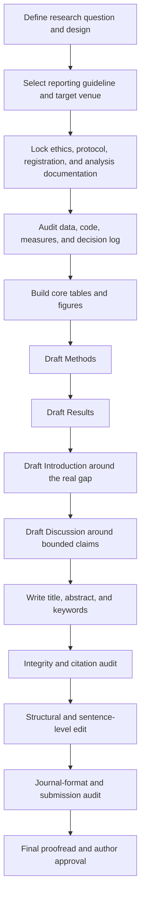

<!-- was: deep-research-report (2).md, repo root -->

> **Внешний источник, не наши правила.** Это выгрузка отчёта deep research от
> 31 августа 2026 про конвенции академического письма. Она не проходила
> проверку по первичным источникам и не является authority для Sanash.
> Операционные правила письма для нашей статьи живут в
> `research/coursework/`. При расхождении верны они.
>
> Перенесено из корня репозитория 2026-09-03. Из текста удалены 468 служебных
> маркеров цитирования вида `citeturn9search3`, оставшихся от выгрузки. Больше
> ничего не менялось.

# Academic Research Writing: Strict Rules and Essential Skills

**Practical, cross-disciplinary guide — researched and updated 31 August 2026**

> **Scope.** This guide separates genuine non-negotiable research-integrity requirements from conventions that depend on discipline, citation system, funder, institution, or journal. Where no discipline or journal is specified, the governing principle is: **scholarly accuracy first, transparency second, house style third**.

## Executive summary

High-quality academic writing is not defined by sounding impersonal, difficult, or “academic.” Its core function is to make a chain of reasoning inspectable: readers should be able to identify the research question, understand what was done, distinguish evidence from interpretation, trace claims to sources, judge uncertainty, and—where the design permits—reproduce or audit the work. Current APA guidance permits both active and passive voice and permits first-person pronouns for describing the authors’ own actions; blanket rules such as “never write *I/we*” or “always use the passive voice” are therefore style myths, not universal academic requirements. 

The strictest rules are integrity rules. Do not fabricate, falsify, plagiarize, conceal material methodological decisions, misrepresent exploratory analyses as prespecified, cite sources that do not support the associated claim, manipulate citations, conceal relevant conflicts of interest, or list authors who do not satisfy the applicable authorship policy. ICMJE explicitly makes authors responsible for reference accuracy and evidentiary support, recommends original research sources where possible, requires transparent disclosure of relationships and funding in its domain, and defines four cumulative authorship criteria. COPE treats artificial citation inflation as citation manipulation. 

For empirical manuscripts, IMRaD—Introduction, Methods, Results, Discussion—remains the dominant scientific architecture because it maps the research problem, procedures, findings, and interpretation. It is not universal: meta-analyses, qualitative work, case reports, humanities scholarship, theoretical papers, and other genres may require different structures. ICMJE explicitly recognizes alternative formats, while APA’s Journal Article Reporting Standards cover quantitative, qualitative, and mixed-methods research. 

Methodological reporting should be detailed enough to let a knowledgeable reader judge the analysis and, where applicable, reproduce it. At minimum, report the design, sample or source population, inclusion and exclusion logic, procedures, measures, preprocessing, analysis methods, uncertainty, software and versions, and the distinction between prespecified and exploratory analyses. ICMJE advises reporting uncertainty rather than relying only on *p* values; current APA quantitative reporting standards similarly emphasize sample-size rationale, effect sizes, exact *p* values where applicable, and confidence intervals. 

Open-science practices require scope-sensitive language. Preregistration is a timestamped, read-only record of a study plan created before data collection or analysis; it is a strong transparency mechanism but is not universally mandatory. Clinical-trial registration can be mandatory under journal or regulatory policies. Data sharing is also policy-dependent: NIH-funded work within the NIH Data Management and Sharing Policy must comply with an approved plan, while privacy, consent, legal, proprietary, or technical constraints can limit sharing. 

The most reliable practical workflow is to write from evidence outward rather than from prose inward: lock the research question and reporting guideline; document ethics, protocol, and analysis decisions; build tables and figures and the Methods/Results; draft the Introduction and Discussion around those results; write the abstract and title late; then run separate integrity, structural, sentence-level, reference, and formatting audits. Editing and proofreading should be separate passes because they solve different problems. 

**Priority key used throughout this guide**

| Priority | Meaning |
|---|---|
| **Critical** | Integrity, ethics, validity, or traceability issue; failure can invalidate the manuscript or block publication. |
| **High** | Material effect on interpretability, reproducibility, reviewer confidence, or scholarly precision. |
| **Standard** | Important presentation or efficiency convention; exact implementation may depend on house style. |

**Non-negotiable formal rules at a glance**

- Write claims at the strength the evidence permits; never convert association, uncertainty, or a null result into stronger language than the design supports.
- Make agency visible: identify who performed research decisions or analyses; do not use passive voice merely to sound objective.
- Keep person and tense logically consistent; first person is acceptable when the governing style permits it and it improves accountability.
- Define constructs, populations, time frames, thresholds, units, denominators, and comparisons precisely enough that readers do not have to infer them.
- Separate observations and results from explanations, mechanisms, recommendations, and speculation.
- Hedge proportionally: neither “prove” uncertain findings nor bury well-supported conclusions under unnecessary qualifiers.
- Use neutral, specific, respectful, non-stigmatizing language and report identity or demographic variables with methodological relevance and context.
- Prefer clear, direct syntax over prestige vocabulary, inflated nominalizations, or unnecessary jargon.
- Maintain one meaning per technical term; define nonstandard abbreviations at first use and use them consistently.
- Treat clarity as an accuracy requirement: if a sentence permits a materially wrong interpretation, it requires revision.

## Formal rules for scholarly prose

The safest cross-disciplinary principle is **controlled explicitness**: say exactly who did what, under what conditions, with what evidence, and with what degree of certainty. APA describes its style and grammar guidance as supporting clear, concise, inclusive scholarly communication, and its bias-free language guidance instructs writers to avoid prejudicial or demeaning language. 

| Rule or skill | Rationale | Concrete implementation | Incorrect → better | Priority |
|---|---|---|---|---|
| **Professional, evidence-led tone** | Hype and emotional evaluation obscure the evidentiary basis of a claim. Scholarly tone should be clear and straightforward rather than ornate.  | Remove promotional adjectives; replace evaluation with observable evidence; reserve emphasis for effect magnitude, novelty actually demonstrated, or practical importance. | “This **groundbreaking** study clearly proves…” → “The study provides evidence that…” | **High** |
| **Prefer active voice when agency matters** | Active constructions often make responsibility and action clearer; APA permits both voices and favors active voice when it improves directness.  | Put the relevant actor before the verb: “We excluded…,” “Participants completed…,” “The algorithm classified….” Use passive voice when the actor is unknown, irrelevant, or the procedure/result deserves focus. | “It was decided that three cases would be excluded.” → “We excluded three cases according to the preregistered criterion.” | **High** |
| **Use first person when it increases accountability** | APA permits “I” for a sole author and “we” for coauthors when describing their work; forced third person can make agency less clear.  | Use first person for research decisions, analytic actions, and argument moves where the style permits. Do not use “we” vaguely to mean humanity at large. | “The authors of the present study coded the transcripts…” → “We coded the transcripts…” | **Standard** |
| **Choose tense by rhetorical function and keep it stable** | Tense tells readers whether a statement concerns established knowledge, completed procedures, observed results, or current interpretation. APA instructs writers to use verb tense consistently.  | Common pattern: present for established claims/current interpretation; past for completed procedures and observed findings; present perfect or past for previous literature depending on context. Follow field conventions. | “Participants complete the survey and scores increase…” → “Participants completed the survey; mean scores increased…” | **High** |
| **Be numerically and operationally precise** | Readers need quantities, definitions, and denominators to evaluate a statement. ICMJE advises reporting absolute numbers as well as percentages and specifying procedures sufficiently for reproduction.  | State denominator, unit, time window, operational definition, threshold, comparison, and uncertainty whenever they matter. | “Most participants improved.” → “Thirty-seven of 52 participants (71%) improved by at least 5 points at week 8.” | **Critical/High** |
| **Optimize clarity before elegance** | Writing-center guidance treats organization, transitions, paragraph logic, and sentence clarity as distinct from surface correctness.  | Put familiar context before new information; keep the subject close to its verb; replace stacked nominalizations with verbs; split sentences carrying several independent claims. | “The implementation of an evaluation of…” → “We evaluated…” | **High** |
| **Separate observation from interpretation** | Results and interpretation answer different questions. ICMJE advises reporting findings logically and reserving mechanisms, implications, limitations, and contextualization for Discussion.  | Label what the data show, what you infer, and what remains uncertain. Do not insert an untested mechanism into a descriptive result sentence. | “Scores fell because the intervention reduced anxiety.” → “Scores fell after the intervention. One possible explanation is reduced anxiety.” | **Critical** |
| **Hedge in proportion to evidence** | Overclaiming is inaccurate; excessive hedging can also obscure the actual conclusion. ICMJE advises avoiding unqualified conclusions not adequately supported by data.  | Match verbs to design: use *caused* only when causal identification warrants it; otherwise consider *was associated with*, *is consistent with*, *suggests*, or *may*. Quantify uncertainty where possible. | “X proves Y.” → “X was associated with Y (adjusted estimate…, 95% CI…).” | **Critical** |
| **Avoid biased, stigmatizing, or irrelevant labeling** | Bias-free language improves accuracy and respect. APA asks writers to strive for bias-free language; ICMJE advises neutral, precise, respectful descriptions and contextualized reporting of demographic variables.  | Use participants’ or communities’ preferred terminology where known; distinguish sex from gender when relevant; report categories only when justified; explain how categories were determined. | “The elderly failed to comply.” → “Participants aged 75 years or older had lower protocol adherence.” | **Critical/High** |
| **Avoid anthropomorphism and vague agents** | Statements such as “the study believes” obscure who interpreted evidence. APA cautions against attributing human actions to inanimate entities.  | Make the appropriate agent explicit: “The authors argue…,” “The results indicate…,” “The model estimates….” | “The paper thinks…” → “The authors argue…” | **Standard** |

A useful test for every claim is the **reader-audit test**: *Can a skeptical reader identify the actor, action, evidence, scope, comparison, time frame, and uncertainty without guessing?* If not, revise.

Several sentence repairs are especially high-yield:

| Problem | Weak wording | Stronger wording |
|---|---|---|
| Empty certainty | “Obviously, the intervention works.” | “The intervention group had a higher mean outcome than the control group; the estimated difference was…” |
| Causal overreach | “Screen time causes depression.” | “Higher screen time was associated with higher depression scores in this observational sample.” |
| Vague quantifier | “Many respondents disagreed.” | “64 of 103 respondents (62%) disagreed.” |
| Hidden decision | “Outliers were removed.” | “We removed observations exceeding the preregistered ±3 SD criterion (n = 4).” |
| Pseudo-objectivity | “It was believed that…” | “We hypothesized that…” |
| Unsupported novelty | “This is the first study ever to…” | “We found no earlier study addressing X in the databases and date range searched; we therefore describe this as, to our knowledge, an early study of X.” |

**Objectivity does not mean pretending that researchers made no decisions.** A sentence such as “three cases were excluded” can be less objective than “we excluded three cases using criterion X” because the latter exposes the decision and makes it auditable. APA’s acceptance of first person and active voice is consistent with this accountability-based view of scholarly style. 

**Hedging should track evidence, not habit.** Useful gradations include *demonstrates* when a result directly establishes the stated proposition within the relevant inferential scope; *supports* when evidence favors a proposition; *suggests* when inference is plausible but less secure; *is consistent with* when several explanations remain possible; and *may* when indicating possibility. These are not interchangeable decorations. ICMJE’s requirement to avoid unsupported, unqualified conclusions makes calibration substantive rather than cosmetic. 

## Structure and argument architecture

Structure is not decorative formatting; it is the visible map of the research logic. ICMJE describes IMRaD as a reflection of the scientific discovery process and explicitly recognizes that other article types may use different formats. Reporting guidelines such as CONSORT, STROBE, PRISMA, and STARD are intended to improve completeness of reporting; the EQUATOR Network indexes many design-specific guidelines and stresses that reporting guidelines describe what should be reported rather than dictating study design. 

| Element or skill | Rationale | Concrete implementation | Short example | Priority |
|---|---|---|---|---|
| **Title** | A title should give a distilled, retrievable description of the work; some reporting guidelines and journals require the design in the title.  | Name the main phenomenon, intervention/exposure, population/context when useful, and study design when informative or required. Remove hype and unexplained abbreviations. | Weak: “A Novel Investigation of Learning.” Better: “Retrieval Practice and Delayed Recall in Undergraduate Students: A Randomized Study.” | **High** |
| **Abstract** | Abstracts may be the only substantive portion visible in databases; they must faithfully match the manuscript. ICMJE requires structured abstracts for original research, systematic reviews, and meta-analyses in its domain and warns against overinterpretation.  | State context, objective, design/methods, sample, main quantitative or thematic findings, uncertainty where relevant, principal conclusion, and key limitation if format permits. Write it late and cross-check every number. | Do not write “effective” if the reported estimate is uncertain or does not justify that conclusion. | **Critical/High** |
| **Keywords** | Keywords support retrieval, but their number and format are journal/database specific. | Follow the target journal exactly. Prefer recognized indexing terms plus precise topic terms; avoid redundant variants that add no retrieval value. | “machine learning; clinical prediction; calibration; external validation” rather than four near-synonyms. | **Standard** |
| **Introduction** | Readers need the problem, what is known, the unresolved gap, and the exact question—not a miniature textbook. ICMJE advises context, significance, and a specific objective or hypothesis with directly pertinent references.  | Use a narrowing sequence: problem → relevant evidence → unresolved gap → objective/question/hypothesis. Make the final paragraph auditable against Methods and Discussion. | “We therefore tested whether…” | **High** |
| **Methods** | Methods are the audit trail for what was actually done. ICMJE’s guiding principle is sufficient clarity about how and why the study was conducted, with enough detail for reproduction when possible.  | Report design, setting/time, participants/data source, eligibility, measures/materials, procedures, ethics, preprocessing, analysis, software/versions, deviations, and prespecified versus exploratory decisions. | “Analyses used R version X and package Y version Z…” | **Critical** |
| **Results** | Results must correspond to the planned questions and should not hide unfavorable or null outcomes. ICMJE advises reporting all primary and secondary outcomes identified in Methods and not duplicating every table value in prose.  | Follow Methods/outcome order unless a clearer logic is justified. Lead with primary findings. Give estimates, denominators, uncertainty, and relevant diagnostics. | “The adjusted mean difference was 2.1 points (95% CI 0.4 to 3.8).” | **Critical** |
| **Discussion** | The Discussion converts results into bounded claims. ICMJE recommends main findings, context in the totality of evidence, limitations, implications, and conclusions tied to study goals.  | Sequence: answer → comparison with prior evidence → mechanisms/interpretation → strengths and limitations → implications → calibrated conclusion. Label new hypotheses as hypotheses. | “These results suggest…, but the single-site sample limits generalizability.” | **Critical/High** |
| **Headings** | Descriptive headings improve navigation and comprehension; APA recommends concise, descriptive headings.  | Use a consistent hierarchy and parallel grammatical form. A heading should predict the section’s content. Avoid excessive one-paragraph subdivisions. | “Sensitivity analyses” is more informative than “Additional information.” | **Standard** |
| **Paragraphing** | Coherent paragraphs allow readers to follow one argumentative step at a time. Writing-center guidance emphasizes unity, development, logical sequence, and transitions.  | Build most analytical paragraphs as **claim/topic → evidence → interpretation → link or qualification**. Split when the controlling idea changes. | One paragraph should not simultaneously introduce a theory, report a result, rebut a critic, and explain a limitation. | **High** |
| **Transitions** | Good transitions expose logical relationships instead of merely joining sentences cosmetically.  | State the relationship: contrast, consequence, extension, concession, mechanism, sequence, or return to the research question. | Weak: “Additionally…” Better: “In contrast to the primary analysis…” | **Standard/High** |

**When IMRaD is not the right default.** Humanities articles commonly organize around a thesis and successive interpretive claims; theoretical or conceptual papers may proceed by problem, framework, derivation, objections, and implications; qualitative reports may organize findings by themes or cases; systematic reviews use review-specific methods and reporting standards; case reports have their own conventions. The strict rule is not “use IMRaD everywhere” but **use the structure that makes the evidentiary logic explicit and follow the reporting standard appropriate to the design**. ICMJE explicitly recognizes non-IMRaD formats, and APA JARS provides separate standards for quantitative, qualitative, and mixed-methods research. 

A strong paragraph generally performs one main argumentative function. The practical pattern is:

> **Topic/claim → evidence → interpretation → qualification or connection**

That pattern should not become a rigid template. A methodological paragraph may instead move from procedure to rationale; a literature paragraph may synthesize several sources before stating the inference. The controlling principle is that readers should know why every sentence is in that paragraph and how the paragraph advances the section.

**Recommended writing process**



A practical implication of this workflow is that the abstract should be written late, rather than used as a speculative promise about results the completed manuscript does not actually report. ICMJE specifically warns that abstracts and main text can diverge and calls for consistency between them. 

For empirical work, the four IMRaD sections can be treated as four different questions:

| Section | Primary question | What does **not** belong here by default? |
|---|---|---|
| **Introduction** | Why was this study necessary, and what exactly was asked? | Your study’s results or a long general literature encyclopedia |
| **Methods** | Exactly what was done, and why? | Results discovered after the procedures were chosen, unless clearly identified as deviations |
| **Results** | What was found? | Untested explanations, advocacy, or lengthy comparison with previous literature |
| **Discussion** | What do the findings mean within their uncertainty and context? | A verbatim repetition of tables and Results prose |

This division follows ICMJE’s distinction between study context, methodological detail, results, and interpretation. 

## Citation, referencing, and source ethics

A citation system has two jobs: **attribution** and **retrievability**. Attribution shows whose idea, evidence, or wording is being used; retrievability lets readers locate the source and, ideally, the exact passage or data object. Punctuation differs by style, but the integrity requirement is invariant: the cited source must genuinely support the associated claim. ICMJE explicitly places responsibility for this verification on authors. 

**Comparison of major citation styles**

| Style | Current core authority as of Aug. 2026 | In-text system | End matter | Ordering | DOI / URL handling | Common context, not a mandate |
|---|---|---|---|---|---|---|
| **APA** | *Publication Manual of the American Psychological Association*, 7th ed., the official APA Style source.  | Author–date; page or paragraph locator for direct quotation and when useful for a precise paraphrase. APA pairs in-text citations with reference entries.  | **References** | Alphabetical by author, with style-specific ordering rules. | Include a DOI when a work has one; APA formats DOIs/URLs as links and treats DOI or URL as the final reference element.  | Social and behavioral sciences; many interdisciplinary venues. |
| **MLA** | *MLA Handbook*, 9th ed., the official MLA handbook.  | Author or shortest identifying element + location marker such as page, line, or time when relevant; no year by default.  | **Works Cited** | Alphabetical, following MLA’s core-elements/container model.  | For online works, MLA’s stated preference is DOI, then permalink, then URL.  | Literature, languages, cultural studies, many humanities courses. |
| **Chicago** | *The Chicago Manual of Style*, 18th ed., the current online edition.  | Two systems: **Notes–Bibliography** uses numbered footnotes/endnotes; **Author–Date** uses parenthetical author + year.  | **Bibliography** or **Reference List** | Usually alphabetical in bibliography/reference list; notes occur in text order. | For online journal articles, Chicago’s examples use a URL, preferably DOI-based.  | Notes–Bibliography is common in humanities; Author–Date in sciences/social sciences. |
| **Vancouver / ICMJE–NLM family** | ICMJE Recommendations + NLM *Citing Medicine* / NLM sample references. ICMJE directs authors to NLM formatting resources.  | Numeric citations in order of first mention; ICMJE specifies Arabic numerals in parentheses.  | Numbered **References** | Citation order, not alphabetical. | DOI inclusion and punctuation follow the target journal/NLM implementation; verify the journal’s current instructions. | Medicine and biomedical journals; “Vancouver” is a family of related numeric implementations. |

**House style overrides generic style.** A journal may use an APA-like author–date system but modify punctuation, author truncation, article-number handling, data citations, or reference limits. Chicago itself tells authors to use the system required by their publisher or field; ICMJE likewise tells authors to consult the target journal. 

**DOI handling.** When a DOI is available and the selected style calls for it, use the canonical persistent form rather than a session-specific database URL. Crossref’s current display guidance uses the full resolver form below. 

```text
https://doi.org/10.xxxx/xxxxx
```

Do not invent a DOI, reconstruct one from memory, or substitute a search-results URL when a stable identifier is available. The exact rules for access dates, ordinary URLs, database names, and retrieval statements vary by citation style and source type; the target style guide therefore controls those details. 

**In-text citation versus reference list.** The in-text citation should let readers map a claim to the correct full bibliographic entry; the reference entry should provide enough information to identify and retrieve the work according to the selected style. MLA explicitly describes in-text references as pointers to Works Cited entries, Chicago Author–Date maps parenthetical references to a reference list, and ICMJE/NLM use numeric references tied to the numbered list. 

The final manuscript should therefore undergo a **bidirectional check**:

1. Start with every in-text citation and confirm that the correct reference entry exists.
2. Start with every bibliography/reference-list entry and confirm that it is actually cited, except for styles or document types that legitimately permit uncited bibliography items.
3. Verify author names, year, title, journal/book information, page/article number, DOI or stable identifier, and publication status.
4. Confirm that the source supports the exact claim for which it is cited.
5. Check whether the source has been corrected or retracted when that matters.

ICMJE explicitly requires bibliographic accuracy, support for associated claims, and checking retractions. 

| Citation-ethics rule | Rationale | Implementation | Correct vs incorrect | Priority |
|---|---|---|---|---|
| **Every citation must support the nearby claim** | Citation presence is not evidence unless the source actually entails or documents the statement. ICMJE makes authors responsible for verifying that references support associated claims.  | Reopen every load-bearing source during final editing; check the exact passage, population, design, direction, magnitude, and limitations. | Incorrect: cite a correlational paper after “X causes Y.” Correct: write “X was associated with Y” unless causal evidence supports more. | **Critical** |
| **Prefer original research for original empirical claims** | Reviews are valuable syntheses but can compress or mischaracterize primary studies; ICMJE recommends direct references to original research whenever possible.  | Use a review to map the field, then inspect and cite the primary paper for a specific experiment or result. | “Study A found…” should normally cite Study A, not only Review B. | **High** |
| **Do not cite a source you have not inspected as though you did** | Secondary citation can transmit errors and hides the evidentiary chain. MLA advises consulting the original source whenever possible and signaling indirect use when it cannot be consulted.  | Obtain the original. If impossible, use the style’s indirect-source convention and make the limitation visible. | Incorrect: list an unseen 1950 source as personally consulted. Correct: cite it transparently through the source actually read. | **Critical** |
| **Paraphrase ideas, not merely vocabulary** | APA and MLA both treat uncredited use of another author’s ideas or distinctive wording as plagiarism; APA also warns against patchwriting.  | Read until understood; close the source; write the idea from your own conceptual structure; compare against the original for accidental copying; cite. | Incorrect: synonym-swap while preserving source syntax. Correct: reconstruct the claim and logic in your own sentence, then cite. | **Critical** |
| **Quote exactly and for a reason** | Direct quotation preserves another author’s exact wording and therefore requires unmistakable attribution and a locator under the relevant style. MLA’s in-text guidance requires location markers when relevant.  | Use quotation marks or block format as required; reproduce wording exactly; supply page/line/time/section locator when available; interpret the quotation. | Incorrect: lightly alter a quotation without marking changes. Correct: quote exactly or paraphrase fully. | **Critical** |
| **Avoid both undercitation and citation clutter** | APA warns against undercitation, which can create plagiarism risk, and unnecessary overcitation.  | Cite where source-dependent material begins; repeat when a long passage would otherwise make source boundaries ambiguous. | One citation after a page of mixed-source claims is too vague; a citation after every clause from one clearly signaled source may be excessive. | **High** |
| **Never manipulate citations for metrics or favor** | COPE treats citation practices intended to inflate citation metrics artificially as citation manipulation.  | Include references for intellectual or evidentiary relevance, not merely to inflate a journal, author, or institution. Document questionable reviewer requests. | Incorrect: add ten irrelevant citations to appease a reviewer. Correct: add only genuinely relevant work. | **Critical** |
| **Check retractions and bibliographic accuracy** | ICMJE requires reference accuracy and advises checking that cited papers have not been retracted except where the retraction is itself relevant.  | Before submission, resolve every DOI/title/author/year, run retraction checks, and verify quotations and locators against originals. | A reference-manager entry is a draft record, not proof that metadata are correct. | **Critical** |
| **Treat AI output as assistance, not authority** | Current ICMJE guidance says AI-generated material should not be used as a primary source, AI cannot be an author, and humans remain responsible for accuracy, integrity, originality, and plagiarism checks.  | Trace substantive factual claims to original scholarly sources; disclose AI use where required; independently verify every generated citation. | Incorrect: cite a chatbot for a scientific fact. Correct: cite the underlying study, dataset, standard, or official source. | **Critical** |

A safe paraphrasing procedure is:

> **Understand → hide the source → reconstruct the idea → compare against the original → cite**

A safe quotation procedure is:

> **Copy exactly → mark as a quotation immediately → record the locator → explain why the wording matters → verify against the original during the final audit**

APA explicitly defines paraphrasing as expressing another source’s ideas in one’s own words while crediting that source, and MLA treats paraphrasing another person’s ideas without proper credit as plagiarism. 

**Paraphrase example**

Incorrect patchwriting:

> Original idea: Researchers found that social support reduced the relationship between occupational stress and burnout.  
> Weak “paraphrase”: Researchers discovered that social support decreased the relationship between work stress and burnout.

The structure and conceptual wording have barely changed.

Better:

> Employees reporting stronger social support showed a weaker association between work-related stress and burnout (Author, Year).

The idea has been reconstructed rather than cosmetically synonymized, and attribution remains.

**Quotation rule.** Direct quotation is strongest when the wording itself is evidence—for example, when interpreting a historical text, defining a contested concept, or analyzing policy language. For ordinary factual synthesis, paraphrase is normally more efficient because it lets the writer integrate evidence into the manuscript’s own argument while still citing the source. Exact formatting, quotation length thresholds, and block-quotation conventions remain style-specific. 

## Methodological transparency and research ethics

Methodological prose is not merely descriptive; it is part of the evidence. A reader should be able to distinguish what was planned from what was decided after seeing the data, determine how observations entered the analysis, understand how uncertainty was quantified, and identify what materials are available for verification. ICMJE’s current recommendations require sufficient methodological and statistical detail for evaluation and verification in its domain. 

| Methodological rule or skill | Rationale | Concrete implementation | Brief example | Priority |
|---|---|---|---|---|
| **Report enough detail for reproducibility and auditability** | ICMJE says Methods should be sufficiently detailed for others with access to the data to reproduce results.  | State design, setting/dates, sampling/data source, eligibility, instruments/materials, procedures, preprocessing, exclusions, coding, models/tests, assumptions/diagnostics, missing-data treatment, software and versions. | “We winsorized values above…” is reproducible only if the threshold and timing are stated. | **Critical** |
| **Distinguish prespecified from exploratory analyses** | Readers need to know which tests were planned before outcomes were known. ICMJE explicitly requires this distinction for statistical analyses.  | Label primary, secondary, and exploratory outcomes/analyses; link to protocol/preregistration where applicable; list and justify deviations. | “This subgroup analysis was exploratory and not preregistered.” | **Critical** |
| **Preregister when it meaningfully protects confirmatory inference** | OSF defines preregistration as a timestamped, read-only study plan posted before data collection or analysis, creating a transparent record of intentions.  | Register hypotheses, outcomes, exclusions, sample-size rule, models, transformations, and stopping logic before the relevant data are observed. Report deviations transparently. | Do not rewrite a post hoc hypothesis as though it had been the original confirmatory hypothesis. | **High / Critical where required** |
| **Register clinical trials when the applicable policy requires it** | ICMJE policy requires prospective registration of interventional clinical studies for journals following its policy.  | Determine applicability before enrollment; use an accepted public registry; keep outcomes and amendments current; report the registration identifier. | Clinical-trial registration is not interchangeable with generic OSF preregistration. | **Critical where applicable** |
| **Report the sample-size rationale before interpreting results** | APA reporting standards call for sample-size, power, or precision information; CONSORT 2025 expects the assumptions underlying randomized-trial sample-size calculations.  | For power-based designs, report target effect, variance/rate assumptions, α, target power, allocation, attrition adjustment, and formula/software where relevant. For other designs, report the appropriate rationale rather than forcing a power calculation where it does not fit. | “Target n = 240 provided 90% power to detect…” followed by assumptions. | **Critical/High** |
| **Report effects and uncertainty, not only thresholds** | ICMJE warns that *p* values alone do not convey effect magnitude or precision. APA quantitative standards emphasize exact *p* values, effect sizes, and confidence intervals where appropriate.  | Give the estimate, unit/scale, interval estimate, *n*, model/test, and exact *p* where applicable. Distinguish statistical from practical or clinical importance. | Weak: “The effect was significant (*p* < .05).” Better: “Mean difference = 4.2 points, 95% CI 1.1 to 7.3, *p* = .008.” | **Critical** |
| **Report denominators, missingness, exclusions, and attrition** | Percentages and model outputs are difficult to interpret without knowing which observations contributed. ICMJE asks for absolute numbers with percentages and complete outcome reporting.  | Track sample flow from eligible → enrolled/included → analyzed; explain exclusions and missing-data handling; report analysis-specific *n* where it changes. | “47/61 (77%) responded” rather than only “77% responded.” | **Critical** |
| **Use a design-specific reporting guideline** | EQUATOR indexes CONSORT, STROBE, PRISMA, SRQR, CARE, STARD, ARRIVE, CHEERS, and many other guidelines; reporting guidelines improve completeness but do not substitute for sound design.  | Identify the design early, obtain the current checklist and explanation document, map each item to the manuscript, and submit the checklist if required. | RCT → CONSORT 2025; systematic review → PRISMA 2020; observational study → STROBE. | **High / Critical where required** |
| **Provide a data, code, and materials availability statement** | Data sharing can enable validation and reuse; NIH’s policy, for work within its scope, requires a DMS plan and compliance while recognizing legitimate restrictions.  | State what is available, where, persistent identifier, license/access conditions, documentation, and ethical/legal restrictions. Include code and environment information when needed to reproduce results. | “De-identified data and analysis code are available in Repository X under PID Y; raw audio cannot be shared because consent did not permit it.” | **High / Critical where required** |

**Minimum reproducibility inventory**

For a typical quantitative empirical manuscript, an informed reader should be able to recover or reconstruct:

- research design and setting;
- dates or temporal boundaries;
- target and source population;
- recruitment or sampling mechanism;
- eligibility and exclusion criteria;
- final analytic sample and flow from initial observations;
- operationalization of every primary construct;
- instruments, equipment, materials, or datasets;
- interventions/exposures and comparators where relevant;
- randomization, allocation concealment, and blinding where relevant;
- preprocessing and data-cleaning rules;
- treatment of outliers, exclusions, and missing data;
- primary and secondary outcomes;
- statistical models/tests and model specifications;
- assumptions, diagnostics, transformations, and multiplicity procedures where relevant;
- software, packages, and versions;
- which analyses were prespecified and which were exploratory;
- deviations from protocol/preregistration;
- data, code, and materials availability.

This inventory operationalizes ICMJE’s reproducibility and statistical-detail principles; design-specific checklists may require substantially more. 

**Sample size and power.** A power calculation is not a ritual paragraph inserted after data collection. When a study was prospectively sized by power, report the assumptions that generated the target sample. For randomized trials, current CONSORT guidance expects enough information to reconstruct the calculation, including the primary outcome and assumptions such as the targeted difference, variability where applicable, type-I error, power, allocation, and adjustments such as attrition where relevant. APA reporting standards likewise ask authors to explain sample size, power, or precision. 

For other designs, the right justification may instead be precision, expected information yield, saturation-related reasoning in qualitative work, a population census, a fixed archival dataset, feasibility constraints, or another discipline-specific rationale. The essential rule is to **state the real rationale rather than retrofitting an inappropriate power analysis**.

**Statistical reporting.** “Statistically significant” is not a substitute for reporting what happened. ICMJE recommends quantifying findings with indicators of uncertainty such as confidence intervals, avoiding reliance on *p* values alone, specifying software and versions, and distinguishing prespecified from exploratory analyses. 

A stronger result sentence therefore looks like:

> “The intervention group scored 4.2 points higher than the control group at week 8 (adjusted mean difference 4.2, 95% CI 1.1 to 7.3, *p* = .008).”

rather than:

> “The intervention was statistically significant.”

The former gives direction, magnitude, scale, uncertainty, and test evidence. The latter gives only a threshold classification.

**Do not confuse nonsignificance with equivalence.** A wide interval around an estimate may be compatible with both meaningful benefit and meaningful harm even when *p* > .05. The manuscript should interpret the estimate and uncertainty in relation to the research question rather than treat a threshold decision as proof that “there is no effect.” ICMJE’s recommendation not to rely solely on *p* values follows this logic. 

**Data availability is not equivalent to “open everything.”** Privacy, informed-consent terms, data-sovereignty rules, security, contracts, proprietary rights, and law can restrict sharing. The correct response is not silent non-sharing but a precise availability statement explaining what can be shared, what cannot, why, and under what access procedure. NIH explicitly recognizes limitations on sharing and requires safeguarding privacy and confidentiality in work covered by its policy. 

**Ethical reporting rules**

| Rule or skill | Rationale | Concrete implementation | Brief example | Priority |
|---|---|---|---|---|
| **Ethics review / IRB / REC** | Human-participant research may require independent ethics review. ICMJE instructs authors in its scope to seek independent review, and the current WMA Declaration of Helsinki is the 2024 version.  | Obtain approval or a documented exemption/waiver **before** conducting activities for which it is required. Report committee name, approval identifier, and waiver information according to policy. | “The University X REC approved the study (2026-014); written consent was obtained.” | **Critical** |
| **Informed consent and privacy** | The 2024 Helsinki Declaration states that participation by capable persons in medical research must be voluntary and based on adequate information.  | Report how consent was obtained or why a waiver applied; remove unnecessary identifiers; obtain publication consent for identifiable material when required. | Do not assume research-participation consent automatically authorizes publication of identifiable images. | **Critical** |
| **Conflicts of interest and funding** | Readers need to judge whether secondary interests or sponsor roles could affect the work. ICMJE requires disclosure of relationships/activities that might bias or appear to bias the work and recommends transparent funding and sponsor-role statements.  | Collect disclosures from all authors; name direct funders; state involvement in design, data, analysis, writing, and publication decisions—or explicitly state no role. | “The funder had no role in study design, analysis, manuscript preparation, or submission decision.” | **Critical** |
| **Authorship** | Authorship confers credit and accountability. ICMJE requires all four of its criteria: substantial contribution; drafting or critical intellectual revision; final approval; accountability.  | Agree authorship early and revisit it; document contributions; require each listed author to approve the final version and accept accountability under the applicable policy. | Funding acquisition alone does not satisfy ICMJE authorship criteria. | **Critical** |
| **Acknowledgments and contributor roles** | Contributors who do not meet authorship criteria should not be promoted to authors, but genuine contributions should be credited. ICMJE recommends acknowledgment; CRediT provides 14 standardized contributor roles but explicitly does not determine authorship.  | Use acknowledgments for non-author contributions; use CRediT if the venue supports it; obtain permission to name acknowledged individuals when required. | “Methodology: A.B.; Data curation: C.D.; Writing—review & editing: …” | **High/Critical** |
| **AI-assisted work** | Current ICMJE guidance states that AI cannot be an author and humans remain responsible for submitted material. It recommends reporting writing assistance in acknowledgments and research, analysis, or figure-generation uses in Methods.  | Check the target journal’s AI policy; disclose tool, purpose, version and, where relevant, prompts/procedure; verify output; protect confidential data; retain human responsibility. | “AI-assisted language editing was used; all substantive content and references were verified by the authors.” | **Critical/High** |
| **No simultaneous duplicate submission or concealed overlap** | ICMJE publication-ethics guidance prohibits simultaneous submission of the same manuscript to multiple journals and requires transparency about overlapping work in its domain.  | Submit to one journal at a time unless an explicit policy allows otherwise; disclose preprints, conference versions, related manuscripts, reused datasets, and overlapping text/data as required. | Do not split one study into minimally different papers merely to multiply publications. | **Critical** |

Under ICMJE’s authorship framework, **all four authorship conditions are cumulative**, not a menu from which one or two may be chosen: substantial contribution to conception/design or acquisition/analysis/interpretation; drafting or critical intellectual revision; final approval; and accountability for the work’s integrity. People who contribute but do not meet all four should generally be acknowledged rather than made authors under this framework. 

CRediT solves a different problem. Its 14-role taxonomy can document contributions such as conceptualization, data curation, methodology, software, visualization, supervision, and writing, but its official guidance explicitly says that it does **not** determine authorship. Thus a manuscript can use both: an authorship criterion to decide who belongs on the byline and CRediT to describe what contributors actually did. 

These medical and biomedical authorities are particularly detailed, but they are not substitutes for local law or a nonmedical discipline’s ethics code. For human, animal, sensitive-data, community-based, or otherwise ethically regulated research, check the governing institution, funder, jurisdiction, and journal **before data collection**, not merely when writing the paper. The universal writing principle is to report the applicable approval, consent, safeguards, and limitations truthfully and specifically. 

## Formatting, visual presentation, and submission

Exact margins, fonts, line spacing, reference punctuation, maximum figure counts, and file formats are **not universal academic rules**. They are submission-system and journal rules. The non-negotiable skill is therefore requirements control: create a target-journal specification sheet and verify the manuscript against it immediately before submission. ICMJE repeatedly directs authors to individual journal instructions for details such as reference presentation, units, figures, and tables. 

| Element | Rationale | Implementation | Example or test | Priority |
|---|---|---|---|---|
| **Tables** | Tables should communicate precise values efficiently without forcing readers back to prose. ICMJE recommends consecutive numbering, self-explanatory titles, concise headings, explanatory footnotes, and identification of variability measures.  | One purpose per table; define *n*, units, abbreviations, statistics, and missing-value conventions; cite every table in text; do not duplicate the same dataset in a figure. | Reader test: can the table be interpreted correctly when viewed alone? | **High** |
| **Figures** | Figures must remain legible and interpretable after publication processing. ICMJE advises clear, consistent labels, self-explanatory design, numbered order, and detailed legends.  | Use meaningful axis labels and units; explain symbols, error bars, and model curves in the legend; preserve resolution; avoid decorative 3-D effects; obtain required permissions. | Legend: “Points show adjusted means; bars show 95% CIs; n = ….” | **High** |
| **Captions / legends** | Captions contain contextual information necessary to interpret a display correctly.  | State what is shown, population/condition if not obvious, units, statistic, uncertainty/error-bar definition, abbreviations, and source/permission when relevant. | Avoid “Figure 2. Results.” | **High** |
| **Units** | Unit inconsistency creates ambiguity. ICMJE uses metric units and instructs authors to follow journal-specific SI/local-unit requirements.  | Use one system consistently; place units in column/axis headings rather than repeating them in each cell; verify conversions. | “Concentration (mg/L)” in header. | **High** |
| **Abbreviations** | Excess abbreviations increase cognitive load. ICMJE advises standard abbreviations and definition at first mention; APA similarly recommends defining most abbreviations on first use.  | Abbreviate recurring terms only; define at first use in abstract and main text as required; keep a consistency list; avoid unexplained abbreviations in titles. | “structural equation modeling (SEM)” then “SEM.” | **Standard/High** |
| **Supplementary material** | Supplements should extend transparency, not hide information necessary to understand the primary report. ICMJE states that electronic supplementary material should be submitted with the manuscript for peer review.  | Move long instruments, robustness checks, codebooks, protocols, extra tables, and derivations to supplements only when the main paper remains interpretable. Cross-reference every item. | “See Supplementary Table S3 for the full sensitivity analysis.” | **High** |
| **Permissions and source acknowledgment** | Reused tables or figures may be subject to copyright or license conditions. ICMJE requires acknowledgment and permission for previously published figures except where an exception applies.  | Check the license; obtain permission where required; retain documentation; label adaptations and sources accurately. | “Adapted from…” with the applicable attribution. | **Critical** |
| **Submission package** | A scientifically sound manuscript can still be returned if required files or statements are absent. ICMJE notes journal-specific requirements, and EQUATOR notes that many journals require completed reporting checklists.  | Prepare manuscript, title page, anonymized version if required, cover letter, figures, supplements, reporting checklist, ethics statements, disclosures, data statement, author contributions, and metadata. | Run the checklist below on the final generated files. | **Critical/High** |

**Sample table layout**

```markdown
**Table 1. Baseline characteristics of the analytic sample**

| Variable | Group A (n = 118) | Group B (n = 121) |
|---|---:|---:|
| Age, years, mean (SD) | 34.8 (9.6) | 35.2 (10.1) |
| Outcome score, mean (SD) | 18.4 (4.2) | 18.1 (4.5) |
| Completed follow-up, n/N (%) | 109/118 (92.4) | 108/121 (89.3) |

*Note.* SD = standard deviation. Percentages use the group-specific denominator.
Missing values: age, n = 2; baseline outcome, n = 1.
```

A good table title identifies the content rather than interpreting it. A good note explains conventions that are necessary to interpret values. Avoid putting a conclusion such as “Treatment A is superior” in a neutral descriptive table title unless that wording itself is required by the article genre.

**Sample figure and legend layout**

```text
Figure 1. Mean outcome score by study condition and assessment time

       [PLOT AREA]
Outcome ↑
score   |
        |
        +--------------------------→ Time
          Baseline   Week 4   Week 8

Note. Points represent model-adjusted means; error bars represent 95% confidence
intervals. Group A n = 118; Group B n = 121. The model adjusted for the
prespecified baseline covariates listed in Methods.
```

The legend should answer questions such as “What does each point or line represent?”, “What do the error bars mean?”, “What are the units?”, and “What population or analysis is shown?” ICMJE specifically recommends self-explanatory figures and legends that explain symbols and details. 

**Manuscript submission checklist**

| Area | Submission test | Pass criterion |
|---|---|---|
| **Journal fit** | Article type, scope, length, and submission route checked | All match current author instructions |
| **Reporting guideline** | Correct guideline identified | Current checklist completed and page/line locations supplied if requested |
| **Title** | Accurate, searchable, non-hyped | Design included where required; no unsupported claim |
| **Abstract** | Cross-checked against final text and tables | Every number and conclusion matches; required structure and word limit met |
| **Keywords** | Journal/indexing rules checked | Correct number and format; useful retrieval terms |
| **Methods** | Reproduction/audit test completed | Design, sample, measures, procedures, analysis, software, and deviations reported |
| **Sample size** | Rationale reported | Assumptions or another appropriate justification stated |
| **Statistics** | Estimate-and-uncertainty audit complete | Effect estimates, intervals, denominators, missingness, and tests/models reported as appropriate |
| **Registration / preregistration** | Applicability checked | Identifier and deviations reported where applicable |
| **Ethics / consent** | Approval and consent status verified | Committee, identifier or waiver, consent, and privacy statements included where required |
| **Data / code / materials** | Availability decision documented | Repository/PID/access conditions or justified restriction stated |
| **Authorship** | Every author re-confirms eligibility | Final order/contributions agreed; every author approves the manuscript |
| **Acknowledgments** | Non-author contributions reviewed | Contributors credited correctly; permissions obtained where required |
| **Conflicts / funding** | All author disclosures collected | Funding, sponsor role, and relevant relationships stated |
| **AI disclosure** | Tool use reviewed against journal policy | Required disclosures made; output independently checked |
| **Citations** | Claim-to-source audit complete | Sources support claims; quotations/locators verified; retractions checked |
| **Reference list** | Bidirectional cross-check complete | Every cited retrievable work appears correctly; no accidental orphan entries; metadata and DOIs checked |
| **Tables / figures** | Stand-alone interpretation test | Numbered and cited; units, abbreviations, uncertainty, legends, permissions correct |
| **Supplements** | All cross-references opened | Files complete, labeled consistently, submitted for review where required |
| **Language** | Structural editing and proofreading completed separately | No unresolved tracked changes, placeholders, undefined abbreviations, or inconsistent terminology |
| **Files / metadata** | Submission-system fields compared with manuscript | Author names, affiliations, ORCIDs where used, title, abstract, funding, and files agree |
| **Duplicate / overlap check** | Related outputs disclosed | No prohibited simultaneous duplicate submission; overlap/preprints disclosed as required |
| **Final approval** | Final generated files circulated | Every author approves the exact submitted version |

A useful submission habit is to treat the journal instructions as a **specification**, not reading material. Build a one-page requirements sheet covering article type, word counts, abstract format, citation style, title-page requirements, blinding, reporting guideline, figure formats, supplementary files, data policy, ethics wording, authorship/contributor statements, AI policy, and cover-letter requirements. ICMJE explicitly notes that individual journals vary on multiple manuscript and reference requirements. 

## Editing workflow, practical checks, and authoritative sources

Editing is a research skill because unclear language can change meaning. UNC’s Writing Center distinguishes **editing**—content, organization, evidence, transitions, paragraph structure, and sentence structure—from **proofreading**, which targets surface errors. Treating them as separate passes prevents authors from polishing sentences that later need to be deleted or reorganized. 

| Skill | Why it matters | Implementation | Example | Priority |
|---|---|---|---|---|
| **Reverse outlining** | Reveals whether the manuscript’s actual argument matches its intended structure. UNC recommends reverse outlining as a way to check organization.  | Write a 5–12-word label beside each paragraph stating its function. Reorder, merge, or delete paragraphs whose roles are duplicated or unclear. | If three consecutive paragraphs all mean “gap in literature,” compress them. | **High** |
| **Sentence-level agency editing** | Readers understand research decisions more readily when actor and action are explicit. | Underline the grammatical subject and main verb of every difficult sentence; replace abstract noun stacks with concrete agents and verbs. | “An evaluation of the implementation was undertaken” → “We evaluated the implementation.” | **High** |
| **Old-to-new information flow** | Purdue guidance recommends moving from familiar information toward new information to improve sentence clarity and cohesion.  | Begin with information already active in the reader’s mind; place the new or important element later; use it as the next sentence’s context when logical. | “This discrepancy may reflect sampling. **Sampling differences** were largest…” | **Standard/High** |
| **Concision** | Wordiness can conceal logical relationships. UNC and Purdue recommend cutting empty phrases and choosing specific words.  | Delete throat-clearing, doubled modifiers, redundant metadiscourse, and nominalizations while preserving necessary qualifications. | “It is important to note that…” → usually delete and state the point directly. | **High** |
| **Academic vocabulary control** | Precision matters more than rarity. Academic Phrasebank illustrates recurring rhetorical functions, including calibrated hedging, but phrases should serve reasoning rather than imitate prestige language.  | Build a field-specific term list; use one term per construct unless a distinction is intended; verify collocations; avoid thesaurus inflation. | Prefer “used” to “utilized” unless *utilize* adds a real technical distinction. | **Standard** |
| **Readability metrics as diagnostics only** | AHRQ warns that readability formulas do not measure comprehension and omit many factors affecting understanding.  | Use sentence-length or grade-level metrics only to flag passages for review. Never optimize to a numerical score at the expense of technical accuracy. | A high grade-level score may reflect necessary terminology rather than bad prose. | **Standard** |
| **Terminology and abbreviation consistency** | Inconsistent labels can imply conceptual differences that do not exist. | Maintain a manuscript style sheet covering construct names, capitalization, hyphenation, abbreviations, units, decimal places, and statistical notation. | Do not alternate among “participants,” “subjects,” and “users” for one sample without reason. | **High** |
| **Proofreading** | Surface errors can alter numbers, signs, units, references, and therefore substantive meaning. UNC recommends focused proofreading after editing.  | Proof in separate passes: prose; numbers/tables; citations; headings/cross-references; formatting. Change viewing medium or read aloud where useful. | Specifically check minus signs, decimals, CI bounds, table totals, and reference years. | **High** |

**Recommended revision sequence**

1. **Integrity pass:** claims versus evidence; prespecified versus exploratory work; ethics; authorship; conflicts; overlap.
2. **Argument pass:** question, contribution, structure, section functions, limitations.
3. **Method/reporting pass:** reporting-guideline checklist, reproducibility, sample-size rationale, statistics, data availability.
4. **Paragraph pass:** one controlling idea, evidence, interpretation, transition.
5. **Sentence pass:** agency, tense, precision, hedging, concision, bias-free language.
6. **Citation/display pass:** source support, retractions, metadata, tables, figures, units, supplements.
7. **Proof pass:** spelling, grammar, punctuation, numbering, cross-references, and submission metadata.

This deliberately moves from high-cost conceptual problems to lower-cost surface problems. UNC’s distinction between editing and proofreading supports separating global revision from final error checking. 

**Sentence-level editing protocol**

Take each difficult sentence and ask, in order:

**Who or what is the grammatical subject?** If the real actor is hidden inside phrases such as “the implementation of,” “the assessment of,” or “a decision was made,” restore the actor where appropriate.

**What is the main verb?** Prefer a strong research verb over a nominalized construction when meaning is unchanged: “we analyzed” rather than “we conducted an analysis of.”

**How many claims does the sentence contain?** A long sentence is not inherently bad, but several claims with different evidence or qualifications often deserve separate sentences.

**Where does the qualifier attach?** Words such as *only*, *approximately*, *primarily*, *potentially*, and *statistically* should sit next to the exact element they modify.

**Can a pronoun be misread?** Replace ambiguous *this*, *it*, *they*, or *which* with a noun phrase when two antecedents are plausible.

**Is terminology stable?** Changing from “self-efficacy” to “confidence” can silently change the construct. Use synonyms for stylistic variety only when the concepts really are synonymous in context.

**Does the sentence imply more than the evidence?** Replace causal, universal, or certainty language where the design or interval estimate cannot sustain it.

**Common mistakes and repairs**

| Common mistake | Why it fails | Repair | Priority |
|---|---|---|---|
| “Academic” means passive voice everywhere | Hides agency and can create awkward prose; it is not an APA rule.  | Use active voice for author decisions and participant actions; passive selectively. | **High** |
| “Academic” means never writing *I/we* | Not a universal rule; APA permits first person for the authors’ own actions.  | Use first person when it improves accountability and the venue permits it. | **Standard** |
| Writing the Discussion as a second Results section | Repeats data instead of interpreting them. ICMJE advises against detailed repetition of Results in Discussion.  | Summarize the answer, compare it with evidence, explain limitations and implications. | **High** |
| Reporting only *p* < .05 | Hides magnitude and precision.  | Report effect estimate, uncertainty interval, exact *p* where applicable, and practical meaning. | **Critical** |
| Treating nonsignificance as proof of “no effect” | A threshold decision alone does not establish equivalence. | Report the estimate and uncertainty; use an equivalence or noninferiority design when that is the actual research question. | **Critical** |
| Causal language for a design that identifies association only | Overstates what the design can establish. | Use “associated with,” “predicted,” or other design-appropriate language; justify causal identification explicitly when claimed. | **Critical** |
| Hiding analytic flexibility | Prevents readers from separating confirmation from exploration.  | Label exploratory analyses and deviations; link to protocol/preregistration. | **Critical** |
| Citation by proximity | A citation at paragraph end may appear to support claims it does not. | Put citations immediately after the claim or group of claims they genuinely support; signal source boundaries. | **High** |
| Synonym-swapping a source sentence | Can remain patchwriting or plagiarism.  | Reconstruct the idea from understanding, compare against the original, then cite. | **Critical** |
| Trusting reference-manager metadata blindly | Imported records can contain errors; ICMJE places accuracy responsibility on authors.  | Verify against the original publisher/index and check retractions. | **Critical** |
| Duplicating the same numbers in prose, table, and figure | Adds length without information. ICMJE advises against unnecessary duplication.  | Use the display for detail and prose for the central pattern or result. | **Standard/High** |
| Undefined abbreviations | Forces readers to decode terms and can create ambiguity.  | Define first use and remove abbreviations used only a few times. | **Standard** |
| Treating readability scores as quality scores | Readability formulas do not measure comprehension.  | Use metrics only to locate passages requiring human review. | **Standard** |
| Polishing before fixing structure | Wastes effort on sentences that may later be deleted.  | Revise content and organization first; proofread last. | **High** |
| Letting AI generate unverified references | AI output can be incorrect, and current ICMJE guidance assigns responsibility to human authors.  | Verify every citation against an authoritative bibliographic or original source. | **Critical** |

**Correct versus incorrect phrasing quick reference**

| Function | Avoid | Prefer |
|---|---|---|
| Research action | “It was decided to exclude…” | “We excluded…” |
| Hypothesis | “It is believed by the researchers that…” | “We hypothesized that…” |
| Association | “X caused Y” in an observational design | “X was associated with Y” |
| Uncertainty | “The treatment definitely improves…” | “The estimate suggests an improvement…, although the CI…” |
| Null result | “There was no effect.” | “The estimate was X (95% CI …), which was compatible with…” |
| Numeric precision | “Nearly everyone completed follow-up.” | “217/231 participants (93.9%) completed follow-up.” |
| Method transparency | “Bad data were removed.” | “We excluded four observations meeting criterion X.” |
| Interpretation | “The results prove the theory.” | “The results are consistent with the theory, although explanation Z remains plausible.” |
| Literature synthesis | “Smith says…, Jones says…, Lee says…” | “Across three studies, estimates were directionally similar, although…” |
| Limitation | “The study has some limitations.” | “The single-site convenience sample limits inference to…” |
| Novelty | “No one has ever studied…” | “We identified no previous study of X within the databases and search dates specified.” |
| Vocabulary | “The utilization of the methodology facilitated…” | “Using this method allowed…” |
| Bias-free description | “The disabled” | Use the terminology preferred in the relevant community/context, e.g. “disabled people” or “people with disabilities,” according to applicable guidance and preferences. |
| Table reference | “The table below proves…” | “Table 2 summarizes the estimated group differences.” |
| Statistical importance | “A highly significant effect” | Give the effect magnitude, uncertainty, and substantive interpretation. |

**Highest-priority action items**

For a manuscript that already has a complete draft, the recommended order is:

- **Critical:** verify research ethics and consent, registration requirements, authorship, conflicts, funding, overlap, and every claim-to-source relationship.
- **Critical:** audit Methods and Results against the protocol, analysis log, data, and applicable reporting guideline; label deviations and exploratory analyses.
- **Critical:** replace threshold-only statistical statements with estimates, denominators, uncertainty, and design-appropriate interpretations.
- **High:** make title, abstract, objective, Methods outcomes, Results, and Discussion conclusions mutually consistent.
- **High:** perform a structural edit before sentence polishing; then edit every paragraph for one controlling function and every difficult sentence for clear agency.
- **High:** verify data/code/materials availability statements, tables, figures, units, abbreviations, and supplements.
- **High:** conduct a complete reference audit, including DOI/metadata verification and retraction checks.
- **Standard:** apply the exact citation punctuation, spelling, capitalization, heading, and formatting rules of the target venue after substantive content is stable.

**Authoritative source hierarchy**

For strict decisions, use sources in this order:

> **Target journal’s current author instructions and policies → applicable law, institutional, and funder requirements → design-specific reporting guideline → official citation/style manual → reputable university writing-center guidance**

This prevents a generic writing preference from overriding a venue-specific, methodological, legal, or ethical requirement. ICMJE explicitly advises consulting the target journal, while EQUATOR stresses selecting the appropriate reporting guideline. 

The most useful authoritative sources for a cross-disciplinary research-writing toolkit are:

- **APA Style / American Psychological Association:** *Publication Manual of the American Psychological Association*, 7th edition; APA Style grammar, bias-free language, citation, reference, and Journal Article Reporting Standards resources. The 7th edition remains the official APA source as of 31 August 2026. 
- **Modern Language Association:** *MLA Handbook*, 9th edition, plus the MLA Style Center for authorized guidance on in-text citations, Works Cited, paraphrasing, and plagiarism. 
- **University of Chicago Press:** *The Chicago Manual of Style*, 18th edition, especially the official Notes–Bibliography and Author–Date citation guides. 
- **National Library of Medicine:** *Citing Medicine*, 2nd edition and NLM sample references for biomedical/Vancouver-family reference formatting. 
- **ICMJE:** *Recommendations for the Conduct, Reporting, Editing, and Publication of Scholarly Work in Medical Journals*, updated January 2026, for detailed guidance on manuscript sections, statistical reporting, authorship, conflicts, participant protection, trial registration, references, and AI. 
- **COPE:** publication-ethics guidance, particularly authorship/contributorship, misconduct, peer review, conflicts, and citation manipulation. 
- **EQUATOR Network:** the reporting-guideline database and current checklists; examples include CONSORT 2025 for randomized trials, PRISMA 2020 for systematic reviews, STROBE for observational studies, SRQR for qualitative research, CARE for case reports, STARD for diagnostic studies, and ARRIVE for animal research. 
- **World Medical Association:** the 2024 Declaration of Helsinki, the current official version for ethical principles governing medical research involving human participants. 
- **NIH:** Data Management and Sharing Policy resources when NIH funding or policy scope applies; the policy emphasizes planning, approved data-management/sharing plans, validation, reuse, privacy, and legitimate restrictions. 
- **CRediT / NISO:** Contributor Role Taxonomy for transparent contribution statements; use it to describe roles, not to decide who qualifies as an author. 
- **University writing centers:** UNC Writing Center for revising, editing, and proofreading; Purdue OWL for paragraph coherence, transitions, concision, and sentence information flow; University of Manchester Academic Phrasebank for rhetorical functions and calibrated academic phrasing. 

The governing principle is simple but demanding: a publishable academic manuscript should let an informed reader answer five questions without guesswork:

**What exactly is being claimed? What evidence supports it? How was that evidence produced and analyzed? What uncertainty and limitations remain? Can the source, decision, or result be independently traced?**

Formal academic style exists to serve those five questions—not the other way around.